# 使用基于熵的策略和信息论的知识

本章内容包括

+   作为衡量不确定性的信息论量度的熵

+   通过信息增益减少熵的方法

+   使用信息理论进行搜索的 BayesOpt 策略

我们在第四章中看到，通过力争从迄今为止取得的最佳值改进，我们可以设计基于改进的 BayesOpt 策略，如改进概率 (POI) 和期望改进 (EI)。在第五章中，我们使用多臂老虎机 (MAB) 策略获得了上限置信度 (UCB) 和汤普森抽样 (TS)，每种策略都使用独特的启发式方法来平衡在搜索目标函数全局最优解时的探索和开发。

在本章中，我们学习了另一种启发式决策方法，这次是利用信息理论来设计我们可以在优化流程中使用的 BayesOpt 策略。与我们所见过的启发式方法（寻求改进、面对不确定性的乐观和随机抽样）不同，这些方法可能看起来独特于与优化相关的任务，信息理论是数学的一个主要子领域，其应用涵盖广泛的主题。正如我们在本章中讨论的，通过诉诸信息理论或更具体地说是*熵*，一种以信息量衡量不确定性的量，我们可以设计出以一种有原则和数学上优雅的方式来减少我们对待优化的目标函数不确定性的 BayesOpt 策略。

基于熵的搜索背后的想法非常简单：我们看看我们关心的数量的信息将最大增加的地方。正如我们在本章后面所讨论的，这类似于在客厅寻找遥控器，而不是在浴室里。

本章的第一部分是对信息理论、熵以及在执行动作时最大化我们所接收的信息量的方法的高层级阐述。这是通过重新解释熟悉的二分查找示例来完成的。具备信息理论的基础知识后，我们继续讨论最大化关于目标函数全局最优解的信息的 BayesOpt 策略。这些策略是将信息理论应用于 BayesOpt 任务的结果。与往常一样，我们还学习如何在 Python 中实现这些策略。

在本章结束时，你将对信息理论是什么、熵作为不确定性度量是如何量化的以及熵如何转化为 BayesOpt 有一个工作理解。本章为我们的 BayesOpt 工具包增加了另一个策略，并结束了关于 BayesOpt 策略的本书第二部分。 

## 使用信息论测量知识

*信息论*是数学的一个子领域，研究如何以原则性和数学性的方式最佳表示、量化和推理信息。在本节中，我们从信息论的角度重新审视了二分查找的思想，这是计算机科学中一个常用的算法。这次讨论随后允许我们将信息论与 BayesOpt 相连接，并为优化问题提出信息论策略。

### 6.1.1 使用熵来度量不确定性

信息论在计算机科学中特别常见，其中数字信息被表示为二进制（0 和 1）。你可能还记得计算表示给定数量所需的比特数的例子，例如，一个比特足以表示两个数字，0 和 1，而五个比特则需要表示 32 个（2 的五次方）不同数字。这些计算是信息论在实践中的例子。

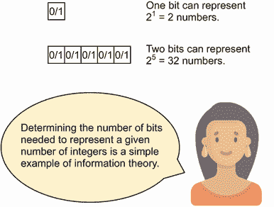

决策不确定性下，信息论中的重要概念是*熵*。熵度量了我们对未知数量的不确定程度。如果将这个未知数量建模为随机变量，熵度量的是随机变量可能取值的变异性。

注意: 这个不确定性度量，熵，与迄今为止我们所称的高斯过程预测中的不确定性有点相似，后者简单地是预测分布的标准差。

在本小节中，我们将进一步了解熵作为一个概念以及如何计算二元事件的伯努利分布的熵。我们展示熵如何成功地量化了对未知数量的不确定性。

让我们回到第一个概率论课的例子：抛硬币。假设你准备抛一枚有偏差的硬币，硬币以概率*p*（介于 0 和 1 之间）正面朝上，你想要推理这个硬币正面朝上的事件。用二进制随机变量*X*表示这个事件是否发生（即，如果硬币正面朝上，*X* = 1，否则*X* = 0）。那么，我们说*X*符合参数为*p*的伯努利分布，并且*X* = 1 的概率等于*p*。


在这里，*X*的熵定义为–*p* log *p* – (1 – *p*) log(1 – *p*)，其中*log*是以 2 为底的对数函数。我们看到这是一个关于硬币正面概率*p*的函数。图 6.1 展示了*p*在(0, 1)区间内熵函数的形状，从中我们可以得出一些见解：

+   熵始终为非负数。

+   当*p*小于 0.5 时，**熵**随*p*的增加而增加，在*p* = 0.5 时达到最高点，然后逐渐下降。

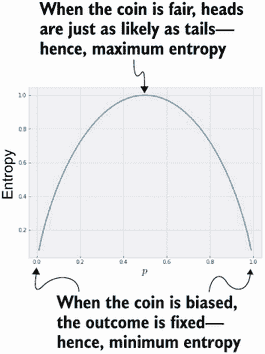

图 6.1 伯努利随机变量的熵作为成功概率的函数。当成功概率为 0.5 时，熵最大化（不确定性达到最高）。

当我们研究我们对硬币是否落在正面的不确定性时，这两种见解都是宝贵的。首先，我们不应该对某事物有负面不确定性，因此熵永远不是负数。更重要的是，熵在中间处达到最大值，当 *p* = 0.5 时。这是非常合理的：随着 *p* 离 0.5 越来越远，我们对事件结果的确定性越来越大—硬币是否落在正面。

例如，如果 *p* = 0.7，则我们更确定它会落在正面上—这里我们的熵约为 0.9。如果 *p* = 0.1，则我们对结果更确定（这次是它会落在反面上）—这里的熵大约是 0.5。虽然由于对数函数的原因，熵在端点处未定义，但当我们接近任一端点时，熵接近零，表示零不确定性。另一方面，当 *p* = 0.5 时，我们的不确定性达到最大值，因为我们对硬币是落正面还是反面最不确定。这些计算表明熵是不确定性的合适度量。

熵 vs. 标准差

当我们在之前的章节中使用术语 *不确定性* 时，我们指的是由 GP 产生的预测正态分布的标准差。分布的 *标准差* 正如其名称所示，衡量了分布内的值与平均值偏离的程度，因此是一种有效的不确定性度量。

熵，另一方面，是受到信息理论概念的启发，它也是一种有效的不确定性度量。事实上，它是一种更加优雅和通用的方法来量化不确定性，并且能更准确地模拟许多情况下的边缘情况中的不确定性。

定义 对于给定的概率分布，熵被定义为 –Σ*[i]* *p[i]* log *p[i]*，其中我们对不同可能的事件按 *i* 索引进行求和。

我们看到我们用于前述伯努利分布的公式是这个公式的一个特殊情况。我们在本章后面处理均匀分布时也使用了这个公式。

### 6.1.2 使用熵寻找遥控器

由于熵衡量了我们对感兴趣的数量或事件的知识中有多少不确定性，因此它可以指导我们的决策，帮助我们最有效地减少我们对数量或事件的不确定性。我们在本小节中看一个例子，我们在其中决定在哪里最好地寻找丢失的遥控器。虽然简单，但这个例子呈现了我们在后续讨论中使用的信息论推理，在那里熵被用于更复杂的决策问题。

想象一下，有一天，当你试图在客厅里打开电视时，你意识到找不到通常放在桌子上的遥控器。因此，你决定对这个遥控器进行搜索。首先，你推理说它应该在客厅的某个地方，但你不知道遥控器在客厅的哪个位置，所以所有的位置都是同样可能的。用我们一直在使用的概率推断的语言来说，你可以说遥控器位置的*分布*在客厅内是均匀的。


图 6.2 是寻找遥控器示例的一个样本平面图。客厅均匀阴影表示遥控器位置在客厅内的分布是均匀的。

图 6.2 可视化了你对遥控器位置的信念，用阴影标示的客厅表示遥控器所在的位置（根据你的信念）。现在，你可能会问自己这个问题：在这个房子里，你应该在哪里找遥控器？认为你应该在客厅里找到遥控器是合理的，而不是在浴室里，因为电视就在那里。但是，如何量化地证明这个选择是正确的呢？

信息理论，特别是熵，通过允许我们推理在客厅与浴室中寻找遥控器后还剩多少熵来提供了一种方法。也就是说，它允许我们确定在客厅里寻找遥控器后与在浴室里寻找遥控器后我们对遥控器位置的不确定性有多少。

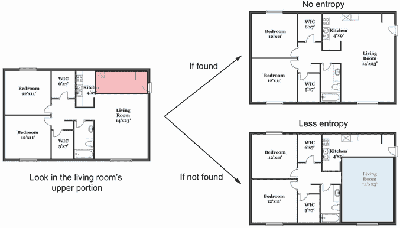

图 6.3 显示了在搜索了客厅的一部分后遥控器位置的熵。如果找到遥控器（右上角），则不再存在不确定性。否则，熵仍然会减少（右下角），因为遥控器位置的分布现在更窄了。

图 6.3 显示了一旦搜索了客厅的上部分，遥控器位置的熵如何减少。我们可以推理如下：

+   如果在搜索的区域内找到遥控器，那么你将不再对其位置有任何不确定性。换句话说，熵将为零。

+   如果没有找到遥控器，那么我们对遥控器位置的后验信念将被更新为右下角阴影区域。这个分布跨越的区域比图 6.2 中的区域要小，因此不确定性（熵）更小。

无论哪种方式，查找客厅指定部分的内容都会减少熵。那么，如果你决定在浴室里寻找遥控器会发生什么呢？图 6.4 显示了相应的推理：

+   如果在浴室里找到了遥控器，那么熵仍然会降到零。然而，根据你对遥控器位置的信念，这种情况不太可能发生。

+   如果遥控器在浴室中找不到，那么你对遥控器位置的后验信念不会从图 6.2 中改变，结果熵保持不变。

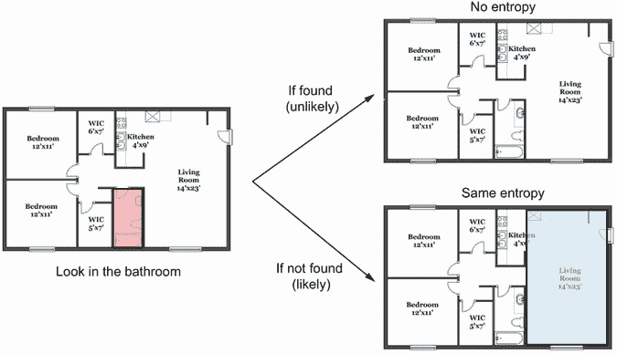

图 6.4 在搜索完浴室后，遥控器位置的熵。由于遥控器在浴室中找不到，遥控器位置的后验分布中的熵不变。

在浴室里搜索而没有找到遥控器并不会减少遥控器位置的熵。换句话说，在浴室里寻找并不提供有关遥控器位置的任何额外信息，因此根据信息论，这是次优的决定。

如果遥控器位置的先验分布（关于它在哪里的你的初始猜测）涵盖整个房子而不仅仅是客厅，那么这种比较就不会那么明显了。毕竟，遥控器被误放在客厅外的概率总是很小的。然而，决定在哪里寻找的过程——即能够为你提供有关遥控器位置最大信息的房子部分——仍然是相同的：

1.  考虑如果找到了遥控器的话，遥控器位置的后验分布，并计算该分布的熵。

1.  计算如果遥控器没有找到时的熵。

1.  计算两种情况下的平均熵。

1.  为考虑寻找的所有位置重复此计算，并选择给出最低熵的位置。

熵提供了一种用信息论方法量化我们对感兴趣的数量的不确定性的方法，利用其在概率分布中的信息。此过程使用熵来识别最大程度减少熵的行动。

注意 这是一个在许多不确定性下决策情况下适用的数学上优雅的过程。我们可以将这种基于熵的搜索过程看作是一种搜索真相的过程，我们的目标是通过最大程度地减少不确定性来尽可能地接近真相。

### 6.1.3 利用熵进行二进制搜索

为了进一步理解基于熵的搜索，我们现在看看这个过程如何在计算机科学中的经典算法之一：二分查找中体现。您很可能已经熟悉这个算法，所以我们在这里不会详细介绍。对于对二分查找有很好且适合初学者的解释，我推荐阅读 Aditya Bhargava 的《Grokking Algorithms》（Manning，2016）的第一章。从高层次上来说，当我们想要在一个排序列表中查找特定目标数字的位置，使得列表中的元素从第一个到最后一个元素递增时，我们使用二分查找。

提示 二分搜索的思想是查看列表的中间元素并将其与目标进行比较。 如果目标小于中间元素，则我们只查看列表的前一半；否则，我们查看后一半。 我们重复这个列表减半的过程，直到找到目标。

考虑一个具体的例子，我们有一个排序过的 100 个元素列表 [*x*[1]，*x*[2]，...，*x*[100]]，我们想要找到给定目标 *z* 的位置，假设 *z* 确实在排序列表中。

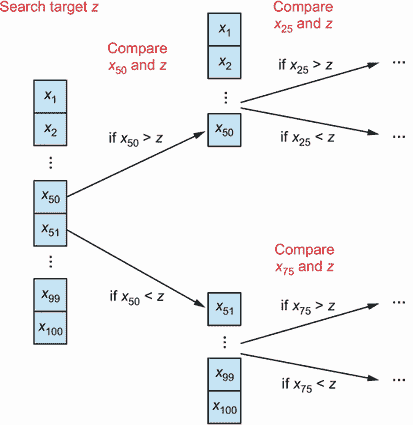

图 6.5 在 100 个元素列表上执行二分搜索的示例。 在搜索的每次迭代中，目标被与当前列表的中间元素进行比较。 根据这个比较的结果，我们将第一半或第二半列表从搜索空间中移除。

正如图 6.5 所示，二分搜索通过将列表分为两半进行工作：前 50 个元素和后 50 个元素。 由于我们知道列表是排序过的，我们知道以下内容：

+   如果我们的目标 *z* 小于第 50 个元素 *x*[50]，那么我们只需要考虑前 50 个元素，因为最后 50 个元素都大于目标 *z*。

+   如果我们的目标大于 *x*[50]，那么我们只需要查看列表的后一半。

终止搜索

对于图 6.5 中的每次比较，我们忽略*z*等于被比较的数字的情况，这种情况下我们可以简单地终止搜索。

平均而言，这个过程可以帮助我们更快地在列表中找到 *z* 的位置，比在列表中顺序搜索从一端到另一端要快得多。 如果我们从概率的角度来处理这个问题，二分搜索是在排序列表中的数字位置搜索游戏中基于信息理论作出最佳决策的实现目标的方法。

注意 二分搜索策略是寻找 *z* 的最佳解决方案，使我们能够比其他任何策略更快地找到它，平均来看。

首先，让我们用随机变量 *L* 表示我们目标 *z* 在排序列表中的位置。 这里，我们想要使用一个分布来描述我们对这个变量的信念。 由于从我们的角度来看，列表中的任何位置都同样可能包含 *z* 的值，我们使用均匀分布进行建模。

图 6.6 可视化了这种分布，再次表示我们对 *z* 位置的信念。 由于每个位置都与其他任何位置一样可能，特定位置包含 *z* 的概率是均匀的 1 ÷ 100，即 1%。


图 6.6 给出了 100 个元素列表中目标 *z* 位置的先验分布。 由于每个位置一样可能包含 *z*，特定位置包含 *z* 的概率为 1%。

注意 让我们尝试计算这个均匀分布的熵。记住，熵的公式是 *–Σ[i]* *p[i]* log *p[i]*，其中我们对不同可能事件 *i* 进行求和。这等于


因此，我们对 *L* 先验分布的不确定性大约为 6.64。

接下来，我们解决同样的问题：我们应该如何在这个 100 元素列表中搜索以尽快找到 *z*？我们通过遵循第 6.1.2 节描述的熵搜索过程来做到这一点，我们的目标是尽量减少我们关心的量的后验分布的熵，也就是说，在这种情况下是位置 *L*。

在检查了给定位置后，我们如何计算后验分布 *L* 的熵？这个计算要求我们推理在检查了给定位置后我们对 *L* 可以得出什么结论，这是相当容易做到的。假设我们决定检查第一个位置 *x*[1]。根据我们对 *L* 的信念，*L* 在这个位置的可能性为 1%，而在其余位置的可能性为 99%：

+   如果 *L* 确实在这个位置，那么关于 *L* 的后验熵将降为 0，因为对于这个量再也没有不确定性了。

+   否则，*L* 的分布将更新以反映出观察到 *z* 不是列表的第一个数字这一事实。

图 6.7 将这个过程显示为一个图表，我们需要更新 *L* 的分布，以便每个位置都有 1 ÷ 99，或大约 1.01% 的概率包含 *z*。每个位置仍然同样可能，但每个位置的概率稍微增加了一些，因为在这种假设的情况下，我们已经排除了第一个位置。

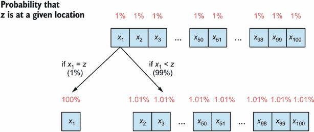

图 6.7 给出了在检查第一个元素后目标 *z* 在 100 元素列表中位置的后验分布。在每种情景中，*z* 在给定位置的概率会相应更新。

注意 再次说明，我们只考虑 *z* 存在于列表中的情况，所以要么列表中最小的元素 *x*[1] 等于 *z*，要么前者小于后者。

按照同样的计算，我们可以得到这个新分布的熵为


再次说明，这是在第二种情况下 *z* 不在第一个位置的情况下 *L* 的后验熵。我们需要采取的最后一步来计算在检查第一个位置后的总后验熵是取这两种情况的平均值：

+   如果 *z* 在第一个位置，这个可能性是 1%，那么后验熵为 0。

+   如果 *z* 不在第一个位置，这个可能性是 99%，那么后验熵为 6.63。

取平均值，我们有 0.01（0）+0.99（6.63）=6.56。因此，平均而言，当我们选择查看数组的第一个元素时，我们期望看到的后验熵为 6.56。现在，为了确定是否查看第一个元素是最佳决定，或者是否有更好的位置可以获取更多关于*L*的信息，我们需要重复此过程以检查列表中的其他位置。具体而言，对于给定的位置，我们需要

1.  在检查位置时迭代每个潜在的情况

1.  计算每个场景中*L*的后验熵

1.  基于每个场景的可能性来计算跨场景的平均后验熵

让我们再次为第 10 个位置*x*[10]做一次；相应的图示在图 6.8 中显示。虽然这种情况与我们刚刚讨论的稍有不同，但基本思想仍然相同。首先，当我们查看*x*[10]时，可能会出现各种情况：

1.  第 10 个元素*x*[10]可能大于*z*，在这种情况下，我们可以排除列表中的最后 91 个元素，并将搜索集中在前 9 个元素上。在这里，每个位置都有 11%的机会包含*z*，并且通过使用相同的公式，可以计算后验熵约为 3.17。

1.  第十个元素*x*[10]可能正好等于*z*，在这种情况下，我们的后验熵再次为零。

1.  第十个元素*x*[10]可能小于*z*，在这种情况下，我们将搜索范围缩小到最后 90 个元素。在这种情况下，后验熵约为 6.49。


在检查第 10 个元素时，目标*z*在 100 个元素列表中的后验分布。在每种情况下，*z*在给定位置的概率会相应更新。

注意确保自己尝试熵计算，以了解我们是如何得到这些数字的。

最后，我们使用相应的概率对这些熵进行加权平均：0.09（3.17）+0.01（0）+0.9（6.49）=6.13。这个数字表示了预期的后验熵——即，在检查第 10 个元素*x*[10]后，我们对*L*的位置*z*的预期后验不确定性。

与第一个元素*x*[1]的相同数量，6.56，相比，我们得出结论：平均而言，查看*x*[10]比查看*x*[1]给我们更多关于*L*的信息。换句话说，从信息理论的角度来看，检查*x*[10]是更好的决定。

但从信息理论的角度来看，什么是最佳决定——哪个给我们*L*的最多信息？为了确定这一点，我们只需为列表中的其他位置重复刚刚对*x*[1]和*x*[10]执行的计算，并挑选出具有最低预期后验熵的位置。

图 6.9 展示了我们所寻找目标的预期后验熵随我们选择的检查位置而变化的情况。我们首先注意到曲线的对称性：只看最后一个位置与只看第一个位置的预期后验熵（不确定性）是相等的；同样地，第 10 个位置和第 90 个位置给我们提供的信息是一样的。

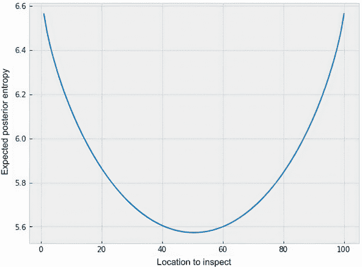

图 6.9 展示了随着检查列表中位置的变化，目标的预期后验熵如何变化。检查中间位置是最优的，可以最小化预期熵。

更为重要的是，我们可以看到只有检查中间位置，也就是列表的第 50 个或第 51 个位置，才能提供最大的信息量。这是因为，一旦我们这样做了，无论我们的目标数字大于还是小于中间数字，我们都能排除一半的列表。但对于其他位置并非如此。如前所述，当我们检查第 10 个数字时，可能能排除列表中的 90 个数字，但这只有 0.1 的概率。而当我们检查第一个数字时，99%的概率是只能排除一个数字。

注意在平均上，只检查中间的数字最大化我们获得的信息。

寻找目标的其余流程遵循同样的程序：计算每个决策可能导致的预期后验熵，然后选择使得后验熵最小的决策。由于每次更新后我们所处理的概率分布总是一个均匀分布，因此最优的检查位置总是还没有被排除的中间位置。

这正是二分查找的策略！从信息论角度来看，二分查找是在有序列表中查找数字的最优解决方案。

用信息论证明二分查找

当我第一次学习这个算法时，我记得曾经认为在数组中间搜索的策略似乎是独特的且来源神秘。然而，我们刚刚从信息理论的角度推导出了相同的解决方案，这明确量化了在服务于获得尽可能多的信息或减少尽可能多的熵的目的下，排除一半的搜索空间的想法。

信息论和熵的应用不仅限于二分搜索。正如我们所见，我们经历的过程可以推广到其他决策问题：如果我们能够用概率分布来建模我们感兴趣的问题，包括未知数量、我们可以采取的行动以及在采取行动时如何更新分布，那么我们可以再次选择在信息理论的框架下的最优行动，这是能够最大程度减少我们对感兴趣的数量的不确定性的行动。在本章的剩余部分，我们将学习如何将这个想法应用到 BayesOpt，并使用 BoTorch 实现由此产生的熵搜索策略。

## 6.2 BayesOpt 中的熵搜索

采用前一节提出的相同方法，我们在 BayesOpt 中获得了熵搜索策略。主要思想是选择我们的行动，我们的实验，以便我们可以在我们关心的后验分布中减少最大数量的熵。在本节中，我们首先讨论如何在高层次上做到这一点，然后转移到在 BoTorch 中实现。

### 6.2.1 使用信息理论搜索最优解

在我们的遥控器示例中，我们的目标是在公寓内搜索遥控器，因此希望减少遥控器位置分布的熵。在二分搜索中，过程类似：我们的目标是在列表中搜索我们想要搜索的特定数字的位置，并且我们希望减少该数字的分布的熵。现在，要设计一个熵搜索策略，我们必须确定在 BayesOpt 中使用什么作为我们的目标以及如何使用信息理论来辅助搜索过程，这是我们在这里要学习的。

回想一下我们在使用 BayesOpt 时的最终目标：在黑盒函数的定义域*D*内搜索函数最大化的位置。这意味着我们的自然搜索目标是使函数的目标值最大化的位置*x*，即*f* = f(x*)* ≥ *f(x)*，对于*D*中的所有*x*。

定义 最优位置*x*通常称为目标函数*f*的*优化器*。

给定对目标函数*f*的 GP 信念，存在对优化器*x*的相应概率信念，它被视为随机变量。图 6.10 显示了一个经过训练的 GP 的示例以及从 GP 中导出的目标优化器*x*的分布。需要牢记这个分布的一些有趣特征：

+   分布复杂且多峰（具有几个局部最优解）。

+   优化器*x*最有可能的位置在零的左边一点。这是 GP 的预测均值最大化的地方。

+   优化器*x*位于端点-5 或 5 的概率不可忽略。

+   *x*大约为 2 的概率几乎为零，这对应于我们已经观察到的高于*f*(2)的目标值。

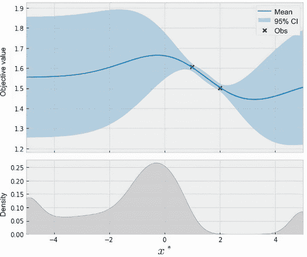

图 6.10 GP 信念（顶部）和函数优化器*x*的分布（底部）。优化器的分布是非高斯的，相当复杂，这对建模和决策提出了挑战。

这些特征使得建模优化器*x*的分布变得非常具有挑战性。衡量这个量*x*分布的最简单方法就是从 GP 中简单地抽取许多样本，并记录每个样本被最大化的位置。事实上，这就是图 6.10 生成的方法。

更糟糕的是，当目标函数的维度（输入向量*x*的长度或每个*x*具有的特征数量）增加时，我们需要指数级别的样本来估计*x*的分布。

定义 这是维度诅咒的一个例子，在机器学习中，它经常用来指代与感兴趣对象的维度相关的许多过程的指数成本。

要在 BayesOpt 中使用熵搜索，我们需要对最优解的位置*x*的信念建模，使用概率分布。然而，我们无法精确地建模优化器*x*的分布；相反，我们必须使用从 GP 中抽取的样本来近似它。不幸的是，随着目标函数中维度的增加（*x*的长度），这个过程很快就变得计算昂贵起来。

注意 实际上，有研究论文在 BayesOpt 中寻求使用熵来搜索优化器*x*的位置。然而，由此产生的策略通常运行起来成本过高，且未在 BoTorch 中实现。

但这并不意味着我们需要完全放弃在 BayesOpt 中使用信息理论的努力。这只意味着我们需要修改我们的搜索过程，使其更适合计算方法。一个简单的方法是针对除了优化器*x*之外的其他量，一方面与寻找*x*相关联，另一方面更容易进行推理。

在优化中的一个感兴趣的量，除了优化器*x*之外，就是在优化器处实现的最优值*f* = *f*(*x*)，它也是一个随机变量，根据我们对目标函数*f*的 GP 信念而定。正如大家可以想象的那样，了解最优值*f*可能会告诉我们很多关于优化器*x*的信息；也就是说，这两个量在信息理论上是相关联的。然而，最优值*f*比优化器*x*更容易处理，因为前者只是一个实数值，而后者是一个长度等于目标函数维度的向量。

图 6.11 右侧面板显示了由 GP 诱导的最优值*f**的分布示例。我们看到，这个分布大致截断在 1.6 左右，这恰好是我们训练数据集中的现任值；这是有道理的，因为最优值*f**必须至少是现任值 1.6。

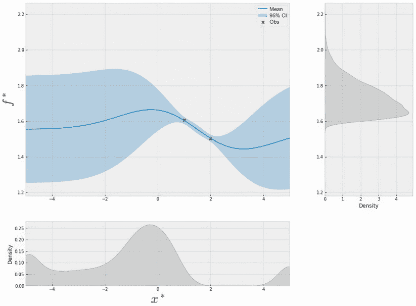

图 6.11 GP 信念（左上）、函数优化器*x**的分布（底部）以及最优值*f**的分布（右）。最优值的分布始终是一维的，因此比优化器的分布更容易处理。

注意 将我们的努力集中在*f**的分布上的主要优势在于，不管目标函数的维度如何，该分布始终是一维的。

具体来说，我们可以从这个一维分布中抽样来近似查询后验熵的期望。从这一点出发，我们遵循熵搜索背后的相同思想：选择（近似）最小化期望后验熵的查询，换句话说，最大化熵的*减少*。

定义 通过使用这个期望熵减少量作为获取得分，我们得到了*最大值熵搜索*（MES）策略。术语*最大值*表示我们正在使用信息理论来搜索最大值，或目标函数的最优值*f**。

图 6.12 在底部面板显示了我们运行示例中的 MES 获取得分，根据这个信息理论基础的准则，我们应该在约为-2 的位置查询下一个点。MES 策略更喜欢这个位置，因为它既有相对较高的均值又有较高的 CI，因此平衡了探索和利用。

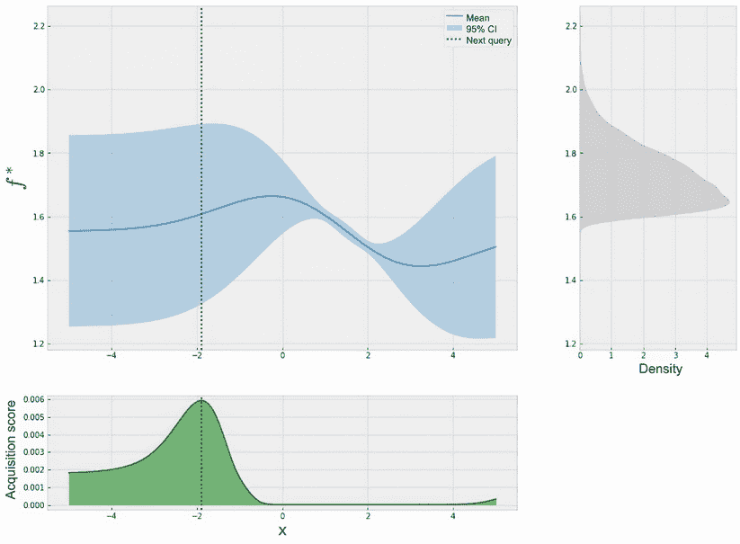

图 6.12 GP 信念（左上）、最优值*f**的分布（右）以及用作获取函数得分的近似期望熵减少量。最优值的分布始终是一维的，因此比优化器的分布更容易处理。

有趣的是，这里的收益情况看起来与优化器*x**的分布有些相似，如图 6.11 所示，我们看到曲线

1.  在中间某处达到顶峰

1.  在端点处达到一个非零值

1.  在 2 附近达到 0，我们确切知道该位置不是最佳的

这表明最优值*f**与优化器*x**密切相关，虽然我们通过改变我们的目标失去了一些信息，但搜索*f**是搜索*x**的一个良好代理，并且计算上更容易处理。

### 6.2.2 使用 BoTorch 实现熵搜索

讨论了 MES 背后的高层思想后，我们现在准备使用 BoTorch 实现它，并将其插入我们的优化管道中。MES 策略由 `botorch.acquisition.max_value_entropy_search` 中的 `qMaxValueEntropy` 类实现为一个 PyTorch 模块，类似于我们之前见过的大多数贝叶斯优化策略。当初始化时，这个类接受两个参数：一个 GPyTorch GP 模型和一组将用作前面部分描述的近似过程中样本的点。

尽管有许多方法可以生成这些样本点，但我们从 5.3.2 节学到的一种特殊方式是使用 Sobol 序列，它更好地覆盖了目标空间。总的来说，MES 策略的实现如下所示：

```py
num_candidates = 1000                                    ❶
sobol = torch.quasirandom.SobolEngine(1, scramble=True)  ❶
candidate_x = sobol.draw(num_candidates)                 ❶

candidate_x = 10 * candidate_x - 5                       ❷

policy = botorch.acquisition.max_value_entropy_search
➥.qMaxValueEntropy(                                     ❸
    model, candidate_x                                   ❸
)                                                        ❸

with torch.no_grad():                                    ❹
    acquisition_score = policy(xs.unsqueeze(1))          ❹
```

❶ 使用 Sobol 序列在 0 和 1 之间生成样本

❷ 重新缩放样本以使其位于域内

❸ 声明 MES 策略对象

❹ 计算获取分数

这里，`num_candidates` 是一个可调参数，它设置了在 MES 计算中您想要使用的样本数量。较大的值意味着更高保真度的近似，但这将带来更高的计算成本。

现在让我们将此代码应用于我们正在解决的优化一维 Forrester 函数的问题中，该函数在 CH06/01 - BayesOpt loop.ipynb 笔记本中实现。我们已经熟悉大部分代码，所以我们不在这里详细介绍。

图 6.13 展示了 MES 对 10 个查询的进展，其中策略在五次查询后迅速找到了 Forrester 函数的全局最优解。有趣的是，随着优化的进行，我们对于查看搜索空间中的其他区域不会导致任何实质性熵减少越来越确信，这有助于我们保持接近最优位置。


图 6.13 MES 策略的进展。策略在五次查询后迅速找到全局最优解。

我们已经看到信息理论为我们提供了一个基于数学的、优雅的决策框架，围绕着尽可能多地了解感兴趣的数量。这归结为减少模型我们关心的数量的预期后验熵。

在贝叶斯优化中，我们看到直接将这个过程进行转换在模型化目标函数的最优值的位置方面存在计算挑战，这是我们的主要搜索目标。相反，我们将重点转移到目标函数本身的最优值，使计算更易处理。幸运的是，所有这些数学内容都被 BoTorch 很好地抽象出来，留下了一个方便的、模块化的接口，我们可以将其插入任何优化问题中。

这也是关于 BayesOpt 策略的书的第二部分的结束。最后三章涵盖了一些最常用的启发式方法来进行 BayesOpt 中的决策以及相应的策略，从寻求改进到借用多臂老虎机方法，以及在本章中使用信息理论。

本书的剩余部分将我们的讨论提升到一个新的水平，介绍了与我们迄今所见不同的特殊优化设置，在这些设置中，我们在优化的每一步都会顺序观察一个单独的数据点。这些章节表明了我们学到的方法可以被转化为现实世界中的实际设置，以加速优化。

## 6.3 练习

本章有两个练习：

1.  第一个练习涵盖了一种二分搜索的变体，在这种搜索中可以考虑先前的信息来做决策。

1.  第二个练习讲解了在先前章节中出现的超参数调整问题中实施 MES 的过程。

### 6.3.1 练习 1：将先验知识纳入熵搜索

我们在第 6.1.3 节中看到，通过在数组中目标位置上放置均匀先验分布，最优的信息理论搜索决策是将数组切分一半。如果均匀分布不能忠实地表示你的先验信念，你想使用不同的分布会发生什么？这个练习在 CH06/02 - Exercise 1.ipynb 笔记本中实现，向我们展示了这个例子以及如何推导出结果的最优决策。解决这个练习应该会帮助我们进一步欣赏熵搜索作为一种在不确定性下的通用决策过程的优雅和灵活性。

想象一下以下情景：你在一个电话制造公司的质量控制部门工作，你目前的项目是对公司最新产品的外壳的耐用性进行压力测试。具体来说，你的团队想要找出从一个 10 层楼的建筑的哪一层楼可以将手机扔到地上而不会摔坏。有一些规则适用：

+   制造手机的工程师确定如果从一楼扔下手机，它不会摔坏。

+   如果手机从某个楼层掉下来时摔坏了，那么它也会在更高的楼层掉下时摔坏。

你的任务是找出可以从中扔手机而不会摔坏的最高楼层 — 我们将这个未知楼层称为 *X* — 通过进行试验。也就是说，你必须从特定楼层扔真正的手机来确定 *X*。问题是：你应该如何选择从哪些楼层扔手机以找到 *X*？由于手机很昂贵，你需要尽量少进行试验，并且希望使用信息理论来辅助搜索：

1.  假设通过考虑物理学、手机的材料和构造，工程师们对可能的楼层有一个初始猜测。

    具体来说，*X* 的先验分布是指数型的，即*X* 等于一个数字的概率与该数字的倒数成指数关系：*Pr*(*X* = *n*) = 1 / 2^(*n*)，对于*n* = 1, 2, ..., 9；与最高（第十）层对应的概率是*Pr*(*X* = 10) = 1 / 2⁹。因此，*X* = 1 的概率为 50%，随着数字的增加，这个概率减半。这个概率分布在图 6.14 中可视化。

    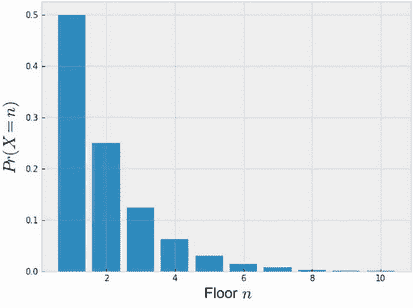

    图 6.14 *X* 等于 1 到 10 之间的数字的概率（即，当手机从高楼掉落时不会摔碎的最高楼层的概率）

    确认这是一个有效的概率分布，方法是证明概率之和等于一。也就是说，证明*Pr*(*X* = 1) + *Pr*(*X* = 2) + ... + *Pr*(*X* = 10) = 1。

1.  使用第 6.1.1 节末尾给出的公式计算这个先验分布的熵。

1.  给定在 1 到 10 之间定义的先验分布，从第二层掉落时手机摔碎的概率是多少？第五层呢？第一层呢？

1.  假设在观察任何试验结果之后，*X* 的后验分布再次是指数型的，并且在最低和最高可能的楼层之间定义。

    例如，如果观察到手机从五楼掉落时不会摔碎，那么我们知道*X*至少为 5，*X* 的后验分布是这样的，*Pr*(*X* = 5) = 1 / 2，*Pr*(*X* = 6) = 1 / 4，...，*Pr*(*X* = 9) = 1 / 32，*Pr*(*X* = 10) = 1 / 32。另一方面，如果手机从五楼掉落时摔碎了，那么我们知道*X*至多为 4，后验分布是这样的，*Pr*(*X* = 1) = 1 / 2，*Pr*(*X* = 2) = 1 / 4，*Pr*(*X* = 3) = 1 / 8，*Pr*(*X* = 4) = 1 / 8。图 6.15 显示了这两种情况。

    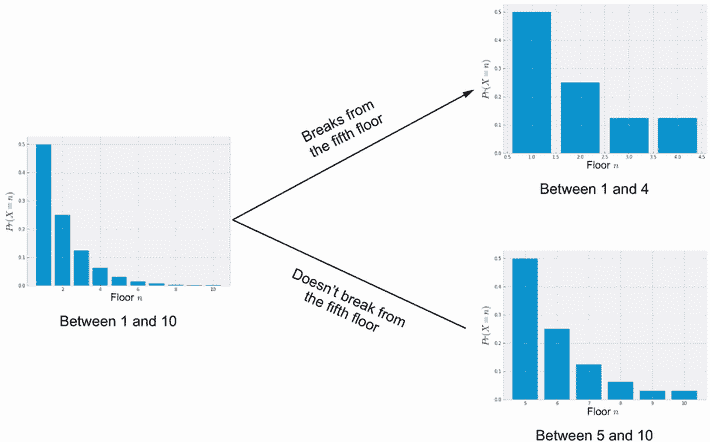

    图 6.15 当手机从五楼掉落时*X*的两种情况下的后验概率分布。每个后验分布仍然是指数型的。

    计算这个虚构的后验分布在这两种情况下的熵。

1.  给定先验分布，在你对第五层进行一次试验之后（即，你从第五层扔手机并观察是否摔碎），计算期望后验熵。

1.  计算其他楼层的预期后验熵。哪一层楼的熵减少最多？这仍然与二分搜索的结果相同吗？如果不是，发生了什么变化？

### 6.3.2 练习 2：贝叶斯优化用于超参数调整

此练习在 CH06/03 - Exercise 2.ipynb 笔记本中实现，将 BayesOpt 应用于模拟超参数调整任务中支持向量机模型的准确度表面的目标函数。 *x*轴表示惩罚参数*C*的值，而*y*轴表示 RBF 核参数*γ*的值。有关更多详细信息，请参阅第三章和第四章的练习。完成以下步骤：

1.  在 CH05/03 - Exercise 2.ipynb 笔记本中重新创建 BayesOpt 循环，包括实现重复实验的外部循环。

1.  运行 MES 策略。由于我们的目标函数是二维的，我们应该增加 MES 使用的 Sobol 序列的大小。例如，您可以将其设置为 2,000。观察其聚合性能。

BayesOpt 中的重复实验

参考第四章练习 2 的第 9 步，看看我们如何在 BayesOpt 中运行重复实验。

## 摘要

+   信息论研究信息的表示、量化和传输。该领域的核心概念之一是熵，它量化了我们对随机变量的不确定性，根据变量的概率分布。

+   熵搜索过程考虑通过采取行动减少量化的期望熵（因此减少不确定性）的感兴趣数量。我们可以将这个通用过程应用于许多不确定性下的决策问题。

+   二进制搜索可能是将熵搜索应用于在排序数组中找到特定数字位置的问题的结果。

+   维度诅咒是指与所关注对象的维度相对应的许多 ML 过程的指数成本。随着维度的增加，完成该过程所需的时间呈指数增长。

+   在 BayesOpt 中，虽然熵搜索可以应用于寻找函数优化器位置的问题，但由于维度诅咒，它的计算成本很高。

+   为了克服维度诅咒，我们修改了找到函数优化值的目标，将其变为一维搜索问题。由此产生的 BayesOpt 策略称为最大值熵搜索（MES）。

+   由于由 GP 模型的全局最优的复杂行为，计算 MES 的收购分数的封闭形式是不可行的。但是，我们可以从概率分布中抽取样本来近似获得收购分数。

+   在 BoTorch 中实现 MES 遵循与实现其他 BayesOpt 策略相同的过程。为了促进收购分数近似中的采样过程，我们在初始化策略对象时使用 Sobol 序列。
