# 附录：练习的解决方案

## 第二章 A.1: 高斯过程作为函数分布

在这个练习中，我们对我们在第一章看到的真实数据集进行了 GP 训练。 解决方案包含在 CH02/02 - Exercise.ipynb 笔记本中。 完成以下步骤：

1.  创建四维数据集。

    首先，我们导入必要的库：PyTorch 用于数组/张量操作，GPyTorch 用于 GP 建模，Matplotlib 用于可视化：

    ```py
    import torch
    import gpytorch
    import matplotlib.pyplot as plt
    ```

    然后，我们将表中的数字存储在两个 PyTorch 张量中，`train_x` 和 `train_y`，分别包含数据集的特征和标签：

    ```py
    train_x = torch.tensor(
        [
            [1 / 2, 1 / 2, 0, 0],
            [1 / 3, 1 / 3, 1 / 3, 0],
            [0, 1 / 2, 1 / 2, 0],
            [0, 1 / 3, 1 / 3, 1 / 3],
        ]
    )

    train_y = torch.tensor([192.08, 258.30, 187.24, 188.54])
    ```

1.  通过从所有值中减去均值并将结果除以它们的标准差来标准化第五列。

    我们按如下方式标准化标签：

    ```py
    # normalize the labels
    train_y = (train_y - train_y.mean()) / train_y.std()
    ```

    打印出时，`train_y` 应该包含以下值：`tensor([-0.4183,` `1.4974,` `-0.5583,` `-0.5207])`。

1.  将前四列视为特征，第五列为标签。 在这个数据上训练一个 GP。

    我们如下重新实现我们的 GP 模型类：

    ```py
    class BaseGPModel(gpytorch.models.ExactGP):
        def __init__(self, train_x, train_y, likelihood):
            super().__init__(train_x, train_y, likelihood)
            self.mean_module = gpytorch.means.ZeroMean()
            self.covar_module = gpytorch.kernels.RBFKernel()

        def forward(self, x):
            mean_x = self.mean_module(x)
            covar_x = self.covar_module(x)
            return gpytorch.distributions.MultivariateNormal(mean_x, covar_x)
    ```

    然后，我们用我们的训练数据初始化这个类的对象：

    ```py
    lengthscale = 1
    noise = 1e-4

    likelihood = gpytorch.likelihoods.GaussianLikelihood()
    model = BaseGPModel(train_x, train_y, likelihood)

    model.covar_module.lengthscale = lengthscale
    model.likelihood.noise = noise

    model.eval()
    likelihood.eval()
    ```

1.  创建一个包含百分之零锗和锰的组合的测试数据集。

    要组装我们的测试数据集，我们首先为第一列和第二列创建一个跨越单位正方形的网格：

    ```py
    grid_x = torch.linspace(0, 1, 101)

    grid_x1, grid_x2 = torch.meshgrid(grid_x, grid_x, indexing="ij")
    ```

    这前两列存储在 `grid_x1` 和 `grid_x2` 中。 然后，我们在 `grid_x1` 和 `grid_x2` 中附加两个额外的全零列，完成了具有四列的测试集：

    ```py
    xs = torch.vstack(
        [
            grid_x1.flatten(),      ❶
            grid_x2.flatten(),      ❷
            torch.zeros(101 ** 2),  ❸
            torch.zeros(101 ** 2),  ❹
        ]
    ).transpose(-1, -2)
    ```

    ❶ 第一列

    ❷ 第二列

    ❸ 第三列，包含全零

    ❹ 第四列，包含全零

1.  预测这个测试集的混合温度。

    要在这个测试集上进行预测，我们只需在`torch.no_grad()`上下文中通过我们的 GP 模型传递 `xs`：

    ```py
    with torch.no_grad():
        predictive_distribution = likelihood(model(xs))
        predictive_mean = predictive_distribution.mean
        predictive_stddev = predictive_distribution.stddev
    ```

1.  可视化预测。

    要可视化这些预测，我们首先创建一个具有两个面板（即，两个 Matplotlib 子图）的图：

    ```py
    fig, ax = plt.subplots(1, 2, figsize=(16, 6))
    ```

    然后，我们使用`plt.imshow()`将均值和标准差向量可视化为热图，确保将这两个向量重塑为方阵：

    ```py
    c = ax[0].imshow(
        predictive_mean.detach().reshape(101, 101).transpose(-1, -2),
        origin="lower",
        extent=[0, 1, 0, 1],
    )                            ❶

    c = ax[1].imshow(
        predictive_stddev.detach().reshape(101, 101).transpose(-1, -2),
        origin="lower",
        extent=[0, 1, 0, 1],
    )                            ❷
    plt.colorbar(c, ax=ax[1])
    ```

    ❶ 预测均值的热图

    ❷ 预测标准差的热图

    这将创建类似于图 A.1 中的图。

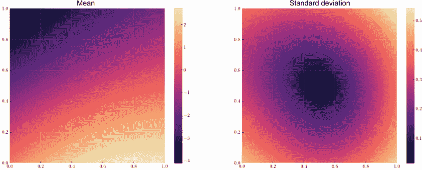

图 A.1 GP 在二维空间上的预测

注意 如果您使用不同的 GP 实现，则完全有可能生成与图 A.1 中略有不同的热图。 只要热图的一般趋势相同，您的解决方案就是正确的。

## 第三章 A.2: 使用均值和协方差函数结合先验知识

该练习提供了使用自动相关性确定（ARD）的 GP 模型的实践。 解决方案包含在 CH03/03 - Exercise.ipynb 中。 完成以下步骤：

1.  使用 PyTorch 在 Python 中实现二维函数。

    首先，我们导入必要的库——PyTorch 用于数组/张量操作，GPyTorch 用于 GP 建模，Matplotlib 用于可视化：

    ```py
    import torch
    import gpytorch
    import matplotlib.pyplot as plt
    ```

    然后使用给定的公式实现目标函数：

    ```py
    def f(x):
        return (
            torch.sin(5 * x[..., 0] / 2 - 2.5) * torch.cos(2.5 - 5 * x[..., 1])
            + (5 * x[..., 1] / 2 + 0.5) ** 2 / 10
        ) / 5 + 0.2
    ```

1.  在域[`0,` `2`]²上可视化函数。

    要可视化函数，我们需要创建一个网格来表示域。我们将这个网格存储在`xs`中：

    ```py
    lb = 0
    ub = 2
    xs = torch.linspace(lb, ub, 101)                                   ❶
    x1, x2 = torch.meshgrid(xs, xs)
    xs = torch.vstack((x1.flatten(), x2.flatten())).transpose(-1, -2)  ❷
    ```

    ❶ 一维网格

    ❷ 二维网格

    然后我们可以通过将`xs`传递给`f()`来在这个网格上获取函数值。结果存储在`ys`中：

    ```py
    ys = f(xs)
    ```

    我们使用`plt.imshow()`将`ys`可视化为热图：

    ```py
    plt.imshow(ys.reshape(101, 101).T, origin="lower", extent=[lb, ub, lb, ub])
    ```

1.  从域[`0,` `2`]²中随机抽取 100 个数据点。这将作为我们的训练数据。

    要在域内随机抽取 100 个点，我们使用`torch.rand()`从单位正方形中进行抽样，然后将结果乘以 2 以将其缩放到我们的域中：

    ```py
    torch.manual_seed(0)
    train_x = torch.rand(size=(100, 2)) * 2
    ```

    这些点的函数值可以通过调用`f(train_x)`来获取：

    ```py
    train_y = f(train_x)
    ```

1.  使用常数均值函数和作为`gpytorch.kernels.ScaleKernel`对象实现输出尺度的 Matérn 5/2 核来实现一个 GP 模型。我们按照如下指定实现我们的 GP 模型：

    ```py
    class GPModel(gpytorch.models.ExactGP):
        def __init__(self, train_x, train_y, likelihood):
            super().__init__(train_x, train_y, likelihood)
            self.mean_module = gpytorch.means.ConstantMean()
            self.covar_module = gpytorch.kernels.ScaleKernel(
                gpytorch.kernels.MaternKernel(
                    nu=2.5,
                    ard_num_dims=None    ❶
                )
            )

        def forward(self, x):
            mean_x = self.mean_module(x)
            covar_x = self.covar_module(x)
            return gpytorch.distributions.MultivariateNormal(mean_x, covar_x)
    ```

    ❶ 设置为 None 以禁用 ARD，设置为 2 以启用 ARD。

1.  在初始化核对象时不要指定`ard_num_dims`参数，或者将参数设置为`None`。

    这是在先前的代码中完成的。

1.  使用梯度下降训练 GP 模型的超参数，并在训练后检查长度尺度。

    我们初始化我们的 GP 并使用梯度下降进行 500 次迭代训练，如下所示：

    ```py
    noise = 1e-4

    likelihood = gpytorch.likelihoods.GaussianLikelihood()
    model = GPModel(train_x, train_y, likelihood)

    model.likelihood.noise = noise

    optimizer = torch.optim.Adam(model.parameters(), lr=0.01)
    mll = gpytorch.mlls.ExactMarginalLogLikelihood(likelihood, model)

    model.train()                    ❶
    likelihood.train()               ❶

    losses = []
    for i in tqdm(range(500)):       ❷
        optimizer.zero_grad()        ❷

        output = model(train_x)      ❷
        loss = -mll(output, train_y) ❷

        loss.backward()              ❷
        losses.append(loss.item())   ❷

        optimizer.step()             ❷

    model.eval()                     ❸
    likelihood.eval()                ❸
    ```

    ❶ 启用训练模型

    ❷ 梯度下降来优化 GP 的超参数

    ❸ 启用预测模型

    经过这 500 次迭代，我们通过打印以下数值来检查长度尺度：

    ```py
    >>> model.covar_module.base_kernel.lengthscale
    tensor([[1.1535]])
    ```

    换句话说，优化的长度尺度大约等于 1.15。

1.  重新定义 GP 模型类，这次将`ard_num_dims`设置为`2`。

    在`GPModel`类中设置`ard_num_dims=2`，然后重新运行所有代码单元格，我们得到以下长度尺度的数值：

    ```py
    >>> model.covar_module.base_kernel.lengthscale
    tensor([[1.6960, 0.8739]])
    ```

    在这里，第一维的长度尺度很大（大约 1.70），而第二维的长度尺度很小（大约 0.87）。这对应于目标函数沿第二维变化更多的事实。

## A.3 第四章：使用基于改进的策略优化最佳结果

这一章节有两个练习：

1.  第一个涵盖了改进概率提高（PoI）策略的方法，使其能够更好地探索搜索空间。

1.  第二个将我们学到的两个 BayesOpt 策略应用于一个模拟的真实世界的超参数调整任务。

## A.3.1 练习 1：使用概率提高鼓励探索

这个练习在 CH04/02 - Exercise 1.ipynb 笔记本中实现，引导我们如何修改 PoI 以鼓励探索。完成以下步骤：

1.  在 CH04/01 - BayesOpt loop 笔记本中重新创建 BayesOpt 循环，该循环使用一维 Forrester 函数作为优化目标。

1.  在实现 BayesOpt 的`for`循环之前，声明一个名为`epsilon`的变量：

    ```py
    epsilon = 0.1
    ```

1.  在 `for` 循环内，像以前一样初始化 PoI 策略，但这次指定由 `best_f` 参数设置的现任阈值是现任值 *加上* 存储在 `epsilon` 中的值：

    ```py
    policy = botorch.acquisition.analytic.ProbabilityOfImprovement(
        model, best_f=train_y.max() + epsilon
    )
    ```

1.  重新运行笔记本，并观察是否此修改比原始 PoI 策略更好地优化性能，通过鼓励更多探索，如图 A.2 所示。

    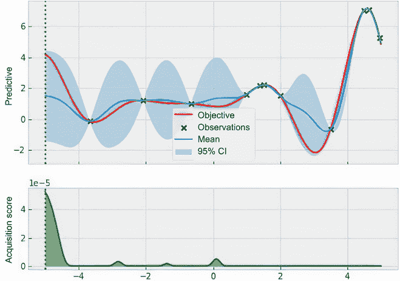

    图 A.2 修改后 PoI 在最后一次迭代中的优化进展。策略已经找到了最优解。

    在这里，修改后的 PoI 已经找到了最优解。

1.  PoI 变得更加探索性取决于存储在 `epsilon` 中的最小改进阈值的大小。将此变量设置为 0.001 并不足以鼓励探索，策略再次陷入困境。将此变量设置为 0.5 效果很好。

1.  实现一个相对最小改进阈值，要求改进达到 110%：

    ```py
    epsilon_pct = 0.1

    for i in range(num_queries):
        ...                                                    ❶

        policy = botorch.acquisition.analytic.ProbabilityOfImprovement(
            model, best_f=train_y.max() * (1 + epsilon_pct)    ❷
        )
    ```

    ❶ 省略

    ❷ 相对改进

## A.3.2 练习 2：超参数调优的 BayesOpt

此练习在 CH04/03 - Exercise 2.ipynb 中实现，将 BayesOpt 应用于模拟支持向量机模型在超参数调优任务中的准确度曲面的目标函数。完成以下步骤：

1.  在 CH04/01 - BayesOpt loop.ipynb 中重新创建 BayesOpt 循环。我们的目标函数实现为

    ```py
    def f(x):
        return (
            torch.sin(5 * x[..., 0] / 2 - 2.5)
            * torch.cos(2.5 - 5 * x[..., 1])
            + (5 * x[..., 1] / 2 + 0.5) ** 2 / 10
        ) / 5 + 0.2
    ```

1.  使用 `xs` 声明相应的测试数据，表示域的二维网格和 `xs` 的函数值的 `ys`：

    ```py
    lb = 0
    ub = 2
    num_queries = 20

    bounds = torch.tensor([[lb, lb], [ub, ub]], dtype=torch.float)

    xs = torch.linspace(lb, ub, 101)
    x1, x2 = torch.meshgrid(xs, xs)
    xs = torch.vstack((x1.flatten(), x2.flatten())).transpose(-1, -2)
    ys = f(xs)
    ```

1.  修改可视化优化进展的辅助函数。我们将此函数声明为 `visualize_progress_and_policy()`，该函数只需要一个策略对象和 `next_x` 作为要查询的下一个点。首先，函数计算测试数据 `xs` 的获取分数：

    ```py
    def visualize_progress_and_policy(policy, next_x=None):
        with torch.no_grad():
            acquisition_score = policy(xs.unsqueeze(1))

        ...    ❶
    ```

    ❶ 待续

    接下来，我们声明两个 Matplotlib 子图，并且对于第一个子图，绘制存储在 `ys` 中的真实情况：

    ```py
    c = ax[0].imshow(                                                    ❶
        ys.reshape(101, 101).T, origin="lower", extent=[lb, ub, lb, ub]  ❶
    )                                                                    ❶
    ax[0].set_xlabel(r"$C$", fontsize=20)
    ax[0].set_ylabel(r"$\gamma$", fontsize=20)
    plt.colorbar(c, ax=ax[0])

    ax[0].scatter(train_x[..., 0], train_x[..., 1], marker="x", c="k")   ❷
    ```

    ❶ 显示真实情况的热图

    ❷ 显示标记数据的散点图

    最后，我们在第二个子图中绘制另一个热图，显示获取分数：

    ```py
    c = ax[1].imshow(                           ❶
        acquisition_score.reshape(101, 101).T,  ❶
        origin="lower",                         ❶
        extent=[lb, ub, lb, ub]                 ❶
    )                                           ❶
    ax[1].set_xlabel(r"$C$", fontsize=20)
    plt.colorbar(c, ax=ax[1])
    ```

    ❶ 显示获取分数的热图

    我们可以选择显示 `next_x`：

    ```py
    if next_x is not None:
        ax[1].scatter(
            next_x[..., 0],
            next_x[..., 1],
            c="r",
            marker="*",
            s=500,
            label="next query"
        )
    ```

1.  从第三章的练习中复制 GP 类，该类实现了具有 ARD 的 Matérn 2.5 核。进一步修改此类以使其与 BoTorch 集成：

    ```py
    class GPModel(gpytorch.models.ExactGP,         ❶
      botorch.models.gpytorch.GPyTorchModel):      ❶
        _num_outputs = 1                           ❶

        def __init__(self, train_x, train_y, likelihood):
            super().__init__(train_x, train_y, likelihood)
            self.mean_module = gpytorch.means.ConstantMean()
            self.covar_module = gpytorch.kernels.  ❷
            ➥ScaleKernel(                         ❷
                gpytorch.kernels.MaternKernel(     ❷
                    nu=2.5,                        ❷
                    ard_num_dims=2                 ❷
                )                                  ❷
            )                                      ❷

        def forward(self, x):
            ...                                    ❸
    ```

    ❶ BoTorch 相关修改

    ❷ 具有 ARD 的 Matérn 2.5 核

    ❸ 省略

1.  重用辅助函数 `fit_gp_model()` 和实现 BayesOpt 的 `for` 循环。我们复制 `fit_gp_model()` 并声明初始数据集：

    ```py
    train_x = torch.tensor([
        [1., 1.],
    ])
    train_y = f(train_x)
    ```

    然后我们声明 BayesOpt 循环：

    ```py
    num_queries = 20

    for i in range(num_queries):
        print("iteration", i)
        print("incumbent", train_x[train_y.argmax()], train_y.max())

        model, likelihood = fit_gp_model(train_x, train_y)

        policy = ...              ❶

        next_x, acq_val = botorch.optim.optimize_acqf(
            policy,
            bounds=bounds,
            q=1,
            num_restarts=40,      ❷
            raw_samples=100,      ❷
        )

        visualize_progress_and_policy(policy,
        ➥next_x=next_x)          ❸

        next_y = f(next_x)

        train_x = torch.cat([train_x, next_x])
        train_y = torch.cat([train_y, next_y])
    ```

    ❶ 策略初始化的占位符

    ❷ 使搜索更加穷举

    ❸ 调用新的可视化辅助函数

1.  在这个目标函数上运行 PoI 策略。观察到该策略再次陷入局部最优。将初始化 BayesOpt 策略的行替换为

    ```py
    policy = botorch.acquisition.analytic.ProbabilityOfImprovement(
        model, best_f=train_y.max()
    )
    ```

    运行整个笔记本，显示策略再次陷入局部最优，如图 A.3 所示。

    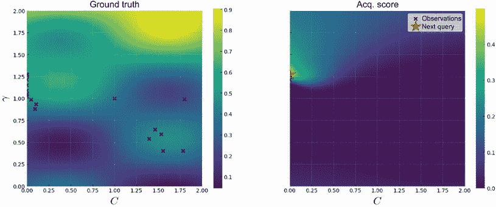

    图 A.3 显示了 PoI 在最后一次迭代中的优化进度。该策略被困在了一个局部最优解中。

1.  运行修改后的 PoI 版本，其中最小改进阈值设置为 0.1。将初始化 BayesOpt 策略的行替换为：

    ```py
    policy = botorch.acquisition.analytic.ProbabilityOfImprovement(
        model, best_f=train_y.max() + 0.1
    )
    ```

    该策略更具探索性，表现优于常规 PoI。图 A.4 显示了该策略在第 17 次迭代时的进展，其中它首次达到至少 90%的准确率。

    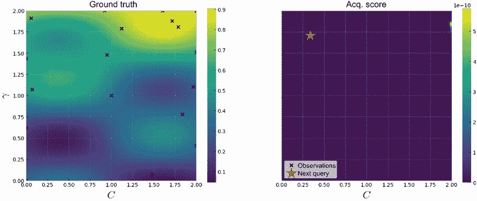

    图 A.4 显示了修改版 PoI 在第 17 次迭代中的优化进度，在该次迭代中，该策略首次达到至少 90%的准确率。

    在这里，C = 1.6770，*γ* = 1.9039 是提供此准确度的参数。

1.  在此目标函数上运行 Expected Improvement（EI）策略。用初始化 BayesOpt 策略的行替换：

    ```py
    policy = botorch.acquisition.analytic.ExpectedImprovement(
        model, best_f=train_y.max()
    )
    ```

    该策略在我们的目标函数上表现良好，如图 A.5 所示，在第 15 次迭代中找到了至少 90%的准确率。

    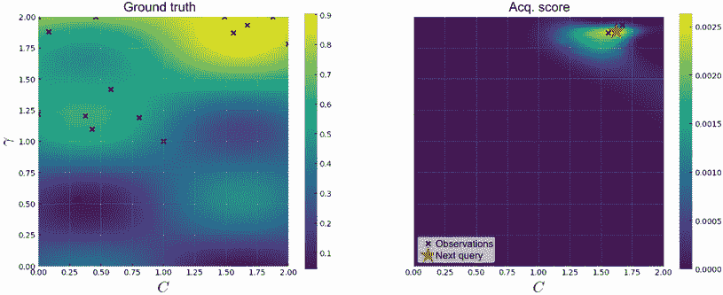

    图 A.5 显示了 EI 在第 4 次迭代中的优化进度，在该次迭代中，该策略首次达到至少 90%的准确率。

    在这里，*C* = 1.6331，*γ* = 1.8749 是提供此准确度的参数。

1.  实施重复实验，并可视化 10 个实验中的平均 incumbent 值和误差条。我们首先将实现 BayesOpt 循环的代码放入一个外部循环中，该循环迭代多个实验。我们在`incumbents`中的每一步跨实验存储每次最好的值：

    ```py
    num_repeats = 10

    incumbents = torch.zeros((num_repeats, num_queries))

    for trial in range(num_repeats):
        print("trial", trial)

        torch.manual_seed(trial)                      ❶
        train_x = bounds[0] + (bounds[1] - bounds[0]) ❶
        ➥* torch.rand(1, 2)                          ❶
        train_y = f(train_x)                          ❶

        for i in tqdm(range(num_queries)):
            incumbents[trial, i] = train_y.max()      ❷

            ...                                       ❸

    torch.save(incumbents, [path to file])            ❹
    ```

    ❶在搜索空间中均匀采样一个数据点作为起始点

    ❷跟踪最佳值

    ❸省略的代码与之前相同。

    ❹将结果保存到文件中，以便稍后可视化。

    然后我们实现一个帮助函数，绘制平均 incumbent 值和误差条。该函数读取保存在`path`中的 PyTorch tensor，该 tensor 应是前一步中`incumbents`的保存版本：

    ```py
    def show_agg_progress(path, name):
        def ci(y):                                             ❶
            return 2 * y.std(axis=0) / np.sqrt(num_repeats)    ❶

        incumbents = torch.load(path)                          ❷

        avg_incumbent = incumbents.mean(axis=0)                ❸
        ci_incumbent = ci(incumbents)                          ❸

        plt.plot(avg_incumbent, label=name)                    ❹
        plt.fill_between(                                      ❹
            np.arange(num_queries),                            ❹
            avg_incumbent + ci_incumbent,                      ❹
            avg_incumbent - ci_incumbent,                      ❹
            alpha=0.3,                                         ❹
        )                                                      ❹
    ```

    ❶计算误差条的辅助子函数

    ❷加载保存的优化结果

    ❸计算结果的平均值和误差条

    ❹可视化结果平均值和误差条

    然后我们可以运行我们在前面代码中拥有的策略，并比较它们的表现：

    ```py
    plt.figure(figsize=(8, 6))

    show_agg_progress([path to EI data], "EI")
    show_agg_progress([path to PoI data], "PoI")
    show_agg_progress([path to modified PoI data], "PoI" + r"$(\epsilon = 0.1)$")
    plt.xlabel("# queries")
    plt.ylabel("accuracy")

    plt.legend()

    plt.show()
    ```

    这生成了图 A.6，显示了 PoI、修改版 PoI 和 EI 的优化性能。

    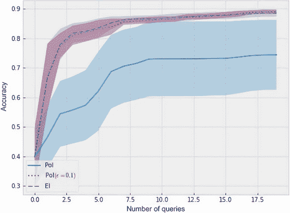

    图 A.6 显示了 10 个重复实验中各种策略的优化进度。

    我们发现图 A.6 比单次运行中的策略更具见解。在这里，PoI 的表现不如其他两个策略，而且其性能也不太稳健，从大的误差条中可以看出来。修改版 PoI 和 EI 表现相当，很难判断哪个更好，因为它们的误差条重叠。

## A.4 第五章：使用赌博工具风格的策略探索搜索空间

本章中有两个练习：

1.  第一个练习探索了一种为 UCB 策略设置权衡参数的潜在方法，该方法考虑了我们在优化中的进展情况。

1.  第二个练习将本章学到的两种策略应用于以前章节中看到的超参数调整问题。

## A.4.1 练习 1：为上置信界限设置探索计划

这个练习实现在 CH05/02 - Exercise 1.ipynb 中，讨论了自适应设置 UCB 策略权衡参数β值的策略。完成以下步骤：

1.  在 CH04/02 - Exercise 1.ipynb 中重新创建 BayesOpt 循环，该循环将一维 Forrester 函数作为优化目标。

    由于 BayesOpt 循环中有 10 次迭代，β乘以倍数*m* 10 次，从 1 到 10。也就是说，1 × *m*10 = 10。解决这个方程得到了倍数的代码：

    ```py
    num_queries = 10

    start_beta = 1
    end_beta = 10

    multiplier = (end_beta / start_beta) ** (1 / num_queries)
    ```

1.  实现这个调度逻辑，并观察结果的优化性能。

    我们对 BayesOpt 循环进行如下修改：

    ```py
    num_queries = 10

    start_beta = 1
    end_beta = 10

    multiplier = (end_beta / start_beta) ** (1 / num_queries)

    beta = start_beta

    for i in range(num_queries):
        ...                          ❶

        policy = botorch.acquisition.analytic.UpperConfidenceBound(
            model, beta=beta
        )

        ...                          ❷

        beta *= multiplier
    ```

    ❶ 获得训练好的 GP

    ❷ 找到最大化获取分数的点，查询目标函数，并更新训练数据

    此代码生成图 A.7。

    

    图 A.7 自适应 UCB 策略的进展。该策略能够摆脱局部最优解，并接近全局最优解。

    我们看到该策略在第五次迭代时检查了局部最优解，但最终能够逃脱并在最后接近全局最优解。

## A.4.2 练习 2：用于超参数调整的 BayesOpt

此练习实现在 CH05/03 - Exercise 2.ipynb 中，将 BayesOpt 应用于模拟超参数调整任务中支持向量机模型准确率表面的目标函数。完成以下步骤：

1.  在 CH04/03 - Exercise 2.ipynb 中重新创建 BayesOpt 循环，包括实施重复实验的外部循环。

1.  运行 UCB 策略，将权衡参数的值设置为β ∈ { 1, 3, 10, 30 }，并观察值的聚合性能。

    可以在初始化策略对象时设置权衡参数的值：

    ```py
    policy = botorch.acquisition.analytic.UpperConfidenceBound(
        model, beta=[some value]
    )
    ```

    图 A.8 显示了四个版本 UCB 的优化性能。我们看到当β = 1 时，策略过于探索，性能最差。

    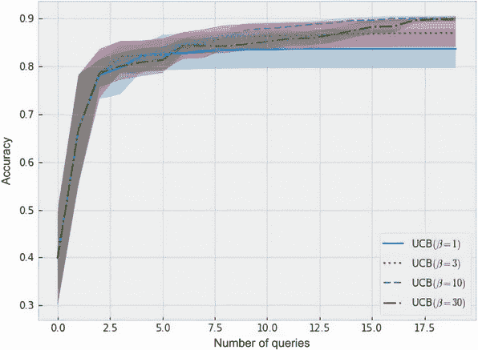

    图 A.8 不同 UCB 策略的进展

    随着权衡参数值的增加，性能也增加，但当 β = 30 时，过度探索导致 UCB 在定位 90%准确度时变慢。总体而言，β = 10 达到了最佳性能。

1.  运行 UCB 的自适应版本（见练习 1）。

    我们对 BayesOpt 循环进行如下修改：

    ```py
    num_repeats = 10

    start_beta = 3
    end_beta = 10

    multiplier = (end_beta / start_beta) ** (1 / num_queries)

    incumbents = torch.zeros((num_repeats, num_queries))

    for trial in range(num_repeats):
        ...                                ❶

        beta = start_beta

        for i in tqdm(range(num_queries)):
            ...                            ❷

            policy = botorch.acquisition.analytic.UpperConfidenceBound(
                model, beta=beta
            )

            ...                            ❸

            beta *= multiplier
    ```

    ❶ 随机生成初始训练数据

    ❷ 记录现有值并重新训练模型

    ❸ 找到最大化获取分数的点，查询目标函数，并更新训练数据

    图 A.9 展示了两种自适应版本相对于最佳性能固定值 β = 10 的优化性能。

    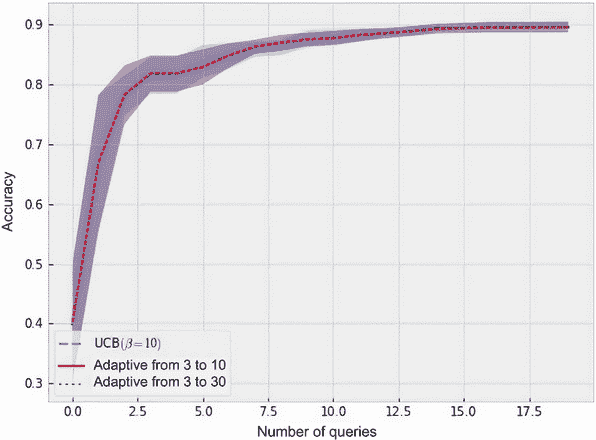

    图 A.9 两种 UCB 策略的自适应版本的进展。该策略对交易参数的结束值具有鲁棒性。

    这些版本是可比较的，将结束值从 10 更改为 30 并不会对优化性能产生太大影响。

1.  运行 Thompson 抽样（TS）策略，并观察其综合性能。

    我们按照以下方式实现 TS：

    ```py
    num_candidates = 2000
    num_repeats = 10

    incumbents = torch.zeros((num_repeats, num_queries))

    for trial in range(num_repeats):
      ...                               ❶

      for i in tqdm(range(num_queries)):
        ...                             ❷

        sobol = torch.quasirandom.SobolEngine(1, scramble=True)
        candidate_x = sobol.draw(num_candidates)
        candidate_x = bounds[0] + (bounds[1] - bounds[0]) * candidate_x

        ts = botorch.generation.MaxPosteriorSampling(model, 
        ➥replacement=False)
        next_x = ts(candidate_x, num_samples=1)

        ...                             ❸
    ```

    ❶ 随机生成初始训练数据

    ❷ 记录现任价值并重新训练模型

    ❸ 找到最大化收益分数的点，查询目标函数并更新训练数据

    图 A.10 展示了 TS 的优化性能。我们看到该策略在开始时取得了显著进展，并且与第六章的 EI 相当，并且略逊于 UCB 的最佳版本。

    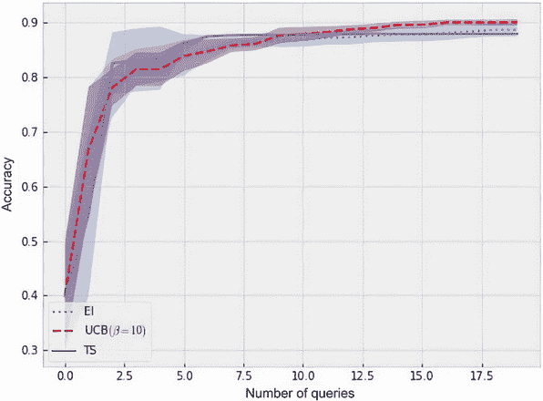

    图 A.10 TS 的进展。该策略与 EI 相当，并略逊于 UCB 的最佳版本。

## A.5 第六章：使用信息论与基于熵的策略

本章中有两个练习：

1.  第一个练习涵盖了二分搜索的变体，其中在做出决策时可以考虑先验信息。

1.  第二个练习将引导我们通过在前几章中看到的超参数调整问题中实现最大值熵搜索（MES）的过程。

## A.5.1 练习 1：将先验知识纳入熵搜索

这个练习，实现在 CH06/02 - Exercise 1.ipynb 中，展示了在找到信息论最优决策时使用不同先验的一个实例，最终将帮助我们进一步欣赏熵搜索作为一种通用决策在不确定性下的过程的优雅和灵活性：

1.  证明 *Pr*(*X* = 1) + *Pr*(*X* = 2) + ... + *Pr*(*X* = 10) = 1。

    我们可以通过简单地将概率相加来实现这一点：

    1 / 2 + 1 / 4 + ... + 1 / 2⁹ + 1 / 2⁹ = 1 / 2 + 1 / 4 + ... + 1 / 2⁸ + 1 / 2⁸ = ... = 1 / 2 + 1 / 2 = 1。

1.  计算这个先验分布的熵。

    请记住熵的公式为 –Σ*[i]**p[i]* log *p[i]*。我们可以编写一个计算此和的 Python 函数：

    ```py
    def compute_entropy(first, last):
        entropy = 0
        for i in range(first, last + 1):
            p = marginal_probability(i, first, last)   ❶
            entropy += -p * np.log2(p)                 ❷

        return entropy
    ```

    ❶ 获取当前概率。

    ❷ 对项求和。

    此函数将 `first` 和 `last` 作为参数，它们对应于 *X* 可能的最小和最大值（起始值为 1 和 10），分别。然后我们遍历 `first` 和 `last` 之间的数字，并累加 –*p[i]* log *p[i]* 项。这里，`marginal_probability()` 是一个计算 *Pr*(*X* = *n*) 的辅助函数，我们实现如下：

    ```py
    def marginal_probability(floor, first, last):
        if floor == last:                   ❶
            return 2 ** -(last - first)     ❶

        return 2 ** -(floor - first + 1)
    ```

    ❶ 当底层是可能的最高层时的边缘情况

    运行 `compute_entropy(1,` `10)` 将给出 1.99609375\. 这是 *X* 先验分布的熵。

1.  鉴于在 1 到 10 之间定义的先验分布，从二楼掉落时手机会损坏的概率是多少？从第五层呢？第一层呢？

    手机从二楼掉落时损坏的概率恰好是*Pr*(*X* = 1)，即 0.5。

    手机从第五层掉落损坏的概率是*X* ≤ 4 的概率，即*Pr*(*X* = 1) + *Pr*(*X* = 2) + *Pr*(*X* = 3) + *Pr*(*X* = 4) = 15/16 = 0.9375。

    这两个计算可以作为一个函数来实现：

    ```py
    def cumulative_density(floor, first, last):
        return sum(                                  ❶
            [                                        ❶
                marginal_probability(i, first, last) ❶
                for i in range(first, floor)         ❶
            ]                                        ❶
        )                                            ❶
    ```

    ❶ 对于小于阈值的*X*的概率求和

    由于我们的先验知识规定，如果从一楼掉落，手机不会损坏，这个概率为 0。

1.  计算在我们在第五层进行试验的两种情况下的虚拟后验分布的熵。

    使用我们实现的`compute_entropy()`函数，我们可以计算两种情况下的熵。如果手机损坏，我们将`first`设为`1`，`last`设为`4`；否则，我们将`first`设为`5`，`last`设为`10`：

    ```py
    >>> compute_entropy(1, 4)
    Output: 1.75
    >>> compute_entropy(5, 10)
    Output: 1.9375
    ```

1.  鉴于先验分布，计算在第五层进行试验后的预期后验熵。

    对于这个预期后验熵计算，我们已经进行了必要的计算。首先，手机从第五层掉落损坏的概率是 0.9375，在这种情况下，后验熵是 1.75。其次，手机从第五层掉落不损坏的概率是 1 - 0.9375 = 0.0625，在这种情况下，后验熵是 1.9375。

    对两种情况取平均值得到 (0.9375) 1.75 + (0.0625) 1.9375 = 1.76171875。这是你在第五层进行试验后的预期后验熵。

1.  计算其他楼层的这个预期后验熵。

    我们可以实现一个函数来进行我们刚刚讨论的计算：

    ```py
    def compute_expected_posterior_entropy(floor, first, last):
        break_probability = cumulative_density
        ➥(floor, first, last)                            ❶

        return (                                          ❷
            break_probability * compute_entropy           ❷
            ➥(first, floor - 1)                          ❷
            + (1 - break_probability) * compute_entropy   ❷
            ➥(floor, last)                               ❷
        )                                                 ❷
    ```

    ❶ 从给定楼层手机损坏的概率

    ❷ 对两种情况取平均值

    使用这个函数，我们可以绘制出在 1 到 10 之间数字的预期后验熵。

    这个图表显示在图 A.11 中，告诉我们我们第一次试验的信息论最佳地点是二楼，因为 2 给出了最低的预期后验熵（因此，不确定性最低）。

    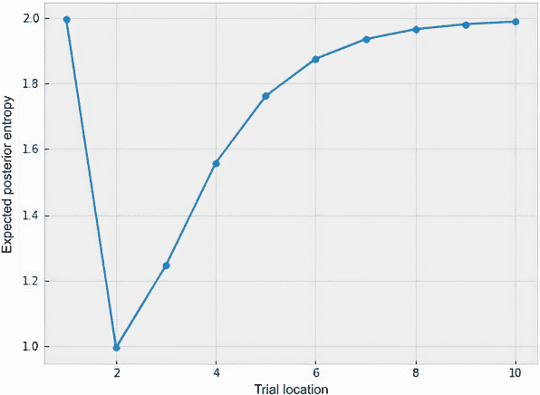

    图 A.11 预期后验熵作为试验地点的函数

    我们看到这与决策二进制搜索建议的不同，5。这是我们使用先验分布对*X*进行编码的领域知识的直接影响：因为*X* = 2 的可能性很高（50%），如果手机损坏，直接尝试这个数字可能会更好，因为这样我们可能会立即找到答案。

    有趣的是，从一楼掉下手机不会减少熵。这是因为我们确定手机不会从这一层摔坏，所以在进行这次试验之后，我们对世界的认知不会改变。

## A.5.2 练习 2：超参数调优的 BayesOpt

此练习在 CH06/ 03- Exercise 2.ipynb 笔记本中实现，将 BayesOpt 应用于模拟超参数调整任务中支持向量机模型的精度曲面的目标函数：

1.  在 CH04/ 03- Exercise 2.ipynb 中重新创建 BayesOpt 循环，包括实现重复实验的外部循环。

1.  运行 MES 策略。

    考虑到我们的目标函数具有两个维度，我们应将 MES 使用的 Sobol 序列的大小设置为 2,000：

    ```py
    num_candidates = 2000
    num_repeats = 10

    incumbents = torch.zeros((num_repeats, num_queries))

    for trial in range(num_repeats):
      ...                                 ❶

      for i in tqdm(range(num_queries)):
        ...                                ❷

        sobol = torch.quasirandom.SobolEngine(1, scramble=True)
        candidate_x = sobol.draw(num_candidates)
        candidate_x = bounds[0] + (bounds[1] - bounds[0]) * candidate_x

        policy = botorch.acquisition.max_value_entropy_search.qMaxValueEntropy(
            model, candidate_x
        )

        ...                               ❸
    ```

    ❶ 随机生成初始训练数据

    ❷ 记录现任值并重新训练模型

    ❸ 寻找最大化收获值的点，查询目标函数，并更新训练数据

    图 A.12 显示了 MES 的优化效果。我们可以看到，该策略在迄今为止学到的所有 BayesOpt 策略中都具有竞争力。

    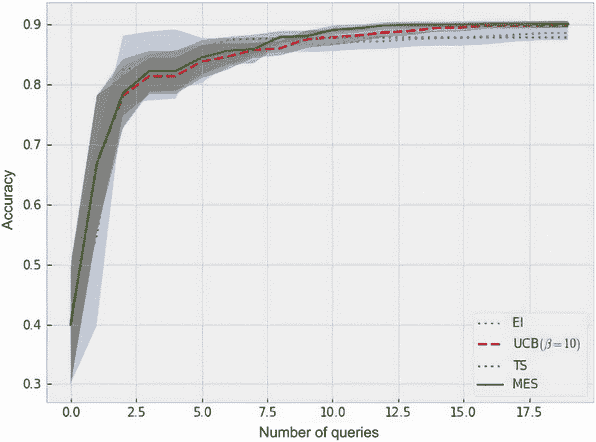

    图 A.12 展示了 MES 的优化效果。该策略在所显示的四个策略中表现最佳。

## A.6 第七章：通过批量优化最大化吞吐量

本章包含两个练习：

1.  第一个部分涵盖了在批量设置下实现 TS 的方法。

1.  第二个部分介绍了如何在一个四维气动结构优化问题上运行 BayesOpt 策略。

## A.6.1 练习 1：通过重新采样将 TS 扩展到批量设置

请记住，在我们在第 5.3 节学到的顺序设置中，TS 是从当前 GP 关于目标函数的信念中抽取一个样本，并查询最大化该样本的数据点。在批次设置中，我们只需重复此过程多次，从而多次采样 GP 并最大化样本，以组装所需大小的批次查询。此练习的代码可以在 CH07/ 02- Exercise 1.ipynb 笔记本中找到：

1.  重新创建 CH05 / 01- BayesOpt loop.ipynb 笔记本中的批次 BayesOpt 循环。

1.  根据第 5.3 节介绍的方法，使用 Sobol 采样器实现 TS。

    我们按照以下方式实施该策略，其中我们使用 2,000 元素的 Sobol 序列，并指定样本数作为批次大小：

    ```py
    num_candidates = 2000                                   ❶

    ...                                                     ❷

    for i in tqdm(range(num_iters)):
        ...                                                 ❸

        sobol = torch.quasirandom.SobolEngine
        ➥(2, scramble=True)                                ❹
        candidate_x = sobol.draw(num_candidates)            ❹
        candidate_x = (bounds[1] - bounds[0]) *             ❹
        ➥candidate_x + bounds[0]                           ❹

        ts = botorch.generation.MaxPosteriorSampling(model, 
        ➥replacement=False)
        next_x = ts(candidate_x, num_samples=batch_size)    ❺

        ...                                                 ❻
    ```

    ❶ 指定 Sobol 序列的长度

    ❷ 随机选择初始训练数据

    ❸ 重新训练 GP

    ❹ 初始化 Sobol 序列

    ❺ 从 GP 中绘制多个样本

    ❻ 查询目标函数并更新训练数据

1.  运行此 TS 策略对超参数调整目标函数进行观察其性能。

    运行批次 TS 后，我们可以绘制该策略对我们所学到的其他策略的进展，如图 A.13 所示。在仅进行第一批查询之后，TS 就能取得显著进展。

    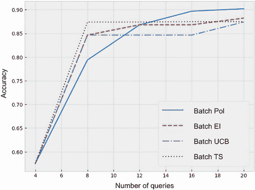

    图 A.13 批处理 TS 在超参数调整示例中的进展。只查询了第一批后，该策略就取得了显著进展。

## A.6.2 练习 2: 优化飞机设计

这个练习提供了一个目标函数，用于模拟基准测试飞机设计的过程。代码提供在 CH07/04 - Exercise 2.ipynb 笔记本中。完成以下步骤：

1.  实现模拟性能基准测试的目标函数。

    目标函数的代码已经提供，所以我们只需将其复制粘贴到程序中：

    ```py
    def flight_utility(X):
      X_copy = X.detach().clone()
      X_copy[:, [2, 3]] = 1 - X_copy[:, [2, 3]]
      X_copy = X_copy * 10 - 5

      return -0.005 * (X_copy**4 - 16 * X_copy**2 + 5 * X_copy).sum(dim=-1) + 3
    ```

1.  使用一个常数均值函数和 Matérn 2.5 核实现一个 GP 模型，输出范围由一个 `gpytorch.kernels.ScaleKernel` 对象实现。

    这个 GP 模型的类实现和之前大部分相同，只需要在 ARD 核中指定正确的维度数：

    ```py
    class GPModel(
        gpytorch.models.ExactGP,
        botorch.models.gpytorch.GPyTorchModel,
        botorch.models.model.FantasizeMixin
    ):
        _num_outputs = 1

        def __init__(self, train_x, train_y, likelihood):
            super().__init__(train_x, train_y, likelihood)
            self.mean_module = gpytorch.means.ConstantMean()
            self.covar_module = gpytorch.kernels.ScaleKernel(
                gpytorch.kernels.MaternKernel(     ❶
                    nu=2.5,                        ❶
                    ard_num_dims=4                 ❶
                )                                  ❶
            )

        def forward(self, x):
            ...
    ```

    ❶ 四维的 Matérn 2.5 核

1.  实现一个辅助函数，用于在给定的训练数据集上训练 GP。

    我们可以直接从本章其他笔记本（即 02 - Exercise 1.ipynb）中复制相同的辅助函数 `fit_gp_model()`，因为我们不需要在此辅助函数中进行修改。

1.  定义优化问题的设置。

    我们先定义搜索空间的边界：

    ```py
    lb = 0
    ub = 1

    bounds = torch.tensor([[lb] * 4, [ub] * 4], dtype=torch.float)
    ```

    然后我们指定可以进行的查询数量、批次大小和每个策略要重复的实验次数：

    ```py
    num_experiments = 5

    num_queries = 100
    batch_size = 5
    num_iters = num_queries // batch_size
    ```

1.  运行本章学习的每个批处理 BayesOpt 策略在先前实现的目标函数上。

    我们首先使用这段代码实现优化循环和重复每个策略实验的外部循环。具体来说，对于每个单独的实验，我们随机在搜索空间内取一个数据点，然后运行每个 BayesOpt 策略，直到我们用完查询次数。下一步我们将看到每个策略是如何定义的：

    ```py
    incumbents = torch.zeros((num_experiments, num_iters))

    pbar = tqdm(total=num_experiments * num_iters)
    for exp in range(num_experiments):
        torch.manual_seed(exp)                       ❶
        train_x = bounds[0] + (bounds[1] -           ❶
        ➥bounds[0]) * torch.rand(1, 4)              ❶
        train_y = flight_utility(train_x)            ❶

        for i in range(num_iters):
            incumbents[exp, i] = train_y.max()       ❷

            model, likelihood = fit_gp_model
            ➥(train_x, train_y)                     ❷

            ...                                      ❸

            next_y = flight_utility(next_x)          ❹

            train_x = torch.cat([train_x, next_x])   ❹
            train_y = torch.cat([train_y, next_y])   ❹

            pbar.update()
    ```

    ❶ 随机初始化训练数据

    ❷ 跟踪优化进展并更新预测模型

    ❸ 定义策略并查找下一个要查询的批次

    ❹ 查询策略推荐的点并更新训练数据

    对于 PoI 策略，我们使用以下代码：

    ```py
    policy = botorch.acquisition.monte_carlo.qProbabilityOfImprovement(
        model, best_f=train_y.max()
    )
    ```

    对于 EI 策略，我们使用以下代码：

    ```py
    policy = botorch.acquisition.monte_carlo.qExpectedImprovement(
        model, best_f=train_y.max()
    )
    ```

    对于 UCB 策略，我们使用以下代码：

    ```py
    policy = botorch.acquisition.monte_carlo.qUpperConfidenceBound(
        model, beta=2
    )
    ```

    然后可以使用以下代码对这三个策略进行优化： 

    ```py
    next_x, acq_val = botorch.optim.optimize_acqf(
        policy,
        bounds=bounds,
        q=batch_size,
        num_restarts=100,
        raw_samples=200,
    )
    ```

    否则，对于 TS 或 MES，我们需要先定义 Sobol 序列：

    ```py
    sobol = torch.quasirandom.SobolEngine(4, scramble=True)    ❶
    candidate_x = sobol.draw(5000)
    candidate_x = (bounds[1] - bounds[0]) * candidate_x + bounds[0]
    ```

    ❶ 指定维度数为 4

    对于 TS 策略，我们使用以下代码：

    ```py
    ts = botorch.generation.MaxPosteriorSampling(model, replacement=False)
    next_x = ts(candidate_x, num_samples=batch_size)
    ```

    对于 MES，我们使用以下代码来实现循环优化，其中使用了辅助函数 `optimize_acqf_cyclic()`。请注意，我们指定循环优化的最大迭代次数为 5：

    ```py
    policy = botorch.acquisition.max_value_entropy_search.qMaxValueEntropy(
        model, candidate_x
    )

    next_x, acq_val = botorch.optim.optimize_acqf_cyclic(
        policy,
        bounds=bounds,
        q=batch_size,
        num_restarts=40,
        raw_samples=100,
        cyclic_options={"maxiter": 5}    ❶
    )
    ```

    ❶ 指定循环优化的最大迭代次数

1.  绘制我们运行的 BayesOpt 策略的优化进展并观察其性能。

    图 A.14 显示了我们实现的策略得到的优化结果。我们看到大多数策略是可比的，除了 TS；批量 PoI 稍微领先一点。

    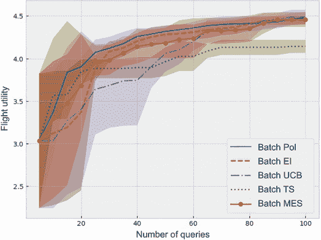

    图 A.14 各种 BayesOpt 策略在飞机设计优化示例中的进展。大多数策略是可比的，除了 TS。

## A.7 第八章：通过受限优化满足额外约束

本章有两个练习：

1.  第一个验证我们从 BoTorch 对受限 EI 策略的实现得到的结果是否与常规 EI 分数和可行性概率的乘积相同。

1.  第二部分向我们展示了如何在一个四维气动结构优化问题上运行受限 BayesOpt。

## A.7.1 练习 1：受限 EI 的手动计算

受限 EI 策略的获取分数是 EI 分数和可行性概率的乘积。虽然 BoTorch 的 `ConstrainedExpectedImprovement` 类提供了受限 EI 分数的实现，但实际上我们可以手动执行计算。在这个练习中，我们探索这种手动计算，并将我们的结果与 `ConstrainedExpectedImprovement` 类的结果进行验证。此练习的解决方案在 CH08/02 - Exercise 1.ipynb 笔记本中，并可以解释如下：

1.  重新创建 CH08/01 - Constrained optimization.ipynb 中使用的受限 BayesOpt 问题，包括目标函数、成本函数、GP 实现以及在一些训练数据上训练 GP 的辅助函数 `fit_gp_model()`。

1.  创建一个 PyTorch 张量，它是在 -5 到 5 之间的密集网格。这个张量将作为我们的测试集。我们使用 `torch.linspace()` 来创建一个密集网格：

    ```py
    lb = -5
    ub = 5

    xs = torch.linspace(lb, ub, 201)
    ```

1.  通过从我们的搜索空间中随机抽样三个数据点（在 -5 到 5 之间）来创建一个玩具训练数据集，并在这些点上评估目标和成本函数。我们使用 `torch.rand()` 在 0 和 1 之间随机采样，然后将样本缩放到我们的搜索空间：

    ```py
    n = 3
    torch.manual_seed(0)                                           ❶
    train_x = bounds[0] + (bounds[1] - bounds[0]) * torch.rand(n)  ❷

    train_utility = objective(train_x)
    train_cost = cost(train_x)
    ```

    ❶ 为了可重现性而固定种子

    ❷ 在 0 和 1 之间进行采样，然后将样本缩放到我们的搜索空间

1.  使用辅助函数 `fit_gp_model()` 在目标函数数据和成本函数数据上训练一个 GP。

    ```py
    utility_model, utility_likelihood = fit_gp_model(   ❶
        train_x.unsqueeze(-1), train_utility            ❶
    )                                                   ❶

    cost_model, cost_likelihood = fit_gp_model(         ❷
        train_x.unsqueeze(-1), train_cost               ❷
    )                                                   ❷
    ```

    ❶ 在目标函数数据上训练一个 GP

    ❷ 在成本函数的数据上训练一个 GP

1.  使用在成本函数数据上训练的 GP 来计算测试集中每个点的可行性概率。

    我们首先计算成本 GP 在我们的测试集上的预测分布：

    ```py
    with torch.no_grad():
        cost_pred_dist = cost_likelihood(cost_model(xs))
        cost_pred_mean = cost_pred_dist.mean
        cost_pred_lower, cost_pred_upper = \
            cost_pred_dist.confidence_region()
    ```

    然后，我们初始化一个正态分布对象，其均值和标准差对应于 `cost_pred_dist` 的均值和标准差：

    ```py
    normal = torch.distributions.Normal(cost_pred_mean, cost_pred_dist.stddev)
    ```

    最后，我们在这个对象上调用 `cdf()` 方法来计算可行性的概率。这个方法所取的参数是我们成本约束的上限，即 0：

    ```py
    feasible_prob = normal.cdf(torch.zeros(1))
    ```

1.  初始化常规 EI 策略，其中 `model` 参数是在目标函数数据上训练的 GP，而 `best_f` 参数是当前的可行入围者。

    我们使用 `train_utility[train_cost <= 0].max()` 计算当前的可行入围者：

    ```py
    ei = botorch.acquisition.analytic.ExpectedImprovement(
        model=utility_model,
        best_f=train_utility[train_cost <= 0].max(),
    )
    ```

    然后，通过在 `xs[:, None, None]` 上调用 EI 策略对象来计算 EI 分数，该对象是为确保其形状适当而重新塑造的测试密集网格：

    ```py
    with torch.no_grad():
        ei_score = ei(xs[:, None, None])
    ```

1.  初始化受限 EI 策略，并为测试集中的每个点计算受限 EI 分数：

    ```py
    constrained_ei = botorch.acquisition.analytic.ConstrainedExpectedImprovement(
        model=botorch.models.model_list_gp_regression.ModelListGP(
            utility_model, cost_model
        ),
        best_f=train_utility[train_cost <= 0].max(),
        objective_index=0,
        constraints={1: [None, 0]}
    )
    ```

    我们还使用重塑后的测试集计算受限 EI 分数：

    ```py
    with torch.no_grad():
        constrained_ei_score = constrained_ei(xs[:, None, None])
    ```

1.  计算 EI 分数和可行性概率的乘积，并验证这种手动计算是否与 BoTorch 的实现结果相同。 运行断言以确保所有相应的术语匹配：

    ```py
    assert torch.isclose(
        ei_score * feasible_prob, constrained_ei_score, atol=1e-3
    ).all()
    ```

1.  在图中绘制 EI 分数和受限 EI 分数，并直观地验证前者始终大于或等于后者。 证明这是正确的。

    我们如下绘制迄今为止计算的分数：

    ```py
    plt.plot(xs, ei_score, label="EI")
    plt.plot(xs, constrained_ei_score, label="BoTorch constrained EI")
    ```

    此代码生成图 A.15，显示 EI 分数确实始终至少等于受限 EI 分数。

    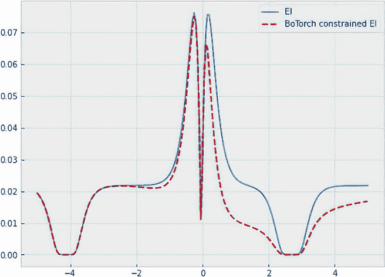

    图 A.15 EI 的获取分数（实线）和受限 EI（虚线）。 前者始终大于或等于后者。

    我们可以通过注意到受限 EI 分数等于正常 EI 分数乘以可行性概率来数学证明这一点。 可行性概率始终最大为 1，因此 EI 分数始终大于或等于受限 EI 分数。

## A.7.2 练习 2：飞机设计的受限优化

在这个练习中，我们使用第七章练习 2 中的飞机效用目标函数来解决一个受限制的优化问题。 这个过程允许我们在一个高维问题上运行受限 BayesOpt，在这个问题中，不明显的是可行性最优解在哪里。 这个练习的解决方案包含在 CH08/03 - Exercise 2.ipynb 笔记本中：

1.  重新创建在 CH07/04 - Exercise 2.ipynb 笔记本中使用的 BayesOpt 问题，包括名为 `flight_utility()` 的飞机效用目标函数、我们搜索空间的边界（四维单位超立方体）、GP 实现以及在一些训练数据上训练 GP 的辅助函数 `fit_gp_model()`。

1.  实现以下成本函数，模拟制造由四维输入指定的飞机设计的成本：

    ```py
    def flight_cost(X):
      X = X * 20 - 10

      part1 = (X[..., 0] - 1) ** 2

      i = X.new(range(2, 5))
      part2 = torch.sum(i * (2.0 * X[..., 1:] ** 2 - X[..., :-1]) ** 2, 
      ➥dim=-1)

      return -(part1 + part2) / 100_000 + 2
    ```

1.  我们的目标是在遵循成本小于或等于 0 的约束条件的情况下最大化目标函数 `flight_utility()`。

    为此，我们将 BayesOpt 策略每个实验的查询次数设置为 50，并指定每个策略需要运行 10 次重复实验：

    ```py
    num_queries = 50
    num_repeats = 10
    ```

    如果找不到可行解，则默认值量化优化进度应设置为-2。

    ```py
    default_value = -2
    feasible_incumbents = torch.ones((num_repeats, num_queries)) * default_value
    ```

1.  在此问题上运行受限 EI 策略以及常规 EI 策略；可视化并比较它们的平均进展（以及误差线）。

    我们以与第八章相同的方式实现了受限 EI 策略，其中我们将`best_f`设置为当前可行的最优解（如果找到了可行解）或默认值-2（如果没有找到可行解）。我们的模型列表包含目标 GP，其索引为 0，和成本 GP，其索引为 1：

    ```py
    if (train_cost <= 0).any():                                      ❶
        best_f = train_utility[train_cost <= 0].max()                ❶
    else:                                                            ❶
        best_f = torch.tensor(default_value)                         ❶

    policy = botorch.acquisition.analytic.ConstrainedExpectedImprovement(
        model=botorch.models.model_list_gp_regression.ModelListGP(   ❷
            utility_model, cost_model                                ❷
        ),                                                           ❷
        best_f=best_f,
        objective_index=0,                                           ❸
        constraints={1: [None, 0]}                                   ❹
    )
    ```

    ❶ 找到当前最优解的适当值

    ❷ GP 模型列表

    ❸ 目标模型的索引

    ❹ 约束模型的索引和下限和上限

    我们如下实现常规 EI 策略：

    ```py
    policy = botorch.acquisition.analytic.ExpectedImprovement(
       model=utility_model,
       best_f=train_utility.max(),
    )
    ```

    图 A.16 显示了我们实现的两个先前策略获得的优化结果。我们看到，受限 EI 通过考虑我们施加的成本约束完全支配了常规 EI 策略。

    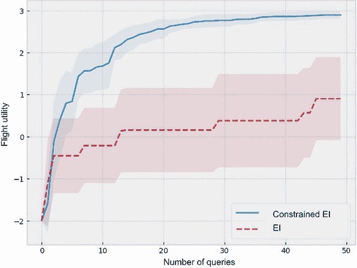

    图 A.16 各种贝叶斯优化策略在受限飞机设计优化示例中所取得的进展。与常规 EI 相比，受限变体平均找到更可行的解决方案。

## A.8 第九章：用多信度优化平衡效用和成本

本章有两个练习：

1.  练习 1 介绍了跨多个实验测量和可视化优化策略平均性能的过程。

1.  练习 2 将我们所知的优化策略应用于具有三个可查询函数的二维问题。

## A.8.1 练习 1：在多信度优化中可视化平均性能

在本练习中，我们多次运行优化循环，并学习如何取得平均性能以获得更全面的比较：

1.  复制 CH09/03 - 测量性能.ipynb 笔记本中的问题设置和多信度优化循环，并添加另一个变量，表示我们要运行的实验次数（默认为 10 次）。

1.  为了方便重复实验，在优化循环代码中添加一个外部循环。这应该是一个具有 10 次迭代的`for`循环，每次生成一个不同的随机观察值：

    ```py
    num_repeats = 10                                   ❶

    for trial in range(num_repeats):
        torch.manual_seed(trial)                       ❷
        train_x = bounds[0] + (bounds[1] - bounds[0])  ❷
        ➥* torch.rand(1, 1)                           ❷
        train_x = torch.cat(                           ❷
            [train_x, torch.ones_like(train_x)         ❷
            ➥* fidelities[0]], dim=1                  ❷
        )                                              ❷
        train_y = evaluate_all_functions(train_x)      ❷

        current_budget = 0                             ❸
        while current_budget < budget_limit:           ❸
            ...                                        ❸
    ```

    ❶ 重复实验 10 次

    ❷ 生成特定于当前迭代的随机初始训练集

    ❸ 内循环，直到我们耗尽预算

1.  将变量`recommendations`和`spent_budget`的每个变量都设为一个列表的列表，其中每个内部列表跟踪单个实验的优化性能。我们将上一步中嵌套循环的代码添加如下所示：

    ```py
    num_repeats = 10
    recommendations = []                               ❶
    spent_budget = []                                  ❶

    for trial in range(num_repeats):
        torch.manual_seed(trial)
        train_x = bounds[0] + (bounds[1] - bounds[0]) * torch.rand(1, 1)
        train_x = torch.cat(
            [train_x, torch.ones_like(train_x) * fidelities[0]], dim=1
        )
        train_y = evaluate_all_functions(train_x)

        current_budget = 0
        recommendations.append([])                     ❷
        spent_budget.append([])                        ❷

        while current_budget < budget_limit:
            ...

            rec_x = get_final_recommendation(model)    ❸
            recommendations[-1].append                 ❸
            ➥(evaluate_all_functions(rec_x).item())   ❸
            spent_budget[-1].append(current_budget)    ❸

            ...
    ```

    ❶ 每个变量都是一个（当前为空的）列表的列表。

    ❷ 向每个列表的列表添加一个空列表，以供下一个实验使用

    ❸ 将优化进度统计信息添加到每个变量的最新列表中

1.  在我们的优化问题上运行多保真度 MES 策略及其单保真度版本。

1.  我们首先制作正则网格和当前空白的插值推荐值，稍后我们将填写其中：

    ```py
    xs = np.arange(budget_limit)
    interp_incumbents = np.empty((num_repeats, budget_limit))
    ```

    然后我们遍历 `recommendations` 中的每个列表（在我们的代码中重命名为 `incumbents`）和 `spend_budget`，计算线性插值，然后填写 `interp_incumbents` 中的值：

    ```py
    for i, (tmp_incumbents, tmp_budget) in enumerate(
        zip(incumbents, spent_budget)
    ):
        interp_incumbents[i, :] = np.interp(xs, tmp_budget, tmp_incumbents)
    ```

1.  使用线性插值值绘制我们运行的两个策略的平均性能和误差条，并比较它们的性能。比较可视化在图 A.17 中展示，我们可以看到多保真度 MES 策略大大优于其单保真度竞争对手。

    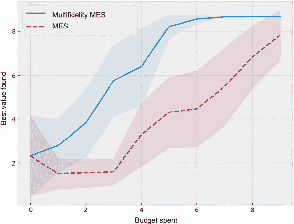

    图 A.17 显示了在 10 次实验中单一保真度和多保真度 MES 策略在 Forrester 函数上的平均优化进展。多保真度策略大大优于单保真度策略。

1.  绘制线性插值曲线，代表各个运行的优化进展，以及平均性能和误差条。比较可视化在图 A.18 中呈现。事实上，我们每次运行的优化进展，由最大后验平均推荐值来衡量，并不是单调递增的。

    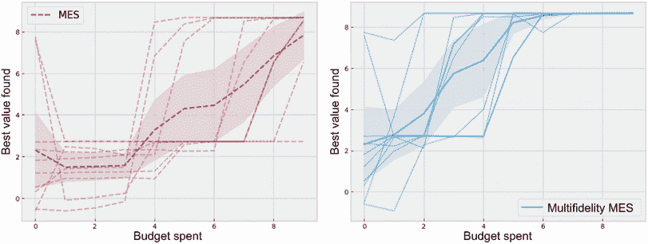

    图 A.18 线性插值曲线代表了在 10 次实验中各个运行的优化进展。我们每次运行的优化进展，由最大后验平均推荐值来衡量，并不是单调递增的。

## A.8.2 练习 2：使用多个低保真度近似进行多保真度优化

本练习向我们展示了我们的多保真度最大值熵搜索策略可以在多个低保真度函数之间平衡。解决方案，可以在 CH09/05 - Exercise 2.ipynb 笔记本中找到，解释如下：

1.  实现目标函数。该步骤的代码已在说明中提供。

1.  将我们的搜索空间的边界定义为单位正方形：

    ```py
    bounds = torch.tensor([[0.0] * 2, [1.0] * 2])
    ```

1.  声明存储我们可以查询的不同函数的相关值的 `fidelities` 变量：

    ```py
    fidelities = torch.tensor([0.1, 0.3, 1.0])
    bounds_full = torch.cat(
        [
            bounds,
            torch.tensor([fidelities.min(), fidelities.max()]).unsqueeze(-1)
        ],
        dim=1
    )
    ```

1.  将线性成本模型的固定成本设置为 0.2，权重设置为 1：

    ```py
    from botorch.models.cost import AffineFidelityCostModel

    cost_model = AffineFidelityCostModel(fixed_cost=0.2)
    ```

    将每次实验中我们的预算限制设置为 10，并且重复实验的次数也设置为 10：

    ```py
    budget_limit = 10
    num_repeats = 10
    ```

1.  从 Sobol 序列中绘制的候选者数量设置为 5,000，并在使用辅助函数优化给定策略的收购分数时，使用 100 次重启和 500 次原始样本：

    ```py
    num_samples = 5000

    num_restarts = 100
    raw_samples = 500
    ```

1.  重新定义辅助函数 `get_final_recommendation`，以找到后验平均值最大化器：

    ```py
    from botorch.acquisition.fixed_feature import 
    ➥FixedFeatureAcquisitionFunction
    from botorch.acquisition import PosteriorMean
    from botorch.optim.optimize import optimize_acqf, optimize_acqf_mixed

    def get_final_recommendation(model):
        post_mean_policy = FixedFeatureAcquisitionFunction(
            acq_function=PosteriorMean(model),
            d=3,                ❶
            columns=[2],        ❶
            values=[1],
        )

        final_x, _ = optimize_acqf(
            post_mean_policy,
            bounds=bounds,
            q=1,
            num_restarts=num_restarts,
            raw_samples=raw_samples,
        )

        return torch.cat([final_x, torch.ones(1, 1)], dim=1)
    ```

    ❶ 必要的更改

1.  在我们的优化问题上运行多保真度 MES 策略及其单保真度版本，并使用练习 1 中描述的方法绘制每个策略的平均优化进展和误差条。图 A.19 显示了两种策略之间的比较。

    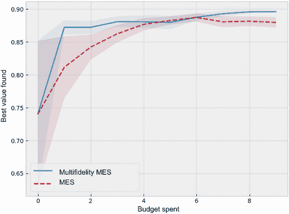

    图 A.19 显示了单一和多层次 MES 策略在 Branin 函数上的平均优化进展。多层次策略再次优于单一层次策略。

## A.9 第十一章：同时优化多个目标

在本练习中，我们将我们学到的多目标优化技术应用于优化飞机的气动结构设计问题。这个练习让我们能够观察多维问题中 Expected Hypervolume Improvement (EHVI) 策略的表现：

1.  我们按照以下方式复制了目标函数的代码：

    ```py
    def objective1(X):                                                  ❶
      X_copy = X.detach().clone()                                       ❶
      X_copy[:, [2, 3]] = 1 - X_copy[:, [2, 3]]                         ❶
      X_copy = X_copy * 10 - 5                                          ❶
      return (                                                          ❶
        -0.005                                                          ❶
        * (X_copy ** 4 - 16 * X_copy ** 2 + 5 * X_copy)                 ❶
        ➥.sum(dim=-1)                                                  ❶
          + 3                                                           ❶
      )                                                                 ❶

    def objective2(X):                                                  ❷
      X = X * 20 - 10                                                   ❷
      part1 = (X[..., 0] - 1) ** 2                                      ❷
      i = X.new(range(2, 5))                                            ❷
      part2 = torch.sum(i * (2.0 * X[..., 1:] ** 2 - X[..., :-1]) ** 2, ❷
      ➥ dim=-1)                                                        ❷
      return (part1 + part2) / 100_000 - 2                              ❷
    ```

    ❶ 第一个目标函数

    ❷ 第二个目标函数，来自第八章练习 2 中的代码取反

1.  我们按照以下方式实现辅助函数：

    ```py
    def joint_objective(X):
        return torch.vstack(
            [
                objective1(X).flatten(),
                objective2(X).flatten(),
            ]
        ).transpose(-1, -2)
    ```

1.  我们声明搜索空间的边界：

    ```py
    bounds = torch.tensor([[0.0] * 4, [1.0] * 4])
    ```

1.  我们声明参考点：

    ```py
    ref_point = torch.tensor([-1.5, -2.0])
    ```

1.  类实现和辅助函数可以使用与 CH08/03 - 练习 2.ipynb 中相同的代码实现。

1.  我们设置实验设置：

    ```py
    num_queries = 50
    num_repeats = 10
    ```

1.  我们按照 CH11/02 - 多目标 BayesOpt loop.ipynb 中相同的方式实现了两种 BayesOpt 策略。图 A.20 展示了两种策略在 10 个实验中的综合表现。EHVI 策略再次优于交替 EI 策略。

    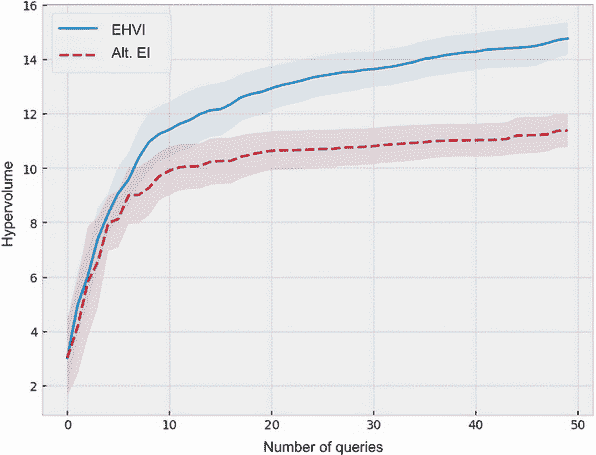

    图 A.20 显示两个贝叶斯优化策略根据查询次数的平均超体积和误差棒。EHVI 策略始终优于交替 EI 策略。

## A.10 第十二章：将高斯过程扩展到大数据集

本练习展示了在真实数据集加利福尼亚州房价上从普通 GP 模型转换为 VGP 模型时的效率提升。我们的目标是观察 VGP 在真实世界环境中的计算优势。

完成以下步骤：

1.  我们使用 Pandas 库读入数据集：

    ```py
    import pandas as pd

    df = pd.read_csv("../data/housing.csv")
    ```

    将 Pandas dataframe 读入后，应该与图 A.21 中的输出类似。

    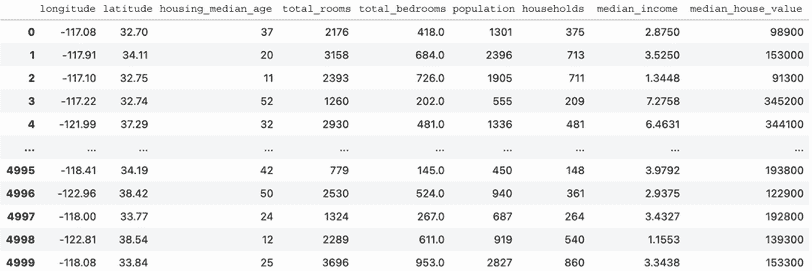

    图 A.21 显示了房价数据集作为 Pandas dataframe。这是本练习的训练集。

1.  我们创建散点图如下所示：

    ```py
    plt.figure(figsize=(8, 6))
    plt.scatter(df.longitude, df.latitude, c=np.log(df.median_house_value))
    plt.colorbar();
    ```

    可视化应该类似于图 A.22。

    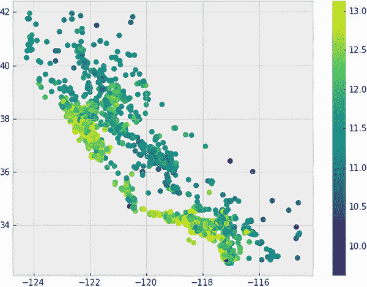

    图 A.22 房价数据集显示为散点图

1.  为了提取我们的训练特征，我们使用 `torch.from_numpy()` 方法将 NumPy 数组转换为 PyTorch 张量：

    ```py
    train_x = torch.from_numpy(df.drop(["median_house_value"], axis=1).values)
    ```

1.  我们同样对房价的对数进行了这样的操作，这是我们的训练标签：

    ```py
    train_y = torch.from_numpy(
        df.median_house_value.values
    ).log().to(train_x.dtype)
    ```

1.  我们将训练标签 `train_y` 标准化如下：

    ```py
    train_y = (train_y - train_y.mean()) / train_y.std()
    ```

1.  我们如下实现 GP 模型：

    ```py
    class GPModel(gpytorch.models.ExactGP):
        def __init__(self, train_x, train_y, likelihood):
            super().__init__(train_x, train_y, likelihood)
            self.mean_module = gpytorch.means.ConstantMean()   ❶
            self.covar_module = gpytorch.kernels.ScaleKernel(  ❷
                gpytorch.kernels.MaternKernel(
                    nu=2.5,                                    ❷
                    ard_num_dims=train_x.shape[1]              ❷
                )                                              ❷
            )                                                  ❷

        def forward(self, x):
            mean_x = self.mean_module(x)
            covar_x = self.covar_module(x)
            return gpytorch.distributions.MultivariateNormal(mean_x, covar_x)
    ```

    ❶ 常数均值函数

    ❷ 具有输出比例的 ARD Matern 5/2 核函数

1.  使用以下代码制作一个噪声至少为 0.1 的似然函数：

    ```py
    likelihood = gpytorch.likelihoods.GaussianLikelihood(
        noise_constraint=gpytorch.constraints
        ➥.GreaterThan(1e-1)                    ❶
    )
    ```

    ❶ 约束强制噪声至少为 0.1。

1.  我们使用梯度下降训练先前实现的 GP 模型如下：

    ```py
    model = GPModel(train_x, train_y, likelihood)

    optimizer = torch.optim.Adam(model.parameters(),
    ➥lr=0.01)                                        ❶
    mll = gpytorch.mlls.ExactMarginalLogLikelihood
    ➥(likelihood, model)                             ❷

    model.train()                                     ❸
    likelihood.train()                                ❸

    for i in tqdm(range(10)):
        optimizer.zero_grad()

        output = model(train_x)
        loss = -mll(output, train_y)

        loss.backward()
        optimizer.step()
    ```

    ❶ 梯度下降优化器 Adam

    ❷ （负）边际对数似然损失函数

    ❸ 启用训练模式

    在 MacBook 上，总训练时间为 24 秒。

1.  我们按以下步骤实现了 VGP 模型：

    ```py
    class ApproximateGPModel(gpytorch.models.ApproximateGP):
      def __init__(self, inducing_points):
        variational_distribution =                    ❶
        ➥gpytorch.variational                        ❶
        ➥.NaturalVariationalDistribution(            ❶
            inducing_points.size(0)                   ❶
        )                                             ❶
        variational_strategy = gpytorch.variational   ❶
        ➥.VariationalStrategy(                       ❶
            self,                                     ❶
            inducing_points,                          ❶
            variational_distribution,                 ❶
            learn_inducing_locations=True,            ❶
        )                                             ❶
        super().__init__(variational_strategy)
        self.mean_module = gpytorch.means.ConstantMean()
        self.covar_module = gpytorch.kernels.ScaleKernel(
            gpytorch.kernels.MaternKernel(
                nu=2.5,
                ard_num_dims=inducing_points.shape[1]
            )
        )

      def forward(self, x):
        ...                                           ❷
    ```

    ❶ 变分参数

    ❷ 与 GP 相同

1.  这个 VGP 是这样训练的：

    ```py
    num_datapoints = 100                             ❶
    torch.manual_seed(0)                             ❶
    model = ApproximateGPModel(                      ❶
      train_x[torch.randint(train_x.shape[0],        ❶
      ➥(num_datapoints,)), :]                       ❶
    )                                                ❶

    likelihood = gpytorch.likelihoods.GaussianLikelihood(
      noise_constraint=gpytorch.constraints.GreaterThan(1e-1)
    )

    train_dataset = torch.utils.data.Tensordataset
    ➥(train_x, train_y)                             ❷
    train_loader = torch.utils.data.DataLoader(      ❷
      train_data set,                                ❷
      batch_size=100,                                ❷
      shuffle=True                                   ❷
    )                                                ❷

    ngd_optimizer = gpytorch.optim.NGD(              ❸
      model.variational_parameters(),                ❸
      ➥num_data=train_y.size(0), lr=0.1             ❸
    )                                                ❸
    hyperparam_optimizer = torch.optim.Adam(         ❹
      [{"params": model.parameters()}, {"params":    ❹
      ➥likelihood.parameters()}],                   ❹
      lr=0.01                                        ❹
    )                                                ❹

    mll = gpytorch.mlls.VariationalELBO(
      likelihood, model, num_data=train_y.size(0)
    )

    model.train()
    likelihood.train()

    for i in tqdm(range(10)):
      for x_batch, y_batch in train_loader:
        ngd_optimizer.zero_grad()

        output = model(x_batch)
        loss = -mll(output, y_batch)

        loss.backward()

        ngd_optimizer.step()
        hyperparam_optimizer.step()
    ```

    ❶ 随机选择 100 个点作为初始感兴趣点

    ❷ 准备小批量数据

    ❸ 对变分参数使用自然梯度下降

    ❹ 使用 Adam 更新其他参数

1.  在同一台 MacBook 上，训练时间缩短到 6 秒，速度提升了 400%。

解决方案包含在 CH12/02 - Exercise.ipynb 笔记本中。
