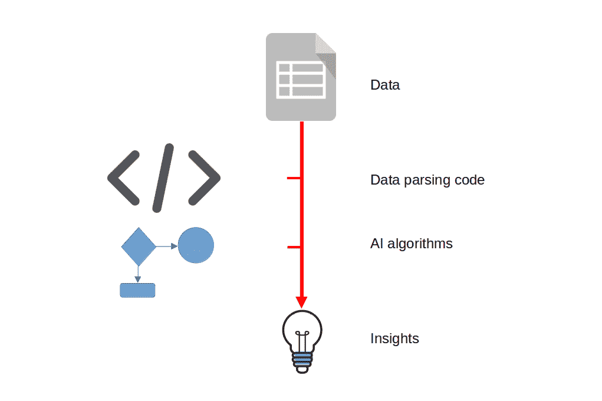
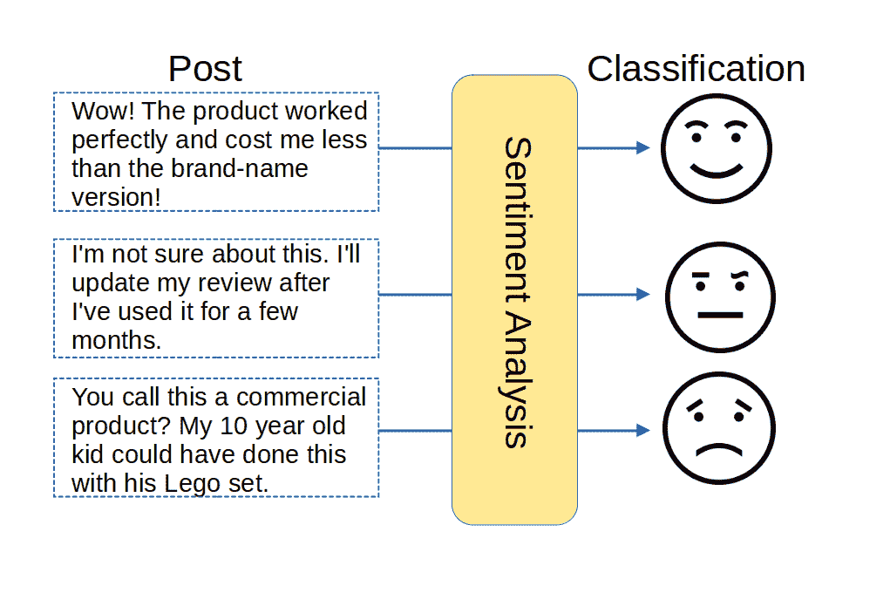

# 第九章：通过生成式 AI 更好地理解事物

### 本章内容包括

+   使用 GPT 替代大型数据分析操作

+   使用 GPT 替代情感分析

自从 GPT 进入我们的生活以来，我们与 AI 的大部分交互 - 以及直到目前为止的大部分书籍 - 都集中在生成各种内容上。毕竟，"生成" *是* 名字中的一部分。但并不是所有事情都是关于*创造*新事物的。还有*更好地理解*旧事物的部分。

在第五章中，我们确实使用了`GPTVectorStoreIndex` Python 库来更好地理解我们自己的一些数据。但是现在我们要更进一步，更深入地探讨。我们将通过使用人工智能来帮助我们在大型数据集中找到模式和关键细节（数据分析），以及使用成千上万的社交媒体帖子来测量人口规模的公众意见（情感分析）来做到这一点。

直到现在，这样的工具和见解通常只对数据专业人士可用。在这里，我们将看到它们如何现在几乎可以被任何人访问。

## 8.1 使用 GPT 替代分析

在几秒钟内吸收并总结大量内容确实是一件大事。就在昨晚，我收到了一条重要的 90 分钟商务视频会议录音的链接，我错过了几个小时前的现场版本。我错过现场版的原因是因为我没有时间（你必须知道，我正急于在宇宙消失之前写完这本书... 或者至少在他们发布 GPT-58 之前）。然而，几个小时后，我仍然没有时间看视频。令人费解的是，这本书还没有完成。

所以这就是我以 GPT 方式解决冲突的方法：

+   我使用了 OpenAI Whisper（在第七章已经看到）根据录音生成了一个转录

+   我将记录转录成了 PDF 文件

+   我把 PDF 上传到 ChatPDF。

+   我提示 ChatPDF 提供与我感兴趣的特定主题相关的摘要

"下载"90 分钟电话的关键时刻所需的总时间：10 分钟。这意味着将由大约 15000 个口头语言转换为机器可读格式，然后对其进行消化、分析和总结，需要 10 分钟。

但所有这些都已经是老生常谈了。*下一个级别*将解决业务分析的问题。好吧。那么"业务分析有什么问题"呢？问题在于要编写复杂的代码来解析大型数据集，使它们始终能够被机器读取（也称为"数据整理"），然后应用复杂的算法来提取有用的见解。下面的图大致概述了这个过程。

##### 图 8.1 使用数据分析从原始数据中得出见解



符合该描述的许多代码非常复杂，更不用说聪明了。激励聪明的数据工程师编写那种聪明代码当然会给组织带来巨大的成本。那么问题就是成本。因此解决这个问题将涉及解雇每年两十五万美元的工程师，用几百美元的大型语言模型 (LLM) API 费用来替代他们。这是我的计划。

我需要一个繁忙的电子表格来处理，对吧？我知道的获取良好数据的最佳途径是 Kaggle 网站。Kaggle 是一个托管数据集（和数据科学竞赛）的在线平台。它已经成为数据科学家、机器学习从业者和研究人员的重要资源，让他们展示自己的技能，从他人那里学习，并在项目上进行合作。该平台提供各种公共和私有数据集，以及支持数据探索和建模的工具和功能。

与此代码相关联的“投资项目类型预测”数据集 应该完美地运行。据我所知，这是某个世界上某个地方的银行聚合的代表其客户行为的数据。当然，一切都已经匿名化，所以我们不可能知道我们正在谈论哪家银行，客户是谁，甚至发生这一切的地点在世界上哪里。事实上，我甚至不能百分之百确定数据的每一列代表什么。 *可以* 确定的是每个客户的年龄和社区都在那里。虽然位置已被匿名化为 `C1`、`C2`、`C3` 等。剩下的一些列显然包含财务信息。

基于这些假设，我的最终目标是寻找列之间的统计有效关系。例如，有没有特定的人口统计特征（收入、社区、年龄），可以预测客户购买更多银行产品的可能性更大？对于这个具体的例子，我将看看是否能确定数据中平均家庭财富最高的地理区域。

对于通常的用途，这种模糊描述的数据将毫无价值。但由于我们只是想展示过程，它将做得很好。我会 *虚构* 出更或多或少符合其数据形状的列标题。下面是我如何命名它们：

+   客户 ID

+   客户年龄

+   地理位置

+   年度分行访问次数

+   家庭总资产

+   家庭总债务

+   与银行的总投资额

列名需要非常描述性，因为那将是我给 GPT 唯一的提示，帮助它理解数据。我确实不得不将我的客户 ID 添加到第一列（它们原本不存在）。我能想到的最快的方法是在该列的顶部数据单元格中插入 `=(RAND())` 公式（使用电子表格软件如 Excel、Google Sheets 或 LibreOffice Calc 加载文件），然后将该公式应用于其余的数据行。完成后，所有 1,000 行数据将具有唯一的 ID，尽管是 0 到 1 之间带有许多小数位的 ID。

数据准备好后，我将使用我们的老朋友 LlamaIndex（在第五章首次出现）开始分析数字。与之前一样，我将要执行的代码将是：

+   导入必要的功能

+   添加我的 OpenAI API 密钥

+   读取位于名为 `data` 的目录中的数据文件

+   构建我们将填充索引的节点

```py
import os openai
from llama_index import SimpleDirectoryReader
from llama_index.node_parser import SimpleNodeParser
from llama_index import GPTVectorStoreIndex
os.environ['OPENAI_API_KEY'] = "sk-XXXX"

documents = SimpleDirectoryReader('data').load_data()
parser = SimpleNodeParser()
nodes = parser.get_nodes_from_documents(documents)
index = GPTVectorStoreIndex.from_documents(documents)
```

最后，我会发送我的提示：

```py
response = index.query("Based on the data, which 5 geographic \
	regions had the highest average household net wealth? Show \
	me nothing more than the region codes")
print(response)
```

这是一个更易于理解的格式：

*根据数据，哪五个地理区域的家庭净财富最高？*

我问这个问题主要是为了确认 GPT 是否理解了数据。测试模型总是件好事，只是看看得到的响应是否合理地反映了你已经了解的数据。要正确回答，GPT 需要弄清楚每个列标题的含义以及列之间的关系。换句话说，它需要知道如何从“总家庭资产”、“总家庭债务”和“与银行的总投资”列的值中计算每行（帐户 ID）的净资产。然后，它需要汇总它生成的所有净资产数字，按地理位置计算每个位置的平均值，最后比较所有平均值并排名。

结果呢？我 *认为* GPT 做到了。经过一两分钟的深思熟虑（和大约 0.25 美元的 API 费用），我看到了五个位置代码（G0、G90、G96、G97、G84，如果你感兴趣的话）。这告诉我，GPT 理解位置列的方式与我相同，并且至少试图推断位置与人口统计特征之间的关系。

我所说的“我认为”是什么意思？嗯，我从来没有真正检查过数字是否合理。首先，这不是真实数据，而且我不知道，我可能错误地猜测了每列的内容。但也因为 *每一项* 数据分析都需要与现实世界进行核对，所以从这个意义上说，由 GPT 生成的分析并无不同。换句话说，每当你处理应该代表现实世界的数据时，你都应该找到一种方法，使用已知值来校准你的数据，以确认整个事情不是一个愉快的幻想。

然后我问了第二个问题，反映了一个真实世界的查询，这个查询会引起任何银行的兴趣：

*基于客户的年龄、地理位置、年度银行分支机构访问次数和总当前投资，哪十名客户最有可能投资于新产品推出？仅显示那十个客户的`客户 ID`列的值。*

再次，GPT 回答的问题看起来至少有些合理。这个问题也是设计用来测试 GPT 在协相关多个指标并将它们提交给一个复杂的评估中（“… 最有可能投资于新产品推出”）的能力。

我会把它评为另一个成功的实验。

##### 总结

GPT-和其他 LLM-能够独立解析、分析和从大型数据集中提取洞察。尽管这极大地简化了这个过程，但其成功仍取决于理解数据的真实世界背景，并提出具体而巧妙的提示。 

## 8.2 使用 GPT 代替情感分析

神韵已经透露，这个实验不会像我们在这里看到的其他一些实验那样结束得那么幸福。但是，这真的是学到的教训，不是吗？

好的，那么情感分析是什么，我为什么要做它呢？

### 8.2.1 情感分析的一些背景知识

情感分析，也称为意见挖掘，是一种用于确定文本中表达的情感或主观语气的技术，例如社交媒体帖子、客户评论或新闻文章。它通常涉及分析文本以将其分类为积极、消极或中性。它的主要目的是了解个人或群体对特定主题、产品、服务或活动的意见、态度和情绪。

情感分析可以帮助企业和组织：

+   洞察他们的客户如何看待他们的品牌、产品或服务

+   跟踪他们品牌或产品的提及，以监控和管理他们的在线声誉

+   了解市场趋势、消费者偏好和新兴模式

+   规模分析客户反馈

+   评估公众情感并监测围绕政治事件、社会问题或公共运动的讨论

+   监测市场情绪并检测潜在的投资风险或机会

传统上，有效的情感分析需要分析代码，通过一系列步骤来尝试正确猜测表达的情感。核心工具涉及评估每个数据单元（通常是简短的调查响应或社交媒体帖子）的极性。这是通过寻找指示帖子是否积极、消极或中性的关键词来完成的。分析可能会然后寻找表达更精确情绪，如愤怒、赏识或惊讶的单词或短语）。软件将编译数据集的大致统计概况，以提供趋势建议。下面的图例提供了示例。

##### 图 8.2 使用情感分析推断短格式内容的潜在情绪（或情感）



再次强调，“问题”是从头开始构建有效的情感分析软件将会复杂且昂贵。而购买它也不会便宜。

这就是人工智能发挥作用的地方。以 GPT 的方式完成这项工作首先需要对文本进行预处理，去除任何无关信息，如标点符号、特殊字符和停用词（常用词如 "and"、"the"、"is" 等）。文本也可能被转换为小写以确保一致的分析。接下来，从文本中提取相关特征或单词以表示情感。这可以使用*词袋*等技术来实现，其中文本中每个单词的出现频率被计算并用作特征。

然后使用提取的特征来分类文本的情感。这可以通过各种方法来实现，包括使用预定义的字典将单词或短语与情感标签相关联的“基于规则”的方法，以及已经在带有标记的数据集上进行了训练的机器学习算法，其中每个文本都是手动注释的，标有其相应的情感。

最后，情感分析结果可以根据应用程序的具体需求进行进一步分析和解释。这可能涉及可视化情感随时间的变化趋势，识别与情感相关的关键主题或实体，或者比较不同来源或人群的情感。

需要注意的是，情感分析是一项具有挑战性的任务，因为语言的复杂性，包括讽刺、反讽和依赖语境的情感。这也可能是昂贵的，因为要做好这项工作通常需要针对你正在处理的特定数据集进行定制。

### 8.2.2 通过 GPT 进行情感分析的测试

这就回到了生成式人工智能。LLM 通常带来的是简单性。也就是说，它们大多数所做的事情都可以使用不同的工具来完成，但 LLM 可以使用*更少的*复杂编码和环境配置来完成。刚才我们看到的分析提示就很好地证明了这一点。

同样，如果我们可以为 GPT 提供一个大型评论数据集，并且 - 而无需我们手动指导过程或定义自己的情感词典 - GPT 可以快速地输出可靠的情感排名，那么我们就会走在前面。关键是看看 GPT 是否提供了与传统方法相似或至少接近的结果。

为了测试这一点，我下载了一组包含各种公司产品或服务评论的 1,000 条 Twitter 消息。这些消息都是预先标记的（意思是，情感已经包含在内）。以下是几行，这样你就可以看到它们的外观：

| 公司 | 情感 | 评论 |
| --- | --- | --- |
| 微软 | 负面 | @Microsoft 我为什么在我的 @SamsungUS Chromebook 上购买 WORD 时它的功能如此糟糕？ |
| MaddenNFL | 正面 | 感谢 @EAMaddenNFL!! |

我的目标是让 GPT 生成它自己的情感标签，而不需要进行大量的准备工作，然后将其与现有集合进行比较。这将向我展示 GPT 距离取代传统的情感分析方法有多近。我将使用 GPT-3 和 GPT-3.5 引擎来测试这一点。

尝试使用多种 API 请求的组合时，我遇到了一些访问 GPT API 的问题。我的计划遭遇了一个意外的`RateLimitError`错误信息。尝试一致地评估所有的 1,000 条推文都失败了，而每次失败都让我损失了大约$0.40。

即使我从 CSV 文件中删除了 950 条消息（只剩下 50 条），我仍然几乎和以前一样经常遇到`RateLimitError`错误。无论如何，这都为我们提供了另一个强大的自定义 LLM 服务器的用例，在下一章我们将讨论这个问题。

无论如何，我从 这个出色的 GitHub 情感分析项目中改编了这个实验的 Python 代码。我首先加载了所有必要的库，传递我的 API 密钥，并读取了我的 .CSV 电子表格文件。没有什么新鲜的东西。

```py
import pandas as pd
import openai
import numpy as np
openai.api_key='sk-XXXX'

df = pd.read_csv("data1/twitter_data_labels.csv")
```

接下来，我将创建两个函数。第一个函数(`analyze_gpt35(text)`)将设置一个上下文和我们将应用于每个评论的 GPT-3.5 模型的提示。这个上下文以一个*系统*角色的形式存在，告诉 GPT 模型作为一个分析员该如何行动。而实际的提示，即一个*用户*角色的指令，包含我们具体的要求，要求 GPT 执行情感分析。此请求将 GPT 的输出写入名为`response_text`的变量中，使用`gpt-3.5-turbo`引擎。

```py
def analyze_gpt35(text):
  messages = [
    {"role": "system", "content": """You are trained to analyze and \
       detect the sentiment of given text. If you're unsure of an \
       answer, you can say "not sure" and recommend users to review \
       manually."""},
    {"role": "user", "content": f"""Analyze the following product \
       review and determine if the sentiment is: positive or \
       negative. Return answer in single word as either positive or \
       negative: {text}"""}
      ]

  response = openai.ChatCompletion.create(model="gpt-3.5-turbo",\
     messages=messages, max_tokens=100, temperature=0)
  response_text = response.choices[0].message.content.strip().lower()
  return response_text
```

第二个函数和第一个函数几乎做了同样的事情，只不过针对的是旧的 GPT-3 模型。这里的目标是最终能够比较两个模型的准确性。

```py
def analyze_gpt3(text):
  task = f"""Analyze the following product review and determine \
    if the sentiment is: positive or negative. Return answer in \
    single word as either positive or negative: {text}"""

  response = openai.Completion.create(model="text-davinci-003", \
    prompt=task, max_tokens=100, temperature=0 )
  response_text = response["choices"][0]["text"].strip().lower().\
    replace('\n\n', '').replace('','').replace('.','')
  return response_text
```

记住：我们创建了一个名为`df`的数据框，其中包含我们下载的原始数据。现在我们准备好对这些数据框中"评论"列的每一行运行这两个函数，并将分析结果写入新列（代码将创建这些列）。如果遇到了速率限制错误，可以尝试一次只运行这两个命令中的一个。

```py
# analyze dataframe
df['predicted_gpt3'] = df['Comment'].apply(analyze_gpt3)
df['predicted_gpt35'] = df['Comment'].apply(analyze_gpt35)
```

有了一个数据框，我们可以对比潜在数据和预先存在的标签的 GPT-3 和 GPT-3.5 的结果。我将使用`value_counts()`方法对这一点进行统计，该方法可以计算数据框列中每个值的出现次数：

```py
print(df[['Sentiment','predicted_gpt3','predicted_gpt35']].value_counts())
```

最终输出的结果代表了每种可能组合的结果出现的次数。例如，最常见的结果（出现了 12 次）是每个训练数据("Label")、GPT-3 模型和 GPT-3.5 模型都给出了负面评价。有十个实例中三个模型都给出了正面评价。以下是完整的输出结果表：

| 标签 | GPT-3 预测结果 | GPT-3.5 预测结果 | 频率 |
| --- | --- | --- | --- |
| 负面 | 负面 | 负面 | 12 |
| 积 |
| 中性 | 负面 | 负面 | 7 |
| 无关 | 负面 | 负面 | 2 |
| 中性 | 积极 | 积极 | 2 |
|  |  | 不确定 | 2 |
| 负面 | 积极 | 积极 | 2 |
|  | 负面 | 负面 | 2 |
| 不相关 | 积极 | 积极 | 2 |
| 负面 | 积极 | 积极 | 1 |
| 中立 |  | 负面 | 1 |
| 不相关 | 中立 | 不确定 | 1 |
| 中立 |  | 积极 | 1 |
| 积极 | 负面 | 负面 | 1 |
|  |  | 负面 | 1 |
|  |  | 不确定 | 1 |
|  |  | 积极 | 1 |
| 中立 | 中立 | 不确定 | 1 |

在我们的 50 条评论中，GPT-3 和 GPT-3.5 仅在 22 次中成功匹配到了原始标签（12 次所有三个模型都给出了“负面”评分，10 次所有三个模型都给出了“积极”评分）。从根本上说，这两个 GPT 模型在性能上也几乎完全一样。

44%的成功率并不算很高，但对于至少某些用例来说可能已经足够了。也许如果我们对一个更大的数据集运行这个实验，就能获得更好的结果。但我可以想象到一些项目，你是在寻找广泛的趋势而不是绝对的准确性。在这方面肯定还有更多工作要做。

## 8.3 总结

+   我们使用 llama_index 对大型数据集进行分析，提供关于消费者行为的复杂金融和消费者洞察。我们展示了如何将结果与现实世界进行核对，以确认我们的 LLM 不是编造出来的。

+   在结果有所不同的情况下，我们使用 GPT 对消费品和服务的评论进行了情感分析。

## 8.4 你也来试试吧

现在 GPT-4 已经广为可用，为什么不在我们的情感分析实验中尝试一下，看看是否能获得更好的结果。同时，寻找不同的数据来源，并告诉我们你发现了什么。
