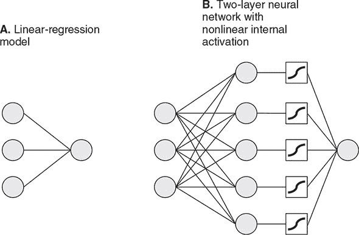
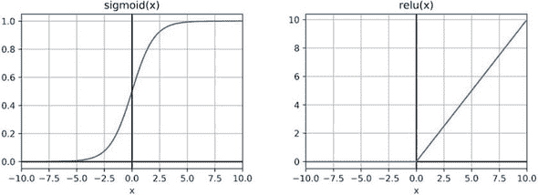
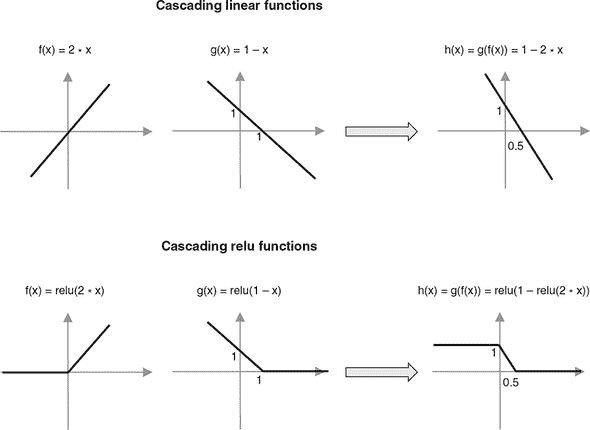
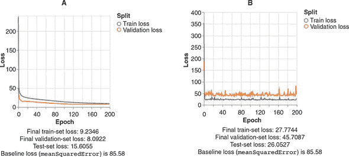
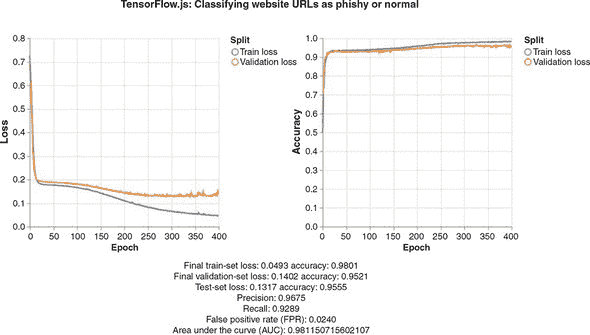
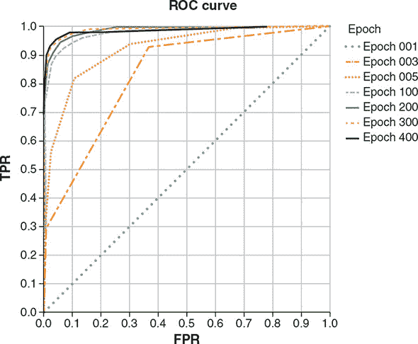
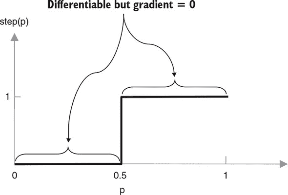
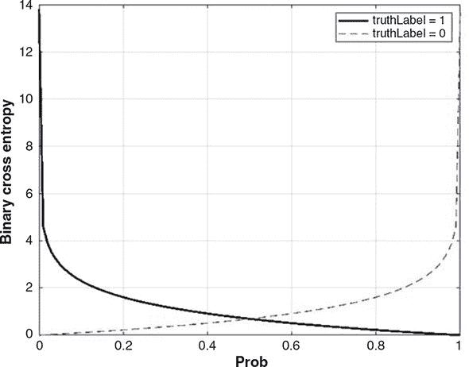
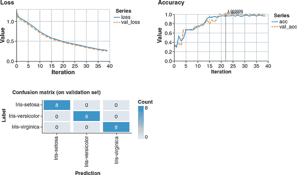
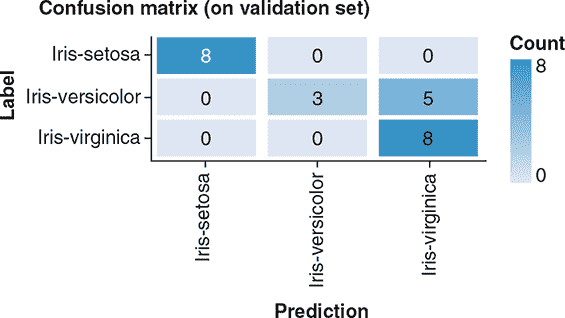

## 第三章：添加非线性：超越加权和

*本章内容*

+   什么是非线性，神经网络隐藏层中的非线性如何增强网络的容量并导致更好的预测准确性

+   超参数是什么，以及调整它们的方法

+   通过在输出层引入非线性进行二分类，以钓鱼网站检测示例为例介绍

+   多类分类以及它与二分类的区别，以鸢尾花示例介绍

在本章中，您将在第二章中奠定的基础上，允许您的神经网络学习更复杂的映射，从特征到标签。我们将介绍的主要增强是*非线性*——一种输入和输出之间的映射，它不是输入元素的简单加权和。非线性增强了神经网络的表征能力，并且当正确使用时，在许多问题上提高了预测准确性。我们将继续使用波士顿房屋数据集来说明这一点。此外，本章还将更深入地研究*过拟合*和*欠拟合*，以帮助您训练模型，这些模型不仅在训练数据上表现良好，而且在模型训练过程中没有见过的数据上达到良好的准确性，这才是模型质量的最终标准。

### 3.1\. 非线性：它是什么，它有什么用处

让我们从上一章的波士顿房屋示例中继续进行。使用一个密集层，您看到训练模型导致的 MSE 对应于大约 5000 美元的误差估计。我们能做得更好吗？答案是肯定的。为了创建一个更好的波士顿房屋数据模型，我们为其添加了一个更多的密集层，如以下代码列表所示（来自波士顿房屋示例的 index.js）。

##### 列表 3.1\. 定义波士顿房屋问题的两层神经网络

```js
export function multiLayerPerceptronRegressionModel1Hidden() {
  const model = tf.sequential();
  model.add(tf.layers.dense({
    inputShape: [bostonData.numFeatures],
    units: 50,
    activation: 'sigmoid',
    kernelInitializer: 'leCunNormal'        ***1***
  }));
  model.add(tf.layers.dense({units: 1}));   ***2***

  model.summary();                          ***3***
  return model;
};
```

+   ***1*** 指定了如何初始化内核值；参见 3.1.2 节讨论通过超参数优化选择的方式。

+   ***2*** 添加一个隐藏层

+   ***3*** 打印模型拓扑结构的文本摘要

要查看此模型的运行情况，请首先运行`yarn && yarn watch`命令，如第二章中所述。一旦网页打开，请点击 UI 中的 Train Neural Network Regressor (1 Hidden Layer)按钮，以开始模型的训练。

模型是一个双层网络。第一层是一个具有 50 个单元的稠密层。它也配置了自定义激活函数和内核初始化程序，我们将在第 3.1.2 节讨论。这一层是一个*隐藏*层，因为其输出不是直接从模型外部看到的。第二层是一个具有默认激活函数（线性激活）的稠密层，结构上与我们在第二章使用的纯线性模型中使用的同一层一样。这一层是一个*输出*层，因为其输出是模型的最终输出，并且是模型的`predict()`方法返回的内容。您可能已经注意到代码中的函数名称将模型称为*多层感知器*（MLP）。这是一个经常使用的术语，用来描述神经网络，其 1）拥有没有回路的简单拓扑结构（所谓*前馈神经网络*）和 2）至少有一层隐藏层。本章中您将看到的所有模型都符合这一定义。

清单 3.1 中的`model.summary()`调用是新的。这是一个诊断/报告工具，将 TensorFlow.js 模型的拓扑结构打印到控制台（在浏览器的开发者工具中或在 Node.js 的标准输出中）。以下是双层模型生成的结果：

```js
_________________________________________________________________
Layer (type)                 Output shape              Param #
=================================================================
dense_Dense1 (Dense)         [null,50]                 650
 _________________________________________________________________
dense_Dense2 (Dense)         [null,1]                  51
=================================================================
Total params: 701
Trainable params: 701
Non-trainable params: 0
```

摘要中的关键信息包括：

+   层的名称和类型（第一列）。

+   每一层的输出形状（第二列）。这些形状几乎总是包含一个空维度作为第一（批处理）维度，代表着不确定和可变大小的批处理。

+   每层的权重参数数量（第三列）。这是一个计算各层权重的所有个别数量的计数。对于具有多个权重的层，这是跨所有权重求和。例如，本例中的第一个稠密层包含两个权重：形状为`[12, 50]`的内核和形状为`[50]`的偏置，导致`12 * 50 + 50 = 650`个参数。

+   模型的总权重参数数量（摘要底部），以及参数中可训练和不可训练的数量。到目前为止，我们看到的模型仅包含可训练参数，这些参数属于模型权重，在调用`tf.Model.fit()`时更新。在第五章讨论迁移学习和模型微调时，我们将讨论不可训练权重。

来自第二章纯线性模型的`model.summary()`输出如下。与线性模型相比，我们的双层模型包含大约 54 倍的权重参数。大部分额外权重来自于添加的隐藏层：

```js
_________________________________________________________________
Layer (type)                 Output shape              Param #
=================================================================
dense_Dense3 (Dense)         [null,1]                  13
=================================================================
Total params: 13
Trainable params: 13
Non-trainable params: 0
```

因为两层模型包含更多层和权重参数，其训练和推断消耗更多的计算资源和时间。增加的成本是否值得准确度的提高？当我们为这个模型训练 200 个 epochs 时，我们得到的最终 MSE 在测试集上落在 14-15 的范围内（由于初始化的随机性而产生的变异性），相比之下，线性模型的测试集损失约为 25。我们的新模型最终的误差为美元 3,700-3,900，而纯线性尝试的误差约为 5,000 美元。这是一个显著的改进。

#### 3.1.1\. 建立神经网络非线性的直觉

为什么准确度会提高呢？关键在于模型的增强复杂性，正如图 3.1 所示。首先，有一个额外的神经元层，即隐藏层。其次，隐藏层包含一个非线性的*激活函数*（在代码中指定为`activation: 'sigmoid'`），在图 3.1 的面板 B 中用方框表示。激活函数^([1])是逐元素的转换。sigmoid 函数是一种“压缩”非线性，它“压缩”了所有从负无穷到正无穷的实数值到一个更小的范围（在本例中是 0 到+1）。它的数学方程和图表如图 3.2 所示。让我们以隐藏的稠密层为例。假设矩阵乘法和加法的结果与偏差的结果是一个由以下随机值数组组成的 2D 张量：

> ¹
> 
> *激活函数*这个术语来源于对生物神经元的研究，它们通过*动作电位*（细胞膜上的电压尖峰）相互通信。一个典型的生物神经元从多个上游神经元接收输入，通过称为*突触*的接触点。上游神经元以不同的速率发出动作电位，这导致神经递质的释放和突触上离子通道的开闭。这反过来导致了接收神经元膜上的电压变化。这与稠密层中的单位所见到的加权和有些相似。只有当电位超过一定的阈值时，接收神经元才会实际产生动作电位（即被“激活”），从而影响下游神经元的状态。在这个意义上，典型生物神经元的激活函数与 relu 函数（图 3.2，右面板）有些相似，它在输入的某个阈值以下有一个“死区”，并且随着输入在阈值以上的增加而线性增加（至少到达某个饱和水平，这并不被 relu 函数所捕捉）。

```js
[[1.0], [0.5], ..., [0.0]],
```

##### 图 3.1。为波士顿住房数据集创建的线性回归模型（面板 A）和两层神经网络（面板 B）。为了清晰起见，在面板 B 中，我们将输入特征的数量从 12 个减少到 3 个，并将隐藏层的单元数量从 50 个减少到 5 个。每个模型只有一个输出单元，因为这些模型解决单变量（单目标数值）回归问题。面板 B 描绘了模型隐藏层的非线性（sigmoid）激活。



然后，通过将 sigmoid（`S`）函数应用于每个元素的 50 个元素中的每一个，得到密集层的最终输出，如下所示：

```js
[[S(1.0)], [S(0.5)], ..., [S(0.0)]] = [[0.731], [0.622], ..., [0.0]]
```

为什么这个函数被称为*非线性*？直观地说，激活函数的图形不是一条直线。例如，sigmoid 是一条曲线（图 3.2，左侧面板），而 relu 是两条线段的拼接（图 3.2，右侧面板）。尽管 sigmoid 和 relu 是非线性的，但它们的一个特性是它们在每个点上都是平滑且可微的，这使得可以通过它们进行反向传播^([2])。如果没有这个特性，就不可能训练包含这种激活函数的层的模型。

> ²
> 
> 如果需要回顾反向传播，请参阅第 2.2.2 节。

##### 图 3.2。用于深度神经网络的两个常用非线性激活函数。左：sigmoid 函数 `S(x) = 1 / (1 + e ^ -x)`。右：修正线性单元（relu）函数 `relu(x) = {0:x < 0, x:x >= 0}`



除了 sigmoid 函数之外，在深度学习中还经常使用一些其他类型的可微非线性函数。其中包括 relu 和双曲正切函数（tanh）。在后续的例子中遇到它们时，我们将对它们进行详细描述。

##### 非线性和模型容量

为什么非线性能够提高我们模型的准确性？非线性函数使我们能够表示更多样化的输入-输出关系。现实世界中的许多关系大致是线性的，比如我们在上一章中看到的下载时间问题。但是，还有许多其他关系不是线性的。很容易构想出非线性关系的例子。考虑一个人的身高与年龄之间的关系。身高仅在某一点之前大致与年龄线性变化，之后会弯曲并趋于稳定。另一个完全合理的情景是，房价可以与社区犯罪率呈负相关，但前提是犯罪率在某一范围内。一个纯线性模型，就像我们在上一章中开发的模型一样，无法准确地建模这种类型的关系，而 sigmoid 非线性则更适合于建模这种关系。当然，犯罪率-房价关系更像是一个倒置的（下降的）sigmoid 函数，而不是左侧面板中原始的增长函数。但是我们的神经网络可以毫无问题地建模这种关系，因为 sigmoid 激活前后都是由可调节权重的线性函数。

但是，通过将线性激活替换为非线性激活（比如 sigmoid），我们会失去学习数据中可能存在的任何线性关系的能力吗？幸运的是，答案是否定的。这是因为 sigmoid 函数的一部分（靠近中心的部分）非常接近一条直线。其他经常使用的非线性激活函数，比如 tanh 和 relu，也包含线性或接近线性的部分。如果输入的某些元素与输出的某些元素之间的关系大致是线性的，那么一个带有非线性激活函数的密集层完全可以学习到使用激活函数的接近线性部分的正确权重和偏差。因此，向密集层添加非线性激活会导致它能够学习的输入-输出关系的广度增加。

此外，非线性函数与线性函数不同之处在于级联非线性函数会导致更丰富的非线性函数集合。这里，“级联”是指将一个函数的输出作为另一个函数的输入。假设有两个线性函数，

```js
f(x) = k1 * x + b1
```

和

```js
g(x) = k2 * x + b2
```

级联两个函数等同于定义一个新函数`h`：

```js
h(x) = g(f(x)) = k2 * (k1 * x + b1) + b2 = (k2 * k1) * x + (k2 * b1 + b2)
```

如您所见，`h`仍然是一个线性函数。它的核（斜率）和偏差（截距）与`f1`和`f2`的不同。斜率现在是`(k2 * k1)`，偏差现在是`(k2 * b1 + b2)`。级联任意数量的线性函数始终会产生一个线性函数。

但是，请考虑一个经常使用的非线性激活函数：relu。在图 3.3 的底部，我们说明了当您级联两个具有线性缩放的 relu 函数时会发生什么。通过级联两个缩放的 relu 函数，我们得到一个看起来根本不像 relu 的函数。它具有一个新形状（在这种情况下，是由两个平坦部分包围的向下倾斜的部分）。进一步级联阶跃函数与其他 relu 函数将得到一组更多样化的函数，例如“窗口”函数，由多个窗口组成的函数，窗口叠加在更宽的窗口上的函数等（未显示在图 3.3 中）。通过级联 relu 等非线性函数，您可以创建出非常丰富的一系列函数形状。但这与神经网络有什么关系呢？实质上，神经网络是级联函数。神经网络的每一层都可以看作是一个函数，而将这些层堆叠起来就相当于级联这些函数，形成更复杂的函数，即神经网络本身。这应该清楚地说明为什么包含非线性激活函数会增加模型能够学习的输入-输出关系范围。这也让你直观地理解了常用技巧“向深度神经网络添加更多层”以及为什么它通常（但并非总是！）会导致更能拟合数据集的模型。

##### 图 3.3。级联线性函数（顶部）和非线性函数（底部）。级联线性函数总是导致线性函数，尽管具有新的斜率和截距。级联非线性函数（例如 relu 在本例中）会导致具有新形状的非线性函数，例如本例中的“向下阶跃”函数。这说明了为什么在神经网络中使用非线性激活函数以及级联它们会导致增强的表示能力（即容量）。



机器学习模型能够学习的输入-输出关系范围通常被称为模型的*容量*。从先前关于非线性的讨论中，我们可以看出，具有隐藏层和非线性激活函数的神经网络与线性回归器相比具有更大的容量。这就解释了为什么我们的两层网络在测试集准确度方面比线性回归模型表现出更好的效果。

你可能会问，由于级联非线性激活函数会导致更大的容量（如图 3.3 的底部所示），我们是否可以通过向神经网络添加更多的隐藏层来获得更好的波士顿房价问题模型？`multiLayerPerceptronRegressionModel2Hidden()`函数位于 index.js 中，它连接到标题为训练神经网络回归器（2 个隐藏层）的按钮。该函数确实执行了这样的操作。请参阅以下代码摘录（来自波士顿房价示例的 index.js）。

##### 列表 3.2\. 为波士顿房屋问题定义一个三层神经网络

```js
export function multiLayerPerceptronRegressionModel2Hidden() {
  const model = tf.sequential();
  model.add(tf.layers.dense({               ***1***
    inputShape: [bostonData.numFeatures],   ***1***
    units: 50,                              ***1***
    activation: 'sigmoid',                  ***1***
    kernelInitializer: 'leCunNormal'        ***1***
  }));                                      ***1***
  model.add(tf.layers.dense({               ***2***
    units: 50,                              ***2***
    activation: 'sigmoid',                  ***2***
    kernelInitializer: 'leCunNormal'        ***2***
  }));                                      ***2***
  model.add(tf.layers.dense({units: 1}));

  model.summary();                          ***3***
  return model;
};
```

+   ***1*** 添加第一个隐藏层

+   ***2*** 添加另一个隐藏层

+   ***3*** 展示模型拓扑的文本摘要

在`summary()`打印输出中（未显示），你可以看到该模型包含三层——比 列表 3.1 中的模型多一层。它也具有显著更多的参数：3,251 个，相比两层模型中的 701 个。额外的 2,550 个权重参数是由于包括了第二个隐藏层造成的，它由形状为`[50, 50]`的内核和形状为`[50]`的偏差组成。

重复训练模型多次，我们可以对三层网络最终测试集（即评估）MSE 的范围有所了解：大致为 10.8–13.4。这相当于对$3,280–$3,660 的误估，超过了两层网络的$3,700–$3,900。因此，我们通过添加非线性隐藏层再次提高了模型的预测准确性，增强了其容量。

##### 避免将层堆叠而没有非线性的谬误

另一种看到非线性激活对改进波士顿房屋模型的重要性的方式是将其从模型中移除。列表 3.3 与 列表 3.1 相同，只是注释掉了指定 S 型激活函数的一行。移除自定义激活会导致该层具有默认的线性激活。模型的其他方面，包括层数和权重参数数量，都不会改变。

##### 列表 3.3\. 没有非线性激活的两层神经网络

```js
export function multiLayerPerceptronRegressionModel1Hidden() {
  const model = tf.sequential();
  model.add(tf.layers.dense({
    inputShape: [bostonData.numFeatures],
    units: 50,
    // activation: 'sigmoid',          ***1***
    kernelInitializer: 'leCunNormal'
  }));
  model.add(tf.layers.dense({units: 1}));

  model.summary();
  return model;
};
```

+   ***1*** 禁用非线性激活函数

这种改变如何影响模型的学习？通过再次点击 UI 中的 Train Neural Network Regressor（1 Hidden Layer）按钮，你可以得知测试集上的 MSE 上升到约 25，而当 S 型激活包含时大约为 14–15 的范围。换句话说，没有 S 型激活的两层模型表现与一层线性回归器大致相同！

这证实了我们关于级联线性函数的推理。通过从第一层中移除非线性激活，我们最终得到了一个两个线性函数级联的模型。正如我们之前展示的，结果是另一个线性函数，而模型的容量没有增加。因此，我们最终的准确性与线性模型大致相同并不奇怪。这提出了构建多层神经网络的常见“陷阱”：*一定要在隐藏层中包括非线性激活*。没有这样做会导致计算资源和时间的浪费，并有潜在的增加数值不稳定性（观察 图 3.4 的面板 B 中更加不稳定的损失曲线）。稍后，我们将看到这不仅适用于密集层，还适用于其他层类型，如卷积层。

##### 图 3.4\. 比较使用（面板 A）和不使用（面板 B）Sigmoid 激活的训练结果。请注意，去除 Sigmoid 激活会导致训练、验证和评估集上的最终损失值更高（与之前的纯线性模型相当）且损失曲线不够平滑。请注意，两个图之间的 y 轴刻度是不同的。



##### 非线性和模型可解释性

在第二章中，我们展示了一旦在波士顿房屋数据集上训练了一个线性模型，我们就可以检查其权重并以相当有意义的方式解释其各个参数。例如，与“每个住宅的平均房间数”特征相对应的权重具有正值，而与“犯罪率”特征相对应的权重具有负值。这些权重的符号反映了房价与相应特征之间的预期正相关或负相关关系。它们的大小也暗示了模型对各种特征的相对重要性。鉴于您刚刚在本章学到的内容，一个自然的问题是：使用一个或多个隐藏层的非线性模型，是否仍然可能提出可理解和直观的权重值解释？

访问权重值的 API 在非线性模型和线性模型之间完全相同：您只需在模型对象或其组成层对象上使用`getWeights()`方法。以清单 3.1 中的 MLP 为例——您可以在模型训练完成后（`model.fit()`调用之后）插入以下行：

```js
model.layers[0].getWeights()[0].print();
```

这行打印了第一层（即隐藏层）的核心值。这是模型中的四个权重张量之一，另外三个是隐藏层的偏置和输出层的核心和偏置。关于打印输出的一件事值得注意的是，它的大小比我们打印线性模型的核心时要大：

```js
Tensor
    [[-0.5701274, -0.1643915, -0.0009151, ..., 0.313205  , -0.3253246],
     [-0.4400523, -0.0081632, -0.2673715, ..., 0.1735748 , 0.0864024 ],
     [0.6294659 , 0.1240944 , -0.2472516, ..., 0.2181769 , 0.1706504 ],
     [0.9084488 , 0.0130388 , -0.3142847, ..., 0.4063887 , 0.2205501 ],
     [0.431214  , -0.5040522, 0.1784604 , ..., 0.3022115 , -0.1997144],
     [-0.9726604, -0.173905 , 0.8167523 , ..., -0.0406454, -0.4347956],
     [-0.2426955, 0.3274118 , -0.3496988, ..., 0.5623314 , 0.2339328 ],
     [-1.6335299, -1.1270424, 0.618491  , ..., -0.0868887, -0.4149215],
     [-0.1577617, 0.4981289 , -0.1368523, ..., 0.3636355 , -0.0784487],
     [-0.5824679, -0.1883982, -0.4883655, ..., 0.0026836 , -0.0549298],
     [-0.6993552, -0.1317919, -0.4666585, ..., 0.2831602 , -0.2487895],
     [0.0448515 , -0.6925298, 0.4945385 , ..., -0.3133179, -0.0241681]]
```

这是因为隐藏层由 50 个单元组成，导致权重大小为`[18, 50]`。与线性模型的核心中的`12 + 1 = 13`个参数相比，该核心有 900 个单独的权重参数。我们能赋予每个单独的权重参数一定的含义吗？一般来说，答案是否定的。这是因为从隐藏层的 50 个输出中很难找到任何一个的明显含义。这些是高维空间的维度，使模型能够学习（自动发现）其中的非线性关系。人类大脑在跟踪这种高维空间中的非线性关系方面并不擅长。一般来说，很难用通俗易懂的几句话来描述隐藏层每个单元的作用，或者解释它如何对深度神经网络的最终预测做出贡献。

此处的模型只有一个隐藏层。当有多个隐藏层堆叠在一起时（就像在清单 3.2 中定义的模型中一样），关系变得更加模糊和更难描述。尽管有研究努力寻找解释深度神经网络隐藏层含义的更好方法，^([3])并且针对某些类别的模型正在取得进展，^([4])但可以说，深度神经网络比浅层神经网络和某些类型的非神经网络机器学习模型（如决策树）更难解释。通过选择深度模型而不是浅层模型，我们基本上是在为更大的模型容量交换一些可解释性。

> ³
> 
> Marco Tulio Ribeiro，Sameer Singh 和 Carlos Guestrin，“局部可解释的模型无关解释（LIME）：简介”，O’Reilly，2016 年 8 月 12 日，[`mng.bz/j5vP`](http://mng.bz/j5vP)。
> 
> ⁴
> 
> Chris Olah 等，“可解释性的基本构建块”，Distill，2018 年 3 月 6 日，[`distill.pub/2018/building-blocks/`](https://distill.pub/2018/building-blocks/)。

#### 3.1.2\. 超参数和超参数优化

我们在清单 3.1 和 3.2 中对隐藏层的讨论一直侧重于非线性激活（sigmoid）。然而，该层的其他配置参数对于确保模型的良好训练结果也很重要。这些包括单位数量（50）和内核的 `'leCunNormal'` 初始化。后者是根据输入的大小生成进入内核初始值的随机数的特殊方式。它与默认的内核初始化器（`'glorotNormal'`）不同，后者使用输入和输出的大小。自然的问题是：为什么使用这个特定的自定义内核初始化器而不是默认的？为什么使用 50 个单位（而不是，比如，30 个）？通过反复尝试各种参数组合，这些选择是为了确保通过尽可能多地尝试各种参数组合获得最佳或接近最佳的模型质量。

参数，如单位数量、内核初始化器和激活函数，是模型的*超参数*。名称“超参数”表明这些参数与模型的权重参数不同，后者在训练期间通过反向传播自动更新（即，`Model.fit()` 调用）。一旦为模型选择了超参数，它们在训练过程中不会改变。它们通常确定权重参数的数量和大小（例如，考虑密集层的 `units` 字段）、权重参数的初始值（考虑 `kernelInitializer` 字段）以及它们在训练期间如何更新（考虑传递给 `Model.compile()` 的 `optimizer` 字段）。因此，它们位于高于权重参数的层次上。因此得名“超参数”。

除了层的大小和权重初始化器的类型之外，模型及其训练还有许多其他类型的超参数，例如

+   模型中的密集层数量，比如 listings 3.1 和 3.2 中的那些

+   用于密集层核的初始化器的类型

+   是否使用任何的权重正则化（参见第 8.1 节），如果是，则是正则化因子

+   是否包括任何的 dropout 层（例如，参见第 4.3.2 节），如果是，则是多少的 dropout 率

+   用于训练的优化器的类型（例如，`'sgd'`与`'adam'`之间的区别；参见 info box 3.1）

+   训练模型的时期数是多少

+   优化器的学习率

+   是否应该随着训练的进行逐渐减小优化器的学习率，如果是，以什么速度

+   训练的批次大小

列出的最后五个例子有些特殊，因为它们与模型本身的架构无关；相反，它们是模型训练过程的配置。然而，它们会影响训练的结果，因此被视为超参数。对于包含更多不同类型层的模型（例如，在第四章、第五章和第九章中讨论的卷积和循环层），还有更多可能可调整的超参数。因此，即使是一个简单的深度学习模型可能也有几十个可调整的超参数是很清楚的。

选择良好的超参数值的过程称为*超参数优化*或*超参数调整*。超参数优化的目标是找到一组参数，使训练后验证损失最低。不幸的是，目前没有一种确定的算法可以确定给定数据集和涉及的机器学习任务的最佳超参数。困难在于许多超参数是离散的，因此验证损失值对它们不是可微的。例如，密集层中的单元数和模型中的密集层数是整数；优化器的类型是一个分类参数。即使对于那些是连续的超参数（例如，正则化因子），对它们进行训练期间的梯度跟踪通常也是计算上过于昂贵的，因此在这些超参数空间中执行梯度下降实际上并不可行。超参数优化仍然是一个活跃的研究领域，深度学习从业者应该注意。  

鉴于缺乏一种标准的、开箱即用的超参数优化方法或工具，深度学习从业者通常采用以下三种方法。首先，如果手头的问题类似于一个经过深入研究的问题（比如，你可以在本书中找到的任何示例），你可以开始应用类似的模型来解决你的问题，并“继承”超参数。稍后，你可以在以该起点为中心的相对较小的超参数空间中进行搜索。

其次，有足够经验的从业者可能对于给定问题的合理良好的超参数有直觉和教育性的猜测。即使是这样主观的选择几乎从来都不是最佳的——它们形成了良好的起点，并且可以促进后续的微调。

第三，对于只有少量需要优化的超参数的情况（例如少于四个），我们可以使用格点搜索——即，穷举地迭代一些超参数组合，对每一个组合训练一个模型至完成，记录验证损失，并取得验证损失最低的超参数组合。例如，假设唯一需要调整的两个超参数是 1）密集层中的单元数和 2）学习率；你可以选择一组单元（`{10, 20, 50, 100, 200}`）和一组学习率（`{1e-5, 1e-4, 1e-3, 1e-2}`），并对两组进行交叉，从而得到一共`5 * 4 = 20`个要搜索的超参数组合。如果你要自己实现格点搜索，伪代码可能看起来像以下清单。

##### 清单 3.4\. 用于简单超参数格点搜索的伪代码

```js
function hyperparameterGridSearch():
  for units of [10, 20, 50, 100, 200]:
    for learningRate  of [1e-5, 1e-4, 1e-3, 1e-2]:
       Create a model using whose dense layer consists of `units` units
       Train the model with an optimizer with `learningRate`
       Calculate final validation loss as validationLoss
       if validationLoss < minValidationLoss
         minValidationLoss := validationLoss
         bestUnits := units
         bestLearningRate := learningRate

  return [bestUnits, bestLearningRate]
```

这些超参数的范围是如何选择的？嗯，深度学习无法提供正式答案的另一个地方。这些范围通常基于深度学习从业者的经验和直觉。它们也可能受到计算资源的限制。例如，一个单位过多的密集层可能导致模型训练过程太慢或推断时运行太慢。

通常情况下，需要优化的超参数数量较多，以至于在指数增长的超参数组合数量上进行搜索变得计算上过于昂贵。在这种情况下，应该使用比格点搜索更复杂的方法，如随机搜索^([5])和贝叶斯^([6])方法。

> ⁵
> 
> James Bergstra 和 Yoshua Bengio，“超参数优化的随机搜索”，*机器学习研究杂志*，2012 年，第 13 卷，第 281–305 页，[`mng.bz/WOg1`](http://mng.bz/WOg1)。
> 
> ⁶
> 
> Will Koehrsen，“贝叶斯超参数优化的概念解释”，*Towards Data Science*，2018 年 6 月 24 日，[`mng.bz/8zQw`](http://mng.bz/8zQw)。

### 3.2\. 输出的非线性：用于分类的模型

我们到目前为止看到的两个例子都是回归任务，我们试图预测一个数值（如下载时间或平均房价）。然而，机器学习中另一个常见的任务是分类。一些分类任务是*二元分类*，其中目标是对一个是/否问题的答案。技术世界充满了这种类型的问题，包括

+   是否给定的电子邮件是垃圾邮件

+   是否给定的信用卡交易是合法的还是欺诈的

+   是否给定的一秒钟音频样本包含特定的口语单词

+   两个指纹图像是否匹配（来自同一个人的同一个手指）

另一种分类问题是*多类别分类*任务，对此类任务也有很多例子：

+   一篇新闻文章是关于体育、天气、游戏、政治还是其他一般话题

+   一幅图片是猫、狗、铲子等等

+   给定电子笔的笔触数据，确定手写字符是什么

+   在使用机器学习玩一个类似 Atari 的简单视频游戏的场景中，确定游戏角色应该向四个可能的方向之一（上、下、左、右）前进，给定游戏的当前状态

#### 3.2.1\. 什么是二元分类？

我们将从一个简单的二元分类案例开始。给定一些数据，我们想要一个是/否的决定。对于我们的激励示例，我们将谈论钓鱼网站数据集。任务是，给定关于网页和其 URL 的一组特征，预测该网页是否用于*钓鱼*（伪装成另一个站点，目的是窃取用户的敏感信息）。

> ⁷
> 
> Rami M. Mohammad, Fadi Thabtah, 和 Lee McCluskey，“Phishing Websites Features,” [`mng.bz/E1KO`](http://mng.bz/E1KO)。

数据集包含 30 个特征，所有特征都是二元的（表示值为-1 和 1）或三元的（表示为-1、0 和 1）。与我们为波士顿房屋数据集列出所有单个特征不同，这里我们提供一些代表性的特征：

+   `HAVING_IP_ADDRESS`—是否使用 IP 地址作为域名的替代（二进制值：`{-1, 1}`）

+   `SHORTENING_SERVICE`—是否使用 URL 缩短服务（二进制值：`{1, -1}`）

+   `SSLFINAL_STATE`—URL 是否使用 HTTPS 并且发行者是受信任的，它是否使用 HTTPS 但发行者不受信任，或者没有使用 HTTPS（三元值：`{-1, 0, 1}`）

数据集由大约 5500 个训练示例和相同数量的测试示例组成。在训练集中，大约有 45%的示例是正面的（真正的钓鱼网页）。在测试集中，正面示例的百分比大约是相同的。

这只是最容易处理的数据集类型——数据中的特征已经在一致的范围内，因此无需对其均值和标准偏差进行归一化，就像我们为波士顿房屋数据集所做的那样。此外，相对于特征数量和可能预测数量（两个——是或否），我们有大量的训练示例。总的来说，这是一个很好的健全性检查，表明这是一个我们可以处理的数据集。如果我们想要花更多时间研究我们的数据，我们可能会进行成对特征相关性检查，以了解是否有冗余信息；但是，这是我们的模型可以容忍的。

由于我们的数据与我们用于波士顿房屋（后归一化）的数据相似，我们的起始模型基于相同的结构。此问题的示例代码可在 tfjs-examples 存储库的 website-phishing 文件夹中找到。您可以按照以下方式查看和运行示例：

```js
git clone https://github.com/tensorflow/tfjs-examples.git
cd tfjs-examples/website-phishing
yarn && yarn watch
```

##### 列表 3.5. 为钓鱼检测定义二分类模型（来自 index.js）

```js
const model = tf.sequential();
model.add(tf.layers.dense({
  inputShape: [data.numFeatures],
  units: 100,
  activation: 'sigmoid'
}));
model.add(tf.layers.dense({units: 100, activation: 'sigmoid'}));
model.add(tf.layers.dense({units: 1, activation: 'sigmoid'}));
model.compile({
  optimizer: 'adam',
  loss: 'binaryCrossentropy',
  metrics: ['accuracy']
});
```

这个模型与我们为波士顿房屋问题构建的多层网络有很多相似之处。它以两个隐藏层开始，两者都使用 sigmoid 激活。最后（输出）有确切的 1 个单元，这意味着模型为每个输入示例输出一个数字。然而，这里的一个关键区别是，我们用于钓鱼检测的模型的最后一层具有 sigmoid 激活，而不是波士顿房屋模型中的默认线性激活。这意味着我们的模型受限于只能输出介于 0 和 1 之间的数字，这与波士顿房屋模型不同，后者可能输出任何浮点数。

之前，我们已经看到 sigmoid 激活对隐藏层有助于增加模型容量。但是为什么在这个新模型的输出处使用 sigmoid 激活？这与我们手头问题的二分类特性有关。对于二分类，我们通常希望模型产生正类别的概率猜测——也就是说，模型“认为”给定示例属于正类别的可能性有多大。您可能还记得高中数学中的知识，概率始终是介于 0 和 1 之间的数字。通过让模型始终输出估计的概率值，我们获得了两个好处：

+   它捕获了对分配的分类的支持程度。`sigmoid`值为`0.5`表示完全不确定性，其中每个分类都得到了同等的支持。值为`0.6`表示虽然系统预测了正分类，但支持程度很低。值为`0.99`表示模型非常确定该示例属于正类，依此类推。因此，我们使得将模型的输出转换为最终答案变得简单而直观（例如，只需在给定值处对输出进行阈值处理，例如`0.5`）。现在想象一下，如果模型的输出范围可能变化很大，那么找到这样的阈值将会有多难。

+   我们还使得更容易构造一个可微的损失函数，它根据模型的输出和真实的二进制目标标签产生一个衡量模型错失程度的数字。至于后者，当我们检查该模型使用的实际二元交叉熵时，我们将会更详细地阐述。

但是，问题是如何将神经网络的输出强制限制在`[0, 1]`范围内。神经网络的最后一层通常是一个密集层，它对其输入执行矩阵乘法(`matMul`)和偏置加法(`biasAdd`)操作。在`matMul`或`biasAdd`操作中都没有固有的约束，以保证结果在`[0, 1]`范围内。将`sigmoid`等压缩非线性添加到`matMul`和`biasAdd`的结果中是实现`[0, 1]`范围的一种自然方法。

清单 3.5 中代码的另一个新方面是优化器的类型：`'adam'`，它与之前示例中使用的`'sgd'`优化器不同。`adam`与`sgd`有何不同？正如你可能还记得上一章第 2.2.2 节所述，`sgd`优化器总是将通过反向传播获得的梯度乘以一个固定数字（学习率乘以-1）以计算模型权重的更新。这种方法有一些缺点，包括当选择较小的学习率时，收敛速度较慢，并且当损失（超）表面的形状具有某些特殊属性时，在权重空间中出现“之”形路径。`adam`优化器旨在通过以一种智能方式使用梯度的历史（来自先前的训练迭代）的乘法因子来解决这些`sgd`的缺点。此外，它对不同的模型权重参数使用不同的乘法因子。因此，与一系列深度学习模型类型相比，`adam`通常导致更好的收敛性和对学习率选择的依赖性较小；因此，它是优化器的流行选择。TensorFlow.js 库提供了许多其他优化器类型，其中一些也很受欢迎（如`rmsprop`）。信息框 3.1 中的表格提供了它们的简要概述。

|  |
| --- |

**TensorFlow.js 支持的优化器**

下表总结了 TensorFlow.js 中最常用类型的优化器的 API，以及对每个优化器的简单直观解释。

**TensorFlow.js 中常用的优化器及其 API**

| 名称 | API（字符串） | API（函数） | 描述 |
| --- | --- | --- | --- |
| 随机梯度下降（SGD） | 'sgd' | tf.train.sgd | 最简单的优化器，始终使用学习率作为梯度的乘子 |
| Momentum | 'momentum' | tf.train.momentum | 以一种方式累积过去的梯度，使得对于某个权重参数的更新在过去的梯度更多地朝着同一方向时变得更快，并且当它们在方向上发生大变化时变得更慢 |
| RMSProp | 'rmsprop' | tf.train.rmsprop | 通过跟踪模型不同权重参数的最近梯度的均方根（RMS）值的历史记录，为不同的权重参数设置不同的乘法因子；因此得名 |
| AdaDelta | 'adadelta' | tf.train.adadelta | 类似于 RMSProp，以一种类似的方式为每个单独的权重参数调整学习率 |
| ADAM | 'adam' | tf.train.adam | 可以理解为 AdaDelta 的自适应学习率方法和动量方法的结合 |
| AdaMax | 'adamax' | tf.train.adamax | 类似于 ADAM，但使用稍微不同的算法跟踪梯度的幅度 |

一个明显的问题是，针对你正在处理的机器学习问题和模型，应该使用哪种优化器。不幸的是，在深度学习领域尚无共识（这就是为什么 TensorFlow.js 提供了上表中列出的所有优化器！）。在实践中，你应该从流行的优化器开始，包括 `adam` 和 `rmsprop`。在有足够的时间和计算资源的情况下，你还可以将优化器视为超参数，并通过超参数调整找到为你提供最佳训练结果的选择（参见 section 3.1.2）。

|  |
| --- |

#### 3.2.2\. 衡量二元分类器的质量：准确率、召回率、准确度和 ROC 曲线

在二元分类问题中，我们发出两个值之一——0/1、是/否等等。在更抽象的意义上，我们将讨论正例和负例。当我们的网络进行猜测时，它要么正确要么错误，所以我们有四种可能的情况，即输入示例的实际标签和网络输出，如 table 3.1 所示。

##### 表 3.1\. 二元分类问题中的四种分类结果类型

|   |   | 预测 |
| --- | --- | --- |
|   |   | 正类 | 负类 |
|   | 正类 | 真正例（TP） | 假反例（FN） |
|   | 负类 | 假正例（FP） | 真负例（TN） |

真正的正例（TP）和真正的负例（TN）是模型预测出正确答案的地方；假正例（FP）和假负例（FN）是模型出错的地方。如果我们用计数填充这四个单元格，我们就得到了一个*混淆矩阵*；表 3.2 显示了我们钓鱼检测问题的一个假设性混淆矩阵。

##### 表 3.2\. 一个假设的二元分类问题的混淆矩阵

|   |   | 预测 |
| --- | --- | --- |
|   |   | 正例 | 负例 |
|   | 正例 | 4 | 2 |
|   | 负例 | 1 | 93 |

在我们假设的钓鱼示例结果中，我们看到我们正确识别了四个钓鱼网页，漏掉了两个，而且有一个误报。现在让我们来看看用于表达这种性能的不同常见指标。

*准确率*是最简单的度量标准。它量化了多少百分比的示例被正确分类：

```js
Accuracy = (#TP + #TN) / #examples = (#TP + #TN) / (#TP + #TN + #FP + #FN)
```

在我们特定的例子中，

```js
Accuracy = (4 + 93) / 100 = 97%
```

准确率是一个易于沟通和易于理解的概念。然而，它可能会具有误导性——在二元分类任务中，我们通常没有相等分布的正负例。我们通常处于这样的情况：正例要远远少于负例（例如，大多数链接不是钓鱼网站，大多数零件不是有缺陷的，等等）。如果 100 个链接中只有 5 个是钓鱼的，我们的网络可以总是预测为假，并获得 95% 的准确率！这样看来，准确率似乎是我们系统的一个非常糟糕的度量。高准确率听起来总是很好，但通常会误导人。监视准确率是件好事，但作为损失函数使用则是一件非常糟糕的事情。

下一对指标试图捕捉准确率中缺失的微妙之处——*精确率*和*召回率*。在接下来的讨论中，我们通常考虑的是一个正例意味着需要进一步的行动——一个链接被标记，一篇帖子被标记为需要手动审查——而负例表示现状不变。这些指标专注于我们的预测可能出现的不同类型的“错误”。

*精确率*是模型预测的正例中实际为正例的比率：

```js
precision = #TP / (#TP + #FP)
```

根据我们混淆矩阵的数字，我们将计算

```js
precision = 4 / (4 + 1) = 80%
```

与准确率类似，通常可以操纵精确率。例如，您可以通过仅将具有非常高 S 型输出（例如 >0.95，而不是默认的 >0.5）的输入示例标记为正例，从而使您的模型非常保守地发出正面预测。这通常会导致精确率提高，但这样做可能会导致模型错过许多实际的正例（将它们标记为负例）。这最后一个成本被常与精确率配合使用并补充的度量所捕获，即召回率。

*召回率*是模型将实际正例分类为正例的比率：

```js
recall = #TP / (#TP + #FN)
```

根据示例数据，我们得到了一个结果

```js
recall = 4 / (4 + 2) = 66.7%
```

在样本集中所有阳性样本中，模型发现了多少个？通常会有一个有意识的决定，即接受较高的误报率以降低遗漏的可能性。为了优化这一指标，你可以简单地声明所有样本为阳性；由于假阳性不进入计算，因此你可以在降低精确度的代价下获得 100%的召回率。

我们可以看到，制作一个在准确度、召回率或精确度上表现出色的系统相当容易。在现实世界中的二元分类问题中，同时获得良好的精确度和召回率通常很困难。（如果这样做很容易，你就会面临一个简单的问题，可能根本不需要使用机器学习。）精确度和召回率涉及在对正确答案存在根本不确定的复杂区域调整模型。你会看到更多细致和组合的指标，如*在 X%召回率下的精确度*，其中 X 通常为 90%——如果我们调整到至少发现 X%的阳性样本，精确度是多少？例如，在图 3.5 中，我们看到经过 400 个轮次的训练后，当模型的概率输出门槛设为 0.5 时，我们的钓鱼检测模型能够达到 96.8%的精确度和 92.9%的召回率。

##### 图 3.5。训练模型用于钓鱼网页检测的一轮结果示例。注意底部的各种指标：精确度、召回率和 FPR。曲线下面积（AUC）在 3.2.3 节中讨论。



如我们已略有提及的，一个重要的认识是，对正预测的选择，不需要在 sigmoid 输出上设置恰好为 0.5 的门槛。事实上，根据情况，它可能最好设定为 0.5 以上（但小于 1）或 0.5 以下（但大于 0）。降低门槛使模型在将输入标记为阳性时更加自由，这会导致更高的召回率但可能降低精确度。另一方面，提高门槛使模型在将输入标记为阳性时更加谨慎，通常会导致更高的精确度但可能降低召回率。因此，我们可以看到精确度和召回率之间存在权衡，这种权衡很难用我们迄今讨论过的任何一种指标来量化。幸运的是，二元分类研究的丰富历史为我们提供了更好的方式来量化和可视化这种权衡关系。我们接下来将讨论的 ROC 曲线是这种常用的工具之一。

#### 3.2.3。ROC 曲线：展示二元分类中的权衡

ROC 曲线被用于广泛的工程问题，其中包括二分类或特定类型事件的检测。全名“接收者操作特性”是一个来自雷达早期的术语。现在，你几乎看不到这个扩展名了。图 3.6 是我们应用程序的一个样本 ROC 曲线。

##### 图 3.6. 在钓鱼检测模型训练期间绘制的一组样本 ROC 曲线。每条曲线对应不同的周期数。这些曲线显示了二分类模型随着训练的进展而逐渐改进的质量。



正如你可能已经在图 3.6 的坐标轴标签中注意到的，ROC 曲线并不是通过将精确度和召回率指标相互绘制得到的。相反，它们是基于两个稍微不同的指标。ROC 曲线的横轴是*假阳性率*（FPR），定义为

```js
FPR = #FP / (#FP + #TN)
```

ROC 曲线的纵轴是*真阳性率*（TPR），定义为

```js
TPR = #TP / (#TP + #FN) = recall
```

TPR 与召回率具有完全相同的定义，只是使用了不同的名称。然而，FPR 是一些新的东西。分母是实际类别为负的案例数量；分子是所有误报的数量。换句话说，FPR 是将实际上是负的案例错误分类为正的比例，这是一个常常被称为*虚警（false alarm）*的概率。表 3.3 总结了在二分类问题中遇到的最常见的指标。

##### 表 3.3. 二分类问题中常见的指标

| 指标名称 | 定义 | ROC 曲线或精确度/召回率曲线中的使用方式 |
| --- | --- | --- |
| 准确度（Accuracy） | (#TP + #TN) / (#TP + #TN + # FP + #FN) | （ROC 曲线中不使用） |
| 精确度（Precision） | #TP / (#TP + #FP) | 精确度/召回率曲线的纵轴 |
| 召回率/灵敏度/真阳性率（TPR） | #TP / (#TP + #FN) | ROC 曲线的纵轴（如图 3.6）或精确度/召回率曲线的横轴 |
| 假阳性率（False positive rate，FPR） | #FP / (#FP + #TN) | ROC 曲线的横轴（见图 3.6） |
| 曲线下面积（Area under the curve，AUC） | 将 ROC 曲线的数值积分计算得出；查看代码示例 3.7 以获取示例 | （ROC 曲线不使用，而是从 ROC 曲线计算得到） |

图 3.6 中的七条 ROC 曲线分别绘制于七个不同的训练周期的开头，从第一个周期 (周期 001) 到最后一个周期 (周期 400)。每条曲线都是基于模型在测试数据上的预测结果（而不是训练数据）创建的。代码清单 3.6 显示了如何利用 `Model.fit()` API 中的 `onEpochBegin` 回调函数详细实现此过程。这种方法使您可以在训练过程中执行有趣的分析和可视化，而不需要编写 `for` 循环或使用多个 `Model.fit()` 调用。

##### 代码清单 3.6 使用回调函数在模型训练中间绘制 ROC 曲线

```js
  await model.fit(trainData.data, trainData.target, {
    batchSize,
    epochs,
    validationSplit: 0.2,
    callbacks: {
    onEpochBegin: async (epoch) => {
        if ((epoch + 1)% 100 === 0 ||
                        epoch === 0 || epoch === 2 || epoch === 4) {
                                                            ***1***
            const probs = model.predict(testData.data);
            drawROC(testData.target, probs, epoch);
        }
      },
      onEpochEnd: async (epoch, logs) => {
        await ui.updateStatus(
                `Epoch ${epoch + 1} of ${epochs} completed.`);
        trainLogs.push(logs);
        ui.plotLosses(trainLogs);
        ui.plotAccuracies(trainLogs);
      }
    }
  });
```

+   ***1*** 每隔几个周期绘制 ROC 曲线。

函数 `drawROC()` 的主体包含了如何创建 ROC 曲线的细节（参见代码清单 3.7）。它执行以下操作：

+   根据神经网络的 S 型输出（概率）的阈值，可获取不同分类结果的集合。

+   将 TPR 绘制在 FPR 上以形成 ROC 曲线。

+   ⁸

如 图 3.6 所示，在训练开始时（周期 001），由于模型的权重是随机初始化的，ROC 曲线非常接近连接点 (0, 0) 和点 (1, 1) 的对角线。这就是随机猜测的样子。随着训练的进行，ROC 曲线越来越向左上角推进——那里的 FPR 接近 0，TPR 接近 1。如果我们专注于任何一个给定的 FPR 级别，例如 0.1，我们可以看到在训练过程中，相应的 TPR 值随着训练的进展而单调递增。简而言之，这意味着随着训练的进行，如果我们将假报警率（FPR）保持不变，就可以实现越来越高的召回率（TPR）。

“理想”的 ROC 曲线向左上角弯曲得越多，就会变成一个类似 γ^([8]) 形状的曲线。在这种情况下，您可以获得 100% 的 TPR 和 0% 的 FPR，这是任何二元分类器的“圣杯”。然而，在实际问题中，我们只能改进模型，将 ROC 曲线推向左上角，但理论上的左上角理想状态是无法实现的。

> 注释：γ 字母
> 
> 对于每个分类结果，将其与实际标签（目标）结合使用，计算 TPR 和 FPR。

基于对 ROC 曲线形状及其含义的讨论，我们可以看到通过查看其下方的区域（即 ROC 曲线和 x 轴之间的单位正方形的空间）来量化 ROC 曲线的好坏是可能的。这被称为*曲线下面积*（AUC），并且也在 listing 3.7 的代码中计算。这个指标比精确率、召回率和准确率更好，因为它考虑了假阳性和假阴性之间的权衡。随机猜测的 ROC 曲线（对角线）的 AUC 为 0.5，而γ形状的理想 ROC 曲线的 AUC 为 1.0。我们的钓鱼检测模型在训练后达到了 0.981 的 AUC。

##### listing 3.7 的代码用于计算和绘制 ROC 曲线和 AUC

```js
function drawROC(targets, probs, epoch) {
  return tf.tidy(() => {
    const thresholds = [                                                ***1***
      0.0, 0.05, 0.1, 0.15, 0.2, 0.25, 0.3, 0.35, 0.4, 0.45,            ***1***
      0.5, 0.55, 0.6, 0.65, 0.7, 0.75, 0.8, 0.85,                       ***1***
      0.9, 0.92, 0.94, 0.96, 0.98, 1.0                                  ***1***
    ];                                                                  ***1***
    const tprs = [];  // True positive rates.
    const fprs = [];  // False positive rates.
    let area = 0;
    for (let i = 0; i < thresholds.length; ++i) {
           const threshold = thresholds[i];
      const threshPredictions =                                         ***2***
               utils.binarize(probs, threshold).as1D();                 ***2***
      const fpr = falsePositiveRate(                                    ***3***
               targets,                                                 ***3***
      threshPredictions).arraySync();                                   ***3***
      const tpr = tf.metrics.recall(targets, threshPredictions).arraySync();
      fprs.push(fpr);
      tprs.push(tpr);

      if (i > 0) {                                                      ***4***
        area += (tprs[i] + tprs[i - 1]) * (fprs[i - 1] - fprs[i]) / 2;  ***4***
      }                                                                 ***4***
    }
    ui.plotROC(fprs, tprs, epoch);
    return area;
  });
}
```

+   ***1*** 一组手动选择的概率阈值

+   ***2*** 通过阈值将概率转换为预测

+   ***3*** falsePositiveRate()函数通过比较预测和实际目标来计算假阳性率。该函数在同一文件中定义。

+   ***4*** 用于 AUC 计算的面积累积

除了可视化二元分类器的特性外，ROC 还帮助我们在实际情况下做出明智的选择，比如如何选择概率阈值。例如，想象一下，我们是一家商业公司，正在开发钓鱼检测器作为一项服务。我们想要做以下哪项？

+   由于错过了真实的网络钓鱼网站将会在责任或失去合同方面给我们造成巨大的损失，因此将阈值设定相对较低。

+   由于我们更不愿意接受将正常网站误分类为可疑而导致用户提交投诉，因此将阈值设定相对较高。

每个阈值对应于 ROC 曲线上的一个点。当我们将阈值从 0 逐渐增加到 1 时，我们从图的右上角（其中 FPR 和 TPR 都为 1）移动到图的左下角（其中 FPR 和 TPR 都为 0）。在实际的工程问题中，选择 ROC 曲线上的哪个点的决定总是基于权衡这种相反的现实生活成本，并且在不同的客户和不同的业务发展阶段可能会有所不同。

除了 ROC 曲线之外，二元分类的另一个常用可视化方法是*精确率-召回率曲线*（有时称为 P/R 曲线，在 table 3.3 中简要提到）。与 ROC 曲线不同，精确率-召回率曲线将精确率绘制为召回率的函数。由于精确率-召回率曲线在概念上与 ROC 曲线相似，我们在这里不会深入讨论它们。

在 代码清单 3.7 中值得指出的一点是使用了 `tf.tidy()`。这个函数确保了在作为参数传递给它的匿名函数内创建的张量被正确地处理，这样它们就不会继续占用 WebGL 内存。在浏览器中，TensorFlow.js 无法管理用户创建的张量的内存，主要是因为 JavaScript 中缺乏对象终结和底层 TensorFlow.js 张量下层的 WebGL 纹理缺乏垃圾回收。如果这样的中间张量没有被正确清理，就会发生 WebGL 内存泄漏。如果允许这样的内存泄漏持续足够长的时间，最终会导致 WebGL 内存不足错误。附录 B 的 章节 1.3 包含了有关 TensorFlow.js 内存管理的详细教程。此外，附录 B 的 章节 1.5 中还有关于这个主题的练习题。如果您计划通过组合 TensorFlow.js 函数来定义自定义函数，您应该仔细研究这些章节。

#### 3.2.4\. 二元交叉熵：二元分类的损失函数

到目前为止，我们已经讨论了几种不同的度量标准，用于量化二元分类器的不同表现方面，比如准确率、精确率和召回率（表 3.3）。但我们还没有讨论一个重要的度量标准，一个可以微分并生成梯度来支持模型梯度下降训练的度量标准。这就是我们在 代码清单 3.5 中简要看到的 `binaryCrossentropy`，但我们还没有解释过：

```js
model.compile({
  optimizer: 'adam',
  loss: 'binaryCrossentropy',
  metrics: ['accuracy']
});
```

首先，你可能会问，为什么不能直接以精确度、准确度、召回率，或者甚至 AUC 作为损失函数？毕竟这些指标容易理解。此外，在之前我们见过的回归问题中，我们使用了 MSE 作为训练的损失函数，这是一个相当容易理解的指标。答案是，这些二分类度量指标都无法产生我们需要训练的梯度。以精确度指标为例：要了解为什么它不友好的梯度，请认识到计算精确度需要确定模型的预测哪些是正样本，哪些是负样本（参见 表 3.3 的第一行）。为了做到这一点，必须应用一个 *阈值函数*，将模型的 sigmoid 输出转换为二进制预测。这里就是问题的关键：虽然阈值函数（在更技术的术语中称为*step function*）几乎在任何地方都是可微分的（“几乎”是因为它在 0.5 的“跳跃点”处不可微分），但其导数始终恰好为零（参见图 3.7）！如果您试图通过该阈值函数进行反向传播会发生什么呢？因为上游梯度值在某些地方需要与该阈值函数的所有零导数相乘，所以您的梯度最终将全是零。更简单地说，如果将精确度（或准确度、召回率、AUC 等）选为损失，底层阶跃函数的平坦部分使得训练过程无法知道在权重空间中向哪个方向移动可以降低损失值。

##### 图 3.7 用于转换二分类模型的概率输出的阶跃函数，几乎在每个可微点都是可微分的。不幸的是，每个可微分点的梯度（导数）恰好为零。



因此，如果使用精确度作为损失函数，便无法计算有用的梯度，从而阻止了在模型的权重上获得有意义的更新。此限制同样适用于包括准确度、召回率、FPR 和 AUC 在内的度量。虽然这些指标对人类理解二分类器的行为很有用，但对于这些模型的训练过程来说是无用的。

我们针对二分类任务使用的损失函数是*二进制交叉熵*，它对应于我们的钓鱼检测模型代码中的 `'binaryCrossentropy'` 配置（见列表 3.5 和 3.6）。算法上，我们可以用以下伪代码来定义二进制交叉熵。

##### 列表 3.8 二进制交叉熵损失函数的伪代码^([9])

> ⁹
> 
> `binaryCrossentropy` 的实际代码需要防范 `prob` 或 `1 - prob` 等恰好为零的情况，否则如果将这些值直接传递给 `log` 函数，会导致无穷大。这是通过在将它们传递给对数函数之前添加一个非常小的正数（例如 `1e-6`，通常称为“epsilon”或“修正因子”）来实现的。

```js
function binaryCrossentropy(truthLabel, prob):
  if truthLabel is 1:
        return -log(prob)
  else:
   return -log(1 - prob)
```

在此伪代码中，`truthLabel` 是一个数字，取 0 到 1 的值，指示输入样本在现实中是否具有负（0）或正（1）标签。`prob` 是模型预测的样本属于正类的概率。请注意，与 `truthLabel` 不同，`prob` 应为实数，可以取 0 到 1 之间的任何值。`log` 是自然对数，以 *e*（2.718）为底，您可能还记得它来自高中数学。`binaryCrossentropy` 函数的主体包含一个 if-else 逻辑分支，根据 `truthLabel` 是 0 还是 1 执行不同的计算。图 3.8 在同一图中绘制了这两种情况。

##### 图 3.8。二元交叉熵损失函数。两种情况（`truthLabel = 1` 和 `truthLabel = 0`）分别绘制在一起，反映了 代码清单 3.8 中的 if-else 逻辑分支。



在查看 图 3.8 中的图表时，请记住较低的值更好，因为这是一个损失函数。关于损失函数需要注意的重要事项如下：

+   如果 `truthLabel` 为 1，`prob` 值接近 1.0 会导致较低的损失函数值。这是有道理的，因为当样本实际上是正例时，我们希望模型输出的概率尽可能接近 1.0。反之亦然：如果 `truthLabel` 为 0，则当概率值接近 0 时，损失值较低。这也是有道理的，因为在这种情况下，我们希望模型输出的概率尽可能接近 0。

+   与 图 3.7 中显示的二进制阈值函数不同，这些曲线在每个点都有非零斜率，导致非零梯度。这就是为什么它适用于基于反向传播的模型训练。

你可能会问的一个问题是，为什么不重复我们为回归模型所做的事情——只是假装 0-1 值是回归目标，并使用 MSE 作为损失函数？毕竟，MSE 是可微分的，并且计算真实标签和概率之间的 MSE 会产生与`binaryCrossentropy`一样的非零导数。答案与 MSE 在边界处具有“递减收益”有关。例如，在 表 3.4 中，我们列出了当 `truthLabel` 为 1 时一些 `prob` 值的 `binaryCrossentropy` 和 MSE 损失值。当 `prob` 接近 1（期望值）时，MSE 相对于`binaryCrossentropy`的减小速度会越来越慢。因此，当 `prob` 已经接近 1（例如，0.9）时，它不太好地“鼓励”模型产生较高（接近 1）的 `prob` 值。同样，当 `truthLabel` 为 0 时，MSE 也不如 `binaryCrossentropy` 那样好，不能生成推动模型的 `prob` 输出向 0 靠近的梯度。

##### 表 3.4\. 比较假想的二分类结果的二元交叉熵和 MSE 值

| 真实标签 | 概率 | 二元交叉熵 | MSE |
| --- | --- | --- | --- |
| 1 | 0.1 | 2.302 | 0.81 |
| 1 | 0.5 | 0.693 | 0.25 |
| 1 | 0.9 | 0.100 | 0.01 |
| 1 | 0.99 | 0.010 | 0.0001 |
| 1 | 0.999 | 0.001 | 0.000001 |
| 1 | 1 | 0 | 0 |

这展示了二分类问题与回归问题不同的另一个方面：对于二分类问题，损失（`binaryCrossentropy`）和指标（准确率、精确率等）是不同的，而对于回归问题通常是相同的（例如，`meanSquaredError`）。正如我们将在下一节看到的那样，多类别分类问题也涉及不同的损失函数和指标。

### 3.3\. 多类别分类

在 第 3.2 节 中，我们探讨了如何构建二分类问题的结构；现在我们将快速进入 *非二分类* 的处理方式——即，涉及三个或更多类别的分类任务。^([10]) 我们将使用用于说明多类别分类的数据集是 *鸢尾花数据集*，这是一个有着统计学根源的著名数据集（参见 [`en.wikipedia.org/wiki/Iris_flower_data_set`](https://en.wikipedia.org/wiki/Iris_flower_data_set)）。这个数据集关注于三种鸢尾花的品种，分别为 *山鸢尾*、*变色鸢尾* 和 *维吉尼亚鸢尾*。这三种鸢尾花可以根据它们的形状和大小来区分。在 20 世纪初，英国统计学家罗纳德·费舍尔测量了 150 个鸢尾花样本的花瓣和萼片（花的不同部位）的长度和宽度。这个数据集是平衡的：每个目标标签都有确切的 50 个样本。

> ¹⁰
> 
> 不要混淆 *多类别* 分类和 *多标签* 分类。在多标签分类中，单个输入示例可能对应于多个输出类别。一个例子是检测输入图像中各种类型物体的存在。一个图像可能只包括一个人；另一个图像可能包括一个人、一辆车和一个动物。多标签分类器需要生成一个表示适用于输入示例的所有类别的输出，无论该类别是一个还是多个。本节不涉及多标签分类。相反，我们专注于更简单的单标签、多类别分类，其中每个输入示例都对应于>2 个可能类别中的一个输出类别。

在这个问题中，我们的模型以四个数值特征（花瓣长度、花瓣宽度、萼片长度和萼片宽度）作为输入，并尝试预测一个目标标签（三种物种之一）。该示例位于 tfjs-examples 的 iris 文件夹中，您可以使用以下命令查看并运行：

```js
git clone https://github.com/tensorflow/tfjs-examples.git
cd tfjs-examples/iris
yarn && yarn watch
```

#### 3.3.1\. 对分类数据进行 one-hot 编码

在研究解决鸢尾花分类问题的模型之前，我们需要强调这个多类别分类任务中分类目标（物种）的表示方式。到目前为止，在本书中我们看到的所有机器学习示例都涉及更简单的目标表示，例如下载时间预测问题中的单个数字以及波士顿房屋问题中的数字，以及钓鱼检测问题中的二进制目标的 0-1 表示。然而，在鸢尾问题中，三种花的物种以稍微不那么熟悉的方式称为 *one-hot 编码* 进行表示。打开 data.js，您将注意到这一行：

```js
const ys = tf.oneHot(tf.tensor1d(shuffledTargets).toInt(), IRIS_NUM_CLASSES);
```

这里，`shuffledTargets` 是一个普通的 JavaScript 数组，其中包含按随机顺序排列的示例的整数标签。其元素的值均为 0、1 和 2，反映了数据集中的三种鸢尾花品种。通过调用 `tf.tensor1d(shuffledTargets).toInt()`，它被转换为 int32 类型的 1D 张量。然后将结果的 1D 张量传递到 `tf.oneHot()` 函数中，该函数返回形状为 `[numExamples, IRIS_NUM_CLASSES]` 的 2D 张量。`numExamples` 是 `targets` 包含的示例数，而 `IRIS_NUM_CLASSES` 简单地是常量 3。您可以通过在先前引用的行下面添加一些打印行来查看 `targets` 和 `ys` 的实际值，例如：

```js
const ys = tf.oneHot(tf.tensor1d(shuffledTargets).toInt(), IRIS_NUM_CLASSES);
// Added lines for printing the values of `targets` and `ys`.
console.log('Value of targets:', targets);
ys.print();[11]
```

> ¹¹
> 
> 与 `targets` 不同，`ys` 不是一个普通的 JavaScript 数组。相反，它是由 GPU 内存支持的张量对象。因此，常规的 console.log 不会显示其值。`print()` 方法是专门用于从 GPU 中检索值，以形状感知和人性化的方式进行格式化，并将其记录到控制台的方法。

一旦您进行了这些更改，Yarn `watch` 命令在终端启动的包捆绑器进程将自动重建 Web 文件。然后，您可以打开用于观看此演示的浏览器选项卡中的开发工具，并刷新页面。`console.log()` 和 `print()` 调用的打印消息将记录在开发工具的控制台中。您将看到的打印消息将类似于这样：

```js
Value of targets: (50) [0, 0, 0, 0, 0, 0, 0, 0, 0, 0, 0, 0, 0, 0, 0, 0, 0, 0,
     0, 0, 0, 0, 0, 0, 0, 0, 0, 0, 0, 0, 0, 0, 0, 0, 0, 0, 0, 0, 0, 0, 0, 0,
     0, 0, 0, 0, 0, 0, 0, 0]

Tensor
    [[1, 0, 0],
     [1, 0, 0],
     [1, 0, 0],
     ...,
     [1, 0, 0],
     [1, 0, 0],
     [1, 0, 0]]
```

或者

```js
Value of targets: (50) [1, 1, 1, 1, 1, 1, 1, 1, 1, 1, 1, 1, 1, 1, 1, 1, 1, 1,
     1, 1, 1, 1, 1, 1, 1, 1, 1, 1, 1, 1, 1, 1, 1, 1, 1, 1, 1, 1, 1, 1, 1, 1,
     1, 1, 1, 1, 1, 1, 1, 1]

Tensor
    [[0, 1, 0],
     [0, 1, 0],
     [0, 1, 0],
     ...,
     [0, 1, 0],
     [0, 1, 0],
     [0, 1, 0]]
```

等等。用言语来描述，以整数标签 0 为例，您会得到一个值为 `[1, 0, 0]` 的值行；对于整数标签为 1 的示例，您会得到一个值为 `[0, 1, 0]` 的行，依此类推。这是独热编码的一个简单明了的例子：它将一个整数标签转换为一个向量，该向量除了在对应标签的索引处的值为 1 之外，其余都为零。向量的长度等于所有可能类别的数量。向量中只有一个 1 值的事实正是这种编码方案被称为“独热”的原因。

对于您来说，这种编码可能看起来过于复杂了。在一个类别中使用三个数字来表示，为什么不使用一个单一的数字就能完成任务呢？为什么我们选择这种复杂的编码而不是更简单和更经济的单整数索引编码呢？这可以从两个不同的角度来理解。

首先，对于神经网络来说，输出连续的浮点型值要比整数值容易得多。在浮点型输出上应用舍入也不够优雅。一个更加优雅和自然的方法是，神经网络的最后一层输出几个单独的浮点型数值，每个数值通过一个类似于我们用于二元分类的 S 型激活函数的精心选择的激活函数被限制在 `[0, 1]` 区间内。在这种方法中，每个数字都是模型对输入示例属于相应类别的概率的估计。这正是独热编码的用途：它是概率分数的“正确答案”，模型应该通过其训练过程来拟合。

第二，通过将类别编码为整数，我们隐含地为类别创建了一个顺序。例如，我们可以将 *鸢尾花 setosa* 标记为 0，*鸢尾花 versicolor* 标记为 1，*鸢尾花 virginica* 标记为 2。但是，这样的编号方案通常是人为的和不合理的。例如，这种编号方案暗示 *setosa* 比 *versicolor* 更“接近” *virginica*，这可能并不正确。神经网络基于实数进行操作，并且基于诸如乘法和加法之类的数学运算。因此，它们对数字的数量和顺序敏感。如果将类别编码为单一数字，则成为神经网络必须学习的额外非线性关系。相比之下，独热编码的类别不涉及任何隐含的排序，因此不会以这种方式限制神经网络的学习能力。

就像我们将在第九章中看到的那样，独热编码不仅用于神经网络的输出目标，而且还适用于分类数据形成神经网络的输入。

#### 3.3.2\. Softmax 激活函数

了解了输入特征和输出目标的表示方式后，我们现在可以查看定义模型的代码（来自 iris/index.js）。

##### 列表 3.9\. 用于鸢尾花分类的多层神经网络

```js
  const model = tf.sequential();
  model.add(tf.layers.dense(
      {units: 10, activation: 'sigmoid', inputShape: [xTrain.shape[1]]}));
  model.add(tf.layers.dense({units: 3, activation: 'softmax'}));
  model.summary();

  const optimizer = tf.train.adam(params.learningRate);
  model.compile({
    optimizer: optimizer,
    loss: 'categoricalCrossentropy',
    metrics: ['accuracy'],
  });
```

在列表 3.9 中定义的模型导致了以下摘要：

```js
_________________________________________________________________
Layer (type)                 Output shape              Param #
=================================================================
dense_Dense1 (Dense)         [null,10]                 50
________________________________________________________________
dense_Dense2 (Dense)         [null,3]                  33
=================================================================
Total params: 83
Trainable params: 83
Non-trainable params:
________________________________________________________________
```

通过查看打印的概述，我们可以看出这是一个相当简单的模型，具有相对较少的（83 个）权重参数。输出形状`[null, 3]`对应于分类目标的独热编码。最后一层使用的激活函数，即*softmax*，专门设计用于多分类问题。softmax 的数学定义可以写成以下伪代码：

```js
softmax([x1, x2, ..., xn]) =
    [exp(x1) / (exp(x1) + exp(x2) + ... + exp(xn)),
     exp(x2) / (exp(x1) + exp(x2) + ... + exp(xn)),
     ...,
     exp(xn) / (exp(x1) + exp(x2) + ... + exp(xn))]
```

与我们之前见过的 sigmoid 激活函数不同，softmax 激活函数不是逐元素的，因为输入向量的每个元素都以依赖于所有其他元素的方式进行转换。具体来说，输入的每个元素被转换为其指数（以* e*=2.718 为底）的自然指数。然后指数被除以所有元素的指数的和。这样做有什么作用？首先，它确保了每个数字都在 0 到 1 的区间内。其次，保证了输出向量的所有元素之和为 1。这是一个理想的属性，因为 1）输出可以被解释为分配给各个类别的概率得分，2）为了与分类交叉熵损失函数兼容，输出必须满足此属性。第三，该定义确保输入向量中的较大元素映射到输出向量中的较大元素。举个具体的例子，假设最后一个密集层的矩阵乘法和偏置相加生成了一个向量

```js
[-3, 0, -8]
```

它的长度为 3，因为密集层被配置为具有 3 个单元。请注意，这些元素是浮点数，不受特定范围的约束。softmax 激活函数将向量转换为

```js
[0.0474107, 0.9522698, 0.0003195]
```

您可以通过运行以下 TensorFlow.js 代码（例如，在页面指向[js.tensorflow.org](http://js.tensorflow.org)时，在开发工具控制台中）来自行验证这一点：

```js
const x = tf.tensor1d([-3, 0, -8]);
tf.softmax(x).print();
```

Softmax 函数的输出有三个元素。1）它们都在`[0, 1]`区间内，2）它们的和为 1，3）它们的顺序与输入向量中的顺序相匹配。由于这些属性的存在，输出可以被解释为被模型分配的（概率）值，表示所有可能的类别。在前面的代码片段中，第二个类别被分配了最高的概率，而第一个类别被分配了最低的概率。

因此，当使用这种多类别分类器的输出时，你可以选择最高 softmax 元素的索引作为最终决策——也就是输入属于哪个类别的决策。这可以通过使用方法 `argMax()` 来实现。例如，这是 index.js 的摘录：

```js
const predictOut = model.predict(input);
const winner = data.IRIS_CLASSES[predictOut.argMax(-1).dataSync()[0]];
```

`predictOut` 是形状为 `[numExamples, 3]` 的二维张量。调用它的 `argMax0` 方法会导致形状被减少为 `[numExample]`。参数值 -1 表示 `argMax()` 应该在最后一个维度上查找最大值并返回它们的索引。例如，假设 `predictOut` 有以下值：

```js
    [[0  , 0.6, 0.4],
     [0.8, 0  , 0.2]]
```

那么，`argMax(-1)` 将返回一个张量，指示沿着最后（第二个）维度找到的最大值分别在第一个和第二个示例的索引为 1 和 0：

```js
    [1, 0]
```

#### 3.3.3\. 分类交叉熵：多类别分类的损失函数

在二元分类示例中，我们看到了如何使用二元交叉熵作为损失函数，以及为什么其他更易于人类理解的指标，如准确率和召回率，不能用作损失函数。多类别分类的情况相当类似。存在一个直观的度量标准——准确率——它是模型正确分类的例子的比例。这个指标对于人们理解模型的性能有重要意义，并且在 列表 3.9 中的这段代码片段中使用：

```js
    model.compile({
      optimizer: optimizer,
      loss: 'categoricalCrossentropy',
      metrics: ['accuracy'],
     });
```

然而，准确率对于损失函数来说是一个糟糕的选择，因为它遇到了与二元分类中的准确率相同的零梯度问题。因此，人们为多类别分类设计了一个特殊的损失函数：*分类交叉熵*。它只是将二元交叉熵推广到存在两个以上类别的情况。

##### 列表 3.10\. 用于分类交叉熵损失的伪代码

```js
function categoricalCrossentropy(oneHotTruth, probs):
  for i in (0 to length of oneHotTruth)
    if oneHotTruth(i) is equal to 1
      return -log(probs[i]);
```

在前面的伪代码中，`oneHotTruth` 是输入示例的实际类别的独热编码。`probs` 是模型的 softmax 概率输出。从这段伪代码中可以得出的关键信息是，就分类交叉熵而言，`probs` 中只有一个元素是重要的，那就是与实际类别对应的索引的元素。`probs` 的其他元素可以随意变化，但只要它们不改变实际类别的元素，就不会影响分类交叉熵。对于 `probs` 的特定元素，它越接近 1，交叉熵的值就越低。与二元交叉熵类似，分类交叉熵直接作为 `tf.metrics` 命名空间下的一个函数可用，你可以用它来计算简单但说明性的示例的分类交叉熵。例如，使用以下代码，你可以创建一个假设的独热编码的真实标签和一个假设的 `probs` 向量，并计算相应的分类交叉熵值：

```js
const oneHotTruth = tf.tensor1d([0, 1, 0]);
const probs = tf.tensor1d([0.2, 0.5, 0.3]);
tf.metrics.categoricalCrossentropy(oneHotTruth, probs).print();
```

这给出了一个约为 0.693 的答案。这意味着当模型对实际类别分配的概率为 0.5 时，`categoricalCrossentropy`的值为 0.693。你可以根据 pseudo-code(伪代码)进行验证。你也可以尝试将值从 0.5 提高或降低，看看`categoricalCrossentropy`如何变化（例如，参见 table 3.5）。表中还包括一列显示了单热真实标签和`probs`向量之间的 MSE。

##### 表 3.5. 不同概率输出下的分类交叉熵值。不失一般性，所有示例（行）都是基于有三个类别的情况（如鸢尾花数据集），并且实际类别是第二个类别。

| One-hot truth label | probs (softmax output) | Categorical cross entropy | MSE |
| --- | --- | --- | --- |
| [0, 1, 0] | [0.2, 0.5, 0.3] | 0.693 | 0.127 |
| [0, 1, 0] | [0.0, 0.5, 0.5] | 0.693 | 0.167 |
| [0, 1, 0] | [0.0, 0.9, 0.1] | 0.105 | 0.006 |
| [0, 1, 0] | [0.1, 0.9, 0.0] | 0.105 | 0.006 |
| [0, 1, 0] | [0.0, 0.99, 0.01] | 0.010 | 0.00006 |

通过比较表中的第 1 行和第 2 行，或比较第 3 行和第 4 行，可以明显看出更改`probs`中与实际类别不对应的元素不会改变二元交叉熵的值，尽管这可能会改变单热真实标签和`probs`之间的 MSE。同样，就像在二元交叉熵中一样，当`probs`值接近 1 时，MSE 显示出递减的回报，并且在这个区间内，MSE 不适合鼓励正确类别的概率值上升，而分类熵则更适合作为多类别分类问题的损失函数。 

#### 3.3.4\. 混淆矩阵：多类别分类的细致分析

点击示例网页上的从头开始训练模型按钮，你可以在几秒钟内得到一个经过训练的模型。正如图 3.9 所示，模型经过 40 个训练周期后几乎达到了完美的准确度。这反映了鸢尾花数据集是一个相对较小且在特征空间中类别边界相对明确的数据集的事实。

##### 图 3.9. 40 个训练周期后鸢尾花模型的典型结果。左上方：损失函数随训练周期变化的图表。右上方：准确度随训练周期变化的图表。底部：混淆矩阵。



图 3.9 的底部显示了描述多类分类器行为的另一种方式，称为*混淆矩阵*。混淆矩阵根据其实际类别和模型预测类别将多类分类器的结果进行了细分。它是一个形状为`[numClasses, numClasses]`的方阵。索引`[i, j]`（第 i 行和第 j 列）处的元素是属于类别`i`并由模型预测为类别`j`的示例数量。因此，混淆矩阵的对角线元素对应于正确分类的示例。一个完美的多类分类器应该产生一个没有对角线之外的非零元素的混淆矩阵。这正是图 3.9 中的混淆矩阵的情况。

除了展示最终的混淆矩阵外，鸢尾花示例还在每个训练周期结束时使用`onTrainEnd()`回调绘制混淆矩阵。在早期周期中，您可能会看到一个不太完美的混淆矩阵，与图 3.9 中的混淆矩阵不同。图 3.10 中的混淆矩阵显示，24 个输入示例中有 8 个被错误分类，对应的准确率为 66.7%。然而，混淆矩阵告诉我们不仅仅是一个数字：它显示了哪些类别涉及最多的错误，哪些涉及较少。在这个特定的示例中，所有来自第二类的花都被错误分类（要么作为第一类，要么作为第三类），而来自第一类和第三类的花总是被正确分类。因此，您可以看到，在多类分类中，混淆矩阵比简单的准确率更具信息量，就像精确率和召回率一起形成了比二分类准确率更全面的衡量标准一样。混淆矩阵可以提供有助于与模型和训练过程相关的决策的信息。例如，某些类型的错误可能比混淆其他类别对更为昂贵。也许将一个体育网站误认为游戏网站不如将体育网站误认为钓鱼网站那么严重。在这些情况下，您可以调整模型的超参数以最小化最昂贵的错误。

##### 图 3.10\. 一个“不完美”混淆矩阵的示例，在对角线之外存在非零元素。该混淆矩阵是在训练收敛之前的仅 2 个周期后生成的。



到目前为止，我们所见的模型都将一组数字作为输入。换句话说，每个输入示例都表示为一组简单的数字列表，其中长度固定，元素的排序不重要，只要它们对馈送到模型的所有示例都一致即可。虽然这种类型的模型涵盖了重要和实用的机器学习问题的大量子集，但它远非唯一的类型。在接下来的章节中，我们将研究更复杂的输入数据类型，包括图像和序列。在 第四章 中，我们将从图像开始，这是一种无处不在且广泛有用的输入数据类型，为此已经开发了强大的神经网络结构，以将机器学习模型的准确性推向超人级别。

### 练习

1.  当创建用于波士顿房屋问题的神经网络时，我们停留在一个具有两个隐藏层的模型上。鉴于我们所说的级联非线性函数会增强模型的容量，那么将更多的隐藏层添加到模型中会导致评估准确性提高吗？通过修改 index.js 并重新运行训练和评估来尝试一下。

    1.  是什么因素阻止了更多的隐藏层提高评估准确性？

    1.  是什么让您得出这个结论？（提示：看一下训练集上的误差。）

1.  看看 清单 3.6 中的代码如何使用 `onEpochBegin` 回调在每个训练时期的开始计算并绘制 ROC 曲线。您能按照这种模式并对回调函数的主体进行一些修改，以便您可以在每个时期的开始打印精度和召回率值（在测试集上计算）吗？描述这些值随着训练的进行而如何变化。

1.  研究 清单 3.7 中的代码，并理解它是如何计算 ROC 曲线的。您能按照这个示例并编写一个新的函数，名为 `drawPrecisionRecallCurve()`，它根据名称显示一个精度-召回率曲线吗？写完函数后，从 `onEpochBegin` 回调中调用它，以便在每个训练时期的开始绘制一个精度-召回率曲线。您可能需要对 ui.js 进行一些修改或添加。

1.  假设您得知二元分类器结果的 FPR 和 TPR。凭借这两个数字，您能计算出整体准确性吗？如果不能，您需要什么额外信息？

1.  二元交叉熵（3.2.4 节）和分类交叉熵（3.3.3 节）的定义都基于自然对数（以 *e* 为底的对数）。如果我们改变定义，让它们使用以 10 为底的对数会怎样？这会如何影响二元和多类分类器的训练和推断？

1.  将超参数网格搜索的伪代码转换为实际的 JavaScript 代码，并使用该代码对列表 3.1 中的两层波士顿房屋模型进行超参数优化。具体来说，调整隐藏层的单位数和学习率。可以自行决定要搜索的单位和学习率的范围。注意，机器学习工程师通常使用近似几何序列（即对数）间隔进行这些搜索（例如，单位= 2、5、10、20、50、100、200，...）。

### 摘要

+   分类任务与回归任务不同，因为它们涉及进行离散预测。

+   分类有两种类型：二元和多类。在二元分类中，对于给定的输入，有两种可能的类别，而在多类分类中，有三个或更多。

+   二元分类通常可以被看作是在所有输入示例中检测一种称为正例的特定类型事件或对象。从这个角度来看，我们可以使用精确率、召回率和 FPR 等指标，除了准确度，来量化二元分类器行为的各个方面。

+   在二元分类任务中，需要在捕获所有正例和最小化假阳性（误报警）之间进行权衡是很常见的。ROC 曲线与相关的 AUC 指标是一种帮助我们量化和可视化这种关系的技术。

+   为了进行二元分类而创建的神经网络应该在其最后（输出）层使用 sigmoid 激活，并在训练过程中使用二元交叉熵作为损失函数。

+   为了创建一个用于多类分类的神经网络，输出目标通常由独热编码表示。神经网络应该在其输出层使用 softmax 激活，并使用分类交叉熵损失函数进行训练。

+   对于多类分类，混淆矩阵可以提供比准确度更细粒度的信息，关于模型所犯错误的信息。

+   表 3.6 总结了迄今为止我们见过的最常见的机器学习问题类型（回归、二元分类和多类分类）的推荐方法。

+   超参数是关于机器学习模型结构、其层属性以及其训练过程的配置。它们与模型的权重参数不同，因为 1）它们在模型的训练过程中不变化，2）它们通常是离散的。超参数优化是一种寻找超参数值以在验证数据集上最小化损失的过程。超参数优化仍然是一个活跃的研究领域。目前，最常用的方法包括网格搜索、随机搜索和贝叶斯方法。

##### 表格 3.6. 最常见的机器学习任务类型，它们适用的最后一层激活函数和损失函数，以及有助于量化模型质量的指标的概述

| 任务类型 | 输出层的激活函数 | 损失函数 | 在 Model.fit() 调用中支持的适用指标 | 额外的指标 |
| --- | --- | --- | --- | --- |
| 回归 | 'linear' (默认) | 'meanSquaredError' 或 'meanAbsoluteError' | (与损失函数相同) |   |
| 二分类 | 'sigmoid' | 'binaryCrossentropy' | 'accuracy' | 精确率，召回率，精确-召回曲线，ROC 曲线，AUC 值 |
| 单标签，多类别分类 | 'softmax' | 'categoricalCrossentropy' | 'accuracy' | 混淆矩阵 |
