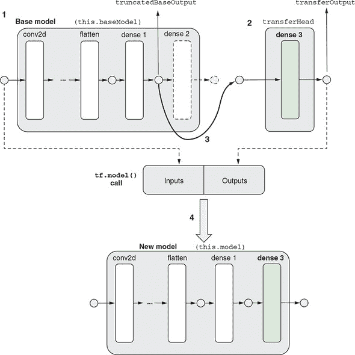
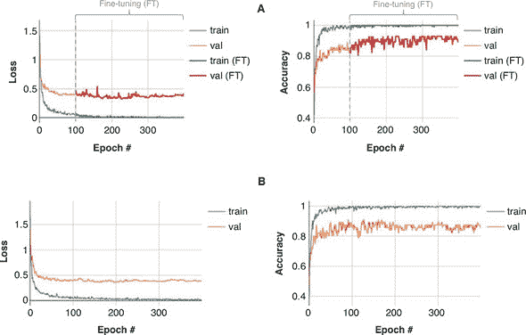
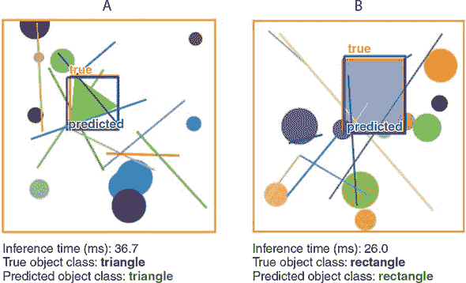
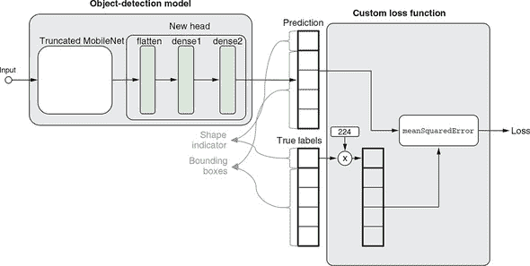
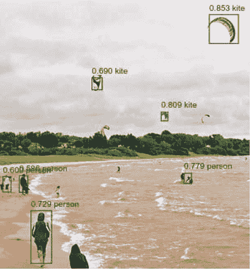

## 第五章：转移学习：重用预训练的神经网络

*本章涵盖*

+   什么是转移学习，为什么它对许多类型的问题而言比从头开始训练模型更好

+   如何通过将其从 Keras 转换为 TensorFlow.js 来利用最先进的预训练卷积神经网络的特征提取能力

+   转移学习技术的详细机制，包括层冻结、创建新的转移头和微调

+   如何使用转移学习在 TensorFlow.js 中训练简单的目标检测模型

在第四章中，我们看到了如何训练卷积神经网络来对图像进行分类。现在考虑以下情景。我们用于分类手写数字的卷积神经网络对某位用户表现不佳，因为他们的手写与原始训练数据非常不同。我们能否通过使用我们可以从他们那里收集到的少量数据（比如，50 个样本）来改进模型，从而更好地为用户提供服务？再考虑另一种情况：一个电子商务网站希望自动分类用户上传的商品图片。但是公开可用的卷积神经网络（例如 MobileNet^([1]))都没有针对这种特定领域的图像进行训练。在给定少量标记图片（比如，几百张）的情况下，是否可以使用公开可用的图像模型来解决定制分类问题？

> ¹
> 
> Andrew G. Howard 等人，“MobileNets: 面向移动视觉应用的高效卷积神经网络”，2017 年 4 月 17 日提交，[`arxiv.org/abs/1704.04861`](https://arxiv.org/abs/1704.04861)。

幸运的是，本章的主要焦点——一种称为*转移学习*的技术，可以帮助解决这类任务。

### 5.1\. 转移学习简介：重用预训练模型

本质上，转移学习是通过重用先前学习结果来加速新的学习任务。它涉及使用已经在数据集上训练过的模型来执行*不同但相关*的机器学习任务。已经训练好的模型被称为*基础模型*。转移学习有时涉及重新训练基础模型，有时涉及在基础模型的顶部创建一个新模型。我们将新模型称为*转移模型*。正如图 5.1 所示，用于这个重新训练过程的数据量通常比用于训练基础模型的数据量要小得多（就像本章开头给出的两个例子一样）。因此，与基础模型的训练过程相比，转移学习通常需要的时间和资源要少得多。这使得在像浏览器这样的资源受限环境中使用 TensorFlow.js 进行转移学习成为可能。因此，对于 TensorFlow.js 学习者来说，转移学习是一个重要的主题。

##### 图 5.1\. 迁移学习的一般工作流程。大型数据集用于基础模型的训练。这个初始训练过程通常很长且计算量大。然后重新训练基础模型，可能成为新模型的一部分。重新训练过程通常涉及比原始数据集小得多的数据集。重新训练所涉及的计算量远远小于初始训练，并且可以在边缘设备上进行，例如运行 TensorFlow.js 的笔记本电脑或手机。


描述迁移学习中的关键短语“不同但相关”在不同情况下可能意味着不同的事情：

+   本章开头提到的第一个场景涉及将模型调整为特定用户的数据。尽管数据与原始训练集不同，但任务完全相同——将图像分类为 10 个数字。这种类型的迁移学习被称为*模型适应*。

+   其他迁移学习问题涉及与原始标签不同的目标。本章开头提到的商品图像分类场景属于这一类别。

与从头开始训练新模型相比，迁移学习的优势是什么？答案有两个方面：

+   从数据量和计算量两个方面来看，迁移学习更加高效。

+   它借助基础模型的特征提取能力，建立在先前训练成果的基础上。

这些观点适用于各种类型的问题（例如分类和回归）。在第一个观点上，迁移学习使用来自基础模型（或其子集）的训练权重。因此，与从头开始训练新模型相比，它需要更少的训练数据和训练时间才能收敛到给定精度水平。在这方面，迁移学习类似于人类学习新任务的方式：一旦你掌握了一个任务（例如玩纸牌游戏），学习类似的任务（例如玩类似的纸牌游戏）在将来会变得更容易和更快。对于我们为 MNIST 构建的 convnet 这样的神经网络来说，节省的训练时间成本可能相对较小。然而，对于在大型数据集上训练的较大模型（例如在 TB 级图像数据上训练的工业规模 convnet），节省可以是相当可观的。

关于第二点，迁移学习的核心思想是重用之前的训练结果。通过从一个非常大的数据集中学习，原始神经网络已经非常擅长从原始输入数据中提取有用的特征。只要迁移学习任务中的新数据与原始数据不相差太大，这些特征对于新任务将是有用的。研究人员已经为常见的机器学习领域组装了非常大的数据集。在计算机视觉领域，有 ImageNet^([2])，其中包含大约一千个类别的数百万张带标签的图像。深度学习研究人员已经使用 ImageNet 数据集训练了深度卷积神经网络，包括 ResNet、Inception 和 MobileNet（我们将很快接触到的最后一个）。由于 ImageNet 中图像的数量和多样性，训练在其上的卷积神经网络是一般类型图像的良好特征提取器。这些特征提取器对于处理像前述情景中的小数据集这样的小数据集将是有用的，但是使用小数据集训练这样有效的特征提取器是不可能的。迁移学习的机会也存在于其他领域。例如，在自然语言处理领域，人们已经在包含数十亿个单词的大型文本语料库上训练了词嵌入（即语言中所有常见单词的向量表示）。这些嵌入对于可用的远小于大文本数据集的语言理解任务是有用的。话不多说，让我们通过一个例子来看看迁移学习是如何在实践中工作的。

> ²
> 
> 不要被名字所迷惑。“ImageNet”指的是一个数据集，而不是一个神经网络。

#### 5.1.1\. 基于兼容输出形状的迁移学习：冻结层

让我们从一个相对简单的例子开始。我们将在 MNIST 数据集的前五个数字（0 到 4）上训练一个卷积神经网络。然后，我们将使用得到的模型来识别剩余的五个数字（5 到 9），这些数字在原始训练中模型从未见过。虽然这个例子有些人为，但它展示了迁移学习的基本工作流程。你可以通过以下命令查看并运行这个例子：

```js
git clone https://github.com/tensorflow/tfjs-examples.git
cd tfjs-examples/mnist-transfer-cnn
yarn && yarn watch
```

在打开的演示网页中，通过点击“重新训练”按钮来开始迁移学习过程。你可以看到这个过程在新的五个数字（5 到 9）上达到了约 96%的准确率，这需要在一台性能较强的笔记本电脑上大约 30 秒。正如我们将要展示的，这比不使用迁移学习的替代方案（即从头开始训练一个新模型）要快得多。让我们逐步看看这是如何实现的。

我们的例子从 HTTP 服务器加载预训练的基础模型，而不是从头开始训练，以免混淆工作流程的关键部分。回想一下第 4.3.3 节，TensorFlow.js 提供了`tf.loadLayersModel()`方法来加载预训练模型。这在 loader.js 文件中调用：

```js
const model = await tf.loadLayersModel(url);
model.summary();
```

模型的打印摘要看起来像 图 5.2。正如你所见，该模型由 12 层组成。^([3]) 其中的大约 600,000 个权重参数都是可训练的，就像迄今为止我们见过的所有 TensorFlow.js 模型一样。请注意，`loadLayersModel()` 不仅加载模型的拓扑结构，还加载所有权重值。因此，加载的模型已经准备好预测数字 0 到 4 的类别。但是，这不是我们将使用模型的方式。相反，我们将训练模型来识别新的数字（5 到 9）。

> ³
> 
> 在这个模型中，你可能没有看到*激活*层类型。激活层是仅对输入执行激活函数（如 relu 和 softmax）的简单层。假设你有一个具有默认（线性）激活的稠密层；在其上叠加一个激活层等同于使用具有非默认激活的稠密层。这就是我们在 第四章 中的例子所做的。但是有时也会看到前一种风格。在 TensorFlow.js 中，你可以通过以下代码获取这样的模型拓扑：`const` `model` `=` `tf.sequential();` `model.add(tf.layers.dense({untis:` `5,` `inputShape})); model.add(tf.layers.activation({activation: 'relu'})）。

##### 图 5.2\. MNIST 图像识别和迁移学习卷积神经网络的打印摘要


查看回调函数以重新训练按钮（在 index.js 的 `retrainModel()` 函数中）时，如果选择了冻结特征层选项（默认情况下选择了），你会注意到一些代码行将模型的前七层的 `trainable` 属性设置为 `false`。

那是做什么用的？默认情况下，模型加载后通过 `loadLayersModel()` 方法或从头创建后，模型的每个层的 `trainable` 属性都是 `true`。 `trainable` 属性在训练期间（即调用 `fit()` 或 `fitDataset()` 方法）中使用。它告诉优化器是否应该更新层的权重。默认情况下，模型的所有层的权重都在训练期间更新。但是，如果你将某些模型层的属性设置为 `false`，那么这些层的权重在训练期间将不会更新。在 TensorFlow.js 的术语中，这些层变为*不可训练*或*冻结*。列表 5.1 中的代码冻结了模型的前七层，从输入 conv2d 层到 flatten 层，同时保持最后几层（稠密层）可训练。

##### 列表 5.1\. 冻结卷积网络的前几层以进行迁移学习

```js
    const trainingMode = ui.getTrainingMode();
    if (trainingMode === 'freeze-feature-layers') {
      console.log('Freezing feature layers of the model.');
      for (let i = 0; i < 7; ++i) {
        this.model.layers[i].trainable = false;               ***1***
      }
    } else if (trainingMode === 'reinitialize-weights') {
      const returnString = false ;
      this.model = await tf.models.modelFromJSON({            ***2***
        modelTopology: this.model.toJSON(null, returnString)  ***2***
      });                                                     ***2***

    }
    this.model.compile({                                      ***3***
      loss: 'categoricalCrossentropy',
      optimizer: tf.train.adam(0.01),
      metrics: ['acc'],
    });

    this.model.summary();                                     ***4***
```

+   ***1*** 冻结层

+   ***2*** 创建一个与旧模型具有相同拓扑结构但重新初始化权重值的新模型

+   ***3*** 冻结将不会在调用 fit() 时生效，除非你首先编译模型。

+   ***4*** 在 compile() 后再次打印模型摘要。您应该看到模型的一些权重已变为不可训练。

然而，仅设置层的 `trainable` 属性是不够的：如果您只修改 `trainable` 属性并立即调用模型的 `fit()` 方法，您将看到这些层的权重在 `fit()` 调用期间仍然会被更新。在调用 `Model.fit()` 之前，您需要调用 `Model.compile()` 以使 `trainable` 属性更改生效，就像在 列表 5.1 中所做的那样。我们之前提到 `compile()` 调用配置了优化器、损失函数和指标。但是，该方法还允许模型在这些调用期间刷新要更新的权重变量列表。在 `compile()` 调用之后，我们再次调用 `summary()` 来打印模型的新摘要。通过将新摘要与 图 5.2 中的旧摘要进行比较，您会发现一些模型的权重已变为不可训练：

```js
Total params: 600165
Trainable params: 590597
Non-trainable params: 9568
```

您可以验证非可训练参数的数量，即 9,568，是两个冻结层中的权重参数之和（两个 conv2d 层的权重）。请注意，我们已冻结的一些层不包含权重（例如 maxPooling2d 层和 flatten 层），因此当它们被冻结时不会对非可训练参数的计数产生贡献。

实际的迁移学习代码显示在 列表 5.2 中。在这里，我们使用了与从头开始训练模型相同的 `fit()` 方法。在此调用中，我们使用 `validationData` 字段来衡量模型在训练期间未见过的数据上的准确性。此外，我们将两个回调连接到 `fit()` 调用，一个用于在用户界面中更新进度条，另一个用于使用 tfjs-vis 模块绘制损失和准确率曲线（更多细节请参见 第七章）。这显示了 `fit()` API 的一个方面，我们之前没有提到过：您可以给 `fit()` 调用一个回调或一个包含多个回调的数组。在后一种情况下，所有回调将在训练期间被调用（按照数组中指定的顺序）。

##### **列表 5.2** 使用 `Model.fit()` 进行迁移学习

```js
    await this.model.fit(this.gte5TrainData.x, this.gte5TrainData.y, {
      batchSize: batchSize,
      epochs: epochs,
      validationData: [this.gte5TestData.x, this.gte5TestData.y],
      callbacks: [                                                        ***1***
        ui.getProgressBarCallbackConfig(epochs),

        tfVis.show.fitCallbacks(surfaceInfo, ['val_loss', 'val_acc'], {   ***2***
          zoomToFit: true,                                                ***2***
          zoomToFitAccuracy: true,                                        ***2***
          height: 200,                                                    ***2***
          callbacks: ['onEpochEnd'],                                      ***2***
        }),                                                               ***2***
      ]
    });
```

+   ***1*** 给 `fit()` 调用添加多个回调是允许的。

+   ***2*** 使用 tfjs-vis 绘制迁移学习过程中的验证损失和准确率

迁移学习的结果如何？正如您在图 5.3 的 A 面板中所看到的，经过 10 个 epoch 的训练后，准确率达到约 0.968，大约需要在一台相对更新的笔记本电脑上花费约 15 秒，还算不错。但与从头开始训练模型相比如何呢？我们可以通过一个实验演示从预训练模型开始相对于从头开始的价值，即在调用 `fit()` 前随机重新初始化预训练模型的权重。在点击重新训练按钮之前，在训练模式下拉菜单中选择重新初始化权重选项即可。结果显示在同一图表的 B 面板中。

##### 图 5.3\. 在 MNIST 卷积网络上的迁移学习的损失和验证曲线。面板 A：使用预训练模型的前七层冻结得到的曲线。面板 B：使用模型的所有权重随机重新初始化得到的曲线。面板 C：不冻结任何预训练模型层获得的曲线。请注意三个面板之间的 y 轴有所不同。面板 D：一个多系列图，显示了面板 A–C 中的损失和准确度曲线在相同轴上以便进行比较。


通过比较 B 面板和 A 面板，可以看出模型权重的随机重新初始化导致损失从一个显著更高的值开始（0.36 对比 0.30），准确度则从一个显著更低的值开始（0.88 对比 0.91）。重新初始化的模型最终的验证准确率也比重复使用从基本模型中的权重的模型低（约 0.954 对比 ~0.968）。这些差异反映了迁移学习的优势：通过重复使用模型的初始层（特征提取层）中的权重，相对于从头开始学习，模型获得了一个良好的起步。这是因为迁移学习任务中遇到的数据与用于训练原始模型的数据相似。数字 5 到 9 的图像与数字 0 到 4 的图像有很多共同点：它们都是带有黑色背景的灰度图像；它们有类似的视觉模式（相似宽度和曲率的笔画）。因此，模型从数字 0 到 4 中学习提取的特征对学习分类新数字（5 到 9）也很有用。

如果我们不冻结特征层的权重会怎样？在训练模式下拉菜单中选择**不冻结特征层**选项可以进行此实验。结果显示在图 5.3 的 C 面板中。与 A 面板的结果相比，有几个值得注意的差异：

+   没有特征层冻结时，损失值开始较高（例如，在第一个时期之后：0.37 对比 0.27）；准确率开始较低（0.87 对比 0.91）。为什么会这样？当预训练模型首次开始在新数据集上进行训练时，预测结果将包含大量错误，因为预训练权重为五个新数字生成基本上是随机的预测。因此，损失函数将具有非常高的值和陡峭的斜率。这导致在训练的早期阶段计算的梯度非常大，进而导致所有模型的权重出现大幅波动。因此，所有层的权重都将经历一个大幅波动的时期，这导致面板 C 中看到的初始损失较高。在正常的迁移学习方法（面板 A）中，模型的前几层被冻结，因此免受这些大的初始权重扰动的影响。

+   由于这些大的初始扰动，采用无冻结方法达到的最终准确率（约为 0.945，面板 C）与采用正常的迁移学习方法相比（约为 0.968，面板 A）*并没有*明显提高。

+   当模型的任何一层都没有被冻结时，训练时间会更长。例如，在我们使用的其中一台笔记本电脑上，使用冻结特征层训练模型大约需要 30 秒，而没有任何层冻结的模型训练大约需要两倍长（60 秒）。图 5.4 以示意的方式说明了其中的原因。在反向传播期间，冻结的层被从方程中排除，这导致每个`fit()`调用的批次速度大大加快。

##### 图 5.4\. 模型冻结某些层加快训练速度的示意图。在该图中，通过指向左边的黑色箭头显示了反向传播路径。面板 A：当没有任何层被冻结时，所有模型的权重（v[1]–v[5]）在每个训练步骤（每个批次）中都需要更新，因此将参与反向传播，由黑色箭头表示。请注意，特征（x）和目标（y）永远不会包括在反向传播中，因为它们的值不需要更新。面板 B：通过冻结模型的前几层，一部分权重（v[1]–v[3]）不再是反向传播的一部分。相反，它们变成了类似于 x 和 y 的常数，只是作为影响损失计算的因素。因此，执行反向传播所需的计算量减少，训练速度提高。


这些观点为迁移学习的层冻结方法提供了理由：它利用了基础模型的特征提取层，并在新训练的早期阶段保护它们免受大的权重扰动，从而在较短的训练周期内实现更高的准确性。

在我们继续下一节之前，有两点需要注意。首先，模型适应——重新训练模型以使其在特定用户的输入数据上更有效的过程——使用的技术与此处展示的技术非常相似，即冻结基础层，同时让顶层的权重通过对用户特定数据的训练而发生变化。尽管本节解决的问题并不涉及来自不同用户的数据，而是涉及具有不同标签的数据。其次，你可能想知道如何验证冻结层（在这种情况下是 conv2d 层）的权重在`fit()`调用之前和之后是否确实相同。这个验证并不是很难做到的。我们把它留给你作为一个练习（参见本章末尾的练习 2）。

#### 5.1.2\. 不兼容输出形状上的迁移学习：使用基础模型的输出创建一个新的 m 模型

在前一节中看到的迁移学习示例中，基础模型的输出形状与新输出形状相同。这种属性在许多其他迁移学习案例中并不成立（参见图 5.5）。例如，如果你想要使用最初在五个数字上进行训练的基础模型来对*四个*新数字进行分类，先前描述的方法将不起作用。更常见的情况是：给定一个已经在包含 1,000 个输出类别的 ImageNet 分类数据集上训练过的深度卷积网络，你手头有一个涉及更少输出类别的图像分类任务（图 5.5 中的 B 案例）。也许这是一个二元分类问题——图像是否包含人脸——或者这是一个具有少数类别的多类分类问题——图片中包含什么类型的商品（回想一下本章开头的例子）。在这种情况下，基础模型的输出形状对于新问题不起作用。

##### 图 5.5\. 根据新模型的输出形状和激活方式是否与原模型相同，迁移学习可分为三种类型。情况 A：新模型的输出形状和激活函数与基础模型相匹配。将 MNIST 模型迁移到 5.1.1 节中的新数字就是这种类型的迁移学习示例。情况 B：新模型具有与基础模型相同的激活类型，因为原任务和新任务是相同类型的（例如，都是多类分类）。然而，输出形状不同（例如，新任务涉及不同数量的类）。这种类型的迁移学习示例可在 5.1.2 节（通过网络摄像头控制类似于 Pac-Man^(TM 4) 的视频游戏）和 5.1.3（识别一组新的口语单词）中找到。情况 C：新任务与原始任务的类型不同（例如，回归与分类）。基于 MobileNet 的目标检测模型就是这种类型的示例。


在某些情况下，甚至机器学习任务的*类型*也与基础模型训练的类型不同。例如，您可以通过对分类任务训练的基础模型应用迁移学习来执行回归任务（预测一个数字，如图 5.5 中的情况 C）5.2 节中，您将看到迁移学习的更加有趣的用途——预测一系列数字，而不是单个数字，用于在图像中检测和定位对象。

这些情况都涉及期望的输出形状与基础模型不同。这使得需要构建一个新模型。但因为我们正在进行迁移学习，所以新模型不会从头开始创建。相反，它将使用基础模型。我们将在 tfjs-examples 存储库中的 webcam-transfer-learning 示例中说明如何做到这一点。

要查看此示例的实际操作，请确保您的设备具有前置摄像头——示例将从摄像头收集用于迁移学习的数据。现在大多数笔记本电脑和平板电脑都配备了内置的前置摄像头。但是，如果您使用的是台式电脑，可能需要找到一个网络摄像头并将其连接到设备上。与之前的示例类似，您可以使用以下命令来查看和运行演示：

```js
git clone https://github.com/tensorflow/tfjs-examples.git
cd tfjs-examples/webcam-transfer-learning
```

这个有趣的演示将您的网络摄像头转换为游戏控制器，通过对 MobileNet 的 TensorFlow.js 实现进行迁移学习，让您可以用它玩 Pac-Man 游戏。让我们走过运行演示所需的三个步骤：数据收集、模型迁移学习和游戏进行^([4])。

> ⁴
> 
> Pac-Man 是万代南梦宫娱乐公司的商标。

迁移学习的数据来自于您的网络摄像头。一旦演示在您的浏览器中运行，您将在页面右下角看到四个黑色方块。它们的排列方式类似于任天堂家庭电脑控制器上的四个方向按钮。它们对应着模型将实时识别的四个类别。这四个类别对应着 Pac-Man 将要移动的四个方向。当您点击并按住其中一个时，图像将以每秒 20–30 帧的速度通过网络摄像头收集。方块下面的数字告诉您目前已经为此控制器方向收集了多少图像。

为了获得最佳的迁移学习质量，请确保您：1）每个类别至少收集 50 张图像；2）在数据收集过程中稍微移动和摆动您的头部和面部，以使训练图像包含更多的多样性，这有利于您从迁移学习中获得的模型的稳健性。在这个演示中，大多数人会在四个方向（上、下、左、右；参见图 5.6）转动头部，以指示 Pac-Man 应该朝哪个方向移动。但您可以使用任何您想要的头部位置、面部表情甚至手势作为输入图像，只要输入图像在各个类别之间足够视觉上有区别即可。

##### 图 5.6\. 网络摄像头迁移学习示例的用户界面^([5])

> ⁵
> 
> 这个网络摄像头迁移学习示例的用户界面是由吉姆博·威尔逊（Jimbo Wilson）和山姆·卡特（Shan Carter）完成的。您可以在 [`youtu.be/YB-kfeNIPCE?t=941`](https://youtu.be/YB-kfeNIPCE?t=941) 查看这个有趣示例的视频录制。


收集完训练图像后，点击“训练模型”按钮，这将开始迁移学习过程。迁移学习应该只需要几秒钟。随着进展，您应该看到屏幕上显示的损失值变得越来越小，直到达到一个非常小的正值（例如 0.00010），然后停止变化。此时，迁移学习模型已经被训练好了，您可以用它来玩游戏了。要开始游戏，只需点击“播放”按钮，等待游戏状态稳定下来。然后，模型将开始对来自网络摄像头的图像流进行实时推理。在每个视频帧中，赢得的类别（由迁移学习模型分配的概率分数最高的类别）将在用户界面的右下角用明亮的黄色突出显示。此外，它会导致 Pac-Man 沿着相应的方向移动（除非被墙壁挡住）。

对于那些对机器学习不熟悉的人来说，这个演示可能看起来像魔术一样，但它基于的只是一个使用 MobileNet 执行四类分类任务的迁移学习算法。该算法使用通过网络摄像头收集的少量图像数据。这些图像通过您收集图像时执行的点击和按住操作方便地标记。由于迁移学习的力量，这个过程不需要太多数据或太多的训练时间（它甚至可以在智能手机上运行）。这就是这个演示的工作原理的简要概述。如果您希望了解技术细节，请在下一节中与我们一起深入研究底层的 TensorFlow.js 代码。

##### 深入研究网络摄像头迁移学习

列表 5.3 中的代码（来自 webcam-transfer-learning/index.js）负责加载基础模型。特别地，我们加载了一个可以在 TensorFlow.js 中高效运行的 MobileNet 版本。信息框 5.1 描述了这个模型是如何从 Python 的 Keras 深度学习库转换而来的。一旦模型加载完成，我们使用 `getLayer()` 方法来获取其中一个层。`getLayer()` 允许您通过名称（在本例中为 `'conv_pw_13_relu'`）指定一个层。您可能还记得另一种从 第 2.4.2 节 访问模型层的方法——即通过索引到模型的 `layers` 属性，该属性将所有模型的层作为 JavaScript 数组保存。当模型由少量层组成时，这种方法很容易使用。我们正在处理的 MobileNet 模型有 93 层，这使得这种方法变得脆弱（例如，如果将来向模型添加更多层会发生什么？）。因此，基于名称的 `getLayer()` 方法更可靠，如果我们假设 MobileNet 的作者在发布新版本模型时会保持关键层的名称不变的话。

##### 列表 5.3\. 加载 MobileNet 并从中创建一个“截断”模型

```js
    async function loadTruncatedMobileNet() {
      const mobilenet = await tf.loadLayersModel(                   ***1***
        'https://storage.googleapis.com/' +                         ***1***
            'tfjs-models/tfjs/mobilenet_v1_0.25_224/model.json');   ***1***

      const layer = mobilenet.getLayer(                             ***2***
          'conv_pw_13_relu');                                       ***2***
      return tf.model({                                             ***3***
        inputs: mobilenet.inputs,                                   ***3***
        outputs: layer.output                                       ***3***
      });                                                           ***3***
    }
```

+   ***1*** [storage.google.com/tfjs-models](http://storage.google.com/tfjs-models) 下的 URL 设计为永久和稳定的。

+   ***2*** 获取 MobileNet 的一个中间层。这个层包含对于自定义图像分类任务有用的特征。

+   ***3*** 创建一个新模型，它与 MobileNet 相同，只是它在 'conv_pw_13_relu' 层结束，也就是说，最后几层（称为“头部”）被截断

|  |
| --- |

**将 Python Keras 模型转换为 TensorFlow .js 格式**

TensorFlow.js 具有与 Keras 高度兼容和互操作的特性，Keras 是最受欢迎的 Python 深度学习库之一。从这种兼容性中获益的其中一个好处是，你可以利用 Keras 中的许多所谓的“应用程序”。这些应用程序是一组在大型数据集（如 ImageNet）上预训练的深度卷积神经网络（详见 [`keras.io/applications/`](https://keras.io/applications/)）。Keras 的作者们已经在库中辛苦地对这些卷积神经网络进行了训练，并使它们可通过库随时重用，包括推理和迁移学习，就像我们在这里所做的那样。对于在 Python 中使用 Keras 的人来说，导入一个应用程序只需一行代码。由于前面提到的互操作性，一个 TensorFlow.js 用户也很容易使用这些应用程序。以下是所需步骤：

1.  确保已安装名为`tensorflowjs`的 Python 包。最简单的安装方法是通过`pip`命令：

    ```js
    pip install tensorflowjs
    ```

1.  通过 Python 源文件或者像 ipython 这样的交互式 Python REPL 运行以下代码：

    ```js
    import keras
    import tensorflowjs as tfjs
    model = keras.applications.mobilenet.MobileNet(alpha=0.25)
    tfjs.converters.save_keras_model(model, '/tmp/mobilnet_0.25')
    ```

前两行导入了所需的`keras`和`tensorflowjs`模块。第三行将 MobileNet 加载到一个 Python 对象（`model`）中。实际上，你可以以几乎与打印 TensorFlow.js 模型摘要相同的方式打印模型的摘要：即`model.summary()`。你可以看到模型的最后一层（模型的输出）确实具有形状`(None, 1000)`（在 JavaScript 中相当于`[null, 1000]`），反映了 MobileNet 模型在 ImageNet 分类任务上训练的 1000 类。我们为这个构造函数调用指定的`alpha=0.25`关键字参数选择了一个更小的 MobileNet 版本。你可以选择更大的`alpha`值（如`0.75, 1`），同样的转换代码仍将继续工作。

前一代码片段中的最后一行使用了`tensorflowjs`模块中的一个方法，将模型保存到指定目录中。在该行运行结束后，将在磁盘上的/tmp/mobilenet_0.25 路径下创建一个新目录，其内容如下所示：

```js
    group1-shard1of6
        group1-shard2of6
        ...
        group1-shard6of6
        model.json
```

这与我们在第 4.3.3 节中看到的格式完全相同，当时我们展示了如何在 Node.js 版本的 TensorFlow.js 中使用其`save()`方法将训练好的 TensorFlow.js 模型保存到磁盘上。因此，对于从磁盘加载此转换模型的 TensorFlow.js 程序而言，保存的格式与在 TensorFlow.js 中创建和训练模型的格式是相同的：它可以简单地调用`tf.loadLayersModel()`方法并指向模型.json 文件的路径（无论是在浏览器中还是在 Node.js 中），这正是 listing 5.3 中发生的事情。

载入的 MobileNet 模型已经准备好执行模型最初训练的机器学习任务——将输入图像分类为 ImageNet 数据集的 1,000 个类别。请注意，该特定数据集非常强调动物，特别是各种品种的猫和狗（这可能与互联网上此类图像的丰富性有关！）。对于对此特定用法感兴趣的人，tfjs-example 仓库中的 MobileNet 示例展示了如何做到这一点（[`github.com/tensorflow/tfjs-examples/tree/master/mobilenet`](https://github.com/tensorflow/tfjs-examples/tree/master/mobilenet)）。然而，在本章中，我们不专注于直接使用 MobileNet；相反，我们探讨如何使用载入的 MobileNet 进行迁移学习。

先前展示的 `tfjs.converters.save_keras_model()` 方法能够转换和保存不仅是 MobileNet 还有其他 Keras 应用，例如 DenseNet 和 NasNet。在本章末尾的练习 3 中，您将练习将另一个 Keras 应用（MobileNetV2）转换为 TensorFlow.js 格式并在浏览器中加载它。此外，应指出 `tfjs.converters.save_keras_model()` 通常适用于您在 Keras 中创建或训练的任何模型对象，而不仅仅是来自 `keras.applications` 的模型。

|  |
| --- |

一旦获得 `conv_pw_13_relu` 层，我们该怎么做？我们创建一个包含原始 MobiletNet 模型层的新模型，从其第一（输入）层到 `conv_pw_13_relu` 层。这是本书中首次看到这种模型构建方式，因此需要一些仔细的解释。为此，我们首先需要介绍*符号张量*的概念。

##### 创建符号张量模型

到目前为止，您已经看到了张量。`Tensor` 是 TensorFlow.js 中的基本数据类型（也缩写为 *dtype*）。一个张量对象携带着给定形状和 dtype 的具体数值，支持由 WebGL 纹理（如果在启用 WebGL 的浏览器中）或 CPU/GPU 内存（如果在 Node.js 中）支持的存储。然而，`SymbolicTensor` 是 TensorFlow.js 中另一个重要的类。与携带具体值不同，符号张量仅指定形状和 dtype。可以将符号张量视为“槽”或“占位符”，可以稍后插入一个实际张量值，前提是张量值具有兼容的形状和 dtype。在 TensorFlow.js 中，层或模型对象接受一个或多个输入（到目前为止，您只看到了一个输入的情况），这些输入被表示为一个或多个符号张量。

让我们使用一个类比来帮助你理解符号张量。想象一下编程语言（比如 Java 或 TypeScript，或者其他你熟悉的静态类型语言）中的函数。函数接受一个或多个输入参数。函数的每个参数都有一个类型，规定了可以作为参数传递的变量类型。然而，参数本身并不包含任何具体的值。参数本身只是一个占位符。符号张量类似于函数的参数：它指定了可以在该位置使用的张量的种类（形状和 dtype 的组合）。类似地，静态类型语言中的函数有一个返回类型。这与模型或层对象的输出符号张量相似。它是模型或层对象输出的实际张量值形状和 dtype 的“蓝图”。

> ⁶
> 
> 张量形状和符号张量形状之间的区别在于前者始终具有完全指定的维度（比如 `[8, 32, 20]`），而后者可能具有未确定的维度（比如 `[null, null, 20]`）。你已经在模型摘要的“输出形状”列中见过这一点。

在 TensorFlow.js 中，模型对象的两个重要属性是其输入和输出。这两者都是符号张量的数组。对于具有一个输入和一个输出的模型，这两个数组的长度都为 1。类似地，层对象具有两个属性：输入和输出，每个都是一个符号张量。符号张量可以用于创建新模型。这是 TensorFlow.js 中创建模型的新方法，与你之前见过的方法有所不同：即使用 `tf.sequential()` 创建顺序模型，然后调用 `add()` 方法。在新方法中，我们使用 `tf.model()` 函数，它接受一个包含两个必填字段 `inputs` 和 `outputs` 的配置对象。`inputs` 字段需要是一个符号张量（或者是一个符号张量数组），`outputs` 亦然。因此，我们可以从原始 MobileNet 模型中获取符号张量，并将它们提供给 `tf.model()` 调用。结果是一个由原始 MobileNet 的一部分组成的新模型。

这个过程在 图 5.7 中以示意图形式说明。（请注意，为了简单的图示，该图将实际 MobileNet 模型的层数减少了。）重要的是要意识到，从原始模型中提取的符号张量并不是孤立的对象。相反，它们携带关于它们属于哪些层以及层如何相互连接的信息。对于熟悉数据结构中图的读者来说，原始模型是一个符号张量的图，连接边是层。通过在原始模型中指定新模型的输入和输出为符号张量，我们正在提取原始 MobileNet 图的一个子图。这个子图成为新模型，包含 MobileNet 的前几层（特别是前 87 层），而最后 6 层则被略过。深度卷积网络的最后几层有时被称为*头部*。我们在 `tf.model()` 调用中所做的可以称为*截断*模型。截断的 MobileNet 保留了提取特征的层，同时丢弃了头部。为什么头部包含*六*层？这是因为这些层是 MobileNet 最初训练的 1,000 类分类任务所特有的。这些层对我们面对的四类分类任务没有用处。

##### 图 5.7\. 示意图解释了如何从 MobileNet 创建新的（“截断的”）模型。在 代码清单 5.3 中的 `tf.model()` 调用中查看相应的代码。每一层都有一个输入和一个输出，都是 `SymbolicTensor` 实例。在原始模型中，SymbolicTensor0 是第一层的输入，也是整个模型的输入。它被用作新模型的输入符号张量。此外，我们将中间层的输出符号张量（相当于 `conv_pw_13_relu`）作为新模型的输出张量。因此，我们得到一个由原始模型的前两层组成的模型，如图的底部所示。原始模型的最后一层，即输出层，有时被称为模型的头部，被丢弃。这就是为什么有时会将这样的方法称为*截断*模型的原因。请注意，这个图示了具有少量层的模型，以便清楚地表达。实际上，在 代码清单 5.3 中的代码涉及一个比这个图示的层多得多（93 层）的模型。


##### 基于嵌入的迁移学习

截断的 MobileNet 的输出是原始 MobileNet 的中间层激活。但是 MobileNet 的中间层激活对我们有何用呢？答案可以在处理每个四个黑色方块的点击和保持事件的函数中看到（列表 5.4）每当摄像头可用的时候（通过 `capture()` 方法），我们调用截断的 MobileNet 的 `predict()` 方法，并将输出保存在一个名为 `controllerDataset` 的对象中，稍后将用于迁移学习。

> ⁷
> 
> 有关 TensorFlow.js 模型的常见问题是如何获取中间层的激活。我们展示的方法就是答案。

但是如何解释截断的 MobileNet 的输出？对于每个图像输入，它都是一个形状为 `[1, 7, 7, 256]` 的张量。它不是任何分类问题的概率，也不是任何回归问题的预测值。它是输入图像在某个高维空间中的表示。该空间具有 7 * 7 * 256，约为 12.5k，维度。尽管空间具有很多维度，但与原始图像相比，它是低维的，原始图像由于具有 224 × 224 的图像尺寸和三个颜色通道，有 224 * 224 * 3 ≈ 150k 个维度。因此，截断的 MobileNet 的输出可以被视为图像的有效表示。这种输入的低维表示通常称为*嵌入*。我们的迁移学习将基于从网络摄像头收集到的四组图像的嵌入。

##### 列表 5.4\. 使用截断的 MobileNet 获取图像嵌入

```js
ui.setExampleHandler(label => {
  tf.tidy(() => {                         ***1***
    const img = webcam.capture();
    controllerDataset.addExample(
        truncatedMobileNet.predict(img),  ***2***
        label);

    ui.drawThumb(img, label);
  });
});
```

+   ***1*** 使用 tf.tidy() 来清理中间张量，比如 img。有关在浏览器中使用 TensorFlow.js 内存管理的教程，请参见附录 B，第 B.3 节。

+   ***2*** 获取 MobileNet 的输入图像的内部激活

现在我们有了获取网络摄像头图像嵌入的方法，我们如何使用它们来预测给定图像对应的方向呢？为此，我们需要一个新模型，该模型以嵌入作为其输入，并输出四个方向类的概率值。以下代码（来自 index.js）创建了这样一个模型。

##### 列表 5.5\. 使用图像嵌入预测控制器方向

```js
  model = tf.sequential({
    layers: [
      tf.layers.flatten({                                          ***1***
        inputShape: truncatedMobileNet.outputs[0].shape.slice(1)   ***1***
      }),                                                          ***1***
      tf.layers.dense({                                            ***2***
        units: ui.getDenseUnits(),                                 ***2***
        activation: 'relu',                                        ***2***
        kernelInitializer: 'varianceScaling',                      ***2***
        useBias: true                                              ***2***
      }),                                                          ***2***
      tf.layers.dense({                                            ***3***
        units: NUM_CLASSES,                                        ***3***
        kernelInitializer: 'varianceScaling',                      ***3***
        useBias: false,                                            ***3***
        activation: 'softmax'                                      ***3***
      })                                                           ***3***
    ]
  });
```

+   ***1*** 将截断的 MobileNet 的[7, 7, 256]嵌入层展平。slice(1) 操作丢弃了第一个（批次）维度，该维度存在于输出形状中，但是不需要在层的工厂方法的 inputShape 属性中，因此它可以与密集层一起使用。

+   ***2*** 一个具有非线性（relu）激活的第一个（隐藏的）密集层

+   ***3*** 最后一层的单元数应该与我们想要预测的类的数量相对应。

与 MobileNet 截断版相比，清单 5.5 中创建的新模型具有更小的尺寸。它仅由三层组成：

+   输入层是一个展平层。它将来自截断模型的 3D 嵌入转换为 1D 张量，以便后续的密集层可以采用。我们在 `inputShape` 中设置其与截断的 MobileNet 的输出形状匹配（不包括批处理维度），因为新模型将接收来自截断的 MobileNet 的嵌入。

+   第二层是隐藏层。它是隐藏的，因为它既不是模型的输入层也不是输出层。相反，它被夹在其他两层之间，以增强模型的能力。这与第三章中遇到的 MLP 非常相似。它是一个带有 relu 激活的密集的隐藏层。回想一下，在第三章的“避免堆叠没有非线性的层的谬论”一节中，我们讨论了使用类似这样的隐藏层的非线性激活的重要性。

+   第三层是新模型的最终（输出）层。它具有适合我们面临的多类分类问题的 softmax 激活（即，四个类别：每个 Pac-Man 方向一个）。

因此，我们可以将 MLP 建立在 MobileNet 的特征提取层的顶部。即使在这种情况下，特征提取器（截断的 MobileNet）和 MLP 都是两个分离的模型（见图 5.8）。由于这种两个模型的设置，不可能直接使用图像张量（形状为`[numExamples,224,224,3]`）来训练新的 MLP。相反，新的 MLP 必须在图像的嵌入上进行训练——即截断的 MobileNet 的输出。幸运的是，我们已经收集了那些嵌入张量（清单 5.4）。我们只需要在嵌入张量上调用其 `fit()` 方法即可训练新的 MLP。在 index.js 的 `train()` 函数中执行此操作的代码十分简单，我们不再详细介绍。

##### 图 5.8. Webcam-transfer-learning 示例背后的迁移学习算法的概要


一旦迁移学习完成，截断模型和新头将一起用于从网络摄像头的输入图像获取概率分数。您可以在 index.js 的 `predict()` 函数中找到代码，显示在 列表 5.6 中。特别是，涉及两个 `predict()` 调用。第一个调用将图像张量转换为其嵌入，使用截断的 MobileNet；第二个使用与迁移学习训练的新头将嵌入转换为四个方向的概率分数。列表 5.6 中的随后代码获取获胜索引（在四个方向的最大概率分数中对应的索引）并使用它来控制 Pac-Man 并更新 UI 状态。与之前的示例一样，我们不涵盖示例的 UI 部分，因为它不是机器学习算法的核心。您可以使用下一个列表中的代码自行研究和玩耍 UI 代码。

##### 列表 5.6\. 在迁移学习后从网络摄像头输入图像获取预测

```js
async function predict() {
  ui.isPredicting();
  while (isPredicting) {
    const predictedClass = tf.tidy(() => {
      const img = webcam.capture();                         ***1***

      const embedding = truncatedMobileNet.predict(         ***2***
          img);                                             ***2***
      const predictions = model.predict(activation);        ***3***
      return predictions.as1D().argMax();                   ***4***
    });
    const classId = (await predictedClass.data())[0];       ***5***
    predictedClass.dispose();
    ui.predictClass(classId);                               ***6***
    await tf.nextFrame();
  }
  ui.donePredicting();
}
```

+   ***1*** 从网络摄像头捕获一帧

+   ***2*** 从截断的 MobileNet 获取嵌入

+   ***3*** 使用新头模型将嵌入转换为四个方向的概率分数

+   ***4*** 获取最大概率分数的索引

+   ***5*** 将索引从 GPU 下载到 CPU

+   ***6*** 根据获胜方向更新 UI：控制 Pac-Man 并更新其他 UI 状态，如控制器上相应“按钮”的突出显示

这结束了我们讨论与迁移学习算法相关的 webcam-transfer-learning 示例的部分。这个示例中我们使用的方法的一个有趣之处是训练和推断过程涉及两个独立的模型对象。这对我们的教育目的来说是有好处的，因为它说明了如何从预训练模型的中间层获取嵌入。这种方法的另一个优点是它暴露了嵌入，并且使得应用直接使用这些嵌入的机器学习技术更容易。这种技术的一个例子是*k 最近邻*（kNN，在信息框 5.2 中讨论）。然而，直接暴露嵌入也可能被视为以下原因的缺点：

+   这导致稍微复杂一些的代码。例如，推断需要两个 `predict()` 调用才能对单个图像执行推断。

+   假设我们希望保存模型以供以后会话使用或转换为非 TensorFlow.js 库。那么截断模型和新的头模型需要分别保存，作为两个单独的构件。

+   在一些特殊情况下，迁移学习将涉及基础模型的某些部分的反向传播（例如截断的 MobileNet 的前几层）。当基础和头部是两个分开的对象时，这是不可能的。

在接下来的部分中，我们将展示一种通过形成单个模型对象来克服这些限制的方法进行迁移学习。这将是一个端到端模型，因为它可以将原始格式的输入数据转换为最终的期望输出。

|  |
| --- |

**基于嵌入的 k 最近邻分类**

在机器学习中，解决分类问题的非神经网络方法有很多。其中最著名的之一就是 k 最近邻（kNN）算法。与神经网络不同，kNN 算法不涉及训练步骤，更容易理解。

我们可以用几句话来描述 kNN 分类的工作原理：

1.  你选择一个正整数*k*（例如，3）。

1.  你收集一些带有真实类别标签的参考示例。通常收集的参考示例数量至少是*k*的几倍。每个示例都被表示为一系列实值数字，或者一个*向量*。这一步类似于神经网络方法中的训练示例的收集。

1.  为了预测新输入的类别，你计算新输入的向量表示与所有参考示例的距离。然后对距离进行排序。通过这样做，你可以找到在向量空间中距离输入最近的*k*个参考示例。这些被称为输入的“*k*个最近邻居”（算法的名字来源）。

1.  你观察*k*个最近邻居的类别，并使用它们中最常见的类别作为输入的预测。换句话说，你让*k*个最近的邻居“投票”来预测类别。

这个算法的一个示例如下图所示。


在二维嵌入空间中的 kNN 分类示例。在这种情况下，*k*=3，有两个类别（三角形和圆形）。三角形类别有五个参考示例，圆形类别有七个。输入示例表示为一个正方形。与输入相连的三个最近邻居由连线表示。因为三个最近邻居中有两个是圆形，所以输入示例的预测类别将是圆形。

正如您从前面的描述中可以看到的，kNN 算法的一个关键要求是，每个输入示例都表示为一个向量。像我们从截断的 MobileNet 获取的那样的嵌入是这样的向量表示的良好候选者，原因有两个。首先，与原始输入相比，它们通常具有较低的维度，因此减少了距离计算所需的存储和计算量。其次，由于它们已经在大型分类数据集上进行了训练，所以这些嵌入通常捕捉到输入中的更重要的特征（例如图像中的重要几何特征；参见图 4.5），并忽略了不太重要的特征（例如亮度和大小）。在某些情况下，嵌入给我们提供了原本不以数字形式表示的事物的向量表示（例如第九章中的单词嵌入）。

与神经网络方法相比，kNN 不需要任何训练。在参考样本数量不太多且输入维度不太高的情况下，使用 kNN 可以比训练神经网络并对其进行推断的计算效率更高。

然而，kNN 推断不随数据量的增加而扩展。特别是，给定 *N* 个参考示例，kNN 分类器必须计算 *N* 个距离，以便为每个输入进行预测。当 *N* 变大时，计算量可能变得难以处理。相比之下，神经网络的推断不随训练数据的量而变化。一旦网络被训练，训练数据的数量就不重要了。网络正向传播所需的计算量仅取决于网络的拓扑结构。

> ^a
> 
> 但是，请查看研究努力设计近似 kNN 算法但运行速度更快且规模比 kNN 更好的算法：Gal Yona，“利用局部敏感哈希进行快速近似重复图像搜索”，Towards Data Science，2018 年 5 月 5 日，[`mng.bz/1wm1`](http://mng.bz/1wm1)。

如果您有兴趣在您的应用程序中使用 kNN，请查看基于 TensorFlow.js 构建的 WebGL 加速 kNN 库：[`mng.bz/2Jp8`](http://mng.bz/2Jp8)。

|  |
| --- |

#### 5.1.3\. 通过微调充分利用迁移学习：音频示例

在前几节中，迁移学习的示例处理了视觉输入。在这个例子中，我们将展示迁移学习也适用于表示为频谱图像的音频数据。回想一下，我们在第 4.4 节中介绍了用于识别语音命令（孤立的、短的口头单词）的卷积网络。我们构建的语音命令识别器只能识别 18 个不同的单词（如“one”、“two”、“up” 和 “down”）。如果你想为其他单词训练一个识别器呢？也许你的特定应用程序需要用户说特定的单词，比如“red” 或 “blue”，甚至是用户自己选的单词；或者你的应用程序面向的是讲英语以外语言的用户。这是迁移学习的一个经典例子：在手头数据量很少的情况下，你*可以*尝试从头开始训练一个模型，但使用预训练模型作为基础可以在更短的时间内和更少的计算资源下获得更高的准确度。

##### 如何在语音命令示例应用中进行迁移学习

在我们描述如何在这个示例中进行迁移学习之前，最好让你熟悉如何通过 UI 使用迁移学习功能。要使用 UI，请确保您的计算机连接了音频输入设备（麦克风），并且在系统设置中将音频输入音量设置为非零值。要下载演示代码并运行它，请执行以下操作（与第 4.4.1 节相同的过程）：

```js
git clone https://github.com/tensorflow/tfjs-models.git
cd tfjs-models/speech-commands
yarn && yarn publish-local

cd demo
yarn && yarn link-local && yarn watch
```

当 UI 启动时，请允许浏览器访问麦克风的请求。图 5.9 显示了演示的示例截图。当演示页面启动时，将自动从互联网上加载预训练的语音命令模型，使用指向 HTTPS URL 的 `tf.loadLayersModel()` 方法。模型加载完成后，"开始" 和 "输入转移词" 按钮将被启用。如果点击 "开始" 按钮，演示将进入推理模式，连续检测屏幕上显示的 18 个基本单词。每次检测到一个单词时，屏幕上相应的单词框将点亮。但是，如果点击 "输入转移词" 按钮，屏幕上将会出现一些额外的按钮。这些按钮是从右侧的文本输入框中的逗号分隔的单词创建的。默认单词是 "noise"、"red" 和 "green"。这些是转移学习模型将被训练识别的单词。但是，如果你想为其他单词训练转移模型，可以自由修改输入框的内容，只要保留 "noise" 项即可。"noise" 项是特殊的一个，你应该收集背景噪声样本，即没有任何语音声音的样本。这允许转移模型区分语音和静音（背景噪声）的时刻。当你点击这些按钮时，演示将从麦克风记录 1 秒的音频片段，并在按钮旁边显示其频谱图。单词按钮中的数字跟踪到目前为止已经收集到的特定单词的示例数量。

##### 图 5.9\. 语音命令示例的转移学习功能的示例截图。在这里，用户已经为转移学习输入了一组自定义单词："feel"、"seal"、"veal" 和 "zeal"，以及始终需要的 "noise" 项。此外，用户已经收集了每个单词和噪声类别的 20 个示例。


如同机器学习问题中的一般情况，你能够收集的数据越多（在可用时间和资源允许的范围内），训练出的模型就会越好。示例应用程序至少需要每个单词的八个示例。如果你不想或无法自己收集声音样本，可以从[`mng.bz/POGY`](http://mng.bz/POGY)（文件大小：9 MB）下载预先收集好的数据集，并在 UI 的数据集 IO 部分使用上传按钮上传。

数据集准备好后，通过文件上传或你自己的样本收集，"开始迁移学习" 按钮将变为可用状态。你可以点击该按钮启动迁移模型的训练。该应用在你收集的音频频谱图上执行 3:1 的分割，随机选择其中 75%用于训练，剩余的 25%用于验证。应用程序在迁移学习过程中显示训练集损失和准确度值以及验证集值。一旦训练完成，可以点击 "开始" 按钮，让演示程序连续识别迁移词，此时你可以经验性地评估迁移模型的准确度。

> ⁸
> 
> 这也是为什么演示要求你每个单词至少收集八个样本的原因。如果单词更少，在验证集中每个单词的样本数量将很少，可能会导致不可靠的损失和准确度估计。

你应该尝试不同的词汇组合，观察它们在经过迁移学习后对精确度的影响。默认集合中，“red”和“green”这两个词在音位内容方面非常不同。例如，它们的起始辅音是两个非常不同的声音，“r”和“g”。它们的元音也听起来非常不同（“e”和“ee”）；结尾辅音也很不同（“d”和“n”）。因此，只要每个单词收集的样本数量不太小（例如>=8），使用的时代数不太小（这会导致欠拟合）或太大（这会导致过拟合；请参阅第八章），你就能够在迁移训练结束时获得几乎完美的验证精度。

为使模型的迁移学习任务更具挑战性，使用由 1）更具混淆性的单词和 2）更大的词汇组成的集合。这就是我们在图 5.9 的屏幕截图中所做的。在该截图中，使用了四个听起来相似的单词：“feel”、“seal”、“veal”和“zeal”。这些单词的元音和结尾辅音相同，开头的辅音也相似。它们甚至可能会让一个不注意或在坏电话线路上听的人听起来混淆。从图的右下角的准确度曲线可以看出，模型要达到 90%以上的准确度并不是一件容易的事，必须通过额外的“微调”阶段来补充初始的迁移学习 - 这是一种迁移学习技巧。

##### 深入了解迁移学习中的微调

微调是一种技术，它可以帮助您达到仅通过训练迁移模型的新头部无法达到的准确度水平。如果您希望了解微调的工作原理，本节将更详细地解释。您需要消化一些技术细节。但通过它，您将深入理解迁移学习及其相关的 TensorFlow.js 实现，这将是值得的努力。

##### 构建单个迁移学习模型

首先，我们需要了解语音迁移学习应用程序如何为迁移学习创建模型。列表 5.7（来自 speech-commands/src/browser_ fft_recognizer.ts 的代码）中的代码从基础语音命令模型（您在 第 4.4.1 节中学到的模型）创建一个模型。它首先找到模型的倒数第二个（倒数第二个）密集层，并获取其输出符号张量`（代码中的`truncatedBaseOutput`）。然后，它创建一个仅包含一个密集层的新头模型。这个新头的输入形状与`truncatedBaseOutput`符号张量的形状匹配，其输出形状与迁移数据集中的单词数匹配（在图 5.9 的情况下为五个）。密集层配置为使用 softmax 激活，适用于多类别分类任务。（请注意，与书中大多数其他代码清单不同，以下代码是用 TypeScript 编写的。如果您不熟悉 TypeScript，可以简单地忽略类型标记，例如`void`和`tf.SymbolicTensor`。）

##### **列表 5.7**\. 将迁移学习模型创建为单个`tf.Model`对象^([9])

> ⁹
> 
> 关于此代码列表的两点说明：1）代码是用 TypeScript 编写的，因为它是可重用的 @tensorflow-models/speech-commands 库的一部分。2）出于简化的目的，此代码中删除了一些错误检查代码。

```js
  private createTransferModelFromBaseModel(): void {
    const layers = this.baseModel.layers;
    let layerIndex = layers.length - 2;
    while (layerIndex >= 0) {                                              ***1***
      if (layers[layerIndex].getClassName().toLowerCase() === 'dense') {   ***1***
        break;                                                             ***1***
      }                                                                    ***1***
      layerIndex--;                                                        ***1***
    }                                                                      ***1***
    if (layerIndex < 0) {
      throw new Error('Cannot find a hidden dense layer in the base model.');
    }
    this.secondLastBaseDenseLayer =                                        ***2***
        layers[layerIndex];                                                ***2***
    const truncatedBaseOutput = layers[layerIndex].output as               ***3***
        tf.SymbolicTensor;                                                 ***3***

    this.transferHead = tf.layers.dense({                                  ***4***
      units: this.words.length,                                            ***4***
      activation: 'softmax',                                               ***4***
      inputShape: truncatedBaseOutput.shape.slice(1)                       ***4***
    }));                                                                   ***4***
    const transferOutput =                                                 ***5***
        this.transferHead.apply(truncatedBaseOutput) as tf.SymbolicTensor; ***5***
    this.model =                                                           ***6***
        tf.model({inputs: this.baseModel.inputs, outputs: transferOutput});***6***
  }
```

+   ***1*** 找到基础模型的倒数第二个密集层

+   ***2*** 获取稍后在微调过程中将解冻的层（请参阅列表 5.8）

+   ***3*** 找到符号张量

+   ***4*** 创建模型的新头

+   ***5*** 在截断的基础模型输出上“应用”新的头部，以获取新模型的最终输出作为符号张量。

+   ***6*** 使用`tf.model()` API 创建一个新的用于迁移学习的模型，指定原始模型的输入作为其输入，新的符号张量作为输出。

新的头部以一种新颖的方式使用：其`apply()`方法使用截断的基础输出符号张量作为输入参数进行调用。`apply()`是 TensorFlow.js 中每个层和模型对象上都可用的方法。`apply()`方法的作用是什么？顾名思义，它“应用”新的头模型于输入，并给出输出。要认识到的重要事项如下：

+   输入和输出都是符号化的——它们是具体张量值的占位符。

+   图 5.10 给出了一个图形示例：符号输入（`truncatedBaseOutput`）不是一个孤立的实体；而是基模型倒数第二个密集层的输出。该密集层从另一层接收输入，该层又从其上游层接收输入，依此类推。因此，`truncatedBaseOutput`携带着基模型的一个子图，即基模型的输入到倒数第二个密集层的输出之间的子图。换句话说，它是基模型的整个图，减去倒数第二个密集层之后的部分。因此，`apply()`调用的输出包含该子图以及新的密集层。输出和原始输入在调用`tf.model()`函数时共同使用，得到一个新模型。这个新模型与基模型相同，只是其头部被新的密集层替换了（参见图 5.10 的底部部分）。

##### 图 5.10\. 示出了创建迁移学习的新端到端模型的方式的示意图。在阅读此图时，请参考 list 5.7。与 list 5.7 中的变量对应的图的某些部分用固定宽度字体标记。步骤 1：获取原始模型倒数第二个密集层的输出符号张量（由粗箭头指示）。它将在步骤 3 中被使用。步骤 2：创建新的头模型，包含一个单输出的密集层（标记为“dense 3”）。步骤 3：使用步骤 1 中的符号张量作为输入参数调用新头模型的`apply()`方法。此调用将该输入与步骤 1 中的截断的基模型连接起来。步骤 4：将`apply()`调用的返回值与原始模型的输入符号张量一起在调用`tf.model()`函数时使用。此调用返回一个新模型，其中包含了原始模型的所有层，从第一层到倒数第二个密集层，以及新头的密集层。实际上，这将原始模型的旧头和新头交换，为后续在迁移数据上训练做准备。请注意，为了简化可视化效果，图中省略了实际语音命令模型的一些（七个）层。在此图中，有颜色的层是可训练的，而白色的层是不可训练的。



请注意，这里的方法与我们在 5.1.2 节 中如何融合模型的方法不同。在那里，我们创建了一个被截断的基础模型和一个新的头模型作为两个独立的模型实例。因此，对每个输入示例进行推断涉及两个 `predict()` 调用。在这里，新模型期望的输入与基础模型期望的音频频谱张量相同。同时，新模型直接输出新单词的概率分数。每次推断仅需一个 `predict()` 调用，因此是一个更加流畅的过程。通过将所有层封装在单个模型中，我们的新方法在我们的应用中具有一个额外的重要优势：它允许我们通过参与识别新单词的任何层执行反向传播。这使我们能够执行微调技巧。这是我们将在下一节中探讨的内容。

##### 通过解冻层进行微调

微调是转移学习的可选步骤，紧随模型训练的初始阶段。在初始阶段，来自基础模型的所有层都被冻结（它们的`trainable`属性设置为`false`），权重更新仅发生在头部层。我们在本章前面的 mnist-transfer-cnn 和 webcam-transfer-learning 示例中已经看到了这种初始训练类型。在微调期间，基础模型的一些层被解冻（它们的`trainable`属性设置为`true`），然后模型再次在转移数据上进行训练。这种层解冻在 图 5.11 中以示意图显示。代码在 TensorFlow.js 中显示了如何为语音命令示例执行此操作，详见 清单 5.8（来自 speech-commands/src/browser_fft_recognizer.ts）。

##### 图 5.11。展示了转移学习初始阶段（面板 A）和微调阶段（面板 B）期间冻结和未冻结（即可训练）层的示意图，代码见 清单 5.8。注意 dense1 紧随 dense3 之后的原因是，dense2（基础模型的原始输出）已被截断为转移学习的第一步（参见 图 5.10）。


##### 清单 5.8。初始转移学习，然后进行微调^([10])

> ¹⁰
> 
> 一些错误检查代码已被删除，以便集中关注算法的关键部分。

```js
async train(config?: TransferLearnConfig):
      Promise<tf.History|[tf.History, tf.History]> {
    if (config == null) {
      config = {};
    }
    if (this.model == null) {
      this.createTransferModelFromBaseModel();
    }

    this.secondLastBaseDenseLayer.trainable = false;                       ***1***
    this.model.compile({                                                   ***2***
      loss: 'categoricalCrossentropy',                                     ***2***
      optimizer: config.optimizer || 'sgd',                                ***2***
      metrics: ['acc']                                                     ***2***
    });                                                                    ***2***

    const {xs, ys} = this.collectTransferDataAsTensors();
    let trainXs: tf.Tensor;
    let trainYs: tf.Tensor;
    let valData: [tf.Tensor, tf.Tensor];
    try {
      if (config.validationSplit != null) {
        const splits = balancedTrainValSplit(                              ***3***
            xs, ys, config.validationSplit);                               ***3***
        trainXs = splits.trainXs;
        trainYs = splits.trainYs;
        valData = [splits.valXs, splits.valYs];
      } else {
        trainXs = xs;
        trainYs = ys;
      }

      const history = await this.model.fit(trainXs, trainYs, {             ***4***
        epochs: config.epochs == null ? 20 : config.epochs,                ***4***
        validationData: valData,                                           ***4***
        batchSize: config.batchSize,                                       ***4***
        callbacks: config.callback == null ? null : [config.callback]      ***4***
      });                                                                  ***4***

      if (config.fineTuningEpochs != null && config.fineTuningEpochs > 0) {***5***
        this.secondLastBaseDenseLayer.trainable =                          ***5***
            true;

        const fineTuningOptimizer: string|tf.Optimizer =
            config.fineTuningOptimizer == null ? 'sgd' :
                                                 config.fineTuningOptimizer;
        this.model.compile({                                               ***6***
          loss: 'categoricalCrossentropy',                                 ***6***
          optimizer: fineTuningOptimizer,                                  ***6***
          metrics: ['acc']                                                 ***6***
        });                                                                ***6***

        const fineTuningHistory = await this.model.fit(trainXs, trainYs, { ***7***
          epochs: config.fineTuningEpochs,                                 ***7***
          validationData: valData,                                         ***7***
          batchSize: config.batchSize,                                     ***7***
          callbacks: config.fineTuningCallback == null ?                   ***7***
              null :                                                       ***7***
              [config.fineTuningCallback]                                  ***7***
        });                                                                ***7***
        return [history, fineTuningHistory];
      } else {
        return history;
      }
    } finally {
      tf.dispose([xs, ys, trainXs, trainYs, valData]);
    }
  }
```

+   ***1*** 确保所有截断基础模型的层，包括稍后将进行微调的层，在转移训练的初始阶段都被冻结

+   ***2*** 为初始转移训练编译模型

+   ***3*** 如果需要 validationSplit，则以平衡的方式将转移数据分割为训练集和验证集

+   ***4*** 调用 Model.fit() 进行初始转移训练

+   ***5*** 对于微调，解冻基础模型的倒数第二个密集层（截断基础模型的最后一层）

+   ***6*** 在解冻层之后重新编译模型（否则解冻不会生效）

+   ***7*** 调用 Model.fit() 进行微调

有几个关于 列表 5.8 中代码需要指出的重要事项：

+   每次您通过更改它们的 `trainable` 属性来冻结或解冻任何层时，都需要再次调用模型的 `compile()` 方法，以使更改生效。我们已经在 第 5.1.1 节 中讨论了这一点，当我们谈到 MNIST 迁移学习示例时。

+   我们保留了训练数据的一部分用于验证。这样做可以确保我们观察的损失和准确率反映了模型在反向传播期间没有见过的输入上的表现。然而，我们为验证而从收集的数据中拆分出一部分的方式与以前不同，并且值得注意。在 MNIST 卷积网络示例（列表 4.2 在 第四章）中，我们使用了 `validationSplit` 参数，让 `Model.fit()` 保留最后的 15–20% 的数据用于验证。但是，在这里使用相同的方法效果不佳。为什么？因为与早期示例中的数据量相比，我们这里的训练集要小得多。因此，盲目地将最后几个示例拆分为验证可能会导致一些词在验证子集中表示不足。例如，假设您为“feel”、“seal”、“veal” 和 “zeal” 中的每个词收集了八个示例，并选择最后的 32 个样本（8 个示例）的 25% 作为验证。那么，平均而言，验证子集中每个单词只有两个示例。由于随机性，一些单词可能最终只在验证子集中有一个示例，而其他单词可能根本没有示例！显然，如果验证集缺少某些单词，它将不是用于测量模型准确性的很好的集合。这就是为什么我们使用一个自定义函数（`balancedTrainValSplit` 在 列表 5.8）。此函数考虑了示例的真实单词标签，并确保所有不同的单词在训练和验证子集中都得到公平的表示。如果您有一个涉及类似小数据集的迁移学习应用程序，那么做同样的事情是个好主意。

那么，微调为我们做了什么呢？在迁移学习的初始阶段之上，微调提供了什么附加价值？为了说明这一点，我们将面板 A 中初始阶段和微调阶段的损失和准确率曲线连续绘制在一起，如图 5.12 所示。这里涉及的迁移数据集包含了我们在图 5.9 中看到的相同的四个单词。每条曲线的前 100 个纪元对应于初始阶段，而最后的 300 个纪元对应于微调。你可以看到，在初始训练的前 100 个纪元结束时，损失和准确率曲线开始变平并开始进入递减回报的区域。在验证子集的准确率在约 84% 时达到平稳状态。（请注意，仅查看 *训练子集* 的准确率曲线是多么具有误导性，因为它很容易接近 100%。）然而，解冻基础模型中的密集层，重新编译模型，并开始微调训练阶段，验证准确率就不再停滞，可以提高到 90–92%，这是一个非常可观的准确率增加 6–8 个百分点。验证损失曲线也可以看到类似的效果。

##### 图 5.12\. 面板 A：迁移学习和随后微调（图例中标为 FT）的示例损失和准确率曲线。注意曲线初始部分和微调部分之间的拐点。微调加速了损失的减少和准确率的提高，这是由于基础模型的顶部几层解冻以及模型容量的增加，以及向迁移学习数据中的独特特征的调整所致。面板 B：在不进行微调的情况下训练迁移模型相同数量的纪元（400 纪元）的损失和准确率曲线。注意，没有微调时，验证损失收敛到较高值，验证准确率收敛到比面板 A 低的值。请注意，虽然进行了微调（面板 A）的最终准确率达到约 *0.9*，但在没有进行微调但总纪元数相同的情况下（面板 B），准确率停留在约 *0.85*。



为了说明微调相对于不进行微调的迁移学习的价值，我们在图 5.12 的面板 B 中展示了如果不微调基础模型的顶部几层，而将迁移模型训练相同数量（400）的纪元时会发生什么。在面板 A 中发生的在第 100 纪元时进行微调的损失或准确率曲线上没有“拐点”。相反，损失和准确率曲线趋于平稳，并收敛到较差的值。

那么为什么微调有帮助呢？可以理解为增加了模型的容量。通过解冻基本模型的一些最顶层，我们允许转移模型在比初始阶段更高维的参数空间中最小化损失函数。这类似于向神经网络添加隐藏层。解冻的密集层的权重参数已经针对原始数据集进行了优化（由诸如“one”、“two”、“yes”和“no”之类的单词组成的数据集），这可能对转移单词不是最优的。这是因为帮助模型区分这些原始单词的内部表示可能不是使转移单词最容易区分的表示。通过允许进一步优化（即微调）这些参数以用于转移单词，我们允许表示被优化用于转移单词。因此，我们在转移单词上获得验证准确性的提升。请注意，当转移学习任务很难时（如四个易混淆的单词：“feel”、“seal”、“veal”和“zeal”），更容易看到这种提升。对于更容易的任务（更不同的单词，如“red”和“green”），验证准确性可能仅仅通过初始的转移学习就可以达到 100%。

你可能想问的一个问题是，在这里我们只解冻了基本模型的一层，但是解冻更多的层会有帮助吗？简短的答案是，这取决于情况，因为解冻更多的层会使模型的容量更高。但正如我们在第四章中提到的，并且将在第八章中更详细地讨论，更高的容量会导致过拟合的风险增加，特别是当我们面对像这里收集到的音频示例这样的小数据集时。更不用说训练更多层所需的额外计算负载了。鼓励你作为本章末尾的一部分来进行自己的实验。

让我们结束 TensorFlow.js 中关于迁移学习的这一部分。我们介绍了三种在新任务上重用预训练模型的不同方法。为了帮助你决定在将来的迁移学习项目中使用哪种方法，我们在 table 5.1 中总结了这三种方法及其相对优缺点。

##### 表 5.1\. TensorFlow.js 中三种迁移学习方法及其相对优势和缺点的总结

| 方法 | 优势 | 缺点 |
| --- | --- | --- |
| 使用原始模型并冻结其前几层（特征提取层）（section 5.1.1）。 |

+   简单而方便

|

+   仅当迁移学习所需的输出形状和激活与基本模型的形状和激活匹配时才起作用

|

| 从原始模型中获取内部激活作为输入示例的嵌入，并创建一个以该嵌入作为输入的新模型（section 5.1.2）。 |
| --- |

+   适用于需要与原始输出形状不同的迁移学习情况

+   嵌入张量是直接可访问的，使得 k 最近邻（kNN，见信息框 5.2）分类器等方法成为可能

|

+   需要管理两个独立的模型实例

+   很难微调原始模型的层

|

| 创建一个包含原始模型的特征提取层和新头部层的新模型（请参见第 5.1.3 节）。 |
| --- |

+   适用于需要与原始输出形状不同的迁移学习情况

+   只需要管理一个模型实例

+   允许对特征提取层进行微调

|

+   无法直接访问内部激活（嵌入）张量

|

### 5.2. 通过卷积神经网络进行目标检测的迁移学习

到目前为止，你在本章中所看到的迁移学习示例都有一个共同点：在迁移后机器学习任务的性质保持不变。特别是，它们采用了一个在多类分类任务上训练的计算机视觉模型，并将其应用于另一个多类分类任务。在本节中，我们将展示这并不一定是这样的。基础模型可以用于非常不同于原始任务的任务，例如当你想使用在分类任务上训练的基础模型来执行回归（拟合数字）时。这种跨领域迁移是深度学习的多功能性和可重复使用性的良好例证，是该领域成功的主要原因之一。

为了说明这一点，我们将使用新的任务——*目标检测*，这是本书中第一个非分类计算机视觉问题类型。目标检测涉及在图像中检测特定类别的物体。它与分类有何不同？在目标检测中，检测到的物体不仅会以类别（它是什么类型的物体）的形式报告，还会包括有关物体在图像中内部位置的一些附加信息（物体在哪里）。后者是一个普通分类器无法提供的信息。例如，自动驾驶汽车使用的典型目标检测系统会分析输入图像的一个框架，以便该系统不仅输出图像中存在的有趣对象的类型（如车辆和行人），还输出这些对象在图像坐标系内的位置、表面积和姿态等信息。

示例代码位于 tfjs-examples 仓库的 simple-object-detection 目录中。请注意，此示例与您迄今为止看到的示例不同，因为它将在 Node.js 中的模型训练与浏览器中的推理结合起来。具体来说，模型训练使用 tfjs-node（或 tfjs-node-gpu）进行，训练好的模型将保存到磁盘上。然后使用 parcel 服务器来提供保存的模型文件，以及静态的 index.html 和 index.js，以展示浏览器中模型的推理。

您可以使用的运行示例的命令序列如下（其中包含一些您在输入命令时不需要包含的注释字符串）：

```js
        git clone https://github.com/tensorflow/tfjs-examples.git
        cd tfjs-examples/simple-object-detection
        yarn
        # Optional step for training your own model using Node.js:
        yarn train \
            --numExamples 20000 \
            --initialTransferEpochs 100 \
            --fineTuningEpochs 200
        yarn watch  # Run object-detection inference in the browser.
```

`yarn train`命令会在您的机器上进行模型训练，并在完成后将模型保存到`./dist`文件夹中。请注意，这是一个长时间运行的训练任务，如果您有 CUDA 启用的 GPU，则最好处理，因为这可以将训练速度提高 3 到 4 倍。为此，您只需要向`yarn train`命令添加`--gpu`标志：

```js
        yarn train --gpu \
            --numExamples 20000 \
            --initialTransferEpochs 100 \
            --fineTuningEpochs 200
```

如果您没有时间或资源在自己的机器上对模型进行训练，不用担心：您可以直接跳过`yarn train`命令，直接执行`yarn watch`。在浏览器中运行的推理页面将允许您通过 HTTP 从集中位置加载我们已经为您训练好的模型。

#### 5.2.1\. 基于合成场景的简单目标检测问题

最先进的目标检测技术涉及许多技巧，这些技巧不适合用于初学者教程。我们在这里的目标是展示目标检测的本质，而不受太多技术细节的困扰。为此，我们设计了一个涉及合成图像场景的简单目标检测问题（见图 5.13）。这些合成图像的尺寸为 224 × 224，色深为 3（RGB 通道），因此与将成为我们模型基础的 MobileNet 模型的输入规范匹配。正如图 5.13 中的示例所示，每个场景都有一个白色背景。要检测的对象可以是等边三角形或矩形。如果对象是三角形，则其大小和方向是随机的；如果对象是矩形，则其高度和宽度是随机变化的。如果场景仅由白色背景和感兴趣的对象组成，则任务将太容易，无法展示我们技术的强大之处。为了增加任务的难度，在场景中随机分布了一些“噪声对象”。这些对象包括每个图像中的 10 个圆和 10 条线段。圆的位置和大小以随机方式生成，线段的位置和长度也是如此。一些噪声对象可能位于目标对象的顶部，部分遮挡它。所有目标和噪声对象都具有随机生成的颜色。

##### 图 5.13\. 简单物体检测使用的合成场景示例。面板 A：一个旋转的等边三角形作为目标对象。面板 B：一个矩形作为目标对象。标记为“true”的框是感兴趣对象的真实边界框。请注意，感兴趣对象有时可能会被一些噪声对象（线段和圆）部分遮挡。



随着输入数据被完全描述，我们现在可以为我们即将创建和训练的模型定义任务。该模型将输出五个数字，这些数字被组织成两组：

+   第一组包含一个数字，指示检测到的对象是三角形还是矩形（不考虑其位置、大小、方向和颜色）。

+   剩下的四个数字组成了第二组。它们是检测到的物体周围边界框的坐标。具体来说，它们分别是边界框的左 x 坐标、右 x 坐标、顶部 y 坐标和底部 y 坐标。参见图 5.13 作为示例。

使用合成数据的好处是 1）真实标签值会自动知道，2）我们可以生成任意数量的数据。每次生成场景图像时，对象的类型和其边界框都会自动从生成过程中对我们可用。因此，不需要对训练图像进行任何劳动密集型的标记。这种输入特征和标签一起合成的非常高效的过程在许多深度学习模型的测试和原型环境中使用，并且这是一种你应该熟悉的技术。然而，用于真实图像输入的训练物体检测模型需要手动标记的真实场景。幸运的是，有这样的标记数据集可用。通用物体和背景（COCO）数据集就是其中之一（参见[`cocodataset.org`](http://cocodataset.org)）。

训练完成后，模型应能够以相当高的准确性定位和分类目标对象（如图 5.13 中所示的示例所示）。要了解模型如何学习这个物体检测任务，请跟随我们进入下一节中的代码。

#### 5.2.2\. 深入了解简单物体检测

现在让我们构建神经网络来解决合成对象检测问题。与以前一样，我们在预训练的 MobileNet 模型上构建我们的模型，以使用模型的卷积层中的强大的通用视觉特征提取器。这是 列表 5.9 中的 `loadTruncatedBase()` 方法所做的。然而，我们的新模型面临的一个新挑战是如何同时预测两个东西：确定目标对象的形状以及在图像中找到其坐标。我们以前没有见过这种“双任务预测”类型。我们在这里使用的技巧是让模型输出一个张量，该张量封装了两个预测，并且我们将设计一个新的损失函数，该函数同时衡量模型在两个任务中的表现如何。*我们可以*训练两个单独的模型，一个用于分类形状，另一个用于预测边界框。但是与使用单个模型执行两个任务相比，运行两个模型将涉及更多的计算和更多的内存使用，并且不利用特征提取层可以在两个任务之间共享的事实。（以下代码来自 simple-object-detection/train.js。）

##### 列表 5.9\. 基于截断 MobileNet 定义简单对象学习模型^([11])

> ¹¹
> 
> 为了清晰起见，一些用于检查错误条件的代码已被删除。

```js
const topLayerGroupNames = [                                            ***1***
    'conv_pw_9', 'conv_pw_10', 'conv_pw_11'];                           ***1***
const topLayerName =
    `${topLayerGroupNames[topLayerGroupNames.length - 1]}_relu`;

async function loadTruncatedBase() {
  const mobilenet = await tf.loadLayersModel(
      'https://storage.googleapis.com/' +
          'tfjs-models/tfjs/mobilenet_v1_0.25_224/model.json');

  const fineTuningLayers = [];
  const layer = mobilenet.getLayer(topLayerName);                       ***2***
  const truncatedBase =                                                 ***3***
      tf.model({                                                        ***3***
        inputs: mobilenet.inputs,                                       ***3***
        outputs: layer.output                                           ***3***
      });                                                               ***3***
  for (const layer of truncatedBase.layers) {
    layer.trainable = false;                                            ***4***
    for (const groupName of topLayerGroupNames) {
      if (layer.name.indexOf(groupName) === 0) {                        ***5***
        fineTuningLayers.push(layer);
        break;
      }
    }
  }
  return {truncatedBase, fineTuningLayers};
}

function buildNewHead(inputShape) {                                     ***6***
  const newHead = tf.sequential();                                      ***6***
  newHead.add(tf.layers.flatten({inputShape}));                         ***6***
  newHead.add(tf.layers.dense({units: 200, activation: 'relu'}));       ***6***
  newHead.add(tf.layers.dense({units: 5}));                             ***6*** ***7***
  return newHead;                                                       ***6***
}                                                                       ***6***

async function buildObjectDetectionModel() {                            ***8***
  const {truncatedBase, fineTuningLayers} = await loadTruncatedBase();  ***8***

  const newHead = buildNewHead(truncatedBase.outputs[0].shape.slice(1));***8***
  const newOutput = newHead.apply(truncatedBase.outputs[0]);            ***8***
  const model = tf.model({                                              ***8***
    inputs: truncatedBase.inputs,                                       ***8***
    outputs: newOutput                                                  ***8***
  });                                                                   ***8***

  return {model, fineTuningLayers};
}
```

+   ***1*** 设置要解冻以进行微调的层

+   ***2*** 获取中间层：最后一个特征提取层

+   ***3*** 形成截断的 MobileNet

+   ***4*** 冻结所有特征提取层以进行迁移学习的初始阶段

+   ***5*** 跟踪在微调期间将解冻的层

+   ***6*** 为简单对象检测任务构建新头模型

+   ***7*** 长度为 5 的输出包括长度为 1 的形状指示器和长度为 4 的边界框（请参见 图 5.14）。

+   ***8*** 将新的头模型放在截断的 MobileNet 顶部，形成整个对象检测模型

“双任务”模型的关键部分由 列表 5.9 中的 `buildNewHead()` 方法构建。模型的示意图显示在 图 5.14 的左侧。新头部由三层组成。一个展平层将截断的 MobileNet 基础的最后一个卷积层的输出形状为后续可以添加的密集层。第一个密集层是具有 relu 非线性的隐藏层。第二个密集层是头部的最终输出，因此也是整个对象检测模型的最终输出。该层具有默认的线性激活。这是理解该模型如何工作的关键，因此需要仔细查看。

##### 图 5.14\. 对象检测模型及其基于的自定义损失函数。请参见 列表 5.9，了解模型（左侧部分）的构建方式。请参见 列表 5.10，了解自定义损失函数的编写方式。



正如你从代码中看到的那样，最终的稠密层输出单元数为 5。这五个数字代表什么？它们结合了形状预测和边界框预测。有趣的是，决定它们含义的不是模型本身，而是将用于模型的损失函数。之前，你看到过各种类型的损失函数，可以直接使用字符串名称，如`"meanSquaredError"`，并适用于各自的机器学习任务（例如，请参阅第三章表 3.6）。然而，这只是在 TensorFlow.js 中指定损失函数的两种方法之一。另一种方法，也是我们在这里使用的方法，涉及定义一个满足某个特定签名的自定义 JavaScript 函数。该签名如下：

+   有两个输入参数：1）输入示例的真实标签和 2）模型的对应预测。它们都表示为 2D 张量。这两个张量的形状应该是相同的，每个张量的第一个维度都是批处理大小。

+   返回值是一个标量张量（形状为`[]`的张量），其值是批处理中示例的平均损失。

我们根据这个签名编写的自定义损失函数在列表 5.10 中显示，并在图 5.14 的右侧进行了图形化说明。`customLossFunction`的第一个输入（`yTrue`）是真实标签张量，其形状为`[batchSize, 5]`。

第二个输入（`yPred`）是模型的输出预测，其形状与`yTrue`完全相同。在`yTrue`的第二轴上的五个维度（如果我们将其视为矩阵，则为五列）中，第一个维度是目标对象形状的 0-1 指示器（三角形为 0，矩形为 1）。这是由数据合成方式确定的（请参阅 simple-object-detection/synthetic_images.js）。其余四列是目标对象的边界框，即其左、右、上和下值，每个值范围从 0 到 CANVAS_SIZE（224）。数字 224 是输入图像的高度和宽度，来自于 MobileNet 的输入图像大小，我们的模型基于此。

##### 列表 5.10。为对象检测任务定义自定义损失函数

```js
const labelMultiplier = tf.tensor1d([CANVAS_SIZE, 1, 1, 1, 1]);
function customLossFunction(yTrue, yPred) {
  return tf.tidy(() => {
    return tf.metrics.meanSquaredError(
        yTrue.mul(labelMultiplier), yPred);     ***1***
  });
}
```

+   ***1*** `yTrue`的形状指示器列通过 CANVAS_SIZE（224）缩放，以确保形状预测和边界框预测对损失的贡献大致相等。

自定义损失函数接收`yTrue`并将其第一列（0-1 形状指示器）按`CANVAS_SIZE`进行缩放，同时保持其他列不变。然后它计算`yPred`和缩放后的`yTrue`之间的均方误差。为什么我们要缩放`yTrue`中的 0-1 形状标签？我们希望模型输出一个代表它预测形状是三角形还是矩形的数字。具体地说，它输出一个接近于 0 的数字表示三角形，一个接近于`CANVAS_SIZE`（224）的数字表示矩形。因此，在推理时，我们只需将模型输出的第一个值与`CANVAS_SIZE/2`（112）进行比较，以获取模型对形状更像是三角形还是矩形的预测。那么如何衡量这种形状预测的准确性以得出损失函数呢？我们的答案是计算这个数字与 0-1 指示器之间的差值，乘以`CANVAS_SIZE`。

为什么我们这样做而不像在第三章中钓鱼检测示例中使用二进制交叉熵呢？我们需要在这里结合两个准确度指标：一个是形状预测，另一个是边界框预测。后者任务涉及预测连续值，可以视为回归任务。因此，均方误差是边界框的自然度量标准。为了结合这些度量标准，我们只需“假装”形状预测也是一个回归任务。这个技巧使我们能够使用单个度量函数（列表 5.10 中的`tf.metric.meanSquaredError()`调用）来封装两种预测的损失。

但是为什么我们要将 0-1 指示器按`CANVAS_SIZE`进行缩放呢？如果我们不进行这种缩放，我们的模型最终会生成一个接近于 0-1 的数字，作为它预测形状是三角形（接近于 0）还是矩形（接近于 1）的指示器。在`[0, 1]`区间内的数字之间的差异显然要比我们从比较真实边界框和预测边界框得到的差异要小得多，后者在 0-224 的范围内。因此，来自形状预测的误差信号将完全被来自边界框预测的误差信号所掩盖，这对于我们得到准确的形状预测没有帮助。通过缩放 0-1 形状指示器，我们确保形状预测和边界框预测对最终损失值（`customLossFunction()`的返回值）的贡献大致相等，因此当模型被训练时，它将同时优化两种类型的预测。在本章末尾的练习 4 中，我们鼓励你自己尝试使用这种缩放。

> ¹²
> 
> 这里的一个替代方法是采用基于缩放和 `meanSquaredError` 的方法，将 `yPred` 的第一列作为形状概率分数，并与 `yTrue` 的第一列计算二元交叉熵。然后，将二元交叉熵值与在 `yTrue` 和 `yPred` 的其余列上计算的 MSE 相加。但在这种替代方法中，需要适当缩放交叉熵，以确保与边界框损失的平衡，就像我们当前的方法一样。缩放涉及一个自由参数，其值需要仔细选择。在实践中，它成为模型的一个额外超参数，并且需要时间和计算资源来调整，这是该方法的一个缺点。为了简单起见，我们选择了当前方法，而不采用该方法。

数据准备就绪，模型和损失函数已定义，我们准备好训练我们的模型！模型训练代码的关键部分显示在 清单 5.11（来自 simple-object-detection/train.js）。与我们之前见过的微调（第 5.1.3 节）类似，训练分为两个阶段：初始阶段，在此阶段仅训练新的头部层；微调阶段，在此阶段将新的头部层与截断的 MobileNet 基础的顶部几层一起训练。需要注意的是，在微调的 `fit()` 调用之前，必须（再次）调用 `compile()` 方法，以便更改层的 `trainable` 属性生效。如果在您自己的机器上运行训练，很容易观察到损失值在微调阶段开始时出现显着下降，这反映了模型容量的增加以及解冻特征提取层对目标检测数据中的唯一特征的适应能力。在微调期间解冻的层的列表由 `fineTuningLayers` 数组确定，在截断 MobileNet 时填充（参见 清单 5.9 中的 `loadTruncatedBase()` 函数）。这些是截断的 MobileNet 的顶部九层。在本章末尾的练习 3 中，您可以尝试解冻更少或更多的基础顶部层，并观察它们如何改变训练过程产生的模型的准确性。

##### 清单 5.11\. 训练目标检测模型的第二阶段

```js
  const {model, fineTuningLayers} = await buildObjectDetectionModel();
  model.compile({                                  ***1***
    loss: customLossFunction,                      ***1***
    optimizer: tf.train.rmsprop(5e-3)              ***1***
  });                                              ***1***
  await model.fit(images, targets, {               ***2***
    epochs: args.initialTransferEpochs,            ***2***
    batchSize: args.batchSize,                     ***2***
    validationSplit: args.validationSplit          ***2***
  });                                              ***2***

  // Fine-tuning phase of transfer learning.

  for (const layer of fineTuningLayers) {          ***3***
    layer.trainable = true;                        ***4***
  }
  model.compile({                                  ***5***
    loss: customLossFunction,                      ***5***
    optimizer: tf.train.rmsprop(2e-3)              ***5***
  });                                              ***5***

  await model.fit(images, targets, {
    epochs: args.fineTuningEpochs,
    batchSize: args.batchSize / 2,                 ***6***
    validationSplit: args.validationSplit
  });                                              ***7***
```

+   ***1*** 在初始阶段使用相对较高的学习率

+   ***2*** 执行迁移学习的初始阶段

+   ***3*** 开始微调阶段

+   ***4*** 解冻一些层进行微调

+   ***5*** 在微调阶段使用稍低的学习率

+   ***6*** 在微调阶段，我们将 batchSize 减少以避免由于反向传播涉及更多权重并消耗更多内存而引起的内存不足问题。

+   ***7*** 执行微调阶段

微调结束后，模型将保存到磁盘，并在浏览器内推断步骤期间加载（通过`yarn watch`命令启动）。如果加载托管模型，或者您已经花费了时间和计算资源在自己的计算机上训练了一个相当不错的模型，那么您在推断页面上看到的形状和边界框预测应该是相当不错的（在初始训练的 100 个周期和微调的 200 个周期后，验证损失在<100）。推断结果是好的但并非完美（请参阅 图 5.13 中的示例）。当您检查结果时，请记住，在浏览器内评估是公平的，并且反映了模型的真实泛化能力，因为训练模型在浏览器中要解决的示例与迁移学习过程中它所见到的训练和验证示例不同。

结束本节时，我们展示了如何将之前在图像分类上训练的模型成功地应用于不同的任务：对象检测。在此过程中，我们演示了如何定义一个自定义损失函数来适应对象检测问题的“双重任务”（形状分类 + 边界框回归）的特性，以及如何在模型训练过程中使用自定义损失。该示例不仅说明了对象检测背后的基本原理，还突显了迁移学习的灵活性以及它可能用于的问题范围。在生产应用中使用的对象检测模型当然比我们在这里使用合成数据集构建的玩具示例更复杂，并且涉及更多技巧。信息框 5.3 简要介绍了一些有关高级对象检测模型的有趣事实，并描述了它们与您刚刚看到的简单示例的区别以及您如何通过 TensorFlow.js 使用其中之一。

|  |
| --- |

**生产对象检测模型**



TensorFlow.js 版本的 Single-Shot Detection (SSD) 模型的一个示例对象检测结果。注意多个边界框及其关联的对象类和置信度分数。

对象检测是许多类型应用的重要任务，例如图像理解、工业自动化和自动驾驶汽车。最著名的最新对象检测模型包括 Single-Shot Detection^([a])（SSD，示例推断结果如图所示）和 You Only Look Once (YOLO)^([b])。这些模型在以下方面与我们在简单对象检测示例中看到的模型类似：

> ^a
> 
> Wei Liu 等人，“SSD: Single Shot MultiBox Detector,” *计算机科学讲义* 9905，2016，[`mng.bz/G4qD`](http://mng.bz/G4qD)。
> 
> ^b
> 
> Joseph Redmon 等人，“You Only Look Once: Unified, Real-Time Object Detection,” *IEEE 计算机视觉与模式识别会议论文集* (CVPR), 2016, pp. 779–788, [`mng.bz/zlp1`](http://mng.bz/zlp1).

+   它们预测对象的类别和位置。

+   它们是建立在 MobileNet 和 VGG16 等预训练图像分类模型上的，并通过迁移学习进行训练。

    > ^c
    > 
    > Karen Simonyan 和 Andrew Zisserman，“Very Deep Convolutional Networks for Large-Scale Image Recognition,” 2014 年 9 月 4 日提交, [`arxiv.org/abs/1409.1556`](https://arxiv.org/abs/1409.1556).

然而，它们在很多方面也与我们的玩具模型不同：

+   真实的目标检测模型预测的对象类别比我们的简单模型多得多（例如，COCO 数据集有 80 个对象类别；参见[`cocodataset.org/#home`](http://cocodataset.org/#home)）。

+   它们能够在同一图像中检测多个对象（请参见示例图）。

+   它们的模型架构比我们简单模型中的更复杂。例如，SSD 模型在截断的预训练图像模型顶部添加了多个新头部，以便预测输入图像中多个对象的类别置信度分数和边界框。

+   与使用单个`meanSquaredError`度量作为损失函数不同，真实目标检测模型的损失函数是两种类型损失的加权和：1）对于对象类别预测的类似 softmax 交叉熵的损失和 2）对于边界框的`meanSquaredError`或`meanAbsoluteError`-like 损失。两种类型损失值之间的相对权重被精心调整以确保来自两种错误来源的平衡贡献。

+   真实的目标检测模型会为每个输入图像产生大量的候选边界框。这些边界框被“修剪”以便保留具有最高对象类别概率分数的边界框作为最终输出。

+   一些真实的目标检测模型融合了关于对象边界框位置的“先验知识”。这些是关于边界框在图像中位置的教育猜测，基于对更多标记的真实图像的分析。这些先验知识通过从一个合理的初始状态开始而不是完全随机的猜测（就像我们简单的目标检测示例中一样）来加快模型的训练速度。

一些真实的目标检测模型已被移植到 TensorFlow.js 中。例如，你可以玩的最好的模型之一位于 tfjs-models 存储库的 coco-ssd 目录中。要看它的运行情况，执行以下操作：

```js
    git clone https://github.com/tensorflow/tfjs-models.git
    cd tfjs-models/coco-ssd/demo
    yarn && yarn watch
```

如果你对了解更多真实目标检测模型感兴趣，你可以阅读以下博文。它们分别是关于 SSD 模型和 YOLO 模型的，它们使用不同的模型架构和后处理技术：

+   “理解 SSD MultiBox——深度学习中的实时目标检测” by Eddie Forson: [`mng.bz/07dJ`](http://mng.bz/07dJ)。

+   “使用 YOLO、YOLOv2 和现在的 YOLOv3 进行实时目标检测” by Jonathan Hui: [`mng.bz/KEqX`](http://mng.bz/KEqX)。

|  |
| --- |

到目前为止，在本书中，我们处理的是交给我们并准备好探索的机器学习数据集。它们格式良好，已经通过我们之前的数据科学家和机器学习研究人员的辛勤工作进行了清理，以至于我们可以专注于建模，而不用太担心如何摄取数据以及数据是否正确。这对本章中使用的 MNIST 和音频数据集是真实的；对于我们在第三章中使用的网络钓和鸢尾花数据集也是如此。

我们可以肯定地说，这永远不是您将遇到的真实世界机器学习问题的情况。事实上，大多数机器学习从业者的时间都花在获取、预处理、清理、验证和格式化数据上。在下一章中，我们将教您在 TensorFlow.js 中可用的工具，使这些数据整理和摄取工作流更容易。

> ¹³
> 
> Gil Press，“清理大数据：调查显示，最耗时、最不受欢迎的数据科学任务”，《福布斯》，2016 年 3 月 23 日，[`mng.bz/9wqj`](http://mng.bz/9wqj)。

### 练习

1.  当我们在第 5.1.1 节中访问 mnist-transfer-cnn 示例时，我们指出设置模型层的 `trainable` 属性在训练期间不会生效，除非在训练之前调用模型的 `compile()` 方法。通过对示例的 index.js 文件中的 `retrainModel()` 方法进行一些更改来验证这一点。具体来说，

    1.  在带有 `this.model .compile()` 行之前添加一个 `this.model.summary()` 调用，并观察可训练和不可训练参数的数量。它们显示了什么？它们与在 `compile()` 调用之后获得的数字有何不同？

    1.  独立于前一项，将 `this.model.compile()` 调用移到特征层的 `trainable` 属性设置之前。换句话说，在 `compile()` 调用之后设置这些层的属性。这样做会如何改变训练速度？速度是否与仅更新模型的最后几层一致？你能找到其他确认，在这种情况下，模型的前几层的权重在训练期间是否被更新的方法吗？

1.  在第 5.1.1 节的迁移学习中（列表 5.1），我们通过将其`trainable`属性设置为`false`来冻结了前两个 conv2d 层，然后开始了`fit()`调用。你能在 mnist-transfer-cnn 示例的 index.js 中添加一些代码来验证 conv2d 层的权重确实没有被`fit()`调用改变吗？我们在同一节中尝试的另一种方法是在不冻结层的情况下调用`fit()`。你能验证在这种情况下层的权重值确实被`fit()`调用改变了吗？（提示：回想一下在第 2.4.2 节的第二章中，我们使用了模型对象的`layers`属性和其`getWeights()`方法来访问权重的值。）

1.  将 Keras MobileNetV2^([14])（不是 MobileNetV1！—我们已经完成了）应用转换为 TensorFlow.js 格式，并将其加载到浏览器的 TensorFlow.js 中。详细步骤请参阅信息框 5.1。你能使用`summary()`方法来检查 MobileNetV2 的拓扑结构，并确定其与 MobileNetV1 的主要区别吗？

    > ¹⁴
    > 
    > Mark Sandler 等人，“MobileNetV2: Inverted Residuals and Linear Bottlenecks”，2019 年 3 月 21 日修订，[`arxiv.org/abs/1801.04381`](https://arxiv.org/abs/1801.04381)。

1.  列表 5.8 中微调代码的一个重要方面是在基础模型中解冻密集层后再次调用`compile()`方法。你能做到以下几点吗？

    1.  使用与练习 2 相同的方法来验证密集层的权重（核心和偏置）确实没有被第一次`fit()`调用（用于迁移学习的初始阶段）所改变，并且确实被第二次`fit()`调用（用于微调阶段）所改变。

    1.  尝试在解冻行之后（更改 trainable 属性值的行）注释掉`compile()`调用，看看这如何影响你刚刚观察到的权重值变化。确信`compile()`调用确实是让模型的冻结/解冻状态变化生效的必要步骤。

    1.  更改代码，尝试解冻基础 speech-command 模型的更多承载权重的层（例如，倒数第二个密集层之前的 conv2d 层），看看这对微调的结果有何影响。

1.  在我们为简单对象检测任务定义的自定义损失函数中，我们对 0-1 形状标签进行了缩放，以便来自形状预测的误差信号与来自边界框预测的误差信号匹配（参见 listing 5.10 中的代码）。试验一下，如果在代码中删除 `mul()` 调用会发生什么。说服自己这种缩放对于确保相当准确的形状预测是必要的。这也可以通过在 `compile()` 调用中简单地将 `customLossFunction` 的实例替换为 `meanSquaredError` 来完成（参见 listing 5.11）。还要注意，训练期间移除缩放需要伴随着对推断时的阈值调整：将推断逻辑中的阈值从 `CANVAS_SIZE/2` 更改为 `1/2`（在 simple-object-detection/index.js 中）。

1.  在简单对象检测示例中的微调阶段，涉及到解冻截断的 MobileNet 基础的前九个顶层（参见 listing 5.9 中的 `fineTuningLayers` 如何填充）。一个自然的问题是，为什么是九个？在这个练习中，通过在 `fineTuningLayers` 数组中包含更少或更多的层来改变解冻层的数量。当你在微调期间解冻更少的层时，你期望在以下情况下会看到什么：1) 最终损失值和 2) 每个纪元在微调阶段花费的时间？实验结果是否符合你的期望？解冻更多的层在微调期间会怎样？

### 摘要

+   迁移学习是在与模型最初训练的任务相关但不同的学习任务上重新使用预训练模型或其一部分的过程。这种重用加快了新的学习任务的速度。

+   在迁移学习的实际应用中，人们经常会重用已经在非常大的分类数据集上训练过的卷积网络，比如在 ImageNet 数据集上训练过的 MobileNet。由于原始数据集的规模庞大以及包含的示例的多样性，这些预训练模型带来了强大的、通用的特征提取器卷积层，适用于各种计算机视觉问题。这样的层对于在典型的迁移学习问题中可用的少量数据来说很难，如果不是不可能的话，进行训练。

+   我们在 TensorFlow.js 中讨论了几种通用的迁移学习方法，它们在以下方面有所不同：1) 新层是否被创建为迁移学习的“新头部”，以及 2) 是否使用一个模型实例或两个模型实例进行迁移学习。每种方法都有其优缺点，并适用于不同的用例（参见 table 5.1）。

+   通过设置模型层的`trainable`属性，我们可以防止在训练（`Model.fit()`函数调用）期间更新其权重。这被称为冻结，并用于在迁移学习中“保护”基础模型的特征提取层。

+   在一些迁移学习问题中，我们可以在初始训练阶段之后解冻一些基础模型的顶层，从而提升新模型的性能。这反映了解冻层对新数据集中独特特征的适应性。

+   迁移学习是一种多用途、灵活的技术。基础模型可以帮助我们解决与其初始训练内容不同的问题。我们通过展示如何基于 MobileNet 训练目标检测模型来阐明这一点。

+   TensorFlow.js 中的损失函数可以定义为在张量输入和输出上操作的自定义 JavaScript 函数。正如我们在简单目标检测示例中展示的，为了解决实际的机器学习问题，通常需要自定义损失函数。
