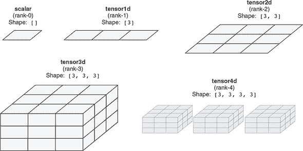
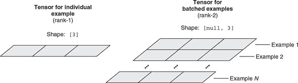
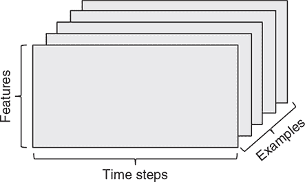
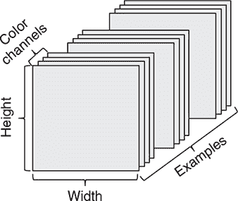

## 第二十章：B.1\. 张量的创建和张量轴约定

请记住，*张量*只是一个数据容器。每个张量都有两个基本属性：数据类型（dtype）和形状。*dtype* 控制张量中存储的值的类型。给定张量只能存储一种类型的值。截至本文撰写时（版本 0.13.5），支持的 dtype 为 float32、int32 和 bool。

*形状*是一个整数数组，指示张量中有多少个元素以及它们是如何组织的。可以将其视为张量的“形状和大小”，即张量作为容器的形状（参见 图 B.1）。

##### 图 B.1\. 秩为 0、1、2、3 和 4 的张量示例



形状的长度被称为张量的*秩*。例如，1D 张量，也称为*向量*，秩为 1。1D 张量的形状是一个包含一个数字的数组，这个数字告诉我们 1D 张量的长度。将秩增加一，我们得到一个 2D 张量，可以将其可视化为 2D 平面上的数字网格（如灰度图像）。2D 张量的形状有两个数字，告诉我们网格的高度和宽度。再增加一秩，我们得到一个 3D 张量。如 图 B.1 中的示例所示，你可以将 3D 张量可视化为 3D 数字网格。3D 张量的形状由三个整数组成；它们告诉我们沿着三个维度的 3D 网格的大小。所以，你看到了规律。秩为 4 的张量（4D 张量）更难以直接可视化，因为我们生活的世界只有三个空间维度。4D 张量经常在许多模型中使用，例如深度卷积网络。TensorFlow.js 支持秩高达 6 的张量。在实践中，秩为 5 的张量仅在某些小众情况下使用（例如涉及视频数据的情况），而秩为 6 的张量甚至更少见。

#### B.1.1\. 标量（秩为 0 的张量）

标量是形状为空数组(`[]`)的张量。它没有轴，始终只包含一个值。可以使用 `tf.scalar()` 函数创建一个新的标量。在 JavaScript 控制台（假设已加载 TensorFlow.js 并在 `tf` 符号处可用）中执行以下操作：

```js
> const myScalar = tf.scalar(2018);[1]
> myScalar.print();
Tensor
    2018
> myScalar.dtype;
"float32"
> myScalar.shape;
[]
> myScalar.rank;
0
```

> ¹
> 
> 请注意，出于空间和清晰起见，我们将跳过由于赋值而产生的 JavaScript 控制台输出行，因为它们对所讨论的问题没有说明性。

我们已创建一个标量张量，其中仅包含值 2018。其形状是空列表，正如预期的那样。它具有默认的 dtype (`"float32"`)。要将 dtype 强制为整数，请在调用 `tf.scalar()` 时提供 `'int32'` 作为额外参数：

```js
> const myIntegerScalar = tf.scalar(2018, 'int32');
> myIntegerScalar.dtype;
"int32"
```

要从张量中获取数据，我们可以使用异步方法`data()`。该方法是异步的，因为一般来说，张量可能被托管在主内存之外，例如在 GPU 上，作为 WebGL 纹理。检索这些张量的值涉及到不一定能立即解决的操作，我们不希望这些操作阻塞主 JavaScript 线程。这就是为什么`data()`方法是异步的。还有一个同步函数通过轮询检索张量的值：`dataSync()`。这种方法很方便，但会阻塞主 JavaScript 线程，所以应该尽量少用（例如，在调试期间）。尽量使用异步的`data()`方法：

```js
> arr = await myScalar.data();
Float32Array [2018]
> arr.length
1
> arr[0]
2018
```

要使用`dataSync()`：

```js
> arr = myScalar.dataSync();
Float32Array [2018]
> arr.length
1
> arr[0]
2018
```

我们看到，对于 float32 类型的张量，`data()`和`dataSync()`方法将值作为 JavaScript 的`Float32Array`原始值返回。如果你期望的是一个普通的数字，这可能有点令人惊讶，但是当考虑到其他形状的张量可能需要返回包含多个数字的容器时，这就更合理了。对于 int32 类型和 bool 类型的张量，`data()`和`dataSync()`分别返回`Int32Array`和`Uint8Array`。

请注意，即使标量始终包含一个元素，反之则不成立。张量的秩大于 0 的张量也可以只有一个元素，只要其形状中的数字乘积为 1 即可。例如，形状为`[1, 1]`的 2D 张量只有一个元素，但是它有两个轴。

#### B.1.2\. tensor1d（秩-1 张量）

1D 张量有时被称为秩-1 张量或向量。1D 张量恰好有一个轴，其形状是长度为 1 的数组。下面的代码将在控制台创建一个向量：

```js
> const myVector = tf.tensor1d([-1.2, 0, 19, 78]);
> myVector.shape;
[4]
> myVector.rank;
1
> await  myVector.data();
Float32Array(4) [-1.2, 0, 19, 78]
```

这个 1D 张量有四个元素，可以称为 4 维向量。不要混淆 4D*向量*和 4D*张量*！4D 向量是一个只有一个轴并且包含确切四个值的 1D 张量，而 4D 张量有四个轴（并且每个轴上可以有任意数量的维度）。维度可以表示沿着特定轴的元素数量（如我们的 4D 向量）或张量中的轴数（例如，4D 张量），这有时可能会令人困惑。在技术上，更正确和不含糊的是指一个秩-4 张量，但是无论如何都常见到模糊的表示法 4D 张量。在大多数情况下，这不应该是个问题，因为它可以根据上下文来消除歧义。

与标量张量一样，您可以使用`data()`和`dataSync()`方法来访问 1D 张量元素的值；例如，

```js
> await myVector.data()
Float32Array(4) [-1.2000000476837158, 0, 19, 78]
```

或者，您可以使用`data()`的同步版本，即`dataSync()`，但要注意，如果可能，应该避免使用`dataSync()`会阻塞 UI 线程：

```js
> myVector.dataSync()
Float32Array(4) [-1.2000000476837158, 0, 19, 78]
```

要访问 1D 张量的特定元素的值，您可以简单地索引到`data()`或`dataSync()`返回的 TypedArray；例如，

```js
> [await myVector.data()][2]
19
```

#### B.1.3\. tensor2d（秩-2 张量）

一个二维张量有两个轴。在某些情况下，一个二维张量被称为*矩阵*，它的两个轴可以被解释为矩阵的行和列索引，分别。您可以将矩阵视为元素的矩形网格（参见图 B.1 的第三面板）。在 TensorFlow.js 中，

```js
> const myMatrix = tf.tensor2d([[1, 2, 3], [40, 50, 60]]);
> myMatrix.shape;
[2, 3]
> myMatrix.rank;
2
```

第一个轴的条目称为*行*，第二个轴的条目称为*列*。在前面的例子中，`[1, 2, 3]` 是第一行，`[1, 40]` 是第一列。重要的是要知道，当使用 `data()` 或 `dataSync()` 返回数据时，数据将以*行优先*的方式作为扁平数组返回。换句话说，第一行的元素将首先出现在 `Float32Array` 中，然后是第二行的元素，依此类推：^([2])

> ²
> 
> 这与一些其他数值框架（如 MATLAB 和 R）中看到的列优先排序不同。

```js
> await myMatrix.data();
Float32Array(6) [1, 2, 3, 40, 50, 60]
```

之前，我们提到 `data()` 和 `dataSync()` 方法，当跟随索引时，可以用于访问一维张量的任何元素的值。当用于二维张量时，索引操作变得繁琐，因为 `data()` 和 `dataSync()` 返回的 TypedArray 会*扁平化*二维张量的元素。例如，为了确定与二维张量中第二行第二列的元素对应的 TypedArray 元素，您必须执行如下算术：

```js
> (await myMatrix.data())[1 * 3 + 1];
50
```

幸运的是，TensorFlow.js 提供了另一组方法，用于将张量的值下载到普通的 JavaScript 数据结构中：`array()` 和 `arraySync()`。与 `data()` 和 `dataSync()` 不同，这些方法返回正确保留原始张量秩和形状的嵌套 JavaScript 数组。例如，

```js
> JSON.stringify(await myMatrix.array())
 "[[1,2,3],[40,50,60]]"
```

要访问第二行第二列的元素，我们只需对嵌套数组进行两次索引：

```js
> (await myMatrix.array())[1][1]
 50
```

这消除了执行索引算术的需要，并且对于更高维度的张量特别方便。`arraySync()` 是 `array()` 的同步版本。与 `dataSync()` 类似，`arraySync()` 可能会阻塞 UI 线程，应谨慎使用。

在 `tf.tensor2d()` 调用中，我们提供了一个嵌套的 JavaScript 数组作为参数。参数由嵌套在另一个数组中的数组行组成。这种嵌套结构由 `tf.tensor2d()` 用于推断二维张量的形状——即有多少行和多少列，分别。使用 `tf.tensor2d()` 创建相同的二维张量的另一种方法是提供元素作为平面（非嵌套）JavaScript 数组，并伴随一个第二个参数，指定二维张量的形状：

```js
> const myMatrix = tf.tensor2d([1, 2, 3, 40, 50, 60], [2, 3]);
> myMatrix.shape;
[2, 3]
> myMatrix.rank;
2
```

在这种方法中，`shape` 参数中所有数字的乘积必须与浮点数组中的元素数相匹配，否则在 `tf.tensor2d()` 调用期间将抛出错误。对于秩高于 2 的张量，创建张量还有两种类似的方法：使用一个嵌套数组作为参数，或者使用一个带有形状参数的平坦数组。在本书的不同示例中，您会看到这两种方法都被使用。

#### B.1.4\. 秩为 3 及更高维度的张量

如果您将几个 2D 张量打包到一个新数组中，您将获得一个 3D 张量，您可以将其想象为元素的立方体（图 B.1 中的第四个面板）。在 TensorFlow.js 中，可以按照以前的模式创建秩为 3 的张量：

```js
> const myRank3Tensor = tf.tensor3d([[[1, 2, 3],
                                      [4, 5, 6]],
                                      [[10, 20, 30],
                                      [40, 50, 60]]]);
> myRank3Tensor.shape;
[2, 2, 3]
> myRank3Tensor.rank;
3
```

另一种执行相同操作的方法是提供一个扁平（非嵌套）值数组，以及一个显式形状：

```js
> const anotherRank3Tensor = tf.tensor3d(
    [1, 2, 3, 4, 5, 6, 7, 8, 9, 10, 11, 12],
    [2, 2, 3]);
```

在这个例子中，`tf.tensor3d()` 函数可以被更通用的 `tf.tensor()` 函数替代。这允许你生成任何秩（rank）的张量，最高可达到 6。在下面的示例中，我们创建了一个秩为 3 和一个秩为 6 的张量：

```js
> anotherRank3Tensor = tf.tensor(
    [1, 2, 3, 4, 5, 6, 7, 8, 9, 10, 11, 12],
    [2, 2, 3]);
> anotherRank3Tensor.shape;
[2, 2, 3]
> anotherRank3Tensor.rank;
3

> tinyRank6Tensor = tf.tensor([13], [1, 1, 1, 1, 1, 1]);
> tinyRank6Tensor.shape;
[1, 1, 1, 1, 1, 1]
> tinyRank6Tensor.rank;
6
```

#### B.1.5\. 数据批次的概念

在实践中，在深度学习中你将遇到的所有张量中，第一个轴（轴 0，因为索引从 0 开始）几乎总是*批处理轴*（有时称为*样本轴*或*批处理维度*）。因此，一个模型作为输入获取的实际张量的秩比单个输入特征的秩高 1。这一点贯穿于本书中所有 TensorFlow.js 模型。第一个维度的大小等于批次中的示例数，称为*批处理大小*。例如，在第三章（清单 3.9）中的鸢尾花分类示例中，每个示例的输入特征由表示为长度为 4 的向量的四个数字组成（形状为 `[4]` 的 1D 张量）。因此，鸢尾花分类模型的输入是 2D 的，形状为 `[null, 4]`，其中第一个 null 值表示模型运行时将确定的批处理大小（见图 B.2）。这种批处理约定也适用于模型的输出。例如，鸢尾花分类模型为每个个别输入示例输出一个三种可能的鸢尾花类型的独热编码，这是一个形状为 `[3]` 的 1D 张量。但是，模型的实际输出形状是 2D 的，形状为 `[null, 3]`，其中第一个 null 值是待确定的批处理大小。

##### 图 B.2\. 单个示例（左）和批示例（右）的张量形状。批示例的张量比单个示例的张量的秩高一级，并且是`tf.Model`对象的`predict()`、`fit()`和`evaluate()`方法所接受的格式。批示例张量的形状中的`null`表示张量的第一维具有一个未确定的大小，在对上述方法进行实际调用时可以是任何正整数。



#### B.1.6\. 张量的真实例子

让我们通过几个与本书中遇到的类似的例子使张量更加具体化。你将操作的数据几乎总是属于以下类别之一。在前面的讨论中，我们遵循批处理约定，并始终将批次中的示例数（`numExamples`）作为第一个轴包括进去：

+   *向量数据*—形状为`[numExamples, features]`的 2D 张量

+   *时间序列（序列）数据*—形状为`[numExamples, timesteps, features]`的 3D 张量

+   *图像*—形状为`[numExamples, height, width, channels]`的 4D 张量

+   *视频*—形状为`[numExamples, frame, height, width, channels]`的 5D 张量

##### 向量数据

这是最常见的情况。在这样的数据集中，每个单独的数据样本可以被编码为一个向量，因此数据的批将被编码为一个秩为 2 的张量，其中第一个轴是样本轴，第二个轴是特征轴。

让我们看两个例子：

+   一个人口数据集，其中我们考虑每个人的年龄、邮政编码和收入。每个人可以被描述为一个包含 3 个值的向量，因此一个包含 10 万人的完整数据集可以存储在形状为`[100000, 3]`的 2D 张量中。

+   一个文本文档数据集，其中我们通过每个单词出现的次数来表示每个文档（例如，从包含 20000 个最常见单词的英语词典中）。每个文档可以被编码为一个包含 20000 个值的向量（词典中每个单词的计数），因此 500 个文档的批可以存储在形状为`[500, 20000]`的张量中。

##### 时间序列或序列数据

每当数据中涉及时间（或者序列顺序的概念）时，将其存储在具有显式时间轴的 3D 张量中是有意义的。每个样本被编码为一系列向量（一个 2D 张量），因此样本批将被编码为 3D 张量（参见图 B.3）。

##### 图 B.3\. 一个 3D 时间序列数据张量



几乎总是按照惯例，时间轴是第二个轴（索引为 1 的轴），如下例所示：

+   一个股票价格数据集。每分钟我们存储股票的当前价格，过去一分钟内的最高价格和最低价格。因此，每分钟被编码为一个三个值的向量。由于一个小时有 60 分钟，一小时的交易被编码为一个形状为 `[60, 3]` 的二维张量。如果我们有一个包含 250 个独立小时序列的数据集，数据集的形状将是 `[250, 60, 3]`。

+   一个推文数据集，其中我们将每个推文编码为由 128 个唯一字符组成的 280 个字符序列。在这种设置中，每个字符都可以编码为大小为 128 的二进制向量（除了在对应字符的索引处有一个 1 的条目外，全部为零）。然后，每个字符可以被视为一个形状为 `[280, 128]` 的二阶张量。一个包含 100 万条推文的数据集可以存储在一个形状为 `[1000000, 280, 128]` 的张量中。

##### 图像数据

图像的数据通常具有三个维度：高度、宽度和颜色深度。尽管灰度图像只有一个颜色通道，但按照惯例，图像张量始终是三阶的，对于灰度图像有一个一维的颜色通道。因此，一个大小为 256 × 256 的 128 个灰度图像批次将存储在一个形状为 `[128, 256, 256, 1]` 的张量中，而一个包含 128 个彩色图像的批次将存储在一个形状为 `[128, 256, 256, 3]` 的张量中（参见图 B.4）。这称为 NHWC 约定（有关更多详情，请参见第四章）。

##### 图 B.4\. 一个 4D 图像数据张量



一些框架在高度和宽度之前放置通道维度，使用 NCHW 约定。在本书中，我们不使用这个约定，但在其他地方看到形状如 `[128, 3, 256, 256]` 的图像张量也不要感到惊讶。

##### 视频数据

原始视频数据是少数几种常见的真实世界数据之一，你需要使用到五维张量。视频可以理解为一系列帧，每一帧都是一幅彩色图像。由于每一帧可以存储在一个三维张量 `[height, width, colorChannel]` 中，一系列帧可以存储在一个四维张量 `[frames, height, width, colorChannel]` 中，因此一批不同的视频将存储在一个五维张量中，形状为 `[samples, frames, height, width, colorChannel]`。

例如，一个 60 秒长，144 × 256 分辨率的 YouTube 视频剪辑，每秒采样 4 帧，将有 240 帧。四个这样的视频剪辑批次将存储在一个形状为 `[4, 240, 144, 256, 3]` 的张量中。总共有 106,168,320 个值！如果张量的数据类型为 `'float32'`，那么每个值将以 32 位存储，因此张量将表示 405 MB。这是大量的数据！你在现实生活中遇到的视频要轻得多，因为它们不是以 float32 存储，并且通常被大幅压缩（例如 MPEG 格式）。

#### B.1.7\. 从张量缓冲区创建张量

我们已经展示了如何使用诸如 `tf.tensor2d()` 和 `tf.tensor()` 等函数从 JavaScript 数组创建张量。为此，您必须先确定所有元素的值，并在之前的 JavaScript 数组中设置它们。但是，在某些情况下，从头开始创建这样一个 JavaScript 数组有点繁琐。例如，假设您要创建一个 5 × 5 矩阵，其中所有的非对角线元素都为零，而对角线元素形成一个递增序列，等于行或列索引加 1：

```js
[[1, 0, 0, 0, 0],
 [0, 2, 0, 0, 0],
 [0, 0, 3, 0, 0],
 [0, 0, 0, 4, 0],
 [0, 0, 0, 0, 5]]
```

如果要创建一个满足此要求的嵌套 JavaScript 数组，代码将如下所示：

```js
const n = 5;
const matrixArray = [];
for (let i = 0; i < 5; ++i) {
  const row = [];
  for (let j = 0; j < 5; ++j) {
    row.push(j === i ? i + 1 : 0);
  }
  matrixArray.push(row);
}
```

最后，你可以把嵌套的 JavaScript 数组 `matrixArray` 转换成一个二维张量：

```js
> const matrix = tf.tensor2d(matrixArray);
```

这段代码看起来有点繁琐。它涉及两个嵌套的 `for` 循环。有没有简化它的方法？答案是有：我们可以使用 `tf.tensorBuffer()` 方法创建一个 `TensorBuffer`。`TensorBuffer` 对象允许您通过索引指定其元素，并使用 `set()` 方法更改其值。这与 TensorFlow.js 中的张量对象不同，后者的元素值是*不可变的*。当您完成设置 `TensorBuffer` 的所有元素的值后，可以通过其 `toTensor()` 方法方便地将 `TensorBuffer` 转换为实际的张量对象。因此，如果我们使用 `tf.tensorBuffer()` 来实现与上述代码相同的张量创建任务，新代码将如下所示

```js
const buffer = tf.tensorBuffer([5, 5]);   ***1***
for (let i = 0; i < 5; ++i) {
  buffer.set(i +  1, i, i);               ***2***
}
const matrix = buffer.toTensor();         ***3***
```

+   ***1*** 创建 TensorBuffer 时指定张量形状。创建后，TensorBuffer 的所有值都为零。

+   ***2*** 第一个参数是所需的值，而其余的参数是要设置的元素的索引。

+   ***3*** 从 TensorBuffer 获取实际的张量对象

因此，通过使用 `tf.tensorBuffer()`，我们将代码行数从 10 减少到 5。

#### B.1.8\. 创建全零和全一张量

通常希望创建一个给定形状的全零张量。你可以使用 `tf.zeros()` 函数来实现这一点。调用该函数时，将期望的形状作为输入参数提供；例如，

```js
> const x = tf.zeros([2, 3, 3]);
> x.print();
Tensor
    [[[0, 0, 0],
      [0, 0, 0],
      [0, 0, 0]],
      [[0, 0, 0],
      [0, 0, 0],
      [0, 0, 0]]]
```

创建的张量具有默认的 dtype（float32）。要创建其他 dtype 的全零张量，请将 dtype 指定为 `tf.zeros()` 的第二个参数。

相关的函数是 `tf.zerosLike()`，它让您可以创建一个与现有张量具有相同形状和 dtype 的全零张量。例如，

```js
> const y = tf.zerosLike(x);
```

等同于

```js
> const y = tf.zeros(x.shape, x.dtype);
```

但更简洁。

类似的方法允许你创建所有元素都相等的张量：`tf.ones()` 和 `tf.onesLike()`。

#### B.1.9\. 创建随机值张量

创建具有随机值的张量在许多情况下都很有用，比如权重的初始化。创建具有随机值张量最常用的函数是 `tf.randomNormal()` 和 `tf.randomUniform()`。这两个函数具有类似的语法，但导致元素值的分布不同。顾名思义，`tf.randomNormal()` 返回的张量中的元素值遵循正态（高斯）分布。如果你只用一个形状参数调用该函数，你会得到一个元素遵循 *单位* 正态分布的张量：均值 = 0，标准差（SD）= 1。例如，

> ³
> 
> 对于熟悉统计学的读者，元素值彼此独立。

```js
> const x = tf.randomNormal([2, 3]);
> x.print():
Tensor
    [[-0.2772508, 0.63506  , 0.3080665],
     [0.7655841 , 2.5264773, 1.142776 ]]
```

如果你希望正态分布有一个非默认的均值或标准差，你可以将它们作为第二和第三个输入参数提供给 `tf.randomUniform()`。例如，以下调用创建了一个元素值遵循均值 = -20，标准差 = 0.6 的正态分布的张量：

```js
> const x = tf.randomNormal([2, 3], -20, 0.6);
> x.print();
Tensor
    [[-19.0392246, -21.2259483, -21.2892818],
     [-20.6935596, -20.3722878, -20.1997948]]
```

`tf.randomUniform()` 允许你创建具有均匀分布元素值的随机张量。默认情况下，均匀分布是单位分布，即下界为 0，上界为 1：

```js
> const x = tf.randomUniform([3, 3]);
> x.print();
Tensor
    [[0.8303654, 0.3996494, 0.3808384],
     [0.0751046, 0.4425731, 0.2357403],
     [0.4682371, 0.0980235, 0.7004037]]
```

如果你想让元素值遵循非单位均匀分布，你可以将下界和上界指定为 `tf.randomUniform()` 的第二和第三个参数，例如，

```js
> const x = tf.randomUniform([3, 3], -10, 10);
```

创建一个值在 `[-10, 10)` 区间内随机分布的张量：

```js
> x.print();
Tensor
    [[-7.4774652, -4.3274679, 5.5345411 ],
     [-6.767087 , -3.8834026, -3.2619202],
     [-8.0232048, 7.0986223 , -1.3350322]]
```

`tf.randomUniform()` 可用于创建具有随机值的 int32 类型张量。这在你想要生成随机标签的情况下非常有用。例如，以下代码创建了一个长度为 10 的向量，其中的值随机抽取自整数 0 到 100（区间 `[0, 100)`）：

```js
> const x = tf.randomUniform([10], 0, 100, 'int32');
> x.print();
Tensor
    [92, 16, 65, 60, 62, 16, 77, 24, 2, 66]
```

注意，在这个例子中 `'int32'` 参数是关键。没有它，你得到的张量将包含 float32 值而不是 int32 值。
