# 第十一章：文本的深度学习

*本章涵盖*

+   为机器学习应用预处理文本数据

+   文本处理的词袋方法和序列建模方法

+   Transformer 架构

+   序列到序列学习

## 11.1 自然语言处理：鸟瞰视角

在计算机科学中，我们将人类语言，如英语或普通话，称为“自然”语言，以区别于为机器设计的语言，如汇编、LISP 或 XML。每种机器语言都是*设计*出来的：其起点是人类工程师书写一组形式规则，描述该语言中可以做出的语句以及它们的含义。规则先行，人们只有在规则集合完成后才开始使用该语言。而对于人类语言，情况恰恰相反：使用先行，规则随后产生。自然语言像生物体一样经历了演化过程，这就是使其“自然”的原因。其“规则”，如英语的语法，在事后才被正式化，而且常常被其使用者忽视或打破。因此，尽管

可机器读取的语言具有高度结构化和严格的特性，使用精确的语法规则将来自固定词汇表的确切定义的概念编织在一起，而自然语言则杂乱无章——含糊、混乱、庞大且不断变化。

创造能够理解自然语言的算法是一件大事：语言——尤其是文本——是我们大部分交流和文化生产的基础。互联网主要是文本。语言是我们几乎所有知识的存储方式。我们的思维基本上是建立在语言之上的。然而，机器长期以来一直无法理解自然语言。有些人曾天真地认为，你可以简单地书写“英语的规则集”，就像可以书写 LISP 的规则集一样。早期尝试构建自然语言处理（NLP）系统因此是通过“应用语言学”的视角进行的。工程师和语言学家将手工制作复杂的规则集来执行基本的机器翻译或创建简单的聊天机器人，如 1960 年代著名的 ELIZA 程序，它使用模式匹配来维持非常基本的对话。但语言是一种叛逆的东西：它不容易被形式化。经过几十年的努力，这些系统的能力仍然令人失望。

在 20 世纪 90 年代初，手工制定的规则被视为主流方法。但是从上世纪 80 年代末开始，更快的计算机和更多的数据可用性开始使得更好的替代方案成为可能。当你发现自己正在构建一堆堆临时规则的系统时，作为一个聪明的工程师，你很可能会开始问：“我能否使用一组数据来自动化找到这些规则的过程？我能否在某种规则空间内搜索规则，而不是自己想出来？”就这样，你就开始进行机器学习了。因此，从上世纪 80 年代末开始，我们开始看到机器学习方法应用于自然语言处理。最早的方法基于决策树——其目的实际上是自动化之前系统中的 if/then/else 规则的发展。然后，统计方法开始加速发展，从逻辑回归开始。随着时间的推移，学习到的参数模型完全接管了，语言学开始被视为更多的阻碍而不是有用的工具。早期语音识别研究人员 Frederick Jelinek 在 1990 年代开玩笑说：“每次我解雇一个语言学家，语音识别器的性能都会提高。”

这就是现代 NLP 的内容：利用机器学习和大型数据集，使计算机不仅*理解*语言（这是一个更为高远的目标），而是将语言片段作为输入并返回一些有用的东西，比如预测以下内容：

+   “这段文字的主题是什么？”（文本分类）

+   “这段文字中是否包含滥用内容？”（内容过滤）

+   “这段文字听起来是积极的还是消极的？”（情感分析）

+   “这不完整句子中的下一个词应该是什么？”（语言建模）

+   “你会如何用德语表达这句话？”（翻译）

+   “你会如何用一段话总结这篇文章？”（总结）

+   诸如此类。

当然，在整个本章中请记住，你将训练的文本处理模型不会具有人类般的语言理解能力；相反，它们只是在其输入数据中寻找统计规律，这足以在许多简单任务中表现良好。就像计算机视觉是应用于像素的模式识别一样，NLP 是应用于单词、句子和段落的模式识别。

从 1990 年代到 2010 年代初，NLP 的工具集——决策树和逻辑回归——进化缓慢。大部分研究重点放在特征工程上。当我（François）在 2013 年赢得了我的第一个 Kaggle NLP 比赛时，你猜对了，我的模型就是基于决策树和逻辑回归的。然而，大约在 2014 年至 2015 年左右，事情开始改变。多位研究人员开始调查循环神经网络的语言理解能力，特别是 LSTM——一种来自上世纪 90 年代末的序列处理算法，直到那时才悄悄地被关注。

在 2015 年初，Keras 发布了第一个开源的、易于使用的 LSTM 实现，刚好在重新激发对循环神经网络的兴趣的浪潮开始时。此前，只有无法被方便地重用的“研究代码”。从 2015 年到 2017 年，循环神经网络在蓬勃发展的自然语言处理领域占据主导地位。特别是双向 LSTM 模型，在许多重要任务（从摘要到问答再到机器翻译）中都达到了最先进的水平。

最后，在 2017 年至 2018 年左右，一种新的架构崛起取代了 RNN：Transformer，您将在本章的下半部分学习有关它的知识。Transformer 在短时间内实现了领域内的重大进展，如今大多数 NLP 系统都基于它们。

让我们深入了解细节。本章将带你从基础知识到使用 Transformer 进行机器翻译。

## 11.2 准备文本数据

深度学习模型作为可微分函数，只能处理数值张量：它们无法将原始文本作为输入。对文本进行向量化是将文本转换为数值张量的过程。文本向量化过程有很多形式和方式，但它们都遵循相同的模板（参见图 11.1）：

+   首先，您需要对文本进行*标准化*以便更容易处理，例如转换为小写或去除标点符号。

+   您将文本拆分为单位（称为*令牌*），如字符、单词或一组单词。这称为*分词*。

+   您需要将每个标记转换为数值向量。通常，这将首先涉及*索引*数据中存在的所有令牌。

让我们回顾一下每个步骤。

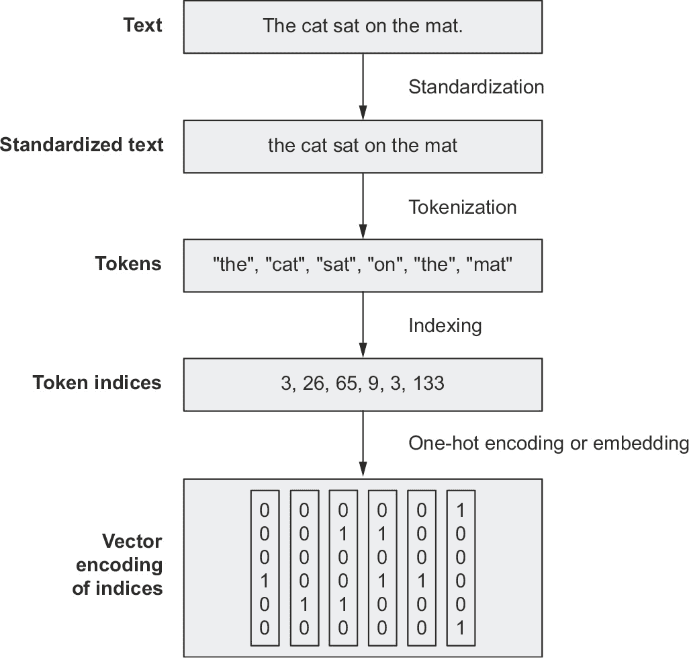

**图 11.1 从原始文本到向量的转换**

### 11.2.1 文本标准化

考虑以下这两个句子：

+   “sunset came. i was staring at the Mexico sky. Isnt nature splendid??”

+   “Sunset came; I stared at the México sky. Isn’t nature splendid?”

它们非常相似 - 实际上，它们几乎相同。但是，如果您将它们转换为字节字符串，它们的表示将非常不同，因为“i”和“I”是两个不同的字符，“Mexico”和“México”是两个不同的词，“isnt”不是“isn’t”，等等。机器学习模型事先不知道“i”和“I”是同一个字母，“é”是带重音的“e”，“staring”和“stared”是同一个动词的两种形式。

文本标准化是一种基本的特征工程形式，旨在消除您不希望模型处理的编码差异。这不仅适用于机器学习，如果您构建一个搜索引擎，您也需要做同样的处理。

最简单和最广泛使用的标准化方案之一是“转为小写并去除标点符号”。我们的两个句子变为：

+   “sunset came i was staring at the mexico sky isnt nature splendid”

+   “sunset came i stared at the méxico sky isnt nature splendid”

进展已经非常接近了。另一个常见的转换是将特殊字符转换为标准形式，例如用“e”替换“é”，用“ae”替换“æ”等等。我们的标记“méxico”然后会变成“mexico”。

最后，一个更加高级的标准化模式在机器学习的背景下更少见，那就是*词干提取*：将一个词的变体（例如动词的不同变形形式）转换为一个共享的单一表示，比如将“caught”和“been catching”变为“[catch]”，或者将“cats”变为“[cat]”。通过词干提取，“was staring”和“stared”会变成类似“[stare]”，而我们的两个相似的句子最终将以相同的编码结束：

+   “日落时我盯着墨西哥的天空，大自然真是壮观啊”

通过这些标准化技术，您的模型将需要更少的训练数据，并且将更好地概括——它不需要丰富的“Sunset”和“sunset”示例来学习它们意味着相同的事情，它将能够理解“México”，即使它只在训练集中看到过“mexico”。当然，标准化也可能会擦除一定量的信息，所以始终牢记上下文：例如，如果您正在编写一个从面试文章中提取问题的模型，它应该绝对将“?”视为一个单独的标记，而不是删除它，因为对于这个特定任务来说，它是一个有用的信号。

### 11.2.2 文本分割（标记化）

一旦您的文本标准化，您需要将其分割成单元以进行向量化（标记化），这一步被称为*标记化*。您可以通过三种不同的方式来实现这一点：

+   *单词级标记化*—其中标记是以空格（或标点符号）分隔的子字符串。在适用时，将单词进一步分割为子单词的变体，例如将“staring”视为“star+ing”或将“called”视为“call+ed”。

+   *N-gram 标记化*—其中标记是*N*个连续单词的组合。例如，“the cat”或“he was”将是 2-gram 标记（也称为 bigrams）。

+   *字符级标记化*—其中每个字符都是其自己的标记。实际上，这种方案很少使用，您只会在特定的上下文中真正看到它，例如文本生成或语音识别。

一般来说，您将始终使用单词级别或*N*-gram 标记化。有两种文本处理模型：那些关心单词顺序的模型称为*序列模型*，而那些将输入单词视为一组并丢弃它们的原始顺序的模型称为*词袋模型*。如果您正在构建一个序列模型，您将使用单词级标记化，如果您正在构建一个词袋模型，您将使用*N*-gram 标记化。*N*-grams 是一种将一小部分局部单词顺序信息注入模型的方法。在本章中，您将学习更多关于每种类型的模型以及何时使用它们的信息。

**理解 *N*-grams 和词袋**

词* N * 元组是一组 * N *（或更少）连续的单词，您可以从句子中提取出来。相同的概念也可以应用于字符而不是单词。

这是一个简单的例子。考虑一下句子“the cat sat on the mat。”它可以分解为以下一组二元组：

c("the", "the cat", "cat", "cat sat", "sat",

"sat on", "on", "on the", "the mat", "mat")

它也可以分解为以下一组三元组：

c("the", "the cat", "cat", "cat sat", "the cat sat",

"sat", "sat on", "on", "cat sat on", "on the",

"sat on the", "the mat", "mat", "on the mat")

这样的一组被称为*二元组袋或三元组袋*。这里的“袋”一词是指你处理的是一组标记而不是列表或序列：标记没有特定的顺序。这系列标记方法被称为*词袋*（或*词袋-N-gram*）。

因为词袋不是一个保留顺序的标记方法（生成的标记被理解为一组，而不是一个序列，并且句子的一般结构丢失了），所以它倾向于在浅层语言处理模型中使用而不是在深度学习模型中使用。提取* N * 元组是一种特征工程，深度学习序列模型放弃了这种手动方法，用分层特征学习替换了它。一维卷积神经网络，循环神经网络和 Transformer 能够学习表示单词和字符组合，而不需要明确告诉它们这些组合的存在，通过查看连续的单词或字符序列。

### 11.2.3 词汇表索引

一旦您的文本被分割成标记，您需要将每个标记编码为数字表示。你可能会以无状态的方式做这个，比如将每个标记哈希成一个固定的二进制向量，但在实践中，你会构建一个包含在训练数据中找到的所有术语（“词汇表”）的索引，并为词汇表中的每个条目分配一个唯一的整数，类似这样：

词汇表 <- character()

for (string in text_dataset) {

tokens <- string %>%

standardize() %>%

tokenize()

词汇表 <- unique(c(词汇表, tokens))

}

你随后可以将整数索引位置转换为向量编码，该编码可以由神经网络处理，比如说一个独热向量：

one_hot_encode_token <- function(token) {

vector <- array(0, dim = length(vocabulary))

token_index <- match(token, vocabulary)

vector[token_index] <- 1

向量

}

注意，在这一步，将词汇表限制为训练数据中最常见的前 20,000 或 30,000 个单词是很常见的。任何文本数据集通常都包含大量的唯一术语，其中大多数只出现一两次。索引这些罕见的术语将导致一个特征空间过大，其中大多数特征几乎没有信息内容。

还记得你在第四章和第五章在 IMDB 数据集上训练你的第一个深度学习模型时吗？你当时使用的来自 dataset_imdb()的数据已经预处理成整数序列，其中每个整数代表一个给定的词。那时，我们使用了 num_words = 10000 的设置，将我们的词汇限制为训练数据中前 10000 个最常见的单词。

现在，有一个重要的细节我们不能忽视：当我们在词汇表索引中查找一个新标记时，它可能并不存在。你的训练数据可能不包含任何“cherimoya”一词（或者你可能将其从索引中排除，因为它太稀有了），所以执行 token_index = match(“cherimoya”, vocabulary)可能返回 NA。为了处理这种情况，你应该使用一个“未知词汇”索引（缩写为*OOV 索引*）——用于任何不在索引中的标记的通配符。通常是索引 1：实际上你正在执行 token_index = match(“cherimoya”, vocabulary, nomatch = 1)。当将一系列整数解码回单词时，你会用类似“[UNK]”的东西来替换 1（你会称其为“未知标记”）。

“为什么使用 1 而不是 0？” 你可能会问。那是因为 0 已经被使用了。你通常会使用两个特殊的标记：未知标记（索引 1）和*掩码标记*（索引 0）。虽然未知标记表示“这里有一个我们不认识的词”，但掩码标记告诉我们“忽略我，我不是一个词”。你会特别用它来填充序列数据：因为数据批次需要是连续的，序列数据批次中的所有序列必须具有相同的长度，所以较短的序列应该填充到最长序列的长度。如果你想要创建一个数据批次，其中包含序列 c(5, 7, 124, 4, 89)和 c(8, 34, 21)，它看起来应该是这样的：

rbind(c(5,  7, 124, 4, 89),

c(8, 34,  21, 0,  0))

你在第四章和第五章中使用的 IMDB 数据集的整数序列批次是这样填充的。

### 11.2.4 使用 layer_text_vectorization

到目前为止，我介绍的每个步骤都很容易在纯 R 中实现。也许你可以写出类似这样的代码：

new_vectorizer <- function() {

self <- new.env(parent = emptyenv())

attr(self, "class") <- "Vectorizer"

self$vocabulary <- c("[UNK]")

self$standardize <- function(text) {

text <- tolower(text)

gsub("[[:punct:]]", "", text)➊

}

self$tokenize <- function(text) {

unlist(strsplit(text, "[[:space:]]+"))➋

}

self$make_vocabulary <- function(text_dataset) {➌

tokens <- text_dataset %>%

self$standardize() %>%

self$tokenize()

self$vocabulary <- unique(c(self$vocabulary, tokens))

}

self$encode <- function(text) {

tokens <- text %>%

self$standardize() %>%

self$tokenize()

match(tokens, table = self$vocabulary, nomatch = 1)➍

}

self$decode <- function(int_sequence) {

vocab_w_mask_token <- c("", self$vocabulary)

vocab_w_mask_token[int_sequence + 1]➎

}

self

}

vectorizer <- new_vectorizer()

dataset <- c("我写，擦除，重写",➏

"再次擦除，然后",

"虞美人开花了。")

vectorizer$make_vocabulary(dataset)

➊ **删除标点符号。**

➋ **按空格分割并返回一个扁平化的字符向量。**

➌ **text_dataset 将是一个字符串向量，即 R 字符向量。**

➍ **nomatch 匹配 "[UNK]"。**

➎ **掩码令牌通常被编码为 0 整数，并解码为空字符串：" "。**

➏ **诗人北诗的俳句**

它完成了任务：

test_sentence <- "我写，重写，仍然再次重写"

encoded_sentence <- vectorizer$encode(test_sentence)

print(encoded_sentence)

[1] 2 3 5 7 1 5 6

decoded_sentence <- vectorizer$decode(encoded_sentence)

print(decoded_sentence)

[1] "i"      "write"   "rewrite" "and"      "[UNK]"   "rewrite" "again"

但是，使用这样的内容效率不会很高。在实践中，您将使用 Keras layer_text_vectorization()，它快速高效，并且可以直接放入 TF Dataset 流水线或 Keras 模型中。这是 layer_text_vectorization() 的外观：

text_vectorization <

layer_text_vectorization(output_mode = "int")➊

➊ **配置该层以返回以整数索引编码的单词序列。还有其他几种可用的输出模式，您很快就会看到它们的作用。**

默认情况下，layer_text_vectorization()将使用“转换为小写并删除标点符号”的设置进行文本标准化，并使用“按空格分割”进行标记化。但是重要的是，您可以提供自定义函数进行标准化和标记化，这意味着该层足够灵活，可以处理任何用例。请注意，此类自定义函数应该对 tf.string 类型的张量进行操作，而不是常规的 R 字符向量！例如，默认层行为相当于以下内容：

library(tensorflow)

custom_standardization_fn <- function(string_tensor) {

string_tensor %>%

tf$strings$lower() %>% ➊

tf$strings$regex_replace("[[:punct:]]", "")➋

}

custom_split_fn <- function(string_tensor) {

tf$strings$split(string_tensor)➌

}

text_vectorization <- layer_text_vectorization(

output_mode = "int",

standardize = custom_standardization_fn,

split = custom_split_fn

)

➊ **将字符串转换为小写。**

➋ **用空字符串替换标点符号字符。**

➌ **按空格分割字符串。**

要对文本语料库的词汇进行索引，只需调用该层的 adapt()方法，传入一个 TF Dataset 对象，该对象产生字符串，或者只需传入一个 R 字符向量：

dataset <- c("我写，擦除，重写",

"再次擦除，然后",

"虞美人开花了。")

adapt(text_vectorization, dataset)

请注意，您可以通过 get_vocabulary() 检索计算出的词汇表。如果您需要将编码为整数序列的文本转换回单词，这可能很有用。词汇表中的前两个条目是掩码令牌（索引 0）和 OOV 令牌（索引 1）。词汇表中的条目按频率排序，因此在真实世界的数据集中，像“the”或“a”这样非常常见的词将首先出现。

**图 11.1 显示词汇表**

get_vocabulary(text_vectorization)

为了演示，让我们尝试对一个示例句子进行编码然后解码：

vocabulary <- text_vectorization %>% get_vocabulary()

test_sentence <- "我写，改写，还在不断改写"

encoded_sentence <- text_vectorization(test_sentence)

decoded_sentence <- paste(vocabulary[as.integer(encoded_sentence) + 1],

collapse = " ")

encoded_sentence

tf.Tensor([ 7  3  5  9  1  5  10], shape=(7), dtype=int64)

decoded_sentence

[1] "我写改写和[UNK]再次改写"

**在 TF Dataset 管道中使用 layer_text_vectorization()或作为模型的一部分**

因为 layer_text_vectorization()主要是一个字典查找操作，将标记转换为整数，它不能在 GPU（或 TPU）上执行——只能在 CPU 上执行。所以，如果你在 GPU 上训练模型，你的 layer_text_vectorization()将在 CPU 上运行，然后将其输出发送到 GPU。这对性能有重要的影响。

有两种方法可以使用我们的 layer_text_vectorization()。第一种选择是将其放入 TF Dataset 管道中，就像这样：

int_sequence_dataset <- string_dataset %>%➊

dataset_map(text_vectorization,

num_parallel_calls = 4)➋

➊ **string_dataset 将是一个产生字符串张量的 TF Dataset。**

➋ **num_parallel_calls 参数用于在多个 CPU 核心上并行化 dataset_map()调用。**

第二种选择是将其作为模型的一部分（毕竟，它是一个 Keras 层），就像这样（伪代码中）：

text_input <- layer_input(shape = shape(), dtype = "string")➊

vectorized_text <- text_vectorization(text_input)➋

embedded_input <- vectorized_text %>% layer_embedding(…)

output <- embedded_input %>% …

model <- keras_model(text_input, output)

➊ **创建一个期望字符串的符号输入。**

➋ **将文本向量化层应用于它。**

➌ **你可以继续在上面链接新的层——就像你的常规 Functional API 模型一样。**

这两者之间有一个重要的区别：如果向量化步骤是模型的一部分，它将与模型的其余部分同步进行。这意味着在每个训练步骤中，模型的其余部分（放置在 GPU 上）将不得不等待 layer_text_vectorization()的输出（放置在 CPU 上）准备好才能开始工作。与此同时，将层放入 TF Dataset 管道中使您能够在 CPU 上对数据进行异步预处理：当 GPU 在一批向量化数据上运行模型时，CPU 通过向量化下一批原始字符串来保持忙碌。

如果你在 GPU 或 TPU 上训练模型，你可能会选择第一种选项以获得最佳性能。这是我们将在本章的所有实际示例中所做的。不过，在 CPU 上进行训练时，同步处理是可以接受的：无论选择哪个选项，你都将获得 100%的核心利用率。

现在，如果你要将我们的模型导出到生产环境中，你会希望发布一个接受原始字符串作为输入的模型，就像上述第二个选项的代码片段中一样；否则，你将不得不在生产环境中重新实现文本标准化和标记化（也许是在 JavaScript 中？），并且你将面临引入小的预处理差异可能会影响模型准确性的风险。幸运的是，layer_text_vectorization() 让你可以将文本预处理直接包含到你的模型中，使得部署变得更容易，即使你最初将该层作为 TF Dataset 管道的一部分使用。在本章后面的侧边栏中，“导出处理原始字符串的模型”，你将学习如何导出一个仅进行推断的训练模型，其中包含了文本预处理。

你现在已经学会了关于文本预处理的所有知识。让我们进入建模阶段。

## 11.3 表示词组的两种方法：集合和序列

机器学习模型应该如何表示*单个单词*是一个相对没有争议的问题：它们是分类特征（来自预定义集合的值），我们知道如何处理这些特征。它们应该被编码为特征空间中的维度，或者作为类别向量（在这种情况下是单词向量）。然而，一个更为棘手的问题是如何编码*单词被编织到句子中的方式*：词序。

自然语言中的顺序问题是一个有趣的问题：与时间序列的步骤不同，句子中的单词没有自然的、规范的顺序。不同的语言以非常不同的方式排序相似的单词。例如，英语的句子结构与日语大不相同。甚至在同一种语言中，你通常可以通过稍微重排单词来用不同的方式表达同样的事情。更进一步，如果你完全随机排列一个短句中的单词，你仍然可以大致理解它的意思，尽管在许多情况下，会出现相当大的歧义。顺序显然很重要，但它与意义的关系并不简单。

如何表示词序是不同类型的自然语言处理架构产生的关键问题。你可以做的最简单的事情就是丢弃顺序，将文本视为无序的单词集合——这给你带来了词袋模型。你也可以决定严格按照单词出现的顺序逐个处理单词，就像时间序列中的步骤一样——然后你可以利用上一章的递归模型。最后，还可以采用混合方法：transformers 架构在技术上是无关顺序的，但它将单词位置信息注入到它处理的表示中，这使得它可以同时查看句子的不同部分（不像递归神经网络），同时又具有顺序感知。因为它们考虑了单词顺序，所以递归神经网络和 transformers 被称为*序列模型*。

历史上，大多数早期应用于 NLP 的机器学习都只涉及词袋模型。 对序列模型的兴趣直到 2015 年才开始上升，随着递归神经网络的复兴。 如今，这两种方法都仍然相关。 让我们看看它们是如何工作的以及何时利用它们。

我们将在 IMDB 电影评论情感分类数据集上演示每种方法。 在第四章和第五章中，您使用了 IMDB 数据集的预矢量化版本； 现在让我们处理原始 IMDB 文本数据，就像您在真实世界中处理新的文本分类问题时所做的那样。

### 11.3.1 准备 IMDB 电影评论数据

让我们从 Andrew Maas 的斯坦福页面下载数据集并解压缩：

url <- "https://ai.stanford.edu/~amaas/data/sentiment/aclImdb_v1.tar.gz"

filename <- basename(url)

options(timeout = 60 * 10)

download.file(url, destfile = filename)

untar(filename)

**10 分钟超时**

您将得到一个名为 aclImdb 的目录，其结构如下：

fs::dir_tree("aclImdb", recurse = 1, type = "directory")

例如，train/pos/目录包含一组 12500 个文本文件，每个文件都包含一个用作训练数据的积极情感电影评论的文本正文。 负面情绪的评论存储在“neg”目录中。 总共，有 25000 个文本文件用于训练，另外 25000 个用于测试。

里面还有一个名为 train/unsup 的子目录，我们不需要。 让我们删除它：

fs::dir_delete("aclImdb/train/unsup/")

查看一下其中一些文本文件的内容。 无论您处理的是文本数据还是图像数据，请务必在开始对其进行建模之前始终检查数据的外观。 这将为您对模型实际正在做什么有基础的直觉：

writeLines(readLines("aclImdb/train/pos/4077_10.txt", warn = FALSE))

我在 90 年代初在英国电视上第一次看到这部电影，当时我很喜欢，但我错过了录制的机会，许多年过去了，但这部电影一直留在我心中，我不再希望能再次在电视上看到它，最让我印象深刻的是结尾，整个城堡部分真的触动了我，它很容易观看，有一个很棒的故事，优美的音乐，等等，我可以说它有多么好，但每个人看完后都会带走自己的最爱，是的，动画效果非常出色，非常美丽，但在很少的几个部分显示出它的年龄，但这现在已经成为它美丽的一部分，我很高兴它已经在 DVD 上发行，因为它是我有史以来最喜欢的十大电影之一。 买下它或者租下它，只是看看它，最好是在夜晚独自一人，旁边备有饮料和食物，这样你就不必停止电影了。  享受吧

接下来，我们将 20％的训练文本文件分离出来，放在一个新目录 aclImdb/val 中以准备验证集。 与之前一样，我们将使用 fs R 软件包：

library(fs)

set.seed(1337)

base_dir <- path("aclImdb")

for (category in c("neg", "pos")) {

filepaths <- dir_ls(base_dir / "train" / category)

num_val_samples <- round(0.2 * length(filepaths))➋

val_files <- sample(filepaths, num_val_samples)

dir_create(base_dir / "val" / category)

file_move(val_files, ➌

base_dir / "val" / category)

}

➊ **设置一个种子，以确保我们每次运行代码时都从 sample()调用中获得相同的验证集。**

➋ **将训练文件的 20%用于验证。**

➌ **将文件移动到 aclImdb/val/neg 和 aclImdb/val/pos。**

还记得吗，在第八章中，我们使用了 image_dataset_from_directory()工具来为目录结构创建图像和标签的批处理 TF Dataset 吗？你可以使用 text_dataset_from_directory()工具来为文本文件做同样的事情。让我们为训练、验证和测试创建三个 TF Dataset 对象：

导入库(keras)

导入库(tfdatasets)

train_ds <- text_dataset_from_directory("aclImdb/train")➊

val_ds <- text_dataset_from_directory("aclImdb/val")

test_ds <- text_dataset_from_directory("aclImdb/test")➋

➊ **运行此行应输出“找到 20000 个文件，属于 2 个类”; 如果看到“找到 70000 个文件，属于 3 个类”，这意味着您忘记删除 aclImdb/train/unsup 目录了。**

➋ **默认的批量大小是 32。如果在您的机器上训练模型时遇到内存不足的错误，可以尝试较小的批量大小：text_dataset_from_directory("aclImdb/train", batch_size = 8)。**

这些数据集产生的输入是 TensorFlow tf.string 张量，目标是 int32 张量，编码值为“0”或“1”。

**列出 11.2 显示第一批的形状和 dtype**

c(inputs, targets) %<-% iter_next(as_iterator(train_ds))

str(inputs)

tf.Tensor: shape=(32), dtype=string, numpy=…>

str(targets)

tf.Tensor: shape=(32), dtype=int32, numpy=…>

inputs[1]

tf.Tensor(b’让我先说，我在租借这部电影之前看过一些评论，有点知道会发生什么。但我还是被它的糟糕程度吓了一跳。  我是个大狼人迷，一直都很喜欢…， dtype=string, numpy=…>

否则，就算了吧。’， shape=(), dtype=string)

targets[1]

tf.Tensor(0, shape=(), dtype=int32)

准备好了。现在让我们尝试从这些数据中学习一些东西。

### 11.3.2 将单词处理为集合：词袋法

处理机器学习模型的文本的最简单方法是丢弃顺序，并将其视为令牌的集合（“袋”）。你可以查看单个词（unigrams），或者尝试通过查看一组连续令牌（*N*-grams）来恢复一些局部顺序信息。

### 单词（UNIGRAMS）与二进制编码

如果你使用单词袋，那么句子“the cat sat on the mat”就成为一个字符向量，我们忽略顺序：

c("cat", "mat", "on", "sat", "the")

这种编码的主要优点是，您可以将整个文本表示为单个向量，其中每个条目都是给定单词的存在指示器。例如，使用二进制编码（多热编码），您可以将文本编码为一个向量，具有与词汇表中的单词数量一样多的维度，其中几乎每个地方都是 0，并且对于编码文本中存在的单词的一些维度为 1。这就是我们在第 4 和 5 章中处理文本数据时所做的。让我们在我们的任务上尝试一下。

首先，让我们使用 layer_text_vectorization() 层处理我们的原始文本数据集，以便它们产生多热编码的二进制单词向量。我们的层将只查看单词（也就是说，*unigrams*）。

**图 11.3 使用 layer_text_vectorization() 预处理我们的数据集**

text_vectorization <-

layer_text_vectorization(max_tokens = 20000,➊

output_mode = "multi_hot")➋

text_only_train_ds <- train_ds %>%➌

dataset_map(function(x, y) x)

adapt(text_vectorization, text_only_train_ds)➍

binary_1gram_train_ds <- train_ds %>%➎

dataset_map( ~ list(text_vectorization(.x), .y),

num_parallel_calls = 4)

binary_1gram_val_ds <- val_ds %>%

dataset_map( ~ list(text_vectorization(.x), .y),

num_parallel_calls = 4)

binary_1gram_test_ds <- test_ds %>%

dataset_map( ~ list(text_vectorization(.x), .y),

num_parallel_calls = 4)

➊ **将词汇表限制为 20,000 个最常见的单词。否则，我们将索引��练数据中的每个单词 —— 可能是几十万个仅出现一两次的条目，因此并没有信息量。通常，20,000 是文本分类的正确词汇表大小。**

➋ **将输出标记编码为多热二进制向量。**

➌ **准备一个仅生成原始文本输入（无标签）的数据集。**

➍ **使用该数据集通过 adapt() 方法对数据集词汇进行索引。**

➎ **准备我们的训练、验证和测试数据集的处理版本。确保指定 num_parallel_calls 以利用多个 CPU 内核。**

**~ 公式函数定义**

对于 dataset_map() 的 map_func 参数，我们传递了一个用定义定义的公式，而不是函数。如果 map_func 参数是一个公式，例如 ~ .x + 2，它将被转换为函数。有三种方法可以引用参数：

+   对于单参数函数，请使用 .x。

+   对于两个参数函数，请使用 .x 和 .y。

+   对于更多的参数，使用 ..1, ..2, ..3 等等。

这种语法允许您创建非常紧凑的匿名函数。有关更多详细信息和示例，请参阅 R 中的 ?purrr::map() 帮助页面。

您可以尝试检查这些数据集中的一个的输出。

**图 11.4 检查我们的二元一元组数据集的输出**

c(inputs, targets) %<-% iter_next(as_iterator(binary_1gram_train_ds))

str(inputs)

<tf.Tensor: shape=(32, 20000), dtype=float32, numpy=…>

str(targets)

<tf.Tensor: shape=(32), dtype=int32, numpy=…>

inputs[1, ]➊

tf.Tensor([1\. 1\. 1\. … 0\. 0\. 0.], shape=(20000), dtype=float32)

targets[1]

tf.Tensor(1, shape=(), dtype=int32)

➊ **输入是 20,000 维向量的批处理。这些向量完全由 1 和 0 组成。**

接下来，让我们编写一个可重复使用的模型构建函数，我们将在本节中的所有实验中使用。

**清单 11.5 我们的模型构建实用工具**

get_model <- function(max_tokens = 20000, hidden_dim = 16) {

inputs <- layer_input(shape = c(max_tokens))

输出 <- inputs %>%

layer_dense(hidden_dim, activation = "relu") %>%

layer_dropout(0.5) %>%

layer_dense(1, activation = "sigmoid")

model <- keras_model(inputs, outputs)

model %>% 编译(optimizer = "rmsprop",

损失 = "binary_crossentropy",

指标 = "准确率")

model

}

最后，让我们训练和测试我们的模型。

**清单 11.6 训练和测试二进制单字母模型**

model <- get_model()

model

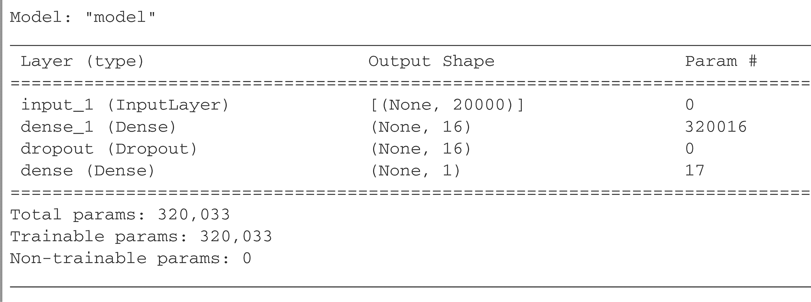

回调 <- list(

callback_model_checkpoint("binary_1gram.keras", save_best_only = TRUE)

)

model %>% 拟合(

dataset_cache(binary_1gram_train_ds),

验证数据 = dataset_cache(binary_1gram_val_ds),➊

epochs = 10,

回调 = callbacks

)

model <- load_model_tf("binary_1gram.keras")

cat(sprintf(

"测试准确率: %.3f\n", evaluate(model, binary_1gram_test_ds)["accuracy"]))

测试准确率: 0.887

➊ **我们在数据集上调用 dataset_cache() 来将它们缓存到内存中：这样，我们就只在第一个 epoch 进行预处理一次，并在后续的 epoch 中重新使用预处理的文本。这只适用于数据足够小以适应内存。**

这使我们达到了 88.7% 的测试准确率：不错！请注意，在本例中，因为数据集是一个平衡的两类分类数据集（正样本和负样本数量相同），如果不训练实际模型，我们所能达到的“简单基线”只能达到 50%。同时，在这个数据集上不利用外部数据可实现的最佳分数约为 95% 的测试准确率。

### 二元组使用二进制编码

当然，舍弃单词顺序非常简化，因为即使是原子概念也可以通过多个词表达：术语“美国”传达的概念与单独取词“states”和“united”的含义截然不同。因此，通常你会通过查看*N*元组而不是单词（最常见的是二元组）向你的词袋表示中重新注入局部顺序信息。

有了二元组，我们的句子变成了：

c("the", "the cat", "cat", "cat sat", "sat",

"坐在", "在", "在地上", "地上的", "垫子")

layer_text_vectorization() 层可以配置为返回任意*N-*元组：二元组、三元组等等。只需像以下清单中那样传递一个 ngrams = N 的参数。

****清单 11.7 配置 layer_text_vectorization() 返回二元组****

text_vectorization <

layer_text_vectorization(ngrams = 2,

max_tokens = 20000,

输出模式 = "multi_hot")

让我们测试一下当以这种二进制编码的二元组袋训练时模型的表现（清单 11.8）。

**清单 11.8 训练和测试二进制双字母模型**

适应(文本向量化, 仅文本训练数据集)

数据集向量化 <- function(数据集) {➊

数据集 %>%

数据集映射(~ 列表(文本向量化(.x), .y),

num_parallel_calls = 4)

}

binary_2gram_train_ds <- 训练数据集 %>% 数据集向量化()

binary_2gram_val_ds <- 验证数据集 %>% 数据集向量化()

binary_2gram_test_ds <- 测试数据集 %>% 数据集向量化()

model <- 获取模型()

model

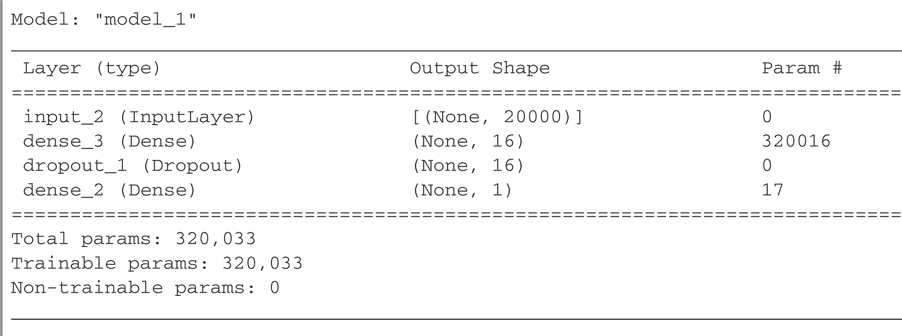

callbacks <- 列表(回调模型检查点("二元二元组.keras",

save_best_only = TRUE))

model %>% 拟合(

数据集缓存(二元二元组训练数据集),

validation_data = 数据集缓存(二元二元组验证数据集),

epochs = 10,

callbacks = 回调函数

)

model <- 加载模型 _tf("二元二元组.keras")

评估(模型, 二元二元组测试数据集)["准确率"] %>%

sprintf("测试准确率: %.3f\n", .) %>% cat()

测试准确率: 0.895

➊ **定义一个辅助函数，用于将 text_vectorization 层应用于文本 TF 数据集，因为我们将在本章中多次执行此操作（使用不同的 text_vectorization 层）。**

现在我们的测试准确率达到了 89.5%，这是一个明显的提升！原来局部顺序非常重要。

### 使用 TF-IDF 编码的二元组

您还可以通过计算每个单词或*N*-gram 出现的次数来为这个表示添加更多信息，也就是说，通过对文本中的单词进行直方图处理：

c("the" = 2, "the cat" = 1, "cat" = 1, "cat sat" = 1, "sat" = 1,

"坐在" = 1, "在" = 1, "在地毯上" = 1, "地毯上" = 1, "地毯" = 1)

如果您正在进行文本分类，知道一个单词在样本中出现的次数至关重要：任何足够长的电影评论都可能包含“terrible”这个词，无论情感如何，但是包含“terrible”一词多次的评论很可能是负面的。这里是如何使用 layer_text_ vectorization() 计算二元组出现次数的：

**清单 11.9 配置 layer_text_vectorization() 以返回令牌计数**

text_vectorization <

layer_text_vectorization(ngrams = 2,

max_tokens = 20000,

output_mode = "count")

当然，无论文本内容如何，某些词汇都会比其他词汇出现得更频繁。像“the”、“a”、“is”和“are”这样的词汇将始终主导您的词频直方图，淹没其他词汇，尽管它们在分类上几乎是无用的特征。我们该如何解决这个问题呢？

你已经猜到了：通过归一化。我们可以通过减去均值并除以方差（计算在整个训练数据集上）来简单地规范化词频。那是有道理的。除了大多数向量化的句子几乎完全由零组成（我们之前的示例特征有 12 个非零条目和 19,988 个零条目），这种性质称为“稀疏性”。这是一个很好的属性，因为它大大减少了计算负载并减少了过拟合的风险。如果我们从每个特征中减去平均值，我们将破坏稀疏性。因此，我们使用的任何规范化方案都应该是仅除法。那么，我们应该用什么作为分母呢？最佳做法是采用一种称为 *TF-IDF 规范化* 的东西 —— TF-IDF 代表“词频，逆文档频率”。

**理解 TF-IDF 规范化**

一个给定术语在文档中出现的次数越多，该术语对于理解文档内容的重要性就越大。同时，该术语在数据集中出现的频率也很重要：几乎在每个文档中出现的术语（如“the”或“a”）并不特别信息丰富，而在所有文本的一个小子集中出现的术语（如“Herzog”）非常具有特色和重要性。TF-IDF 是将这两个想法融合起来的一个指标。它通过采用“词频”，即术语在当前文档中出现的次数，除以“文档频率”的度量来加权给定术语，后者估计了术语在数据集中出现的频率。您可以如下计算它：

tf_idf <- function(term, document, dataset) {

term_freq <- sum(document == term)➊

doc_freqs <- sapply(dataset, function(doc) sum(doc == term))➋

doc_freq <- log(1 + sum(doc_freqs))

term_freq / doc_freq

}

➊ **计算文档中 'term' 出现的次数。**

➋ **计算 'term' 在整个数据集中出现的次数。**

TF-IDF 是如此常见，以至于它已经内置到 layer_text_vectorization() 中。你所需要做的就是将 output_mode 参数切换到 “tf_idf”。

**清单 11.10 配置 layer_text_vectorization 以返回 TF-IDF 输出**

text_vectorization <

layer_text_vectorization(ngrams = 2,

max_tokens = 20000,

output_mode = "tf_idf")

让我们用这个方案训练一个新模型。

**清单 11.11 训练和测试 TF-IDF 二元模型**

with(tf$device("CPU"), {➊

适应(text_vectorization, text_only_train_ds) ➋

})

tfidf_2gram_train_ds <- train_ds %>% 数据集向量化()

tfidf_2gram_val_ds <- val_ds %>% 数据集向量化()

tfidf_2gram_test_ds <- test_ds %>% 数据集向量化()

model <- 获取模型()

model

![图像

回调 <- list(callback_model_checkpoint("tfidf_2gram.keras",

save_best_only = TRUE))

model %>% 拟合(

dataset_cache(tfidf_2gram_train_ds),

验证数据 = dataset_cache(tfidf_2gram_val_ds),

epochs = 10,

回调 = 回调

)

model <- load_model_tf("tfidf_2gram.keras")

评估(model, tfidf_2gram_test_ds)["accuracy"] %>%

sprintf("Test acc: %.3f", .) %>% cat("\n")

Test acc: 0.896

➊ **我们将此操作固定在 CPU 上，因为它使用了 GPU 设备尚不支持的操作。**

➋ **adapt() 调用将学习 TF-IDF 权重以及词汇表。**

这给我们在 IMDB 分类任务上的测试准确率为 89.6%：在这种情况下似乎并不特别有帮助。然而，对于许多文本分类数据集，使用 TF-IDF 相对于纯二进制编码，会看到增加一个百分点是很典型的。

**导出一个处理原始字符串的模型**

在前面的例子中，我们在 TF Dataset 管道的一部分中进行了文本标准化、拆分和索引。但是，如果我们想要导出一个独立于此管道的单独模型，我们应该确保它包含自己的文本预处理（否则，你将不得不在生产环境中重新实现，这可能具有挑战性，或者可能导致训练数据和生产数据之间的细微差异）。幸运的是，这很容易。

只需创建一个新模型，该模型重用你的 text_vectorization 层，并将刚训练的模型添加到其中：

inputs <- layer_input(shape = c(1), dtype = "string") ➊

outputs <- inputs %>%

text_vectorization() %>%➋

model() ➌

inference_model <- keras_model(inputs, outputs)➍

➊ **一个输入样本将是一个字符串。**

➋ **应用文本预处理。**

➌ **应用先前训练过的模型。**

➍ **实例化端到端模型。**

结果生成的模型可以处理原始字符串的批次：

raw_text_data <- "那是一部很棒的电影，我喜欢它。" %>%

as_tensor(shape = c(-1, 1))➊

predictions <- inference_model(raw_text_data)

str(predictions)

<tf.Tensor: shape=(1, 1), dtype=float32, numpy=array([[0.93249124]],

 dtype=float32)>

cat(sprintf("%.2f percent positive\n",

as.numeric(predictions) * 100))

93.25 percent positive

➊ **该模型期望输入为样本批次，即一列矩阵。**

### 11.3.3 将单词作为序列进行处理：序列模型方法

这些最近的例子清楚地表明了单词顺序的重要性：基于顺序的特征的手动工程处理，例如二元组，可以带来很好的准确率提升。现在记住：深度学习的历史是从手动特征工程向模型自动从数据中学习其自己的特征的移动。如果，而不是手动制作基于顺序的特征，我们将模型暴露于原始单词序列，并让其自行找出这样的特征？这就是*序列模型*的含义。

要实现一个序列模型，你首先要将你的输入样本表示为整数索引序列（一个整数代表一个单词）。然后，你会将每个整数映射到一个向量以获得向量序列。最后，你将这些向量序列馈送到一堆层中，这些层可以对相邻向量的特征进行交叉相关，例如 1D 卷积网络、RNN 或 Transformer。

在 2016 年至 2017 年期间的一段时间里，双向 RNN（特别是双向 LSTM）被认为是序列建模的最先进技术。因为您已经熟悉了这种架构，所以我们将在我们的第一个序列模型示例中使用它。然而，现在几乎所有的序列建模都是用 Transformers 完成的，我们很快就会介绍。奇怪的是，一维卷积网络在自然语言处理中从未很受欢迎，尽管在我的经验中，一堆深度可分离的 1D 卷积往往可以以大大降低的计算成本达到与双向 LSTM 相媲美的性能。

### 第一个实际例子

让我们尝试在实践中使用第一个序列模型。首先，让我们准备返回整数序列的数据集。

**图 11.12 准备整数序列数据集**

max_length <— 600 ➊

max_tokens <— 20000

text_vectorization <- layer_text_vectorization(

max_tokens = max_tokens,

output_mode = "int",

output_sequence_length = max_length

)

adapt(text_vectorization, text_only_train_ds)

int_train_ds <- train_ds %>% dataset_vectorize()

int_val_ds <- val_ds %>% dataset_vectorize()

int_test_ds <- test_ds %>% dataset_vectorize()

➊ **为了保持可管理的输入大小，我们将在前 600 个单词之后截断输入。这是一个合理的选择，因为平均评论长度为 233 个单词，只有 5% 的评论超过 600 个单词。**

接下来，让我们构建一个模型。将整数序列转换为向量序列的最简单方法是对整数进行 one-hot 编码（每个维度代表词汇表中的一个可能的术语）。在这些 one-hot 向量之上，我们将添加一个简单的双向 LSTM。

**图 11.13 基于 one-hot 编码向量序列构建的序列模型**

inputs <- layer_input(shape(NULL), dtype = "int64")➊

embedded <- inputs %>%

tf$one_hot(depth = as.integer(max_tokens))➋

outputs <- embedded %>%

bidirectional(layer_lstm(units = 32)) %>%➌

layer_dropout(.5) %>%

layer_dense(1, activation = "sigmoid")➍

model <- keras_model(inputs, outputs)

model %>% compile(optimizer = "rmsprop",

loss = "binary_crossentropy",

metrics = "accuracy")

model

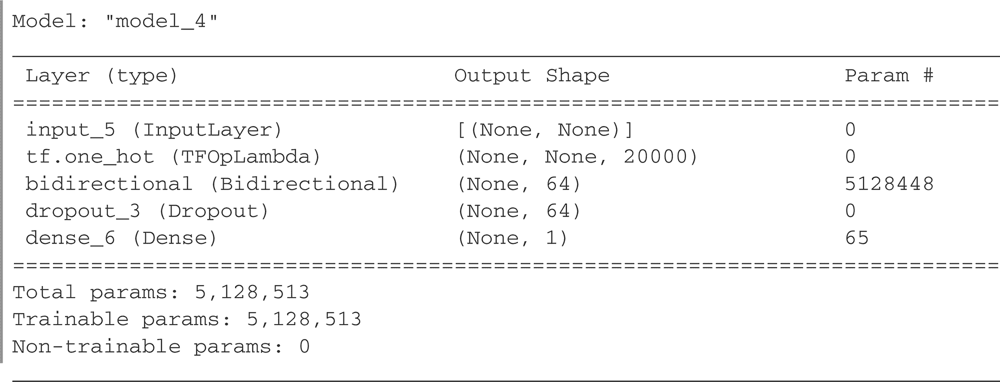

➊ **一个输入是整数序列。**

➋ **将整数编码为二进制的 20000 维向量。**

➌ **添加一个双向 LSTM。**

➍ **最后，添加一个分类层。**

现在，让我们训练我们的模型。

**图 11.14 训练一个基本的序列模型**

callbacks <- list(

callback_model_checkpoint("one_hot_bidir_lstm.keras",

save_best_only = TRUE))

首先观察到：这个模型训练非常缓慢，特别是与上一节的轻量级模型相比。这是因为我们的输入相当大：每个输入样本都被编码为大小为（600，20000）的矩阵（每个样本 600 个单词，20000 个可能的单词）。这对于单个电影评论来说是 1200 万个浮点数。我们的双向 LSTM 需要做很多工作。其次，模型只能达到 87%的测试准确率——它的表现远不如我们的（非常快速的）二元 unigram 模型。

显然，使用 one-hot 编码将单词转换为向量，这是我们可以做的最简单的事情，不是一个好主意。有一个更好的方法：*词嵌入*。

**减小批处理大小以避免内存错误**

根据您的机器和 GPU 的可用 RAM，您可能会遇到内存不足错误，尝试训练更大的双向模型。如果发生这种情况，请尝试使用较小的批处理大小进行训练。您可以将较小的 batch_size 参数传递给 text_dataset_from_directory(batch_size = )，或者您可以重新对现有的 TF Dataset 进行重新分批，如下所示：

int_train_ds_smaller <- int_train_ds %>%

dataset_unbatch() %>%

dataset_batch(16)

使用费曼技巧，你只需花上`20 min`就能深入理解知识点，而且记忆深刻，*难以遗忘*。

epochs = 10, callbacks = callbacks)

model <- load_model_tf("one_hot_bidir_lstm.keras")

sprintf("测试准确率：%.3f", evaluate(model, int_test_ds)["accuracy"])

[1] "测试准确率：0.873"

### 理解词嵌入

关键的是，当你通过 one-hot 编码对某物进行编码时，你正在做出一个特征工程的决定。你在你的模型中注入了一个关于特征空间结构的基本假设。这个假设是*你正在编码的不同标记彼此独立*：确实，one-hot 向量彼此正交。在单词的情况下，这个假设显然是错误的。单词形成了一个结构化的空间：它们彼此共享信息。单词“电影”和“影片”在大多数句子中是可以互换的，所以表示“电影”的向量不应该正交于表示“影片”的向量——它们应该是相同的向量，或者足够接近。

为了变得更加抽象，两个词向量之间的*几何关系*应该反映出这些词之间的*语义关系*。例如，在一个合理的词向量空间中，你期望同义词被嵌入到相似的词向量中，而且通常，你期望任意两个词向量之间的几何距离（如余弦距离或 L2 距离）与相关词之间的“语义距离”相关联。意思不同的词应该相距较远，而相关的词应该更接近。

*词嵌入*是单词的向量表示，它恰好实现了这一点：它们将人类语言映射到结构化几何空间。虽然通过一位有效编码获得的向量是二进制的、稀疏的（主要由零组成）和非常高维的（与词汇量中的单词数量相同的维度），但是词嵌入是低维的浮点向量（即稠密向量，与稀疏向量相对）；请参见图 11.2。当处理非常大的词汇表时，常见的词嵌入是 256 维、512 维或 1,024 维。另一方面，一位有效编码单词通常会导致 20,000 维或更高维的向量（在这种情况下，捕捉一个 20,000 令牌的词汇表）。因此，词嵌入将更多的信息压缩到更少的维度中。

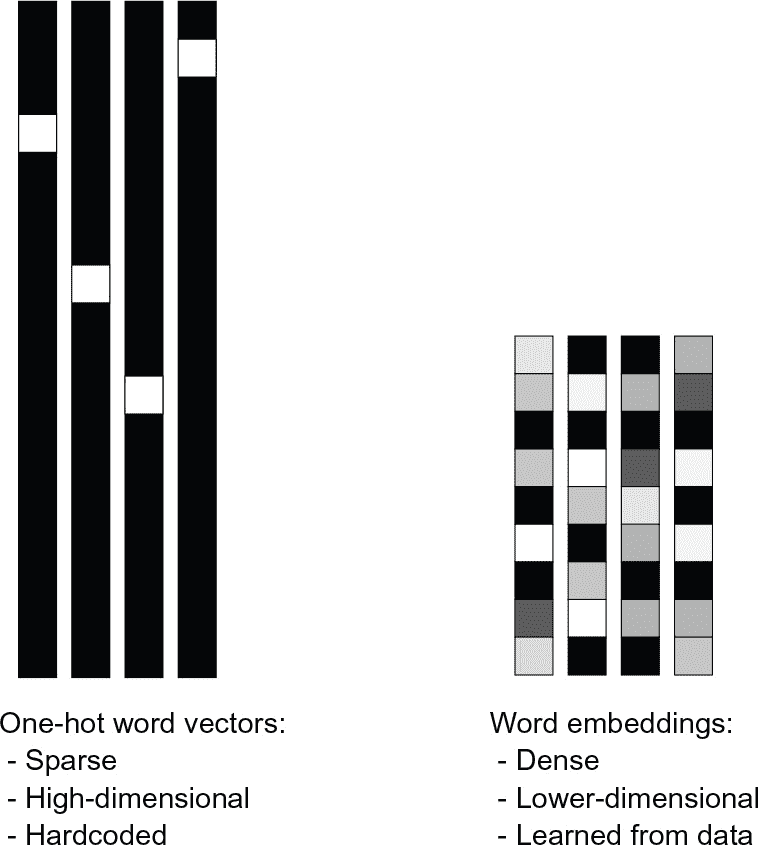

**图 11.2 通过一位有效编码或散列获取的单词表示是稀疏、高维和硬编码的。而单词嵌入是密集、相对低维并且从数据中学习到的。**

在是密集向量之外，词向量也是结构化表示，它们的结构是从数据中学习的。相似的单词嵌入紧密的位置，另外，嵌入空间中的特殊*方向*是有意义的。为了更清楚地了解这一点，让我们来看一个具体的例子。

在图 11.3 中，四个单词被嵌入在一个 2D 平面上：*猫，狗，狼*和*老虎*。在我们选择的向量表示中，一些语义关系可以被编码为几何变换。例如，相同的向量使我们从*猫*到*老虎*，从*狗*到*狼*：这个向量可以被解释为“从宠物到野生动物”的向量。类似地，另一个向量让我们从*狗*到*猫*，从*狼*到*老虎*，这可以被解释为“从犬科到猫科”的向量。

在真实世界的词嵌入空间中，常见的有意义的几何变换有“性别”向量和“复数”向量。例如，通过向向量“国王”添加“女性”向量，我们可以得到向量“皇后”。通过添加“复数”向量，我们可以得到“国王们”。词嵌入空间通常具有数千个这样的可解释和潜在有用的向量。

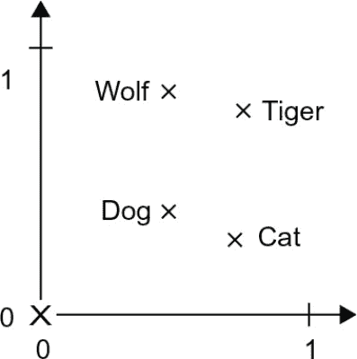

**图 11.3 一个词嵌入空间的示例**

让我们看看如何在实践中使用这样的嵌入空间。有两种方法可以获得词嵌入：

+   与您关心的主要任务（如文档分类或情感预测）一起学习单词嵌入。在这种设置中，您从随机单

+   将预先使用不同的机器学习任务计算得到的单词嵌入加载到您的模型中。这些被称为*预训练的词嵌入*。

让我们逐个审查这些方法。

### 使用嵌入层学习单词嵌入

是否存在一种理想的单词嵌入空间，能够完美地映射人类语言，并可用于任何自然语言处理任务？可能有，但我们尚未计算出这样的东西。此外，没有*人类语言*这样的东西——有许多不同的语言，它们并不是同构的，因为语言是特定文化和特定上下文的反映。但更实际的是，一个好的单词嵌入空间的特征取决于你的任务：用于英语电影评论情感分析模型的完美单词嵌入空间可能与用于英语法律文件分类模型的完美嵌入空间不同，因为某些语义关系的重要性因任务而异。

因此，通过每个新任务*学习*一个新的嵌入空间是合理的。幸运的是，反向传播使这变得容易，而 Keras 使其变得更容易。这是关于学习一层的权重：layer_embedding()。

**清单 11.15 实例化一个 layer_embedding**

embedding_layer <- layer_embedding(input_dim = max_tokens,

output_dim = 256)➊

➊layer_embedding() 至少需要两个参数：可能的标记数量和嵌入的维度（这里是 256）。

layer_embedding() 最好理解为一个将整数索引（代表特定单词）映射到密集向量的字典。它接受整数作为输入，查找这些整数在内部字典中的位置，并返回相关的向量。它实际上是一个字典查找（见图 11.4）。

**图 11.4 嵌入层**

嵌入层的输入是一个整数的秩为 2 的张量，形状为 (batch_size, sequence_length)，其中每个条目是一个整数序列。然后，该层返回一个形状为 (batch_size, sequence_length, 嵌入维度) 的 3D 浮点张量。

当实例化一个 layer_embedding() 时，它的权重（内部字典中的标记向量）最初是随机的，就像任何其他层一样。在训练期间，这些词向量会通过反向传播逐渐调整，将空间结构化为下游模型可以利用的东西。一旦完全训练完成，嵌入空间将展现出很多结构——一种针对你训练模型的特定问题的结构。

让我们构建一个包含 layer_embedding() 的模型，并在我们的任务上进行基准测试。

**清单 11.16 从头开始训练一个 layer_embedding 的模型**

inputs <- layer_input(shape(NA), dtype = "int64")

embedded <- inputs %>%

layer_embedding(input_dim = max_tokens, output_dim = 256)

outputs <- embedded %>%

bidirectional(layer_lstm(units = 32)) %>%

layer_dropout(0.5) %>%

layer_dense(1, activation = "sigmoid")

model <- keras_model(inputs, outputs)

model %>%

compile(optimizer = "rmsprop",

loss = "binary_crossentropy",

metrics = "accuracy")

model

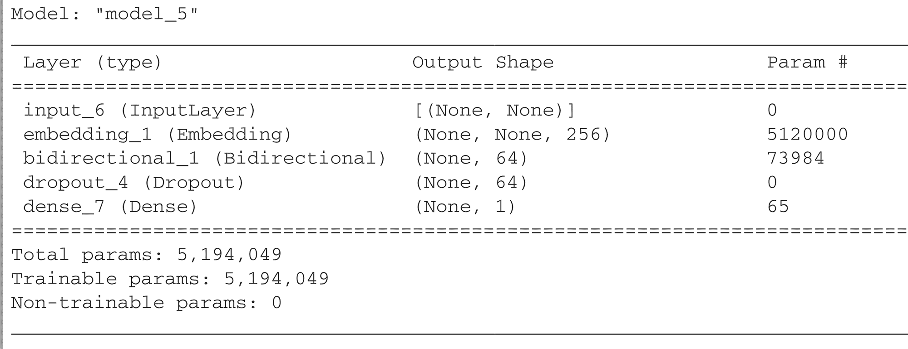

callbacks <- list(callback_model_checkpoint("embeddings_bidir_lstm.keras",

save_best_only = TRUE))

model %>%

fit(int_train_ds,

validation_data = int_val_ds,

epochs = 10,

callbacks = callbacks)

model <- load_model_tf("embeddings_bidir_lstm.keras")

evaluate(model, int_test_ds)["accuracy"] %>%

sprintf("测试准确度：%.3f\n", .) %>% cat()

测试准确度：0.842

它的训练速度比独热模型快得多（因为 LSTM 只需处理 256 维向量，而不是 20,000 维向量），其测试准确度可比拟（84%）。然而，我们离基本双字模型的结果还有一段距离。部分原因只是因为模型查看的数据稍微少一些：双字模型处理完整评论，而我们的序列模型在 600 个单词后截断序列。

### 理解填充和掩码

这里稍微影响模型性能的一件事情是，我们的输入序列中充满了零。这来自我们在 layer_text_vectorization() 中使用 output_sequence_length = max_ length 选项（max_length 等于 600）：长于 600 个标记的句子将被截断为 600 个标记的长度，并且短于 600 个标记的句子将在末尾填充零，以便它们可以与其他序列连接以形成连续批次。

我们使用了双向 RNN：两个 RNN 层并行运行，其中一个按照它们的自然顺序处理标记，另一个按照相同的标记逆序处理。以自然顺序查看标记的 RNN 将在最后的迭代中仅看到编码填充的向量 —— 如果原始句子很短，可能会连续数百次迭代。随着暴露于这些无意义的输入，RNN 内部状态中存储的信息将逐渐消失。

我们需要一种方式告诉 RNN 它应该跳过这些迭代。有一个 API 可以做到这一点：*掩码*。layer_embedding() 能够生成与其输入数据相对应的“掩码”。这个掩码是一个由 1 和 0（或 TRUE/FALSE 布尔值）组成的张量，形状为（batch_size，sequence_length），其中条目 mask[i, t] 表示样本 i 的时间步 t 是否应该跳过（如果 mask[i, t] 为 0 或 FALSE，则会跳过时间步，否则会处理）。

默认情况下，此选项未激活 —— 您可以通过将 mask_zero = TRUE 传递给您的 layer_embedding() 来打开它。您可以使用 compute_mask() 方法检索掩码：

embedding_layer <- layer_embedding(input_dim = 10, output_dim = 256,

mask_zero = TRUE)

some_input <- rbind(c(4, 3, 2, 1, 0, 0, 0),

c(5, 4, 3, 2, 1, 0, 0),

c(2, 1, 0, 0, 0, 0, 0))

mask <- embedding_layer$compute_mask(some_input)

mask

tf.Tensor(

[[ True  True  True  True False False False]

[ True  True  True  True  True False False]

[ True  True False False False False False]], shape=(3, 7), dtype=bool)

实际上，你几乎永远不需要手动管理遮蔽。相反，Keras 会自动将遮蔽传递给每个能够处理它的层（作为附加到它表示的序列的元数据）。这个遮蔽将被 RNN 层用于跳过遮蔽的步骤。如果你的模型返回了整个序列，遮蔽也将被损失函数用于跳过输出序列中的遮蔽步骤。让我们尝试重新训练我们的模型，并启用遮蔽。

**清单 11.17 使用启用了遮蔽的嵌入层**

inputs <- layer_input(c(NA), dtype = "int64")

embedded <- inputs %>%

layer_embedding(input_dim = max_tokens,

output_dim = 256,

mask_zero = TRUE)

outputs <- embedded %>%

bidirectional(layer_lstm(units = 32)) %>%

layer_dropout(0.5) %>%

layer_dense(1, activation = "sigmoid")

model <- keras_model(inputs, outputs)

model %>% compile(optimizer = "rmsprop",

loss = "binary_crossentropy",

metrics = "accuracy")

模型

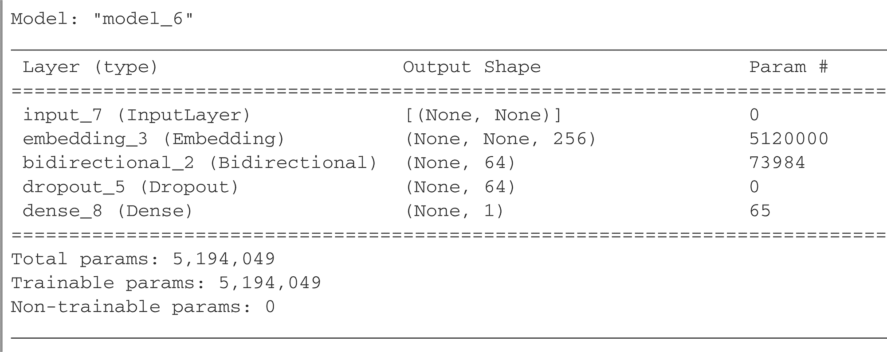

callbacks <- list(

callback_model_checkpoint("embeddings_bidir_lstm_with_masking.keras",

save_best_only = TRUE)

)

model %>%fit(

int_train_ds,

validation_data = int_val_ds,

epochs = 10,

callbacks = callbacks

)

model <- load_model_tf("embeddings_bidir_lstm_with_masking.keras")

cat(sprintf("测试准确率: %.3f\n",

evaluate(model, int_test_ds)["accuracy"]))

测试准确率: 0.880

这次我们达到了 88%的测试准确率——虽然只是一个小幅但明显的提高。

### 使用预训练的词嵌入

有时候你的训练数据非常少，以至于你无法单独使用数据来学习适合特定任务的词汇嵌入。在这种情况下，你可以从预先计算的嵌入空间中加载嵌入向量，这个空间是高度结构化的并具有有用的属性——它捕捉到了语言结构的通用方面。在自然语言处理中使用预训练的词嵌入的理由与在图像分类中使用预训练的卷积网络的理由基本相同：你没有足够的数据可用来自己学习真正强大的特征，但你期望你需要的特征是相当通用的——即，常见的视觉特征或语义特征。在这种情况下，重用在不同问题上学习到的特征是有意义的。

这种单词嵌入通常是使用单词共现统计（关于单词在句子或文档中共现的观察）计算的，使用各种技术，有些涉及神经网络，有些不涉及。将单词计算在一个密集的、低维的嵌入空间中，以无监督的方式进行，最早是由 Bengio 等人在 2000 年代初探索的¹，但是它在研究和工业应用中开始蓬勃发展，仅在发布了最著名和最成功的单词嵌入方案之一后才开始: Word2Vec 算法（[`code.google.com/archive/p/word2vec`](https://code.google.com/archive/p/word2vec)），2013 年由 Google 的 Tomas Mikolov 开发。Word2Vec 维度捕获特定的语义属性，如性别。

你可以下载各种预先计算的单词嵌入数据库，并在 Keras 中使用它们作为一个层。其中之一是 Word2Vec。另一个流行的是全球词向量表示（GloVe，[`nlp.stanford.edu/projects/glove`](https://nlp.stanford.edu/projects/glove)），它是由斯坦福大学的研究人员在 2014 年开发的。这种嵌入技术是基于分解一个单词共现统计矩阵。它的开发者已经提供了数百万个英文标记的预计算嵌入，这些标记是从维基百科和公共爬网数据中获得的。

让我们看看如何开始在 Keras 模型中使用 GloVe 嵌入。相同的方法对 Word2Vec 嵌入或任何其他单词嵌入数据库都有效。我们将从下载 GloVe 文件并解析它们开始。然后我们将把单词向量加载到一个 Keras `layer_embedding()`层中，我们将用它来构建一个新模型。

首先，让我们下载在 2014 年英文维基百科数据集上预先计算的 GloVe 单词嵌入。这是一个 822 MB 的 zip 文件，包含了 400,000 个单词（或非单词标记）的 100 维嵌入向量：

使用`download.file("http://nlp.stanford.edu/data/glove.6B.zip",`下载文件。

目标文件 = "glove.6B.zip")

zip::unzip("glove.6B.zip")

让我们解析解压后的文件（一个.txt 文件）以建立一个将单词（作为字符串）映射到它们的向量表示的索引。因为文件结构本质上是一个具有行名的数值矩阵，所以我们将在 R 中创建这样一个结构。

**清单 11.18 解析 GloVe 单词嵌入文件**

文件路径`path_to_glove_file` <- "glove.6B.100d.txt"

嵌入维度 <- 100

df <- readr::read_table(

文件路径`path_to_glove_file`,

`col_names = FALSE`,➊

列类型 = paste0("c", strrep("n", 100))➋

)

嵌入索引 <- as.matrix(df[, -1])➌

rownames(嵌入索引) <- df[[1]]

colnames(嵌入索引) <- NULL ➍

rm(df)➎

➊ **`read_table()`返回一个数据框。`col_names = FALSE`告诉`read_table()`文本文件没有标题行，并且数据本身从第一行开始。**

➋ 传递 col_types 并不是必需的，但是是一种最佳实践和对意外情况的良好保护（例如，如果你正在读取一个损坏的文件，或者错误的文件！）。在这里，我们告诉 read_table()第一列是'character'类型，然后下一个 100 列是'numeric'类型。

➌ 第一列是单词，剩余的 100 列是数值嵌入。

➍ 丢弃 read_table()自动创建的列名（R 数据框必须有列名）。

➎ 清除内存中的临时数据框。

这是 embedding_matrix 的样子：

str(embeddings_index)

num [1:400000, 1:100] -0.0382 -0.1077 -0.3398 -0.1529 -0.1897 …

- attr(*, "dimnames")=List of 2

..$ : chr [1:400000] "the" "," "." "of" …

..$ : NULL

接下来，让我们构建一个嵌入矩阵，你可以加载到一个 layer_embedding()中，它必须是一个形状为(max_words, embedding_dim)的矩阵，其中每个条目 i 包含索引为 i 的单词的 embedding_dim 维向量（在分词期间构建的参考词索引中）。

**列表 11.19 准备 GloVe 单词嵌入矩阵**

vocabulary <- text_vectorization %>% get_vocabulary() ➊

str(vocabulary)

chr [1:20000] "" "[UNK]" "the" "a" "and" "of" "to" "is" "in" "it" "i" …

tokens <- head(vocabulary[-1], max_tokens)➋

i <- match(vocabulary, rownames(embeddings_index),➌

nomatch = 0)

embedding_matrix <- array(0, dim = c(max_tokens, embedding_dim))➍

embedding_matrix[i != 0, ] <- embeddings_index[i, ]➎➏

str(embedding_matrix)

num [1:20000, 1:100] 0 0 -0.0382 -0.2709 -0.072 …

➊ 检索我们之前 text_vectorization 层索引的词汇表。

➋ [-1]是为了移除第一个位置上的掩码标记""。head(, max_tokens)仅是一个健全性检查 - 我们之前将相同的 max_tokens 传递给了 text_vectorization。

➌ i 是与词汇表中每个对应单词匹配的 embeddings_index 中的行号的整数向量，如果没有匹配的单词，则为 0。

➍ 准备一个全零矩阵，我们将用 GloVe 向量填充。

➎ 用相应的词向量填充矩阵中的条目。嵌入矩阵的行号对应于词汇表中单词的索引位置。在嵌入索引中找不到的单词将全部为零。

➏ R 数组中传递给[的 0 将被忽略。例如：（1:10）[c(1,0,2,0,3)]返回 c(1, 2, 3)。

最后，我们使用 initializer_constant()将预训练的嵌入加载到 layer_embedding()中。为了在训练过程中不破坏预训练的表示，我们通过 trainable = FALSE 来冻结该层：

embedding_layer <- layer_embedding(

input_dim = max_tokens，

output_dim = embedding_dim，

embeddings_initializer = initializer_constant(embedding_matrix)，

trainable = FALSE，

mask_zero = TRUE

)

现在我们已经准备好训练一个新模型 - 与我们之前的模型相同，但利用了 100 维的预训练 GloVe 嵌入，而不是 128 维的学习嵌入。

**列表 11.20 使用预训练嵌入层的模型**

输入 <- layer_input(shape(NA), dtype = "int64")

嵌入 <- embedding_layer(inputs)

输出 <- 嵌入层 %>%

bidirectional(layer_lstm(units = 32)) %>%

layer_dropout(0.5) %>%

layer_dense(1, 激活函数 = "sigmoid")

模型 <- keras_model(inputs, outputs)

模型 %>% compile(optimizer = "rmsprop",

损失函数 = "binary_crossentropy",

指标 = "准确率")

模型

 

回调函数列表 <- list(

callback_model_checkpoint("glove_embeddings_sequence_model.keras",

save_best_only = TRUE)

)

模型 %>%

fit(int_train_ds, validation_data = int_val_ds,

epochs = 10, callbacks = callbacks)

模型 <- load_model_tf("glove_embeddings_sequence_model.keras")

cat(sprintf(

"测试准确率：%.3f\n", evaluate(model, int_test_ds)["accuracy"]))

测试准确率：0.877

在这个特定的任务中，你会发现预训练的嵌入并不是很有用，因为数据集包含足够的样本，可以从头开始学习一个足够专业的嵌入空间。然而，当你处理较小的数据集时，利用预训练的嵌入可能会非常有帮助。

## 11.4 transformers 架构

从 2017 年开始，一种新的模型架构开始在大多数自然语言处理任务中取代循环神经网络：transformers。transformers 是由 Vaswani 等人在开创性论文“Attention Is All You Need”中引入的。论文的要点就在标题中：事实证明，一个简单的叫做“神经注意力”的机制可以用来构建强大的序列模型，而不需要循环层或卷积层。

这一发现引发了自然语言处理领域乃至更广泛领域的一场革命。神经注意力已经迅速成为深度学习中最具影响力的思想之一。在本节中，你将深入了解它是如何工作以及为什么它对于序列数据如此有效。然后，我们将利用自注意力来创建一个 transformers 编码器，这是 transformers 架构的基本组件之一，并将其应用于 IMDB 电影评论分类任务。

### 11.4.1 理解自注意力

当你阅读这本书时，你可能会快速浏览某些部分，而对其他部分进行仔细阅读，这取决于你的目标或兴趣是什么。如果你的模型也是这样做呢？这是一个简单但强大的想法：模型看到的所有输入信息对于手头的任务来说并不都是同等重要的，所以模型应该“更加关注”某些特征，而“更少关注”其他特征。这听起来熟悉吗？在这本书中你已经两次遇到了类似的概念：

+   在卷积神经网络中的最大池化操作会查看空间区域内的一组特征，并选择保留其中的一个特征。这是一种“全有或全无”的注意形式：保留最重要的特征，丢弃其余的。

+   TF-IDF 归一化根据不同单词可能携带的信息量为单词分配重要性分数。重要的单词得到增强，而不相关的单词被淡化。这是一种持续的注意形式。

你可以想象许多不同形式的注意力，但它们都是从计算一组特征的重要性分数开始的，对于更相关的特征得分较高，对于不太相关的特征得分较低（参见图 11.5）。如何计算这些分数，以及如何处理它们，将根据不同方法而异。

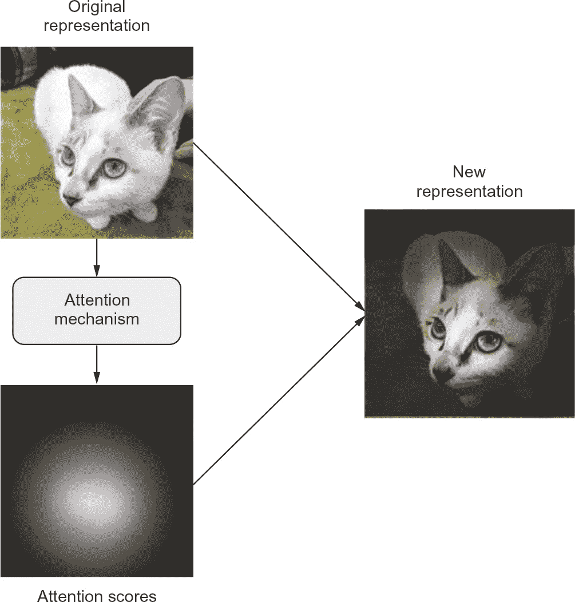

**图 11.5 深度学习中“注意力”的一般概念：输入特征被赋予“注意力分数”，这些分数可以用来指导输入的下一个表示。**

关键的是，这种注意机制不仅可以用于突出或消除某些特征，还可以用于使特征*具有上下文意识*。你刚刚了解了单词嵌入：捕捉不同单词之间“形状”的语义关系的向量空间。在嵌入空间中，一个单词有一个固定的位置——与空间中的每个其他单词的一组固定关系。但这并不完全符合语言的工作方式：单词的含义通常是上下文特定的。当你标记日期时，你说的“日期”和你约会时的“日期”不同，也不是你在市场上买到的那种日期。当你说“我很快就会见到你”时，单词“见”在“我会把这个项目进行到底”或“我明白你的意思”中的含义略有不同。当然，“他”、“它”、“你”等代词的含义完全是句子特定的，甚至可以在一个句子中多次改变。

显然，一个智能的嵌入空间会根据周围的其他单词为一个单词提供不同的向量表示。这就是*自注意力*的作用所在。自注意力的目的是通过使用序列中相关单词的表示来调节一个标记的表示。这产生了具有上下文意识的标记表示。考虑一个例句：“火车准时离开了车站。”现在，考虑句子中的一个词：车站。我们在谈论什么样的车站？可能是广播电台吗？也许是国际空间站？让我们通过自注意力算法来算出（参见图 11.6）。

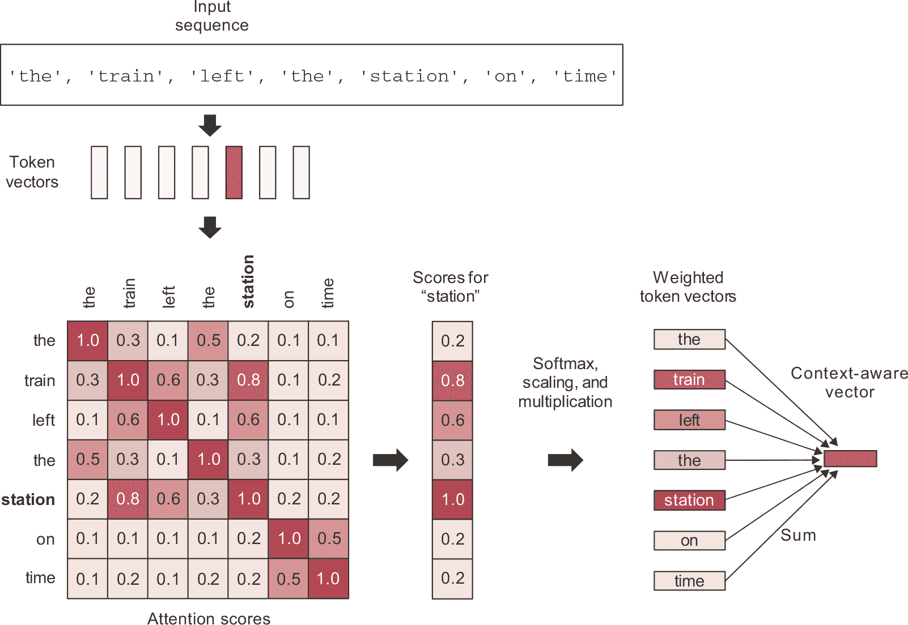

**图 11.6 自注意力：计算“站”与序列中每个其他单词之间的注意力分数，然后用它们加权一组单词向量，这成为新的“站”向量。**

第一步是计算“station”向量与句子中每个其他单词之间的相关性分数。这些是我们的“注意力分数”。我们简单地使用两个单词向量之间的点积作为衡量它们关系强度的指标。这是一种非常高效的计算距离函数，而且在 Transformers 之前它已经是将两个词嵌入彼此相关联的标准方式。实际上，这些分数还将通过一个缩放函数和一个 softmax，但现在，这只是一个实现细节。

第二步是计算句子中所有单词向量的加权和，权重由我们的相关性分数决定。与“station”密切相关的单词将更多地 contribute to the sum（包括单词“station”本身），而不相关的单词将几乎不贡献任何内容。得到的向量是我们对“station”的新表示：一种包含周围上下文的表示。特别是，它包括“train”向量的一部分，澄清了它实际上是“火车站”。

对于句子中的每个单词，您需要重复此过程，生成一个编码句子的新向量序列。让我们用类似 R 的伪代码来看一下：

self_attention <- function(input_sequence) {

c(sequence_len, embedding_size) %<-% dim(input_sequence)

output <- array(0, dim(input_sequence))

for (i in 1:sequence_len) {➊

pivot_vector <- input_sequence[i, ]

scores <- sapply(1:sequence_len, function(j) ➋

pivot_vector %*% input_sequence[j, ])➌

scores <- softmax(scores / sqrt(embedding_size))➍

broadcast_scores <

as.matrix(scores)[, rep(1, embedding_size)]➎

new_pivot_representation <

colSums(input_sequence * broadcast_scores)➏

output[i, ] <- new_pivot_representation

}

输出

}

softmax <- function(x) {

e <- exp(x - max(x))

e / sum(e)

}

➊ **遍历输入序列中的每个标记。**

➋ **计算标记与每个其他标记之间的点积（注意力分数）。**

➌ **%*% 用于两个 1D 向量返回一个标量，即点积。scores 的形状为 (sequence_len)。**

➍ **通过一个标准化因子进行缩放，并应用 softmax。**

➎ **将分数向量（形状为 (sequence_len)）广播成一个形状为 (sequence_len, embedding_size) 的矩阵，即 input_sequence 的形状。**

➏ **将得分调整后的输入序列求和以生成一个新的嵌入向量。**

当然，在实践中，您会使用矢量化实现。Keras 有一个内置层来处理它：layer_multi_head_attention()。这是您如何使用它的方法：

num_heads <- 4

embed_dim <- 256

mha_layer <- layer_multi_head_attention(num_heads = num_heads,

key_dim = embed_dim)

输出 <- mha_layer(输入, 输入, 输入)➊

➊ **输入的形状为 (batch_size, sequence_length, embed_dim)。**

读到这里，您可能会想：

+   为什么我们要将输入传递给该层*三*次？这似乎是多余的。

+   这些“多个头”是什么？听起来很吓人 —— 如果您把它们剪掉，它们也会再长出来吗？

这两个问题都有简单的答案。让我们来看看。

### 泛化的自注意力：查询-键-值模型

到目前为止，我们只考虑了一个输入序列。然而，Transformer 架构最初是为机器翻译开发的，在那里你必须处理两个输入序列：你当前正在翻译的源序列（如“今天天气如何？”），以及你将其转换为的目标序列（如“¿Qué tiempo hace hoy?”）。Transformer 是一个*序列到序列*模型：它被设计用来将一个序列转换为另一个序列。你将在本章后面深入学习有关序列到序列模型的内容。

现在让我们退一步。就像我们介绍的那样，自注意力机制执行以下操作，概括地说：

这意味着“对于输入（A）中的每个标记，计算标记与输入（B）中的每个标记的关联程度，并使用这些分数对输入（C）中的标记进行加权求和。”关键是，没有什么需要 A、B 和 C 引用相同的输入序列。在一般情况下，你可以用三个不同的序列来完成这个操作。我们称它们为“查询”，“键”和“值”。操作变成了“对于查询中的每个元素，计算该元素与每个键的关联程度，并使用这些分数对值进行加权求和”：

输出 <- sum( **值** * 两两得分（ **查询**， **键** ）)

这个术语来自搜索引擎和推荐系统（参见图 11.7）。想象一下，你正在输入一个查询，以从你的收藏中检索一张照片，“海滩上的狗”。在内部，数据库中的每张图片都由一组关键词描述——“猫”，“狗”，“派对”等等。我们将这些称为“键”。搜索引擎将首先将您的查询与数据库中的键进行比较。“狗”产生 1 个匹配，“猫”产生 0 个匹配。然后它将根据匹配的强度——相关性对这些键进行排名，并以相关性顺序返回与前*N*个匹配关联的图片。

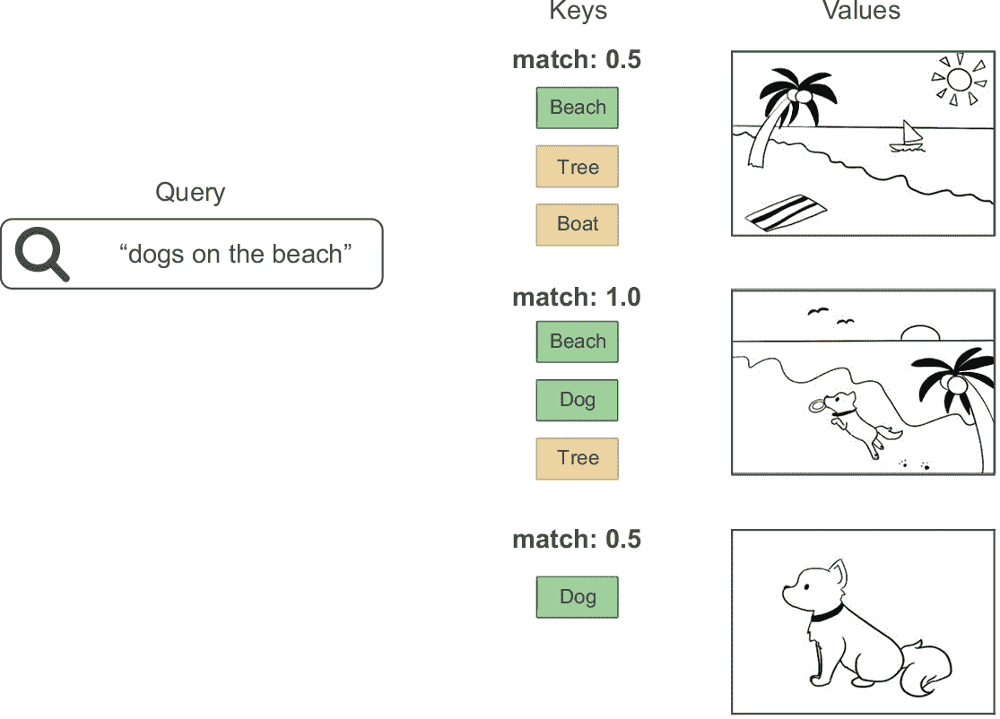

**图 11.7 从数据库检索图像：将“查询”与一组“键”进行比较，并使用匹配得分对“值”（图像）进行排名。**

在概念上，这就是 Transformer 风格的注意力在做的事情。你有一个描述你正在寻找的东西的参考序列：查询。你有一个你想从中提取信息的知识体系：值。每个值被分配一个键，描述了值以一种可以与查询轻松比较的格式。你只需将查询与键匹配即可。然后返回值的加权总和。

在实践中，键和值通常是相同的序列。例如，在机器翻译中，查询将是目标序列，而源序列将扮演键和值的角色：对于目标的每个元素（比如“tiempo”），你希望回到源头（“今天天气如何？”）并识别与之相关的不同部分（“tiempo”和“weather”应该有很强的匹配）。自然地，如果你只是进行序列分类，那么查询、键和值都是相同的：你正在将一个序列与自身进行比较，以丰富每个标记的上下文。

这解释了为什么我们需要将输入传递三次到我们的 layer_multi_ head_attention()层。但为什么要“多头”注意力呢？

### 11.4.2 多头注意力

“多头注意力”是自注意力机制的一项额外调整，由“Attention Is All You Need”引入。 “多头”这个名字指的是自注意力层的输出空间被分解为一组独立的子空间，分别学习：初始查询、键和值通过三组独立的密集投影发送，生成三个单独的向量。每个向量通过神经注意力进行处理，三个输出被串联回一个单一的输出序列。这样的子空间被称为“头”。全貌如 图 11.8 所示。

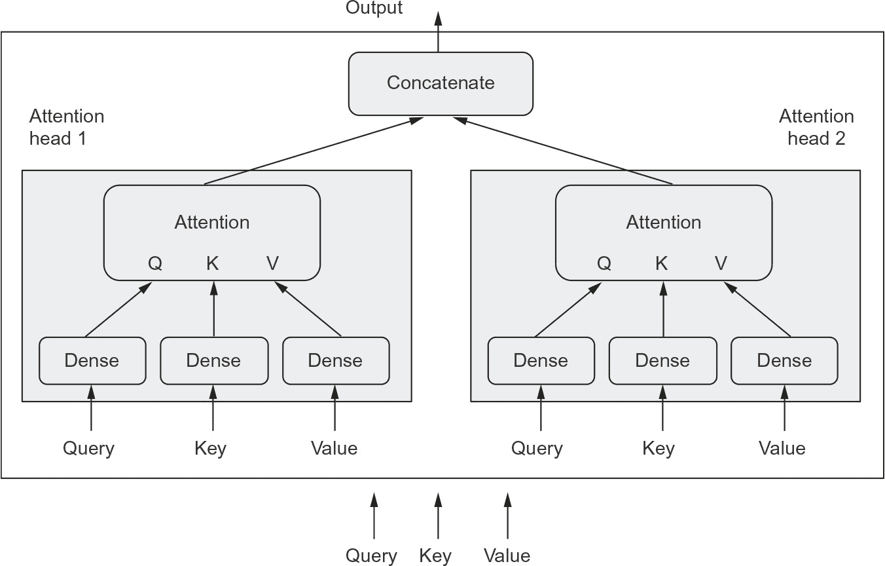

**图 11.8 多头注意力图层**

通过可学习的密集投影的存在，该层实际上可以学到一些东西，而不是成为一个纯粹的状态转换，需要额外的层在其之前或之后才能变得有用。此外，拥有独立的头部可以帮助该层学习每个标记的不同特征组，其中一个组内的特征彼此相关，但与另一个组内的特征大部分是独立的。

这与深度可分离卷积的工作原理相似：在深度可分离卷积中，卷积的输出空间被分解为许多独立的子空间（每个输入通道一对一），它们是独立学习的。《Attention Is All You Need》一文是在已经表明将特征空间分解为独立子空间提供了计算机视觉模型极大收益的时候编写的，无论是深度可分离卷积的情况还是与之密切相关的一种方法，即*分组卷积*。多头注意力只是将相同的想法应用到自注意力中。

### 11.4.3 Transformer 编码器

如果添加额外的密集投影如此有用，为什么我们不将其应用到注意力机制的输出上呢？实际上，这是一个绝佳的主意—让我们这样做。我们的模型开始做很多事情，所以我们可能想要添加残差连接，以确保我们不会在途中破坏任何有价值的信息；你在第九章中学到的，对于任何足够深的架构来说，这是非常必要的。还有一件事情是你在第九章中学到的：归一化层应该有助于梯度在反向传播期间更好地流动。让我们也把这些添加进来。

我大致想象当时 transformers 架构的发明者们心中展开的思维过程。将输出因子化为多个独立的空间，添加残差连接，添加归一化层—所有这些都是一种明智之举，可以在任何复杂模型中加以利用的标准架构模式。这些花哨且实用的部件汇聚在一起形成 transformers 编码器—构成 transformers 架构的两个关键部分之一，请见图 11.9。

原始的 transformers 架构由两部分组成：一个*transformers 编码��*用于处理源序列，一个*transformers 解码器*利用源序列生成翻译版本。你马上就会了解解码器部分。

至关重要的是，编码器部分可以用于文本分类。这是一个非常通用的模块，接受一个序列并学习将其转化为更有用的表示。让我们实现一个 transformers 编码器，并在电影评论情感分类任务上进行尝试。

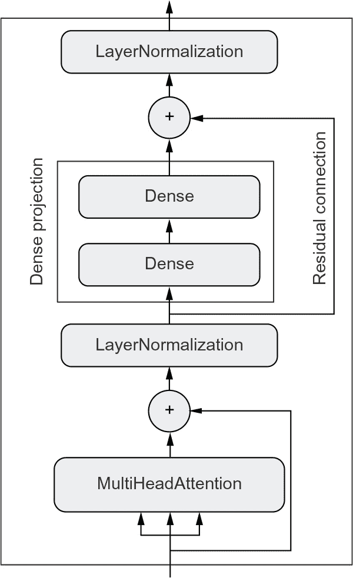

**图 11.9 transformers 编码器通过将一个`layer_multi_head_attention()`连接到一个密集投影，并添加归一化以及残差连接。**

**清单 11.21 作为子类 Layer 实现的 transformers 编码器**

layer_transformer_encoder <- new_layer_class(

类名 = "TransformerEncoder",

initialize = function(embed_dim, dense_dim, num_heads, …) {

super$initialize(…)

self$embed_dim <- embed_dim ➊

self$dense_dim <- dense_dim ➋

self$num_heads <- num_heads ➌

self$attention <

layer_multi_head_attention(num_heads = num_heads,

key_dim = embed_dim)

self$dense_proj <- keras_model_sequential() %>%

layer_dense(dense_dim, activation = "relu") %>%

layer_dense(embed_dim)

self$layernorm_1 <- layer_layer_normalization()

self$layernorm_2 <- layer_layer_normalization()

},

call = function(inputs, mask = NULL) {➍

if (!is.null(mask))➎

mask <- mask[, tf$newaxis, ]➎

输入 %>%

{ self$attention(., ., attention_mask = mask) + . } %>% ➏

self$layernorm_1() %>%

{ self$dense_proj(.) + . } %>% ➐

self$layernorm_2()

},

get_config = function() { ➑

config <- super$get_config()

for(name in c("embed_dim", "num_heads", "dense_dim"))

config[[name]] <- self[[name]]

config

}

)

➊ **输入令牌向量的大小**

➋ **内部密集层的大小**

➌ **注意力头的数量**

➍ **计算发生在 call()中** 

➎ **由嵌入层生成的遮罩将是 2D 的，但注意力层期望它是 3D 或 4D 的，因此我们扩展其秩。**

➏ **在注意力层的输出中添加残差连接。**

➐ **在 dense_proj() 层的输出中添加残差连接。**

➑ **实现序列化，以便我们可以保存模型。**

**%>% 和 { }**

在上面的示例中，我们使用 %>% 将其传递到用 { } 包装的表达式中。这是 %> 的高级功能，它允许您将管道传递到复杂或复合表达式中。%>% 将在我们使用 . 符号请求的每个位置放置管道参数。例如：

x %>% { fn(., .) + . }

等同于：

fn(x, x) + x

如果我们编写 layer_transformer_encoder() 的 call() 方法而不使用 %>%，它将如下所示：

call = function(inputs, mask = NULL) {

如果 (!is.null(mask))

mask <- mask[, tf$newaxis, ]

attention_output <- self$attention(inputs, inputs,

attention_mask = mask)

proj_input <- self$layernorm_1(inputs + attention_output)

proj_output <- self$dense_proj(proj_input)

self$layernorm_2(proj_input + proj_output)

}

**保存自定义层**

当您编写自定义层时，请确保实现 get_config() 方法：这使得可以从其配置重新实例化该层，在模型保存和加载过程中非常有用。该方法应返回一个命名的 R 列表，其中包含用于创建层的构造函数参数的值。

所有 Keras 层都可以如下序列化和反序列化：

config <- layer$get_config()

new_layer <- do.call(layer_<type>, config)

其中 layer_<type> 是原始层构造函数。例如：

layer <- layer_dense(units = 10)

config <- layer$get_config() ➊

new_layer <- do.call(layer_dense, config)➋

➊ **config 是一个常规的命名 R 列表。您可以将其安全地保存到磁盘上作为 rds，然后在新的 R 会话中加载它。**

➋ **配置不包含权重值，因此层中的所有权重都将从头开始初始化。**

您还可以通过特殊符号 __class__ 直接从任何现有层访问未包装的原始层构造函数（尽管您很少需要这样做）：

layer$`__class__`

<class ‘keras.layers.core.dense.Dense’>

new_layer <- layer$`__class__`$from_config(config)

在自定义层类中定义 get_config() 方法会启用相同的工作流程。例如：

layer <- layer_transformer_encoder(embed_dim = 256, dense_dim = 32,

num_heads = 2)

config <- layer$get_config()

new_layer <- do.call(layer_transformer_encoder, config)

# -- 或 --

new_layer <- layer$`__class__`$from_config(config)

当保存包含自定义层的模型时，保存的文件将包含这些配置。在从文件加载模型时，您应该向加载过程提供自定义层类，以便它可以理解配置对象：

model <- save_model_tf(model, filename)

model <- load_model_tf(filename,

custom_objects = list(layer_transformer_encoder))

请注意，如果 custom_objects 列表中提供的列表具有名称，则名称将与构建自定义对象时提供的 classname 参数进行匹配：

model <- load_model_tf(

filename,

custom_objects = list(TransformerEncoder = layer_transformer_encoder))

您会注意到，我们在这里使用的归一化层不是像之前在图像模型中使用的 layer_batch_normalization() 那样的层。那是因为 layer_batch_normalization() 不适用于序列数据。相反，我们使用 layer_layer_normalization()，它将每个序列与批次中的其他序列独立地进行归一化。在 R 的伪代码中就像这样：

layer_normalization <- function(batch_of_sequences) {

c(batch_size, sequence_length, embedding_dim) %<-%

dim(batch_of_sequences)➊

means <- variances <-

array(0, dim = dim(batch_of_sequences))

for (b in seq(batch_size))

for (s in seq(sequence_length)) {

embedding <- batch_of_sequences[b, s, ]➋

means[b, s, ] <- mean(embedding)

variances[b, s, ] <- var(embedding)

}

(batch_of_sequences - means) / variances

}

➊ **输入形状：(batch_size, sequence_length, embedding_dim)**

➋ **要计算均值和方差，我们仅在最后一个轴（轴 -1，即嵌入轴）上汇总数据。**

与 layer_batch_normalization()（在训练期间）进行比较：

batch_normalization <- function(batch_of_images) {

c(batch_size, height, width, channels) %<-%

dim(batch_of_images) ➊

means <- variances <-

array(0, dim = dim(batch_of_images))

for (ch in seq(channels)) {

channel <- batch_of_images[, , , ch]➋

means[, , , ch] <- mean(channel)

variances[, , , ch] <- var(channel)

}

(batch_of_images - means) / variances

}

➊ **输入形状：(batch_size, height, width, channels)**

➋ **在批次轴（第一个轴）上汇总数据，这会在批次中的样本之间创建交互。**

尽管 batch_normalization() 从许多样本中收集信息以获得特征均值和方差的准确统计数据，但 layer_normalization() 在每个序列内部汇集数据，这对于序列数据更为合适。

现在我们已经实现了 TransformerEncoder，我们可以使用它来组装一个类似于您之前看到的基于 LSTM 的文本分类模型。

**图 11.22 使用 Transformer 编码器进行文本分类**

vocab_size <- 20000

embed_dim <- 256

num_heads <- 2

dense_dim <- 32

inputs <- layer_input(shape(NA), dtype = "int64")

outputs <- inputs %>%

layer_embedding(vocab_size, embed_dim) %>%

layer_transformer_encoder(embed_dim, dense_dim, num_heads) %>%

layer_global_average_pooling_1d() %>%➊

layer_dropout(0.5) %>%

layer_dense(1, activation = "sigmoid")

model <- keras_model(inputs, outputs)

model %>% compile(optimizer = "rmsprop",

loss = "binary_crossentropy",

metrics = "accuracy")

model

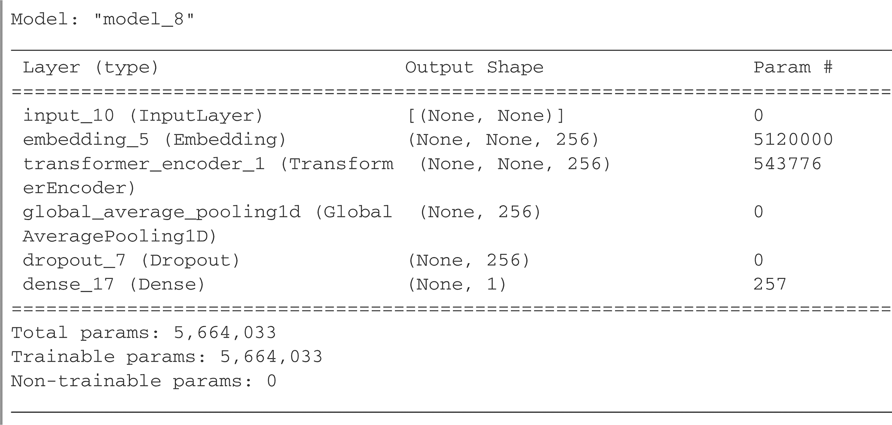

➊ **由于 TransformerEncoder 返回完整序列，因此我们需要通过全局汇集层将每个序列减少为单个向量进行分类。**

让我们进行训练。它达到了 88.5% 的测试准确率。

**列表 11.23 训练和评估基于 Transformer 编码器的模型**

回调函数 = 列表（callback_model_checkpoint("transformer_encoder.keras",

save_best_only = TRUE))

model %>% fit(

int_train_ds,

验证数据 = int_val_ds,

epochs = 20,

回调函数 = 回调函数

)

model <- load_model_tf(

"transformer_encoder.keras",

custom_objects = layer_transformer_encoder)➊

sprintf("测试准确率：%.3f", evaluate(model, int_test_ds)["accuracy"])

[1] "测试准确率：0.885"

➊ **为模型加载过程提供自定义 TransformerEncoder 类。**

此时，您应该开始感到有点不安。这里有点不对劲。你能说出是什么吗？

这一部分表面上是关于“序列模型”的。我首先强调了词序的重要性。我说 Transformer 是一种序列处理架构，最初是为机器翻译而开发的。然而……你刚刚看到的 Transformer 编码器根本不是序列模型。你注意到了吗？它由处理序列令牌的密集层和查看令牌 *作为集合* 的注意层组成。你可以改变序列中令牌的顺序，你会得到完全相同的成对注意分数和完全相同的上下文感知表示。如果你完全打乱每个电影评论中的单词，模型不会注意到，你仍然会得到完全相同的准确性。自注意力是一种集合处理机制，专注于序列元素对之间的关系（见图 11.10）—它对于这些元素是出现在序列的开始、结束还是中间是盲目的。那么我们为什么说 Transformer 是一个序列模型呢？它怎么可能适用于机器翻译，如果它不考虑词序呢？

我在本章前面已经暗示了解决方案：我顺便提到了 Transformer 是一种技术上无序的混合方法，但在处理其表示时手动注入顺序信息。这是缺失的要素！它被称为 *位置编码*。让我们来看看。

**图 11.10 不同类型 NLP 模型的特征**

### 使用位置编码来重新注入顺序信息

位置编码背后的想法非常简单：为了让模型访问词序信息，我们将在每个词嵌入中添加词在句子中的位置。我们的输入词嵌入将有两个组成部分：通常的词向量，表示独立于任何特定上下文的词，以及位置向量，表示词在当前句子中的位置。希望模型能够找出如何最好地利用这些额外信息。

最简单的方案是将单词的位置连接到其嵌入向量中。您会为向量添加一个“位置”轴，并将其填充为 0（对应序列中的第一个单词）、1（对应序列中的第二个单词），依此类推。然而，这可能不是最理想的，因为位置可能是非常大的整数，这将扰乱嵌入向量中的值的范围。如您所知，神经网络不喜欢非常大的输入值或离散的输入分布。

原始的“注意力就是你所需要的一切”论文使用了一个有趣的技巧来编码单词位置：它在单词嵌入中添加了一个向量，其中包含范围在[-1, 1]之间的值，这些值根据位置周期性地变化（它使用余弦函数来实现这一点）。这个技巧提供了一种通过一组小值的向量来唯一地表征大范围内的任何整数的方法。这很聪明，但不是我们要在这种情况下使用的。我们将做一些更简单和更有效的事情：我们将学习位置嵌入向量，就像我们学习嵌入单词索引一样。然后，我们将继续将我们的位置嵌入添加到相应的单词嵌入中，以获得一个位置感知的单词嵌入。这个技术称为“位置嵌入”。让我们来实现它。

**图 11.24 实现位置嵌入为子类化的层**

layer_positional_embedding <- new_layer_class(

classname = "PositionalEmbedding",

initialize = function(sequence_length, ➊

input_dim, output_dim, …) {

super$initialize(…)

self$token_embeddings <-➋

layer_embedding(input_dim = input_dim,

output_dim = output_dim)

self$position_embeddings <-➌

layer_embedding(input_dim = sequence_length,

output_dim = output_dim)

self$sequence_length <- sequence_length

self$input_dim <- input_dim

self$output_dim <- output_dim

},

call = function(inputs) {

len <- tf$shape(inputs)[-1]➍

positions <-

tf$range(start = 0L, limit = len, delta = 1L)➎

embedded_tokens <- self$token_embeddings(inputs)

embedded_positions <- self$position_embeddings(positions)

embedded_tokens + embedded_positions➏

},

compute_mask = function(inputs, mask = NULL) {➐

inputs != 0

},

get_config = function() {➑

config <- super$get_config()

for(name in c("output_dim", "sequence_length", "input_dim"))

config[[name]] <- self[[name]]

config

}

)

➊ **位置嵌入的一个缺点是需要提前知道序列长度。**

➋ **为标记索引准备一个 layer_embedding()。**

➌ **为标记位置准备另一个。**

➍ **tf$shape(inputs)[-1] 切片出形状的最后一个元素，即嵌入维度的大小。（tf$shape() 返回张量的形状。）**

➎ **tf$range() 类似于 R 中的 seq()，生成整数序列：[0, 1, 2, …, limit - 1]。**

➏ **将两个嵌入向量相加。**

➐ **像 layer_embedding()一样，这个层应该能够生成一个蒙版，这样我们就可以忽略输入中的填充 0。compute_mask()方法将由框架自动调用，并且蒙版将传播到下一层。**

➑ **实现序列化以便我们可以保存模型。**

你会像使用常规的 layer_embedding()一样使用这个 layer_positional_embedding()。让我们看看它的作用！

### 将所有内容整合在一起：一个文本分类 Transformer

只需将旧的 layer_embedding()替换为我们的位置感知版本，就可以开始考虑单词顺序。

列表 11.25 结合 Transformer 编码器和位置嵌入

vocab_size <- 20000

sequence_length <- 600

embed_dim <- 256

num_heads <- 2

dense_dim <- 32

inputs <- layer_input(shape(NULL), dtype = "int64")

outputs <- inputs %>%

layer_positional_embedding(sequence_length, vocab_size, embed_dim) %>%

layer_transformer_encoder(embed_dim, dense_dim, num_heads) %>%

layer_global_average_pooling_1d() %>%

layer_dropout(0.5) %>%

layer_dense(1, activation = "sigmoid")

model <-

keras_model(inputs, outputs) %>%

compile(optimizer = "rmsprop",

loss = "binary_crossentropy",

metrics = "accuracy")

model

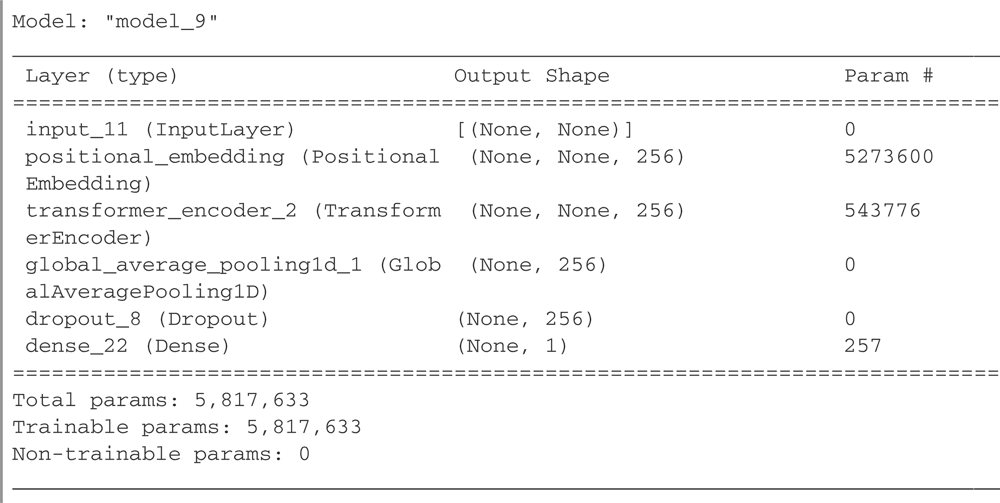

callbacks <- list(

callback_model_checkpoint("full_transformer_encoder.keras",

save_best_only = TRUE)

)

model %>% fit(

int_train_ds,

validation_data = int_val_ds,

epochs = 20,

callbacks = callbacks

)

model <- load_model_tf(

"full_transformer_encoder.keras",

custom_objects = list(layer_transformer_encoder,

layer_positional_embedding))

cat(sprintf(

"测试准确率：%.3f\n", evaluate(model, int_test_ds)["accuracy"]))

 测试准确率：0.886

看这里！我们达到了 88.6%的测试准确率——这种改进证明了单词顺序信息对文本分类的价值。这是我们迄今为止最好的序列模型！然而，它仍然比词袋模型差一档。

### 11.4.4 何时使用序列模型而不是词袋模型

你可能会听说词袋模型方法已过时，而基于 Transformer 的序列模型是前进的道路，无论你看的是什么任务或数据集。这绝对不是这种情况：在许多情况下，在词袋模型之上放置一小叠稠密层仍然是一个完全有效和相关的方法。事实上，在本章节中我们在 IMDB 数据集上尝试的各种技术中，迄今为止表现最佳的是词袋模型！那么，何时您应该在另一种方法上更倾向于另一种方法？

2017 年，我和我的团队对多种不同类型的文本数据集上各种文本分类技术的性能进行了系统分析，我们发现了一个惊人而令人惊讶的经验法则，用于决定是选择词袋模型还是序列模型（[`mng.bz/AOzK`](http://mng.bz/AOzK)）——一种黄金常数。事实证明，当面对一个新的文本分类任务时，你应该密切关注训练数据中样本数量与每个样本平均字数之间的比率（见图 11.11）。如果这个比率很小——小于 1,500——那么二元模型的表现会更好（而且作为额外奖励，它的训练和迭代速度也会更快）。如果这个比率高于 1,500，则应选择序列模型。换句话说，当有大量训练数据可用且每个样本相对较短时，序列模型的效果最佳。

**图 11.11 选择文本分类模型的一个简单启发式方法：训练样本数与每个样本平均字数之间的比率**

所以，如果你要分类的是 1,000 字长的文档，而你有 100,000 个这样的文档（比例为 100），你应该选择一个二元模型。如果你要分类的是平均长度为 40 个字的推文，而你有 50,000 条这样的推文（比例为 1,250），你也应该选择一个二元模型。但如果你的数据集大小增加到 500,000 条推文（比例为 12,500），那就选择一个 Transformer 编码器。那 IMDB 电影评论分类任务呢？我们有 20,000 个训练样本，平均字数为 233，所以我们的经验法则指向一个二元模型，这证实了我们在实践中的发现。

这在直觉上是有道理的：序列模型的输入代表了一个更丰富、更复杂的空间，因此需要更多的数据来映射出这个空间；与此同时，一组简单的术语是一个如此简单的空间，以至于你可以只用几百或几千个样本来训练顶部的逻辑回归。此外，样本越短，模型就越不能丢弃其中包含的任何信息——特别是，单词顺序变得更加重要，丢弃它可能会产生歧义。句子“这部电影太棒了”和“这部电影是一颗炸弹”有非常接近的单字表示，这可能会让词袋模型感到困惑，但序列模型可以告诉哪一个是消极的，哪一个是积极的。对于更长的样本，单词统计将变得更可靠，而从单词直方图中就能更明显地看出主题或情感。

现在，请记住，这个启发式规则是专门为文本分类而开发的。它不一定适用于其他自然语言处理任务——例如，对于机器翻译来说，相比于循环神经网络，Transformer 在处理非常长的序列时表现得特别出色。我们的启发式规则也只是一个经验法则，而不是科学定律，所以请期望它大部分时间都有效，但不一定总是有效。

## 11.5 超越文本分类：序列到序列学习

你现在拥有了处理大多数自然语言处理任务所需的所有工具。然而，你只看到这些工具在单一问题上的应用：文本分类。这是一个极其流行的用例，但自然语言处理远不止于此。在这一部分，你将通过学习*序列到序列模型*来深化你的专业知识。

序列到序列模型接受一个序列作为输入（通常是一个句子或段落），并将其转换成另一个序列。这是许多最成功的自然语言处理应用程序的核心任务之一：

+   *机器翻译*—将源语言的段落转换成目标语言的等效段落。

+   *文本摘要*—将长篇文档转换成保留最重要信息的较短版本。

+   *问答*—将输入的问题转换成答案。

+   *聊天机器人*—将对话提示转换成对该提示的回复，或将对话历史转换成对话中的下一个回复。

+   *文本生成*—将文本提示转换成完成提示的段落。

+   等等。

序列到序列模型的一般模板描述在图 11.12 中。在训练过程中：

+   *编码器*模型将源序列转换为中间表示。

+   *解码器*通过查看之前的标记（1 到 i - 1）和编码后的源序列来训练，以预测目标序列中的下一个标记 i。

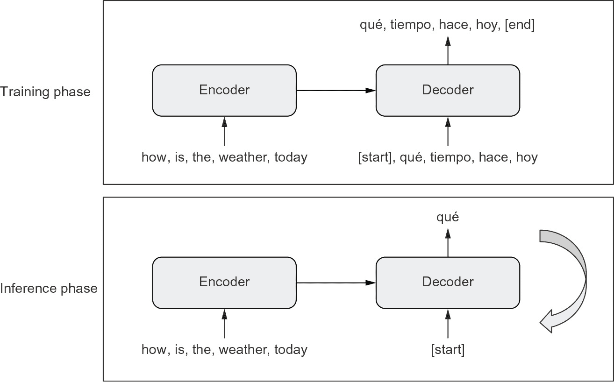

**图 11.12 序列到序列学习：源序列经过编码器处理，然后发送到解码器。解码器查看目标序列至今，并预测偏移一个步骤的目标序列。在推断过程中，我们逐个目标标记地生成并将其送回解码器。**

在推断中，我们无法访问目标序列——我们试图从头开始预测它。我们将不得不逐个标记地生成它：

1.  **1** 我们从编码器中获得编码后的源序列。

1.  **2** 解码器首先查看编码后的源序列以及一个初始的“种子”标记（例如字符串“[start]”），并用它来预测序列中的第一个真实标记。

1.  **3** 到目前为止预测的序列被送回解码器，解码器生成下一个标记，依此类推，直到生成一个停止标记（如字符串“[end]”）。

到目前为止，你学到的所有东西都可以重新用于构建这种新型模型。让我们深入了解。

### 11.5.1 一个机器翻译示例

我们将在一个机器翻译任务上演示序列到序列建模。机器翻译正是 Transformer 开发的初衷！我们将从循环序列模型开始，并将跟进完整的 Transformer 架构。我们将使用[`www.manythings.org/anki/.`](http://www.manythings.org/anki/)上提供的英语到西班牙语翻译数据集。让我们下载它：

download.file(

"http://storage.googleapis.com/download.tensorflow.org/data/spa-eng.zip",

destfile = "spa-eng.zip")

zip::unzip("spa-eng.zip")

文本文件每行包含一个示例：一个英语句子，后跟一个制表符，然后是相应的西班牙句子。让我们使用 readr::read_tsv()，因为我们有制表符分隔的值：

text_file <- "spa-eng/spa.txt"

text_pairs <- text_file %>%➊

readr::read_tsv(col_names = c("english", "spanish"),➋

col_types = c("cc")) %>%➌

within(spanish %<>% paste("[start]", ., "[end]"))➍

➊ **使用 read_tsv()读取文件（制表符分隔的值）。**

➋ **每行包含一个英语短语及其西班牙语翻译，用制表符分隔。**

➌ **两字符列**

➍ **我们在西班牙语句子前加上“[start]”，并在后面加上“[end]”，以匹配图 11.12 中的模板。**

我们的 text_pairs 看起来是这样的：

str(text_pairs[sample(nrow(text_pairs), 1), ])

tibble [1 × 2] (S3: tbl_df/tbl/data.frame)

$ english: chr "I’m staying in Italy."

$ spanish: chr "[start] Me estoy quedando en Italia. [end]"

让我们对它们进行洗牌并将它们拆分成通常的训练、验证和测试集：

num_test_samples <- num_val_samples <-

round(0.15 * nrow(text_pairs))

num_train_samples <- nrow(text_pairs) - num_val_samples - num_test_samples

pair_group <- sample(c(

rep("train", num_train_samples),

rep("test", num_test_samples),

rep("val", num_val_samples)

))

train_pairs <- text_pairs[pair_group == "train", ]

test_pairs <- text_pairs[pair_group == "test", ]

val_pairs <- text_pairs[pair_group == "val", ]

接下来，让我们准备两个单独的 TextVectorization 层：一个用于英语，一个用于西班牙语。我们需要定制字符串的预处理方式：

+   我们需要保留我们插入的“[start]”和“[end]”标记。默认情况下，字符[和]将被剥离，但我们希望保留它们，以便我们可以区分单词“start”和起始标记“[start]”。

+   标点符号在不同语言之间是不同的！在西班牙语 Text-Vectorization 层中，如果我们要剥离标点字符，我们还需要剥离字符¿。

请注意，对于非玩具翻译模型，我们将把标点字符视为单独的标记，而不是剥离它们，因为我们希望能够生成正确标点的句子。在我们的情况下，为了简单起见，我们将摆脱所有标点符号。

我们为西班牙语 TextVectorization 层准备了一个自定义字符串标准化函数：它保留了 [ 和 ]，但剥离了 ¿、¡ 和 [:punct:] 类中的所有其他字符。（[:punct:] 类的双重否定会互相抵消，就好像根本没有否定一样。然而，外部否定正则表达式分组让我们能够明确排除 [:punct:] 正则表达式类中的 [ 和 ]。我们使用 | 添加了其他不在 [:punct:] 字符类中的特殊字符，比如 ¡ 和 ¿。）

第 11.26 节 将英语和西班牙语文本对转为向量

punctuation_regex <- "[^[:^punct:][\\]]|[¡¿]"➊

library(tensorflow)

custom_standardization <- function(input_string) {➋

input_string %>%

tf$strings$lower() %>%

tf$strings$regex_replace(punctuation_regex, "")

}

input_string <- as_tensor("[start] ¡corre! [end]")

custom_standardization(input_string)

tf.Tensor(b’[start] corre [end]’, shape=(), dtype=string)➌

➊ **基本上，就是 [[:punct:]]，除了省略了 "[" 和 "]"，添加了 "¿" 和 "¡"。**

➋ **注意：这次我们使用张量操作。这允许函数被追踪到 TensorFlow 图中。**

➌ **保留了 [start] 和 [end] 的 []，并去除了 ¡ 和 !。**

> **警告** TensorFlow 正则表达式与 R 正则引擎有细微差异。如果您需要高级正则表达式，请查阅源文档：[`github.com/google/re2/wiki/Syntax`](https://www.github.com/google/re2/wiki/Syntax)。

vocab_size <- 15000➊

sequence_length <- 20

source_vectorization <- layer_text_vectorization(➋

max_tokens = vocab_size,

output_mode = "int",

output_sequence_length = sequence_length

)

target_vectorization <- layer_text_vectorization(➌

max_tokens = vocab_size,

output_mode = "int", output_sequence_length = sequence_length + 1,➍

standardize = custom_standardization

)

adapt(source_vectorization, train_pairs$english)➎

adapt(target_vectorization, train_pairs$spanish)

➊ **为了简单起见，我们将只考虑每种语言中的前 15,000 个单词，并将句子限制在 20 个词以内。**

➋ **英语层**

➌ **西班牙语层**

➍ **生成西班牙句子，多了一个额外的标记，因为在训练过程中我们需要将句子向前偏移一步。**

➎ **学习每种语言的词汇。**

最后，我们可以将我们的数据转为 TF Dataset 流水线。我们希望它返回一个对，(inputs, target)，其中 inputs 是一个带有两个条目的命名列表，英语句子（编码器输入）和西班牙句子（解码器输入），target 是西班牙句子向前偏移一步。

第 11.27 节 为翻译任务准备数据集

format_pair <- function(pair) {

eng <- source_vectorization(pair$english)➊

spa <- target_vectorization(pair$spanish)

inputs <- list(english = eng,

spanish = spa[NA:-2])➋

targets <- spa[2:NA]➌

list(inputs, targets)➍

}

batch_size <- 64

library(tfdatasets)

make_dataset <- function(pairs) {

tensor_slices_dataset(pairs) %>%

dataset_map(format_pair, num_parallel_calls = 4) %>%

dataset_cache() %>%➎

dataset_shuffle(2048) %>%

dataset_batch(batch_size) %>%

dataset_prefetch(16)

}

train_ds <- make_dataset(train_pairs)

val_ds <- make_dataset(val_pairs)

➊ **矢量化层可以使用批量化或非批量化数据调用。在这里，我们在对数据进行批量化之前应用矢量化。**

➋ **省略西班牙句子的最后一个标记，这样输入和目标的长度就一样了。[NA:-2]删除了张量的最后一个元素。**

➌ **[2:NA]删除了张量的第一个元素。**

➍ **目标西班牙句子比源句子提前一步。两者长度仍然相同（20 个单词）。**

➎ **使用内存缓存来加快预处理速度。**

这是我们的数据集输出的样子：

c(inputs, targets) %<-% iter_next(as_iterator(train_ds))

str(inputs)

2 个列表

$ english:<tf.Tensor: shape=(64, 20), dtype=int64, numpy=…>

$ spanish:<tf.Tensor: shape=(64, 20), dtype=int64, numpy=…>

str(targets)

<tf.Tensor: shape=(64, 20), dtype=int64, numpy=…>

数据现在准备好了——是时候构建一些模型了。我们将先从一个递归序列到序列模型开始，然后再转向一个 Transformer 模型。

### 11.5.2 使用 RNN 进行序列到序列学习

在 2015 年至 2017 年期间，递归神经网络在序列到序列学习中占据主导地位，然后被 Transformer 超越。它们是许多实际机器翻译系统的基础，如第十章所提到的。2017 年左右的谷歌翻译就是由七个大型 LSTM 层堆叠而成。今天仍然值得学习这种方法，因为它为理解序列到序列模型提供了一个简单的入门点。

使用 RNN 将一个序列转换为另一个序列的最简单、天真的方式是保留 RNN 在每个时间步的输出。在 Keras 中，它看起来像这样：

inputs <- layer_input(shape = c(sequence_length), dtype = "int64")

输出 <- 输入 %>%

layer_embedding(input_dim = vocab_size, output_dim = 128) %>%

layer_lstm(32, return_sequences = TRUE) %>%

layer_dense(vocab_size, activation = "softmax")

model <- keras_model(inputs, outputs)

然而，这种方法存在两个主要问题：

+   目标序列必须始终与源序列具有相同的长度。实际上，情况很少如此。从技术上讲，这并不重要，因为你始终可以在源序列或目标序列中填充其中之一，以使它们的长度匹配。

+   由于 RNN 的逐步性质，该模型只会查看源序列中的标记 1…*N*来预测目标序列中的标记*N*。这种限制使得这种设置对大多数任务不适用，尤其是翻译任务。考虑将“The weather is nice today”翻译成法语，即“Il fait beau aujourd’hui。”你需要能够仅仅从“The”预测出“Il”，仅仅从“The weather”预测出“Il fait”，等等，这是不可能的。

如果你是一个人类翻译员，你会先阅读整个源句子，然后开始翻译它。这在处理词序完全不同的语言时尤其重要，比如英语和日语。而标准的序列到序列模型正是这样做的。

在一个适当的序列到序列设置中（见 图 11.13），你首先会使用一个 RNN（编码器）将整个源序列转换为单个向量（或一组向量）。这可以是 RNN 的最后输出，或者是其最终的内部状态向量。然后，您将使用此向量（或向量）作为另一个 RNN（解码器）的*初始状态*，该解码器将查看目标序列的元素 1…*N*，并尝试预测目标序列中的步骤 *N*+1。

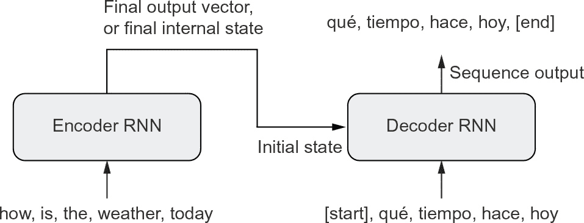

**图 11.13 一个序列到序列 RNN：一个 RNN 编码器用于产生编码整个源序列的向量，这个向量被用作另一个 RNN 解码器的初始状态。**

让我们在 Keras 中用基于 GRU 的编码器和解码器来实现这一点。与 LSTM 相比，选择 GRU 使事情变得简单一些，因为 GRU 只有一个状态向量，而 LSTM 有多个。让我们从编码器开始。

列表 11.28 基于 GRU 的编码器

embed_dim <- 256

latent_dim <- 1024

source <- layer_input(c(NA), dtype = "int64",

name = "english")➊

encoded_source <- source %>%

layer_embedding(vocab_size, embed_dim,

mask_zero = TRUE) %>%➋

双向(layer_gru(units = latent_dim),

merge_mode = "sum")➌

➊ **英文源句子在这里。通过指定输入的名称，我们能够用一个命名的输入列表来拟合()模型。**

➋ **不要忘记掩码：在这种设置中很关键。**

➌ **我们编码的源句子是双向 GRU 的最后一个输出。**

接下来，让我们添加解码器——一个简单的 GRU 层，它的初始状态是编码的源句子。在其上面，我们添加一个 layer_dense()，为每个输出步骤生成对西班牙语词汇的概率分布。

列表 11.29 基于 GRU 的解码器和端到端模型

decoder_gru <- layer_gru(units = latent_dim, return_sequences = TRUE)

past_target <- layer_input(shape = c(NA), dtype = "int64", name = "spanish")➊

target_next_step <- past_target %>%

layer_embedding(vocab_size, embed_dim,

mask_zero = TRUE) %>%➋

decoder_gru(initial_state = encoded_source) %>%➌

layer_dropout(0.5) %>%

layer_dense(vocab_size, activation = "softmax")➍

seq2seq_rnn <-

keras_model(inputs = list(source, past_target),➎

outputs = target_next_step)

➊ **西班牙目标句子放在这里。**

➋ **不要忘记掩码。**

➌ **编码的源句子作为解码器 GRU 的初始状态。**

➍ **预测下一个标记。**

➎ **端到端模型：将源句子和目标句子映射到未来的目标句子中的一步**

在训练期间，解码器将整个目标序列作为输入，但由于 RNN 的逐步性质，它仅查看输入中的令牌 1…*N*，以预测输出中的令牌*N*（它对应于序列中的下一个令牌，因为输出旨在偏移一个步骤）。这意味着我们只使用过去的信息来预测未来，正如我们应该的那样；否则，我们将作弊，我们的模型在推断时将无法工作。

让我们开始训练。

Listing 11.30 训练我们的循环序列到序列模型

seq2seq_rnn %>% compile(optimizer = "rmsprop",

loss = "sparse_categorical_crossentropy",

metrics = "accuracy")

seq2seq_rnn %>% fit(train_ds, epochs = 15, validation_data = val_ds)

我们选择准确性作为在训练过程中监视验证集性能的粗略方式。我们达到了 64%的准确率：平均而言，模型在 64%的时间内正确预测了西班牙语句子中的下一个单词。然而，在实践中，下一个标记准确性并不是机器翻译模型的好指标，特别是因为它假设在预测标记*N* +1 时，已知从 0 到*N*的正确目标标记。实际上，在推断期间，您正在从头开始生成目标句子，而不能依赖于先前生成的标记完全正确。如果您正在开发真实世界的机器翻译系统，您可能会使用“BLEU 分数”来评估您的模型——这是一个考虑整个生成序列的指标，似乎与人类对翻译质量的感知良好相关。

最后，让我们使用我们的模型进行推断。我们将在测试集中挑选几个句子，并检查我们的模型如何翻译它们。我们将从种子标记“[start]”开始，并将其连同编码的英语源句子一起馈送到解码器模型中。我们将检索下一个标记预测，并将其反复注入解码器，每次迭代抽样一个新的目标标记，直到我们到达“[end]”或达到最大句子长度。

Listing 11.31 使用我们的 RNN 编码器和解码器翻译新句子

spa_vocab <- get_vocabulary(target_vectorization)➊

max_decoded_sentence_length <- 20

decode_sequence <- function(input_sentence) {

tokenized_input_sentence <

source_vectorization(array(input_sentence, dim = c(1, 1)))

decoded_sentence <- "[start]"➋

for (i in seq(max_decoded_sentence_length)) {

tokenized_target_sentence <-

target_vectorization(array(decoded_sentence, dim = c(1, 1)))

next_token_predictions <- seq2seq_rnn %>%

predict(list(tokenized_input_sentence,➌

tokenized_target_sentence))

sampled_token_index <- which.max(next_token_predictions[1, i, ])

sampled_token <- spa_vocab[sampled_token_index]➍

decoded_sentence <- paste(decoded_sentence, sampled_token)

if (sampled_token == "[end]")➎

break

}

decoded_sentence

}

for (i in seq(20)) {

input_sentence <- sample(test_pairs$english, 1)

print(input_sentence)

print(decode_sequence(input_sentence))

print("-")

}

[1] "这件裙子穿在我身上好看吗？"

[1] "[start] este vestido me parece bien [UNK] [end]"

[1] "-"

…

➊ **准备词汇表，将令牌索引预测转换为字符串令牌。**

➋ **种子令牌**

➌ **抽样下一个令牌。**

➍ **将下一个令牌预测转换为字符串，并将其附加到生成的句子中。**

➎ **退出条件：达到最大长度或抽样到停止令牌。**

decode_sequence() 现在工作得很好，尽管可能比我们想象的要慢一些。加速 eager 代码的一个简单方法是使用 tf_function()，我们在第七章首次见到它。让我们重写 decode_sentence()，使其由 tf_function() 编译。这意味着我们将不再使用 eager R 函数，如 seq()、predict() 和 which.max()，而是使用 TensorFlow 的等效函数，如 tf$range()，直接调用 model()，以及 tf$argmax()。

因为 tf$range() 和 tf$argmax() 返回的是基于 0 的值，我们将设置一个函数局部选项：option(tensorflow.extract.style = “python”)。这样一来，张量的 [ 行为也将是基于 0 的。

tf_decode_sequence <- tf_function(function(input_sentence) {

withr::local_options(

tensorflow.extract.style = "python")➊

tokenized_input_sentence <- input_sentence %>%

as_tensor(shape = c(1, 1)) %>%

source_vectorization()

spa_vocab <- as_tensor(spa_vocab)

decoded_sentence <- as_tensor("[start]", shape = c(1, 1))

for (i in tf$range(as.integer(max_decoded_sentence_length))) {

tokenized_target_sentence <- decoded_sentence %>%

target_vectorization()

next_token_predictions <-

seq2seq_rnn(list(tokenized_input_sentence,

tokenized_target_sentence))

sampled_token_index <-

tf$argmax(next_token_predictions[0, i, ])➋

sampled_token <- spa_vocab[sampled_token_index]➌

decoded_sentence <-

tf$strings$join(c(decoded_sentence, sampled_token),

separator = " ")

if (sampled_token == "[end]")

break

}

decoded_sentence

})

for (i in seq(20)) {

input_sentence <- sample(test_pairs$english, 1)

cat(input_sentence, "\n")

cat(input_sentence %>% as_tensor() %>%➍

tf_decode_sequence() %>% as.character(), "\n")

cat("-\n")

}

➊ **现在所有使用 [ 进行张量子集的操作都将是基于 0 的，直到此函数退出。**

➋ **tf$range() 中的 i 是基于 0 的。**

➌ **tf$argmax() 返回的是基于 0 的索引。**

➍ **在调用 tf_decode_sequence() 之前转换为张量，然后将输出转换回 R 字符串。**

我们的 tf_decode_sentence() 比 eager 版本快了约 10 倍。还不错！

请注意，尽管这种推理设置非常简单，但相当低效，因为每次抽样新单词时，我们都会重新处理整个源句子和整个生成的目标句子。在实际应用中，您应该将编码器和解码器分开为两个单独的模型，并且您的解码器每次仅在抽样迭代中运行一步，重复使用其先前的内部状态。

这是我们的翻译结果。对于一个玩具模型来说，我们的模型效果还不错，尽管仍然会出现许多基本错误。

列表 11.32 递归翻译模型的一些样本结果

谁在这个房间里？

[start] 在这个房间里谁 [end]

-

那听起来不太危险。

[start] 那不太难 [end]

-

没人能阻止我。

[start] 没有人能阻止我 [end]

-

汤姆很友好。

[start] 汤姆很友好 [end]

这个玩具模型有很多改进的方法：我们可以对编码器和解码器都使用堆叠的深度循环层（请注意，对于解码器，这会使状态管理变得更加复杂）。我们可以使用 LSTM 而不是 GRU 等等。除了这些微调之外，RNN 方法用于序列到序列学习具有一些根本上的限制：

+   源序列表示必须完全保存在编码器状态向量中，这对你能够翻译的句子的大小和复杂度施加了重要的限制。这有点像一个人完全从记忆中翻译句子，而不在产生翻译时再看一眼源语句子。

+   RNN 在处理非常长的序列时会遇到麻烦，因为它们往往会逐渐忘记过去——当你已经到达任一序列的第 100 个标记时，关于序列开头的信息已经几乎消失了。这意味着基于 RNN 的模型无法保持长期的上下文，而这对于翻译长文档可能是必要的。

这些限制正是机器学习社区采用 Transformer 架构解决序列到序列问题的原因。让我们来看一下。

### 11.5.3 带 Transformer 的序列到序列学习

序列到序列学习是 Transformer 真正发挥作用的任务。神经注意力使得 Transformer 模型能够成功处理比 RNN 更长、更复杂的序列。

作为一个将英语翻译成西班牙语的人，你不会逐个单词地阅读英语句子，将其意义记在脑海中，然后再逐个单词地生成西班牙语句子。这对于一个五个单词的句子可能有效，但对于整个段落而言可能很难奏效。相反，你可能需要在源语句子和正在翻译的语句之间来回切换，并在写下翻译的不同部分时注意源语句子中的不同单词。

这正是你可以通过神经注意力和 Transformer 实现的。你已经熟悉了 Transformer 编码器，它使用自注意力来为输入序列中的每个标记产生上下文感知表示。在序列到序列 Transformer 中，Transformer 编码器自然地扮演编码器的角色，阅读源序列并生成其编码表示。不像以前的 RNN 编码器，Transformer 编码器将编码表示保持为序列格式：它是一系列上下文感知嵌入向量。

模型的第二部分是 *Transformer 解码器*。就像 RNN 解码器一样，它读取目标序列中的令牌 1…*N* 并尝试预测令牌 *N* + 1。至关重要的是，在执行此操作时，它使用神经注意力来识别编码源句子中与当前正在尝试预测的目标令牌最相关的令牌——也许与人类翻译者所做的事情类似。回想一下查询-键-值模型：在 Transformer 解码器中，目标序列充当用于更密切关注源序列不同部分的注意力“查询”的角色（源序列扮演了键和值的角色）。

### TRANSFORMER 解码器

图 11.14 展示了完整的序列到序列 Transformer。看一下解码器的内部：你会认识到它看起来非常类似于 Transformer 编码器，只是在应用于目标序列的自注意力块和退出块的密集层之间插入了一个额外的注意力块。

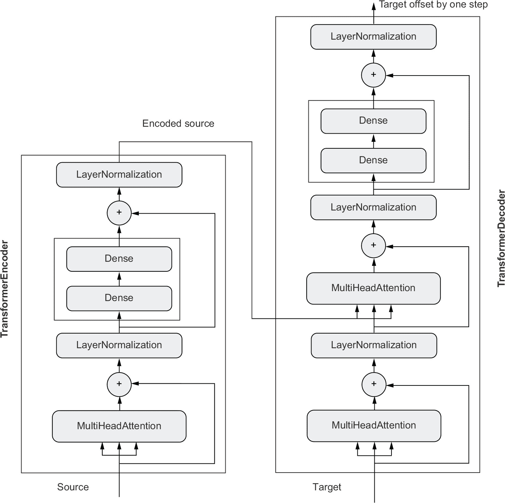

**图 11.14 TransformerDecoder 类似于 TransformerEncoder，不同之处在于它具有一个额外的注意力块，其中键和值是由 TransformerEncoder 编码的源序列。编码器和解码器共同形成一个端到端的 Transformer。**

让我们来实现它。就像对于 TransformerEncoder 一样，我们将创建一个新的层类。在我们关注 call() 方法之前，这个方法是发生动作的地方，让我们先定义类构造函数，包含我们将需要的层。

**TransformerDecoder** 列表 11.33

layer_transformer_decoder <- new_layer_class(

classname = "TransformerDecoder",

initialize = function(embed_dim, dense_dim, num_heads, …) {

super$initialize(…)

self$embed_dim <- embed_dim

self$dense_dim <- dense_dim

self$num_heads <- num_heads

self$attention_1 <- layer_multi_head_attention(num_heads = num_heads,

key_dim = embed_dim)

self$attention_2 <- layer_multi_head_attention(num_heads = num_heads,

key_dim = embed_dim)

self$dense_proj <- keras_model_sequential() %>%

layer_dense(dense_dim, activation = "relu") %>%

layer_dense(embed_dim)

self$layernorm_1 <- layer_layer_normalization()

self$layernorm_2 <- layer_layer_normalization()

self$layernorm_3 <- layer_layer_normalization()

self$supports_masking <- TRUE➊

},

get_config = function() {

config <- super$get_config()

for (name in c("embed_dim", "num_heads", "dense_dim"))

config[[name]] <- self[[name]]

config

},

➊ **这个属性确保层将其输入掩码传播到其输出；在 Keras 中，掩码必须明确地选择。如果你将一个掩码传递给一个不实现 compute_mask() 并且不公开这个 supports_masking 属性的层，那就是一个错误。**

call() 方法几乎是从 图 11.14 的连通性图的直观渲染。但是还有一个额外的细节我们需要考虑：*因果填充*。因果填充对于成功训练序列到序列 Transformer 是绝对关键的。与 RNN 不同，RNN 逐步查看其输入，因此在生成输出步骤 *N*（这是目标序列中的标记 *N*+1）时只能访问步骤 1…*N* 的信息，TransformerDecoder 是无序的：它一次查看整个目标序列。如果允许它使用其整个输入，它将简单地学会将输入步骤 *N*+1 复制到输出的位置 *N*。因此，该模型将实现完美的训练准确度，但当进行推断时，它将完全无用，因为超出 *N* 的输入步骤是不可用的。

解决方法很简单：我们将屏蔽成对注意力矩阵的上半部分，以防止模型关注未来的任何信息——只有目标序列中的标记 1…*N* 的信息应该在生成目标标记 *N*+1 时使用。为此，我们将在我们的 TransformerDecoder 中添加一个 get_causal_attention_mask(inputs) 方法，以检索我们可以传递给我们的 MultiHeadAttention 层的注意力屏蔽。

**列出 11.34 TransformerDecoder 生成因果掩码的方法**

get_causal_attention_mask = function(inputs) {

c(batch_size, sequence_length, .) %<-%➊

tf$unstack(tf$shape(inputs))

x <- tf$range(sequence_length)➋

i <- x[, tf$newaxis]

j <- x[tf$newaxis, ]

mask <- tf$cast(i >= j, "int32")➌ ➍

tf$tile(mask[tf$newaxis, , ],

tf$stack(c(batch_size, 1L, 1L)))➎

},

➊ **第三个轴是 encoding_length；我们在这里不使用它。**

➋ **整数序列 [0, 1, 2, … sequence_length-1]**

➌ **在我们的 >= 操作中使用 Tensor 广播。将 dtype bool 转换为 int32。**

➍ **掩码是一个形状为 (sequence_length, sequence_length) 的方阵，其中下三角有 1，其他地方为 0。例如，如果 sequence_length 是 4，那么掩码是：**

tf.Tensor([[1 0 0 0]

[1 1 0 0]

[1 1 1 0]

[1 1 1 1]], shape=(4, 4), dtype=int32)

➎ **向掩码添加一个批量维度，然后沿着批量维度复制（rep()） batch_size 次。返回的张量形状为 (batch_size, sequence_length, sequence_length)。**

现在我们可以写下实现解码器前向传递的完整 call() 方法。

11.35 列出了 TransformerDecoder 的前向传递

call = function(inputs, encoder_outputs, mask = NULL) {

causal_mask <- self$get_causal_attention_mask(inputs)➊

if (is.null(mask))➋

mask <- causal_mask

else

mask %<>% { tf$minimum(tf$cast(.[, tf$newaxis, ], "int32"),

causal_mask) }➌

inputs %>%

{ self$attention_1(query = ., value = ., key = .,

attention_mask = causal_mask) + . } %>%➍

self$layernorm_1() %>%➎

{ self$attention_2(query = .,

value = encoder_outputs,➏

key = encoder_outputs,➏

attention_mask = mask) + . } %>%➐

self$layernorm_2() %>%➑

{ self$dense_proj(.) + . } %>%➒

self$layernorm_3()

})

➊ **检索因果掩码。**

➋ **在调用中提供的掩码是填充掩码（它描述目标序列中的填充位置）**。

➌ **将填充掩码与因果屏蔽组合。**

➍ **将因果屏蔽传递给第一个注意力层，该注意力层在目标序列上执行自我注意力。**

➎ **将带有残差的 attention_1()输出传递给 layernorm_1()。**

➏ **在调用中使用 encoder_output 作为 attention_2()的 value 和 key 参数。**

➐ **将组合屏蔽传递给第二个注意力层，该层将源序列与目标序列相关联。**

➑ **将带有残差的 attention_2()输出传递给 layernorm_2()。**

➒ **将带有残差的 dense_proj()输出加起来并传递到 layernorm_3()。**

### 将所有内容组合到一起：面向机器翻译的 Transformer

端到端 Transformer 是我们将要训练的模型。它将源序列和目标序列映射到目标序列的下一个步骤。它直接组合了我们迄今为止构建的部分：PositionalEmbedding 层，TransformerEncoder 和 TransformerDecoder。请注意，Transformer-Encoder 和 TransformerDecoder 都形状不变，因此您可以堆叠许多它们来创建更强大的编码器或解码器。在我们的示例中，我们将坚持每个部分单独一个实例。

**图 11.36 端到端 Transformer**

embed_dim <- 256

dense_dim <- 2048

num_heads <- 8

encoder_inputs <- layer_input(shape(NA), dtype = "int64", name = "english")

encoder_outputs <- encoder_inputs %>%

layer_positional_embedding(sequence_length, vocab_size, embed_dim) %>%

layer_transformer_encoder(embed_dim, dense_dim, num_heads)➊

transformer_decoder <-

layer_transformer_decoder(NULL, embed_dim, dense_dim, num_heads)➋

decoder_inputs <- layer_input(shape(NA), dtype = "int64", name = "spanish")

decoder_outputs <- decoder_inputs %>%

layer_positional_embedding(sequence_length, vocab_size, embed_dim) %>%

transformer_decoder(., encoder_outputs) %>%➌

layer_dropout(0.5) %>%

layer_dense(vocab_size, activation = "softmax")➍

transformer <- keras_model(list(encoder_inputs, decoder_inputs),

decoder_outputs)

➊ **编码源句子。**

➋ **对于第一个参数传递 NULL，以便直接创建并返回一个层实例，而不是将其与任何内容组合。**

➌ **编码目标句子并将其与编码的源句子结合起来。**

➍ **针对每个输出位置预测一个单词。**

现在我们准备训练我们的模型，我们得到了 67％的准确率，比基于 GRU 的模型高得多。

**图 11.37 训练序列到序列的 Transformer**

transformer %>%

compile(optimizer = "rmsprop",

loss = "sparse_categorical_crossentropy",

metrics = "accuracy")

transformer %>%

fit(train_ds, epochs = 30, validation_data = val_ds)

最后，让我们尝试使用我们的模型来翻译来自测试集的从未见过的英语句子。设置与我们用于序列到序列 RNN 模型相同；唯一改变的是我们将 seq2seq_rnn 替换为 transformer，并且删除了我们配置的 target_vectorization() 层添加的额外标记。

**列表 11.38 使用我们的 Transformer 模型翻译新句子**

tf_decode_sequence <- tf_function(function(input_sentence) {

withr::local_options(tensorflow.extract.style = "python")

tokenized_input_sentence <- input_sentence %>%

as_tensor(shape = c(1, 1)) %>%

source_vectorization()

spa_vocab <- as_tensor(spa_vocab)

decoded_sentence <- as_tensor("[start]", shape = c(1, 1))

for (i in tf$range(as.integer(max_decoded_sentence_length))) {

tokenized_target_sentence <-

target_vectorization(decoded_sentence)[, NA:-1]➊

next_token_predictions <-➋

transformer(list(tokenized_input_sentence,

tokenized_target_sentence))

sampled_token_index <- tf$argmax(next_token_predictions[0, i, ])

sampled_token <- spa_vocab[sampled_token_index]➌

decoded_sentence <-

tf$strings$join(c(decoded_sentence, sampled_token),

separator = " ")

if (sampled_token == "[end]")➍

break

}

decoded_sentence

})

for (i in sample.int(nrow(test_pairs), 20)) {

c(input_sentence, correct_translation) %<-% test_pairs[i, ]

cat(input_sentence, "\n")

cat(input_sentence %>% as_tensor() %>%

tf_decode_sequence() %>% as.character(), "\n")

cat("-\n")

}

➊ **删除最后一个标记；“python” 样式不包括切片结尾。**

➋ **随机抽取下一个标记。**

➌ **将下一个标记预测转换为字符串，并附加到生成的句子中。**

➍ **退出条件**

主观上，Transformer 似乎比基于 GRU 的翻译模型表现要好得多。它仍然是一个玩具模型，但是是一个更好的玩具模型。

列表 11.39 Transformer 翻译模型的一些示例结果

这是我小的时候学会的一首歌。

[start] esta es una canción que aprendí cuando

 era chico [end]➊

-

她会弹钢琴。

[start] ella puede tocar piano [end]

-

我不是你认为的那个人。

[start] no soy la persona que tú creo que soy [end]

-

昨晚可能下了一点雨。

[start] puede que llueve un poco el pasado [end]

➊ **尽管源句子没有明确性别，但这个翻译假设了一个男性说话者。请记住，翻译模型经常会对其输入数据做出不合理的假设，这会导致算法偏见。在最糟糕的情况下，模型可能会产生与当前处理的数据无关的记忆信息。**

这就结束了关于自然语言处理的这一章节——你刚刚从最基础的知识到了一个完全成熟的 Transformer，可以将英语翻译成西班牙语。教会机器理解语言是你可以添加到自己技能集合中的最新超能力。

## 总结

+   有两种 NLP 模型：处理单词集或*N*-gram 而不考虑其顺序的*词袋模型*，以及处理单词顺序的*序列模型*。词袋模型由稠密层构成，而序列模型可以是 RNN、一维卷积网络或 Transformer。

+   在文本分类方面，训练数据中的样本数量与每个样本的平均单词数之间的比例可以帮助您确定是使用词袋模型还是序列模型。

+   *词嵌入* 是语义关系建模为代表这些词的向量之间的距离关系的向量空间。

+   *序列到序列学习* 是一种通用、强大的学习框架，可用于解决许多 NLP 问题，包括机器翻译。序列到序列模型由一个编码器（处理源序列）和一个解码器（通过查看编码器处理的源序列的过去标记来尝试预测目标序列中的未来标记）组成。

+   *神经注意力* 是一种创建上下文感知词表示的方法。这是 Transformer 架构的基础。

+   *Transformer* 架构由 TransformerEncoder 和 TransformerDecoder 组成，在序列到序列的任务上产生了出色的结果。前半部分，TransformerEncoder，也可以用于文本分类或任何单输入 NLP 任务。

1.  ¹ Yoshua Bengio 等人，《神经概率语言模型》，《机器学习研究杂志》（2003）。

1.  ² Ashish Vaswani 等人，《关注是你所需要的一切》（2017），[`arxiv.org/abs/1706.03762`](https://www.arxiv.org/abs/1706.03762)。
