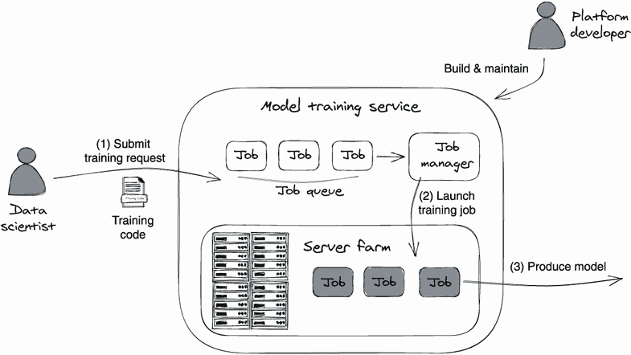
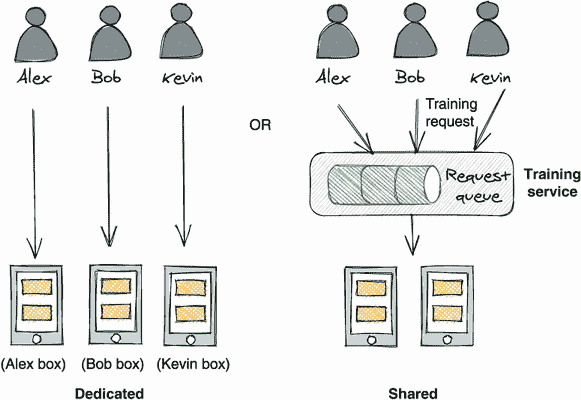
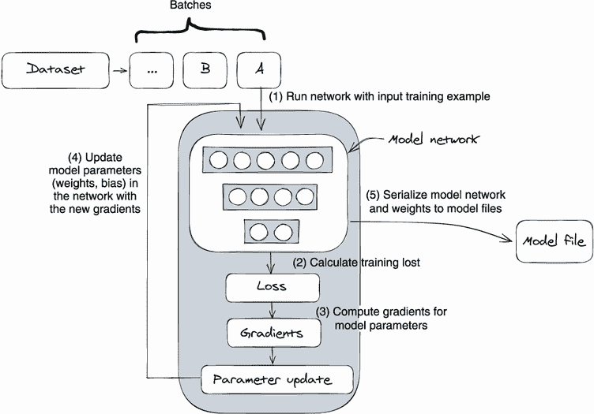
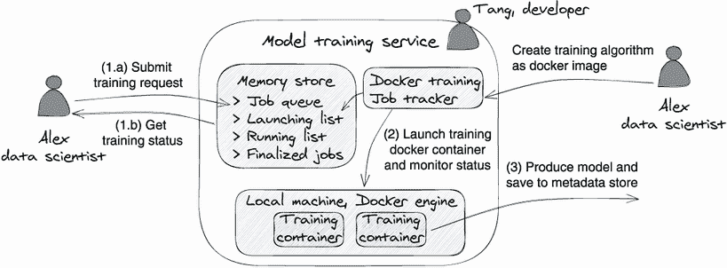
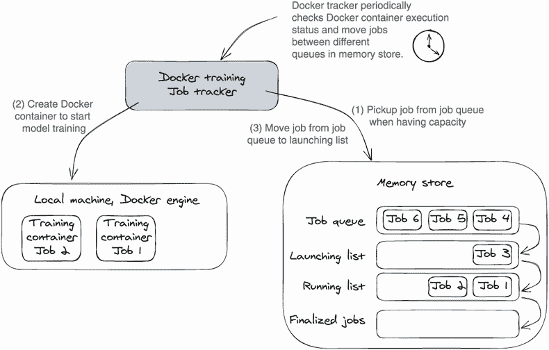
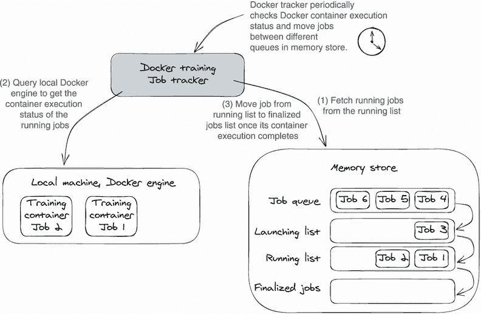
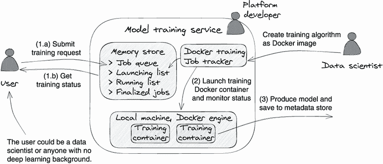
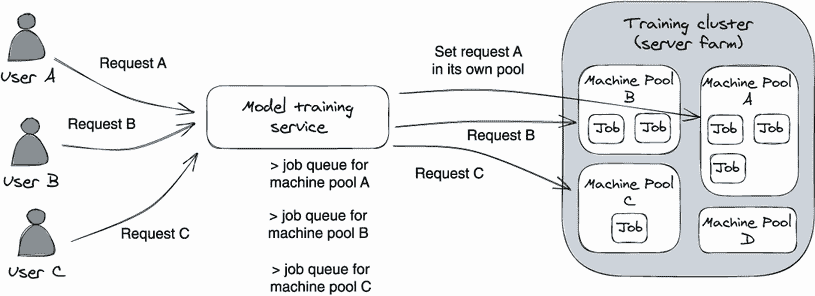
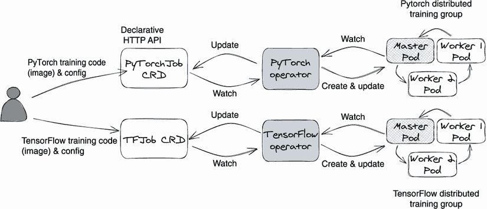
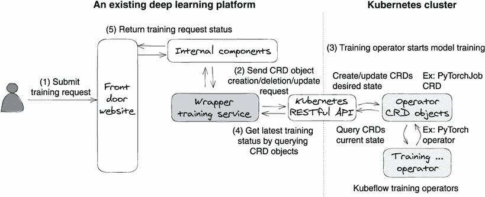

# 第三章：模型训练服务

这一章涵盖了

+   建立训练服务的设计原则

+   解释深度学习训练代码模式

+   参观一个示例训练服务

+   使用开源训练服务，如 Kubeflow

+   决定何时使用公共云训练服务

机器学习中的模型训练任务不是研究人员和数据科学家的专属责任。是的，他们对算法的训练工作至关重要，因为他们定义了模型架构和训练计划。但就像物理学家需要一个软件系统来控制电子-正电子对撞机来测试他们的粒子理论一样，数据科学家需要一个有效的软件系统来管理昂贵的计算资源，如 GPU、CPU 和内存，以执行训练代码。这个管理计算资源和执行训练代码的系统被称为*模型训练服务*。

构建高质量的模型不仅取决于训练算法，还取决于计算资源和执行训练的系统。一个好的训练服务可以使模型训练速度更快、更可靠，同时还可以降低平均模型构建成本。当数据集或模型架构非常庞大时，使用训练服务来管理分布式计算是你唯一的选择。

在这一章中，我们首先考察了训练服务的价值主张和设计原则，然后我们遇到了我们的示例训练服务。这个示例服务不仅向你展示了如何将设计原则应用于实践，还教你训练服务如何与任意训练代码交互。接下来，我们介绍了几个开源训练应用程序，你可以用它们快速建立自己的训练服务。最后，我们讨论了何时使用公共云训练系统。

本章重点讨论了从软件工程师的角度而不是数据科学家的角度设计和构建有效的训练服务。因此，我们不希望你熟悉任何深度学习理论或框架。第 3.2 节关于深度学习算法代码模式，是你理解本章训练代码所需的全部准备工作。训练代码并不是我们在这里的主要关注点；我们只是为了演示目的而编写了它，所以我们有东西可以演示示例训练服务。

模型训练的话题经常让工程师感到害怕。一个常见的误解是，模型训练全部都是关于训练算法和研究的。通过阅读这一章，我希望你不仅能学会如何设计和构建训练服务，还能吸收到这样一条信息：模型训练的成功建立在两个支柱上，即算法和系统工程。组织中的模型训练活动如果没有良好的训练系统，就无法扩展。因此，作为软件工程师，我们有很多可以为这个领域做出的贡献。

## 3.1 模型训练服务：设计概述

在企业环境中，深度学习模型训练涉及两种角色：开发模型训练算法的数据科学家（使用 TensorFlow、PyTorch 或其他框架），以及构建和维护在远程和共享服务器群中运行模型训练代码的系统的平台工程师。我们称这个系统为模型训练服务。

模型训练服务作为一个训练基础设施，在专用环境中执行模型训练代码（算法）；它处理训练作业调度和计算资源管理。图 3.1 展示了一个高级工作流程，其中模型训练服务运行模型训练代码以生成一个模型。



图 3.1 通过训练服务执行模型训练的高级工作流程。在步骤 1 中，数据科学家向训练服务提交带有训练代码的训练请求，该服务将在作业队列中创建一个作业。在步骤 2 中，模型训练服务分配计算资源来执行训练作业（训练代码）。在步骤 3 中，当训练执行完成时，作业产生一个模型。

关于这个组件最常见的问题是为什么我们需要编写一个服务来进行模型训练。对许多人来说，似乎更容易编写一个简单的 bash 脚本在本地或远程执行训练代码（算法），比如在 Amazon 弹性云计算（Amazon EC2）实例上。然而，构建训练服务的理由不仅仅是启动训练计算。我们将在下一节详细讨论它。

### 3.1.1 为什么使用模型训练的服务？

想象一下，你领导一个数据科学团队，你需要明智地为团队成员 Alex、Bob 和 Kevin 分配团队宝贵的计算资源。计算资源需要以一种所有团队成员都能在时间限制和预算内完成他们的模型训练任务的方式分配。图 3.2 展示了分配计算资源的两种方法：专用和共享。



图 3.2 不同的计算资源分配策略：专用 vs. 共享

第一个选项，专用，是为每个团队成员独家分配一台强大的工作站。这是最简单的方法，但显然不是经济的，因为当 Alex 不运行他的训练代码时，他的服务器处于空闲状态，Bob 和 Kevin 都无法使用它。因此，在这种方法中，我们的预算被低效利用。

专用方法的另一个问题是它无法扩展。当 Alex 需要训练一个大模型或者一个数据集庞大的模型时，他将需要多台机器。而且训练机器通常很昂贵；由于深度学习模型架构的复杂性，即使是一个体量适中的神经网络也需要具有较大内存的 GPU。在这种情况下，我们必须为 Alex 分配更多专用服务器，这加剧了资源分配效率低下的问题。

第二个选项，共享计算资源，是建立一个弹性服务器组（组大小可调整）并与所有成员共享。这种方法显然更经济，因为我们使用更少的服务器来实现相同的结果，从而最大化了我们的资源利用率。

选择共享策略并不是一个困难的决定，因为它大大降低了我们训练集群的成本。但是共享方法需要适当的管理，例如如果突然出现大量的训练请求，则排队用户请求，监控每个训练执行并在必要时进行干预（重新启动或中止）（训练进度停滞），并根据实时系统使用情况扩展或缩减我们的集群。

脚本与服务

现在让我们重新审视之前关于脚本与服务的讨论。在模型训练的背景下，*训练脚本* 是指使用 shell 脚本在共享服务器集群中编排不同的训练活动。训练服务是一个远程过程，它通过 HTTP（超文本传输协议）或 gRPC（gRPC 远程过程调用）进行网络通信。作为数据科学家，Alex 和 Bob 向服务发送训练请求，而服务则编排这些请求并管理共享服务器上的训练执行。

使用脚本方法可能适用于单人场景，但在共享资源环境中会变得困难。除了执行训练代码之外，我们还需要关注其他重要因素，比如设置环境、确保数据合规性以及排除模型性能问题。例如，环境设置要求在开始模型训练之前，在训练服务器上正确安装训练框架和训练代码的库依赖项。数据合规性要求对敏感的训练数据（用户信用卡号、支付记录）进行受限访问的保护。性能故障排除要求对训练中使用的所有内容进行跟踪，包括数据集 ID 和版本、训练代码版本以及超参数，以便进行模型再现。

很难想象用 shell 脚本解决这些要求，并且以可靠、可重复和可扩展的方式执行模型训练。这就是为什么如今大多数在生产中训练的模型都是通过深思熟虑设计的模型训练服务生成的原因。

模型训练服务的好处

从前面的讨论中，我们可以想象一个模型训练服务的价值主张如下：

+   饱和计算资源并降低模型训练成本

+   通过以快速（可用资源更多）和可靠的方式构建模型来加快模型开发

+   通过在受限环境中执行训练来强制执行数据合规性

+   促进模型性能故障排除

### 3.1.2 模型训练服务设计原则

在查看我们的示例训练服务之前，让我们看一下可以用来评估模型训练系统的四个设计原则。

原则 1：提供统一的 API，不关心实际的训练代码

只有一个公共 API 来训练不同种类的训练算法使得训练服务易于使用。无论是目标检测训练、语音识别训练还是文本意图分类训练，我们都可以使用示例 API 触发模型训练执行。未来算法性能的 A/B 测试也可以通过一个单一的训练 API 轻松实现。

训练代码不易装配意味着训练服务定义了一种执行训练算法（代码）的清晰机制或协议。例如，它确定了服务如何将变量传递给训练代码/进程，训练代码如何获取训练数据集，以及训练后的模型和指标上传到何处。只要训练代码遵循这个协议，无论它是如何实现的、其模型架构是什么或使用哪些训练库，都不会有任何问题。

原则 2：构建具有高性能和低成本的模型

一个好的训练服务应该将成本效益作为优先考虑。成本效益可以提供缩短模型训练执行时间和提高计算资源利用率的方法。例如，一种现代的训练服务可以通过支持各种分布式训练方法、提供良好的作业调度管理来饱和服务器群，以及在训练过程偏离原始计划时向用户发出警报，从而降低时间和硬件成本。

原则 3：支持模型可重现性

一个服务如果给出相同的输入应该会产生相同的模型。这不仅对调试和性能故障排除很重要，而且还建立了系统的可信度。记住，我们将根据模型预测结果构建业务逻辑。例如，我们可以使用分类模型来预测用户的信用并根据此作出贷款批准决策。除非我们能够反复产生相同质量的模型，否则就无法信任整个贷款批准申请。

原则 4：支持鲁棒、隔离和弹性计算管理

现代深度学习模型，如语言理解模型，需要很长时间的训练（超过一周）。如果训练过程在中途被中断或因某些随机操作系统故障而中止，所有的时间和计算费用都会白白浪费。一个成熟的训练服务应该处理训练工作的鲁棒性（故障转移、故障恢复）、资源隔离和弹性资源管理（能够调整资源数量），以确保其训练作业可以在各种情况下成功完成执行。

在讨论了所有重要的抽象概念之后，让我们来解决如何设计和构建模型训练服务。在接下来的两节中，我们将学习深度学习代码的一般代码模式以及模型训练服务的示例。

## 3.2 深度学习训练代码模式

深度学习算法可能对工程师来说复杂且常常令人望而生畏。幸运的是，作为设计深度学习系统平台的软件工程师，我们不需要掌握这些算法来进行日常工作。但是，我们需要熟悉这些算法的一般代码模式。通过对模型训练代码模式的高层次理解，我们可以将模型训练代码视为黑盒子。在本节中，我们将向您介绍一般模式。

### 3.2.1 模型训练工作流程

简而言之，大多数深度学习模型通过迭代学习过程进行训练。该过程在许多迭代中重复相同的计算步骤，并且在每次迭代中，它试图更新神经网络的权重和偏差，以使算法输出（预测结果）更接近数据集中的训练目标。

为了衡量神经网络模拟给定数据的能力并使用它来更新神经网络的权重以获得更好的结果，定义了一个损失函数来计算算法输出与实际结果之间的偏差。损失函数的输出称为 LOSS。

因此，您可以将整个迭代训练过程视为不断努力减少损失值。最终，当损失值达到我们的训练目标或无法进一步减少时，训练完成。训练输出是神经网络及其权重，但我们通常简称为模型。



图 3.3 深度学习模型训练工作流程的一般步骤

图 3.3 说明了一般的模型训练步骤。由于神经网络由于内存限制无法一次性加载整个数据集，因此我们通常在训练开始之前将数据集重新分组成小批量（mini-batches）。在步骤 1 中，将小批量示例馈送到神经网络中，并且网络计算每个示例的预测结果。在步骤 2 中，我们将预测结果和期望值（训练标签）传递给损失函数以计算损失值，该损失值表示当前学习与目标数据模式之间的偏差。在步骤 3 中，一个称为反向传播的过程计算出每个神经网络参数的梯度与损失值。这些梯度用于更新模型参数，以便模型可以在下一个训练循环中获得更好的预测准确性。在步骤 4 中，选择的优化算法（如随机梯度下降及其变种）更新神经网络的参数（权重和偏差）。梯度（来自步骤 3）和学习率是优化算法的输入参数。模型更新步骤后，模型准确性应该会提高。最后，在步骤 5 中，训练完成，网络及其参数保存为最终模型文件。训练在以下两种情况下完成：完成预期的训练运行或达到预期的模型准确度。

尽管有不同类型的模型架构，包括循环神经网络（RNNs）、卷积神经网络（CNNs）和自编码器，但它们的模型训练过程都遵循相同的模式；只有模型网络不同。此外，将模型训练代码抽象为先前重复的一般步骤是进行分布式训练的基础。这是因为，无论模型架构如何不同，我们都可以使用共同的训练策略对它们进行训练。我们将在下一章详细讨论分布式训练。

### 3.2.2：将模型训练代码 Docker 化为黑匣子

在之前讨论的训练模式的基础上，我们可以将深度学习训练代码视为一个黑匣子。无论训练代码实现了什么样的模型架构和训练算法，我们都可以在训练服务中以相同的方式执行它。为了在训练集群中的任何位置运行训练代码并为每个训练执行创建隔离，我们可以将训练代码及其依赖库打包到一个 Docker 镜像中，并将其作为容器运行（见图 3.4）。


图 3.4：一个训练服务启动一个 Docker 容器来执行模型训练，而不是直接运行训练代码作为一个进程。

在图 3.4 中，通过将训练代码 Docker 化，训练服务可以通过简单地启动一个 Docker 容器来执行模型训练。因为服务对容器内部的内容无所知，所以训练服务可以以这种标准方法执行所有不同的代码。这比让训练服务生成一个进程来执行模型训练要简单得多，因为训练服务需要为每个训练代码设置各种环境和依赖包。Docker 化的另一个好处是它将训练服务和训练代码解耦，这使得数据科学家和平台工程师可以分别专注于模型算法开发和训练执行性能。

如果你对训练服务如何与训练代码通信而对彼此不知情感到奇怪，那么关键在于定义通信协议；该协议界定了训练服务传递给训练代码的参数及其数据格式。这些参数包括数据集、超参数、模型保存位置、指标保存位置等等。我们将在下一节看到一个具体的例子。

## 3.3 一个样本模型训练服务

如今我们知道，大多数深度学习训练代码遵循相同的模式（图 3.3），它们可以以统一的方式进行 Docker 化和执行（图 3.4）。让我们仔细看一个具体的例子。

为了演示我们迄今介绍的概念和设计原则，我们构建了一个示例服务，实现了模型训练的基本生产场景——接收训练请求，在 Docker 容器中启动训练执行，并跟踪其执行进度。虽然这些场景相当简单——几百行代码——但它们展示了我们在前几节中讨论的关键概念，包括使用统一的 API、Docker 化的训练代码以及训练服务和训练容器之间的通信协议。

为了清晰地展示关键部分，该服务以精简的方式构建。模型训练元数据（如运行任务和等待任务）被跟踪在内存中而不是数据库中，并且训练任务直接在本地 Docker 引擎中执行。通过删除许多中间层，您将直接查看到两个关键区域：训练任务管理和训练服务与训练代码（Docker 容器）之间的通信。

### 3.3.1 与服务交互

在我们看服务设计和实现之前，让我们看看我们如何操作它。

请按照 GitHub 说明运行此实验。我们仅强调了运行示例服务的主要步骤和关键命令，以避免冗长的代码页面和执行输出，以便清晰地演示概念。要运行此实验，请按照 orca3/MiniAutoML Git 存储库中的“单个训练器演示”文档 (`training-service/single_trainer_demo.md`) 中的说明操作，该文档还包含所需的输出。

首先，我们使用 `scripts/ts-001-start-server.sh` 启动服务：

```py
docker build -t orca3/services:latest -f services.dockerfile .
docker run --name training-service -v 
  ➥ /var/run/docker.sock:/var/run/docker.sock 
  ➥ --network orca3 --rm -d -p "${TS_PORT}":51001
  ➥ orca3/services:latest training-service.jar
```

在启动训练服务 Docker 容器后，我们可以发送一个 gRPC 请求来启动模型训练执行（`scripts/ts-002-start-run.sh` `<dataset` `id>`）。请参见以下示例 gRPC 请求。

图 3.1 调用训练服务 API：提交训练作业

```py
grpcurl -plaintext 
 -d "{
  "metadata": 
    { "algorithm":"intent-classification",    ❶
      "dataset_id":"1",
      "name":"test1",
      "train_data_version_hash":"hashBA==",   ❷
      "parameters":                           ❸
        {"LR":"4","EPOCHS":"15",
         "BATCH_SIZE":"64",
         "FC_SIZE":"128"}}
}" 
"${TS_SERVER}":"${TS_PORT}" 
training.TrainingService/Train
```

❶ 训练算法；也是训练 Docker 镜像的名称

❷ 训练数据集的版本哈希值。

❸ 训练超参数

一旦作业成功提交，我们就可以使用从 `train` API 返回的作业 ID 来查询训练执行的进度（`scripts/ts-003-check-run.sh` `<job` `id>`）；请参见以下示例：

```py
grpcurl -plaintext \
 -d "{"job_id\": "$job_id"}" \     ❶
"${TS_SERVER}":"${TS_PORT}" 
training.TrainingService/GetTrainingStatus
```

❶ 使用由训练 API 返回的作业 ID。

正如您所见，通过调用两个 gRPC API，我们可以启动深度学习训练并跟踪其进度。现在，让我们来看看这个示例训练服务的设计和实现。

注意 如果您遇到任何问题，请查看附录 A。A.2 节的脚本自动化了数据集准备和模型训练。如果您想看到一个工作模型训练示例，请阅读该部分的实验部分。

### 3.3.2 服务设计概述

让我们以 Alex（一位数据科学家）和 Tang（一位开发人员）来展示服务的功能。要使用训练服务来训练一个模型，Alex 需要编写训练代码（例如，一个神经网络算法）并将代码构建成一个 Docker 镜像。这个 Docker 镜像需要发布到一个 artifact 存储库，以便训练服务可以拉取镜像并将其作为容器运行。在 Docker 容器内部，训练代码将由一个 bash 脚本执行。

为了提供一个示例，我们用 PyTorch 编写了一个样本意图分类训练代码，将代码构建成一个 Docker 镜像，并将其推送到 Docker hub（[`hub.docker.com/u/orca3`](https://hub.docker.com/u/orca3)）。我们将在第 3.3.6 节再次解释它。

注意 在实际场景中，训练 Docker 镜像的创建、发布和消费都是自动完成的。一个示例场景可能如下：第一步，Alex 将他的训练代码提交到 Git 存储库；第二步，一个预配置的程序——例如 Jenkins 流水线——被触发以从这个存储库构建一个 Docker 镜像；第三步，流水线还将 Docker 镜像发布到 Docker 镜像工厂，例如 JFrog Artifactory；第四步，Alex 发送一个训练请求，然后训练服务从工厂拉取训练镜像并开始模型训练。

当 Alex 完成培训代码开发后，他可以开始使用服务运行他的培训代码。整个工作流程如下：步骤 1.a，Alex 向我们的样本培训服务提交培训请求。请求定义了培训代码——一个 Docker 镜像和标签。当培训服务收到培训请求时，它会在队列中创建一个作业，并将作业 ID 返回给 Alex 以供将来跟踪作业；步骤 1.b，Alex 可以查询培训服务以实时获取培训进度；步骤 2，服务以 Docker 容器的形式在本地 Docker 引擎中启动一个训练作业来执行模型训练；步骤 3，Docker 容器中的培训代码在训练期间上传培训指标到元数据存储以及在培训完成时上传最终模型。

注意 模型评估是我们在前述模型训练工作流程中未提及的步骤。在模型训练完成后，Alex（数据科学家）将查看培训服务报告的培训指标，以验证模型的质量。为了评估模型质量，Alex 可以检查预测失败率、梯度和损失值图。由于模型评估通常是数据科学家的责任，所以我们不会在本书中涉及此内容，但我们会在第八章中讨论模型训练指标是如何收集和存储的。

整个培训工作流程是自助式的；Alex 可以完全自己管理模型训练。Tang 开发了培训服务并维护系统，但系统对 Alex 开发的培训代码是不可知的。Tang 的重点不是模型的准确性，而是系统的可用性和效率。请参见图 3.5，了解我们刚刚描述的用户工作流程。



图 3.5 高级服务设计和用户工作流程：用户培训请求被排队，Docker 作业跟踪器从队列中提取作业，并启动 Docker 容器来运行模型训练。

看到了用户工作流程，让我们看看两个关键组件：内存存储和 Docker 作业跟踪器。内存存储使用以下四种数据结构（映射）来组织请求（作业）：作业队列、启动列表、运行列表和完成列表。这些映射中的每一个都代表了不同运行状态的作业。我们之所以在内存中实现作业跟踪存储，只是为了简单起见；理想情况下，我们应该使用数据库。

Docker 作业跟踪器处理 Docker 引擎中的实际作业执行；它定期监视内存存储中的作业队列。当 Docker 引擎有空闲容量时，跟踪器将从作业队列中启动一个 Docker 容器，并继续监视容器的执行。在我们的示例中，我们使用本地 Docker 引擎，所以服务可以在您的本地运行。但它也可以很容易地配置到远程 Docker 引擎上。

启动培训容器后，基于执行状态，Docker 作业跟踪器将作业对象从作业队列移动到其他作业列表，如作业启动列表、运行列表和`finalizedJobs`列表。在第 3.4.4 节中，我们将详细讨论这个过程。

注意 考虑到训练时间，可能会在培训容器（在培训时）中分割数据集。在数据集构建或模型训练期间拆分数据集都是有效的，但两个过程都有各自的优点和缺点。但无论哪种方式，都不会对训练服务的设计产生重大影响。为简单起见，在此示例培训服务中，我们假设算法代码将数据集拆分为训练集、验证集和测试集。

### 3.3.3 培训服务 API

在了解了概述后，让我们深入了解公共 gRPC API (`grpc-contract/ src/main/proto/training_service.proto`)，以更深入地理解该服务。培训服务中有两个 API：`Train` 和 `GetTrainingStatus`。`Train` API 用于提交培训请求，而`GetTrainingStatus` API 用于获取培训执行状态。请参见以下清单中的 API 定义。

清单 3.2 模型培训服务 gRPC 接口

```py
service TrainingService {
 rpc Train(TrainRequest) returns (TrainResponse);
 rpc GetTrainingStatus(GetTrainingStatusRequest) 
   returns (GetTrainingStatusResponse);
}

message TrainingJobMetadata {           ❶
 string algorithm = 1;                  ❶
 string dataset_id = 2;                 ❶
 string name = 3;                       ❶
 string train_data_version_hash = 4;    ❶
 map<string, string> parameters = 5;    ❶
}                                       ❶

message GetTrainingStatusResponse {
 TrainingStatus status = 1;
 int32 job_id = 2;
 string message = 3;
 TrainingJobMetadata metadata = 4;
 int32 positionInQueue = 5;
}
```

❶ 定义了模型构建请求的数据集、训练算法和额外参数 

从清单 3.2 的 gRPC 接口中，为使用`Train` API，我们需要提供以下信息作为`TrainingJobMetadata`：

+   `dataset_id`—数据集管理服务中的数据集 ID

+   `train_data_version_hash`—用于培训的数据集的散列版本

+   `name`—培训作业名称

+   `algorithm`—指定使用哪个培训算法来训练数据集。该算法字符串需要是我们预定义算法之一。在内部，培训服务将查找与该算法关联的 Docker 镜像以执行培训。

+   `parameters`—我们直接传递给训练容器的训练超参数，如训练轮数、批量大小等。

一旦`Train` API 收到一个培训请求，服务将把请求放入作业队列，并返回一个 ID (`job_id`)供调用者引用该作业。这个`job_id`可以与`GetTrainingStatus` API 一起使用，以检查培训状态。现在我们已经看到了 API 定义，让我们在接下来的两个章节中看看它们的具体实现。

### 3.3.4 启动新的培训作业

当用户调用`Train` API 时，培训请求将被添加到内存存储的作业队列中，然后 Docker 作业跟踪器会在另一个线程中处理实际的作业执行。这个逻辑将在接下来的三个清单（3.3-3.5）中解释。

接收培训请求

首先，一个新的培训请求将被添加到作业等待队列中，并分配一个作业 ID 供将来参考；参见代码(`training-service/src/main/` `java/org/orca3/miniAutoML/training/TrainingService.java`)如下。

3.3 提交培训请求的实现代码

```py
public void train(                                      ❶
  TrainRequest request, 
  StreamObserver<TrainResponse> responseObserver) {

   int jobId = store.offer(request);                    ❷
   responseObserver.onNext(TrainResponse
     .newBuilder().setJobId(jobId).build());            ❸
   responseObserver.onCompleted();
}

public class MemoryStore {
   // jobs are waiting to pick up
   public SortedMap<Integer, TrainingJobMetadata>       ❹
     jobQueue = new TreeMap<>();                        ❹
   // jobs’ docker container is in launching state  
   public Map<Integer, ExecutedTrainingJob>             ❹
     launchingList = new HashMap<>();                   ❹
   // jobs’ docker container is in running state
   public Map<Integer, ExecutedTrainingJob>             ❹
     runningList = new HashMap<>();                     ❹
   // jobs’ docker container is completed
   public Map<Integer, ExecutedTrainingJob>             ❹
     finalizedJobs = new HashMap<>();                   ❹
   // .. .. ..

   public int offer(TrainRequest request) {
       int jobId = jobIdSeed.incrementAndGet();         ❺
       jobQueue.put(jobId, request.getMetadata());      ❻
       return jobId;
   }
}
```

❶ 实现了训练 API

❷ 将训练请求加入队列

❸ 返回作业 ID

❹ 跟踪工作状态的四个不同作业列表

❺ 生成作业 ID

❻ 在等待队列中启动作业

启动训练作业（容器）

一旦作业在等待队列中，当本地 Docker 引擎有足够的系统资源时，Docker 作业跟踪器将处理它。图 3.6 展示了整个过程。Docker 作业跟踪器监控作业等待队列，并在本地 Docker 引擎有足够容量时挑选出第一个可用作业（图 3.6 中的第 1 步）。然后，Docker 作业跟踪器通过启动 Docker 容器执行模型训练作业（步骤 2）。容器成功启动后，跟踪器将作业对象从作业队列移动到启动列表队列（步骤 3）。图 3.6 的代码实现（`training-service/src/main/java/org/orca3/miniAutoML/training/ tracker/DockerTracker.java`）在清单 3.4 中突出显示。



图 3.6 训练作业启动工作流程：当 Docker 作业跟踪器具有足够的容量时，它会从作业队列中启动训练容器。

清单 3.4 使用 DockerTracker 启动训练容器

```py
public boolean hasCapacity() {                           ❶
  return store.launchingList.size()
    + store.runningList.size() == 0;
}

public String launch(                                    ❷
  int jobId, TrainingJobMetadata metadata, 
  VersionedSnapshot versionedSnapshot) {

    Map<String, String> envs = new HashMap<>();          ❸
    .. .. ..                                             ❸
    envs.put("TRAINING_DATA_PATH",                       ❸
    versionedSnapshot.getRoot());                        ❸
    envs.putAll(metadata.getParametersMap());            ❸
    List<String> envStrings = envs.entrySet()            ❸
           .stream()                                     ❸
           .map(kvp -> String.format("%s=%s", 
             kvp.getKey(), kvp.getValue()))
           .collect(Collectors.toList());

   String containerId = dockerClient                     ❹
    .createContainerCmd(metadata.getAlgorithm())         ❺
           .. .. ..
           .withCmd("server", "/data")
           .withEnv(envStrings)                          ❻
           .withHostConfig(HostConfig.newHostConfig()
             .withNetworkMode(config.network))
           .exec().getId();

   dockerClient.startContainerCmd(containerId).exec();   ❼
   jobIdTracker.put(jobId, containerId);
   return containerId;
}
```

❶ 检查系统的容量

❷ 启动训练 Docker 容器

❸ 将训练参数转换为环境变量

❹ 构建 Docker 启动命令

❺ 设置 Docker 镜像名称；其值来自算法名称参数。

❻ 将训练参数作为环境变量传递给 Docker 容器

❼ 运行 Docker 容器

需要注意的是，在代码清单 3.4 中，`launch`函数将`train` API 请求中定义的训练参数作为环境变量传递给训练容器（训练代码）。

跟踪训练进度

在最后一步，Docker 作业跟踪器通过监控其容器的执行状态继续跟踪每个作业。当它检测到容器状态发生变化时，作业跟踪器将容器的作业对象移到内存存储中相应的作业列表中。

作业跟踪器将查询 Docker 运行时以获取容器的状态。例如，如果作业的 Docker 容器开始运行，作业跟踪器将检测到此更改，并将作业放入“运行中作业列表”；如果作业的 Docker 容器完成，则作业跟踪器将作业移动到“已完成的作业列表”。作业跟踪器将在将作业放置在“已完成的作业列表”后停止检查作业状态，这意味着训练已完成。图 3.7 描述了此作业跟踪工作流程。清单 3.5 突出显示了此作业跟踪过程的实现。



图 3.7 Docker 作业跟踪器监视 Docker 容器的执行状态并更新作业队列。

清单 3.5 DockerTracker 监控 Docker 并更新作业状态

```py
public void updateContainerStatus() {
  Set<Integer> launchingJobs = store.launchingList.keySet();
  Set<Integer> runningJobs = store.runningList.keySet();

  for (Integer jobId : launchingJobs) {               ❶

    String containerId = jobIdTracker.get(jobId);
    InspectContainerResponse.ContainerState state =   ❷
        dockerClient.inspectContainerCmd(             ❷
          containerId).exec().getState();             ❷
    String containerStatus = state.getStatus();

    // move the launching job to the running 
    // queue if the container starts to run. 
       .. .. ..
   }

   for (Integer jobId : runningJobs) {                ❸
      // move the running job to the finalized 
      // queue if it completes (success or fail).
       .. .. ..
   }
}
```

❶ 检查启动作业列表中所有作业的容器状态

❷ 查询容器的执行状态

❸ 检查运行中作业列表中所有作业的容器状态

### 3.3.5 更新和获取作业状态

现在您已经看到了训练请求在训练服务中是如何执行的，让我们继续前往代码之旅的最后一站：获取训练执行状态。启动训练作业后，我们可以查询`GetTrainingStatus` API 来获取训练状态。作为提醒，我们将图 3.5 重新发布，呈现为图 3.8，显示了服务的高级设计，如下所示。



图 3.8 高级服务设计和用户工作流程

根据图 3.8，我们可以看到获取训练状态只需要一步，即 1.b。此外，通过查找哪个作业列表（在内存存储中）包含`jobId`，可以确定训练作业的最新状态。请参阅以下代码以查询训练作业/请求的状态（`training-service/src/main/java/org/orca3/miniAutoML/training/TrainingService.java`）。

清单 3.6 训练状态实现

```py
public void getTrainingStatus(GetTrainingStatusRequest request) {
  int jobId = request.getJobId();
  .. .. ..  
  if (store.finalizedJobs.containsKey(jobId)) {           ❶
    job = store.finalizedJobs.get(jobId);
    status = job.isSuccess() ? TrainingStatus.succeed 
        : TrainingStatus.failure;

  } else if (store.launchingList.containsKey(jobId)) {    ❷
    job = store.launchingList.get(jobId);
    status = TrainingStatus.launch;

  } else if (store.runningList.containsKey(jobId)) {      ❸
    job = store.runningList.get(jobId);
    status = TrainingStatus.running;
  } else {                                                ❹
    TrainingJobMetadata metadata = store.jobQueue.get(jobId);
    status = TrainingStatus.waiting;
       .. .. ..
   }
   .. .. ..
}
```

❶ 在已完成的作业列表中搜索作业

❷ 在启动作业列表中搜索作业

❸ 在运行中的作业列表中搜索作业

❹ 作业仍在等待作业队列中。

因为 Docker 作业跟踪器实时将作业移动到相应的作业列表中，我们可以依靠使用作业队列类型来确定训练作业的状态。

### 3.3.6 意图分类模型训练代码

到目前为止，我们一直在处理训练服务代码。现在让我们看看最后一部分，模型训练代码。请不要被这里的深度学习算法吓到。这个代码示例的目的是向您展示一个具体的示例，说明训练服务如何与模型训练代码交互。图 3.9 描绘了示例意图分类训练代码的工作流程。


图 3.9 意图分类训练代码工作流程首先从环境变量中读取所有输入参数，然后下载数据集，处理数据集，并启动训练循环。最后，它上传输出模型文件。

我们的示例训练代码训练一个三层神经网络以执行意图分类。首先，它从由我们的训练服务传递的环境变量中获取所有输入参数（请参阅第 3.3.4 节）。输入参数包括超参数（epoch 数、学习率等）、数据集下载设置（MinIO 服务器地址、数据集 ID、版本哈希）和模型上传设置。接下来，训练代码下载和解析数据集，并开始迭代学习过程。在最后一步中，代码将生成的模型和训练指标上传到元数据存储中。以下代码清单突出显示了前面提到的主要步骤（`train-service/text-classification/train.py` 和 `train-service/text-classification/Dockerfile`）。

清单 3.7 意图分类模型训练代码和 Docker 文件

```py
# 1\. read all the input parameters from 
# environment variables, these environment 
# variables are set by training service - docker job tracker.
EPOCHS = int_or_default(os.getenv('EPOCHS'), 20)
.. .. ..
TRAINING_DATA_PATH = os.getenv('TRAINING_DATA_PATH')

# 2\. download training data from dataset management
client.fget_object(TRAINING_DATA_BUCKET, 
  TRAINING_DATA_PATH + "/examples.csv", "examples.csv")
client.fget_object(TRAINING_DATA_BUCKET, 
  TRAINING_DATA_PATH + "/labels.csv", "labels.csv")

# 3\. prepare dataset
.. .. ..
train_dataloader = DataLoader(split_train_, batch_size=BATCH_SIZE,
                             shuffle=True, collate_fn=collate_batch)
valid_dataloader = DataLoader(split_valid_, batch_size=BATCH_SIZE,
                             shuffle=True, collate_fn=collate_batch)
test_dataloader = DataLoader(split_test_, batch_size=BATCH_SIZE,
                            shuffle=True, collate_fn=collate_batch)

# 4\. start model training
for epoch in range(1, EPOCHS + 1):
   epoch_start_time = time.time()
   train(train_dataloader)
   .. .. ..

print('Checking the results of test dataset.')
accu_test = evaluate(test_dataloader)
print('test accuracy {:8.3f}'.format(accu_test))

# 5\. save model and upload to metadata store.
.. .. ..
client.fput_object(config.MODEL_BUCKET, 
  config.MODEL_OBJECT_NAME, model_local_path)
artifact = orca3_utils.create_artifact(config.MODEL_BUCKET, 
  config.MODEL_OBJECT_NAME)
.. .. ..
```

注意 我们希望我们的示例训练代码演示了深度学习训练代码遵循常见模式。通过容器化以及传递参数的清晰协议，训练服务可以执行各种训练代码，而不论训练框架或模型架构。

### 3.3.7 训练作业管理

在第 3.1.2 节中，我们提到良好的训练服务应该解决计算隔离并提供按需计算资源（原则 4）。这种隔离有两重含义：训练过程的执行隔离和资源消耗隔离。由于我们使用 Docker 对训练过程进行容器化，所以这个执行隔离是由 Docker 引擎保证的。但是资源消耗隔离仍然需要我们自己处理。

想象一下，来自不同团队的三个用户（A、B 和 C）向我们的训练服务提交训练请求。如果用户 A 提交了 100 个训练请求，然后用户 B 和 C 都各自提交了一个请求，那么用户 B 和 C 的请求将在等待作业队列中等待一段时间，直到用户 A 的所有训练请求完成。当我们将训练集群视为每个人的游戏场时，这就是发生的情况：一个重度使用情况会主导作业调度和资源消耗。

为了解决资源竞争问题，我们需要在训练集群内为不同团队和用户设置边界。我们可以在训练集群内创建机器池以实现资源消耗隔离。每个团队或用户可以分配到一个专用的机器池，每个池都有自己的 GPU 和机器，池的大小取决于项目需求和训练使用情况。此外，每个机器池可以有一个专门的作业队列，因此重度用户不会影响其他用户。图 3.9 展示了这种方法的运作方式。

注意 资源隔离方法，像我们刚刚提到的服务器池方法，在资源利用方面可能不够高效。例如，服务器池 A 可能非常忙，而服务器池 B 可能处于空闲状态。可以定义每个服务器池的大小为一个范围，而不是一个固定数字，例如最小 5 台服务器、最大 10 台服务器，以提高资源利用率。然后可以应用额外的逻辑，以在服务器之间进行移动或提供新服务器。

实现图 3.10 的理想方法是使用 Kubernetes。Kubernetes 允许您创建由相同物理集群支持的多个虚拟集群，称为命名空间。Kubernetes 命名空间是一个消耗非常少系统资源的轻量级机器池。



图 3.10 在训练集群内创建机器池，以为不同用户设置资源消耗边界。

如果您正在使用 Kubernetes 管理服务环境和计算集群，那么设置此类隔离非常容易。首先，您需要创建一个拥有资源配额的命名空间，例如 CPU 数量、内存大小和 GPU 数量；然后，在训练服务中定义用户及其命名空间的映射关系。

现在，当用户提交一个训练请求时，训练服务首先通过检查请求中的用户信息找到正确的命名空间，然后调用 Kubernetes API 将训练可执行文件放置在该命名空间中。由于 Kubernetes 实时跟踪系统的使用情况，它知道一个命名空间是否有足够的容量，如果命名空间已满，它将拒绝作业启动请求。

正如您所见，通过使用 Kubernetes 管理训练集群，我们可以将资源容量跟踪和资源隔离管理从训练服务中卸载出来。这是选择 Kubernetes 构建深度学习训练集群管理的一个原因。

### 3.3.8 故障排除指标

在此示例服务中，我们没有演示指标的使用。通常，指标是用于评估、比较和跟踪性能或生产的定量评估的常见度量。对于深度学习训练，我们通常定义两种类型的指标：模型训练执行指标和模型性能指标。

模型训练执行指标包括资源饱和率、训练作业执行可用性、平均训练作业执行时间和作业失败率。我们检查这些指标，以确保训练服务健康运行，并且用户的日常活动正常。例如，我们期望服务可用性超过 99.99% ，训练作业失败率小于 0.1% 。

模型性能指标衡量模型学习的质量。它包括每个训练迭代（epoch）的损失值和评估分数，以及最终的模型评估结果，如准确率、精度和 F1 分数。

对于与模型性能相关的指标，我们需要以更有组织的方式存储这些指标，以便能够使用统一的方法轻松搜索信息并比较不同训练运行之间的性能。我们将在第八章对此进行更详细的讨论。

### 3.3.9 支持新算法或新版本

现在让我们讨论如何将更多的训练代码接入到我们的示例训练服务中。在当前的实现中，我们使用请求中的 `algorithm` 变量来定义用户训练请求与训练代码之间的映射关系，使用 `algorithm` 变量在请求中找到对应的训练镜像。底层规则是 `algorithm` 变量必须等于 Docker 镜像名称，否则训练服务无法找到正确的镜像来运行模型训练。

以我们的意图分类训练为例。首先，我们需要将意图训练 Python 代码 Docker 化为 Docker 镜像并将其命名为“intent-classification”。然后，当用户使用`algorithm = 'intent-classification'`参数发送训练请求时，Docker 作业跟踪器将使用算法名称（即 intent-classification）在本地 Docker 仓库中搜索“intent-classification”训练镜像并将镜像运行为训练容器。 

这种方法肯定过于简化了，但它演示了我们如何与数据科学家一起定义将用户训练请求映射到实际训练代码的正式协议。在实践中，训练服务应该提供一组 API，允许数据科学家以自助方式注册训练代码。

一种可能的方法是在数据库中定义算法名称和训练代码映射，添加一些 API 来管理这个映射。建议的 API 可以是 

+   `createAlgorithmMapping(string` `algorithmName,` `string` `image,` `string` `version)` 

+   `updateAlgorithmVersion(string` `algorithmName,` `string` `image,` `string` `version)`

如果数据科学家想要添加新的算法类型，他们可以调用`createAlgorithmMapping` API 来向训练服务注册新的训练图像和新的算法名称。我们的用户只需要在训练请求中使用这个新的算法名称即可使用这个新的算法开始模型训练。 

如果数据科学家想要发布现有算法的新版本，他们可以调用`updateAlgorithmVersion` API 来更新映射。我们的用户仍然会有相同的算法名称（如意图分类），发送请求，但他们不会意识到训练代码在幕后升级到不同的版本。同时，值得指出的是，服务的公共 API 不会受到添加新训练算法的影响；只有一个新参数值被使用。

## 3.4. Kubeflow 训练操作符：开源方法

看完我们的示例训练服务后，让我们看看一个开源的训练服务。在本节中，我们将讨论来自 Kubeflow 项目的一组开源训练操作符。这些训练操作符可立即使用，并且可以在任何 Kubernetes 集群中独立设置。

Kubeflow 是一个成熟、开源的机器学习系统，适用于生产环境。我们在附录 B.4 中简要介绍了它，以及亚马逊 SageMaker 和 Google Vertex AI。我们推荐使用 Kubeflow、可扩展、可分布式和稳健性高的训练操作符。我们将首先讨论高级系统设计，然后讨论如何将这些训练操作符集成到自己的深度学习系统中。

什么是 Kubeflow？

Kubeflow 是一个开源的机器学习平台（源自谷歌），用于开发和部署生产级别的机器学习模型。你可以将 Kubeflow 视为 Amazon SageMaker 的开源版本，但它原生运行在 Kubernetes 上，因此它是云无关的。Kubeflow 将完整的机器学习功能集成到一个系统中——从 Notebooks 和管道到训练和服务。

即使你不打算使用它，我强烈建议你关注 Kubeflow 项目。Kubeflow 是一个设计良好且相当先进的深度学习平台；它的功能列表涵盖了整个机器学习生命周期。通过审查其用例、设计和代码，你将深入了解现代深度学习平台。

此外，因为 Kubeflow 是在 Kubernetes 的原生基础上构建的，你可以轻松地在你的本地或生产环境中设置整个系统。如果你不感兴趣借鉴整个系统，你也可以移植其中一些组件——如训练操作器或超参数优化服务——它们可以自行在任何 Kubernetes 环境中开箱即用。

### 3.4.1 Kubeflow 训练操作器

Kubeflow 提供了一组训练操作器，例如 TensorFlow 操作器、PyTorch 操作器、MXNet 操作器和 MPI 操作器。这些操作器涵盖了所有主要训练框架。每个操作器都有知识可以启动和监视用特定类型的训练框架编写的训练代码（容器）。

如果你计划在 Kubernetes 集群中运行模型训练，并希望设置自己的训练服务以减少操作成本，Kubeflow 训练操作器是完美的选择。以下是三个原因：

+   *轻松安装和低维护*——Kubeflow 操作器开箱即用；通过几行 Kubernetes 命令，你可以使它们在你的集群中工作。

+   *兼容大多数训练算法和框架*——只要你将训练代码容器化，就可以使用 Kubeflow 操作器执行它。

+   *易于集成到现有系统*——由于 Kubeflow 训练操作器遵循 Kubernetes 操作器设计模式，因此你可以使用 Kubernetes 的声明性 HTTP API 提交训练作业请求并检查作业运行状态和结果。你也可以使用 RESTful 查询与这些操作器交互。

### 3.4.2 Kubernetes 操作器/控制器模式

Kubeflow 训练操作器遵循 Kubernetes 操作器（控制器）设计模式。如果我们理解了此模式，那么运行 Kubeflow 训练操作器并阅读其源代码就很简单了。图 3.11 显示了控制器模式的设计图。


图 3.11 Kubernetes 操作器/控制器模式运行无限控制循环，观察某些 Kubernetes 资源的实际状态（在右侧）和期望状态（在左侧），并尝试将实际状态移动到期望状态。

Kubernetes 中的所有内容都围绕着资源对象和控制器构建。Kubernetes 的资源对象，如 Pods、Namespaces 和 ConfigMaps，是持久化实体（数据结构），代表着集群的状态（期望的和当前的）。控制器是一个控制循环，它对实际的系统资源进行更改，以将您的集群从当前状态带到更接近期望状态，这在资源对象中定义。

注意 Kubernetes pod 是您可以在 Kubernetes 中创建和管理的最小部署单元。Pod 可以被视为运行一个或多个 Docker 容器的“逻辑主机”。有关 Kubernetes 概念的详细解释，例如 Namespaces 和 ConfigMaps，可以在官方网站找到：[`kubernetes.io/docs/concepts/`](https://kubernetes.io/docs/concepts/)

例如，当用户应用 Kubernetes 命令来创建一个 pod 时，它将在集群中创建一个 pod 资源对象（一个数据结构），其中包含所需的状态：两个 Docker 容器和一个磁盘卷。当控制器检测到这个新的资源对象时，它将在集群中提供实际的资源，并运行两个 Docker 容器并附加磁盘。接下来，它将更新 pod 资源对象的最新实际状态。用户可以查询 Kubernetes API 来获取此 pod 资源对象的更新信息。当用户删除此 pod 资源对象时，控制器将删除实际的 Docker 容器，因为所需状态已更改为零。

为了轻松扩展 Kubernetes，Kubernetes 允许用户定义自定义资源定义（CRD）对象，并注册定制的控制器来处理这些 CRD 对象，称为操作器。如果您想了解更多关于控制器/操作器的信息，可以阅读 “Kubernetes/sample-controller” GitHub 存储库，该存储库实现了用于监视 CRD 对象的简单控制器。这个示例控制器代码可以帮助您理解操作器/控制器模式，这种理解对于阅读 Kubeflow 训练操作器源代码非常有用。

注意：在本节中，“控制器”和“操作器”这两个术语是可以互换使用的。

### 3.4.3 Kubeflow 训练操作器设计

Kubeflow 训练操作器（TensorFlow 操作器、PyTorch 操作器、MPI 操作器）遵循 Kubernetes 操作器设计。每个训练操作器都会监视其自己类型的客户资源定义对象 —— 例如 `TFJob`、`PyTorchJob` 和 `MPIJob` —— 并创建实际的 Kubernetes 资源来运行训练。

例如，TensorFlow 操作器处理在集群中生成的任何 `TFJob` CRD 对象，并根据 `TFJob` 规范创建实际的服务/ pod。它将 `TFJob` 对象的资源请求与实际的 Kubernetes 资源（例如服务和 pod）同步，并不断努力使观察到的状态与期望的状态匹配。在图 3.12 中可以看到一个视觉工作流程。



图 3.12 Kubeflow 训练操作器的工作流程。用户首先创建一个 `TFJob` CRD 对象，该对象定义了一个训练请求，然后 TensorFlow 操作器检测到此对象，并创建实际的 pod 来执行 TensorFlow 训练图像。TensorFlow 操作器还监视 pod 的状态，并将其状态更新到 `TFJob` CRD 对象中。相同的工作流程也适用于 PyTorch 操作器。

每个操作器都可以为其自己类型的训练框架运行训练 pod。例如，TensorFlow 操作器知道如何为 TensorFlow 编写的训练代码设置分布式训练 pod 组。操作器从 CRD 定义中读取用户请求，创建训练 pod，并将正确的环境变量和命令行参数传递给每个训练 pod/container。您可以查看每个操作器代码中的 `reconcileJobs` 和 `reconcilePods` 函数以了解更多详细信息。

每个 Kubeflow 操作器还处理作业队列管理。因为 Kubeflow 操作器遵循 Kubernetes 操作器模式，并在 pod 级别创建 Kubernetes 资源，所以训练 pod 的故障切换处理得很好。例如，当一个 pod 意外失败时，当前 pod 数量会减少一个，小于 CRD 对象中定义的期望 pod 数量。在这种情况下，操作器中的 `reconcilePods` 逻辑将在集群中创建一个新的 pod，以确保实际的 pod 数量等于 CRD 对象中定义的期望数量，从而解决故障切换问题。

注意 在编写本书时，TensorFlow 操作器正在成为全能的 Kubeflow 操作器。它旨在简化在 Kubernetes 上运行分布式或非分布式 TensorFlow/PyTorch/MXNet/XGBoost 作业。无论最终的结果如何，它都是基于我们在这里提到的设计构建的，只是使用起来更加方便。

### 3.4.4 如何使用 Kubeflow 训练操作器

在本节中，我们将以 PyTorch 操作器作为示例，分四个步骤训练一个 PyTorch 模型。因为所有的 Kubeflow 训练操作器都遵循相同的使用模式，这些步骤也适用于其他操作器。

首先，在您的 Kubernetes 集群中安装独立的 PyTorch 操作器和 `PyTorchJob` CRD。您可以在 PyTorch 操作器的 Git 存储库的开发人员指南中找到详细的安装说明。安装完成后，您可以在您的 Kubernetes 集群中找到一个正在运行的训练操作器 pod，并创建一个 CRD 定义。查看如下的 CRD 查询命令：

```py
$ kubectl get crd                                       ❶

NAME                              CREATED AT
...
pytorchjobs.kubeflow.org        2021-09-15T18:33:58Z    ❷
...
```

❶ 列出所有的 CRD 定义

❷ Kubernetes 中创建了 PyTorchJob CRD。

注意 训练运算符的安装可能会令人困惑，因为 README 建议你安装整个 Kubeflow 来运行这些运算符，但这并非必须。每个训练运算符都可以单独安装，这是我们推荐的处理方式。请查阅开发指南或[设置脚本](https://github.com/kubeflow/pytorch-operator/blob/master/scripts/setup-pytorch-operator.sh)。

接下来，更新你的训练容器以从环境变量和命令行参数中读取参数输入。你可以稍后在 CRD 对象中传递这些参数。

第三步，创建一个`PyTorchJob` CRD 对象来定义我们的训练请求。你可以通过首先编写一个 YAML 文件（例如，pytorchCRD.yaml），然后在你的 Kubernetes 集群中运行`kubectl create -f pytorchCRD.yaml`来创建这个 CRD 对象。PT-operator 将检测到这个新创建的 CRD 对象，将其放入控制器的作业队列中，并尝试分配资源（Kubernetes pod）来运行训练。清单 3.8 显示了一个样例`PyTorchJob` CRD。

清单 3.8 一个样例 PyTorch CRD 对象

```py
kind: PyTorchJob                 ❶
metadata:
  name: pytorch-demo             ❷
spec:
  pytorchReplicaSpecs:           ❸
    Master:
      replicas: 1                ❹
      restartPolicy: OnFailure
      containers:
          .. .. ..
    Worker:
      replicas: 1                ❺
      .. .. ..
        spec:
          containers:            ❻
            - name: pytorch
              .. .. ..
              env:               ❼
                - name: credentials
                  value: "/etc/secrets/user-gcp-sa.json"
              command:           ❽
                - "python3"
                - “-m”
                - "/opt/pytorch-mnist/mnist.py"
                - "--epochs=20"
                - “--batch_size=32”
```

❶ CRD 的名称

❷ 训练作业的名称

❸ 定义训练组规格

❹ 主节点 pod 的数量

❺ 训练工作负载的数量

❻ 定义训练容器配置

❼ 为每个训练 pod 定义环境变量

❽ 定义命令行参数

最后一步是监控。你可以使用`kubectl get -o yaml pytorchjobs`命令获取训练状态，它将列出所有`pytorchjobs`类型的 CRD 对象的详细信息。因为 PyTorch 运算符的控制器将持续更新最新的训练信息到 CRD 对象中，所以我们可以从中读取当前状态。例如，以下命令将创建一个名为`pytorch-demo`的`PyTorchJob`类型的 CRD 对象：

```py
kubectl get -o yaml pytorchjobs pytorch-demo -n kubeflow
```

注意 在前面的示例中，我们使用 Kubernetes 命令`kubectl`与 PyTorch 运算符进行交互。但我们也可以向集群的 Kubernetes API 发送 RESTful 请求来创建训练作业 CRD 对象并查询其状态。然后，新创建的 CRD 对象将触发控制器中的训练操作。这意味着 Kubeflow 训练运算符可以轻松集成到其他系统中。

### 3.4.5 如何将这些运算符集成到现有系统中

从第 3.4.3 节我们可以看到，运算符的 CRD 对象充当了触发训练操作的网关 API，并且是训练状态的真实来源。因此，我们可以通过在运算符 CRD 对象之上构建一个 Web 服务将这些训练运算符集成到任何系统中。这个包装服务有两个责任：首先，它将你系统中的训练请求转换为 CRD 对象（训练作业）上的 CRUD（创建、读取、更新和删除）操作；其次，它通过读取 CRD 对象来查询训练状态。请参见图 3.13 中的主要工作流程。



图 3.13 将 Kubeflow 训练运算符集成到现有深度学习系统中作为训练后端。包装器服务可以将训练请求转换为 CRD 对象，并从 CRD 对象中获取训练状态。

在图 3.13 中，现有系统的前端部分保持不变，例如前门网站。在计算后端，我们更改了内部组件，并与包装器训练服务对话以执行模型训练。包装器服务有三个功能：首先，它管理作业队列；其次，它将训练请求从现有格式转换为 Kubeflow 训练运算符的 CRD 对象；第三，它从 CRD 对象中获取训练状态。通过这种方法，通过添加包装器服务，我们可以轻松地将 Kubeflow 训练运算符作为任何现有深度学习平台/系统的训练后端。

从零开始构建一个生产质量的训练系统需要大量的努力。你不仅需要了解各种训练框架的微妙之处，还需要了解如何处理工程方面的可靠性和可扩展性挑战。因此，如果你决定在 Kubernetes 中运行模型训练，我们强烈建议采用 Kubeflow 训练运算符。这是一个开箱即用的解决方案，可以轻松移植到现有系统中。

## 3.5 何时使用公有云

主要的公有云供应商，如亚马逊、谷歌和微软，提供了他们的深度学习平台，如亚马逊 SageMaker、谷歌 Vertex AI 和 Azure 机器学习工作室，一应俱全。所有这些系统声称提供全面托管的服务，支持整个机器学习工作流程，以便快速训练和部署机器学习模型。事实上，它们不仅涵盖模型训练，还包括数据处理和存储、版本控制、故障排除、操作等方面。

在本节中，我们不打算讨论哪种云解决方案是最好的；相反，我们想分享一下何时使用它们的想法。当我们提出在公司内部构建服务，如训练服务或超参数调整服务时，我们经常会听到诸如“我们可以使用 SageMaker 吗？我听说他们有一个功能……”或“你能在 Google Vertex AI 之上构建一个包装器吗？我听说……”这样的问题。这些问题有时是有效的，有时不是。你能负担得起什么真的取决于你的业务阶段。

### 3.5.1 何时使用公有云解决方案

如果你经营一家初创公司或想要快速验证你的业务理念，使用公有云 AI 平台是一个不错的选择。它处理所有底层基础设施管理，并为你提供了一个标准的工作流程供你遵循。只要预定义的方法对你有效，你就可以专注于开发你的业务逻辑、收集数据和实现模型算法。真正的好处在于节省了建立自己基础设施的时间，这样你就可以“早期失败，快速学习”。

使用公共云 AI 平台的另一个原因是您只有少数深度学习场景，并且它们很好地适用于公共云的标准用例。在这种情况下，为仅几个应用程序构建复杂的深度学习系统并不值得消耗资源。

### 3.5.2 构建自己的训练服务的时机

现在，让我们谈谈何时需要构建自己的训练方法的情况。如果您的系统具有以下五个要求之一，构建自己的训练服务是正确的选择。

云无关性

如果您希望您的应用程序具有云无关性，您就不能使用亚马逊 SageMaker 或 Google Vertex AI 平台，因为这些系统是特定于云的。当您的服务存储客户数据时，拥有云无关性是重要的，因为一些潜在客户对于他们不希望将数据放入的云有特定要求。您希望您的应用程序能够在各种云基础设施上无缝运行。

在公共云上构建云无关系统的常见方法是*仅仅*使用基础服务，例如虚拟机（VM）和存储，并在其上构建您的应用程序逻辑。以模型训练为例，当使用亚马逊网络服务时，我们首先通过使用亚马逊 EC2 服务设置一个 Kubernetes 集群（Amazon 弹性 Kubernetes 服务（Amazon EKS））来管理计算资源，然后使用 Kubernetes 接口构建我们自己的训练服务来启动训练任务。通过这种方式，当我们需要迁移到谷歌云（GCP）时，我们可以简单地将我们的训练服务应用到 GCP Kubernetes 集群（Google Kubernetes Engine）而不是 Amazon EKS，并且大部分服务保持不变。

降低基础设施成本

使用云服务提供商的人工智能平台相比自行运营服务将会花费更多的资金。在原型设计阶段，您可能不太在意账单，但产品发布后，您肯定应该关心。

以亚马逊 SageMaker 为例，在撰写本书时（2022 年），SageMaker 为 m5.2xlarge 类型（八个虚拟 CPU，32GB 内存）的机器每小时收费 0.461 美元。如果直接在此硬件规格上启动亚马逊 EC2 实例（VM），则每小时收费 0.384 美元。通过构建自己的训练服务并直接在亚马逊 EC2 实例上运行，您平均可以节省近 20％的模型构建成本。如果一家公司有多个团队每天进行模型训练，那么自建训练系统将使您在竞争中处于领先地位。

定制

尽管云 AI 平台为您提供了许多工作流配置选项，但它们仍然是黑匣子方法。因为它们是一刀切的方法，这些 AI 平台专注于最常见的场景。但总会有需要为您的业务定制的例外情况；当选择不多时，这不会是一种好的体验。

云端 AI 平台的另一个问题是在采用新技术方面总是有所延迟。例如，您必须等待 SageMaker 团队决定是否支持某种训练方法以及何时支持它，而有时该决定可能不符合您的意愿。深度学习是一个快速发展的领域。构建自己的训练服务可以帮助您采用最新的研究并快速转变，从而使您在激烈的竞争中获得优势。

通过合规审计

要有资格运行某些业务，您需要获得符合合规法律法规的证书，例如 HIPAA（医疗保险流动性和责任法）或 CCPA（加州消费者隐私法）。这些认证要求您不仅提供证据证明您的代码符合这些要求，还要提供您的应用程序运行的基础设施符合要求。如果您的应用程序是基于 Amazon SageMaker 和 Google Vertex AI 平台构建的，则它们也需要符合要求。由于云供应商是黑盒，通过合规检查清单并提供证据是一项不愉快的任务。

身份验证和授权

将身份验证和授权功能集成到云端 AI 平台和内部身份验证服务（内部部署）需要付出很大的努力。许多公司都有自己的版本身份验证服务来验证和授权用户请求。如果我们采用 SageMaker 作为 AI 平台并将其暴露给不同的内部服务以满足不同的业务目的，将 SageMaker 的身份验证管理与内部用户身份验证管理服务连接起来并不容易。相反，构建内部部署的训练服务要容易得多，因为我们可以自由更改 API 并简单地将其集成到现有的身份验证服务中。

## 总结

+   训练服务的主要目标是管理计算资源和训练执行。

+   一种先进的训练服务遵循四个原则：通过统一接口支持各种模型训练代码；降低训练成本；支持模型可复现性；具有高可伸缩性和可用性，并处理计算隔离。

+   了解常见的模型训练代码模式可以让我们从训练服务的角度将代码视为黑盒。

+   容器化是处理深度学习训练方法和框架多样性的关键。

+   通过将训练代码 Docker 化并定义明确的通信协议，训练服务可以将训练代码视为黑盒并在单个设备或分布式环境中执行训练。这也使得数据科学家可以专注于模型算法开发，而不必担心训练执行。

+   Kubeflow 训练 operators 是一组基于 Kubernetes 的开源训练应用程序。这些 operators 可以开箱即用，并且可以轻松地集成到任何现有系统中作为模型训练后端。Kubeflow 训练 operators 支持分布式和非分布式训练。

+   使用公共云训练服务可以帮助快速构建深度学习应用程序。另一方面，建立自己的训练服务可以减少训练操作成本，提供更多的定制选项，并保持云无关。
