# 第七章：模型服务实践

本章涵盖

+   使用模型服务方法构建样本预测器

+   使用 TorchServe 和模型服务器方法构建样本服务

+   参观流行的开源模型服务库和系统

+   解释生产模型发布流程

+   讨论后期模型监控

在上一章中，我们讨论了模型服务的概念，以及用户场景和设计模式。在本章中，我们将重点放在这些概念在生产环境中的实际实现上。

正如我们所说，当前实施模型服务的挑战之一是我们有太多可能的做法。除了多个黑盒解决方案之外，还有许多定制和从头开始构建全部或部分模型服务的选项。我们认为教您如何选择正确方法的最佳方式是通过具体的例子。

在本章中，我们实现了两个示例服务，演示了两种最常用的模型服务方法：一种使用自建模型服务容器，演示了模型服务方法（第 7.1 节），另一种使用 TorchServe（用于 PyTorch 模型的模型服务器），演示了模型服务器方法（第 7.2 节）。这两种都用于第三章训练的意图分类模型。一旦您完成了示例，我们将提供（在第 7.3 节中）对最受欢迎的开源模型服务工具的介绍，以帮助您了解它们的特性、最佳用法和其他对您决定使用哪种工具的重要因素。在本章的其余部分，我们将重点关注模型服务操作和监控，包括将模型部署到生产环境并监控模型性能。

通过阅读本章，您不仅将对不同的模型服务设计有具体的理解，还将具备选择适合自己情况的正确方法的眼光。更重要的是，本章将全面呈现模型服务领域的视角，不仅仅是*构建*模型服务，还有*运行*和*监控*模型服务系统在构建后的过程。

注意：在本章中，术语*模型服务*、*模型推断*和*模型预测*是可以互换使用的。它们都指的是使用给定数据点执行模型。

## 7.1 模型服务示例

在本节中，我们将向您展示第一个样本预测服务。该服务采用了模型服务方法（第 6.2.2 节），可用于单模型（第 6.3.1 节）和多租户应用（第 6.3.2 节）。

此示例服务遵循单一模型应用设计（第 6.3.1 节），其中包含前端 API 组件和后端预测器。我们还对预测器进行了一些增强，以支持多个意图分类模型。我们将按照以下步骤对此示例服务进行参观：

1.  在本地运行示例预测服务

1.  讨论系统设计

1.  查看其子组件的实现细节：前端服务和后端预测器

### 7.1.1 与服务玩耍

列表 7.1 显示了如何在本地机器上运行示例预测服务。以下脚本首先运行后端预测器，然后运行前端服务。

注意设置预测服务有点繁琐；我们需要运行元数据和艺术品存储服务，并准备好模型。为了清晰地演示这个想法，列表 7.1 强调了主要的设置步骤。要使模型服务在您的本地机器上工作，请完成附录 A 中的实验（A.2 节），然后使用代码 `./scripts/lab-004-model-serving.sh` `{run_id}` `{document}` 发送模型预测请求。

列表 7.1 启动预测服务

```py
# step 1: start backend predictor service
docker build -t orca3/intent-classification-predictor:latest \   ❶
  -f predictor/Dockerfile predictor

docker run --name intent-classification-predictor \              ❷
   --network orca3 --rm -d -p "${ICP_PORT}":51001 \              ❷
   -v "${MODEL_CACHE_DIR}":/models \                             ❷
   orca3/intent-classification-predictor:latest

# step 2: start the prediction service (the web api)
docker build -t orca3/services:latest -f \                       ❸
  services.dockerfile .

docker run --name prediction-service --network orca3 \           ❹
  --rm -d -p "${PS_PORT}":51001 -v "${MODEL_CACHE_DIR}":/tmp/modelCache \
  orca3/services:latest prediction-service.jar
```

❶ 构建预测器 Docker 镜像

❷ 运行预测器服务容器

❸ 构建预测服务镜像

❹ 运行预测服务容器

一旦服务启动，您就可以向其发送预测请求；服务将加载第三章训练的意图分类模型，对给定文本进行模型预测，并返回预测结果。在以下示例中，将文本字符串“merry christmas”发送到服务，并预测为“joy”类别：

```py
#./scripts/lab-004-model-serving.sh 1 "merry christmas"
grpcurl -plaintext 
  -d "{
    "runId": "1",                        ❶
    "document": "merry christmas"        ❷
 }" 
localhost:"${PS_PORT}" 
prediction.PredictionService/Predict

model_id is 1                            ❸
document is hello world                  ❸
{
  "response": "{\"result\": \"joy\"}"    ❸
}
```

❶ 将模型 ID 指定给响应

❷ 预测负载

❸ 预测响应，预测类别

### 7.1.2 服务设计

此示例服务由前端界面组件和后端预测器组成。前端组件有三个功能：托管公共预测 API、从元数据存储下载模型文件到共享磁盘卷，并将预测请求转发给后端预测器。后端预测器是一个自建的预测器容器，用于响应加载意图分类模型并执行这些模型以服务于预测请求。

此预测服务有两个外部依赖项：元数据存储服务和共享磁盘卷。元数据存储保存有关模型的所有信息，例如模型算法名称、模型版本和指向真实模型文件的云存储的模型 URL。共享卷使前端服务和后端预测器之间能够共享模型文件。您可以在图 7.1 中看到模型服务过程的端到端概述。

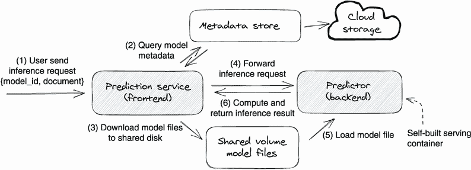

图 7.1 系统概述和模型服务端到端工作流程

浏览图 7.1 中显示的样本模型服务的系统设计，您可以看到完成预测请求需要六个步骤。让我们逐步浏览图中编号的每一步：

1.  用户向预测服务（前端组件）发送带有指定模型 ID 和文本字符串（即，`document`）的预测请求。模型 ID 是训练服务生成的唯一标识符，用于识别其生成的每个模型。

1.  前端服务通过搜索模型 ID 从元数据存储中获取模型元数据。对于每个成功的模型训练，训练服务将模型文件保存到云存储中，并将模型元数据（模型 ID、模型版本、名称和 URL）保存到元数据存储中；这就是为什么我们可以在元数据存储中找到模型信息的原因。

1.  如果模型文件尚未下载，前端组件将会将其下载到共享磁盘卷上。

1.  前端组件将推理请求转发给后端预测器。

1.  后端预测器通过从共享磁盘卷上的模型文件中读取，将意图分类模型加载到内存中。

1.  后端预测器执行模型，对给定的文本字符串进行预测，并将预测结果返回给前端组件。

### 7.1.3 前端服务

现在，让我们重点关注前端服务。前端服务主要由三个组件组成：Web 接口、预测器管理器和预测器后端客户端（`CustomGrpcPredictorBackend`）。这些组件响应主机公共 gRPC 模型提供 API，并管理后端预测器的连接和通信。图 7.2 显示了前端服务的内部结构以及在接收到预测请求时的内部工作流程。

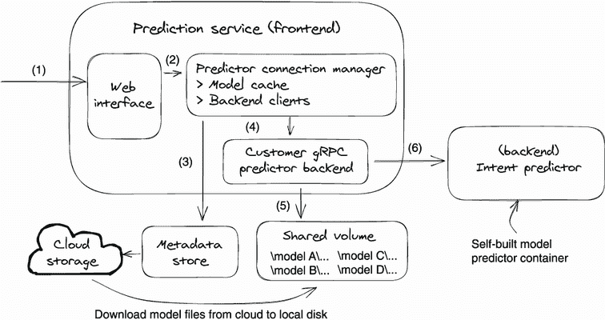

图 7.2 前端服务设计和模型提供工作流程

接下来我们考虑在图 7.2 中描述的模型提供工作流程中的意图预测场景，并应用刚刚复习过的六个步骤：

1.  用户向 Web 接口发送包含模型 ID A 的意图预测请求。

1.  Web 接口调用预测器连接管理器来提供此请求。

1.  预测器连接管理器通过查询元数据存储获取模型元数据，查询的条件为模型 ID 等于 A；返回的模型元数据包含模型算法类型和模型文件 URL。

1.  基于模型算法类型，预测器管理器选择合适的预测器后端客户端来处理请求。在这种情况下，它选择了 `CustomGrpcPredictorBackend`，因为我们正在演示用于意图分类的自建模型提供容器。

1.  `CustomGrpcPredictorBackend` 客户端首先在模型 A 的共享模型文件磁盘中检查模型文件的存在。如果在以前没有下载过模型，则使用模型 URL（从模型元数据中获取）从云存储中下载模型文件到共享文件磁盘。

1.  `CustomGrpcPredictorBackend` 客户端然后调用在服务配置文件中与该后端客户端预注册的模型预测器。在此示例中，`CustomGrpcPredictorBackend` 将调用我们自建的预测器，即意图预测器，将在第 7.1.4 节中讨论。

现在我们已经审查了系统设计和工作流程，让我们考虑主要组件的实际代码实现，包括 Web 接口（预测 API）、预测器连接管理器、预测器后端客户端和意图预测器。

前端服务模型服务代码演示

以下代码清单突出了图 7.2 中提到的预测工作流的核心实现。你也可以在 `src/main/` `java/org/orca3/miniAutoML/prediction/PredictionService.java` 找到完整的实现。

7.2 前端服务预测工作流

```py
public void predict(PredictRequest request, .. .. ..) {
  .. .. ..
  String runId = request.getRunId();                        ❶

  if (predictorManager.containsArtifact(runId)) {           ❷
    artifactInfo = predictorManager.getArtifact(runId);
  } else {
    try {
       artifactInfo = msClient.getArtifact(                 ❷
                GetArtifactRequest.newBuilder()
               .setRunId(runId).build());
     } catch (Exception ex) {
       .. .. .. 
    }
  } 

 # Step 4, pick predictor backend client by model algorithm type
  PredictorBackend predictor;
  if (predictorManager.containsPredictor(
        artifactInfo.getAlgorithm())) {

    predictor = predictorManager.getPredictor(              ❸
        artifactInfo.getAlgorithm());
  } else {
   .. .. ..
  }

  # Step 5, use the selected predictor client to download the model files
  predictor.downloadModel(runId, artifactInfo);             ❹

  # Step 6, use the selected predictor client to call
 # its backend predictor for model serving
  String r = predictor.predict(                             ❺
     artifactInfo, request.getDocument());                  ❺
  .. .. ..
}
```

❶ 获取所需的模型 ID

❷ 从元数据存储中获取模型元数据

❸ 根据模型算法类型选择后端预测器

❹ 下载模型文件

❺ 调用后端预测器运行模型推理

预测 API

前端服务仅提供一个 API — `Predict` — 用于发出预测请求。该请求有两个参数，`runId` 和 `document`。`runId` 不仅用于在训练服务（第三章）中引用模型训练运行，还可以用作引用模型的模型 ID。`document` 是客户想要运行预测的文本。

通过使用 `Predict` API，用户可以指定一个意图模型（带有 `runId`）来预测给定文本字符串（`document`）的意图。以下清单显示了 `Predict` API 的 gRPC 合同（`grpc-contract/src/main/proto/prediction_service .proto`）。

7.3 预测服务 gRPC 接口

```py
service PredictionService {
 rpc Predict(PredictRequest) returns (PredictResponse);
}

message PredictRequest {
 string runId = 3;
 string document = 4;
}

message PredictResponse {
 string response = 1;
}
```

预测器连接管理器

前端服务的一个重要作用是路由预测请求。给定一个预测请求，前端服务需要根据请求中所需的模型算法类型找到正确的后端预测器。这个路由是在 `PredictorConnectionManager` 中完成的。在我们的设计中，模型算法和预测器的映射是预定义的在环境属性中。当服务启动时，`PredictorConnectionManager` 将读取映射，这样服务就知道为哪种模型算法类型使用哪个后端预测器。

尽管在这个示例中我们只是演示了我们自己构建的意图分类预测器，`PredictorConnectionManager` 可以支持任何其他类型的后端预测器。让我们看一下以下清单（`config/config-docker-docker.properties`）来看看模型算法和预测器映射是如何配置的。

7.4 模型算法和预测器映射配置

```py
# the algorithm and predictor mapping can be defined in 
# either app config or docker properties

# enable algorithm types
ps.enabledPredictors=intent-classification

# define algorithm and predictors mapping
# predictor.<algorithm_type>.XXX = predictor[host, port, type]
predictors.intent-classification.host= \      ❶
  Intent-classification-predictor             ❶
predictors.intent-classification.port=51001
predictors.intent-classification.techStack=customGrpc
```

❶ 将意图分类预测器映射到意图分类算法

现在，让我们回顾代码清单 7.5，看看预测器管理器如何读取算法和预测器映射，并使用该信息初始化预测器后端客户端发送预测请求。完整的实现位于 `prediction-service/src/main/java/org/orca3/miniAutoML/prediction/PredictorConnectionManager.java`。

7.5 预测器管理器加载算法和预测器映射

```py
public class PredictorConnectionManager {
  private final Map<String, List<ManagedChannel>> 
    channels = new HashMap<>();

  private final Map<String, PredictorBackend>                ❶
    clients = new HashMap<>();

  private final Map<String, GetArtifactResponse>             ❷
    artifactCache;

  // create predictor backend objects for 
 // the registered algorithm and predictor
  public void registerPredictor(String algorithm, 
       Properties properties) {

    String host = properties.getProperty(                    ❸
       String.format(“predictors.%s.host”, algorithm));

    int port = Integer.parseInt(properties.getProperty(      ❸
       String.format(“predictors.%s.port”, algorithm)));

    String predictorType = properties.getProperty(           ❸
       String.format(“predictors.%s.techStack”, algorithm));

    ManagedChannel channel = ManagedChannelBuilder
       .forAddress(host, port)
       .usePlaintext().build();

    switch (predictorType) {
      .. ..
      case “customGrpc”:                                     ❹
      default:
        channels.put(algorithm, List.of(channel));
        clients.put(algorithm, new CustomGrpcPredictorBackend(
          channel, modelCachePath, minioClient));
      break;
     }
  }

  .. .. ..
}
```

❶ 预测器后端映射的算法

❷ 模型元数据缓存; 键字符串为模型 ID。

❸ 从配置中读取算法和预测器映射

❹ 创建预测器后端客户端并将其保存在内存中

在列表 7.5 中，我们可以看到 `PredictorConnectionManager` 类提供了`registerPredictor`函数来注册预测器。它首先从属性中读取算法和预测器映射信息，然后创建实际的预测器后端客户端`CustomGrpcPredictorBackend`与后端意图预测器容器通信。

您还可以注意到 `PredictorConnectionManager` 类有几个缓存，如模型元数据缓存（`artifactCache`）和模型后端预测器客户端（`clients`）。这些缓存可以极大地提高模型服务的效率。例如，模型元数据缓存（`artifactCache`）可以通过避免调用元数据存储服务来减少呼叫已经下载的模型的服务请求响应时间。

预测器后端客户端

预测器客户端是前端服务用于与不同的预测器后端进行通信的对象。按设计，每种类型的预测器后端都支持其自己的模型类型，并且它有自己的用于通信的客户端，该客户端在`PredictorConnectionManager`中创建并存储。每个预测器后端客户端都会继承一个名为`PredictorBackend`的接口，如下列表所示。

列表 7.6 预测器后端接口

```py
public interface PredictorBackend {
   void downloadModel(String runId, 
           GetArtifactResponse artifactResponse);

   String predict(GetArtifactResponse artifact, String document);

   void registerModel(GetArtifactResponse artifact);
}
```

`downloadMode`、`predict`和`registerModel`三个方法都是不言自明的。每个客户端实现这些方法来下载模型并向其注册的后端服务发送预测请求。`GetArtifactResponse`参数是从元数据存储中获取的模型元数据对象。

在这个（意图预测器）示例中，预测器后端客户端是`CustomGrpcPredictorBackend`。您可以在`prediction-service/src/main/java/org/orca3/miniAutoML/prediction/CustomGrpcPredictorBackend.java`中找到详细的实现。下面的代码片段展示了该客户端如何使用 gRPC 协议将预测请求发送到自建的意图预测器容器：

```py
// calling backend predictor for model serving
public String predict(GetArtifactResponse artifact, String document) {
   return stub.predictorPredict(PredictorPredictRequest
       .newBuilder().setDocument(document)    ❶
       .setRunId(artifact.getRunId())         ❷
       .build()).getResponse();
}
```

❶ 模型的文本输入

❷ 模型 ID

### 7.1.4 意图分类预测器

我们已经看到了前端服务及其内部路由逻辑，现在让我们来看看这个示例预测服务的最后一部分：后端预测器。为了向您展示一个完整的深度学习用例，我们实现了一个预测器容器来执行第三章训练的意图分类模型。

我们可以将这个自建的意图分类预测器视为一个独立的微服务，可以同时为多个意图模型提供服务。它具有 gRPC web 接口和模型管理器。模型管理器是预测器的核心；它执行多项任务，包括加载模型文件，初始化模型，将模型缓存在内存中，并使用用户输入执行模型。图 7.3 显示了预测器的设计图和预测器内的预测工作流程。

让我们使用图 7.3 中的模型 A 的意图预测请求来考虑工作流程。它按以下步骤运行：

1.  前端服务中的预测客户端调用预测器的 web gRPC 接口，使用模型 A 运行意图预测。

1.  请求调用模型管理器。

1.  模型管理器从共享磁盘卷加载模型 A 的模型文件，初始化模型，并将其放入模型缓存中。模型文件应该已经由前端服务放置在共享磁盘卷上。

1.  模型管理器使用转换器的帮助执行模型 A，对输入和输出数据进行预处理和后处理。

1.  返回预测结果。

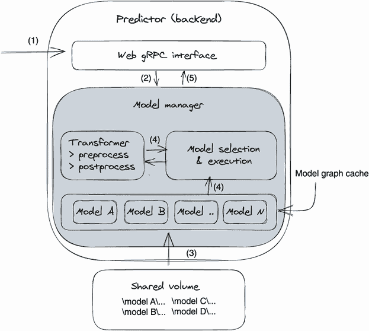

图 7.3 后端意图预测器设计和预测工作流程

接下来，让我们看看工作流程中提到的组件的实际实现。

预测 API

意图预测器有一个 API — `PredictorPredict`（见代码列表 7.7）。它接受两个参数，`runId` 和 `document`。`runId` 是模型 ID，`document` 是一个文本字符串。你可以在 `grpc-contract/src/main/proto/` `prediction_service.proto` 中找到完整的 gRPC 合同。

列表 7.7 意图预测器 gRPC 接口

```py
service Predictor {
 rpc PredictorPredict(PredictorPredictRequest) returns (PredictorPredictResponse);
}

message PredictorPredictRequest {
 string runId = 1;
 string document = 2;
}

message PredictorPredictResponse {
 string response = 1;
}
```

你可能注意到预测器 API 与前端 API（代码列表 7.2）相同；这是为了简单起见。但在实际应用中，它们通常是不同的，主要是因为它们被设计用于不同的目的。预测器的 predict API 设计有利于模型执行，而前端的 predict API 设计有利于客户和业务的需求。

模型文件

我们在模型训练服务（第三章）中生成的每个意图分类模型都有三个文件。`manifest.json` 文件包含模型元数据和数据集标签；预测器需要这些信息将模型预测结果从整数转换为有意义的文本字符串。`model.pth` 是模型的学习参数；预测器将读取这些网络参数以设置模型的神经网络以进行模型服务。`vocab.pth` 是模型训练中使用的词汇文件，这也是服务所必需的，因为我们需要它将用户输入（字符串）转换为模型输入（十进制数）。让我们来看一下示例意图模型：

```py
├── manifest.json                          ❶
├── model.pth                              ❷
└── vocab.pth                              ❸

// A sample manifest.json file 
{
  "Algorithm": "intent-classification",    ❹
  "Framework": "Pytorch",
  "FrameworkVersion": "1.9.0",
  "ModelName": "intent",
  "CodeVersion": "80bf0da",
  "ModelVersion": "1.0",
  "classes": {                             ❺
    "0": "cancel",
    "1": "ingredients_list",
    "2": "nutrition_info",
    "3": "greeting",
     .. .. ..
}
```

❶ 模型元数据和数据集标签

❷ 模型权重文件

❸ 词汇文件

❹ 模型元数据

❺ 数据集标签

当保存 PyTorch 模型时，有两种选择：序列化整个模型或仅序列化学习参数。第一种选项序列化整个模型对象，包括其类和目录结构，而第二种选项仅保存模型网络的可学习参数。

根据马修·英卡威奇的文章“PyTorch: Saving and Loading Models”（[`mng.bz/zm9B`](http://mng.bz/zm9B)），PyTorch 团队建议仅保存模型的学习参数（模型的`state_dict`）。如果我们保存整个模型，序列化数据将与保存模型时使用的特定类和确切目录结构绑定。模型类本身不会被保存；而是保存包含类的文件。因此，在加载时，当在其他项目中使用或进行重构后，序列化的模型代码可能会以各种方式中断。

为此，我们只保存模型的`state_dict`（学习参数）作为训练后的模型文件；在这个例子中，它是`model.pth`文件。我们使用以下代码保存它：`torch.save(model.state_dict(), model_local_path)`。因此，预测器需要知道模型的神经网络架构（见代码清单 7.8）来加载模型文件，因为模型文件只是`state_dict`——模型网络的参数。

清单 7.8（`predictor/predict.py`）显示了我们用来在预测器中加载模型文件`model.pth`（仅参数）的模型架构。服务中的模型执行代码源自模型训练代码。如果你将以下清单中的模型定义与我们训练代码中的`TextClassificationModel`类（`training-code/text-classification/train.py`）进行比较，你会发现它们是相同的。这是因为模型服务本质上是模型训练运行。

清单 7.8 模型的神经网络（架构）

```py
class TextClassificationModel(nn.Module):

  def __init__(self, vocab_size, embed_dim,   ❶
      fc_size, num_class):                    ❶

    super(TextClassificationModel, self).__init__()
    self.embedding = nn.EmbeddingBag(vocab_size, embed_dim, sparse=True)
    self.fc1 = nn.Linear(embed_dim, fc_size)
    self.fc2 = nn.Linear(fc_size, num_class)
    self.init_weights()

  def forward(self, text, offsets):
    embedded = self.embedding(text, offsets)
    return self.fc2(self.fc1(embedded))
```

❶ 定义模型架构

你可能会想知道训练代码和模型服务代码是否现在合并了。当训练代码发生变化时，似乎预测器中的模型服务代码也需要调整。这只是部分正确；上下文往往会决定模型服务如何受到模型训练算法变化的影响。以下是这种关系的一些微妙之处。

首先，训练代码和服务代码只需在神经网络架构和输入/输出数据模式上同步。其他模型训练变化，比如训练策略、超参数调整、数据集拆分和增强，不会影响服务，因为它们会产生模型权重和偏置文件。其次，在训练时应引入模型版本控制。在实践中，每次模型训练或重新训练都会给输出模型分配一个新的模型版本。所以要解决的问题是如何为模型的不同版本提供服务。

这个示例服务不处理模型版本管理。但是，在第 7.5 节和第八章中，我们将深入讨论模型版本的元数据管理。我们在这里只是描述了大致的想法。

如果你正在使用类似的模型服务方法，并且有一个自定义的预测器后端，你需要准备多个版本的预测器后端，以匹配使用不同神经网络架构训练的模型。在发布模型时，训练代码的版本、服务代码的版本以及模型文件的版本需要作为模型元数据的一部分相关联，并保存在元数据存储中。因此，在提供服务时，预测服务（前端服务）可以搜索元数据存储，以确定应将请求路由到给定模型的哪个预测器版本。

如果你使用模型服务器方法，使用不同版本的模型变得更加容易，因为这种方法打破了服务代码（模型执行代码）和训练代码之间的依赖关系。你可以在第 7.2 节中看到一个具体的例子。

注意：正如我们在第六章（第 6.1.3 节）中提到的，模型训练和服务都利用相同的机器学习算法，但是在不同的执行模式下：学习和评估。然而，我们想再次澄清这个概念。理解训练代码、服务代码和模型文件之间的关系是服务系统设计的基础。

模型管理器

模型管理器是这个意图预测器的关键组件。它托管一个内存模型缓存，加载模型文件，并执行模型。下面的清单（`predictor/predict.py`）显示了模型管理器的核心代码。

清单 7.9 意图预测器模型管理器

```py
class ModelManager:
  def __init__(self, config, tokenizer, device):
    self.model_dir = config.MODEL_DIR
    self.models = {}                                      ❶

  # load model file and initialize model
  def load_model(self, model_id):
    if model_id in self.models:
      return

    # load model files, including vocabulary, prediction class mapping.
    vacab_path = os.path.join(self.model_dir, model_id, "vocab.pth")
    manifest_path = os.path.join(self.model_dir, model_id, "manifest.json")
    model_path = os.path.join(self.model_dir, model_id, "model.pth")

    vocab = torch.load(vacab_path)
    with open(manifest_path, 'r') as f:
    manifest = json.loads(f.read())
    classes = manifest['classes']

    # initialize model graph and load model weights
    num_class, vocab_size, emsize = len(classes), len(vocab), 64
    model = TextClassificationModel(vocab_size, emsize, 
       self.config.FC_SIZE, num_class).to(self.device)
    model.load_state_dict(torch.load(model_path))
    model.eval()

    self.models[self.model_key(model_id)] = model        ❷
self.models[self.model_vocab_key(model_id)]              ❷
  ➥ = vocab                                             ❷
self.models[self.model_classes(model_id)]                ❷
  ➥ = classes                                           ❷

  # run model to make prediction
  def predict(self, model_id, document):
    # fetch model graph, dependency and 
    # classes from cache by model id 
    model = self.models[self.model_key(model_id)]
    vocab = self.models[self.model_vocab_key(model_id)]
    classes = self.models[self.model_classes(model_id)]

    def text_pipeline(x):
      return vocab(self.tokenizer(x))

    # transform user input data (text string) 
 # to model graph’s input
    processed_text = torch.tensor(text_pipeline(document), dtype=torch.int64)
    offsets = [0, processed_text.size(0)]
    offsets = torch.tensor(offsets[:-1]).cumsum(dim=0)

    val = model(processed_text, offsets)                ❸

    # convert prediction result from an integer to 
 # a text string (class)
    res_index = val.argmax(1).item()
    res = classes[str(res_index)]
    print("label is {}, {}".format(res_index, res))
    return res
```

❶ 将模型托管在内存中

❷ 将模型图、内存中的依赖项和类缓存

❸ 运行模型以获取预测结果

意图预测器预测请求工作流程

你已经了解了意图预测器的主要组件，现在让我们来看看这个预测器内部的端到端工作流程。首先，我们通过将 `PredictorServicer` 注册到 gRPC 服务器来公开预测 API，这样前端服务就可以远程与预测器通信。其次，当前端服务调用 `PredictorPredict` API 时，模型管理器将加载模型到内存中，运行模型，并返回预测结果。清单 7.10 突出了上述工作流程的代码实现。你可以在 `predictor/predict.py` 中找到完整的实现。

清单 7.10 意图预测器预测工作流程

```py
def serve():
  .. .. ..
  model_manager = ModelManager(config, 
    tokenizer=get_tokenizer('basic_english'), device="cpu")
  server = grpc.server(futures.
    ThreadPoolExecutor(max_workers=10))                         ❶

  prediction_service_pb2_grpc.add_PredictorServicer_to_server(
    PredictorServicer(model_manager), server)                   ❷
  .. .. ..

class PredictorServicer(prediction_service_pb2_grpc.PredictorServicer):
  def __init__(self, model_manager):
    self.model_manager = model_manager

 # Serving logic 
  def PredictorPredict(self, request, context: grpc.ServicerContext):

 # load model 
    self.model_manager.load_model(model_id=request.runId)
    class_name = self.model_manager.                            ❸
      predict(request.runId, request.document)
    return PredictorPredictResponse(response=json.dumps({'res': class_name}))
```

❶ 启动 gRPC 服务器

❷ 将模型服务逻辑注册到公共 API

❸ 进行预测

### 7.1.5 模型逐出

示例代码未涵盖模型淘汰——即从预测服务的内存空间中淘汰不经常使用的模型文件。在设计中，对于每个预测请求，预测服务将从元数据存储中查询和下载请求模型，然后从本地磁盘读取和初始化模型到内存中。对于一些模型来说，这些操作是耗时的。

为了减少每个模型预测请求的延迟，我们的设计在模型管理器组件（内存中）中缓存模型图，以避免模型加载已使用的模型。但想象一下，我们可以继续训练新的意图分类模型并对其进行预测。这些新产生的模型将继续加载到模型管理器的模型缓存中。最终，预测器将耗尽内存。

为了解决这些问题，模型管理器需要升级以包含模型淘汰功能。例如，我们可以引入 LRU（最近最少使用）算法来重建模型管理器的模型缓存。借助 LRU 的帮助，我们可以仅保留最近访问的模型在模型缓存中，并在当前加载的模型超过内存阈值时淘汰最少访问的模型。

## 7.2 TorchServe 模型服务器示例

在本节中，我们将向您展示使用模型服务器方法构建预测服务的示例。更具体地说，我们使用了 TorchServe 后端（一个为 PyTorch 模型构建的模型服务工具）来替换上一节（7.1.4）中讨论的自建预测器。

为了与第 7.1 节中的模型服务方法进行公平比较，我们通过重新使用上一节中展示的前端服务来开发此模型服务器方法示例。更确切地说，我们只添加了另一个预测器后端，仍然使用前端服务、gRPC API 和意图分类模型来演示相同的端到端预测工作流程。

第 7.1.4 节的意图预测器和 TorchServe 预测器（模型服务器方法）之间有一个很大的区别。相同的预测器可以为任何 PyTorch 模型提供服务，而不管其预测算法如何。

### 7.2.1 玩转服务

因为这个模型服务器示例是在上一个示例服务的基础上开发的，所以我们以相同的方式与预测服务交互。唯一的区别是我们启动了一个 TorchServe 后端（容器），而不是启动一个自建的意图预测器容器。代码清单 7.11 仅显示了启动服务和发送意图预测请求的关键步骤。要在本地运行实验，请完成附录 A（A.2 节）中的实验，并参考 `scripts/lab-006-model-serving-torchserve.sh` 文件（[`mng.bz/0yEN`](http://mng.bz/0yEN)）。

列表 7.11 启动预测服务并进行预测调用

```py
# step 1: start torchserve backend
docker run --name intent-classification-torch-predictor\
 --network orca3 --rm -d -p "${ICP_TORCH_PORT}":7070 \
 -p "${ICP_TORCH_MGMT_PORT}":7071 \
 -v "${MODEL_CACHE_DIR}":/models \                     ❶
 -v "$(pwd)/config/torch_server_config.properties": \
     /home/model-server/config.properties \
 pytorch/torchserve:0.5.2-cpu torchserve \             ❷
 --start --model-store /models                         ❸

# step 2: start the prediction service (the web frontend)
docker build -t orca3/services:latest -f services.dockerfile .
docker run --name prediction-service --network orca3 \
  --rm -d -p "${PS_PORT}":51001 \
  -v "${MODEL_CACHE_DIR}":/tmp/modelCache \            ❹
 orca3/services:latest  \
 prediction-service.jar

# step 3: make a prediction request, ask intent for “merry christmas”
grpcurl -plaintext 
  -d "{
    "runId": "${MODEL_ID}",
    "document": "merry christmas"
 }" 
 localhost:"${PS_PORT}" prediction.PredictionService/Predict
```

❶ 将本地目录挂载到 TorchServe 容器

❷ 启动 TorchServe

❸ 设置 TorchServe 从 /models 目录加载模型

❹ 设置预测服务的本地模型目录以下载模型

### 7.2.2 服务设计

此示例服务遵循图 7.1 中的相同系统设计；唯一的区别是预测器后端变成了 TorchServe 服务器。请参阅图 7.4 以获取更新后的系统设计。

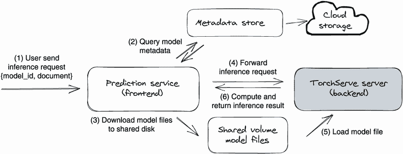

图 7.4 系统概述和模型服务端到端工作流程

从图 7.4 可以看出，模型服务工作流程与图 7.1 中的模型服务示例保持一致。用户调用预测服务的前端 API 发送模型服务请求；前端服务然后下载模型文件，并将预测请求转发到 TorchServe 后端。

### 7.2.3 前端服务

在第 7.1.3 节中，我们确认了前端服务可以通过在预测器连接管理器中注册预测器来支持不同的预测器后端。当预测请求到来时，预测器连接管理器将通过检查请求的模型算法类型将请求路由到适当的预测器后端。

遵循之前的设计，为了支持我们的新 TorchServe 后端，我们在前端服务中添加了一个新的预测器客户端（`TorchGrpcPredictorBackend`）来代表 TorchServe 后端；请参阅图 7.5 以获取更新后的系统设计。

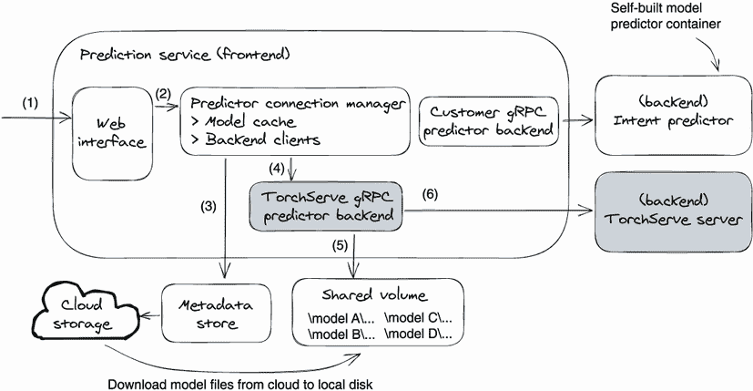

图 7.5 前端服务设计和模型服务工作流程

在图 7.5 中，添加了两个灰色的方框；它们分别是 TorchServe gRPC 预测器后端客户端（`TorchGrpcPredictorBackend`）和后端 TorchServe 服务器。`TorchGrpcPredictorBackend` 通过下载模型文件并向 TorchServe 容器发送预测请求进行响应。在这个示例中，TorchServe 后端将由预测器连接管理器选择，因为请求的模型元数据（在元数据存储中）将 TorchServe 定义为其预测器。

### 7.2.4 TorchServe 后端

TorchServe 是由 PyTorch 团队构建的用于提供 PyTorch 模型服务的工具。TorchServe 作为一个黑盒运行，它提供 HTTP 和 gRPC 接口用于模型预测和内部资源管理。图 7.6 可视化了我们在这个示例中如何使用 TorchServe 的工作流程。

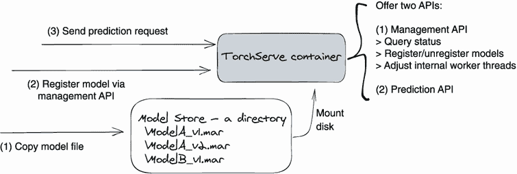

图 7.6 TorchServe 后端的模型服务工作流程：TorchServe 应用程序作为一个黑盒运行。

在我们的示例代码中，我们将 TorchServe 作为一个 Docker 容器运行，这是由 PyTorch 团队提供的，然后将本地文件目录挂载到容器中。这个文件目录作为 TorchServe 进程的模型存储。在图 7.6 中，我们分三步来运行模型预测。首先，我们将 PyTorch 模型文件复制到模型存储目录中。其次，我们调用 TorchServe 管理 API 将模型注册到 TorchServe 进程中。最后，我们调用 TorchServe API 来运行模型预测，对于我们来说，是意图分类模型。

跟第 7.1.4 节中的自构建意图预测器相比，TorchServe 要简单得多。我们甚至不需要编写任何代码就可以使模型服务正常运行，只需使用共享磁盘设置 Docker 容器即可。此外，TorchServe 不仅适用于意图分类算法，它不受任何特定训练算法的限制，只要模型是使用 PyTorch 框架训练的，TorchServe 就可以为其提供服务。

TorchServe 提供了极大的灵活性和便利性，但也有相关要求。TorchServe 要求操作员使用其独有的 API 发送模型服务请求，并要求模型文件以 TorchServe 格式打包。下面的两小节会详细介绍这些要求。

### 7.2.5 TorchServe API

TorchServe 提供了众多类型的 API，例如健康检查、模型解释、模型服务、工作线程管理和模型注册等。每个 API 都有 HTTP 和 gRPC 两种实现方式。由于 TorchServe 在其官网（[`pytorch.org/serve/`](https://pytorch.org/serve/)）和 GitHub 仓库（[`github.com/pytorch/serve`](https://github.com/pytorch/serve)）上都对 API 的协议和使用方式进行了详细的解释，你可以在那里找到具体的信息。在本小节中，我们将着重介绍我们在示例服务中使用的模型注册 API 和模型推理 API。

模型注册 API

由于 TorchServe 采用黑箱方式进行模型服务，所以在使用模型之前需要将其注册。具体来说，我们需要先将模型文件放到 TorchServe 的模型存储库中（即本地文件目录），但是 TorchServe 并不会自动加载该模型文件。我们需要向 TorchServe 注册模型文件和该模型的运行方法，以便 TorchServe 知道如何正常运行该模型。

在我们的代码示例中，我们使用了 TorchServe 的 gRPC 模型注册 API 来从预测服务中注册我们的意图模型，示例如下：

```py
public void registerModel(GetArtifactResponse artifact) {
  String modelUrl = String.format(MODEL_FILE_NAME_TEMPLATE,
        artifact.getRunId());

  String torchModelName = String.format(TORCH_MODEL_NAME_TEMPLATE,
            artifact.getName(), artifact.getVersion());
  ManagementResponse r = managementStub.registerModel(     ❶
           RegisterModelRequest.newBuilder()
             .setUrl(modelUrl)
             .setModelName(torchModelName)
             .build());

  # Assign resource (TorchServe worker) for this model
  managementStub.scaleWorker(ScaleWorkerRequest.newBuilder()
             .setModelName(torchModelName)
             .setMinWorker(1)
             .build());
}
```

❶ 通过提供模型文件和模型名称向 TorchServe 注册模型

TorchServe 模型文件中已经包含有模型的元数据，包括模型版本、模型运行时和模型服务入口。因此，在注册模型时，通常只需要在`registerModel`API 中设置模型文件名。除了模型注册之外，我们还可以使用`scaleWorker`API 来控制为该模型分配多少计算资源。

模型推理 API

TorchServe 为各种模型提供了统一的模型服务 API，使其使用起来非常简单。如果想要为模型的默认版本运行预测，只需向`/predictions/{model_name}`发送一个 REST 请求；如果想要为加载的特定版本的模型运行预测，则向`/predictions/{model_name}/{version}`发送 REST 请求。需要预测的内容以二进制格式输入到预测请求中。例如：

```py
# prediction with single input on model resnet-18
curl http:/ /localhost:8080/predictions/resnet-18 \
 -F "data=@kitten_small.jpg"
# prediction with multiple inputs on model squeezenet1_1
curl http:/ /localhost:8080/predictions/squeezenet1_1 \
 -F 'data=@docs/images/dogs-before.jpg' \
 -F 'data=@docs/images/kitten_small.jpg'
```

在我们的样本服务中，我们使用 gRPC 接口将预测请求发送到 TorchServe。代码清单 7.12 展示了 `TorchGrpcPredictorBackend` 客户端将预测请求从前端 API 调用转换为 TorchServe 后端 gRPC 调用。您可以在 `prediction-service/src/main/java/org/orca3/miniAutoML/prediction/TorchGrpcPredictorBackend.java` 找到 `TorchGrpcPredictorBackend` 的完整源代码。

清单 7.12 从前端服务调用 TorchServe 预测 API

```py
// call TorchServe gRPC prediction api
public String predict(GetArtifactResponse artifact, String document) {
  return stub.predictions(PredictionsRequest.newBuilder()
           .setModelName(String.format(TORCH_MODEL_NAME_TEMPLATE,
              artifact.getName(), artifact.getVersion()))
           .putAllInput(ImmutableMap.of("data",                         ❶
              ByteString.copyFrom(document, StandardCharsets.UTF_8)))
                .build()).getPrediction()
           .toString(StandardCharsets.UTF_8);
}
```

❶ 将文本输入转换为二进制格式以调用 TorchServe

### 7.2.6 TorchServe 模型文件

到目前为止，您已经看到了 TorchServe 模型服务的工作流程和 API。您可能想知道当 TorchServe 对其所服务的模型一无所知时，TorchServe 的模型服务是如何工作的。在第六章中，我们学到要服务一个模型，预测服务需要知道模型算法和模型输入/输出模式。与直觉相反，TorchServe 运行模型服务而不知道模型算法和模型输入/输出数据格式。诀窍在于 TorchServe 模型文件。

TorchServe 要求模型打包到一个特殊的 `.mar` 文件中。我们可以使用 `torch-model-archiver` CLI 或 `model_archiver` Python 库将 PyTorch 模型文件打包成一个 `.mar` 文件。

要归档 TorchServe 的 `.mar` 文件，我们需要提供模型名称、模型文件（`.pt` 或 `.pth`）和一个处理程序文件。处理程序文件是关键部分；它是一个定义处理自定义 TorchServe 推理逻辑的 Python 代码文件。因为 TorchServe 的模型包（`.mar` 文件）包含模型算法、模型数据和模型执行代码，而模型执行代码遵循 TorchServe 的预测接口（协议），所以 TorchServe 可以通过使用其通用预测 API 在不知道模型算法的情况下执行任何模型（`.mar` 文件）。

当 TorchServe 收到预测请求时，它首先会找到承载模型的内部工作进程，然后触发模型的处理程序文件来处理请求。处理程序文件包含四个逻辑部分：模型网络初始化、输入数据预处理、模型推理和预测结果后处理。为了使前面的解释更具体，让我们以我们的意图模型文件为例。

意图分类 `.mar` 文件

如果我们打开样本服务中意图模型的 `.mar` 文件，与我们在第 7.1.4 节中看到的模型文件相比，我们会看到额外添加了两个文件——`MANIFEST.json` 和 `torchserve_handler.py`。以下是意图 `.mar` 文件的文件夹结构：

```py
# intent.mar content
├── MAR-INF
│   └── MANIFEST.json          ❶
├── manifest.json              ❷
├── model.pth                  ❸
├── torchserve_handler.py      ❹
└── vocab.pth                  ❺

# MANIFEST.json, TorchServe .mar metadata 
{
 "createdOn": "09/11/2021 10:26:59",
 "runtime": "python",
 "model": {
   "modelName": "intent_80bf0da",
   "serializedFile": "model.pth",
   "handler": "torchserve_handler.py",
   "modelVersion": "1.0"
 },
 "archiverVersion": "0.4.2"
}
```

❶ TorchServe .mar 文件元数据

❷ 包含标签信息

❸ 模型权重文件

❹ 模型架构和模型服务逻辑

❺ 词汇文件，意图算法所需

`MANIFEST.json` 文件定义了模型的元数据，包括模型版本、模型权重、模型名称和处理程序文件。通过拥有`MANIFEST.json`文件，TorchServe 知道如何加载和运行预测任意模型，而不知道其实现细节。

TorchServe 处理程序文件

一旦模型在 TorchServe 中注册，TorchServe 将使用模型处理程序文件中的`handle(self`, `data`, `context)`函数作为模型预测的入口点。处理程序文件管理模型服务的整个过程，包括模型初始化、对输入请求的预处理、模型执行和对预测结果的后处理。

代码清单 7.13 强调了在该示例服务中使用的意图分类 .mar 文件的处理程序文件中定义的关键部分。您可以在我们的 Git 代码库中找到此文件，路径为`training-code/text-classification/torchserve_handler.py`。

列表 7.13 意图模型 TorchServe 处理文件

```py
class ModelHandler(BaseHandler):
   """
   A custom model handler implementation for serving 
   intent classification prediction in torch serving server.
   """

   # Model architecture 
   class TextClassificationModel(nn.Module):
       def __init__(self, vocab_size, embed_dim, fc_size, num_class):
           super(ModelHandler.TextClassificationModel, self)
➥ .__init__()
           self.embedding = nn.EmbeddingBag(vocab_size, 
➥ embed_dim, sparse=True)
           self.fc1 = nn.Linear(embed_dim, fc_size)
           self.fc2 = nn.Linear(fc_size, num_class)
           self.init_weights()

       def init_weights(self):
           .. .. ..

       def forward(self, text, offsets):
           embedded = self.embedding(text, offsets)
           return self.fc2(self.fc1(embedded))

   # Load dependent files and initialize model
   def initialize(self, ctx):

       model_dir = properties.get("model_dir")
       model_path = os.path.join(model_dir, "model.pth")
       vacab_path = os.path.join(model_dir, "vocab.pth")
       manifest_path = os.path.join(model_dir, "manifest.json")

       # load vocabulary
       self.vocab = torch.load(vacab_path)

       # load model manifest, including label index map.
       with open(manifest_path, 'r') as f:
           self.manifest = json.loads(f.read())
       classes = self.manifest['classes']

       # intialize model
       self.model = self.TextClassificationModel(
           vocab_size, emsize, self.fcsize, num_class).to("cpu")
       self.model.load_state_dict(torch.load(model_path))
       self.model.eval()
       self.initialized = True

 # Transform raw input into model input data.
   def preprocess(self, data):

       preprocessed_data = data[0].get("data")
       if preprocessed_data is None:
           preprocessed_data = data[0].get("body")

       text_pipeline = lambda x: self.vocab(self.tokenizer(x))

       user_input = " ".join(str(preprocessed_data))
       processed_text = torch.tensor(text_pipeline(user_input), 
            dtype=torch.int64)
       offsets = [0, processed_text.size(0)]
       offsets = torch.tensor(offsets[:-1]).cumsum(dim=0)
       return (processed_text, offsets)

   # Run model inference by executing the model with model input
   def inference(self, model_input):
       model_output = self.model.forward(model_input[0], model_input[1])
       return model_output

 # Take output from network and post-process to desired format
   def postprocess(self, inference_output):
       res_index = inference_output.argmax(1).item()
       classes = self.manifest['classes']
       postprocess_output = classes[str(res_index)]
       return [{"predict_res":postprocess_output}]

 # Entry point of model serving, invoke by TorchServe 
 # for prediction request 
   def handle(self, data, context):

       model_input = self.preprocess(data)
       model_output = self.inference(model_input)
       return self.postprocess(model_output)
```

从清单 7.13 中的`handle`函数开始，您将清楚地了解处理程序文件是如何执行模型服务的。`initialize`函数加载所有模型文件（权重、标签和词汇表）并初始化模型。`handle`函数是模型服务的入口点；它对二进制模型输入进行预处理，运行模型推断，对模型输出进行后处理，并返回结果。

在训练过程中打包 .mar 文件

当我们决定在模型服务中使用 TorchServe 时，最好在训练时生成 .mar 文件。另外，因为 TorchServe 处理程序文件包含模型架构和模型执行逻辑，通常是模型训练代码的一部分。

打包 .mar 文件有两种方法。首先，在模型训练完成后，我们可以运行`torch-model-archiver` CLI 工具，将模型权重打包成序列化文件，将依赖文件作为额外文件。其次，我们可以使用`model_ archiver` Python 库，在模型训练代码的最后一步生成 .mar 文件。以下代码片段是我们用于打包意图分类模型的示例：

```py
## Method one: package model by command line cli tool.
torch-model-archiver --model-name intent_classification --version 1.0 \
 --model-file torchserve_model.py --serialized-file \
    workspace/MiniAutoML/{model_id}/model.pth \
 --handler torchserve_handler.py --extra-files \
workspace/MiniAutoML/{model_id}/vocab.pth,
➥ workspace/MiniAutoML/{model_id}/manifest.json

## Method two: package model in training code.
model_archiver.archive(model_name=archive_model_name, 
  handler_file=handler, model_state_file=model_local_path,
  extra_files=extra_files, model_version=config.MODEL_SERVING_VERSION,
  dest_path=config.JOB_ID)
```

### 7.2.7 在 Kubernetes 中扩展规模

在我们的示例服务中，为了演示目的，我们运行单个 TorchServe 容器作为预测后端，但这在生产环境中并非如此。扩展 TorchServe 面临的挑战如下：

+   负载均衡器使 TorchServe 模型注册变得困难。在 TorchServe 中，模型文件需要先注册到 TorchServe 服务器，然后才能使用。但是在生产环境中，TorchServe 实例被放置在网络负载均衡器后，因此我们只能将预测请求发送到负载均衡器，让它将请求路由到随机的 TorchServe 实例。在这种情况下，由于我们无法指定哪个 TorchServe 实例为哪个模型提供服务，注册模型变得困难。负载均衡器向我们隐藏了 TorchServe 实例。

+   每个 TorchServe 实例都需要有一个用于加载模型的模型存储目录，并且在可以注册之前，模型文件需要放在模型存储目录中。有多个 TorchServe 实例会使模型文件复制变得难以管理，因为我们需要知道每个 TorchServe 实例的 IP 地址或 DNS 来复制模型文件。

+   我们需要在 TorchServe 实例之间平衡模型。让每个 TorchServe 实例加载每个模型文件是一个糟糕的想法；这将极大浪费计算资源。我们应该将负载均匀分配到不同的 TorchServe 实例上。

要解决这些挑战并扩展 TorchServe 后端，我们可以在 Kubernetes 中引入“边车”模式。图 7.7 描绘了整体概念。

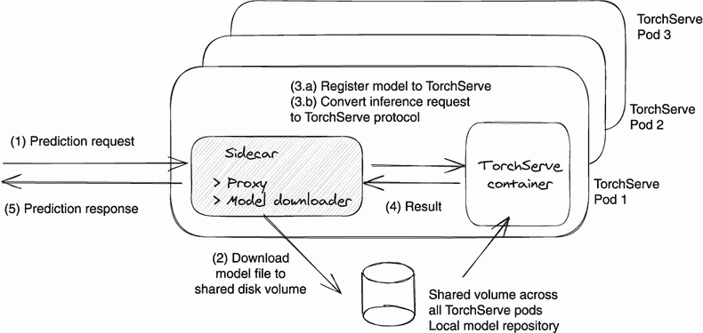

图 7.7 在 Kubernetes 中的 TorchServe pod 中添加代理容器以扩展 TorchServe。

图 7.7 中的建议是在每个 TorchServe pod 中与 TorchServe 容器一起添加代理容器（作为边车）。我们不直接调用 TorchServe API，而是将预测请求发送到代理容器。代理容器中的代理 API 将隐藏 TorchServe 模型管理细节，包括模型下载和模型注册。它将准备 TorchServe 容器以服务任意模型。

添加代理容器后，模型服务工作流程（图 7.7）如下。首先，预测请求落在代理容器上。其次，代理下载模型文件并将其输入到共享磁盘（模型存储库）。第三，代理将模型注册到 TorchServe 容器并将推理请求转换为 TorchServe 格式。第四，TorchServe 容器运行模型服务并将结果返回给代理。最后，代理容器将预测响应返回给用户。

通过添加代理容器，我们无需担心将预测请求发送到未注册该模型的 TorchServe 实例。代理容器（边车）将确保 TorchServe 容器准备好处理任何预测请求，方法是将模型文件复制到模型存储库并注册模型。这也简化了资源管理工作，因为现在我们可以简单地依赖负载均衡器将预测负载（模型）在 TorchServe pod 之间分配。此外，通过在所有 TorchServe pod 之间共享磁盘，我们可以为所有 TorchServe 实例共享模型存储库，从而减少了模型下载时间并节省了网络带宽。

边车模式：运行模型服务器的常用方法。

在第 7.4 节中，我们将介绍其他几种模型服务器方法，例如 TensorFlow serving 和 Triton。尽管这些模型服务器的实现方式不同，但它们的设计思想是相似的。它们都采用黑盒方法，并需要特定的模型格式和一些模型管理来启用模型服务。

图 7.7 中的旁路模式是在 Kubernetes pod 中运行这些不同模型服务器容器的常见解决方案。代理容器封装了模型服务器的所有特殊要求，并且只暴露通用模型服务 API。

## 7.3 模型服务器 vs. 模型服务

在设计模型服务应用程序时，选择模型服务器方法和模型服务方法之间是我们需要做出的第一个决定。当我们选择不当时，我们的服务应用程序要么难以使用和维护，要么构建所需时间过长。

我们已经在第六章（第 6.2 节和第 6.3 节）中回顾了这两种方法之间的差异，但这是一个非常关键的选择，值得再次审查。现在你已经看到了每种方法的具体示例，这些想法可能更容易理解。

通过在第 7.1 节和第 7.2 节中讨论的两个示例服务，可以清楚地看出，模型服务器方法避免了为特定模型类型构建专用后端预测器的工作量。相反，它可以直接使用，并且可以为任意模型提供服务，而不管模型实现了哪种算法。因此，模型服务器方法似乎应该始终是最佳选择。但这并不是真的；选择模型服务器或模型服务应该取决于用例和业务需求。

对于单一应用场景，在实践中，模型服务方法更容易构建和维护。模型服务后端预测器相当容易构建，因为模型服务代码是训练代码的简化版本。这意味着我们可以轻松地将模型训练容器转换为模型服务容器。一旦构建完成，模型服务方法更容易维护，因为我们完全拥有代码，并且工作流程简单。对于模型服务器方法，无论我们选择开源、预构建的模型服务器还是构建自己的服务器，设置系统的过程都很复杂。要学会并运营和维护系统需要花费大量的精力。

对于模型服务平台场景，系统需要支持多种不同类型的模型时，模型服务器方法无疑是最佳选择。当你为 500 种不同类型的模型构建模型服务系统时，如果选择模型服务器方法，你只需要一个单一类型的预测器后端来支持所有模型。相比之下，使用模型服务方法，你将需要 500 种不同的模型预测器！管理计算资源和进行所有这些预测器的维护工作非常困难。

我们的建议是，当你初学时使用模型服务方法，因为它更简单、更容易。当你需要在你的服务系统中支持超过 5 到 10 种类型的模型或应用时，你可以转向模型服务器方法。

## 7.4 开源模型服务工具巡回

有很多开源的模型服务工具可以使用。这些选择非常多，但是选择这么多有时会让人感到困惑。为了帮助您更轻松地做出选择，我们将向您介绍一些流行的模型服务工具，包括 TensorFlow Serving、TorchServe、Triton 和 KServe。所有这些工具都可以立即使用，并适用于生产用例。

因为这里描述的每一个工具都有详尽的文档，所以我们将保持讨论在一个通用的层面，只看它们的总体设计、主要特征和适当使用情况。这些信息应该足以作为一个起点，让你自己深入探索。

### 7.4.1 TensorFlow Serving。

TensorFlow Serving ([`www.tensorflow.org/tfx/guide/serving`](https://www.tensorflow.org/tfx/guide/serving)) 是一个可自定义的独立网页系统，用于在生产环境中提供 TensorFlow 模型。TensorFlow Serving 采用模型服务器方法；它可以使用相同的服务器架构和 API 为所有类型的 TensorFlow 模型提供服务。

特征。

TensorFlow Serving 提供以下特点：

+   可以为多个模型或相同模型的多个版本提供服务。

+   与 TensorFlow 模型具有开箱即用的整合。

+   自动发现新的模型版本，支持不同的模型文件源。

+   具有统一的 gRPC 和 HTTP 端点，用于模型推断。

+   支持批量预测请求和性能调优。

+   具有可扩展的设计，可以在版本策略和模型加载上进行自定义。

高级架构。

在 TensorFlow Serving 中，一个模型由一个或多个可用服务程序组成。可用服务程序是用于执行计算的基础对象（例如查找或推断）；它是 TensorFlow Serving 中的中心抽象。来源是用于查找和提供可用服务程序的插件模块。装载器标准是用于装载和卸载可用服务程序的 API。管理器处理可用服务程序的整个生命周期，包括加载、卸载和提供可用服务程序。

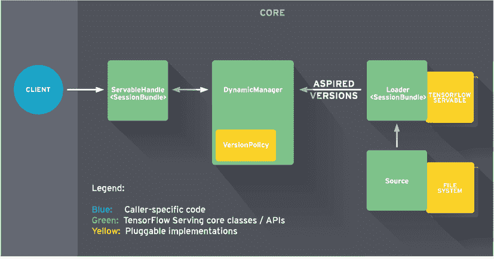

图 7.8 显示了 TensorFlow Serving 的架构和模型服务的生命周期。蓝色 = 最深的灰色；绿色 = 较浅的灰色；黄色 = 最浅的灰色。（来源：TensorFlow；[`mng.bz/KlNj`](http://mng.bz/KlNj)）

图 7.8 说明了向客户提供可提供服务的工作流程。首先，源插件为特定的可用服务程序创建一个加载器，加载器包含加载可用服务程序的元数据。第二，源从文件系统（模型库）中找到一个可用服务程序；它通知 DynamicManager 可用服务程序的版本和加载器。第三，基于预定义的版本策略，DynamicManager 确定是否加载模型。最后，客户端发送一个预测请求给可用服务程序，DynamicManager 返回一个句柄，以便客户端可以执行模型。

TensorFlow Serving 模型文件。

TensorFlow Serving 要求模型以 SavedModel ([`mng.bz/9197`](http://mng.bz/9197)) 格式保存。我们可以使用 `tf.saved_model.save(model,` `save_path)` API 来实现这个目的。一个保存的模型是一个包含了序列化签名和运行它们所需的状态的目录，包括变量值和词汇表。例如，一个保存的模型目录有两个子目录，`assets` 和 `variables`，以及一个文件，`saved_model.pb`。

assets 文件夹包含了 TensorFlow 图使用的文件，比如用于初始化词汇表的文本文件。variables 文件夹包含了训练检查点。`saved_model.pb` 文件存储了实际的 TensorFlow 程序，或者说模型，以及一组命名的签名，每个签名标识了一个接受张量输入并产生张量输出的函数。

模型服务

因为 TensorFlow 的 SavedModel 文件可以直接加载到 TensorFlow Serving 进程中，所以运行模型服务非常简单。一旦服务进程启动，我们可以将模型文件复制到 TensorFlow Serving 的模型目录中，然后立即发送 gRPC 或 REST 预测请求。让我们来看下面的预测示例：

```py
# 1\. Save model in training code 
MODEL_DIR='tf_model'
version = "1"
export_path = os.path.join(MODEL_DIR, str(version))
model.save(export_path, save_format="tf")

# 2\. Start tensorflow serving service locally as a docker container
docker run -p 8501:8501 
--mount type=bind,source=/workspace/tf_model,target=/models/model_a/ 
-e MODEL_NAME=model_a -t tensorflow/serving
--model_config_file_poll_wait_seconds=60
--model_config_file=/models/model_a/models.config 

# 3\. Send predict request to local tensorflow serving docker container 
# The request url pattern to call a specific version of a model is
   /v1/models/<model name>/versions/<version number> 
json_response = requests.post('http:/ /localhost:8501/
 ➥ v1/models/model_a/versions/1:predict', 
  data=data, headers=headers)
```

为了将多个模型和同一模型的多个版本加载到服务服务器中，我们可以在模型配置中配置模型的版本，如下所示：

```py
model_config_list {
  config{
    name: 'model_a'
    base_path: '/models/model_a/'
    model_platform: 'tensorflow'
    model_version_policy{
      specific{
        versions:2    ❶
        versions:3    ❷
      }
    }
  }
  config{
    name: 'model_b'
    base_path: '/models/model_b/'
    model_platform: 'tensorflow'
  }
}
```

❶ 在 /models/model_a/versions/2 找到模型 v2

❷ 在 /models/model_a/versions/3 找到模型 v3

在这个配置中，我们定义了两个模型，`model_a` 和 `model_b`。因为 `model_a` 有一个 `model_version_policy`，所以两个版本（v2 和 v3）都被加载并可以提供请求服务。默认情况下，模型的最新版本将被提供服务，所以当检测到 `model_b` 的新版本时，旧版本将被新版本替换。

回顾

TensorFlow Serving 是用于 TensorFlow 模型的生产级模型服务解决方案；它支持 REST、gRPC、GPU 加速、小批量处理和边缘设备上的模型服务。虽然 TensorFlow Serving 在高级指标、灵活的模型管理和部署策略方面存在不足，但如果你只有 TensorFlow 模型的话，它仍然是一个不错的选择。

TensorFlow Serving 的主要缺点是它是一个供应商锁定的解决方案；它只支持 TensorFlow 模型。如果你正在寻找一个训练框架无关的方法，那么 TensorFlow Serving 将不是你的选择。

### 7.4.2 TorchServe

TorchServe ([`pytorch.org/serve/`](https://pytorch.org/serve/)) 是一个性能出色、灵活且易于使用的工具，用于为 PyTorch eager 模式和 torchscripted 模型提供服务（torchscripted 模型是 PyTorch 模型的一种中间表示，可以在高性能环境（如 C++）中运行）。与 TensorFlow Serving 类似，TorchServe 采用模型服务器方法为所有类型的 PyTorch 模型提供服务，并提供统一的 API。不同之处在于 TorchServe 提供了一组管理 API，使模型管理非常方便灵活。例如，我们可以以编程方式注册和注销模型或模型的不同版本。我们还可以为模型和模型的不同版本扩展和缩小服务工作程序。

高层架构

一个 TorchServe 服务器由三个组件组成：前端、后端和模型存储。前端处理 TorchServe 的请求/响应。它还管理模型的生命周期。后端是一组负责在模型上运行实际推断的模型工作程序。模型存储是一个包含所有可加载模型的目录；它可以是云存储文件夹或本地主机文件夹。图 7.9 显示了 TorchServing 实例的高级架构。

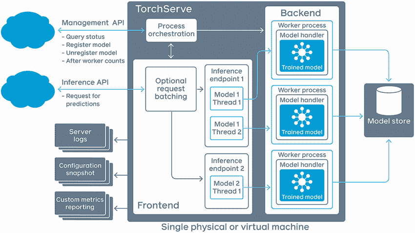

图 7.9 TorchServe 架构图（来源：Kuldeep Singh，“使用 TorchServe 将命名实体识别模型部署到生产环境”，Analytics Vidhya，2020）

图 7.9 描绘了两个工作流程：模型推断和模型管理。对于模型推断，首先，用户将预测请求发送到模型的推断端点，例如 `/predictions/{model_name}/{version}`。然后，推断请求被路由到已加载模型的工作进程之一。接下来，工作进程将从模型存储中读取模型文件，并让模型处理器加载模型，预处理输入数据，并运行模型以获得预测结果。

对于模型管理，用户需要在可以访问模型之前注册模型。这可以通过使用管理 API 来完成。我们还可以为模型调整工作进程计数的规模。我们将在即将到来的示例使用部分中看到一个示例。

功能

TorchServe 提供以下功能：

+   可以为多个模型或同一模型的多个版本提供服务

+   将模型推断的 gRPC 和 HTTP 端点统一起来

+   支持批量预测请求和性能调优

+   支持将 PyTorch 模型和 Python 函数组合成顺序和并行管道的工作流程

+   提供管理 API 来注册/注销模型和调整工作进程的规模

+   处理模型版本控制，用于 A/B 测试和实验

Torch 服务模型文件

纯 PyTorch 模型不能直接加载到 Torch 服务服务器中。TorchServe 要求将其所有模型打包成 .mar 文件。请参阅 7.2.6 节，了解如何创建 .mar 文件的详细示例。

模型服务

下面的代码片段列出了使用 TorchServe 运行模型推理的五个一般步骤。有关具体示例，您可以查看我们的示例意图分类预测器的 README 文档（[`mng.bz/WA8a`](http://mng.bz/WA8a)）：

```py
# 1\. Create model store directory for torch serving
# and copy model files (mar files) to it
mkdir -p /tmp/model_store/torchserving
cp sample_models/intent.mar /tmp/model_store/torchserving                       ❶

# 2\. Run the torch serving container
docker pull pytorch/torchserve:0.4.2-cpu
docker run --rm --shm-size=1g \
       --ulimit memlock=-1 \
       --ulimit stack=67108864 \
       -p8080:8080 \
       -p8081:8081 \
       -p8082:8082 \
       -p7070:7070 \
       -p7071:7071 \
       --mount type=bind,source=/tmp/model_store/torchserving,target=/tmp/models❷
pytorch/torchserve:0.4.2-cpu torchserve --model-store=/tmp/models

# 3\. Register intent model through torchserving management api
curl -X POST  "http:/ /localhost:8081/models?url=                               ❸
➥ intent_1.mar&initial_workers=1&model_name=intent"                            ❸

# 4\. Query intent model in torch serving with default version.
curl --location --request GET 'http:/ /localhost:8080/predictions/intent' \
--header 'Content-Type: text/plain' \
--data-raw 'make a 10 minute timer'

# 5\. Query intent model in torch serving with specified version - 1.0
curl --location --request GET 'http:/ /localhost:8080/predictions/intent/1.0' \
--header 'Content-Type: text/plain' \
--data-raw 'make a 10 minute timer'
```

❶ 创建本地模型目录并复制意图分类模型

❷ 将本地模型目录绑定为 TorchServe 的模型存储目录

❸ Intent_1.mar 包含模型文件和模型元数据，例如模型版本。

使用管理 API 注册模型之外，我们还可以使用 scale worker API 动态调整任何版本模型的工作节点数量，以更好地服务不同的推理请求负载，如下例所示：

```py
# 1\. Scale up the worker number for the intent model. Default number is 1.
# Set minimum worker count to 3 and maximum worker count to 6 
# for version 1.0 of the intent model 
curl -v -X PUT "http:/ /localhost:8081/models/intent/1.0?min_worker=3&max_worker=6"

# 2\. Use the describe model API to get detail runtime status of 
# default version of the intent model.
curl http:/ /localhost:8081/models/intent

# 3\. Use the describe model API to get detail runtime status of 
# specific version (1.0) of the intent model.
curl http:/ /localhost:8081/models/intent/1.0 
```

回顾

TorchServe 是用于 PyTorch 模型的生产级模型服务解决方案；它专为高性能推理和生产用例而设计。TorchServe 的管理 API 增加了许多灵活性，用于自定义模型部署策略，并允许我们在每个模型级别管理计算资源。

与 TensorFlow Serving 类似，TorchServe 的主要缺点是它是一种供应商锁定解决方案；它仅支持 PyTorch 模型。因此，如果您正在寻找一种训练框架不可知的方法，TorchServe 将不是您的选择。

### 7.4.3 Triton 推理服务器

Triton 推理服务器（[`developer.nvidia.com/nvidia-triton-inference-server`](https://developer.nvidia.com/nvidia-triton-inference-server)）是由 NVIDIA 开发的开源推理服务器。它提供了一个针对 CPU 和 GPU 优化的云和边缘推理解决方案。Triton 支持 HTTP/REST 和 gRPC 协议，允许远程客户端请求服务器管理的任何模型的推理。对于边缘部署，Triton 可作为具有 C API 的共享库提供，允许直接在应用程序中包含 Triton 的全部功能。

与其他服务工具相比，Triton 的训练框架兼容性是其主要优势之一。与仅适用于 TensorFlow 模型的 TensorFlow Serving 和仅适用于 PyTorch 模型的 Torch 服务不同，Triton 服务器可以为从几乎任何框架训练的模型提供服务，包括 TensorFlow、TensorRT、PyTorch、ONNX 和 XGBoost。Triton 服务器可以从本地存储、Google Cloud Platform 或 Amazon Simple Storage Service (Amazon S3) 加载模型文件，并在基于 GPU 或 CPU 的基础设施（云、数据中心或边缘）上运行。

推理性能对于 Triton 也是一项优势。Triton 在 GPU 上并发运行模型，以最大化吞吐量和利用率；支持基于 x86 和 ARM CPU 的推断；并提供动态批处理、模型分析器、模型集成和音频流等功能。这些功能使模型服务内存高效且稳健。

高层架构

图 7.10 显示了 Triton 推理服务器的高级架构。所有推理请求都作为 REST 或 gRPC 请求发送，然后在内部转换为 C API 调用。模型从模型仓库加载，模型仓库是一个基于文件系统的仓库，我们可以将其视为文件夹/目录。

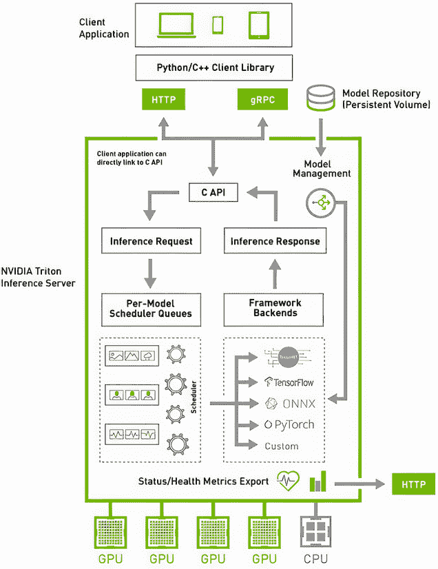

图 7.10 Triton 推理服务器的高级架构（来源：NVIDIA Developer，[`developer.nvidia.com/nvidia-triton-inference-server`](https://developer.nvidia.com/nvidia-triton-inference-server)）

对于每个模型，Triton 准备一个调度程序。调度和批处理算法可以根据模型逐个配置。每个模型的调度程序可选择对推理请求进行批处理，然后将请求传递给与模型类型对应的后端，例如 PyTorch 模型的 PyTorch 后端。 Triton 后端是执行模型的实现。它可以是围绕深度学习框架（如 PyTorch、TensorFlow、TensorRT 或 ONNX Runtime）的包装器。一旦后端使用批处理请求中提供的输入执行推理以产生请求的输出，输出就会返回。

值得注意的是，Triton 支持一个后端 C API，允许通过自定义预处理和后处理操作或甚至一个新的深度学习框架来扩展 Triton 的功能。这就是我们如何扩展 Triton 服务器的方式。您可以查看 triton-inference-server/backend GitHub 仓库（[`github.com/triton-inference-server/backend`](https://github.com/triton-inference-server/backend)）来找到所有 Triton 后端实现。作为一个额外的好处，由 Triton 服务的模型可以通过专用的模型管理 API 进行查询和控制，该 API 可通过 HTTP/REST、gRPC 协议或 C API 使用。

特点

Triton 提供以下功能：

+   支持所有主要的深度学习和机器学习框架后端。

+   在单个 GPU 或 CPU 上同时运行来自相同或不同框架的多个模型。在多 GPU 服务器上，Triton 会自动在每个 GPU 上创建每个模型的一个实例，以提高利用率。

+   优化推理服务以进行实时推理、批量推理以最大化 GPU/CPU 利用率，并使用内置支持音频流输入的流推理。Triton 还支持模型集成，用于需要多个模型执行端到端推理的用例，例如对话型 AI。

+   处理输入请求的动态批处理，以获得高吞吐量和利用率，并在严格的延迟约束下。

+   在生产环境中实时更新模型，而无需重新启动推理服务器或中断应用程序。

+   使用模型分析器自动找到最佳模型配置并最大化性能。

+   支持大模型的多 GPU、多节点推理。

Triton 模型文件

Triton 中的每个模型都必须包含一个模型配置，提供关于模型的必需和可选信息。通常，它是一个指定为 ModelConfig protobuf 的 config.pbtxt 文件（[`mng.bz/81Kz`](http://mng.bz/81Kz)）。以下是 PyTorch 模型的简单模型配置（config.pbtxt）：

```py
platform: “pytorch_libtorch”    ❶
pytorch_libtorch                ❷
  max_batch_size: 8             ❸
  input [                       ❹
    {
      name: “input0”
      data_type: TYPE_FP32
      dims: [ 16 ]
    },
    {
      name: “input1”
      data_type: TYPE_FP32
      dims: [ 16 ]
    }
  ]
  output [                      ❺
    {
      name: “output0”
      data_type: TYPE_FP32
      dims: [ 16 ]
    }
  ]
```

❶ 指定此模型的 PyTorch 服务后端

❷ 表示这是一个 PyTorch 后端配置

❸ 定义模型支持的最大批处理大小

❹ 模型输入数据架构

❺ 模型输出数据架构

通常，训练应用程序在训练服务完成训练后会创建此 config.pbtxt 文件，然后将此配置作为模型文件的一部分上传到模型存储库。有关 Triton 模型配置的更多详细信息，请查看 Triton 模型配置文档（[`mng.bz/Y6mA`](http://mng.bz/Y6mA)）。

除了统一的配置文件外，Triton 模型文件格式因训练框架而异。例如，TensorFlow 模型以 SavedModel 格式（[`mng.bz/El4d`](http://mng.bz/El4d)）可以直接加载到 Triton 中。但 PyTorch 模型需要由 TorchScript 程序保存。

TorchScript

TorchScript 是一种从 PyTorch 代码创建可序列化和可优化模型的方法。Triton 要求 PyTorch 模型被序列化为 TorchScript 的原因是 TorchScript 可以用作 PyTorch 模型的中间表示。它可以独立于 Python 运行，例如在独立的 C++ 程序中。请参阅以下代码片段，了解如何从 PyTorch 模型创建 TorchScript 模型：

```py
#### Pytorch training code

# 1\. Define an instance of your model.
Model = ...TorchModel()

# 2\. Switch the model to eval model
model.eval()

# 3\. Build an example input of the model’s forward() method.
Example = torch.rand(1, 3, 224, 224)

# 4\. Use torch.jit.trace to generate a torch.jit.ScriptModule via tracing.
Traced_script_module = torch.jit.trace(model, example)
# 5\. Save the TorchScript model
traced_script_module.save(“traced_torch_model.pt”)   
```

对于其他训练框架的模型格式要求，请查看 triton-inference-server/backend GitHub 存储库（[`mng.bz/NmOn`](http://mng.bz/NmOn)）。

模型服务

Triton 中的模型服务包括以下三个步骤：首先，将模型文件复制到模型存储库；其次，调用管理 API（`POST v2/repository/ models/${MODEL_NAME}/load`）注册模型；第三，发送推理请求（`POST v2/models/${MODEL_NAME}/versions/${MODEL_VERSION}`）。有关 Triton 管理 API 的更多信息，请查看 Triton HTTP/REST 和 gRPC 协议文档（[`mng.bz/DZvR`](http://mng.bz/DZvR)）。有关推理 API，请查看 KServe 社区标准推理协议文档（[`kserve.github.io/website/0.10/modelserving/data_plane/v2_protocol/`](https://kserve.github.io/website/0.10/modelserving/data_plane/v2_protocol/)）。

回顾

在撰写本书时，我们认为 Triton 是最佳的模型服务方法，原因有三。首先，Triton 不依赖任何训练框架；它提供了一个设计良好且可扩展的后端框架，使得它能够执行几乎任何训练框架构建的模型。其次，Triton 提供了更好的模型服务性能，例如服务吞吐量。Triton 有多种机制来提高其服务性能，例如动态批处理、GPU 优化和模型分析工具。第三，Triton 支持高级的模型服务用例，如模型集成和音频流式传输。

警告 要小心！ Triton 可能不是免费的。Triton 采用 BSD 3-Clause "new" 或 "revised" 许可证，可以免费进行修改和商业发布。但是修复故障和错误呢？该项目非常复杂，代码量大，因此会在调试和修复性能问题（如内存泄漏）上带来一定困难。如果你想获取支持，可以考虑购买 NVIDIA 的 AI-Enterprise 许可证，但在本书撰写时，这将需要支付每年每块 GPU 数千美元的费用。所以在注册之前，请确保你了解 Triton 的代码库。

### 7.4.4 KServe 和其他工具

开源服务工具的列表很长，包括 KServe ([`www.kubeflow.org/docs/external-add-ons/kserve/`](https://www.kubeflow.org/docs/external-add-ons/kserve/))、Seldon Core ([`www.seldon.io/solutions/open-source-projects/core`](https://www.seldon.io/solutions/open-source-projects/core)) 和 BentoML ([`github.com/bentoml/BentoML`](https://github.com/bentoml/BentoML))。这些工具各有其独特的优势。它们要么运行轻量且易于使用，像 BentoML 一样，要么使得在 Kubernetes 中轻松快速部署模型，就像 Seldon Core 和 KServe 一样。尽管服务工具的多样性，它们也有很多共同之处：它们都需要以一定的格式打包模型，定义一个模型包装器和配置文件来执行模型，将模型上传到存储库，并通过 gRPC 或 HTTP/REST 端点发送预测请求。通过阅读本章中的 TorchServe、TensorFlow 和 Triton 示例，你应该能够自己探索其他工具。

在结束服务工具讨论之前，我们想特别提到 KServe。KServe 是几家知名高科技公司（包括 Seldon、Google、Bloomberg、NVIDIA、Microsoft 和 IBM）在模型服务方面的合作项目。这个开源项目值得关注，因为它旨在为常见的机器学习服务问题创建一个标准化的解决方案。

KServe 的目标是在 Kubernetes 上提供一种无服务器推断解决方案。它提供了一个抽象的模型服务接口，适用于像 TensorFlow、XGBoost、scikit-learn、PyTorch 和 ONNX 等常见的机器学习框架。

从我们的角度来看，KServe 的主要贡献在于它创建了一个标准的服务接口，适用于所有主要的服务工具。例如，我们之前提到的所有服务工具现在都支持 KServe 模型推理协议。这意味着我们可以仅使用一组推理 API（KServe API）来查询由不同服务工具托管的任何模型，如 Triton、TorchServe 和 TensorFlow。

KServe 的另一个优势是它被设计为在 Kubernetes 上本地提供无服务器解决方案。KServe 使用 Knative 来处理网络路由、模型工作器自动扩展（甚至到零）和模型版本跟踪。通过简单的配置（见下面的示例），您可以将模型部署到您的 Kubernetes 集群，然后使用标准化的 API 来查询它：

```py
apiVersion: serving.kserve.io/v1beta1             ❶
kind: InferenceService
metadata:
 name: “torchserve”
spec:
 predictor:
   pytorch:                                       ❷
     storageUri: gs://kfserving-examples/models   ❸
          ➥ /torchserve/image_classifier         ❸
```

❶ KServe 的样本模型部署配置

❷ 后端服务器类型

❸ 模型文件位置

在幕后，KServe 使用不同的服务工具来运行推理，如 TensorFlow Serving 和 Triton。KServe 提供了一个隐藏所有细节的简单 Kubernetes CRD 配置的好处。在前面的示例中，`InferenceService` CRD 配置隐藏了工作，包括预测服务器设置、模型复制、模型版本跟踪和预测请求路由。

在书写本书时，KServe 的新版本（v2）仍处于测试阶段。虽然它还不够成熟，但其在跨平台支持和无服务器模型部署方面的独特优势使其在其他方法中脱颖而出。如果您想要建立一个适用于 Kubernetes 上所有主要训练框架的大型服务平台，那么 KServe 值得您的关注。

### 7.4.5 将服务工具集成到现有服务系统中

在许多情况下，用新的服务后端替换现有的预测服务是不可行的选择。每个服务工具对于模型存储、模型注册和推理请求格式都有自己的要求。这些要求有时与现有系统的预测接口以及内部模型元数据和文件系统相冲突。为了引入新技术而不影响业务，我们通常采取集成方法，而不是完全替换它。

在这里，我们以 Triton 服务器为例，展示如何将服务工具集成到现有的预测服务中。在这个示例中，我们假设三件事情：首先，现有的预测服务在 Kubernetes 中运行；其次，现有的预测服务的 Web 推理接口不允许更改；第三，有一个模型存储系统，将模型文件存储在云存储中，如 Amazon S3。图 7.11 显示了这个过程。

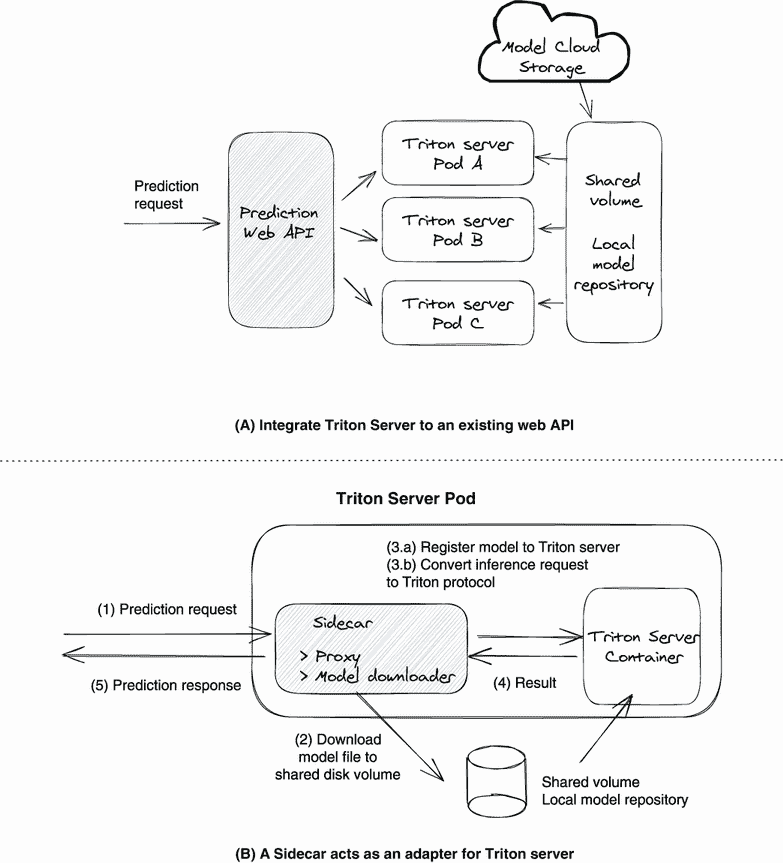

图 7.11 提议将一系列 Triton 服务器实例集成到现有服务系统中

图 7.11（A）说明了系统概述。一列 Triton 服务器 Kubernetes pod 被添加到现有的预测 API 后面。通过 Kubernetes 负载均衡器，预测请求可以落在任何 Triton pod 上。我们还添加了一个共享卷，所有 Triton pod 都可以访问；这个共享卷充当了所有 Triton 实例的共享 Triton 模型存储库。

图 7.11（B）显示了 Triton 服务器 Kubernetes pod 内部的内容。每个 Triton pod 都有两个 Docker 容器：一个 Triton 服务器容器和一个 sidecar 容器。Triton 服务器容器是我们在第 7.4.3 节中讨论的 Triton 推理服务器。模型预测发生在此容器中，我们可以简单地将此容器视为黑匣子。sidecar 容器充当适配器/代理，以准备 Triton 在将预测请求转发到 Triton 容器之前需要的内容。这个 sidecar 容器从云存储中下载模型到 Triton 的本地模型存储库（共享卷），调用 Triton 注册模型，并将预测请求转换为 Triton API 调用。

使用这种集成方法，所有的更改都发生在预测服务内部。公共预测 API 和外部模型存储系统保持不变，当我们切换到 Triton 后端时，我们的用户不会受到影响。虽然我们使用了一个特定的工具（Triton）和一个特定的基础设施（Kubernetes）来演示这个想法，但只要它们使用 Docker，你就可以将这种模式应用到任何其他系统中。

注意 因为 Triton 服务器支持主要的训练框架，KServe 提供了一个标准化的服务协议，我们可以将它们结合起来生成一个适用于不同框架训练的各种模型的服务系统。

## 7.5 发布模型

发布模型是将新训练的模型部署到预测服务并向用户公开的行为。在构建生产中的模型服务系统时，自动化模型部署和支持模型评估是我们需要解决的两个主要问题。

首先，当训练服务完成模型构建时，应自动将模型发布到生产环境中的预测服务。其次，新发布的模型及其先前版本应全部在预测服务中可访问，以便我们可以在相同环境中对它们进行评估并进行公平比较。在本节中，我们提出了一个三步模型发布过程来解决这些挑战。

首先，数据科学家（Alex）或训练服务向元数据存储注册最近生成的模型（由模型文件和其元数据组成）—这是一个将在下一章中讨论的云元数据和工件存储系统。其次，Alex 对新注册的模型进行模型评估。他可以通过向预测服务发送具有特定模型版本的预测请求来测试这些模型的性能。预测服务具有从元数据存储加载任何特定版本模型的内置机制。

第三，Alex 将性能最佳的模型版本设置为元数据存储中的发布模型版本。一旦设置完成，所选版本的模型将会公开！客户应用程序将不知不觉地开始使用来自预测服务的新发布版本的模型。图 7.12 说明了这个三步骤的过程。

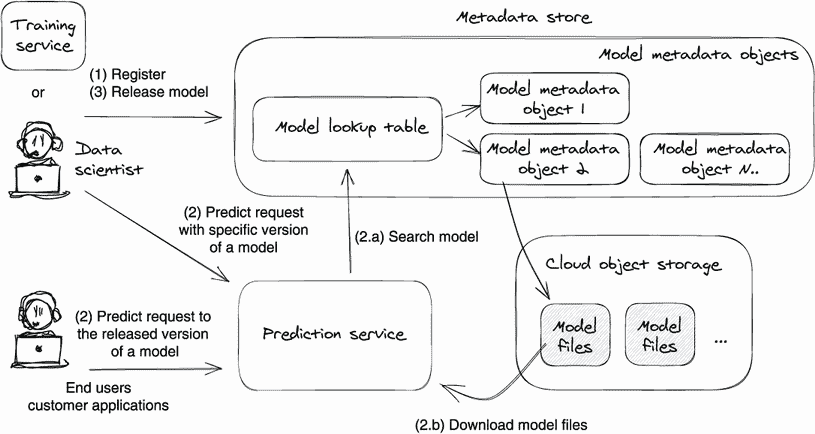

图 7.12 模型发布流程工作流程：（1）在模型元数据存储中注册模型；（2）加载模型的任意版本以提供预测请求；以及（3）在元数据存储中发布模型

在接下来的三个部分中，我们将逐个探讨三个模型发布步骤（如图 7.12 所示）。在此过程中，我们还将探讨元数据存储的细节以及其与存储和预测服务的交互。让我们开始吧！

### 7.5.1 注册模型

在大多数深度学习系统中，都有一个存储模型的存储服务。在我们的示例中，这个服务称为*元数据存储*；它用于管理深度学习系统生成的工件的元数据，如模型。元数据和工件存储服务将在下一章中详细讨论。

要向元数据存储注册模型，通常需要提供模型文件和模型元数据。模型文件可以是模型权重、嵌入和执行模型所需的其他依赖文件。模型元数据可以是描述模型事实的任何数据，例如模型名称、模型 ID、模型版本、训练算法、数据集信息和训练执行指标。图 7.13 说明了元数据如何在内部存储模型元数据和模型文件。

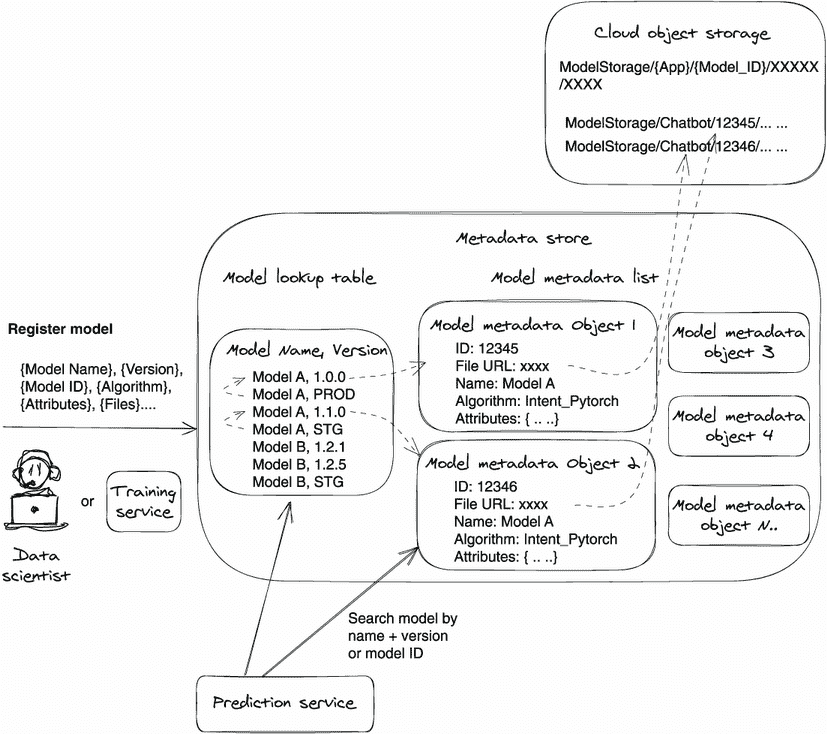

图 7.13 元数据存储的内部存储设计；模型元数据存储为对象文件，并带有前置查找表。

在图 7.13 中，我们可以看到元数据存储有两个部分：模型查找表和模型元数据列表。模型元数据列表只是纯元数据存储；所有模型元数据对象都存储在这个列表中。模型查找表用作快速搜索的索引表。查找表中的每个记录指向元数据列表中的实际元数据对象。

在训练完成后，训练服务可以自动将模型注册到元数据存储中。数据科学家也可以手动注册模型，这通常发生在数据科学家想要部署他们本地构建的模型（而不使用深度学习系统）时。

当元数据存储接收到模型注册请求时，首先，它为此模型创建一个元数据对象。其次，通过添加一个新的搜索记录来更新模型查找表；该记录使我们能够通过使用模型名称和版本来找到该模型元数据对象。除了通过使用模型名称和版本搜索查找表外，元数据存储还允许通过使用模型 ID 进行模型元数据搜索。

实际模型文件存储在工件存储中——云对象存储，例如 Amazon S3。模型在工件存储中的存储位置保存在模型的元数据对象中作为指针。

图 7.13 显示了模型查找表中模型 A 的两个搜索记录：版本 1.0.0 和 1.1.0。每个搜索记录映射到不同的模型元数据对象（分别为 ID = 12345 和 ID = 12346）。有了这种存储结构，我们可以通过使用模型名称和模型版本找到任何模型元数据；例如，我们可以通过搜索“模型 A”和版本“1.1.0”找到模型元数据对象 ID = 12346。

使用模型的规范名称和版本来查找实际的元数据和模型文件是预测服务同时提供不同模型版本的能力的基础。让我们在下一节中看看元数据存储在预测服务中的应用。

### -   实时加载模型的任意版本与预测服务

为了在生产环境中决定使用哪个模型版本，我们希望公平地（在相同的环境中）和轻松地（使用相同的 API）评估每个模型版本的模型性能。为此，我们可以调用预测服务以使用不同的模型版本运行预测请求。

在我们的提案中，当预测服务收到预测请求时，它会实时从元数据存储加载模型。数据科学家可以通过在预测请求中定义模型名称和版本来允许预测服务使用任何模型版本来运行预测。图 7.14 说明了该过程。

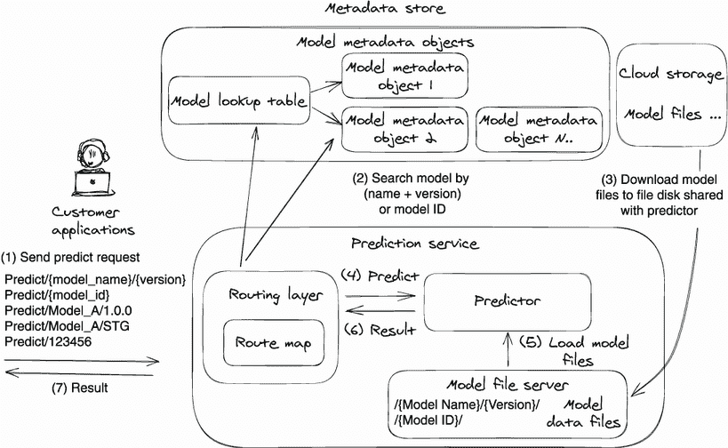

图 7.14 模型在预测服务中的服务

图 7.14 显示了预测服务实时加载指定的服务请求中的模型。在接收到预测请求时，路由层首先在元数据存储中找到请求的模型，下载模型文件，然后将请求传递给后端预测器。以下是运行时模型加载和服务过程的七个步骤的详细说明：

1.  用户向预测服务发送预测请求。在请求中，他们可以通过提供模型名称和版本（`/predict/{model_name}/{version}`）或模型 ID（`/predict/{model_id}`）来指定要使用的模型。

1.  预测服务内部的路由层搜索元数据存储，并找到模型元数据对象。

1.  路由层然后将模型文件下载到所有预测器都可以访问的共享磁盘上。

1.  通过检查模型元数据，例如算法类型，路由层将预测请求路由到正确的后端预测器。

1.  预测器从共享磁盘加载模型。

1.  预测器处理数据预处理，执行模型，执行后处理，并将结果返回给路由层。

1.  路由层将预测结果返回给调用者。

### 7.5.3 通过更新默认模型版本释放模型

在模型评估之后，模型释放的最后一步是让客户在预测服务中使用新验证的模型版本。我们希望模型释放过程在不知不觉中发生，以便客户不知道底层模型版本的更改。

在上一节（7.5.2）的步骤 1 中，用户可以使用`/predict/{model_name}/{version}`API 请求任何指定模型版本的模型服务。这种能力对于评估同一模型的多个版本至关重要，因此我们可以防止模型性能回归。

但在生产场景中，我们不希望客户跟踪模型版本和模型 ID。相反，我们可以定义几个静态版本字符串作为变量来表示新发布的模型，并让客户在预测请求中使用它们，而不是使用真实的模型版本。

例如，我们可以定义两个特殊的静态模型版本或标签，例如`STG`和`PROD`，分别表示预生产和生产环境。如果与模型 A 关联的`PROD`标签的模型版本为`1.0.0`，则用户可以调用`/predict/model_A/PROD`，而预测服务将加载模型 A 和版本`1.0.0`来运行模型服务。当我们将新发布的模型版本升级到`1.2.0`时——将`PROD`标签与版本 1.2.0 关联——`/predict/model_A/PROD`请求将落在模型版本`1.2.0`上。

有了特殊的静态版本/标签字符串，预测用户不需要记住模型 ID 或版本；他们只需使用`/predict/{model_name}/PROD`即可发送预测请求以消耗新发布的模型。在幕后，我们（数据科学家或工程师）维护这些特殊字符串与元数据存储的查找表中实际版本之间的映射，因此预测服务知道对于`/STG`或`/PROD`请求下载哪个模型版本。

在我们的提案中，我们将将特定模型版本映射到静态模型版本的操作命名为*模型释放操作*。图 7.15 说明了模型释放过程。

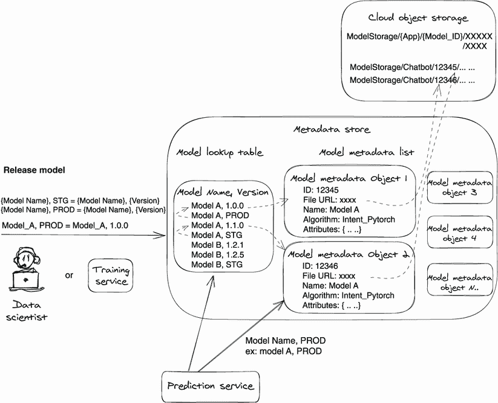

图 7.15 在带有元数据存储的预测服务中模型提供服务

在图 7.15 中，数据科学家首先在元数据存储中将模型 A，版本 1.0.0 注册到模型 A，版本`PROD`。然后在模型查找表中，（`Model` `A，` `PROD)` 记录更改为指向实际的模型对象记录（`ModelA，` `version:` `1.0.0)`。因此，当用户在预测服务中调用`/predict/ModelA/PROD`时，他们实际上是在调用`/predict/ModelA/1.0.0`。

接下来，当预测服务收到一个模型版本等于`STG`或`PROD`的预测请求时，服务将在元数据存储中搜索查找表，并使用实际的模型版本，即已注册到`PROD`的版本，来下载模型文件。在图 7.15 中，预测服务将为`/ModelA/PROD`的请求加载模型`ModelA, version:` 1.0.0，并为`/ModelA/STG`的请求加载模型`ModelA, version:` 1.1.0。

对于未来的模型发布，数据科学家只需在元数据存储的查找表中更新模型记录，将最新的模型版本映射到`STG`和`PROD`。预测服务将自动加载新的模型版本以响应新的预测请求。所有这些操作都是自动进行的，对用户来说是不可感知的。

注意：所提出的发布工作流程并不是发布模型的唯一方法。模型发布方法高度依赖于公司内部的 DevOps 流程和预测服务设计，因此在这个主题上没有单一的最佳设计。我们希望通过阅读第 7.5 节中的问题分析和提出的解决方案，您可以得出适合您情况的模型发布流程。

## 7.6 生产后模型监控

与监控其他服务（如数据管理）相比，在机器学习系统中，模型投入生产后工作仍未完成。我们不仅需要监控和维护预测服务本身，还需要关注服务提供的*模型性能*。模型漂移是指知识领域分布发生变化，不再与训练数据集匹配，导致模型性能下降。这可能发生在预测服务完全正常运行的情况下，因为模型推理是独立于预测服务运行的。

为了应对模型漂移，数据科学家需要使用新数据重新训练模型或使用改进的训练算法重建模型。表面上，这听起来像是一个数据科学项目，但它需要大量的底层工程工作，例如从预测服务收集和分析模型指标以检测模型漂移。在本节中，我们从工程的角度讨论模型监控，并探讨工程师在监控过程中的作用。

### 7.6.1 指标收集和质量门限

工程师可以为 *模型指标收集* 和 *模型质量门设置* 这两个最重要的领域做出贡献。让我们解释一下。

为了运行检测模型漂移的分析，数据科学家需要分析数据，工程师可以找到途径提供必要的数据（指标）。尽管工程师可能必须创建一个单独的数据管道来收集模型性能指标，但在大多数情况下这将是不划算的。通常，模型性能指标可以使用现有的遥测系统（如 Datadog）和日志记录系统（如 Sumo 和 Splunk）进行收集和可视化。因此，请善用您已经拥有的现有日志记录和指标系统，而不是费力地建立一个新的指标系统。

工程师还可以帮助构建模型质量门。工程师可以与数据科学家合作，自动化他们的故障排除步骤，例如检查数据质量和生成模型推理分析报告。通过给定的阈值，这些检查最终将形成一个模型质量门。

### 7.6.2 需要收集的指标

从理论上讲，我们需要收集至少五种指标来支持模型性能测量。它们是预测跟踪、预测日期、模型版本、观察和观察率、以及日期。让我们逐一来看看它们：

+   *预测跟踪* — 通常，我们通过为每个预测请求分配一个唯一的请求 ID 来跟踪每个预测请求，但这还不够。对于一些复杂的场景，比如 PDF 扫描，我们将不同类型的模型预测组合在一起以产生最终结果。例如，我们首先将 PDF 文档发送到 OCR（光学字符识别）模型以提取文本信息，然后将文本发送到 NLP（自然语言处理）模型以识别目标实体。在这种情况下，除了为父预测请求分配唯一的请求 ID 外，我们还可以为每个子预测请求分配一个 `groupRequestID`，这样我们就可以在故障排除时将所有相关的预测请求分组起来。

+   *预测日期* — 通常，预测请求在一秒内完成。为了追踪预测的日期，我们可以使用预测开始时间或完成时间，因为它们之间没有太大的区别。但是对于像欺诈检测这样的情况，预测的完成时间戳可能与预测开始时间戳相差很大，因为它可能需要多天的用户活动作为输入。

+   *模型版本* — 为了将模型性能数据映射到确切的模型文件，我们需要知道模型版本。此外，当我们组合多个模型来提供一个预测请求时，需要在日志中跟踪每个模型的版本。

+   *观察* —— 预测结果需要与预测输入一起记录，以供将来比较。此外，我们可以为客户提供反馈或调查 API，以报告模型性能问题。通过使用反馈 API，客户可以报告模型 ID、预期预测结果和当前预测结果。

+   *观察日期和频率* —— 许多时候，观察是手动收集的，观察的频率也需要记录。数据科学家需要日期和频率来决定数据是否能够在统计上代表模型的整体性能。

你能读到这里真是太好了！模型服务是机器学习系统的重要组成部分，因为外部业务应用程序依赖于它。随着模型类型、预测请求数量和推理类型（在线/离线）的增加，许多模型服务框架/系统被发明出来，并且它们变得越来越复杂。如果你遵循第 6 和第七章介绍的服务心理模型，从模型如何加载和执行开始，你可以轻松地浏览这些服务系统，无论代码库有多大或组件数量有多少。

## 摘要

+   这一章的模型服务示例由一个前端 API 组件和一个后端模型预测器容器组成。由于预测器是基于第三章的意图模型训练代码构建的，因此它只能为意图分类模型提供服务。

+   模型服务器示例由与第三章相同的前端 API 和一个不同的后端 —— TorchServe 预测器组成。TorchServe 后端不仅限于意图分类模型；它可以为任意的 PyTorch 模型提供服务。这是模型服务器方法在模型服务方法上的一个巨大优势。

+   对于实施模型服务器方法，我们建议使用现有工具，例如 Triton 服务器，而不是自己构建。

+   模型服务方法适用于单个应用场景；它可以快速实施，并且您可以完全控制端到端工作流的代码实现。

+   模型服务器方法适用于平台场景；当服务系统需要支持五种或更多不同类型的模型时，它可以极大地减少开发和维护工作量。

+   TorchServe、TensorFlow Serving 和 Triton 都是可靠的开源模型服务工具，它们都采用了模型服务器方法。如果适用，我们推荐 Triton，因为它与大多数模型训练框架兼容，并且在 GPU 加速方面具有性能优势。

+   KServe 提供了一个标准的服务接口，适用于所有主要的服务工具，包括 TensorFlow Serving、TorchServe 和 Triton。KServe 可以极大地提高我们的服务系统的兼容性，因为我们可以使用单一集合的 API 来运行具有不同后端的模型服务。

+   在生产中发布新模型或模型服务系统的新版本不应该是事后才考虑的事情；我们需要在设计阶段妥善考虑这一点。

+   模型度量收集和模型质量门是工程师需要专注于模型性能监控的两个领域。
