# 第六章\. 令牌与令牌嵌入

嵌入是使用大型语言模型（LLMs）的核心概念，正如你在本书第一部分中反复看到的那样。它们对理解 LLMs 的工作原理、构建方式以及未来发展方向至关重要。

到目前为止，我们所查看的大多数嵌入都是*文本嵌入*，这些向量表示整个句子、段落或文档。图 6-1 展示了这一区别。


###### 图 6-1\. 文本嵌入（一个向量表示一个句子或段落）和令牌嵌入（每个单词或令牌一个向量）之间的区别。

在本章中，我们开始更详细地讨论令牌嵌入。第二章讨论了如命名实体识别的令牌分类任务。在本章中，我们将更仔细地研究什么是令牌以及用于支持 LLMs 的令牌化方法。随后我们将超越文本的世界，看看这些令牌嵌入的概念如何使 LLMs 能够理解图像和其他数据模式（例如视频、音频等）。能够处理除文本之外的数据模式的 LLMs 被称为*多模态*模型。然后我们将深入探讨著名的 word2vec 嵌入方法，它是现代 LLMs 的前身，并看看它如何扩展令牌嵌入的概念，以构建推动许多应用的商业推荐系统。

# LLM 令牌化

## 令牌化器如何准备语言模型的输入

从外部看，生成式大型语言模型（LLMs）接受输入提示并生成响应，正如我们在图 6-2 中所见。

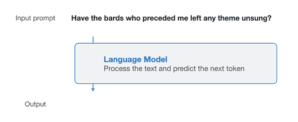

###### 图 6-2\. 语言模型及其输入提示的高级视图。

正如我们在第五章中看到的，经过指令调优的 LLMs 对作为指令或问题表述的提示产生更好的响应。在代码的最基本层面上，假设我们有一个调用语言模型并生成文本的 generate 方法：

```py
prompt = "Write an email apologizing to Sarah for the tragic gardening mishap. Explain how it happened."
# Placeholder definition. The next code blocks show the actual generation
def generate(prompt, number_of_tokens):
  # TODO: pass prompt to language model, and return the text it generates
  pass
output = generate(prompt, 10)
print(output)
```

生成：

```py
Subject: Apology and Condolences 
Dear Sarah, 
I am deeply sorry for the tragic gardening accident that took place in my backyard yesterday. As you may have heard, *...**etc*
```

让我们更仔细地审视这一生成过程，以检查文本生成中涉及的更多步骤。让我们从加载模型及其令牌化器开始。

```py
from transformers import AutoModelForCausalLM, AutoTokenizer
*#* *openchat* *is a 13B LLM*
model_name = "openchat/openchat"
*# If your environment does not have the required resources to run this model*
*# then try a smaller model like "gpt2" or "**openlm**-research/open_llama_3b"*
*# Load a tokenizer*
tokenizer = AutoTokenizer.from_pretrained(model_name)
*# Load a language model*
model = AutoModelForCausalLM.from_pretrained(model_name)
```

然后我们可以进入实际生成。请注意，生成代码总是包括一个令牌化步骤，位于生成步骤之前。

```py
prompt = "Write an email apologizing to Sarah for the tragic gardening mishap. Explain how it happened."
# Tokenize the input prompt
input_ids = tokenizer(prompt, return_tensors="pt").input_ids
# Generate the text
generation_output = model.generate(
  input_ids=input_ids, 
  max_new_tokens=256
)
# Print the output
print(tokenizer.decode(generation_output[0]))
```

从这段代码来看，我们可以看到模型实际上并没有接收到文本提示。相反，令牌化器处理了输入提示，并返回模型所需的信息，存储在变量 input_ids 中，模型将其用作输入。

让我们打印 input_ids 以查看其内部内容：

```py
tensor([[ 1, 14350, 385, 4876, 27746, 5281, 304, 19235, 363, 278, 25305, 293, 16423, 292, 286, 728, 481, 29889, 12027, 7420, 920, 372, 9559, 29889]])
```

这揭示了 LLMs 响应的输入。正如图 6-3 中所示，一系列整数。每个都是特定令牌（字符、单词或单词的一部分）的唯一 ID。这些 ID 参考分词器内部的一个表，包含它所知道的所有令牌。

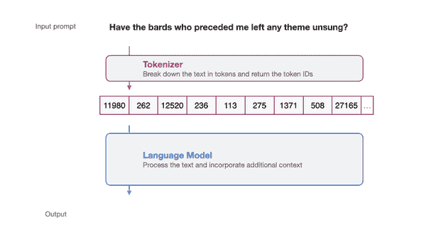

###### 图 6-3\. 分词器处理输入提示并准备实际输入到语言模型中：一个令牌 ID 列表。

如果我们想检查这些 ID，可以使用分词器的解码方法将 ID 转换回可读文本：

```py
for id in input_ids[0]:
   print(tokenizer.decode(id))
```

这将打印：

```py
<s> 
Write 
an 
email 
apolog 
 izing 
to 
Sarah 
for 
the 
trag 
 ic 
garden 
 ing 
m 
 ish 
 ap 
. 
Exp 
 lain 
how 
it 
happened 
.
```

这就是分词器如何拆解我们的输入提示。注意以下几点：

+   第一个令牌是 ID 为 #1 的令牌，它是 <s>，一个特殊令牌，表示文本的开始。

+   一些令牌是完整的单词（例如，*写*，*一个*，*电子邮件*）。

+   一些令牌是单词的一部分（例如，*道歉*，*izing*，*悲惨*，*ic*）。

+   标点符号字符是它们自己的令牌。

+   注意空格字符没有自己的令牌。相反，部分令牌（如 ‘izing’ 和 ‘ic’）在开头有一个特殊的隐藏字符，指示它们与文本中前面的令牌相连。

有三个主要因素决定了分词器如何拆解输入提示。首先，在模型设计时，模型的创建者选择了一种分词方法。常用的方法包括字节对编码（BPE，广泛应用于 GPT 模型）、WordPiece（用于 BERT）和 SentencePiece（用于 LLAMA）。这些方法的共同点在于，它们旨在优化一组有效的令牌来表示文本数据集，但它们的实现方式各不相同。

其次，选择方法后，我们需要进行一系列分词器设计选择，如词汇大小和使用哪些特殊令牌。关于这一点将在“比较训练后的 LLM 分词器”部分中详细介绍。

第三，分词器需要在特定数据集上进行训练，以建立最佳词汇表来表示该数据集。即使我们设置相同的方法和参数，在英语文本数据集上训练的分词器与在代码数据集或多语言文本数据集上训练的分词器也会有所不同。

除了用于将输入文本处理成语言模型外，分词器还用于语言模型的输出，将生成的令牌 ID 转换为与之关联的输出单词或令牌，如图 6-4 所示。

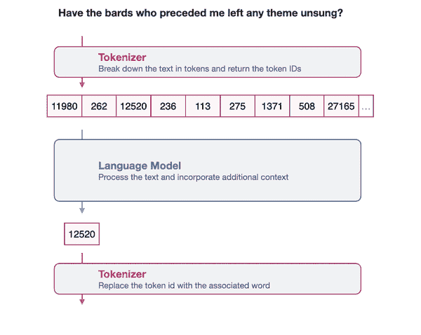

###### 图 6-4\. 分词器也用于处理模型的输出，通过将输出的令牌 ID 转换为与该 ID 关联的单词或令牌。

## 单词与子词、字符和字节令牌

我们看到的分词方案称为子词分词。它是最常用的分词方案，但不是唯一的。四种显著的分词方式如图 6-5 所示。让我们逐一了解它们：

单词令牌

这种方法在早期的 Word2Vec 等方法中很常见，但在 NLP 中的使用越来越少。然而，它的有效性使其被用于 NLP 以外的用例，例如推荐系统，正如我们将在本章后面看到的。

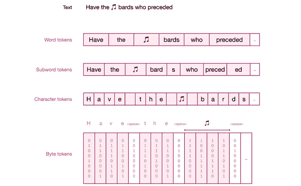

###### 图 6-5. 有多种分词方法将文本拆分为不同大小的组件（单词、子词、字符和字节）。

单词分词的一个挑战是，分词器无法处理训练后进入数据集的新单词。这也导致了一个词汇中存在许多差异微小的令牌（例如，apology, apologize, apologetic, apologist）。我们已经看到，这一后续挑战通过子词分词得到解决，因为它有一个令牌为'*apolog**'*，然后是许多其他令牌通用的后缀令牌（例如，*'-y*', '*-**ize*', '*-etic*', '-*ist*'），从而形成更具表现力的词汇。

子词令牌

此方法包含完整和部分单词。除了之前提到的词汇表现力外，该方法的另一个好处是能够通过将新令牌分解为较小的字符来表示新单词，这些字符往往是词汇的一部分。

与字符令牌相比，该方法的好处在于能够在 Transformer 模型的有限上下文长度内容纳更多文本。因此，在一个上下文长度为 1024 的模型中，使用子词分词能够比使用字符令牌容纳三倍的文本（子词令牌平均每个令牌有三个字符）。

字符令牌

这是一种能够成功处理新单词的方法，因为它有原始字母作为备用。虽然这使得表示更容易分词，但也使建模更具挑战性。使用子词分词的模型可以将“play”表示为一个令牌，而使用字符级令牌的模型需要建模信息以拼写出“p-l-a-y”，并建模其余序列。

字节令牌

另一种分词方法将分词分解为用于表示 Unicode 字符的单个字节。像 [CANINE: Pre-training an Efficient Tokenization-Free Encoder for Language Representation](https://arxiv.org/abs/2103.06874) 这样的论文概述了这种方法，也被称为“无分词编码”。其他作品如 [ByT5: Towards a token-free future with pre-trained byte-to-byte models](https://arxiv.org/abs/2105.13626) 显示这可以是一种具有竞争力的方法。

这里要强调的一个区别是：一些子词分词器还将字节作为词汇中的分词，以便在遇到无法以其他方式表示的字符时回退到最终构建块。比如，GPT2 和 RoBERTa 分词器就是这样做的。这并不意味着它们是无分词的字节级分词器，因为它们并不使用这些字节来表示所有内容，而只使用子集，正如我们将在下一节中看到的那样。

分词器在 [Suhas 的书中] 有更详细的讨论

## 比较经过训练的 LLM 分词器

我们之前提到的三个主要因素决定了分词器中出现的分词：分词方法、初始化分词器所用的参数和特殊分词，以及分词器训练所用的数据集。让我们比较和对比多个实际的、经过训练的分词器，以观察这些选择如何改变它们的行为。

我们将使用多种分词器对以下文本进行编码：

```py
text = """
English and CAPITALIZATION
ߎ堩蟠
show_tokens False None elif == >= else: two tabs:"    " Three tabs: "       "
12.0*50=600
"""
```

这将使我们能够看到每个分词器如何处理多种不同类型的分词：

+   大写化

+   除英语外的其他语言

+   表情符号

+   编程代码及其关键字和空白通常用于缩进（例如在 Python 语言中）

+   数字和数字符号

让我们从较旧的到较新的分词器，看看它们如何对这段文本进行分词，以及这可能对语言模型意味着什么。我们将对文本进行分词，然后打印每个分词，背景颜色为灰色。

### bert-base-uncased

分词方法：WordPiece，介绍于 [日本和韩国语音搜索](https://static.googleusercontent.com/media/research.google.com/ja//pubs/archive/37842.pdf)

词汇大小：30522

特殊分词：‘unk_token’: '[UNK]'

’sep_token’: '[SEP]'

‘pad_token’: '[PAD]'

‘cls_token’: '[CLS]'

‘mask_token’: '[MASK]'

分词文本：

```py
[CLS] english and capital ##ization [UNK] [UNK] show _ token ##s false none eli ##f = = > = else : four spaces : " " two tab ##s : " " 12 . 0 * 50 = 600 [SEP]
```

使用无大小写（更流行）的 BERT 分词器版本，我们注意到以下几点：

+   换行符被去掉，这使得模型无法识别编码在换行中的信息（例如，每次轮换在新行中的聊天记录）

+   所有文本均为小写字母

+   “capitalization”这个词被编码为两个子分词 capital ##ization。## 字符用于指示该分词是与前一个分词相连的部分分词。这也是指示空格位置的一种方法，假定没有 ## 的分词前有一个空格。

+   表情符号和中文字符被替换为 [UNK] 特殊分词，表示“未知分词”。

### bert-base-cased

标记化方法：WordPiece

词汇表大小：28,996

特殊标记：与无大小写版本相同

标记化文本：

```py
[CLS] English and CA ##PI ##TA ##L ##I ##Z ##AT ##ION [UNK] [UNK] show _ token ##s F ##als ##e None el ##if = = > = else : Four spaces : " " Two ta ##bs : " " 12 . 0 * 50 = 600 [SEP]
```

BERT 标记器的大小写版本主要不同于包括大写标记。

+   注意“CAPITALIZATION”现在表示为八个标记：CA ##PI ##TA ##L ##I ##Z ##AT ##ION

+   两个 BERT 标记器在输入周围包裹一个起始的[CLS]标记和一个结束的[SEP]标记。[CLS]代表分类，因为它是有时用于句子分类的标记。[SEP]代表分隔符，因为它用于在一些需要将两个句子传递给模型的应用中分隔句子（例如，在第三章的重新排序器中，我们会使用[SEP]标记来分隔查询文本和候选结果）。

### gpt2

标记化方法：BPE，介绍于[神经机器翻译中的稀有词的子词单元](https://arxiv.org/abs/1508.07909)

词汇表大小：50,257

特殊标记：<|endoftext|>

标记化文本：

英语和 CAP ITAL IZ ATION

� � � � � �

show _ t ok ens False None el if == >= else :

四个空格： " " 两个制表符： " "

12 . 0 * 50 = 600

使用 GPT-2 标记器，我们注意到以下内容：

换行符在标记器中表示

大写字母保持不变，单词“CAPITALIZATION”由四个标记表示。

🎵 蟠字符现在被表示为多个标记。尽管我们看到这些标记以�字符打印，但它们实际上代表不同的标记。例如，🎵 emoji 被分解为标记，标记 ID 为：8582，236 和 113。标记器成功地从这些标记重构了原始字符。我们可以通过打印 tokenizer.decode([8582, 236, 113])来看到这一点，它打印出🎵

两个制表符被表示为两个标记（该词汇表中的标记编号 197），四个空格被表示为三个标记（编号 220），最后一个空格是关闭引号字符的标记的一部分。

###### 注意

空白字符的意义是什么？这些对于理解或生成代码的模型很重要。使用单个标记表示四个连续空白字符的模型，可以说更适合 Python 代码数据集。尽管模型可以用四个不同的标记表示，但这确实使建模更加困难，因为模型需要跟踪缩进级别。这是标记化选择可以帮助模型在特定任务上改进的一个例子。

### google/flan-t5-xxl

标记化方法：SentencePiece，介绍于[SentencePiece：一种简单的与语言无关的子词标记器和解码器，用于神经文本处理](https://arxiv.org/pdf/1808.06226.pdf)

词汇表大小：32,100

特殊标记：

- ‘unk_token’: '<unk>'

- ‘pad_token’: '<pad>'

标记化文本：

英语和 CA PI TAL IZ ATION <unk> <unk> 显示 _ to ken s Fal s e None e l if = = > = else : 四个空格 : " " 两个制表符 : " " 12\. 0 * 50 = 600 </s>

FLAN-T5 模型家族使用 sentencepiece 方法。我们注意到以下几点：

+   没有换行或空白标记，这会使模型处理代码变得困难。

+   表情符号和汉字都被替换为<unk>标记，使模型对此完全无感。

### GPT-4

分词方法：BPE

词汇表大小：略超过 100,000

特殊标记：

<|endoftext|>

填充中间标记。这三个标记使得 GPT-4 能够生成补全，不仅考虑之前的文本，还考虑之后的文本。该方法在论文[高效训练语言模型以填充中间部分](https://arxiv.org/abs/2207.14255)中有更详细的解释。这些特殊标记为：

<|fim_prefix|>

<|fim_middle|>

<|fim_suffix|>

分词文本：

```py
English and CAPITAL IZATION 
� � � � � � 
show _tokens False None elif == >= else :
Four spaces : "     " Two tabs : " 	 	 "
12 . 0 * 50 = 600
```

GPT-4 的分词器行为与其前身 GPT-2 的分词器相似。有些差异是：

+   GPT-4 的分词器将四个空格表示为一个标记。实际上，它对每个空白序列都有特定的标记，直到一列 83 个空格。

+   python 关键字 elif 在 GPT-4 中有自己的标记。上述这一点和前一点均源于模型对代码的关注，除了自然语言。

+   GPT-4 的分词器使用更少的标记来表示大多数单词。这里的例子包括‘CAPITALIZATION’（两个标记，而不是四个）和‘tokens’（一个标记而不是三个）。

### bigcode/starcoder

分词方法：

词汇表大小：约 50,000

特殊标记：

'<|endoftext|>'

填充中间标记：

'<fim_prefix>'

'<fim_middle>'

'<fim_suffix>'

'<fim_pad>'

在表示代码时，管理上下文很重要。一个文件可能会调用在另一个文件中定义的函数。因此，模型需要某种方式来识别在同一代码库中不同文件中的代码，同时区分不同代码库中的代码。这就是 starcoder 为库名称和文件名使用特殊标记的原因：

'<filename>'

'<reponame>'

'<gh_stars>'

该分词器还包含一系列特殊标记，以便在代码上表现得更好。这些包括：

'<issue_start>'

'<jupyter_start>'

'<jupyter_text>'

论文：[StarCoder：愿源代码与你同在！](https://arxiv.org/abs/2305.06161)

分词文本：

```py
English and CAPITAL IZATION 
� � � � � 
show _ tokens False None elif == >= else : 
Four spaces : "   " Two tabs : " 	 	 " 
1 2 . 0 * 5 0 = 6 0 0
```

这是一个专注于代码生成的编码器。

+   与 GPT-4 类似，它将空格列表编码为一个单一标记。

+   这里一个主要的不同之处是每个数字都被分配了自己的标记（因此 600 变为 6 0 0）。假设这是为了更好地表示数字和数学。在 GPT-2 中，例如，数字 870 表示为一个标记。但 871 表示为两个标记（8 和 71）。你可以直观地理解，这可能会让模型在表示数字时感到困惑。

### facebook/galactica-1.3b

在[Galactica: A Large Language Model for Science](https://arxiv.org/abs/2211.09085)中描述的 Galactica 模型专注于科学知识，并在许多科学论文、参考材料和知识库上进行了训练。它特别关注分词，使其对所代表的数据集的细微差别更加敏感。例如，它包含用于引用、推理、数学、氨基酸序列和 DNA 序列的特殊标记。

分词方法：

词汇表大小：50,000

特殊标记：

<s>

<pad>

</s>

<unk>

参考文献：引用被包裹在两个特殊标记内：

[开始引用]

[结束引用]

论文中的一个使用示例是：

循环神经网络，长短期记忆[开始引用]长短期记忆，霍希特[结束引用]

步骤推理 -

<work> 是模型用于连锁推理的一个有趣标记。

标记化文本：

```py
English and CAP ITAL IZATION 
� � � � � � � 
show _ tokens False None elif == > = else : 
Four spaces : "     " Two t abs : " 		 " 
1 2 . 0 * 5 0 = 6 0 0
```

Galactica 标记器的行为类似于 Star Coder，因为它考虑了代码。它也以相同的方式编码空白 - 将不同长度的空白序列分配给一个单一的标记。它的不同之处在于它也会对制表符这样处理。因此，在我们迄今为止看到的所有标记器中，它是唯一一个将由两个制表符（'\t\t'）组成的字符串分配给单一标记的标记器。

现在我们可以通过并排查看所有这些示例来回顾我们的导览：

| bert-base-uncased |
| --- |

```py
[CLS] english and capital ##ization [UNK] [UNK] show _ token ##s false none eli ##f = = > = else : four spaces : " " two tab ##s : " " 12 . 0 * 50 = 600 [SEP]
```

|

| bert-base-cased |
| --- |

```py
[CLS] English and CA ##PI ##TA ##L ##I ##Z ##AT ##ION [UNK] [UNK] show _ token ##s F ##als ##e None el ##if = = > = else : Four spaces : " " Two ta ##bs : " " 12 . 0 * 50 = 600 [SEP]
```

|

| gpt2 |
| --- |

```py
 English and CAP ITAL IZ ATION � � � � � � show _ t ok ens False None el if == >= else : Two tabs :" " Four spaces : " " 12 . 0 * 50 = 600 
```

|

| google/flan-t5-xxl |
| --- |

```py
English and CA PI TAL IZ ATION <unk> <unk> show _ to ken s Fal s e None e l if = = > = else : two tab s : " " Four spaces : " " 12\. 0 * 50 = 600 </s> 
```

|

| GPT-4 |
| --- |

```py
English and CAPITAL IZATION � � � � � � show _tokens False None elif == >= else : Four spaces : " " Two tabs : " " 12 . 0 * 50 = 600
```

|

| bigcode/starcoder |
| --- |

```py
English and CAPITAL IZATION � � � � � show _ tokens False None elif == >= else : Four spaces : " " Two tabs : " " 1 2 . 0 * 5 0 = 6 0 0
```

|

| facebook/galactica-1.3b |
| --- |

```py
English and CAP ITAL IZATION � � � � � � � show _ tokens False None elif == > = else : Four spaces : " " Two t abs : " " 1 2 . 0 * 5 0 = 6 0 0
```

|

| meta-llama/Llama-2-70b-chat-hf |
| --- |

```py
<s> English and C AP IT AL IZ ATION � � � � � � � show _ to kens False None elif == >= else : F our spaces : " " Two tabs : " " 1 2 . 0 * 5 0 = 6 0 0
```

|

请注意，底部添加了一个新的标记器。到现在为止，你应该能够通过快速浏览这个输出理解它的许多属性。这是 LLaMA2 的标记器，这些模型中最新的一个。

## 标记器属性

前面的训练标记器导览展示了实际标记器之间的多种差异。但是什么决定了它们的分词行为呢？有三个主要的设计选择决定了标记器如何拆分文本：分词方法、初始化参数，以及我们训练标记器（但不是模型）所用的数据集。

### 分词方法

正如我们所见，有多种分词方法，其中 Byte-Pair Encoding (BPE)、WordPiece 和 SentencePiece 是较为流行的几种。每种方法都概述了一种算法，用于选择适当的标记集来表示数据集。有关所有这些方法的优秀概述可以在 Hugging Face 的[分词器页面摘要](https://huggingface.co/docs/transformers/tokenizer_summary)中找到。

### 标记器参数

选择分词方法后，LLM 设计师需要对标记器的参数做出一些决策。这些包括：

词汇表大小

在分词器的词汇中应保留多少个令牌？（常用的词汇大小值为 30K、50K，但越来越多的情况是看到像 100K 这样更大的大小）

特殊令牌

我们希望模型跟踪哪些特殊令牌。我们可以根据需要添加任意数量，特别是如果我们想为特定用例构建 LLM。常见的选择包括：

+   文本开始令牌（例如，<s>）

+   文本结束令牌

+   填充令牌

+   未知令牌

+   CLS 令牌

+   掩码令牌

除此之外，LLM 设计者可以添加有助于更好地建模他们试图关注的问题领域的令牌，正如我们在 Galactica 的<work>和[START_REF]令牌中看到的那样。

大写

在像英语这样的语言中，我们希望如何处理大写？我们是否应该将所有内容转换为小写？（名称的大写通常携带有用的信息，但我们是否想在所有大写版本的单词上浪费令牌词汇空间？）这就是为什么一些模型以大写和小写版本发布（如[Bert-base cased](https://huggingface.co/bert-base-cased)和更流行的[Bert-base uncased](https://huggingface.co/bert-base-uncased)）。

### 分词器训练数据集

即使我们选择相同的方法和参数，分词器的行为也会因其训练的数据集而异（在我们甚至开始模型训练之前）。前面提到的分词方法通过优化词汇来代表特定的数据集。从我们的导览中，我们看到这对代码和多语言文本等数据集产生了影响。

例如，对于代码，我们看到一个以文本为中心的分词器可能会像这样分词缩进空格（我们将一些令牌用黄色和绿色突出显示）：

```py
def add_numbers(a, b):
...."""Add the two numbers `a` and `b`."""
....return a + b
```

对于以代码为中心的模型，这可能并不理想。以代码为中心的模型往往会做出不同的分词选择：

```py
def add_numbers(a, b):
...."""Add the two numbers `a` and `b`."""
....return a + b
```

这些分词选择使模型的工作变得更轻松，因此其性能更有可能提高。

有关训练分词器的更详细教程可以在[Hugging Face 课程的分词器部分](https://huggingface.co/learn/nlp-course/chapter6/1?fw=pt)和[《使用变换器的自然语言处理，修订版》](https://www.oreilly.com/library/view/natural-language-processing/9781098136789/)中找到。

## 语言模型为其分词器的词汇持有嵌入

在初始化一个分词器后，它将在其相关语言模型的训练过程中使用。这就是为什么预训练的语言模型与其分词器相连，并且在未经过训练的情况下不能使用不同的分词器。

语言模型为分词器词汇中的每个令牌持有一个嵌入向量，正如我们在图 6-6 中看到的。一开始，这些向量像模型的其他权重一样随机初始化，但训练过程会赋予它们能够执行有用行为的值。


###### 图 6-6\. 语言模型持有与其分词器中每个标记相关的嵌入向量。

## 使用语言模型创建上下文化单词嵌入。

现在我们已经覆盖了作为语言模型输入的标记嵌入，让我们看看语言模型如何*创建*更好的标记嵌入。这是使用语言模型进行文本表示的主要方式之一，赋能应用程序如命名实体识别或提取式文本摘要（通过突出最重要的部分来总结长文本，而不是生成新的文本作为摘要）。

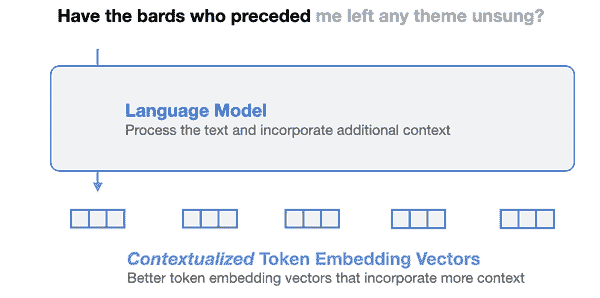

###### 图 6-7\. 语言模型生成的上下文化标嵌入比原始静态标嵌入更为优越。

语言模型并不使用静态向量来表示每个标记或单词，而是生成上下文化单词嵌入（如图 6-7 所示），根据上下文以不同的标记表示单词。这些向量可以被其他系统用于各种任务。除了我们在前一段中提到的文本应用外，这些上下文化向量，例如，正是驱动 AI 图像生成系统如 Dall-E、Midjourney 和 Stable Diffusion 的力量。

### 代码示例：来自语言模型（如 BERT）的上下文化单词嵌入。

让我们看看如何生成上下文化单词嵌入，这段代码的大部分现在应该对你很熟悉：

```py
from transformers import AutoModel, AutoTokenizer
# Load a tokenizer
tokenizer = AutoTokenizer.from_pretrained("microsoft/deberta-base")
# Load a language model
model = AutoModel.from_pretrained("microsoft/deberta-v3-xsmall")
# Tokenize the sentence
tokens = tokenizer('Hello world', return_tensors='pt')
# Process the tokens
output = model(**tokens)[0]
```

这段代码下载一个预训练的分词器和模型，然后使用它们处理字符串“Hello world”。模型的输出结果随后保存在输出变量中。让我们通过首先打印其维度来检查该变量（我们预计它是一个多维数组）。

我们在这里使用的模型称为 DeBERTA v3，在撰写时，它是表现最佳的标记嵌入语言模型之一，同时体积小且高效。其详细描述见论文[DeBERTaV3: Improving DeBERTa using ELECTRA-Style Pre-Training with Gradient-Disentangled Embedding Sharing](https://openreview.net/forum?id=sE7-XhLxHA)。

```py
output.shape
```

这将输出：

```py
torch.Size([1, 4, 384])
```

我们可以忽略第一维，将其视为四个标记，每个标记嵌入 384 个值。

但这四个向量是什么？分词器是否将两个单词分解成四个标记，还是发生了其他情况？我们可以利用所学的分词器知识来检查它们：

```py
for token in tokens['input_ids'][0]:
    print(tokenizer.decode(token))
```

这将输出：

```py
[CLS] 
Hello
world 
[SEP]
```

这表明这个特定的分词器和模型通过在字符串的开头和结尾添加[CLS]和[SEP]标记来操作。

我们的语言模型现在已经处理了文本输入。其输出结果如下：

```py
tensor([[
[-3.3060, -0.0507, -0.1098, ..., -0.1704, -0.1618, 0.6932], 
[ 0.8918, 0.0740, -0.1583, ..., 0.1869, 1.4760, 0.0751], 
[ 0.0871, 0.6364, -0.3050, ..., 0.4729, -0.1829, 1.0157], 
[-3.1624, -0.1436, -0.0941, ..., -0.0290, -0.1265, 0.7954]
]], grad_fn=<NativeLayerNormBackward0>)
```

这是语言模型的原始输出。大型语言模型的应用基于这样的输出。

我们可以在图 6-8 中回顾输入标记化和语言模型的输出。技术上，从词元 ID 转换为原始嵌入是语言模型内部发生的第一步。

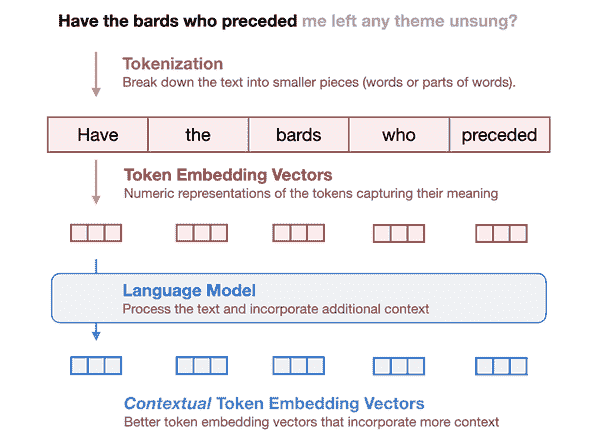

###### 图 6-8\. 一个语言模型在原始静态嵌入上操作，并生成上下文文本嵌入。

这样的可视化对于下一章我们开始研究基于 Transformer 的 LLMs 如何运作至关重要。

# 词嵌入

词元嵌入即使在大型语言模型之外也很有用。通过如 Word2Vec、Glove 和 Fasttext 等预-LLM 方法生成的嵌入在 NLP 及其之外仍然有用。在本节中，我们将探讨如何使用预训练的 Word2Vec 嵌入，并简要介绍该方法如何创建词嵌入。了解 Word2Vec 的训练过程将为后续关于对比训练的章节做好准备。接下来我们将看到这些嵌入如何用于推荐系统。

## 使用预训练词嵌入

让我们看看如何使用[Gensim](https://radimrehurek.com/gensim/)库下载预训练的词嵌入。

```py
import gensim
import gensim.downloader as api
from sklearn.metrics.pairwise import cosine_similarity
import seaborn as sns
import matplotlib.pyplot as plt
import warnings
warnings.filterwarnings('ignore')
# Download embeddings (66MB, glove, trained on wikipedia, vector size: 50)
# Other options include "word2vec-google-news-300"
# More options at https://github.com/RaRe-Technologies/gensim-data
model = api.load("glove-wiki-gigaword-50")
```

在这里，我们下载了在维基百科上训练的大量单词嵌入。我们可以通过查看特定单词的最近邻，来探索嵌入空间，例如‘king’：

```py
model.most_similar([model['king']], topn=11)
```

其输出为：

```py
[('king', 1.0000001192092896), 
('prince', 0.8236179351806641), 
('queen', 0.7839043140411377), 
('ii', 0.7746230363845825), 
('emperor', 0.7736247777938843), 
('son', 0.766719400882721), 
('uncle', 0.7627150416374207), 
('kingdom', 0.7542161345481873), 
('throne', 0.7539914846420288), 
('brother', 0.7492411136627197), 
('ruler', 0.7434253692626953)]
```

## Word2vec 算法与对比训练

论文[高效估计向量空间中的词表示](https://arxiv.org/abs/1301.3781)中描述的 word2vec 算法在[图解 Word2vec](https://jalammar.github.io/illustrated-word2vec/)中有详细说明。这里的中心思想在于我们在下一节讨论为推荐引擎创建嵌入的一种方法时进行扩展。

就像 LLMs 一样，word2vec 是基于从文本生成的示例进行训练的。举个例子，我们有来自弗兰克·赫伯特的*沙丘*小说中的文本“*你不可制造与人类心智相似的机器*”。该算法使用滑动窗口生成训练示例。比如，我们可以设定窗口大小为 2，这意味着我们考虑中心单词两侧的两个邻居。

这些嵌入是从分类任务中生成的。该任务用于训练神经网络以预测单词是否出现在同一上下文中。我们可以将其视为一个神经网络，它接受两个单词，并在它们倾向于出现在同一上下文时输出 1，而在它们不出现在同一上下文时输出 0。

在滑动窗口的第一个位置，我们可以生成四个训练示例，如图 6-9 所示。

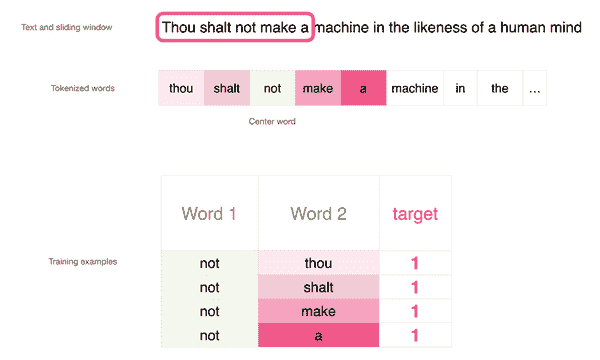

###### 图 6-9\. 使用滑动窗口生成训练样本，以便 word2vec 算法后续预测两个单词是否为邻居。

在每个生成的训练样本中，中心的单词作为一个输入，每个邻居在每个训练样本中都是一个独特的第二输入。我们期望最终训练的模型能够分类这种邻居关系，并在收到确实是邻居的两个输入单词时输出 1。

这些训练样本在图 6-10 中进行了可视化。

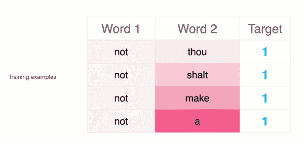

###### 图 6-10\. 每个生成的训练样本展示了一对邻居单词。

然而，如果我们只有目标值为 1 的数据集，那么模型可以通过始终输出 1 来轻松应对。为了绕过这个问题，我们需要用通常不是邻居的单词例子丰富我们的训练数据集。这些被称为负例，如图 6-11 所示。

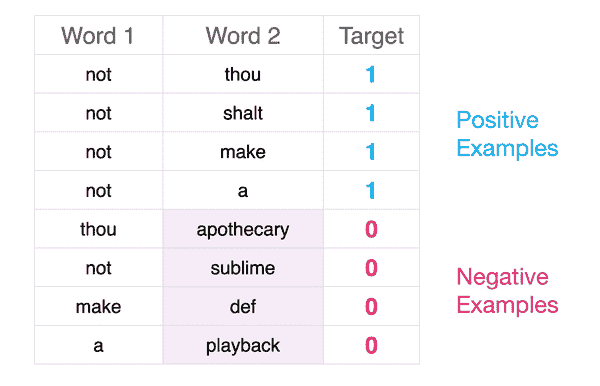

###### 图 6-11\. 我们需要向模型呈现负例：通常不是邻居的单词。更好的模型能够更好地区分正例和负例。

事实证明，我们在选择负例时不必过于科学。许多有用的模型是通过简单地从随机生成的例子中检测正例的能力而得来的（灵感来自一个重要的思想，称为噪声对比估计，并在[Noise-contrastive estimation: A new estimation principle for unnormalized statistical models](https://proceedings.mlr.press/v9/gutmann10a/gutmann10a.pdf)中描述）。因此，在这种情况下，我们获取随机单词并将其添加到数据集中，并表明它们不是邻居（因此模型在看到这些时应输出 0）。

通过这一点，我们已经看到了 word2vec 的两个主要概念（图 6-12）：Skipgram - 选择邻居单词的方法，以及负采样 - 通过从数据集中随机抽样添加负例。

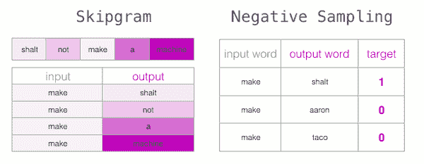

###### 图 6-12\. Skipgram 和负采样是 word2vec 算法背后的两个主要思想，并且在许多可以表述为标记序列问题的其他问题中也很有用。

我们可以通过运行文本生成数百万甚至数十亿个训练示例。在对该数据集进行神经网络训练之前，我们需要做出一些标记决策，正如我们在 LLM 标记器中看到的那样，包括如何处理大写和标点，以及我们想要在词汇表中有多少个标记。

然后我们为每个标记创建一个嵌入向量，并随机初始化它们，如图 6-13 所示。实际上，这是一个维度为 vocab_size x embedding_dimensions 的矩阵。

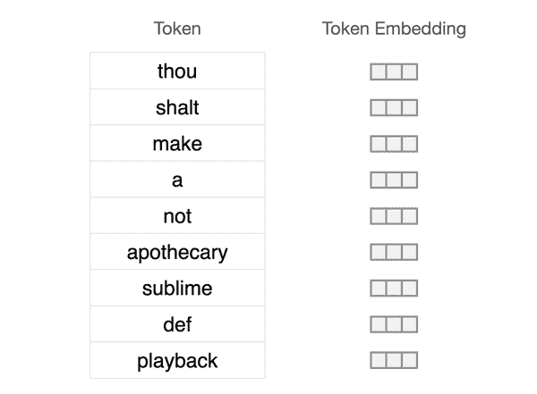

###### 图 6-13\. 词汇及其起始的随机未初始化的嵌入向量。

然后，一个模型在每个示例上进行训练，接收两个嵌入向量并预测它们是否相关。我们可以在图 6-14 中看到这个过程的样子：


###### 图 6-14\. 一个神经网络被训练来预测两个词是否相邻。它在训练过程中更新嵌入，以生成最终的训练嵌入。

根据预测是否正确，典型的机器学习训练步骤会更新嵌入，使得下次模型展示这两个向量时，有更大的机会变得更准确。到训练过程结束时，我们为词汇表中的所有标记拥有更好的嵌入。

这种模型的想法是将两个向量结合并预测它们是否具有某种关系，这是机器学习中最强大的想法之一，并且一次又一次地证明在语言模型中非常有效。这就是为什么我们专门用章节 XXX 来详细讨论这一概念，以及它如何优化语言模型以应对特定任务（如句子嵌入和检索）。

同样的想法也在弥合文本和图像等模态之间至关重要，这对 AI 图像生成模型来说是关键。在该模型中，给定一张图像和一个标题，模型应该预测这个标题是否描述了这张图像。

# 推荐系统的嵌入

标记嵌入的概念在许多其他领域也非常有用。在行业中，例如，它广泛用于推荐系统。

## 通过嵌入推荐歌曲

在本节中，我们将使用 Word2vec 算法，通过人造音乐播放列表来嵌入歌曲。想象一下，如果我们将每首歌视为一个单词或标记，而将每个播放列表视为一个句子。这些嵌入可以用来推荐那些经常一起出现在播放列表中的相似歌曲。

我们将使用的[数据集](https://www.cs.cornell.edu/~shuochen/lme/data_page.html)是由康奈尔大学的 Shuo Chen 收集的。该数据集包含来自美国数百个广播电台的播放列表。图 6-15 展示了该数据集。


###### 图 6-15。为了捕捉歌曲相似性的歌曲嵌入，我们将使用一个由包含歌曲列表的播放列表集合组成的数据集。

让我们在查看构建方式之前演示最终产品。所以，让我们给出几首歌曲，看看它推荐什么。

让我们开始，选择迈克尔·杰克逊的*比利·珍*，歌曲 ID 为#3822。

```py
print_recommendations(3822)
title Billie Jean 
artist Michael Jackson
Recommendations:
```

| id | 标题 | 艺术家 |
| --- | --- | --- |
| 4181 | 吻 | 王子与革命 |
| 12749 | 想要开始一些事情 | 迈克尔·杰克逊 |
| 1506 | 你让我感觉的方式 | 迈克尔·杰克逊 |
| 3396 | 假期 | 麦当娜 |
| 500 | 不停直到你满足 | 迈克尔·杰克逊 |

这看起来合理。麦当娜、王子和其他迈克尔·杰克逊的歌曲是最近的邻居。

让我们从流行音乐转向说唱，看看 2Pac 的《加州爱情》的邻居：

```py
print_recommendations(842)
```

| id | 标题 | 艺术家 |
| --- | --- | --- |
| 413 | 如果我统治世界（想象一下）（与劳伦·希尔） | 纳斯 |
| 196 | 我会想念你 | Puff Daddy & The Family |
| 330 | 爱或恨（与 50 Cent） | The Game |
| 211 | 催眠 | 知名 B.I.G. |
| 5788 | 像热一样抛掉（与法瑞尔） | snoop dogg |

另一个相当合理的列表！

```py
# Get the playlist dataset file
data = request.urlopen('https://storage.googleapis.com/maps-premium/dataset/yes_complete/train.txt')
# Parse the playlist dataset file. Skip the first two lines as
# they only contain metadata
lines = data.read().decode("utf-8").split('\n')[2:]
# Remove playlists with only one song
playlists = [s.rstrip().split() for s in lines if len(s.split()) > 1]
print( 'Playlist #1:\n ', playlists[0], '\n')
print( 'Playlist #2:\n ', playlists[1])
Playlist #1: ['0', '1', '2', '3', '4', '5', ..., '43'] 
Playlist #2: ['78', '79', '80', '3', '62', ..., '210']
Let's train the model:
model = Word2Vec(playlists, vector_size=32, window=20, negative=50, min_count=1, workers=4)
```

训练需要一两分钟，结果是为我们拥有的每首歌计算嵌入。现在，我们可以像之前处理单词一样使用这些嵌入来找到相似歌曲。

```py
song_id = 2172
# Ask the model for songs similar to song #2172
model.wv.most_similar(positive=str(song_id))
```

其输出为：

```py
[('2976', 0.9977465271949768), 
('3167', 0.9977430701255798), 
('3094', 0.9975950717926025), 
('2640', 0.9966474175453186), 
('2849', 0.9963167905807495)]
```

这是与歌曲 2172 相似的歌曲嵌入列表。请查看 jupyter 笔记本中的代码，该代码将歌曲 ID 与其名称和艺术家名称链接起来。

在这种情况下，歌曲是：

```py
title Fade To Black 
artist Metallica
```

结果推荐都是在同一重金属和硬摇滚类型中：

| id | 标题 | 艺术家 |
| --- | --- | --- |
| 11473 | 小吉他 | 瓦恩·海伦 |
| 3167 | 不羁 | 瓦恩·海伦 |
| 5586 | 最后的行列 | 迪奥 |
| 5634 | 布朗石先生 | 枪与玫瑰 |
| 3094 | 违反法律 | 猶達斯·普里斯特 |

# 摘要

在本章中，我们涵盖了 LLM 令牌、分词器以及使用令牌嵌入超越语言模型的有用方法。

+   分词器是处理输入到大型语言模型（LLM）的第一步——将文本转换为令牌 ID 列表。

+   一些常见的分词方案包括将文本拆分为单词、子词标记、字符或字节。

+   现实世界预训练分词器的巡览（从 BERT 到 GPT2、GPT4 及其他模型）向我们展示了某些分词器在保持信息（如大写、新行或其他语言的标记）方面表现更佳的领域，以及在某些方面分词器之间的不同之处（例如，它们如何拆分某些词）。

+   三个主要的分词器设计决策是分词器算法（如 BPE、WordPiece、SentencePiece）、分词参数（包括词汇表大小、特殊标记、大写处理、对大写和不同语言的处理），以及分词器训练所用的数据集。

+   语言模型也是高质量上下文化词嵌入的创造者，这些词嵌入在静态嵌入的基础上得到了改善。这些上下文化词嵌入用于包括命名实体识别（NER）、抽取式文本摘要和跨度分类等任务。

+   在大型语言模型（LLMs）出现之前，词嵌入方法如 word2vec、Glove 和 Fasttext 曾很流行。它们在语言处理内外仍然有一些应用场景。

+   Word2Vec 算法依赖于两个主要思想：Skipgram 和负采样。它还使用了对比训练，类似于我们将在对比训练章节中看到的内容。

+   词嵌入对创建和改进推荐系统非常有用，正如我们在构建的基于精选歌曲播放列表的音乐推荐系统中所看到的那样。
