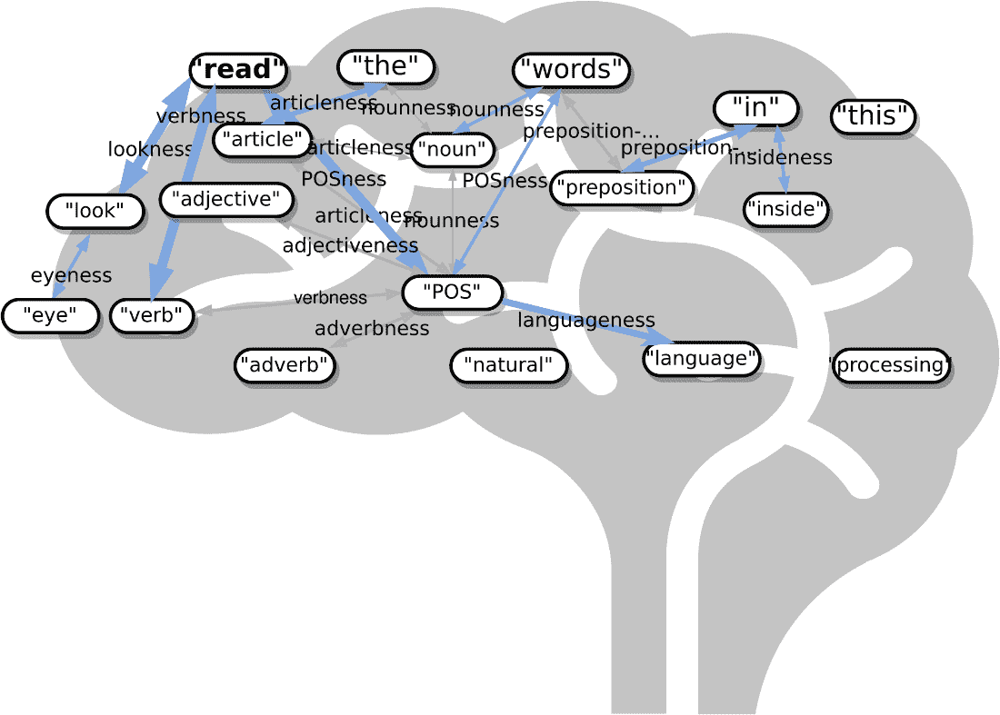
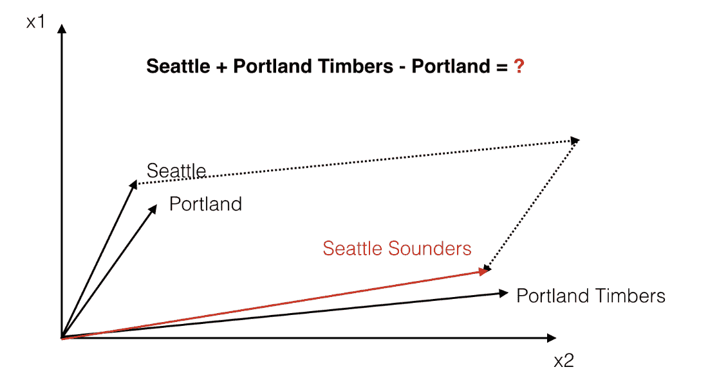
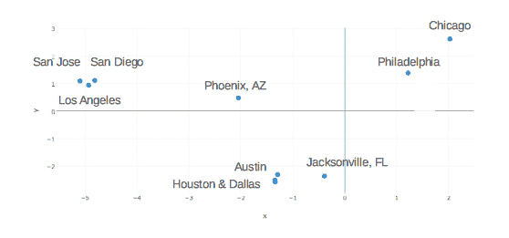
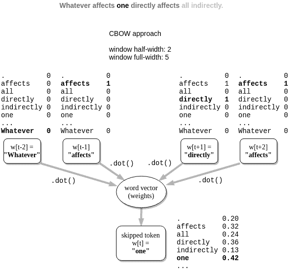
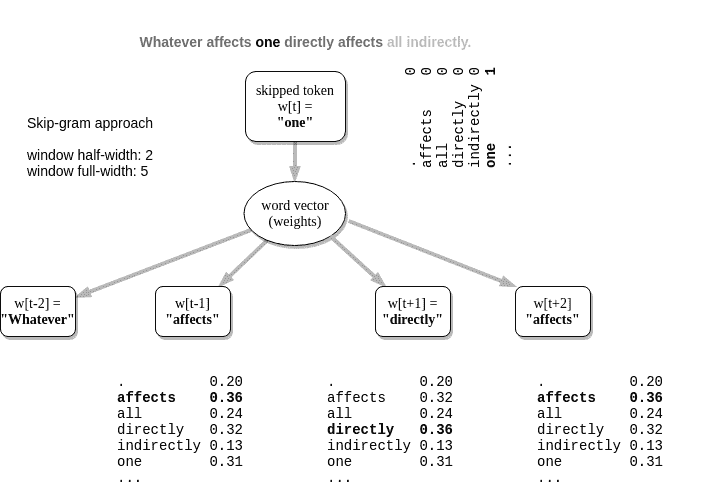
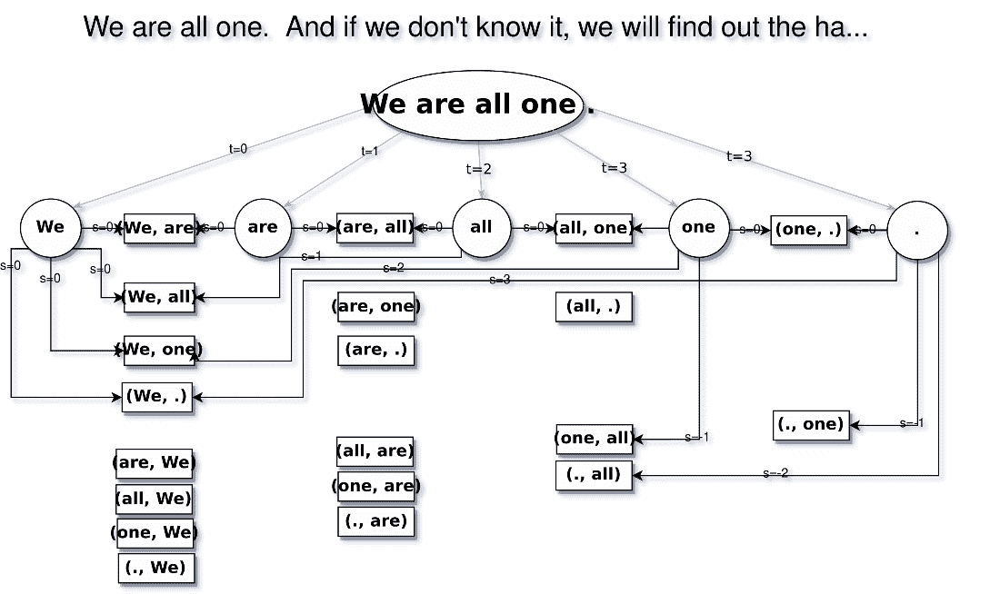
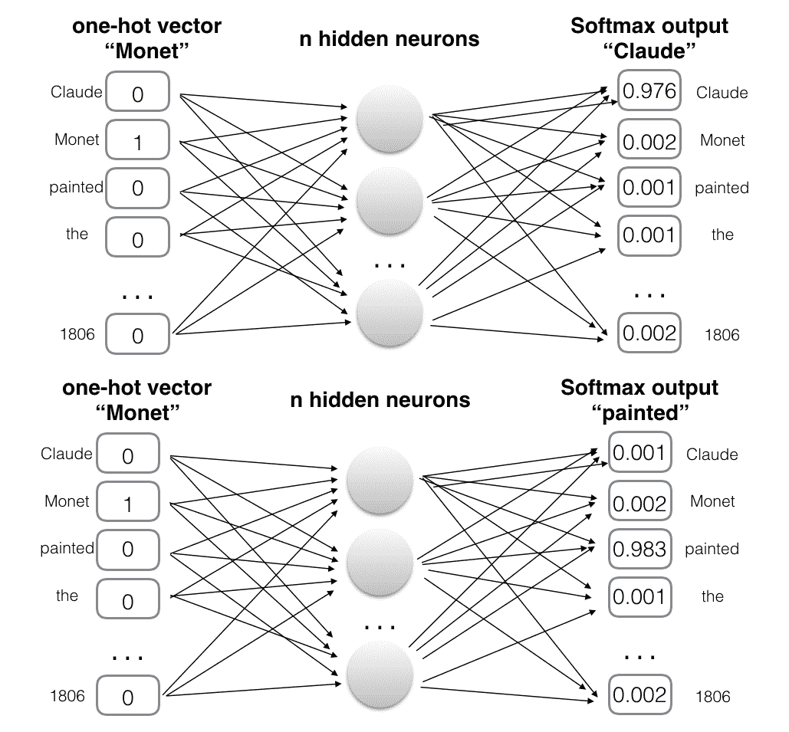
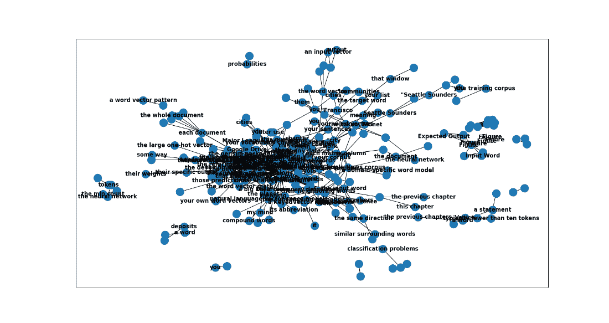
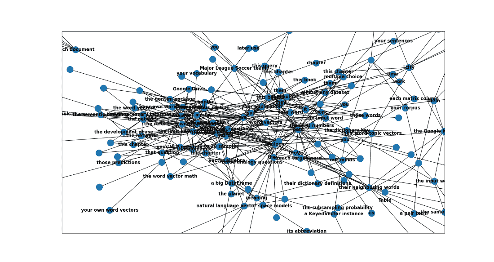

# 第六章：使用词嵌入（词向量）进行推理的 6 个原因

### 本章涵盖内容

+   理解词嵌入或词向量

+   用向量表示含义

+   定制词嵌入以创建特定领域的向量

+   使用词嵌入进行推理

+   可视化单词的含义

*词嵌入*可能是你 NLP 工具箱中最易于接近和普遍有用的工具。它们可以让你的 NLP 流水线对单词有一个一般的理解。在本章中，你将学习如何将词嵌入应用到现实世界的应用中。同样重要的是，你将学会在哪里不要使用词嵌入。希望这些例子能帮助你在商业和个人生活中构想出新的有趣的应用。

你可以把单词向量想象成 Dota 2 英雄或角色扮演游戏（RPG）角色和怪物的属性列表。现在想象一下，这些角色表或简介上没有文字。你会希望保持所有数字的顺序一致，这样你就知道每个数字的含义。这就是词向量的工作方式。这些数字没有标记它们的含义。它们只是放在向量中的一个一致的*位置*或位置。这样，当你将两个单词向量相加、相减或相乘时，一个向量中的“力量”属性就与另一个向量中的力量属性相匹配。同样适用于 D&D（龙与地下城）中的“敏捷”、“智力”和阵营或哲学属性。

富有思想的角色扮演游戏经常鼓励对哲学和单词进行更深入的思考，例如"混乱善良"或"法律邪恶"等角色个性的微妙组合。我非常感激我的童年主持人开启了我的眼界，让我看到了像“善”和“恶”或“守法”和“混乱”这样的单词所暗示的错误二分法。[1] 在这里你将学习到的词向量有足够的空间来表达几乎任何文本和任何语言中的单词的每个可能的可量化属性。并且单词向量的属性或特征以复杂的方式相互交织在一起，可以轻松处理诸如“守法邪恶”，“善意的独裁者”和“利他的恶意”等概念。

学习词嵌入通常被归类为*表示学习*算法。[2] 任何词嵌入的目标都是构建一个单词“特征”的紧凑数值表示。这些数值表示使得机器能够以有意义的方式处理你的单词（或你的 Dota 2 角色表）。

## 6.1 这是你的单词大脑

词嵌入是我们用来表示含义的向量。而你的大脑是存储含义的地方。你的大脑受到单词的影响。就像化学物质影响大脑一样，单词也会影响大脑。“This is your brain on drugs”是 80 年代反毒品电视广告活动的一句流行口号，其中有一对鸡蛋在煎锅中煎炸。[3]

幸运的是，文字比化学物质更温和、更有益的影响者。图 6.1 中显示的文字在你大脑中的形象与鸡蛋在煎锅中滋滋作响有些不同。这张草图为你提供了一种想象的方式，当你阅读这些句子时，你的神经元会火花四溅，创造出你大脑内的思维。你的大脑通过向适当的邻近神经元发送信号将这些词的意义连接在一起。词嵌入是这些单词之间连接的矢量表示。因此，它们也是你大脑中神经元连接网络的节点嵌入的一种粗略表示。^([4])

##### 图 6.1 你大脑中的词嵌入



当你思考一个单词时，你可以把词嵌入看作是你大脑中神经元触发模式的矢量表示。每当你想到一个词，这个思想就会在你的大脑中引发一波电荷和化学反应，在与该词或思想相关联的神经元开始。你的大脑内部的神经元像水池中扔下的圆形涟漪一样波动。但是，这些电信号只有从某些神经元流出，而不是其他神经元。

当你阅读这个句子中的词时，你会在你的神经元中引发一连串的活动，就像图 6.1 中的草图中那样。事实上，研究人员发现人工神经网络权重与词嵌入相似的模式和你思考词语时大脑内部活动的模式。^([5]) ^([6])

神经元中流出的电子就像学生在放学铃声响起时从学校门口跑出来一样。词语或思想就像学校的铃声。当然，你的思维和大脑中的电子比学生要快得多。你甚至不需要说出或听到这个词，就能在你的大脑中触发它的模式。你只需要想一想它。就像孩子们跑出去玩耍一样，电子永远不会沿着相同的路径流动。正如一个词的意义随着时间的推移而演变，你对一个词的嵌入也在不断演变。你的大脑是一个永不停止的语言学习者，与康奈尔大学的无止境语言学习者系统并没有太大的不同。^([7])

有些人对这个想法产生了过多的幻想，他们认为你可以用言辞实现一种形式的心灵控制。当我在 Reddit 上寻找关于 NLP 研究的信息时，我被 `r/NLP` 子论坛分散了注意力。这不是你想的那样。事实证明，一些励志演讲者在 Reddit 上为他们的 70 年代的"神经语言编程"赚钱计划占了" NLP"这个词。幸运的是，词向量能够很好地处理这种歧义和错误信息。

你甚至不需要告诉词向量算法你希望" NLP"这个词的含义是什么。它将根据你用于训练它的文本中它的用法找出这个缩写词最有用和最流行的含义。创建词向量的算法是一种自监督的机器学习算法。这意味着你不需要词典或同义词词典来喂养你的算法。你只需要很多文本。在本章的后面，你只需收集一堆维基百科文章来用作你的训练集。但任何语言的任何文本都可以，只要它包含了你感兴趣的很多单词。

还有一个需要考虑的"大脑上的文字"。文字不仅影响你的思维方式，还影响你的交流方式。而且你有点像是集体意识中的一个神经元，是社会的大脑。对我来说，"有点"这个词是一个特别强大的神经连接模式，因为我是从丹尼尔·丹尼特的《直觉泵》一书中学到了它的含义。它唤起了与复杂思想和词语相关联的联想，比如图灵用来解释 AI 和计算器背后机制完全相同的概念"渐进主义"。达尔文使用渐进主义这个概念来解释语言理解人类大脑如何通过简单机制从单细胞生物进化而来。

## 6.2 应用

哎呀，这些令人惊叹的词向量有什么用？词向量可以在需要机器理解单词或短 N-gram 的任何地方使用。以下是一些词向量在现实世界中已被证明有用的 N-gram 的示例：

+   标签

+   标签和关键词

+   命名实体（人、地点、事物）

+   标题（歌曲、诗歌、书籍、文章）

+   职称和企业名称

+   网页标题

+   网页 URL 和文件路径

+   Wikipedia 文章标题

甚至有许多实际应用场景，您的 NLP 流水线可以利用词向量理解这些短语的能力：

+   语义搜索工作、网页等等

+   舌尖上的词查找器

+   改写标题或句子

+   情感塑造

+   回答词类比问题

+   用文字和名称推理

在学术界，研究人员使用词向量解决了 200 多个 NLP 问题：

+   词性标注

+   命名实体识别（NER）

+   类比查询

+   相似度查询

+   音译

+   依赖关系解析

### 6.2.1 寻求含义

在过去（20 年前），搜索引擎尝试根据网页中的 TF-IDF 分数找到您输入的所有单词。良好的搜索引擎尝试将您的搜索词与同义词一起增强。它们有时甚至会改变您的单词，以猜测您实际上在输入特定的单词组合时“意味着”什么。因此，如果您搜索“sailing cat”，它们会将“cat”更改为“catamaran”，以为您消除歧义。在幕后，在排名结果时，搜索引擎甚至可能将像“positive sum game”的查询更改为“nonzero sum game”，以将您发送到正确的维基百科页面。

信息检索研究人员随后发现了如何使潜在语义分析更加有效——词嵌入。事实上，GloVE 词嵌入算法只是从网页中提取的数百万句子上的潜在语义分析。[[13]](#_footnotedef_13) 这些新的词嵌入（向量）使得搜索引擎能够直接将你的查询的“含义”与网页匹配，而不需要猜测你的意图。你的搜索词的嵌入提供了你的搜索意图的直接数值表示，基于这些单词在互联网上的平均含义。

##### 警告

词嵌入不代表*您*对单词的预期解释。它们代表了用于训练词嵌入语言模型的文档和页面的所有人的单词的平均含义。这意味着词嵌入包含了用于训练模型的网页的所有人的偏见和刻板印象。

搜索引擎不再需要进行同义词替换、词干提取、词形还原、大小写转换和基于硬编码规则的消歧义。它们基于搜索索引中所有页面的文本创建词嵌入。不幸的是，主导性的搜索引擎决定利用这种新发现的力量，将词嵌入与产品和广告匹配，而不是真实的单词。AdWords 和 iAds 的单词嵌入根据营销人员支付的费用加权，以转移你的注意力，使你远离你的真实搜索意图。基本上，大型科技公司使企业能够贿赂搜索引擎，以操纵你并训练你成为他们的消费僵尸。

如果你使用一个更诚实的搜索引擎，如 Startpage，^([14]) DISROOT，^([15]) 或 Wolfram Alpha ^([16])，你会发现它们会给你真正想要的东西。如果你有一些黑网页或私人文件，你想将它们用作组织或个人生活的知识库，你可以自主托管一个具备尖端 NLP 技术的搜索引擎：Elastic Search，^([17]) Meilisearch，^([18]) SearX，^([19]) Apache Solr，^([20]) Apache Lucene，^([21]) Qwant，^([22]) 或 Sphinx。^([23])即使是 PostgreSQL 也能在全文搜索精度方面胜过主流搜索引擎。当你使用一个彻头彻尾诚实的搜索引擎时，你会惊讶地发现你对这个世界的看法变得更加清晰。

这些语义搜索引擎使用向量搜索来查询单词和文档嵌入（向量）数据库。

开源的 Python 工具，比如 NBOOST 或 PynnDescent，让你可以将单词嵌入与你喜欢的 TF-IDF 搜索算法集成起来。^([24])如果你想要一种可扩展的方法来搜索你精细调整过的嵌入和向量，你可以使用近似最近邻算法来索引你喜欢的向量。^([25])

这就是单词嵌入的优点。所有你所熟悉的向量代数数学知识，如计算距离，同样适用于单词嵌入。只不过这个距离现在代表的是单词在*意义*上的距离，而不是物理距离。而且这些新的嵌入比你熟悉的 TF-IDF 向量中的数千个维度更紧凑和更加有意义。

你可以使用“意义距离”在单词数据库中搜索所有与你心中想要的职业名称*相近*的职位名称，这可能会揭示出一些你没有想到的职业名称。或者你的搜索引擎可以被设计为在搜索查询中添加其他词语，以确保返回相关的职业标题。这就像是一个可以理解词义的自动完成搜索框，被称为*语义搜索*。

```py
>>> from nessvec.indexers import Index  # #1
>>> index = Index(num_vecs=100_000)  # #2
>>> index.get_nearest("Engineer").round(2)
Engineer       0.00
engineer       0.23
Engineers      0.27
Engineering    0.30
Architect      0.35
engineers      0.36
Technician     0.36
Programmer     0.39
Consultant     0.39
Scientist      0.39
```

您可以看到，查找词嵌入的最近邻居有点像在同义词词典中查找一个词。但这是一个比您当地书店或在线词典更模糊且完整的词典。您很快就会看到如何自定义此词典以适应您喜欢的任何领域。例如，您可以训练它只与英国的职位发布一起使用，或者甚至是印度或澳大利亚，具体取决于您的兴趣区域。或者您可以训练它更好地处理硅谷的技术工作而不是纽约的金融和银行工作。您甚至可以训练它处理 2 元组和 3 元组，如果您想要它处理更长的职位头衔，比如"软件开发人员"或"NLP 工程师"。

关于词嵌入的另一个好处是它们是*模糊的*。您可能已经注意到了“工程师”的几个附近邻居，这些邻居在同义词词典中可能找不到。而且您可以根据需要不断扩展列表。所以如果你在考虑一个软件工程师而不是一名建筑师，你可能会想要扫描`get_nearest()`列表以寻找另一个单词进行搜索，比如"程序员"：

```py
>>> index.get_nearest("Programmer").round(2)
Programmer    -0.00
programmer     0.28
Developer      0.33
Programmers    0.34
Programming    0.37
Engineer       0.39
Software       0.40
Consultant     0.42
programmers    0.42
Analyst        0.42
dtype: float64
>>> index.get_nearest("Developer").round(2)
Developer     -0.00
developer      0.25
Developers     0.25
Programmer     0.33
Software       0.35
developers     0.37
Designer       0.38
Architect      0.39
Publisher      0.39
Development    0.40
```

哇，这很奇怪。看起来"开发者"这个头衔经常也与"出版商"这个词联系在一起。在与 Manning 出版公司的开发编辑、开发经理甚至技术开发编辑一起工作之前，我从来没有想过为什么会这样。就在今天，这些"开发者"催促我加紧写这一章节。

### 6.2.2 合并词嵌入

关于词嵌入的另一个好处是您可以以任何您喜欢的方式将它们组合起来创建新单词！嗯，当然，您可以以传统的方式将多个单词组合在一起，只需将字符串附加在一起。在 Python 中，您可以使用加法或`+`运算符来实现这一点：

```py
>>> "Chief" + "Engineer"
'ChiefEngineer'
>>> "Chief" + " " + "Engineer"
'Chief Engineer'
```

词嵌入数学运算的效果甚至比这更好。您可以将这些词的含义相加，试图找到一个单词来捕捉您所添加的两个单词的含义

```py
>>> chief = (index.data[index.vocab["Chief"]]
...     + index.data[index.vocab["Engineer"]])
>>> index.get_nearest(chief)
Engineer     0.110178
Chief        0.128640
Officer      0.310105
Commander    0.315710
engineer     0.329355
Architect    0.350434
Scientist    0.356390
Assistant    0.356841
Deputy       0.363417
Engineers    0.363686
```

所以，如果你想有一天成为一名"首席工程师"，看起来"科学家"、"建筑师"和"副手"也可能是你在路上会遇到的职位头衔。

那么在本章开头提到的那个尖端的词语查找应用程序呢？您是否曾经试图回忆起一个著名人士的名字，只是对他们有一个笼统的印象，比如说这样：

> 早在 20 世纪初，她在欧洲发明了与物理有关的东西。

如果您将该句输入 Google 或 Bing，您可能不会得到您正在寻找的直接答案，"玛丽·居里"。Google 搜索很可能只会给您一些著名物理学家的列表链接，包括男性和女性。

你需要浏览几页才能找到你要的答案。但是一旦你找到“Marie Curie”，Google 或 Bing 就会记住它。下次你寻找一个科学家的时候，它们可能会在提供你搜索结果方面变得更加优秀。（至少，在我们研究这本书时，它对我们提供的搜索结果做到了这一点。我们不得不使用私人浏览器窗口来确保您的搜索结果与我们的相似。）

通过词向量，你可以搜索结合了“woman”、“Europe”、“physics”、“scientist”和“famous”的词汇或名称，并且这会让你接近你寻找的“Marie Curie”这个词语的记号。而想要实现这一点，你只需将你想要组合的每个单词的向量相加即可：

```py
>>> answer_vector = wv['woman'] + wv['Europe'] + wv['physics'] +
...     wv['scientist']
```

在这章节中，我们会向你展示确切的方法来做这个查询。你甚至可以看到如何使用词向量数学来消除一些单词中的性别偏见：

```py
>>> answer_vector = wv['woman'] + wv['Europe'] + wv['physics'] +\
...     wv['scientist'] - wv['male'] - 2 * wv['man']
```

通过词向量，你可以从“女人”中去掉“男人”！

### 6.2.3 类比题

如果你把你的问题转化为一个类比题，会怎样？你的“查询”会变成这样：

> 谁与核物理学的关系，如同 Louis Pasteur 与细菌的关系？

再次强调，Google 搜索、Bing 甚至 Duck Duck Go 对这个问题并没有太大帮助^([26])。但是用词向量，解决方案就像是从“germs（细菌）”中减去“Louis Pasteur”，然后加入一些“physics（物理学）”：

```py
>>> answer_vector = wv['Louis_Pasteur'] - wv['germs'] + wv['physics']
```

如果你对无关领域的人，比如音乐家和科学家的笼统类比题感兴趣，你也可以参与其中。

> 谁是音乐界的玛丽·居里？

或者

> 玛丽·居里与科学的关系，如同谁与音乐的关系？

你能搞清楚那个问题的向量空间数学会是什么吗？

你可能在英语类比题的标准化测试中见过这样的问题，比如 SAT、ACT 或 GRE 考试。有时它们是用正式的数学符号写成这样的：

```py
MARIE CURIE : SCIENCE :: ? : MUSIC
```

这样做是否会更容易猜出这些单词的向量数学？一种可能性是这样的：

```py
>>> wv['Marie_Curie'] - wv['science'] + wv['music']
```

而且你可以回答关于人和职业以外的事物的类似问题，比如体育队和城市：

> The Timbers are to Portland as what is to Seattle?

在标准化测试形式中，如下所示：

```py
TIMBERS : PORTLAND :: ? : SEATTLE
```

但是，更常见的是，标准化测试使用英语词汇词汇，并提问一些没有趣味性的问题，例如以下问题：

```py
WALK : LEGS :: ? : MOUTH
```

或者

```py
ANALOGY : WORDS :: ? : NUMBERS
```

所有这些“口头禅”式的问题对于词向量来说是小菜一碟，即使没有多个选项供你选择，回答类比题仍然很困难。自然语言处理会通过词向量来解救你。

词嵌入可以用来回答甚至这些模糊的问题和类比问题。 只要答案的向量存在于您的词汇表中，词嵌入就可以帮助您记住您舌尖上的任何单词或名称。（对于谷歌预先训练的 Word2Vec 模型，您的单词几乎肯定存在于谷歌训练的 100 亿字的新闻源中，除非您的单词是在 2013 年之后创建的。）并且嵌入甚至可以处理您甚至无法以搜索查询或类比形式提出的问题。

您可以在本章稍后的“类比推理”部分了解一些嵌入数学知识。

### 6.2.4 Word2Vec 创新

在我们的大脑神经元的连接中，彼此靠近使用的单词会堆积在一起，并最终定义这些单词在我们大脑中的含义。 作为一个幼儿，您会听到人们谈论“足球”，“消防车”，“计算机”和“书籍”之类的东西，您可以逐渐弄清楚它们的含义。 令人惊讶的是，您的机器不需要身体或大脑来理解单词，就像幼儿一样。

孩子可以在现实世界或图片书中指出几次物体后学会一个单词。 孩子永远不需要阅读字典或同义词词典。 就像一个孩子一样，机器“弄清楚”而不需要字典、同义词词典或任何其他受监督的机器学习数据集。 机器甚至不需要看到物体或图片。 该机器完全是由您解析文本和设置数据集的方式进行自我监督的。 您只需要大量的文本。

在之前的章节中，您可以忽略单词的附近上下文。 您所需做的只是计算在同一*文档*中使用单词的次数。 结果，如果您使您的文档非常非常短，这些共现次数就变得有用起来，用于表示单词本身的含义。 这是 Tomas Mikolov 及其 Word2vec NLP 算法的关键创新。 John Rubert Firth 推广了“一个单词由其周围的公司所特征化”的概念。[27])但要使词嵌入有用，则需要 Tomas Mikolov 专注于非常小的单词“公司”以及 21 世纪计算机的计算能力以及大量的机器可读文本语料库。 您不需要字典或同义词词典来训练您的词嵌入。 您只需要大量的文本。

这就是你在本章要做的事情。 你要教会机器成为一个海绵，就像一个幼儿一样。 您要帮助机器弄清楚单词的含义，而无需明确标记单词及其词典定义。 您只需要从任意随机书籍或网页中提取一堆随机句子。 一旦你对这些句子进行了分词和分段，这是您在前几章中学到的，您的 NLP 流水线将在每次读取新一批句子时变得越来越聪明。

在第二章和第三章中，你将词语与其邻居隔离开，并只关心每个 *文档* 中是否存在。你忽略了一个词的邻居对其意义的影响以及这些关系如何影响陈述的整体意义。我们的词袋概念将每个文档中的所有词混在一起形成一个统计性的袋子。在本章中，你将从只有少于十个标记的“邻域”中创建更小的词袋。你还将确保这些邻域有边界，以防止词语的意义溢出到相邻的句子中去。这个过程将有助于将你的词嵌入语言模型聚焦在彼此最相关的词上。

词嵌入可以帮助你识别同义词、反义词，或者只是属于同一类别的词，比如人、动物、地点、植物、名字或概念。在第四章的语义分析中我们以前也可以做到这一点，但是对词语邻近性的更严格的限制将体现在词嵌入的更严格的准确性上。词语的潜在语义分析（LSA）没有捕捉到词语的所有字面意义，更不用说暗示或隐藏的意义了。一些词语的内涵对于 LSA 过大的词袋来说更加模糊。

##### 词嵌入

词嵌入（有时被称为 *词向量*）是词义的高维数值向量表示，包括其字面和隐含的含义。因此，词嵌入可以捕捉词语的 *内涵*。在一个嵌入的某个地方，有一个关于“人性”、“动物性”、“地方性”、“物品性”甚至“概念性”的分数。词嵌入将所有这些分数以及其他词性的分数组合成一个密集的浮点值向量（没有零）。

词嵌入的密度和高（但不要太高）维度既是它们的强大之处，也是它们的局限之所在。这就是为什么在你的管道中同时使用密集的、高维度的嵌入和稀疏的超高维 TFIDF 向量或离散的词袋向量时，密集的、高维度的嵌入最有价值。

## 6.3 人工智能依赖于嵌入

词嵌入不仅是自然语言理解准确性的一大飞跃，也是对人工通用智能（AGI）希望的一次突破。

你认为你能区分出机器智能和非智能信息的区别吗？这可能没有你想象的那么明显。即使是大科技公司的“深度思维”也被他们最新最伟大的聊天机器人——2023 年的 Bing 和 Bard 给愚弄了。更简单、更真实的对话式搜索工具，如 you.com 和 neeva.com 及其聊天界面，在大多数互联网研究任务中都胜过了大科技公司的搜索。

哲学家道格拉斯·霍夫斯塔特在衡量智能时指出了一些要注意的事项。脚注[道格拉斯·R·霍夫斯塔特，《哥德尔、艾舍尔、巴赫：永恒的金边》(GEB)，第 26 页]

+   灵活性

+   处理模糊性

+   忽略无关细节

+   寻找相似性和类比

+   生成新的想法

很快你就会看到词嵌入是如何在你的软件中实现这些智能方面的。例如，词嵌入通过赋予单词模糊性和细微差别，使得以前的表示（如 TF-IDF 向量）无法做到的灵活性得以实现。在你的聊天机器人的以前版本中，如果你想要你的机器人对常见的问候做出灵活的回应，你就必须列举出所有可能的说法。

但是使用词嵌入，你可以用一个嵌入向量识别单词"hi"、"hello"和"yo"的**含义**。你可以通过提供尽可能多的文本来为你的机器人创建所有可能遇到的概念的嵌入。不再需要手工制作你的词汇表。

##### 谨慎

像词嵌入一样，智能本身是一个高维概念。这使得*人工通用智能*（AGI）成为一个难以捉摸的目标。要小心，不要让你的用户或老板认为你的聊天机器人是普遍具有智能的，即使它似乎实现了霍夫斯塔特的所有"基本要素"。

## 6.4 Word2Vec

2012 年，微软的实习生托马斯·米科洛夫找到了一种将单词的含义嵌入到向量空间中的方法。词嵌入或单词向量通常具有 100 到 500 个维度，取决于用于训练它们的语料库中的信息广度。米科洛夫训练了一个神经网络来预测每个目标单词附近的单词出现次数。米科洛夫使用了一个单隐藏层的网络，因此几乎任何线性机器学习模型都可以工作。逻辑回归、截断的奇异值分解、线性判别分析或朴素贝叶斯都可以很好地工作，并且已经成功地被其他人用来复制米科洛夫的结果。2013 年，在谷歌工作时，米科洛夫和他的队友发布了用于创建这些单词向量的软件，并将其称为"Word2Vec"。^([28])

Word2Vec 语言模型仅通过处理大量未标记的文本语料库来学习单词的含义。没有人需要为 Word2Vec 词汇表中的单词打标签。没有人需要告诉 Word2Vec 算法"玛丽·居里"是一位科学家，"Timbers" 是一支足球队，西雅图是一个城市，波特兰是俄勒冈州和缅因州的城市。也没有人需要告诉 Word2Vec 足球是一项运动，团队是一群人，城市既是"地方"也是"社区"。Word2Vec 可以自己学会这一切以及更多！你所需要的只是一个足够大的语料库，以便在与科学、足球或城市相关的其他单词附近提到"玛丽·居里"、"Timbers" 和"波特兰"。

Word2Vec 的这种无监督性质是使其如此强大的原因。世界充满了未标记、未分类和无结构的自然语言文本。

*无监督*学习和*监督*学习是机器学习的两种根本不同的方法。

##### 监督学习

在监督学习中，人类或人类团队必须使用目标变量的正确值标记数据。标签的一个示例是第四章中短信消息的"垃圾邮件"分类标签。人类更难标记的标签可能是单词"红色"或"火"的热度内涵的百分比得分。当人们想到机器学习时，他们大多数时候想到的是监督学习。监督模型只有在它能够衡量期望输出（标签）与其预测之间的差异时才能变得更好。

相反，无监督学习使机器能够直接从数据中学习，而无需任何人类的协助。训练数据不必由人类组织、结构化或标记。因此，像 Word2Vec 这样的无监督学习算法非常适用于自然语言文本。

##### 无监督学习

在无监督学习中，您训练模型执行一个任务，但没有任何标签，只有原始数据。像 k-means 或 DBSCAN 这样的聚类算法是无监督学习的例子。像主成分分析（PCA）和 t-分布随机邻居嵌入（t-SNE）这样的降维算法也是无监督机器学习技术。在无监督学习中，模型发现数据点之间的关系模式。无监督模型只需向其提供更多数据，就可以变得更加智能（更准确）。

不是尝试训练神经网络直接学习目标词义（基于该词义的标签），而是教会网络预测句子中目标词附近的词。所以在这个意义上，你确实有标签：你试图预测的附近单词。但是因为标签来自数据集本身，并且不需要手动标记，Word2Vec 训练算法绝对是一种无监督学习算法。

另一个领域是时间序列建模中使用这种无监督训练技术。时间序列模型通常是根据先前数值窗口来预测序列中的下一个值。在很多方面，时间序列问题与自然语言问题非常相似，因为它们处理有序数值（单词或数字）的序列。

预测本身并不是 Word2Vec 起作用的原因。预测只是达到目的的一种手段。你真正关心的是 Word2Vec 逐渐建立起来帮助它生成这些预测的内部表示，即向量。这种表示将比潜在语义分析（LSA）和潜在狄利克雷分配（LDiA）在第四章中产生的单词-主题向量更多地捕捉到目标单词的含义（其语义）。

##### 注意

通过尝试使用较低维度的内部表示重新预测输入的模型被称为*自动编码器*。这可能对你来说有些奇怪。这就像要求机器回显你刚刚问过它的内容，只是它们不能在你说话时把问题写下来。机器必须将你的问题压缩成速记。它必须对你提出的所有问题使用相同的速记算法（函数）。机器学习了你的陈述的新速记（向量）表示。

如果你想了解更多关于无监督深度学习模型的信息，这些模型可以创建像单词这样的高维对象的压缩表示，请搜索术语“自动编码器”。^([29])它们也是开始使用神经网络的常见方式，因为它们几乎可以应用于任何数据集。

Word2Vec 将学习关于你可能不会想到与所有单词相关联的事物。你知道每个单词都有一些地理位置、情感（积极性）和性别吗？如果你的语料库中的任何单词具有某种质量，比如“地点性”、“人性”、“概念性”或“女性”，那么所有其他单词在你的单词向量中也会为这些质量得分。当 Word2Vec 学习单词向量时，单词的含义会传递给相邻的单词。

你语料库中的所有单词都将由数字向量表示，类似于第四章中讨论的单词-主题向量。只是这一次，“主题”意味着更具体、更精确的东西。在 LSA 中，单词只需出现在同一文档中，它们的含义就会互相“融合”，并被合并到它们的单词-主题向量中。对于 Word2Vec 单词向量，这些单词必须彼此靠近 — 通常在同一句子中的五个单词之内，并且在同一句子中。并且 Word2Vec 单词向量的“主题”权重可以相加和相减，以创建新的有意义的单词向量！

一个可能帮助你理解单词向量的心理模型是将单词向量视为一系列权重或分数的列表。每个权重或分数与该单词的特定含义维度相关联。

##### 第 6.1 节 计算 nessvector

```py
>>> from nessvec.examples.ch06.nessvectors import *  # #1
>>> nessvector('Marie_Curie').round(2)
placeness     -0.46
peopleness     0.35  # #2
animalness     0.17
conceptness   -0.32
femaleness     0.26
```

使用`nlpia`工具（`gitlab.com/tangibleai/nessvec/-/blob/main/src/nessvec/examples/ch06/nessvectors.py`）可以为 Word2Vec 词汇表中的任何单词或*n*-gram 计算“nessvectors”。这种方法适用于你能想到的任何“ness”组件。

Mikolov 在尝试想出用向量数值表示单词的方法时开发了 Word2Vec 算法。他对第四章中你在做的不太准确的词情感数学算法不满意。他希望使用类似于你刚刚在前一节中使用类比问题的*类比推理*。这个概念听起来可能很高级，但实际上它只是意味着你可以用词向量进行数学运算，并且当你将向量转换回单词时答案是有意义的。你可以对代表它们的单词进行词向量相加和相减来*推理*，并回答类似于你上面的例子的问题，比如以下问题。（对于不了解美国体育的人来说，波特兰伐木者队和西雅图声浪队是美国职业足球联赛的球队。）

```py
wv['Timbers'] - wv['Portland'] + wv['Seattle'] = ?
```

理想情况下，你希望这个数学（词向量推理）可以给你这个：

```py
wv['Seattle_Sounders']
```

类似地，你的类比问题“'玛丽·居里'与'物理学'相当于 *__*与'古典音乐'相当？”可以被看作是一个数学表达式，如下：

```py
wv['Marie_Curie'] - wv['physics'] + wv['classical_music'] = ?
```

在这一章中，我们想要改进在第四章中介绍的 LSA 词向量表示。使用 LSA 构建的整个文档的主题向量非常适用于文档分类、语义搜索和聚类。但是，LSA 产生的主题-词向量并不足以用于语义推理、短语或复合词的分类和聚类。很快你将学会如何训练单层神经网络以产生这些更准确、更有趣的词向量。并且你将看到，它们已经取代了 LSA 词-主题向量，用于许多涉及短文档或陈述的应用中。

### 6.4.1 类比推理

Word2Vec 首次公开亮相是在 2013 年的 ACL 会议上。[^\[30\]] 这场以枯燥标题“在连续空间词表示中的语言规律性”为题的演讲描述了一个非常准确的语言模型。与相应的 LSA 模型（11%）相比，Word2Vec 嵌入更准确（45%），可以回答类似上面的类比问题。[^\[31\]] 然而，这种准确度的提高如此出乎意料，以至于 Mikolov 的最初论文被国际学习表示研讨会拒绝接受。[^\[32\]] 评审人员认为该模型的性能太好以至于不可信。Mikolov 的团队花了近一年的时间才发布源代码并被计算语言学协会接受。

突然之间，有了词向量，问题就变得像这样：

```py
Portland Timbers + Seattle - Portland = ?
```

可以通过向量代数解决（见图 6.1）。

##### 图 6.2 Word2Vec 数学的几何表示



`word2vec` 语言模型“知道”术语“波特兰”和“波特兰木材人”之间的距离大致与“西雅图”和“西雅图音速”相同。并且每对词之间的向量位移大致在同一方向。因此，`word2vec` 模型可以用来回答您的体育队类比问题。您可以将“波特兰”与“西雅图”的差异添加到代表“波特兰木材人”的向量中。这应该会让您接近“西雅图音速”的向量。

**方程 6.1 计算足球队问题的答案**


在添加和减去词向量后，你得到的结果向量几乎永远不会完全等于词向量词汇表中的某个向量。Word2Vec 词向量通常具有数百个维度，每个维度都有连续的实值。尽管如此，在您的词汇表中，与结果最接近的向量通常会成为您的 NLP 问题的答案。与该附近向量相关联的英文单词是您关于体育队和城市的问题的自然语言答案。

Word2Vec 允许您将自然语言标记发生计数和频率的向量转换为远低维度的 Word2Vec 向量的向量空间。在这个较低维度的空间中，您可以进行数学运算，然后将它们转换回自然语言空间。您可以想象这种能力对于聊天机器人、搜索引擎、问答系统或信息提取算法有多有用。

##### 注意

2013 年的初始论文由 Mikolov 和他的同事发表，仅能够实现 40% 的答案准确率。但是在 2013 年，这种方法超过了任何其他语义推理方法。自其最初发表以来，Word2Vec 的性能进一步提高。这是通过在极大的语料库上进行训练来实现的。参考实现是在 Google 新闻语料库的 1000 亿个词上进行训练的。这是您在本书中经常看到的预训练模型。

研究小组还发现，单数词和复数词之间的差异往往具有大致相同的数量级和方向：

**方程 6.2 单词的单数和复数版本之间的距离**


但是，他们的发现并没有止步于此。他们还发现，距离关系远不止简单的单数与复数关系。距离适用于其他语义关系。Word2Vec 研究人员很快发现他们可以回答涉及地理、文化和人口统计学的问题，例如：

```py
"San Francisco is to California as what is to Colorado?"
```

```py
San Francisco - California + Colorado = Denver
```

#### 更多使用词向量的理由

单词的向量表示不仅对于推理和类比问题有用，还对于你在自然语言向量空间模型中使用的所有其他事情有用。从模式匹配到建模和可视化，如果你知道如何使用本章的词向量，你的 NLP 流程的准确性和实用性将会提高。

例如，在本章后面，我们将向你展示如何在 2D“语义地图”上可视化词向量，就像图 6.3 所示的那样。你可以将其视为受欢迎旅游目的地的卡通地图，或者是那些你在公交站海报上看到的印象派地图之一。在这些卡通地图中，语义上和地理上靠近的事物被紧密放在一起。在卡通地图中，艺术家调整了各个位置的图标的比例和位置，以符合地方的“感觉”。借助词向量，机器也可以对单词和地方有所了解，并决定它们之间应该有多远的距离。

因此，借助你在本章学习的词向量，你的机器就能够生成像图 6.3 中一样的印象派地图。^([33])

##### 图 6.3 十个美国城市的词向量投影到 2D 地图上



如果你熟悉这些美国城市，你可能会意识到这并不是一个准确的地理地图，但它却是一个相当不错的语义地图。我常常把两个德克萨斯州大城市休斯顿和达拉斯搞混，它们的词向量几乎一模一样。而加利福尼亚州的大城市的词向量在我脑海里形成了一个文化三角形。

词向量对于聊天机器人和搜索引擎也非常有用。对于这些应用，词向量可以帮助克服模式的僵硬、脆弱性或关键字匹配的一些问题。比如，你正在搜索关于得克萨斯州休斯顿的著名人物的信息，但你不知道他们搬到了达拉斯。从图 6.3 中，你可以看到，使用词向量进行语义搜索可以轻松处理包含丹佛和休斯顿等城市名称的搜索。即使基于字符的模式无法理解“给我介绍一个丹佛煎蛋”的不同于“给我介绍丹佛掘金队”，但基于词向量的模式可以。基于词向量的模式很可能能够区分食物项（煎蛋）和篮球队（掘金队），并据此恰当地回应用户的任何问题。

### 6.4.2 学习词向量

词嵌入是表示单词意义（语义）的向量。然而，单词的意义是一个难以捉摸的模糊事物。一个孤立的个体单词有一个非常模糊的意义。以下是一些可能影响单词意义的事情：

+   被传达的思想是谁的

+   该单词的理解对象

+   单词被使用的上下文（何地和何时）

+   假定的领域知识或背景知识

+   所需表达的单词意义

你的大脑可能会以与我的大脑完全不同的方式理解一个词。随着时间的推移，你大脑中的一个词的含义也会发生变化。当你将一个词与其他概念建立新联系时，你会对这个词了解到新的东西。随着你学习新概念和新词汇，你会根据新词对你大脑的印象学习到这些新词的新联系。嵌入用于表示你大脑中由新词创建的神经元连接的演变模式。而这些新向量有数百个维度。

想象一个年轻的女孩说：“我妈妈是医生。”^([34]) 想象一下对她来说，“医生”这个词意味着什么。然后想象一下，随着她的成长，她对这个词的理解，她的自然语言理解处理算法是如何演变的。随着时间的推移，她将学会区分医生（M.D.）和哲学博士（Ph.D.）。想象一下，当她自己开始考虑申请医学院或博士项目的可能性时，这个词对她来说意味着什么。想象一下，这个词对她的父亲或母亲，即医生，意味着什么。想象一下，这个词对一个没有医疗保健资源的人来说意味着什么。

创建有用的单词数值表示是棘手的。你想要编码或嵌入向量中的含义不仅取决于你想要代表的含义，还取决于何时何地你希望你的机器处理和理解这个含义。在 GloVe、Word2Vec 和其他早期单词嵌入的情况下，目标是表示“平均”或最流行的含义。创建这些表示的研究人员关注的是类比问题和其他衡量人类和机器对单词理解的基准测试。例如，我们在本章前面的代码片段中使用了预训练的 fastText 单词嵌入。

##### 提示

预训练的单词向量表示可用于诸如维基百科、DBPedia、Twitter 和 Freebase 等语料库。^([35]) 这些预训练模型是你的单词向量应用的绝佳起点。

+   谷歌提供了基于英文 Google 新闻文章的预训练`word2vec`模型。^([36])

+   Facebook 发布了他们的词模型，称为*fastText*，涵盖了 294 种语言。^([37])

幸运的是，一旦你决定了词嵌入的“受众”或“用户”，你只需要收集这些单词的用法示例。Word2Vec、GloVe 和 fastText 都是无监督学习算法。你只需要一些来自你和你的用户感兴趣领域的原始文本。如果你主要关注医生，你可以训练你的嵌入在医学期刊的一系列文本上。或者，如果你想要最普遍的单词表示的理解，机器学习工程师通常使用维基百科和在线新闻文章来捕捉单词的含义。毕竟，维基百科代表了我们对世界上一切的集体理解。

现在，当你拥有你的语料库时，你如何为你的词嵌入语言模型创建训练集呢？在早期，主要有两种方法：

1.  *连续词袋模型*（CBOW）

1.  连续的*skip-gram*

*连续的词袋模型*（CBOW）方法从附近的上下文单词（输入单词）预测目标单词（输出或“目标”单词）。与第三章中学习的词袋（BOW）向量唯一的区别在于，CBOW 是针对每个文档内的连续滑动窗口的单词创建的。因此，你将有几乎与所有文档中的单词序列中的单词数量相同的 CBOW 向量。而对于 BOW 向量，你只有每个文档一个向量。这为你的词嵌入训练集提供了更多信息以使其生成更准确的嵌入向量。使用 CBOW 方法，你可以从原始文档中提取的每个可能短语创建大量的微小合成文档。

##### 图 6.4 CBOW 神经网络架构



对于 skip-gram 方法，在这种方法中，你也会创建大量合成文档。你只需反转预测目标，这样就可以使用 CBOW 目标来预测 CBOW 特征。它预测与感兴趣的单词（输入单词）相关的上下文单词（“目标”单词）。尽管这些看起来像是你的词对被颠倒了，但你很快就会发现结果几乎是数学上等价的。

##### 图 6.5 Skip-gram 神经网络架构



你可以看到，两种神经网络方法产生相同数量的训练样本，并为 skip-gram 和 CBOW 方法创建相同数量的训练样本。

#### Skip-gram 方法

在 skip-gram 训练方法中，你预测上下文单词附近的单词。想象一下，你的语料库包含了 Bayard Rustin 和 Larry Dane Brimner 关于个人主义的明智拒绝。^([38])

> 我们都是一个整体。如果我们不知道这一点，那我们将会以艰难的方式发现它。

——Bayard Rustin

_《We Are One: The Story of Bayard Rustin》，2007，第 46 页 _，Larry Dane Brimner

##### 定义

*skip-gram* 是一个 2-gram 或两个 gram，其中每个 gram 都在彼此的附近。通常情况下，这些 grams 可以是您的分词器设计为预测的文本块 - 通常是单词。

对于连续的 skip-gram 训练方法，skip-grams 是跳过零到四个单词以创建 skip-gram 对的单词对。使用 Word2Vec skip-gram 方法训练单词嵌入时，skip-gram 中的第一个单词称为“上下文”单词。上下文单词是输入到 Word2Vec 神经网络中的。skip-gram 对中的第二个单词通常被称为“目标”单词。目标单词是语言模型和嵌入向量被训练以预测的单词 - 输出。

##### 图 6.6 跳过-gram 方法的训练输入和输出示例



在图 6.6 中，您可以看到 skip-gram 方法创建单词嵌入的神经网络架构是什么样子的。

#### softmax 是什么？

softmax 函数通常用作神经网络输出层的激活函数，当网络的目标是学习分类问题时。softmax 将输出结果压缩在 0 到 1 之间，所有输出节点的总和始终加起来为 1。因此，具有 softmax 函数的输出层的结果可以被视为概率。

对于每个*K* 输出节点，可以使用归一化指数函数计算 softmax 输出值：


如果您的三神经元输出层的输出向量如下所示：

**方程 6.3 例子 3D 向量**


softmax 激活后的“压缩”向量将如下所示：

**方程 6.4 例子 3D 向量经过 softmax 后**


请注意，这些值的总和（四舍五入到 3 个有效数字）约为 1.0，就像概率分布一样。

图 6.4 显示了前两个周围单词的数字网络输入和输出。在这种情况下，输入单词是“Monet”，网络的预期输出是“Claude”或“painted”，这取决于训练对。

##### 图 6.7 跳过-gram 训练的网络示例



##### 注意

当您查看单词嵌入的神经网络结构时，您会注意到实现看起来与您在第五章中发现的内容相似。

### 6.4.3 学习没有字典的含义

对于这个 Word2Vec 训练示例，您不需要使用字典，比如 `wiktionary.org` 来明确定义单词的含义。相反，您可以只让 Word2Vec 读取包含有意义的句子的文本。您将使用 PyTorch 中 `torchtext` 包中提供的 WikiText2 语料库。

```py
>>> import torchtext

>>> dsets = torchtext.datasets.WikiText2()
>>> num_texts = 10000

>>> filepath = DATA_DIR / f'WikiText2-{num_texts}.txt'
>>> with open(filepath, 'wt') as fout:
...     fout.writelines(list(dsets[0])[:num_texts])
```

为了让它更不神秘，您可以查看您刚刚从`WikiText2`数据集中创建的包含约 10,000 个段落的文本文件：

```py
>>> !tail -n 3 ~/nessvec-data/WikiText2-10000.txt

When Marge leaves Dr. Zweig 's office , she says ,
" Whenever the wind whistles through the leaves ,
I 'll think , Lowenstein , Lowenstein … " .
This is a reference to The Prince of Tides ; the <unk> is Dr. Lowenstein .

= = Reception = =
```

第 99,998 段碰巧包含缩写"Dr."。在这种情况下，缩写是为了单词"doctor"。您可以利用这个来练习您的"妈妈是一名医生"直觉泵。因此，您很快就会发现 Word2Vec 是否能学会什么是医生。或者它可能会因为使用"Dr."表示"drive"的街道地址而感到困惑。

方便的是，WikiText2 数据集已经将文本分词成单词。单词之间用单个空格(`" "`)字符分隔。因此，您的管道不必决定"Dr."是否是句子的结尾。如果文本没有被分词，您的 NLP 管道将需要删除所有句子末尾的句号。甚至标题分隔符文本`"=="`也已经被拆分为两个独立的标记`"="`和`"="`。段落由换行(`"\n"`)字符分隔。对于维基百科标题如`"== 接待 =="`，将创建许多"段落"，同时保留段落之间的所有空行。

您可以利用像 SpaCy 这样的句子边界检测器或句子分割器将段落分割成句子。这将防止您的 Word2Vec 训练对从一个句子溢出到另一个句子。尊重句子边界的 Word2Vec 可以提高词嵌入的准确性。但是我们将把这个决定留给您，看您是否需要额外的准确性提升。

这里的管道可以处理的一个关键基础设施是大型语料库的内存管理。如果您正在对数百万段落进行词嵌入的训练，您将需要使用一个管理磁盘上文本的数据集对象，只加载需要的部分到 RAM 或 GPU 中。Hugging Face Hub 的`datasets`包可以为您处理这个问题：

```py
>>> import datasets
>>> dset = datasets.load_dataset('text', data_files=str(filepath))
>>> dset
DatasetDict({
    train: Dataset({
        features: ['text'],
        num_rows: 10000
    })
})
```

但是，您仍然需要告诉 Word2Vec 什么是单词。这是您需要担心的唯一"监督"Word2Vec 数据集。您可以使用第二章中最简单的分词器来实现良好的结果。对于这种空格分词的文本，您只需使用`str.split()`方法。您可以使用`str.lower()`进行大小写折叠，将您的词汇表大小减半。令人惊讶的是，这已经足够让 Word2Vec 学会单词的含义和内涵，以至于能够解决类似 SAT 测试中可能会看到的类比问题，并且甚至能够推理现实世界的对象和人。

```py
def tokenize_row(row):
    row['all_tokens'] = row['text'].lower().split()
    return row
```

现在，您可以在包含数据行迭代序列的 torchtext 数据集上使用您的分词器，每行数据都有一个用于 WikiText2 数据的"text"键。

```py
>>> dset = dset.map(tokenize_row)
>>> dset

DatasetDict({
    train: Dataset({
        features: ['text', 'tokens'],
        num_rows: 10000
    })
})
```

您需要为数据集计算词汇表，以处理神经网络的一热编码和解码。

```py
>>> vocab = list(set(
...     [tok for row in dset['train']['tokens'] for tok in row]))
>>> vocab[:4]
['cast', 'kaifeng', 'recovered', 'doctorate']

>>> id2tok = dict(enumerate(vocab))
>>> list(id2tok.items())[:4]
[(0, 'cast'), (1, 'kaifeng'), (2, 'recovered'), (3, 'doctorate')]

>>> tok2id = {tok: i for (i, tok) in id2tok.items()}
>>> list(tok2id.items())[:4]
[('cast', 0), ('kaifeng', 1), ('recovered', 2), ('doctorate', 3)]
```

唯一剩下的特征工程步骤是通过对令牌序列进行窗口化，然后在这些窗口内配对跳字来创建跳字对。

```py
WINDOW_WIDTH = 10

>>> def windowizer(row, wsize=WINDOW_WIDTH):
    """ Compute sentence (str) to sliding-window of skip-gram pairs. """
...    doc = row['tokens']
...    out = []
...    for i, wd in enumerate(doc):
...        target = tok2id[wd]
...        window = [
...            i + j for j in range(-wsize, wsize + 1, 1)
...            if (i + j >= 0) & (i + j < len(doc)) & (j != 0)
...        ]

...        out += [(target, tok2id[doc[w]]) for w in window]
...    row['moving_window'] = out
...    return row
```

一旦你将 windowizer 应用于你的数据集，它将有一个 'window' 键，其中将存储标记的窗口。

```py
>>> dset = dset.map(windowizer)
>>> dset
DatasetDict({
    train: Dataset({
        features: ['text', 'tokens', 'window'],
        num_rows: 10000
    })
})
```

这是你的 skip_gram 生成函数：

```py
>>> def skip_grams(tokens, window_width=WINDOW_WIDTH):
...    pairs = []
...    for i, wd in enumerate(tokens):
...        target = tok2id[wd]
...        window = [
...            i + j for j in
...            range(-window_width, window_width + 1, 1)
...            if (i + j >= 0)
...            & (i + j < len(tokens))
...            & (j != 0)
...        ]

...        pairs.extend([(target, tok2id[tokens[w]]) for w in window])
    # huggingface datasets are dictionaries for every text element
...    return pairs
```

你的神经网络只需要窗口化数据中的跳字对：

```py
>>> from torch.utils.data import Dataset

>>> class Word2VecDataset(Dataset):
...    def __init__(self, dataset, vocab_size, wsize=WINDOW_WIDTH):
...        self.dataset = dataset
...        self.vocab_size = vocab_size
...        self.data = [i for s in dataset['moving_window'] for i in s]
...
...    def __len__(self):
...        return len(self.data)
...
...    def __getitem__(self, idx):
...        return self.data[idx]
```

而且你的 DataLoader 会为你处理内存管理。这将确保你的管道可重用于几乎任何大小的语料库，甚至是整个维基百科。

```py
from torch.utils.data import DataLoader

dataloader = {}
for k in dset.keys():
    dataloader = {
        k: DataLoader(
            Word2VecDataset(
                dset[k],
                vocab_size=len(vocab)),
            batch_size=BATCH_SIZE,
            shuffle=True,
            num_workers=CPU_CORES - 1)
    }
```

你需要一个独热编码器将你的词对转换成独热向量对：

```py
def one_hot_encode(input_id, size):
    vec = torch.zeros(size).float()
    vec[input_id] = 1.0
    return vec
```

为了揭示你之前看到的示例的一些魔力，你将从头开始训练网络，就像你在第五章中所做的一样。你可以看到，Word2Vec 神经网络几乎与你之前章节中的单层神经网络相同。

```py
from torch import nn
EMBED_DIM = 100  # #1

class Word2Vec(nn.Module):
    def __init__(self, vocab_size=len(vocab), embedding_size=EMBED_DIM):
        super().__init__()
        self.embed = nn.Embedding(vocab_size, embedding_size)  # #2
        self.expand = nn.Linear(embedding_size, vocab_size, bias=False)

    def forward(self, input):
        hidden = self.embed(input)  # #3
        logits = self.expand(hidden)  # #4
        return logits
```

一旦实例化你的 Word2Vec 模型，你就可以为你词汇表中的 20000 多个词创建 100 维嵌入：

```py
>>> model = Word2Vec()
>>> model

Word2Vec(
  (embed): Embedding(20641, 100)
  (expand): Linear(in_features=100, out_features=20641, bias=False)
)
```

如果你有 GPU，你可以将模型发送到 GPU 来加快训练速度：

```py
>>> import torch
>>> if torch.cuda.is_available():
...     device = torch.device('cuda')
>>> else:
...     device = torch.device('cpu')
>>> device

device(type='cpu')
```

如果你没有 GPU，不用担心。在大多数现代 CPU 上，这个 Word2Vec 模型将在不到 15 分钟内训练完毕。

```py
>>> model.to(device)

Word2Vec(
  (embed): Embedding(20641, 100)
  (expand): Linear(in_features=100, out_features=20641, bias=False)
)
```

现在是有趣的部分！你可以看到 Word2Vec 快速地学习了“Dr.”等成千上万个标记的含义，只是通过阅读大量的文本。你可以去泡杯茶或吃些巧克力，或者只是冥想 10 分钟，思考生命的意义，而你的笔记本电脑则在思考单词的意义。首先，让我们定义一些训练参数

```py
>>> from tqdm import tqdm  # noqa
>>> EPOCHS = 10
>>> LEARNING_RATE = 5e-4
EPOCHS = 10
loss_fn = nn.CrossEntropyLoss()
optimizer = torch.optim.AdamW(model.parameters(), lr=LEARNING_RATE)
```

```py
running_loss = []
pbar = tqdm(range(EPOCHS * len(dataloader['train'])))
for epoch in range(EPOCHS):
    epoch_loss = 0
    for sample_num, (center, context) in enumerate(dataloader['train']):
        if sample_num % len(dataloader['train']) == 2:
            print(center, context)
            # center: tensor([ 229,    0, 2379,  ...,  402,  553,  521])
            # context: tensor([ 112, 1734,  802,  ...,   28,  852,  363])
        center, context = center.to(device), context.to(device)
        optimizer.zero_grad()
        logits = model(input=context)
        loss = loss_fn(logits, center)
        if not sample_num % 10000:
            # print(center, context)
            pbar.set_description(f'loss[{sample_num}] = {loss.item()}')
        epoch_loss += loss.item()
        loss.backward()
        optimizer.step()
        pbar.update(1)
    epoch_loss /= len(dataloader['train'])
    running_loss.append(epoch_loss)

save_model(model, loss)
```

### 6.4.4 Word2Vec 的计算技巧

在最初的出版之后，通过各种计算技巧提高了 `word2vec` 模型的性能。在本节中，我们重点介绍了三个关键改进，这些改进有助于词嵌入在更少的计算资源或训练数据下实现更高的准确性：

1.  将频繁的二元组添加到词汇表中

1.  欠采样（子采样）频繁的标记

1.  负例的欠采样

#### 频繁的二元组

一些词经常与其他词组合在一起形成复合词。例如，“Aaron”经常跟在“Swartz”后面，“AI”经常跟在“Ethics”后面。由于单词“Swartz”跟在单词“Aaron”后面的概率高于平均水平，你可能想为“Aaron Swartz”创建一个单一的复合专有名词的单词向量。为了提高 Word2Vec 嵌入在涉及专有名词和复合词的应用中的准确性，Mikolov 的团队在他们的 Word2Vec 词汇表中包括了一些二元组和三元组。团队使用共现频率来识别应该被视为单个术语的二元组和三元组，使用以下评分函数：

**方程 6.5 大二元组评分函数**


Bigram 分数是两个单词一起出现的次数除以它们分别出现的次数。当单词在一起出现的次数足够多时，它们将作为一对标记包含在 Word2Vec 词汇中，通过用下划线替换空格，比如 `"ice_cream"`。你会注意到许多词嵌入模型的词汇，比如 Word2vec，包含诸如 "New_York" 或 "San_Francisco" 的术语。这样，这些术语将被表示为单个向量，而不是两个单独的向量，比如 "San" 和 "Francisco"。

单词对的另一个影响是，单词组合通常表示的意义与单个单词的向量之和不同。例如，MLS 足球队 "Portland Timbers" 与单词 "Portland" 或 "Timbers" 的单词具有不同的含义。但是通过将经常出现的二元组添加到 Word2vec 模型中，它们的嵌入可以包含在您的模型中使用的嵌入词汇中，而无需您为文本中的二元组训练自定义嵌入。

可视化词嵌入的一种好方法是使用诸如主成分分析（PCA）之类的算法将它们的维度降至二维。这样你就可以得到一个*地图*，展示词嵌入之间的关系。当你要绘制的词是地名，比如美国城市时，这可以揭示词语的有趣地理维度。词嵌入为你提供了词语的 "北部性"、"南部性"、"东部性" 和 "西部性" 特性。甚至在词语中还有一点高度可以通过词嵌入来衡量。

##### 图 6.8 美国城市词图


如果你在 2-D 图中绘制诸如 "New" 和 "York" 这样的词语，如 6.8，它们不会出现在 "New York" 一词的嵌入附近。

#### 对频繁标记进行欠采样

对原始算法的另一个准确性改进是对频繁词语进行欠采样（子采样）。这也被称为“欠采样多数类”，以平衡类别权重。常见词语，如“the”和“a”，通常不包含大多数自然语言处理问题相关的信息和含义，因此被称为停用词。Mikolov 和其他人经常选择*对这些词语进行子采样*。子采样意味着在连续 skip-gram 或 CBOW 的语料抽样过程中随机忽略它们。许多博主会把这一做法发挥到极致，在预处理过程中完全删除它们。虽然进行子采样或过滤停用词可能有助于让您的词向量算法训练得更快，但有时可能产生反效果。而且，在现代计算机和应用中，训练时间提高 1% 不太可能抵消词向量精度的损失。而且停用词与语料库中其他“词语”的共现可能会导致词向量表示中出现含糊不清的词语之间的较不有意义的连接，从而通过错误的语义相似性训练来混淆 Word2Vec 表示。

##### 重要提示

所有词语都有意义，包括停用词。因此，在训练词向量或组成词汇表时，不应完全忽略或跳过停用词。此外，由于词向量常用于生成模型（例如 Cole 在本书中用于组合句子的模型），停用词和其他常见词语必须包含在词汇表中，并允许其影响其相邻词语的词向量。

为了减少像停用词这样频繁出现的词语的强调，训练过程中对词语进行抽样，抽样概率与其频率成反比。这种影响类似于 IDF 对 TF-IDF 向量的影响。频繁出现的词语对向量的影响要小于罕见的词语。Tomas Mikolov 使用以下方程确定抽样给定词语的概率。该概率决定了在训练期间是否包含特定词语在特定 skip-gram 中：

**方程式 6.6 中 Mikolov 的 Word2Vec 论文中的子采样概率**


`word2vec` 的 C++ 实现使用了与论文中提到的略有不同的抽样概率，但效果相同：

**方程式 6.7 中 Mikolov 的 `word2vec` 代码中的子采样概率**


在上述方程中，`f(w[i])` 表示语料库中词语的频率，`t` 表示希望在其上应用子采样概率的频率阈值。阈值取决于语料库大小、平均文档长度以及这些文档中使用的词语种类。文献中通常使用 `10^(-5)` 和 `10^(-6)` 之间的值。

如果一个词在整个语料库中出现了 10 次，而你的语料库有一百万个不同的单词，并且你将子采样阈值设为 `10^(-6)`，那么在任何特定的 *n*-gram 中保留该单词的概率为 68%。在分词过程中，你将在 32% 的时间内跳过它们。

Mikolov 表明，子采样提高了词向量的准确性，例如回答类比问题。

#### 负采样

Mikolov 提出的最后一个技巧是负采样的概念。如果向网络提供了一对词的单个训练示例，它将导致网络的所有权重被更新。这会改变词汇表中所有单词的所有向量的值。但是如果你的词汇表包含数千个或数百万个单词，更新大型的独热向量的所有权重是低效的。为了加速词向量模型的训练，Mikolov 使用了负采样。

Mikolov 提出，与其更新未包含在词窗口中的所有单词权重，不如只对几个负样本（在输出向量中）进行采样以更新它们的权重。不是更新所有权重，而是选择 *n* 个负例词对（不匹配该示例的目标输出的单词）并更新导致其特定输出的权重。这样，计算量可以大大减少，并且训练网络的性能不会显著下降。

##### 注意

如果你用小语料库训练你的词模型，你可能想使用 5 到 20 个样本的负采样率。对于更大的语料库和词汇表，你可以将负采样率降低到两到五个样本，根据 Mikolov 及其团队的说法。

### 使用 gensim.word2vec 模块

如果前面的部分听起来太复杂，别担心。各种公司提供了预训练的词向量模型，而不同编程语言的流行 NLP 库允许你高效地使用这些预训练模型。在下一节中，我们将看看如何利用词向量的魔力。对于词向量，你将使用流行的 `gensim` 库，这是你在第四章中首次看到的。

如果你已经安装了 `nlpia` 包，你可以使用以下命令下载预训练的 `word2vec` 模型：

```py
>>> from nlpia.data.loaders import get_data
>>> word_vectors = get_data('word2vec')
```

如果这对你不起作用，或者你喜欢自己动手，你可以搜索 `word2vec` 在 Google News 文档上预训练的模型。在找到并下载了 Google 的原始二进制格式模型并将其放在本地路径后，你可以像这样使用 `gensim` 包加载它：

```py
>>> from gensim.models.keyedvectors import KeyedVectors
>>> word_vectors = KeyedVectors.load_word2vec_format(\
...     '/path/to/GoogleNews-vectors-negative300.bin.gz', binary=True)
```

使用单词向量可能会消耗大量内存。如果您的可用内存有限，或者如果您不想等待几分钟才能加载单词向量模型，您可以通过传递`limit`关键字参数来减少加载到内存中的单词数量。在以下示例中，您将从 Google 新闻语料库中加载前 20 万个最常见的单词：

```py
>>> from gensim.models.keyedvectors import KeyedVectors
>>> from nlpia.loaders import get_data
>>> word_vectors = get_data('w2v', limit=200000)  # #1
```

但请记住，具有有限词汇量的单词向量模型会导致您的 NLP 流水线性能较低，如果您的文档包含尚未加载单词向量的单词。因此，在开发阶段，您可能只想限制单词向量模型的大小。对于本章中的其余示例，如果您想获得我们在此处展示的相同结果，则应使用完整的 Word2Vec 模型。

`gensim.KeyedVectors.most_similar()`方法提供了一种有效的方式来找到任何给定词向量的最近邻居。关键字参数`positive`接受一个要相加的向量列表，类似于本章开头的足球队示例。类似地，您可以使用`negative`参数进行减法操作并排除不相关的术语。参数`topn`确定应作为返回值提供多少相关术语。

与传统的同义词词典不同，Word2Vec 的同义词（相似性）是一个连续的分数，一个距离。这是因为 Word2Vec 本身是一个连续的向量空间模型。Word2Vec 高维度和每个维度的连续值使其能够捕捉任何给定单词的完整含义范围。这就是为什么类比甚至是 zeugma，同一个词内多个意义的奇怪的并列，都不成问题。处理类比和 zeugma 是一件很重要的事情。理解类比和 zeugma 需要对世界的人类水平的理解，包括常识知识和推理[⁴²]。词嵌入足以让机器至少能够对您可能在 SAT 测验中看到的类比有一定了解。

```py
>>> word_vectors.most_similar(positive=['cooking', 'potatoes'], topn=5)
[('cook', 0.6973530650138855),
 ('oven_roasting', 0.6754530668258667),
 ('Slow_cooker', 0.6742032170295715),
 ('sweet_potatoes', 0.6600279808044434),
 ('stir_fry_vegetables', 0.6548759341239929)]
>>> word_vectors.most_similar(positive=['germany', 'france'], topn=1)
[('europe', 0.7222039699554443)]
```

单词向量模型还允许您确定不相关的术语。`gensim`库提供了一个名为`doesnt_match`的方法：

```py
>>> word_vectors.doesnt_match("potatoes milk cake computer".split())
'computer'
```

为了确定列表中最不相关的术语，该方法返回与所有其他列表术语的距离最大的术语。

如果您想执行计算（例如著名的例子*king + woman - man = queen*，这是最初引起 Mikolov 和他的顾问兴奋的例子），您可以通过向`most_similar`方法调用添加`negative`参数来实现：

```py
>>> word_vectors.most_similar(positive=['king', 'woman'],
...     negative=['man'], topn=2)
[('queen', 0.7118192315101624), ('monarch', 0.6189674139022827)]
```

`gensim`库还允许您计算两个术语之间的相似度。如果您想比较两个单词并确定它们的余弦相似度，请使用方法`.similarity()`：

```py
>>> word_vectors.similarity('princess', 'queen')
0.70705315983704509
```

如果您想要开发自己的函数并使用原始单词向量进行工作，您可以通过 Python 的方括号语法（`[]`）或`KeyedVector`实例上的`get()`方法访问它们。您可以将加载的模型对象视为字典，其中您感兴趣的单词是字典键。返回的数组中的每个浮点数代表一个向量维度。在谷歌的词模型中，您的 numpy 数组的形状将为 1x300。

```py
>>> word_vectors['phone']
array([-0.01446533, -0.12792969, -0.11572266, -0.22167969, -0.07373047,
       -0.05981445, -0.10009766, -0.06884766,  0.14941406,  0.10107422,
       -0.03076172, -0.03271484, -0.03125   , -0.10791016,  0.12158203,
        0.16015625,  0.19335938,  0.0065918 , -0.15429688,  0.03710938,
        ...
```

如果您想知道所有这些数字*意味着*什么，您可以找到答案。但这需要大量的工作。您需要检查一些同义词，并查看它们在数组中共享的 300 个数字中的哪些。或者，您可以找到这些数字的线性组合，构成像“位置”和“女性”之类的维度，就像您在本章的开头所做的那样。

### 6.4.6 生成自己的词向量表示

在某些情况下，您可能希望创建自己的特定领域的单词向量模型。这样做可以提高您的模型准确性，如果您的 NLP 管道正在处理使用词汇方式与 Google News 中 2006 年以前 Mikolov 训练的参考`word2vec`模型不同的文档，则会更加如此。请记住，您需要大量的文档来做到这一点，就像 Google 和 Mikolov 一样。但是，如果您的词在 Google News 上特别罕见，或者您的文本在受限领域内以独特的方式使用它们，比如医学文本或转录文本，则特定于领域的单词模型可能会提高您的模型准确性。在接下来的部分中，我们将向您展示如何训练您自己的`word2vec`模型。

为了训练一个特定于领域的`word2vec`模型，您将再次转向`gensim`，但在您开始训练模型之前，您需要使用第二章中发现的工具对语料库进行预处理。

#### 预处理步骤

首先，您需要将文档分成句子，然后将句子分成标记。`gensim`的`word2vec`模型期望得到一个句子列表，其中每个句子被分成标记。这可以防止单词向量学习邻近句子中的无关单词出现。您的训练输入应该类似于以下结构：

```py
>>> token_list
[
  ['to', 'provide', 'early', 'intervention/early', 'childhood', 'special',
   'education', 'services', 'to', 'eligible', 'children', 'and', 'their',
   'families'],
  ['essential', 'job', 'functions'],
  ['participate', 'as', 'a', 'transdisciplinary', 'team', 'member', 'to',
   'complete', 'educational', 'assessments', 'for']
  ...
]
```

要将句子分割成标记，然后将句子转换为标记，您可以应用第二章中学到的各种策略。让我们再增加一个：Detector Morse 是一个句子分段器，它改进了 NLTK 和`gensim`中提供的准确性分段器的某些应用场景。[43] 它已经在《华尔街日报》的多年文本中进行了预训练。因此，如果您的语料库包含与《华尔街日报》类似的语言，那么 Detector Morse 很可能会为您提供目前可能的最高准确性。如果您拥有来自您领域的大量句子集合，还可以在自己的数据集上重新训练 Detector Morse。一旦您将文档转换为标记列表（每个句子一个列表），您就可以开始进行`word2vec`训练了。

#### 训练您的领域特定的`word2vec`模型

通过加载*word2vec*模块开始：

```py
>>> from gensim.models.word2vec import Word2Vec
```

训练需要一些设置细节。

##### 列表 6.2 控制 word2vec 模型训练的参数

```py
>>> num_features = 300  # #1
>>> min_word_count = 3  # #2
>>> num_workers = 2  # #3
>>> window_size = 6  # #4
>>> subsampling = 1e-3  # #5
```

现在，您可以开始培训了。

##### 列表 6.3 实例化 word2vec 模型

```py
>>> model = Word2Vec(
...     token_list,
...     workers=num_workers,
...     size=num_features,
...     min_count=min_word_count,
...     window=window_size,
...     sample=subsampling)
```

根据您的语料库大小和 CPU 性能，训练将需要相当长的时间。对于较小的语料库，训练可以在几分钟内完成。但是对于一个全面的词模型，语料库将包含数百万句子。您需要有关语料库中所有不同单词的所有不同用法的几个示例。如果开始处理较大的语料库，例如维基百科语料库，预期训练时间会更长，并且内存消耗量会更大。

另外，Word2Vec 模型可能会消耗大量内存。但请记住，只有隐藏层的权重矩阵才感兴趣。一旦训练了您的词模型，如果您冻结模型并丢弃不必要的信息，您可以将内存占用减少约一半。以下命令将丢弃神经网络的不需要的输出权重：

```py
>>> model.init_sims(replace=True)
```

`init_sims`方法将冻结模型，存储隐藏层的权重并丢弃预测单词共现的输出权重。输出权重不是大多数 Word2Vec 应用程序所使用的向量的一部分。但是一旦丢弃了输出层的权重，模型就无法再进一步训练。

您可以使用以下命令保存已训练的模型，并将其保留以供以后使用：

```py
>>> model_name = "my_domain_specific_word2vec_model"
>>> model.save(model_name)
```

如果要测试您新训练的模型，可以使用与前一节学到的相同方法。

##### 列表 6.4 加载已保存的`word2vec`模型

```py
>>> from gensim.models.word2vec import Word2Vec
>>> model_name = "my_domain_specific_word2vec_model"
>>> model = Word2Vec.load(model_name)
>>> model.most_similar('radiology')
```

## 6.5 Word2Vec 替代方案

Word2Vec 是一项突破，但它依赖于必须使用反向传播进行训练的神经网络模型。自 Mikolov 首次推广词嵌入以来，研究人员提出了越来越准确和高效的方式来将单词的含义嵌入向量空间。

1.  Word2vec

1.  GloVE

1.  fastText

由杰弗里·彭宁顿（Jeffrey Pennington）领导的斯坦福自然语言处理研究人员^([44])开始研究 Word2Vec 为什么效果那么好，并找到正在优化的成本函数。他们首先统计单词共现次数并将其记录在一个方阵中。他们发现他们可以计算这个共现矩阵的奇异值分解（SVD）^([45])，将其拆分为 Word2Vec 生成的相同两个权重矩阵。^([46]) 关键是以相同方式对共现矩阵进行归一化。但在某些情况下，Word2Vec 模型无法收敛到斯坦福研究人员用 SVD 方法实现的相同全局最优解。正是对单词共现的全局向量（整个语料库中的共现）进行直接优化赋予了 GloVe 其名称。

GloVe 可以生成等效于 Word2Vec 输入权重矩阵和输出权重矩阵的矩阵，生成具有与 Word2Vec 相同准确性但时间大大缩短的语言模型。GloVe 通过更有效地利用文本数据来加快处理速度。GloVe 可以在较小的语料库上进行训练，仍然能够收敛。^([47]) SVD 算法已经被改进了几十年，因此 GloVe 在调试和算法优化方面有了一个优势。Word2Vec 依赖于反向传播来更新形成单词嵌入的权重。神经网络的反向传播比在 SVD 中使用的更成熟的优化算法效率低。

即使 Word2Vec 首先将通过单词向量进行语义推理的概念普及开来，你的得力助手应该是 GloVe 来训练新的单词向量模型。通过 GloVe，你更有可能找到这些向量表示的全局最优解，从而获得更准确的结果。而且 spaCy 将其作为默认的嵌入算法，因此当你运行:

```py
>>> import spacy
>>>
>>> nlp = spacy.load("en_core_web_sm")
>>> text = "This is an example sentence."
>>> doc = nlp(text)
>>>
>>> for token in doc:
...    print(token.text, token.vector)
```

这些结果是使用 GloVe 计算得出的！

GloVe 的优点：

+   训练速度更快

+   更好的 RAM/CPU 效率（可以处理更大的文档）

+   更有效地利用数据（有助于处理较小的语料库）

+   在相同的训练量下更准确

### 6.5.1 fastText

来自 Facebook 的研究人员将 Word2Vec 的概念推进了一步^([48])，通过向模型训练添加了一个新的技巧。他们称之为 fastText 的新算法预测周围的*n*-*字符* n-gram 而不仅仅是周围的单词，就像 Word2Vec 所做的那样。例如，单词"whisper"会生成以下 2 个和 3 个字符的 n-gram：

```py
['wh', 'whi', 'hi', 'his', 'is', 'isp', 'sp', 'spe', 'pe', 'per', 'er']
```

fastText 然后对每个*n*字符 n-gram（称为“子词”）进行向量表示的训练，包括单词、拼写错误的单词、部分单词，甚至单个字符。这种方法的优势在于，它比原始的 Word2Vec 方法更好地处理罕见或新的单词。

fastText 分词器将为较长的单词的两半创建向量，如果该较长的单词的使用频率远低于构成它的子词。例如，如果您的语料库只提到 "Superwoman" 一两次，但却成千上万次使用 "super" 和 "woman"，那么 fastText 可能会为 "super" 和 "woman" 创建向量。如果您的 fastText 语言模型在训练结束后在现实世界中遇到单词 "Superwoman"，它将合并 "Super" 和 "woman" 的向量以创建单词 "Superwoman" 的向量。这减少了 fastText 需要分配通用的 Out of Vocabulary（OOV）向量的单词数量。在您的 NLU 流水线的 "思维" 中，OOV 单词向量看起来像 "未知单词"。它的效果与您在完全陌生的语言中听到一个外来单词的效果相同。虽然 Word2vec 只能 "知道" 如何嵌入它以前见过的单词，但 fastText 由于其子词方法而更加灵活。它还相对轻量且运行速度更快。

作为 fastText 发布的一部分，Facebook 发布了 294 种语言的预训练 fastText 模型。在 Facebook 研究的 Github 页面^([49])上，您可以找到从 *阿布哈兹语* 到 *祖鲁语* 的模型。模型集合甚至包括罕见的语言，如 *萨特兰弗里西亚语*，该语言仅由少数德国人使用。Facebook 提供的预训练 fastText 模型仅在可用的维基百科语料库上进行了训练。因此，模型的词汇量和准确性会因语言而异。

我们在 `nessvec` 包中包含了用于为 OOV 单词创建新向量的 fastText 逻辑。我们还通过 Peter Norvig 的著名的优雅拼写纠正算法^([50])增强了 fastText 流水线，以处理拼写错误和错别字。这将为您提供最佳选择，即一个易于理解的训练算法和当您需要在现实世界中使用您训练过的向量时，一个强大的推断或预测模型。

#### 使用预训练模型增强您的 NLP

通过利用来自地球上最强大的公司的开源预训练嵌入来提升您的 NLP 流水线的能力。预训练的 fastText 向量几乎可以在任何可想象的语言中找到。如果您想查看您的词嵌入的所有可用选项，请查看 fastText 模型存储库（`github.com/facebookresearch/fastText/blob/main/docs/pretrained-vectors.md`）。而对于多语言支持，您可以在 fastText 嵌入的 Common Crawl 版本中找到许多支持的 157 种语言的组合模型（`fasttext.cc/docs/en/crawl-vectors.html`）。如果您愿意，您可以使用 fastText 页面上的 *bin+text* 链接下载您语言的所有不同版本的嵌入。但如果您想节省一些时间，只需下载 100 万...

##### 警告

*bin+text* `wiki.en.zip` 文件（`dl.fbaipublicfiles.com/fasttext/vectors-wiki/wiki.en.zip`）大小为 *9.6 GB*。仅文本 `wiki.en.vec` 文件大小为 *6.1 GB*（`dl.fbaipublicfiles.com/fasttext/vectors-wiki/wiki.en.vec`）。如果您使用的是 `nessvec` 包而不是 `gensim`，它将仅下载大小为 600MB 的 `wiki-news-300d-1M.vec.zip` 文件（`dl.fbaipublicfiles.com/fasttext/vectors-english/wiki-news-300d-1M.vec.zip`）。该 `wiki-news-300d-1M.vec.zip` 包含来自维基百科和新闻网页中最受欢迎的 100 万个单词（不区分大小写）的 300-D 向量。

`nessvec` 包将创建一个内存映射的 `DataFrame`，其中包含所有预训练向量。内存映射文件（`.hdf5`）通过按需惰性加载你所需的向量，可以防止你的计算机内存（RAM）不足。

```py
>>> from nessvec.files import load_fasttext
>>> df = load_fasttext()  # #1
>>> df.head().round(2)
      0     1     2    ...   297   298   299
,    0.11  0.01  0.00  ...  0.00  0.12 -0.04
the  0.09  0.02 -0.06  ...  0.16 -0.03 -0.03
.    0.00  0.00 -0.02  ...  0.21  0.07 -0.05
and -0.03  0.01 -0.02  ...  0.10  0.09  0.01
of  -0.01 -0.03 -0.03  ...  0.12  0.01  0.02
>>> df.loc['prosocial']  # #2
0      0.0004
1     -0.0328
2     -0.1185
        ...
297    0.1010
298   -0.1323
299    0.2874
Name: prosocial, Length: 300, dtype: float64
```

##### 注意

为了加速您的词嵌入流程，您可以使用 Bloom 嵌入。Bloom 嵌入不是用于创建嵌入的新算法，而是用于存储和检索高维向量的更快、更精确的索引方法。Bloom 嵌入表中的向量每个都代表两个或更多单词的组合含义。诀窍是减去您不需要的单词，以便重新创建您正在寻找的原始嵌入。幸运的是，SpaCy 在其 v2.0 语言模型中已经实现了所有这些效率。这就是 SpaCy 如何能够为数百万个单词创建单词嵌入，同时仅存储 20k 个唯一的向量。

### 6.5.2 Word2Vec vs LSA

现在您可能想知道词嵌入与第四章的 LSA 主题-单词向量相比如何。这些是使用 PCA（主成分分析）在您的 TF-IDF 向量上创建的词嵌入。LSA 还为您提供了主题-文档向量，您可以将其用作整个文档的嵌入。LSA 主题-文档向量是您为任何文档创建嵌入的所有单词的主题-单词向量的总和。如果您想为整个文档获取一个与主题-文档向量类似的单词向量，您将为您的文档中的所有单词求和。这非常接近 Doc2vec 文档向量的工作原理。

如果您的主题向量的 LSA 矩阵的大小为 `N[words] × N[topics]`，则 LSA 单词向量是该 LSA 矩阵的行。这些行向量捕捉了单词的含义，其中有大约 200 到 300 个实值，就像 Word2Vec 一样。而 LSA 主题-单词向量和 Word2Vec 向量一样有用，可以用于查找相关和不相关的术语。正如您在 GloVe 讨论中了解到的那样，Word2Vec 向量可以使用用于 LSA 的相同 SVD 算法来创建。但是，Word2Vec 通过创建一个从一个文档到下一个文档重叠的滑动窗口，从而更多地利用了文档中相同数量的单词。这样它可以在滑动之前重复使用相同的单词五次。

那么增量或在线训练呢？LSA 和 Word2Vec 算法都允许将新文档添加到你的语料库中，并调整现有的单词向量以考虑新文档中的共现。但只能更新你词汇表中的现有 "桶"。添加全新的词汇会改变你词汇表的总大小，因此你的独热向量也会改变。如果你想在模型中捕捉新词，那就需要重新开始训练。

LSA 比 Word2Vec 训练更快。对于长文档，它在区分和聚类这些文档方面表现更好。事实上，斯坦福的研究人员使用了这种更快的基于 PCA 的方法来训练 GloVE 向量。你可以使用 `nessvec` 包比较三种最流行的词嵌入。^([52])

Word2Vec 的 "杀手级应用" 是它可能的语义推理。LSA 主题-词向量也可以做到，但通常不够准确。如果你想要接近 Word2Vec 推理的准确性和 "哇" 因素，你需要将文档分成句子，然后只使用短语来训练你的 LSA 模型。使用 Word2Vec，你可以回答像 *哈利·波特 + "大学" = 霍格沃茨* 这样的问题。作为领域特定 `word2vec` 模型的绝佳示例，请查看哈利·波特、指环王的单词模型，参见 ^([53])。

LSA 的优势：

+   更快的训练

+   更好地区分长文档

Word2Vec 和 GloVe 的优势：

+   更有效地利用大型语料库

+   更准确的词语推理，比如回答类比问题

### 6.5.3 静态 vs 上下文化的嵌入

在现实世界中，你可能会遇到两种类型的词嵌入：静态和上下文化的。

静态词嵌入可以单独用于单词或独立的 N-Grams。一旦训练完成，向量就保持不变。这些是你用于类比和其他想解决的词向量推理问题的词嵌入类型。你将在这里训练一个语言模型来创建静态词嵌入。单词的上下文只会用来训练模型。一旦你的词嵌入训练完成，你将不会使用单词使用的上下文来调整你的词嵌入，因为你 *使用* 的是你训练好的词嵌入。这意味着一个词的不同含义或意思都被压缩成一个单一的静态向量。到目前为止我们见过的所有嵌入 - Word2Vec、GloVe 和 fasttext - 都是静态嵌入。Word2Vec 在 "World Bank" 这个名字和 "river bank" 这个表达中都会返回相同的嵌入。

相比之下，上下文化的词嵌入可以根据前后的嵌入和单词进行更新或细化。单词出现的顺序相对于其他单词的顺序对于上下文化的词嵌入很重要。这意味着对于“not happy”这个二元组的自然语言理解（NLU），在上下文化的词嵌入中，它的嵌入会比静态词嵌入更接近于“unhappy”的嵌入。

正如您所想象的那样，上下文化的嵌入对各种应用非常有用，例如语义搜索。在创建它们方面取得了巨大的突破，这是因为引入了双向变压器神经网络，例如 BERT（双向编码器变换器），我们将在第九章深入讨论。BERT 嵌入的性能优于旧的算法，例如 World2Vec 和 GloVe，因为它不仅考虑了嵌入的单词右侧和左侧的上下文，还考虑了句子中单词的顺序。因此，它成为了许多自然语言处理应用的热门选择。

### 6.5.4 可视化单词关系

语义单词关系可能非常强大，它们的可视化可以导致有趣的发现。在本节中，我们演示了将单词向量可视化为 2D 的步骤。

要开始，让我们从 Google 新闻语料库的 Google Word2Vec 模型中加载所有单词向量。您可以想象，这个语料库包含了大量关于“Portland”和“Oregon”的提及，以及许多其他城市和州的名称。您将使用 `nlpia` 包来保持简单，这样您就可以快速开始使用 Word2Vec 向量。

##### 列表 6.5 使用 `nlpia` 加载预训练的 `FastText` 语言模型

```py
>>> from nessvec.indexers import Index
>>> index = Index()  # #1
>>> vecs = index.vecs
>>> vecs.shape
(3000000, 300)
```

##### 警告

Google 新闻的`word2vec`模型非常庞大：300 个向量维度的 300 万个单词。完整的单词向量模型需要 3 GB 的可用内存。如果您的可用内存有限，或者您想快速从单词模型中加载一些最常见的术语，请查看第十三章。

现在，在 `gensim` 中的这个 `KeyedVectors` 对象保存了一个包含 300 万个 Word2Vec 向量的表。我们从 Google 创建的文件中加载了这些向量，该文件用于存储他们在大量 Google 新闻文章上训练的 Word2Vec 模型。在所有这些新闻文章中，肯定有很多州和城市的单词。以下列表仅显示了词汇表中的一些单词，从第一百万个词开始：

##### 列表 6.6 检查 word2vec 词汇频率

```py
>>> import pandas as pd
>>> vocab = pd.Series(wv.vocab)
>>> vocab.iloc[1000000:100006]
Illington_Fund             Vocab(count:447860, index:2552140)
Illingworth                 Vocab(count:2905166, index:94834)
Illingworth_Halifax       Vocab(count:1984281, index:1015719)
Illini                      Vocab(count:2984391, index:15609)
IlliniBoard.com           Vocab(count:1481047, index:1518953)
Illini_Bluffs              Vocab(count:2636947, index:363053)
```

请注意，复合词和常见的 *n*-gram 用下划线字符（"_"）连接在一起。还请注意，键值映射中的“值”是一个包含词的索引位置的 `gensim` `Vocab` 对象，因此您可以检索 Word2Vec 向量，但还包括它在 Google 新闻语料库中出现的次数。

正如你之前所看到的，如果你想检索特定词的 300-D 向量，你可以在这个 `KeyedVectors` 对象上使用方括号 `*getitem*` 任何词或 *n*-gram：

```py
>>> wv['Illini']
array([ 0.15625   ,  0.18652344,  0.33203125,  0.55859375,  0.03637695,
       -0.09375   , -0.05029297,  0.16796875, -0.0625    ,  0.09912109,
       -0.0291748 ,  0.39257812,  0.05395508,  0.35351562, -0.02270508,
       ...
       ])
```

我们选择第 100 万个词（按词典字母顺序）的原因是因为前几千个 "词" 是类似 "#\##\#\#" 和其他符号的标点符号，在谷歌新闻语料库中经常出现。我们只是幸运地发现了 "Illini" 出现在你的列表中。单词 "Illini" 指的是一群人，通常是足球运动员和球迷，而不是像 "Illinois" 那样的单一地理区域 —— 大多数 "Fighting Illini" 的球迷生活在那里。让我们看看这个 "Illini" 向量跟 "Illinois" 向量有多接近：

##### 清单 6.7 "Illinois" 和 "Illini" 之间的距离

```py
>>> import numpy as np
>>> np.linalg.norm(wv['Illinois'] - wv['Illini'])  # #1
3.3653798
>>> cos_similarity = np.dot(wv['Illinois'], wv['Illini']) / (
...     np.linalg.norm(wv['Illinois']) *\
...     np.linalg.norm(wv['Illini']))  # #2
>>> cos_similarity
0.5501352
>>> 1 - cos_similarity # #3
0.4498648
```

这些距离意味着单词 "Illini" 和 "Illinois" 在含义上只是适度接近的。

现在让我们检索所有美国城市的 Word2Vec 向量，这样你就可以使用它们的距离将它们绘制到一个意义的二维地图上。你将如何在那个 `KeyedVectors` 对象中找到所有城市和州的词汇表？你可以像在上一个清单中一样使用余弦距离来找到所有接近 "state" 或 "city" 的词的向量。

但是，与其阅读全部 300 万个词和词向量，不如加载另一个数据集，其中包含来自世界各地的城市和州（地区）列表。

##### 清单 6.8 一些美国城市数据

```py
>>> from nlpia.data.loaders import get_data
>>> cities = get_data('cities')
>>> cities.head(1).T
geonameid                       3039154
name                          El Tarter
asciiname                     El Tarter
alternatenames     Ehl Tarter,Эл Тартер
latitude                        42.5795
longitude                       1.65362
feature_class                         P
feature_code                        PPL
country_code                         AD
cc2                                 NaN
admin1_code                          02
admin2_code                         NaN
admin3_code                         NaN
admin4_code                         NaN
population                         1052
elevation                           NaN
dem                                1721
timezone                 Europe/Andorra
modification_date            2012-11-03
```

来自 Geocities 的这个数据集包含大量信息，包括纬度、经度和人口。你可以用它进行一些有趣的可视化或地理距离与 Word2Vec 距离的比较。但是现在你只是尝试将 Word2Vec 距离映射到二维平面上，并看看它是什么样子的。现在让我们专注于美国：

##### 清单 6.9 一些美国州数据

```py
>>> us = cities[(cities.country_code == 'US') &\
...     (cities.admin1_code.notnull())].copy()
>>> states = pd.read_csv(\
...     'http://www.fonz.net/blog/wp-content/uploads/2008/04/states.csv')
>>> states = dict(zip(states.Abbreviation, states.State))
>>> us['city'] = us.name.copy()
>>> us['st'] = us.admin1_code.copy()
>>> us['state'] = us.st.map(states)
>>> us[us.columns[-3:]].head()
                     city  st    state
geonameid
4046255       Bay Minette  AL  Alabama
4046274              Edna  TX    Texas
4046319    Bayou La Batre  AL  Alabama
4046332         Henderson  TX    Texas
4046430           Natalia  TX    Texas
```

现在，除了缩写外，你还可以为每个城市提供完整的州名。让我们检查一下那些州名和城市名是否存在于你的 Word2Vec 词汇表中：

```py
>>> vocab = pd.np.concatenate([us.city, us.st, us.state])
>>> vocab = np.array([word for word in vocab if word in wv.wv])
>>> vocab[:10]
```

即使你只看美国城市，你也会发现很多同名的大城市，比如俄勒冈州的波特兰和缅因州的波特兰。所以让我们将该城市所在州的本质合并到你的城市向量中。要结合 Word2Vec 中词的含义，你需要将向量相加。这就是 "类比推理" 的魔力。

这是将各州的 Word2Vec 向量添加到城市向量中并将所有这些新向量放入一个大的 DataFrame 的一种方法。我们使用州的全名或缩写（在你的 Word2Vec 词汇表中的任何一个）。

##### 清单 6.10 用美国州词向量扩充城市词向量

```py
>>> city_plus_state = []
>>> for c, state, st in zip(us.city, us.state, us.st):
...     if c not in vocab:
...         continue
...     row = []
...     if state in vocab:
...         row.extend(wv[c] + wv[state])
...     else:
...         row.extend(wv[c] + wv[st])
...     city_plus_state.append(row)
>>> us_300D = pd.DataFrame(city_plus_state)
```

根据你的语料库，你的词关系可以代表不同的属性，例如地理接近性或文化或经济相似性。但是这些关系在很大程度上取决于训练语料库，并且它们会反映出语料库。

##### 词向量是有偏的！

词向量是根据训练语料库中的词关系进行学习的。如果你的语料库是关于金融的，那么你的"银行"词向量主要是关于进行存款的企业。如果你的语料库是关于地质学的，那么你的"银行"词向量将会与河流和溪流有关。如果你的语料库主要是关于母系社会，有女性银行家和男性在河边洗衣服，那么你的词向量会带有性别偏见。

下面的例子展示了在 Google 新闻文章上训练的词模型的性别偏见。如果你计算"男人"和"护士"之间的距离，并将其与"女人"和"护士"之间的距离进行比较，你将能够看到这种偏见。

```py
>>> word_model.distance('man', 'nurse')
0.7453
>>> word_model.distance('woman', 'nurse')
0.5586
```

辨识和补偿这样的偏差对任何在偏见世界中训练模型的 NLP 从业者来说都是一个挑战。

作为训练语料库使用的新闻文章共享一个共同组件，那就是城市的语义相似性。文章中语义上相似的地点似乎是可以互换的，因此词模型学习到它们是相似的。如果你的训练语料库不同，你的词关系可能会有所不同。

在地理上相距很远的城市，却因为大小和文化相似而聚集在一起，比如圣地亚哥和圣荷塞，或者类似度假地点的火奴鲁鲁和里诺。

幸运的是，你可以使用传统的代数方法将城市的向量加到州和州的缩写的向量中。就像你在第四章中发现的那样，你可以使用主成分分析（PCA）等工具，将你的 300 维向量维度减少为人类可理解的 2D 表示。PCA 使你能够在 2D 图中看到这些 300D 向量的投影或"阴影"。最重要的是，PCA 算法确保了这个投影是你的数据的最佳视图，尽可能地保持向量相隔较远。PCA 就像一位优秀的摄影师，在构图之前从各个可能的角度查看某物。

在对城市+州+缩写向量求和之后，甚至都不需要对向量长度进行归一化，因为 PCA 会为你处理这一切。

我们将这些"增强的"城市词向量保存在`nlpia`软件包中，这样你就可以加载它们在你的应用程序中使用。在下面的代码中，你可以使用 PCA 将它们投影到一个 2D 图中。

##### 列表 6.11 美国城市的泡泡图

```py
>>> from sklearn.decomposition import PCA
>>> pca = PCA(n_components=2)  # #1
>>> us_300D = get_data('cities_us_wordvectors')
>>> us_2D = pca.fit_transform(us_300D.iloc[:, :300])  # #2
```

图 6.8 显示了所有这些美国城市的 300 维词向量的 2D 投影：

##### 图 6.9 Google 新闻 Word2Vec 300-D 向量使用 PCA 投影到 2D 地图上


##### 注意

低语义距离（接近零的距离值）表示单词之间的高相似性。语义距离，或"意义"距离，由在用于训练的文档中附近出现的单词决定。如果两个术语的 Word2Vec 向量在单词向量空间中*接近*，则它们通常在相似的上下文中使用（与附近的相似单词一起使用）。例如，"旧金山"与"加利福尼亚"之间*接近*，因为它们经常在句子中附近出现，并且它们附近使用的单词的分布是相似的。两个术语之间的大距离表达了共享上下文和共享意义的低可能性（它们在语义上不相似），例如"汽车"和"花生"。

如果你想要探索图 6.8 中显示的城市地图，或者尝试绘制一些自己的向量，列表 6.12 展示了如何操作。我们为 Plotly 的离线绘图 API 构建了一个包装器，应该可以帮助处理您已经将数据"去规范化"的 DataFrame。Plotly 包装器期望一个 DataFrame，其中每个样本都有一行，并且每个特征都有一列。这些特征可以是分类特征（如时区）和连续的实值特征（如城市人口）。由此产生的绘图是交互式的，对于探索许多类型的机器学习数据特别有用，尤其是复杂事物（如单词和文档的向量表示）的向量表示。

##### 列表 6.12 美国城市单词向量的气泡图

```py
>>> import seaborn
>>> from matplotlib import pyplot as plt
>>> from nlpia.plots import offline_plotly_scatter_bubble
>>> df = get_data('cities_us_wordvectors_pca2_meta')
>>> html = offline_plotly_scatter_bubble(
...     df.sort_values('population', ascending=False)[:350].copy()\
...         .sort_values('population'),
...     filename='plotly_scatter_bubble.html',
...     x='x', y='y',
...     size_col='population', text_col='name', category_col='timezone',
...     xscale=None, yscale=None,  # 'log' or None
...     layout={}, marker={'sizeref': 3000})
{'sizemode': 'area', 'sizeref': 3000}
```

要生成您的 300-D 单词向量的 2D 表示，您需要使用降维技术。我们使用了 PCA。为了减少从 300-D 到 2D 的压缩过程中丢失的信息量，减少输入向量中包含的信息范围是有帮助的。因此，您限制了您的单词向量与城市相关联。这就像在计算 TF-IDF（词频 - 逆文档频率）或 BOW（词袋模型）向量时，限制了语料库的领域或主题。

对于具有更大信息量的更多种类的向量混合，您可能需要一种非线性嵌入算法，例如 t-SNE（t-分布随机近邻嵌入）。我们将在后面的章节中讨论 t-SNE 和其他神经网络技术。一旦你掌握了这里的单词向量嵌入算法，t-SNE 就会更有意义。

### 6.5.5 建立联系

在这一部分，我们将构建所谓的**图（graph）**。图数据结构非常适合表示数据中的关系。从本质上讲，一个图可以被描述为具有通过关系（edges）连接在一起的实体（节点或顶点）。社交网络是最适合存储数据的图数据结构的典型例子。在本节中，我们将使用一种特定类型的图，即无向图。这种类型的图是指关系没有方向。一个非定向关系的例子可以是两个人之间在 Facebook 上的朋友关系，因为彼此之间没有互相认可的话，其中一个人不能成为另一个人的朋友。另一种类型的图是定向图。这种类型的图具有单向关系。在 Twitter 上的粉丝或关注者就是这种关系的一个例子。你可以关注某人而不被他们关注回来，因此你可以有粉丝而不必互相认可这种关系。

要在本章中可视化思想和思考之间的关系，您可以创建一个*无向图*，其中连句具有相似含义的句子之间有连接（边缘）。您将使用一个力导向布局引擎，将所有相似的概念节点推到一起形成簇。但首先，您需要为每个句子创建某种嵌入。句子旨在包含一个单一的思想，您将如何使用词嵌入为句子创建一个嵌入？

您可以将在前几节中学到的关于词嵌入的知识应用到创建句子嵌入。您只需对句子中的每个单词的嵌入求平均，就可以为每个句子创建一个单一的 300 维嵌入。

#### 极端概括

句子嵌入或思维向量实际上包含了什么？这取决于您如何创建它。您已经知道如何使用 SpaCy 和 nessvec 创建词嵌入。您可以通过对句子中所有单词的嵌入求平均来创建句子嵌入；

```py
from nessvec.files import load_glove
```

#### 从 NLPiA 手稿中提取自然语言

您可以从 nlpia2 项目（`gitlab.com/tangibleai/nlpia2/`）的`src/nlpia2/data/manuscript`目录中以 adoc 格式下载本书的任何章节。这里的示例将使用第六章的 adoc 手稿。如果您自己编写一本书或软件文档，请不要这样做。在文本中嵌入代码并用该代码处理您正在处理的文本的递归循环会让您的大脑崩溃。但现在您可以享受所有这些头痛的成果，通过处理您现在正在阅读的文字。

##### 示例 6.13 从`nlpia2`仓库下载 adoc 文本

```py
>>> import requests
>>> repo = 'https://gitlab.com/tangibleai/nlpia2/-/raw/main'
>>> name = 'Chapter-06_Reasoning-with-word-embeddings-word-vectors.adoc'
>>> url = f'{repo}/src/nlpia2/data/{name}'
>>> adoc_text = requests.get(url)
```

现在您需要将该文本保存到一个.adoc 文件中，以便您可以使用命令行工具将其呈现为 html。

##### 示例 6.14 将 adoc 字符串写入磁盘

```py
>>> from pathlib import Path
>>> path = Path.cwd() / name
>>> with path.open('w') as fout:
...     fout.write(adoc_text)
```

现在，您希望将`adoc`文本转换为 HTML，以便更容易将自然语言文本与格式化字符和其他“不自然”文本分开。您可以使用名为`Asciidoc3`的 Python 软件包将任何*AsciiDoc*（.adoc）文本文件转换为 HTML。

##### 列表 6.15 将 AsciiDoc 文件转换为 HTML

```py
>>> import subprocess
>>> subprocess.run(args=[   # #1
...     'asciidoc3', '-a', '-n', '-a', 'icons', path.name])
```

现在，您已经有了一个 HTML 文本文件，可以使用*BeautifulSoup*软件包提取文本。

```py
>>> if os.path.exists(chapt6_html) and os.path.getsize(chapt6_html) > 0:
...     chapter6_html = open(chapt6_html, 'r').read()
...     bsoup = BeautifulSoup(chapter6_html, 'html.parser')
...     text = bsoup.get_text()  # #1
```

现在，您已经有了本章的文本，可以运行*spaCy*的小型英语语言模型以获得句子嵌入向量。*spaCy*将在`Doc`对象内对*token*向量进行平均。^([55]) 除了获取句子向量外，您还希望获取每个句子的*名词短语*^([56])^([57])，这些短语将成为句子向量的标签。

##### 列表 6.16 使用 spaCy 获取句子嵌入和名词短语

```py
>>> import spacy
>>> nlp = spacy.load('en_core_web_md')
>>> config = {'punct_chars': None}
>>> nlp.add_pipe('sentencizer', config=config)
>>> doc = nlp(text)
>>> sentences = []
>>> noun_phrases = []
>>> for sent in doc.sents:
...     sent_noun_chunks = list(sent.noun_chunks)
...     if sent_noun_chunks:
...         sentences.append(sent)
...         noun_phrases.append(max(sent_noun_chunks))
>>> sent_vecs = []
>>> for sent in sentences:
...    sent_vecs.append(sent.vector)
```

现在，您已经有了句子向量和名词短语，您应该对句子向量进行标准化^([58])，以使所有向量的长度（或*2-范数*）为 1。计算 2-范数的方式与计算直角三角形对角线的长度相同，您将各个维度长度的平方相加，然后对这些平方和取平方根。

```py
>>> import numpy as np
>>> vector = np.array([1, 2, 3, 4])  # #1
>>> np.sqrt(sum(vector**2))
5.47...
>>> np.linalg.norm(vector)  # #2
5.47...
```

对 300 维向量中的数据进行标准化可以将所有值调整到相同的尺度，同时保留它们之间的差异。^([59])

##### 列表 6.17 使用 NumPy 对句子向量嵌入进行标准化

```py
>>> import numpy as np
>>> for i, sent_vec in enumerate(sent_vecs):
...     sent_vecs[i] = sent_vec / np.linalg.norm(sent_vec)
```

在将句子向量进行标准化后，您可以计算所有这些向量之间以及与彼此的相似性。当您计算列表中所有可能的对象对之间的成对相似性时，会生成一个称为*相似性矩阵*或*关联矩阵*的方阵。^([60]) 如果您使用每个向量与其他所有向量的点积进行计算，则计算的是您在之前章节中熟悉的余弦相似度。

##### 列表 6.18 获取相似性/关联矩阵

```py
>>> np_array_sent_vecs_norm = np.array(sent_vecs)
>>> similarity_matrix = np_array_sent_vecs_norm.dot(
...     np_array_sent_vecs_norm.T)  # #1
```

相似度矩阵通过将句子嵌入的标准化矩阵（*N*维，300 个维度）与其自身的转置进行点积计算得到。这样就得到了一个形状为 *N* 乘 *N* 的矩阵，矩阵的每一行和列都对应本章中的一个句子。矩阵的上半对角线和下半对角线的值完全相同。这是由于乘法的交换律。无论你如何进行乘法或相似度计算，一个向量与另一个的相似度是相同的。

使用相似度矩阵，您现在可以创建一个无向图，使用句子向量之间的相似性来创建那些相似的句子之间的图边。下面的代码使用一个名为`NetworkX`的库来创建*无向图*数据结构。在内部，数据存储在嵌套的字典中 - 一种字典的字典的字典... - "一直到底的字典"。就像链表一样，嵌套的字典允许快速查找稀疏数据。您使用点积计算了相似度矩阵作为密集矩阵，但需要将其变为稀疏矩阵，因为您不希望图中的每个句子都与其他句子相连接。您将会打破那些相距很远（相似度低）的句子对之间的连接。

##### 列表 6.19 创建无向图

```py
>>> import re
>>> import networkx as nx
>>> similarity_matrix = np.triu(similarity_matrix, k=1)  # #1
>>> iterator = np.nditer(similarity_matrix,
...     flags=['multi_index'], order='C')
>>> node_labels = dict()
>>> G = nx.Graph()
>>> pattern = re.compile(
...    r'[\w\s]*[\'\"]?[\w\s]+\-?[\w\s]*[\'\"]?[\w\s]*'
...    )  # #2
>>> for edge in iterator:
...     key = 0
...     value = ''
...     if edge > 0.95:  # #3
...         key = iterator.multi_index[0]
...         value = str(noun_phrases[iterator.multi_index[0]])
...         if (pattern.fullmatch(value)
...             and (value.lower().rstrip() != 'figure')):
...                 node_labels[key] = value
...         G.add_node(iterator.multi_index[0])
...         G.add_edge(iterator.multi_index[0],
...             iterator.multi_index[1], weight=edge)
```

有了全新的图（网络），您现在可以使用`matplotlib.pyplot`来可视化它。

##### 列表 6.20 绘制无向图

```py
>>> import matplotlib.pyplot as plt
>>> plt.subplot(1, 1, 1)  # #1
>>> pos = nx.spring_layout(G, k=0.15, seed=42)  # #2
>>> nx.draw_networkx(G,
...    pos=pos,  # #3
...    with_labels=True,
...    labels=node_labels,
...    font_weight='bold')
>>> plt.show()
```

最后，您可以看到您的*无向图*如何展示了本书自然语言中的概念集群！力导向图中的弹簧根据它们与其他概念的连接将相似的概念拉在一起。每个*节点*代表本章句子的平均词嵌入。而*边*（或线）表示那些意思相似的句子之间的连接。从绘图中可以看出，中心的大集群节点（句子）连接得最多。而中心集群外还有其他更小的集群节点，如体育和城市等主题。

##### 图 6.10 用词嵌入连接概念



中心密集的概念集群应包含关于本章主要思想及其关系的一些信息。放大后，您会看到这些段落大多关于用词和数字来表示词汇，因为这正是本章所讨论的内容。

##### 图 6.11 第六章中心放大的无向图绘制



本章的结尾包括一些练习，供您练习本节所涵盖的内容。

### 6.5.6 不自然的词汇

诸如 Word2Vec 之类的词嵌入不仅对英语单词有用，而且对于任何表示符号序列的符号都有用，其中符号序列和符号的接近程度代表它们的含义。如果您的符号具有语义，那么嵌入可能会有用。正如您可能已经猜到的那样，词嵌入也适用于英语以外的其他语言。

嵌入还适用于象形文字，比如中国传统文字和日本汉字，以及埃及墓穴中神秘的象形文字。嵌入和基于向量的推理甚至适用于试图混淆词义的语言。您可以对一个大量收集而来的从“Pig Latin”转录的“秘密”消息或由儿童或罗马帝王发明的任何其他语言进行基于向量的推理。像 RO13 这样的*凯撒密码*^([63])或*替换密码*^([64]) 都容易受到 Word2Vec 的基于向量的推理的攻击。你甚至不需要一个解码器环（如图 6.9 所示）。您只需要一个可以处理的大量消息或*n*-grams 的 Word2Vec 嵌入器，以找到单词或符号的共现。

##### 图 6.12 解码器环


Word2Vec 甚至可以从非自然的词或 ID 号码（如大学课程号码（CS-101）、型号号码（Koala E7270 或 Galaga Pro）以及序列号、电话号码和邮政编码）中获取信息和关系。^([65]) 要获取关于此类 ID 号码间关系的最有用信息，您需要一系列包含这些 ID 号码的语句。如果 ID 号码经常包含具有意义的符号位置结构，将这些 ID 号码标记为最小的语义包（例如自然语言中的词或音节）可以提供帮助。

## 6.6 小结

+   词向量和面向向量的推理可以解决一些令人惊讶的微妙问题，如类比问题和单词之间的非同位关系。

+   要使您的词向量保持最新并提高其与您感兴趣的当前事件和概念的相关性，可以使用`gensim`或 PyTorch 重新训练和微调您的词嵌入。

+   `nessvec`软件包是一个有趣的新工具，可以帮助您找到舌尖上的词或可视化一个单词的“角色卡”。

+   词嵌入可以揭示人名、地名、商号甚至职业名称中一些意外的隐藏含义。

+   对城市和国家的词向量进行 PCA 投射，可以揭示地理上相距遥远的地方之间的文化亲近程度。

+   将潜在语义分析向量转化为更强大的词向量的关键在于在创建*n*-grams 时尊重句子边界。

+   机器只需使用预训练的词嵌入就能轻松通过标准化测试中的词类比部分。

## 6.7 自我测试

1.  使用预训练的词嵌入，仅根据自然语言摘要，计算 Dota 2 英雄的力量、敏捷性和智力。^([66])

1.  在本书的另一章节（或任何其他文本）中可视化概念之间的连接图，从而更好地理解它们。

1.  尝试结合这本书所有章节的词嵌入图形可视化。

1.  给出示例，说明词向量如何使得霍夫斯塔德的智能八要素中至少两个成为可能。

1.  Fork nessvec 存储库并创建您自己喜欢的词或著名人物的可视化或 nessvector“角色卡”。也许是您的英雄的“正念”、“道德”、“善意”或“影响力”？人类是复杂的，用来描述他们的词是多维的。

1.  使用 PCA 和词嵌入创建一些城市或靠近您位置的物体的二维地图。尝试将二元词组合作为一个单独的点，然后分别作为每个词的两个单独的点。地理词的位置是否在某种程度上对应其地理位置？非地理词呢？

[[1]](#_footnoteref_1) 感谢马克·福斯特对我的混乱善意的影响以及对世界的影响！

[[2]](#_footnoteref_2) Papers With Code 上的表示学习方法（ `paperswithcode.com/area/methodology/representation-learning`）

[[3]](#_footnoteref_3) "This is your brain on drugs"（ `en.wikipedia.org/wiki/This_Is_Your_Brain_on_Drugs`）

[[4]](#_footnoteref_4) 请查看《Node Embeddings》作者泰德·凯为圣地亚哥机器学习读书会所做的总结（ `github.com/SanDiegoMachineLearning/bookclub/blob/master/graph/graphml-05-GNN1.pdf`）

[[5]](#_footnoteref_5) 由 Lisa Beinborn 编写的《语言-大脑编码实验的稳健评估》（ `arxiv.org/abs/1904.02547`）（ `beinborn.eu/`）

[[6]](#_footnoteref_6) 脚注：“将人类认知模式与 NLP 模型联系起来”) 采访了 Lisa Beinborn（ `beinborn.eu/`）

[[7]](#_footnoteref_7) 康奈尔大学的 T.米切尔等人撰写的《永不止步的语言学习》（ `proai.org/NELL_aaai15.pdf`）

[[8]](#_footnoteref_8) 维基百科上关于“神经语言编程”的解释（ `en.wikipedia.org/wiki/Neuro-linguistic_programming`）

[[9]](#_footnoteref_9) 'r/NLP' subreddit（ `www.reddit.com/r/NLP`）

[[10]](#_footnoteref_10) 在'r/NaturalLanguage/'上有一个真正的 NLP subreddit（ `www.reddit.com/r/NaturalLanguage`）

[[11]](#_footnoteref_11) 丹尼尔·丹尼特的《直觉泵及其他思维工具》第 96 页

[[12]](#_footnoteref_12) Papers With Code 上有关“词嵌入”的主题（ `paperswithcode.com/task/word-embeddings`）

[[13]](#_footnoteref_13) 斯坦福开源的 GloVE 算法的 C 版本（ `github.com/stanfordnlp/GloVe`）和 Python 版本（ `github.com/lapis-zero09/compare_word_embedding/blob/master/glove_train.py`）

[[14]](#_footnoteref_14) Startpage 隐私保护网络搜索（`www.startpage.com/`）

[[15]](#_footnoteref_15) DISROOT 非营利搜索引擎（`search.disroot.org`）

[[16]](#_footnoteref_16) Wolfram Alpha 采用最先进的自然语言处理技术（`wolframalpha.com/`）

[[17]](#_footnoteref_17) ElasticSearch 后端源代码（`github.com/elastic/elasticsearch`）和前端 SearchKit 演示（`demo.searchkit.co/type/all?query=prosocial%20AI`）

[[18]](#_footnoteref_18) Meilisearch 源代码和自托管 Docker 镜像（`github.com/meilisearch/meilisearch`）以及托管服务（`www.meilisearch.com/`）

[[19]](#_footnoteref_19) SearX git 仓库（`github.com/searx/searx`）

[[20]](#_footnoteref_20) Apache Solr 主页和 Java 源代码（`solr.apache.org/`）

[[21]](#_footnoteref_21) Apache Lucene 主页（`lucene.apache.org/`）

[[22]](#_footnoteref_22) Qwant 网络搜索引擎位于法规保护您免受操纵和欺骗的欧洲（`www.qwant.com/`）

[[23]](#_footnoteref_23) Sphinx 主页和 C 源代码（`sphinxsearch.com/`）

[[24]](#_footnoteref_24) Cole Thienes 和 Jack Pertschuk 的《如何在 3 分钟内构建语义搜索引擎》（`mng.bz/yvjG`）

[[25]](#_footnoteref_25) PynnDescent Python 软件包（`pypi.org/project/pynndescent/`）

[[26]](#_footnoteref_26) 如果你不相信我们，请尝试它们全部。

[[27]](#_footnoteref_27) 查看维基百科文章（`en.wikipedia.org/wiki/John_Rupert_Firth`）

[[28]](#_footnoteref_28) “在向量空间中高效估计词表示”2013 年 9 月，Mikolov、Chen、Corrado 和 Dean（`arxiv.org/pdf/1301.3781.pdf`）。

[[29]](#_footnoteref_29) 查看名为“无监督特征学习和深度学习教程”的网页（`ufldl.stanford.edu/tutorial/unsupervised/Autoencoders/`）。

[[30]](#_footnoteref_30) 查看 Tomas Mikolov、Wen-tau Yih 和 Geoffrey Zweig 的《连续空间词表示中的语言学规律》PDF（`www.aclweb.org/anthology/N13-1090`）。

[[31]](#_footnoteref_31) 查看 Radim Řehůřek 对 Tomas Mikolov 的采访（`rare-technologies.com/rrp#episode_1_tomas_mikolov_on_ai`）。

[[32]](#_footnoteref_32) 查看“ICRL2013 开放评论”（`openreview.net/forum?id=idpCdOWtqXd60&noteId=C8Vn84fqSG8qa`）。

[[33]](#_footnoteref_33) 您可以在`mng.bz/M5G7`找到生成这些交互式二维词图的代码。

[[34]](#_footnoteref_34) 请参阅第三部分“思考意义或内容的工具”第 59 页和第十五章“爸爸是医生”第 p. 页，书名为《直觉泵和其他思维工具》，作者丹尼尔·丹尼特（Daniel C. Dennett）

[[35]](#_footnoteref_35) 请查看标题为 "GitHub - 3Top/word2vec-api: Simple web service providing a word embedding model" 的网页（`github.com/3Top/word2vec-api#where-to-get-a-pretrained-model`）。

[[36]](#_footnoteref_36) Google Drive 上的原始 Google 300D Word2Vec 模型（`drive.google.com/file/d/0B7XkCwpI5KDYNlNUTTlSS21pQmM`）

[[37]](#_footnoteref_37) 请查看标题为 "GitHub - facebookresearch/fastText: Library for fast text representation and classification." 的网页（`github.com/facebookresearch/fastText`）。

[[38]](#_footnoteref_38) 维基百科关于 Bayard Rustin（`en.wikipedia.org/wiki/Bayard_Rustin`）和 Larry Dane Brimner（`en.wikipedia.org/wiki/Larry_Dane_Brimner`）的条目，Bayard Rustin 是一位民权领袖，Larry Dane Brimner 是 150 多本儿童书籍的作者。

[[39]](#_footnoteref_39) 由 Tomas Mikolov 团队撰写的论文提供了更多细节（`arxiv.org/pdf/1310.4546.pdf`）。

[[40]](#_footnoteref_40) 请参阅 `gitlab.com/tangibleai/nlpia2` 上的 README 文件以获取安装说明。

[[41]](#_footnoteref_41) Google 在此处托管了由 Mikolov 在 Google Drive 上训练的原始模型 here

[[42]](#_footnoteref_42) 《表面与本质：类比作为思维的燃料和火焰》，作者道格拉斯·霍夫斯塔德（Douglas Hoffstadter）和埃曼纽尔·桑德（Emmanuel Sander）。

[[43]](#_footnoteref_43) Morse 检测器，由凯尔·戈尔曼（Kyle Gorman）和俄勒冈卫生科学大学（OHSU）开发，可在 pypi 上找到，并在 `github.com/cslu-nlp/DetectorMorse` 查看。

[[44]](#_footnoteref_44) 斯坦福 GloVe 项目（`nlp.stanford.edu/projects/glove/`）。

[[45]](#_footnoteref_45) 有关奇异值分解的更多细节，请参阅第五章和附录 C。

[[46]](#_footnoteref_46) 《GloVe：全球词向量表示》，作者 Jeffrey Pennington、Richard Socher 和 Christopher D. Manning：`nlp.stanford.edu/pubs/glove.pdf`

[[47]](#_footnoteref_47) Gensim 对 Word2Vec 和 GloVe 性能的比较：`rare-technologies.com/making-sense-of-Word2Vec/#glove_vs_word2vec`

[[48]](#_footnoteref_48) 将子词信息与词向量丰富化，由 Bojanowski 等人撰写：`arxiv.org/pdf/1607.04606.pdf`

[[49]](#_footnoteref_49) 请查看标题为 "fastText/pretrained-vectors.md" 的网页（`github.com/facebookresearch/fastText/blob/main/docs/pretrained-vectors.md`）。

[[50]](#_footnoteref_50) 彼得·诺维格（Peter Norvig）提供的拼写纠正代码和解释（`norvig.com/spell-correct.html`）

[[51]](#_footnoteref_51) SpaCy 中等语言模型文档（`spacy.io/models/en#en_core_web_md`）

[[52]](#_footnoteref_52) Nessvec 源代码（`gitlab.com/tangibleai/nessvec`）和教程视频（`proai.org/nessvec-videos`）

[[53]](#_footnoteref_53) Niel Chah 的 `word2vec4everything` 仓库（`github.com/nchah/word2vec4everything`）

[[54]](#_footnoteref_54) 请查看标题为 '图（抽象数据类型）' 的 Wiki 页面：`en.wikipedia.org/wiki/Graph_(abstract_data_type`)

[[55]](#_footnoteref_55) spaCy 的 Span 对象的向量属性默认为标记向量的平均值（`spacy.io/api/span#vector`）

[[56]](#_footnoteref_56) 请查看标题为 '名词短语' 的 Wiki 页面：`en.wikipedia.org/wiki/Noun_phrase`

[[57]](#_footnoteref_57) spaCy 的 Span.noun_chunks：`spacy.io/api/span#noun_chunks`

[[58]](#_footnoteref_58) 请查看标题为 '范数（数学）— 欧几里得范数' 的 Wiki 页面：`en.wikipedia.org/wiki/Norm_(mathematics)#Euclidean_norm`

[[59]](#_footnoteref_59) 请查看标题为 '为什么数据标准化对机器学习模型是必要的' 的网页：`mng.bz/aJ2z`

[[60]](#_footnoteref_60) 请查看标题为 '亲和矩阵' 的网页：`deepai.org/machine-learning-glossary-and-terms/affinity-matrix`

[[61]](#_footnoteref_61) 欲获取更多信息，请查看 NetworkX 网页：`networkx.org/`

[[62]](#_footnoteref_62) NetworkX 文档有更多细节（`networkx.org/documentation/stable/reference/introduction.html#data-structure`）

[[63]](#_footnoteref_63) 欲查看标题为 "凯撒密码 - 维基百科" 的网页，请访问（`en.wikipedia.org/wiki/Caesar_cipher`）

[[64]](#_footnoteref_64) 欲查看标题为 "替换密码 - 维基百科" 的网页，请访问（`en.wikipedia.org/wiki/Substitution_cipher`）

[[65]](#_footnoteref_65) 请查看 Kwyk 撰写的文章 "Word2Vec 的非 NLP 应用 - Towards Data Science"（`archive.ph/n5yw3`）。

[[66]](#_footnoteref_66) `nessvec` 和 `nlpia2` 包包含 FastText、GloVE 和 Word2vec 加载器（`gitlab.com/tangibleai/nessvec`），而 `nlpia2` 包含用于下载 Dota 2 角色卡的 `ch06_dota2_wiki_heroes.hist.py`（`gitlab.com/tangibleai/nlpia2/-/blob/main/src/nlpia2/etl/ch06_dota2_wiki_heroes.hist.py`）。
