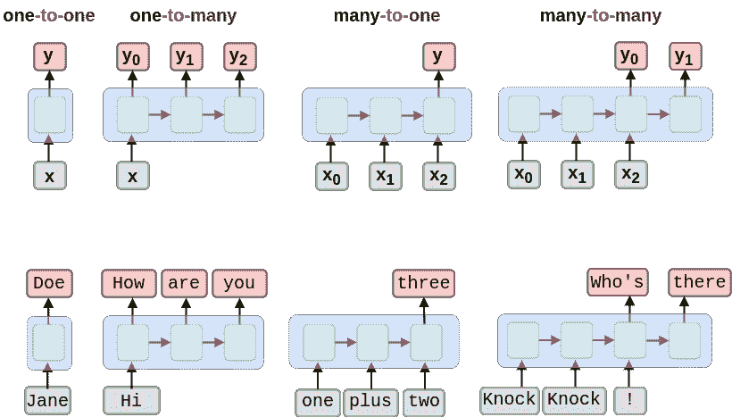
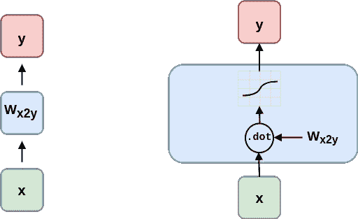
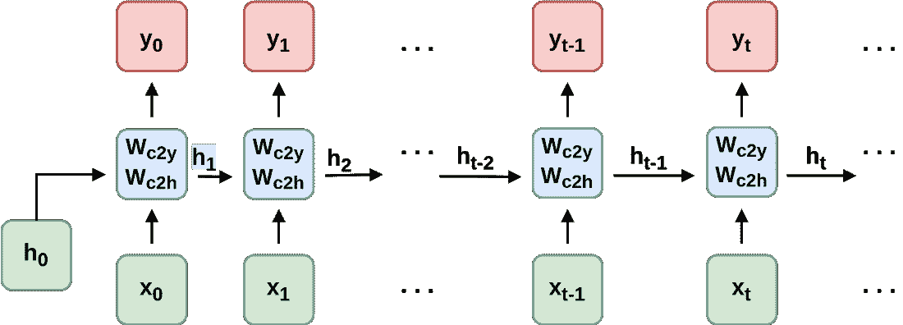
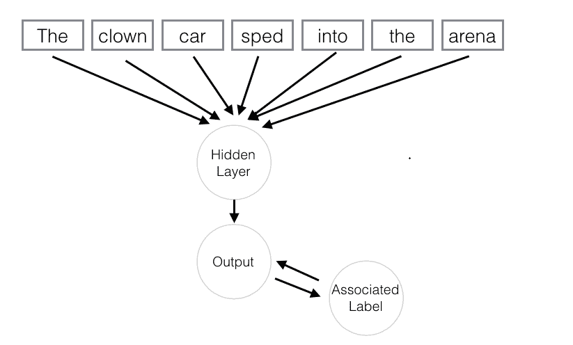
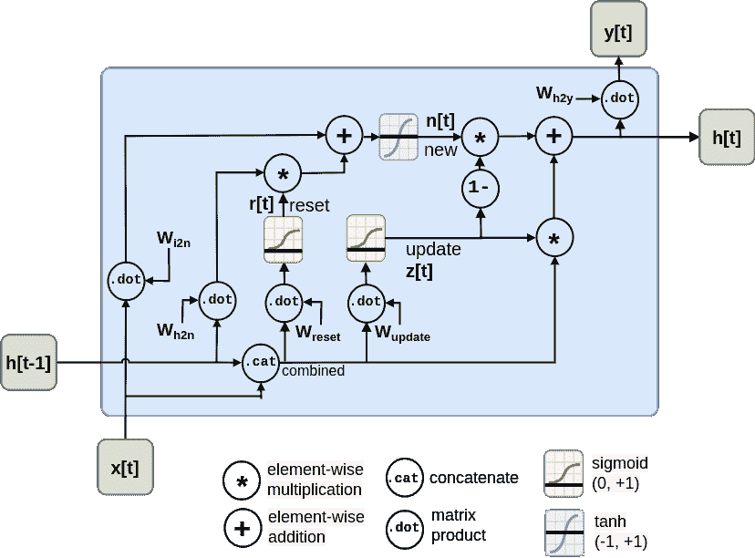
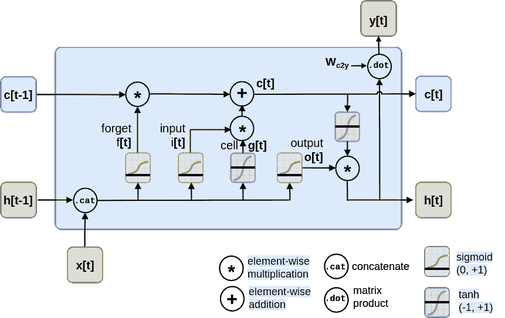

# 第十章：减少、重用和回收单词（RNN 和 LSTMs）

### 本章涵盖的内容

+   卷积递归展开，以便您可以了解如何将其用于 NLP。

+   在 PyTorch 中实现基于单词和字符的 RNN。

+   识别 RNN 是您最好的选择的应用程序。

+   重新设计您的数据集以进行 RNN 训练。

+   定制和调整您的 RNN 结构以解决 NLP 问题。

+   理解时间反向传播（backprop）。

+   将长期和短期记忆机制相结合，使您的 RNN 变得更加智能。

一个 *RNN*（递归神经网络）会重复使用词汇。为什么要重复和重用您的单词？当然是为了构建更可持续的 NLP 管道！;) *递归* 只是另一个词汇，用于循环利用。RNN 使用递归来记住它已经阅读过的标记，并重复利用这种理解来预测目标变量。如果您使用 RNN 来预测下一个单词，RNN 可以生成一直生成，直到你告诉它停止。 RNN 的这种可持续性或再生能力是它们的超级能力。

原来，您的 NLP 管道可以更好地预测句子中的下一个标记，如果它记得它已经阅读并理解了什么。但是，等一下，之前的 CNN 是用一组权重来“记住”附近的标记的吗？是的！但是 CNN 只能 *记住* 有限的窗口，即几个单词长。通过在转到下一个标记之前循环利用机器对每个标记的理解，RNN 可以记住关于它阅读过的 *所有* 标记的内容。这使得您的机器阅读器更具可持续性，它可以不停地读下去……您喜欢多久它就能读多久。

但是等一下，递归不危险吗？如果您在读到递归时第一个想到的是危险，那么您并不孤单。任何学过算法的人都可能使用不正确的递归方式，破坏了函数、整个程序，甚至拖垮了整个网络服务器。正确和安全地使用递归的关键是您必须始终确保您的算法在每次输入回收时*减少*它必须进行的工作量。这意味着您需要在再次使用该输入之前从输入中删除一些内容。对于您的 NLP RNN，这是自然而然的，因为您会在将输入馈送回网络之前，*弹出*（删除）堆栈（文本字符串）上的一个标记。

##### 注

从技术上讲，“循环”和“递归”是两个不同的概念。^[[1]](#_footnotedef_1) 但是大多数数学家和计算机科学家使用这两个词来解释相同的概念 - 将部分输出循环回输入，以便重复执行序列中的操作。^[[2]](#_footnotedef_2) 但是像所有自然语言词汇一样，这些概念是模糊的，当构建 *循环* 神经网络时理解它们可能会有所帮助。正如你将在本章的代码中看到的那样，RNN 并没有像你通常认为的那样具有调用自身的递归函数。`.forward(x)` 方法是在 RNN 本身之外的 `for` 循环中调用的。

RNN 是 *类神经形* 的。这是一种花哨的说法，意思是研究人员在设计诸如 RNN 这样的人工神经网络时模仿了他们认为大脑如何工作的方式。你可以利用你对自己大脑运作方式的了解来想出如何使用人工神经元处理文本的方法。你的大脑正在循环处理你正在阅读的标记。所以循环必定是一种聪明、高效的利用大脑资源来理解文本的方式。

当你阅读这段文字时，你会利用你已经了解的先前单词的知识来更新你对接下来会发生什么的预测。并且在你达到句子、段落或者你试图理解的任何东西的结尾之前，你不会停止预测。然后你可以在文本的结尾停顿一下，处理你刚刚阅读过的所有内容。就像本章中的 RNN 一样，你大脑中的 RNN 利用这个结尾的停顿来对文本进行编码、分类和 *得到一些* 信息。由于 RNN 总是在预测，你可以用它们来预测你的 NLP 流水线应该说的单词。所以 RNN 不仅适用于阅读文本数据，还适用于标记和撰写文本。

RNN 对 NLP 是一个颠覆性的改变。它们引发了深度学习和人工智能的实际应用和进步的爆炸性增长。

## 8.1 RNN 适用于什么？

你已经学过的先前的深度学习架构对处理短小的文本片段非常有效 - 通常是单个句子。 RNN 承诺打破文本长度的限制，并允许你的自然语言处理流水线摄入无限长的文本序列。它们不仅可以处理无穷尽的文本，还可以 *生成* 你喜欢的文本。RNN 打开了一系列全新的应用，如生成式对话聊天机器人和将来自文档的许多不同地方的概念结合起来的文本摘要器。

| **类型** | **描述** | **应用** |
| --- | --- | --- |
| 一对多 | 一个输入张量用于生成一系列输出张量 | 生成聊天消息、回答问题、描述图像 |
| 多对一 | 被收集成单个输出张量的输入张量序列 | 根据语言、意图或其他特征对文本进行分类或标记 |
| 多对多 | 一系列输入张量用于生成一系列输出张量 | 在一系列标记中翻译、标记或匿名化标记，回答问题，参与对话 |

这就是 RNNs 的超能力，它们处理标记或向量的序列。你不再受限于处理单个、固定长度的向量。因此，你不必截断和填充输入文本，使你的圆形文本形状适合于方形洞。如果愿意，RNN 可以生成永无止境的文本序列。你不必在预先决定的任意最大长度处停止或截断输出。你的代码可以在足够的时候动态决定什么是足够的。

##### 图 8.1 回收标记创建了无尽的选项



你可以使用 RNNs 在许多你已经熟悉的任务上取得最先进的性能，即使你的文本比无穷小 `;)` 还要短。

+   翻译

+   摘要

+   分类

+   问答

RNNs 是实现一些新的 NLP 任务最有效和准确的方法之一，你将在本章中了解到：

+   生成新的文本，如释义、摘要甚至是问题的答案

+   对单个标记进行标记

+   绘制句子的语法框图，就像你在英语课上做的那样

+   创建预测下一个标记的语言模型

如果你阅读过论文榜上的 RNNs，你会发现 RNNs 是许多应用中最有效的方法。

RNNs 不仅仅是给研究人员和学者使用的。让我们来认真对待。在现实世界中，人们正在使用 RNNs 来：

+   拼写检查和更正

+   自然语言或编程语言表达的自动补全

+   对句子进行语法检查或 FAQ 聊天机器人进行分类

+   对问题进行分类或生成这些问题的答案

+   为聊天机器人生成有趣的对话文本

+   命名实体识别（NER）和提取

+   对人、婴儿和企业进行分类、预测或生成名称

+   分类或预测子域名（用于安全漏洞扫描）

你可能可以猜到这些应用的大部分内容，但你可能对最后一个应用（子域名预测）感到好奇。子域名是 URL 中域名的第一部分，比如 `www.lesswrong.com` 中的 `www` 或 `en.wikipedia.org` 中的 `en`。为什么有人要预测或猜测子域名？Dan Meisler 在他的网络安全工具箱中讨论了子域名猜测器发挥的关键作用。一旦你知道一个子域名，黑客或渗透测试人员就可以扫描域名，找出服务器安全的漏洞。

一旦你很快就能熟练地使用 RNNs 生成全新的单词、短语、句子、段落，甚至整页的文字。使用 RNNs 玩耍可以非常有趣，你可能会不经意间创造出开启全新业务机会的应用程序。

+   建议公司、产品或领域名称 ^([5])

+   建议婴儿姓名

+   句子标注和标记

+   文本字段的自动完成

+   对句子进行释义和改写

+   发明俚语词汇和短语

### 8.1.1 RNNs 可以处理任何序列

除了 NLP 之外，RNNs 对于任何数值数据序列都是有用的，比如时间序列。你只需要将序列中的对象表示为数值向量。对于自然语言词汇，这通常是词嵌入。但你也可以看到一个城市政府如何将每日或每小时的电动滑板车租赁、高速公路交通或天气条件表示为向量。而且通常他们希望一次性在一个向量中预测所有这些。

因为 RNNs 可以为序列中的每个元素输出结果，所以你可以创建一个 RNN，用于预测“明天”——当前已知元素之后的下一个序列元素。然后，你可以使用该预测来预测下一个预测，递归地进行。这意味着一旦你掌握了时序反向传播，你就能够使用 RNNs 来预测诸如：

+   明天的天气

+   下一分钟的网站流量量

+   下一秒的分布式拒绝服务（DDOS）网络请求

+   汽车驾驶员在接下来的 100 毫秒内将采取的动作

+   视频剪辑序列中的下一帧图像

一旦你对目标变量有了预测，你就可以衡量错误——模型输出与期望输出之间的差异。这通常发生在你正在处理的事件序列中的最后一个时间步骤。

### 8.1.2 RNNs 会记住你告诉它们的一切

你是否曾经不小心触摸到潮湿的油漆，并发现自己在触碰到东西时“重复使用”那种油漆？小时候，你可能会想象自己是一位印象派画家，通过用手指在周围的墙壁上涂油彩的方式与世界分享你的艺术。你将要学会如何建造一个更加专注的印象派文字画家。在第七章中，你想象了一个字母模板作为用 CNNs 处理文本的类比。现在，与其在句子中滑动一个单词模板，不如在它们还潮湿的时候用油漆辊滚动它们...​！

想象一下，用干得慢的颜料给句子的字母涂上厚厚的一层。让我们在文本中创造出多样化的彩虹颜色。也许你甚至正在支持北公园的 LBGTQ 自豪周，给人行道和自行车道涂上斑马线。

##### 图 8.2 意义的彩虹


现在，拿起一个干净的油漆滚筒，将其从句子的开头滚到结尾的字母上。你的滚筒会从一个字母上取下油漆，并将其重新放在先前字母的顶部。根据你的滚筒大小，少量的字母（或字母部分）会被滚到右边的字母上。第一个字母后的所有字母都会被涂抹在一起，形成一个模糊的条纹，只能模糊地反映出原始句子。

##### 图 8.3 彩虹尽头的一锅金币


涂抹将先前字母的所有油漆汇集成原始文本的一个紧凑表示。但这是一个有用的、有意义的表示吗？对于人类读者来说，你所做的只是创建了一个多彩的混乱。它对于阅读它的人类来说并不传达多少意义。这就是为什么人类不会为自己使用这种*文本含义*的表示方式。然而，如果你考虑一下字符的涂抹，也许你能想象出机器是如何解释它的。对于机器来说，它肯定比原始字符序列要密集和紧凑得多。

在自然语言处理中，我们希望创建文本的紧凑、密集的向量表示。幸运的是，我们正在寻找的那种表示隐藏在你的油漆滚筒上！当你的干净的新滚筒被文本的字母涂抹时，它收集了你滚过的所有字母的*记忆*。这类似于你在第六章创建的词嵌入。但这种嵌入方法可以用于更长的文本片段。如果你愿意，你可以不停地滚动滚筒，不断地将更多的文本压缩成紧凑的表示。

在以前的章节中，你的标记主要是单词或单词 n-gram。你需要扩展你对标记的理解，将个别字符包括在内。最简单的 RNN 使用字符而不是单词作为标记。这被称为基于字符的 RNN。就像你在之前的章节中有单词和标记嵌入一样，你也可以认为字符也有意义。现在，你能理解这个在"Wet Paint!"字母末尾的涂抹如何表示文本所有字母的嵌入吗？

最后一个想象中的步骤可能会帮助你揭示这个思想实验中的隐藏含义。在你的脑海中，检查一下你的油漆滚筒上的嵌入。在你的脑海中，将其在一张干净的纸上滚开。记住，纸和你的滚筒只大到能容纳一个单独的字母。这将 *输出* 滚筒对文本的记忆的紧凑表示。而这个输出隐藏在你的滚筒里，直到你决定用它做点什么。这就是 RNN 中文本嵌入的工作方式。嵌入被隐藏在你的 RNN 中，直到你决定输出它们或与其他东西结合以重用它们。事实上，在许多 RNN 实现中，文本的这种向量表示存储在名为 `hidden` 的变量中。

##### 重要

RNN 嵌入与你在第六章和第七章学到的单词和文档嵌入不同。RNN 在时间或文本位置上聚集意义。RNN 将意义编码到这个向量中，以便你可以在文本中重复使用后续的标记。这就像 Python 的 `str.encode()` 函数，用于创建 Unicode 文本字符的多字节表示。标记序列处理的顺序对最终结果，即编码向量，至关重要。所以你可能想把 RNN 嵌入称为 "编码"、"编码向量" 或 "编码张量"。这种词汇转变是在 Garrett Lander 的一个项目中受到鼓励的，该项目是对非常长且复杂的文档进行自然语言处理，例如患者病历或《穆勒报告》。[6] 这种新的词汇使他的团队更容易发展起自然语言处理管道的共享心理模型。

在本章后面要密切关注隐藏层。激活值存储在变量 `h` 或 `hidden` 中。这个张量内的这些激活值是文本中到目前为止的嵌入。每次处理一个新标记时，它都会被新值覆盖，因为你的自然语言处理管道正在汇总它到目前为止已读取的标记的含义。在图 8.4 中，你可以看到这种在嵌入向量中汇集含义的混合要比原始文本更加紧凑和模糊。

##### 图 8.4 汇集含义到一个点中


你可以从油漆印迹中读出一些原始文本的含义，就像罗夏克墨点测试一样。罗夏克墨点是指用在纸牌上的墨水或油漆印迹，用于激发人们的记忆并测试他们的思维或心理健康^([7])。你油漆辊上的油漆印迹是原始文本的模糊、印象派式的呈现。这是你要达成的目标，而不仅是制造一团糟。你可以清洁你的辊子，冲洗并重复这个过程，得到不同的油漆印迹，这些印迹代表了你的神经网络的不同*含义*。很快你就会看到，这些步骤与 RNN 神经元层中的实际数学操作是相似的。

你的油漆辊沾污了句子末尾的许多字母，以至于末尾的感叹号几乎完全无法辨认。但正是这不可理解的部分，使你的机器能够在油漆辊的有限表面积内理解整个句子。你已经把句子的所有字母都涂到油漆辊的表面上了。如果你想看到油漆辊嵌入的信息，只需把它滚到一张干净的纸上即可。

在你的 RNN 中，你可以在将 RNN 滚动文本标记后输出隐藏层激活。对于人类来讲，编码信息可能不会有很多意义，但它给了你的油漆辊，即机器，整个句子的暗示。你的油漆辊收集了整个句子的印象。我们甚至使用“收集”这个词来表达对某人说的话的理解，就像“我从你刚刚说的话中收集到，将湿漆辊辊在湿漆上与 RNN 是相似的。”

你的油漆辊已将整个字母句子压缩或编码成一个短小的、模糊印象派风格的油漆条纹。在 RNN 中，这个印迹是一个由数字组成的向量或张量。编码向量中的每个位置或维度就像你的油漆印迹中的一个颜色。每个编码维度都保留着一个意义方面，你的 RNN 被设计成跟踪这些方面的含义。油漆在辊子上留下的印象（隐藏层激活）被持续回收，直到文本的末尾。接着，将所有这些印迹再次应用在油漆辊的新位置上，创建一个整个句子的新印象。

### 8.1.3 RNNs 隐藏他们的理解

对于 RNN 来说，一个关键的改变是通过逐个读取令牌来重复使用每个令牌的含义而维护一个隐藏嵌入。这个包含了 RNN 所理解的一切的权重隐藏向量包含在它所读取的文本点中。这意味着你不能一次性运行整个你正在处理的文本的网络。在先前的章节中，你的模型学习了将一个输入映射到一个输出的函数。但是，接下来你将看到，RNN 会学习一个程序，在你的文本上不断运行，直到完成。RNN 需要逐个读取你的文本的令牌。

一个普通的前馈神经元只是将输入向量乘以一堆权重来创建输出。无论你的文本有多长，CNN 或者前馈神经网络都必须执行相同数量的乘法来计算输出预测。线性神经网络的神经元一起工作，组合出一个新的向量来表示你的文本。 在图 8.5 中可以看到，一个普通的前馈神经网络接受一个向量输入(`x`)，将其乘以一组权重矩阵(`W`)，应用激活函数，然后输出一个转换过的向量(`y`)。前馈网络层只能将一个向量转换为另一个向量。

##### 图 8.5 普通的前馈神经元



在使用 RNNs 时，你的神经元不会看到整个文本的向量。相反，RNN 必须逐个令牌处理你的文本。为了跟踪已经读取的令牌，它记录一个隐藏向量(`h`)，可以传递给未来自己——产生隐藏向量的完全相同的神经元。在计算机科学术语中，这个隐藏向量被称为 *状态*。这就是为什么 Andrej Karpathy 和其他深度学习研究人员对 RNNs 的效果如此兴奋的原因。RNNs 使得机器终于能够学习 Turing 完备程序而不只是孤立的函数.^[8]

##### 图 8.6 循环神经元


如果你展开你的 RNN，它开始看起来像一个链……实际上是一个马尔可夫链。但这一次，你的窗口只有一个标记的宽度，并且您重用了先前标记的输出，结合当前标记，然后向前滚动到文本的下一个标记。庆幸的是，当你在第七章中滑动 CNN 窗口或卷积核时，已经开始做类似的事情。

你如何在 Python 中实现神经网络的递归？幸运的是，你不必像在编程面试中遇到的那样尝试使用递归函数调用。相反，你只需创建一个变量来存储与输入和输出分开的隐藏状态，并且你需要有一个单独的权重矩阵用于计算隐藏张量。列表 8.1 实现了一个最小的 RNN，从头开始，而不使用 PyTorch 的 `RNNBase` 类。

##### 列表 8.1 PyTorch 中的递归

```py
>>> from torch import nn

>>> class RNN(nn.Module):
...
...     def __init__(self,
...             vocab_size, hidden_size, output_size):  # #1
...         super().__init__()
...         self.W_c2h = nn.Linear(
...             vocab_size + hidden_size, hidden_size)  # #2
...         self.W_c2y = nn.Linear(vocab_size + hidden_size, output_size)
...         self.softmax = nn.LogSoftmax(dim=1)
...
...     def forward(self, x, hidden):  # #3
...         combined = torch.cat((x, hidden), axis=1)  # #4
...         hidden = self.W_c2h(combined)  # #5
...         y = self.W_c2y(combined)  # #6
...         y = self.softmax(y)
...         return y, hidden  # #7
```

你可以看到这个新的 RNN 神经元现在输出不止一件事。你不仅需要返回输出或预测，而且需要输出隐藏状态张量以供“未来自己”神经元重用。

当然，PyTorch 实现有许多其他特性。PyTorch 中的 RNNs 甚至可以同时从左到右和从右到左训练！这被称为双向语言模型。当然，你的问题需要是“非因果”的，才能使用双向语言模型。在英语 NLP 中，非因果模型意味着你希望语言模型预测你已经知道的其他单词之前（左边）出现的单词。一个常见的非因果应用是预测在 OCR（光学字符识别）期间有意或无意地被屏蔽或损坏的内部单词。如果你对双向 RNNs 感兴趣，所有的 PyTorch RNN 模型（RNNs、GRUs、LSTMs，甚至 Transformers）都包括一个选项来启用双向递归。对于问答模型和其他困难的问题，与默认的向前方向（因果）语言模型相比，双向模型的准确率通常会提高 5-10%。这仅仅是因为双向语言模型的嵌入更加平衡，忘记了文本开头和结尾的内容一样多。

### 8.1.4 RNNs 记得你告诉它们的一切

要了解 RNNs 如何保留文档中所有标记的记忆，你可以展开图 8.7 中的神经元图。你可以创建神经元的副本，来展示“未来自己”在循环中遍历你的标记。这就像展开一个 for 循环，当你只需复制并粘贴循环内的代码行适当次数时。

##### 图 8.7 展开 RNN 以揭示它的隐藏秘密



图 8.7 显示了一个 RNN 将隐藏状态传递给下一个“未来自己”神经元，有点像奥运接力选手传递接力棒。但是这个接力棒在被 RNN 反复回收利用时印上了越来越多的记忆。你可以看到在 RNN 最终看到文本的最后一个标记之前，输入标记的张量被修改了许多许多次。

RNNs 的另一个好处是你可以在任何位置取出输出张量。这意味着你可以解决像机器翻译、命名实体识别、文本匿名化和去匿名化、甚至政府文件开放化等挑战。^([10])

这两个特点是 RNNs 独有的特点。

1.  你可以在一个文档中处理任意数量的 token。

1.  在每个 token 处理完之后，你可以输出任何你需要的内容。

第一个特点其实并不是什么大不了的事情。正如你在 CNN 中看到的那样，如果你想处理长文本，只需要在输入张量的最大尺寸里面留出空间就可以了。事实上，到目前为止最先进的 NLP 模型——*transformers*，也是创建了最大长度限制并像 CNN 一样填充文本的。

然而，RNNs 的第二大特点真的很重要。想象一下，你可以用一个标记每个句子中每一个词汇的模型做出哪些事情。语言学家花费很多时间对话语进行图解并标记 token。RNNs 和深度学习已经改变了语言学研究的方式。只要看一下 SpaCy 可以在清单 8.2 中识别一些“hello world”文本中每个单词的语言学特征，就可以想象一下。

##### 清单 8.2 SpaCy 用 RNNs 标记 token

```py
>>> import pandas as pd
>>> from nlpia2.spacy_language_model import nlp
>>>
>>> tagged_tokens = list(nlp('Hello world. Goodbye now!'))
>>> interesting_tags = 'text dep_ head lang_ lemma_ pos_ sentiment'
>>> interesting_tags = (interesting_tags +  'shape_ tag_').split()
>>> pd.DataFrame([
...         [getattr(t, a) for a in interesting_tags]
...         for t in tagged_tokens],
...     columns=interesting_tags)
      text    dep_     head lang_   lemma_   pos_  sentiment shape_ tag_
0    Hello    intj    world    en    hello   INTJ        0.0  Xxxxx   UH
1    world    ROOT    world    en    world   NOUN        0.0   xxxx   NN
2        .   punct    world    en        .  PUNCT        0.0      .    .
3  Goodbye    ROOT  Goodbye    en  goodbye   INTJ        0.0  Xxxxx   UH
4      now  advmod  Goodbye    en      now    ADV        0.0    xxx   RB
5        !   punct  Goodbye    en        !  PUNCT        0.0      !    .
```

拥有所有信息、在你需要的时候输出所有结果都是很好的。你可能很兴奋地想要在真正长的文本上尝试 RNNs，看看它到底能记住多少。

## 8.2 只使用姓氏预测一个人的国籍

为了快速让你掌握再循环利用，你将从最简单的 token（字母或标点符号）开始。你要建立一个模型，只使用名字中的字母来指导预测，可以预测出一个人的国籍，也叫“姓氏”。这种模型可能对你来说并不那么有用。你可能甚至担心它可能会被用于伤害某些特定文化的人。

就像你一样，作者的 LinkedIn 关注者们也对当我们提到正在训练一个模型来预测姓名的人口学特征时，感到怀疑。不幸的是，企业和政府确实使用这样的模型来识别和定位特定群体的人，这往往会产生有害的后果。但这些模型也可以用于好处。我们使用它们来帮助我们的非营利组织和政府客户将他们的对话 AI 数据集匿名化。然后志愿者和开源贡献者可以从这些经过匿名处理的对话数据库中训练 NLP 模型，根据用户的需求，同时保护用户的隐私，识别出有用的医疗保健或教育内容。

这个多语言数据集将让你有机会学习如何处理非英语单词常见的变音符号和其他装饰。为了保持趣味性，你将删除这些字符装饰和其他泄漏的 Unicode 字符。这样你的模型就可以学习你真正关心的模式，而不是基于这种泄漏而“作弊”。处理这个数据集的第一步是将其*ASCII 化* - 将其转换为纯 ASCII 字符。例如，爱尔兰名字“O’Néàl”的 Unicode 表示中，“e”上有一个“重音符号”，在这个名字的“a”上有一个“重音符号”。而“O”和“N”之间的撇号可能是一个特殊的方向撇号，如果你不将其*ASCII 化*，它可能会不公平地提示你的模型该名字的国籍。你还需要删除经常添加到土耳其语、库尔德语、罗曼语和其他字母表的字母“C”上的西迪拉装饰。

```py
>>> from nlpia2.string_normalizers import Asciifier
>>> asciify = Asciifier()

>>> asciify("O’Néàl")
"O'Neal"
>>> asciify("Çetin")
'Cetin'
```

现在你有了一个可以为广泛语言规范化字母表的流水线，你的模型会更好地泛化。你的模型几乎可以用于任何拉丁字母文字，甚至是从其他字母表转写为拉丁字母文字的文字。你可以使用完全相同的模型来对几乎任何语言的任何字符串进行分类。你只需要在你感兴趣的每种语言中标记几十个例子来“解决”。

现在让我们看看你是否已经创建了一个*可解决的问题*。一个可解决的机器学习问题是指：

1.  你可以想象一个人类回答这些同样的问题

1.  对于你想问你的模型的绝大多数“问题”，存在一个正确的答案

1.  你不指望机器的准确度会比训练有素的人类专家高得多

想一想这个预测与姓氏相关的国家或方言的问题。记住，我们已经删除了很多关于语言的线索，比如独特于非英语语言的字符和装饰。这是一个可解决的问题吗？

从上面的第一个问题开始。你能想象一个人类仅从他们的姓氏的 ASCII 化就能确定一个人的国籍吗？就我个人而言，当我试图根据他们的姓氏猜测我的学生来自哪里时，我经常猜错。在现实生活中，我永远不会达到 100%的准确率，机器也不会。所以只要你能接受一个不完美的模型，这就是一个可解决的问题。如果你建立一个良好的管道，有大量标记的数据，你应该能够创建一个至少与你我一样准确的 RNN 模型。当你考虑到这一点时，它甚至可能比训练有素的语言学家更准确，这是相当令人惊讶的。这就是 AI 概念的来源，如果一台机器或算法能够做出智能的事情，我们就称之为 AI。

想想这个问题之所以难的原因。姓氏和国家之间没有一对一的映射。尽管姓氏通常在几代人之间被父母和子女共享，但人们倾向于四处迁移。而且人们可以改变自己的国籍、文化和宗教信仰。所有这些因素都会影响某个特定国家常见的姓名。有时个人或整个家庭决定改姓，尤其是移民、外国人和间谍。人们有很多不同的原因想要融入[¹¹]。文化和语言的融合是使人类在共同努力实现伟大事业方面如此出色的原因，包括人工智能。RNNs 会给你的国籍预测模型带来同样的灵活性。如果你想改名，这个模型可以帮助你设计，使其唤起你想要人（和机器）感知到的国籍。

浏览一些来自这个数据集的随机姓名，看看是否可以找到在多个国家中重复使用的字符模式。

##### 清单 8.3 加载

```py
>>> repo = 'tangibleai/nlpia2'  # #1
>>> filepath = 'src/nlpia2/data/surname-nationality.csv.gz'
>>> url = f"https://gitlab.com/{repo}/-/raw/main/{filepath}"
>>> df = pd.read_csv(url)  # #2
>>> df[['surname', 'nationality']].sort_values('surname').head(9)
        surname nationality
16760   Aalbers       Dutch
16829   Aalders       Dutch
35706  Aalsburg       Dutch
35707     Aalst       Dutch
11070     Aalto     Finnish
11052  Aaltonen     Finnish
10853     Aarab    Moroccan
35708     Aarle       Dutch
11410    Aarnio     Finnish
```

在深入研究之前先快速查看一下数据。看起来荷兰人喜欢把他们的姓氏（姓氏）放在点名表的开头。一些荷兰姓氏以“Aa”开头。在美国，有很多企业名称以“AAA”开头，原因类似。而且似乎摩洛哥、荷兰和芬兰的语言和文化倾向于鼓励在词语开头使用三字母组“Aar”。所以你可以预料到这些国籍之间会有一些混淆。不要期望分类器达到 90%的准确率。

你还想要统计一下数据集中唯一类别的数量，这样你就知道你的模型将有多少选择。

##### 清单 8.4 数据集中的唯一国籍

```py
>>> df['nationality'].nunique()
37
>>> sorted(df['nationality'].unique())
['Algerian', 'Arabic', 'Brazilian', 'Chilean', 'Chinese', 'Czech', 'Dutch',
 'English', 'Ethiopian', 'Finnish', 'French', 'German', 'Greek',
 'Honduran', 'Indian', 'Irish', 'Italian', 'Japanese', 'Korean',
 'Malaysian', 'Mexican', 'Moroccan', 'Nepalese', 'Nicaraguan', 'Nigerian',
 'Palestinian', 'Papua New Guinean', 'Peruvian', 'Polish', 'Portuguese',
 'Russian', 'Scottish', 'South African', 'Spanish', 'Ukrainian',
 'Venezuelan', 'Vietnamese']
```

在清单 8.4 中，你可以看到从多个来源收集到的三十七个独特的国籍和语言类别。这就是这个问题的难点所在。这就像是一个多项选择题，有 36 个错误答案，只有一个正确答案。而且这些地区或语言类别经常重叠。例如，阿尔及利亚人被认为是阿拉伯语的一种，巴西人是葡萄牙语的一种方言。有几个姓名跨越了这些国籍边界。所以模型不能为所有姓名都得到正确答案。它只能尽可能地返回正确答案。

各种国籍和数据源的多样性帮助我们进行名称替换，以匿名化我们多语言聊天机器人中交换的消息。这样可以在开源项目中共享会话设计数据集，例如本书第十二章讨论的聊天机器人。递归神经网络模型非常适用于匿名化任务，例如命名实体识别和虚构名称的生成。它们甚至可以用来生成虚构但逼真的社会安全号码、电话号码和其他个人身份信息（PII）。为了构建这个数据集，我们使用了从公共 API 中抓取的包含非洲、南美和中美洲以及大洋洲少数族裔国家数据的 PyTorch RNN 教程数据集。

在我们每周在 Manning 的 Twitch 频道上进行集体编程时，Rochdi Khalid 指出他的姓氏是阿拉伯语。他住在摩洛哥的卡萨布兰卡，在那里阿拉伯语是官方语言，与法语和柏柏尔语并存。这个数据集是从各种来源汇编而成的。[12]) 其中一些基于广泛的语言标签（如"Arabic"）创建标签，而其他一些则以特定的国籍或方言为标签，如摩洛哥、阿尔及利亚、巴勒斯坦或马来西亚。

数据集偏见是最难弥补的偏见之一，除非你能找到要提升的群体的数据。除了公共 API，你还可以从内部数据中挖掘名称。我们的匿名化脚本从多语言聊天机器人对话中剥离出名称。我们将这些名称添加到了这个数据集中，以确保它是与我们的聊天机器人互动的用户种类的代表性样本。你可以在需要从各种文化中获得真正全球化的名称片段的自己的项目中使用这个数据集。

多样性也带来了挑战。你可以想象到，这些音译名称的拼写可能跨越国界甚至跨越语言。翻译和音译是两个不同的自然语言处理问题，你可以使用递归神经网络来解决。词语 "नमस्कार" 可以*翻译*成英语单词 "hello"。但在你的递归神经网络尝试翻译尼泊尔语单词之前，它将会*音译*尼泊尔语单词 "नमस्कार" 成为使用拉丁字符集的单词 "namaskāra"。大多数多语言深度学习流程都使用拉丁字符集（罗马脚本字母）来表示所有语言中的单词。

##### 注意

音译是将一个语言的字母和拼写翻译成另一种语言的字母，从而可以使用在欧洲和美洲使用的拉丁字符集（罗马脚本字母）表示单词。一个简单的例子是将法语字符 "é" 的重音去除或添加，例如 "resumé"（简历）和 "école"（学校）。对于非拉丁字母表，如尼泊尔语，音译要困难得多。

以下是如何计算每个类别（国籍）内重叠程度的方法。

```py
>>> fraction_unique = {}
>>> for i, g in df.groupby('nationality'):
>>>     fraction_unique[i] = g['surname'].nunique() / len(g)
>>> pd.Series(fraction_unique).sort_values().head(7)
Portuguese           0.860092
Dutch                0.966115
Brazilian            0.988012
Ethiopian            0.993958
Mexican              0.995000
Nepalese             0.995108
Chilean              0.998000
```

除了跨国家的重叠之外，PyTorch 教程数据集中还包含了许多重复的名称。超过 94% 的阿拉伯语名称是重复的，其中一些在第 8.5 节中显示出来。其他国籍和语言，如英语、韩语和苏格兰语，似乎已经去重了。在你的训练集中重复条目使你的模型更紧密地适应于常见名称而不是不太频繁出现的名称。在数据集中复制条目是一种“平衡”数据集或强制统计短语频率的方法，以帮助准确预测流行名称和人口稠密国家。这种技术有时被称为“过度抽样少数类”，因为它增加了数据集中未被充分代表的类别的频率和准确性。

如果你对原始的姓氏数据感兴趣，请查看 PyTorch 的“RNN 分类教程”。^([13]) 在 Arabic.txt 中的 2000 个阿拉伯示例中，只有 108 个独特的阿拉伯姓氏。^([14])

##### 第 8.5 节 姓氏过度抽样

```py
>>> arabic = [x.strip() for x in open('.nlpia2-data/names/Arabic.txt')]
>>> arabic = pd.Series(sorted(arabic))
0       Abadi
1       Abadi
2       Abadi
        ...
1995    Zogby
1996    Zogby
1997    Zogby
Length: 2000, dtype: object
```

这意味着即使是一个相对简单的模型（比如 PyTorch 教程中展示的模型），也应该能够正确地将像 Abadi 和 Zogby 这样的流行名称标记为阿拉伯语。通过计算数据集中与每个名称关联的国籍数量，你可以预期模型的混淆矩阵统计数据。

你将使用在第 8.5 节中加载的去重数据集。我们已经计算了重复项，为你提供了这些重复项的统计信息，而不会让你下载一个庞大的数据集。你将使用平衡抽样的国家数据，以鼓励你的模型平等对待所有类别和名称。这意味着你的模型将像准确预测流行国家的流行名称一样准确地预测罕见名称和罕见国家。这个平衡的数据集将鼓励你的 RNN 从它在名称中看到的语言特征中归纳出一般规律。你的模型更有可能识别出许多不同名称中常见的字母模式，尤其是那些帮助 RNN 区分国家的模式。我们在 `nlpia2` 仓库的 GitLab 上包含了关于如何获取准确的名称使用频率统计信息的信息。^([15]) 如果你打算在更随机的名称样本上在真实世界中使用这个模型，你需要记住这一点。

##### 第 8.6 节 名称国籍重叠

```py
>>> df.groupby('surname')
>>> overlap = {}
... for i, g in df.groupby('surname'):
...     n = g['nationality'].nunique()
...     if n > 1:
...         overlap[i] = {'nunique': n,
 'unique': list(g['nationality'].unique())}
>>> overlap.sort_values('nunique', ascending=False)
         nunique                                             unique
Michel         6  [Spanish, French, German, English, Polish, Dutch]
Abel           5        [Spanish, French, German, English, Russian]
Simon          5            [Irish, French, German, English, Dutch]
Martin         5       [French, German, English, Scottish, Russian]
Adam           5          [Irish, French, German, English, Russian]
...          ...                                                ...
Best           2                                  [German, English]
Katz           2                                  [German, Russian]
Karl           2                                    [German, Dutch]
Kappel         2                                    [German, Dutch]
Zambrano       2                                 [Spanish, Italian]
```

为了帮助使这个数据集多样化，并使其更具代表性，我们添加了一些来自印度和非洲的姓名。并且通过计算重复项来压缩数据集。由此产生的姓氏数据集将 PyTorch RNN 教程的数据与多语言聊天机器人的匿名化数据结合起来。事实上，我们使用这个姓名分类和生成模型来匿名化我们聊天机器人日志中的姓名。这使我们能够在 NLP 数据集和软件方面“默认开放”。

##### 重要提示

要找出机器学习流水线是否有可能解决您的问题，假装自己是机器。对训练集中的一些示例进行训练。然后尝试回答一些测试集中的“问题”，而不查看正确的标签。你的 NLP 流水线应该能够几乎和你一样好地解决你的问题。在某些情况下，你可能会发现机器比你更好，因为它们可以更准确地在脑海中平衡许多模式。

通过计算数据集中每个名称的最流行国籍，可以创建一个混淆矩阵，使用最常见的国籍作为特定名称的“真实”标签。这可以揭示数据集中的几个怪癖，应该影响模型学习的内容以及其执行此任务的效果如何。对于阿拉伯名字，根本没有混淆，因为阿拉伯名字非常少，而且没有一个被包含在其他国籍中。西班牙、葡萄牙、意大利和英国名字之间存在显著的重叠。有趣的是，在数据集中有 100 个苏格兰名字，其中没有一个最常被标记为苏格兰名字。苏格兰名字更常被标记为英国和爱尔兰名字。这是因为原始的 PyTorch 教程数据集中有成千上万个英国和爱尔兰名字，但只有 100 个苏格兰名字。

##### 图 8.8 在训练之前数据集就产生了混淆


我们在原始 PyTorch 数据集中添加了 26 个国籍。这在类标签中创建了更多的歧义或重叠。许多名称在世界多个不同地区都很常见。RNN 可以很好地处理这种歧义，使用字符序列中模式的统计数据来指导其分类决策。

### 8.2.1 从头开始构建 RNN

这是您的`RNN`类的核心代码，见列表 8.7。像所有 Python 类一样，PyTorch Module 类有一个`*init*()`方法，您可以在其中设置一些配置值，以控制类的其余部分的工作方式。对于 RNN，您可以使用`*init*()`方法设置控制隐藏向量中的神经元数量以及输入和输出向量大小的超参数。

对于依赖于分词器的自然语言处理应用程序，将分词器参数包含在 init 方法中是个好主意，这样可以更容易地从保存到磁盘的数据中再次实例化。否则，你会发现你在磁盘上保存了几个不同的模型。每个模型可能使用不同的词汇表或字典来对你的数据进行分词和向量化。如果它们没有在一个对象中一起存储，那么保持所有这些模型和分词器的连接是一种挑战。

在你的自然语言处理流水线中，向量化器也是如此。你的流水线必须一致地确定每个词汇的存储位置。如果你的输出是一个类别标签，你还必须一致地确定类别的排序。如果在每次重用模型时，你的类别标签的排序不完全一致，你很容易感到困惑。如果你的模型使用的数值值与这些类别的人类可读名称不一致地映射，输出将是一些混乱的无意义标签。如果你将向量化器存储在你的模型类中（见清单 8.7），它将确切地知道要将哪些类别标签应用于你的数据。

##### 清单 8.7 RNN 的核心

```py
>>> class RNN(nn.Module):

>>> def __init__(self, n_hidden=128, categories, char2i):  # #1
...     super().__init__()
...     self.categories = categories
...     self.n_categories = len(self.categories)  # #2
...     print(f'RNN.categories: {self.categories}')
...     print(f'RNN.n_categories: {self.n_categories}')

...     self.char2i = dict(char2i)
...     self.vocab_size = len(self.char2i)

...     self.n_hidden = n_hidden

...     self.W_c2h = nn.Linear(self.vocab_size + self.n_hidden,
 self.n_hidden)
...     self.W_c2y = nn.Linear(self.vocab_size + self.n_hidden,
 self.n_categories)
...     self.softmax = nn.LogSoftmax(dim=1)

>>> def forward(self, x, hidden):  # #3
...     combined = torch.cat((x, hidden), 1)
...     hidden = self.W_c2h(combined)
...     y = self.W_c2y(combined)
...     y = self.softmax(y)
...     return y, hidden  # #4
```

从技术上讲，你的模型不需要完整的`char2i`词汇表。它只需要你计划在训练和推断期间输入的一个独热令牌向量的大小。类别标签也是如此。你的模型只需要知道类别的数量。这些类别的名称对机器来说毫无意义。但是通过在你的模型中包含类别标签，你可以在需要调试模型内部时随时将它们打印到控制台。

### 8.2.2 逐个令牌训练 RNN

`nlpia2`项目中包含 30000 多个姓氏的数据集，涵盖了 37 个以上的国家，即使在一台普通的笔记本电脑上也是可管理的。因此，你应该能够在合理的时间内使用`nlpia2`来训练它。如果你的笔记本电脑有 4 个或更多的 CPU 核心和 6GB 或更多的 RAM，训练将花费大约 30 分钟。如果你限制自己只使用 10 个国家、10000 个姓氏，并且在学习率的选择上有一些幸运（或聪明），你可以在两分钟内训练出一个好的模型。

而不是使用内置的`torch.nn.RNN`层，你可以使用普通的`Linear`层从头开始构建你的第一个 RNN。这样可以让你的理解更加泛化，这样你就可以为几乎任何应用设计自己的 RNN。

##### 清单 8.8 对单个样本进行训练必须循环遍历字符

```py
>>> def train_sample(model, category_tensor, char_seq_tens,
...                 criterion=nn.NLLLoss(), lr=.005):
    """ Train for one epoch (one example name nationality tensor pair) """
...    hidden = torch.zeros(1, model.n_hidden)  # #1
...    model.zero_grad()  # #2
...    for char_onehot_vector in char_seq_tens:
...        category_predictions, hidden = model(  # #3
...            x=char_onehot_vector, hidden=hidden)  # #4
...    loss = criterion(category_predictions, category_tensor)
...    loss.backward()

...    for p in model.parameters():
...        p.data.add_(p.grad.data, alpha=-lr)

...    return model, category_predictions, loss.item()
```

`nlpia2`包包含一个脚本，用于编排训练过程，并允许你尝试不同的超参数。

```py
>>> %run classify_name_nationality.py  # #1
    surname  nationality
0   Tesfaye    Ethiopian
...
[36241 rows x 7 columns]
```

##### 提示

您应该在 iPython 控制台中使用 `%run` 魔术命令，而不是在终端中使用 `python` 解释器运行机器学习脚本。ipython 控制台类似于调试器。它允许您在脚本运行完成后检查所有全局变量和函数。如果取消运行或遇到停止脚本的错误，您仍然能够检查全局变量，而无需从头开始。

一旦您启动 `classify_name_nationality.py` 脚本，它将提示您关于模型超参数的几个问题。这是培养关于深度学习模型直觉的最佳方式之一。这也是为什么我们选择了一个相对较小的数据集和小问题，可以在合理的时间内成功训练。这使您可以尝试许多不同的超参数组合，并在微调模型时微调您对 NLP 的直觉。

列表 8.9 展示了一些超参数的选择，可以获得很好的结果。但我们给您留了足够的空间来自行探索各种选项的“超空间”。您能否找到一组超参数，以更高的准确率识别更广泛的国籍？

##### 列表 8.9 可交互的提示，以便您可以调整超参数。

```py
How many nationalities would you like to train on? [10]? 25
model: RNN(
    n_hidden=128,
    n_categories=25,
    categories=[Algerian..Nigerian],
    vocab_size=58,
    char2i['A']=6
)

How many samples would you like to train on? [10000]? 1500

What learning rate would you like to train with? [0.005]? 0.010

  2%|▊        | 30/1500 [00:06<05:16,  4.64it/s]000030 2% 00:06 3.0791
   Haddad => Arabic (1) ✓
000030 2% 00:06 3.1712 Cai => Moroccan (21) ✗ should be Nepalese (22=22)
```

即使只有 128 个神经元和 1500 个周期的简化 RNN 模型，也需要几分钟才能收敛到一个合理的精确度。此示例在一台配备 4 核心（8 线程）i7 Intel 处理器和 64GB 内存的笔记本上进行训练。如果您的计算资源更有限，您可以在只有 10 个国籍的简化模型上进行训练，它应该会更快地收敛。请记住，许多名称被分配给多个国籍。有些国籍标签是更常见的语言标签，比如“阿拉伯语”，适用于很多很多国家。因此，您不应期望获得非常高的精确度，特别是当您给模型许多国籍（类别）选择时。

##### 列表 8.10 训练输出日志

```py
001470 98% 06:31 1.7358 Maouche => Algerian (0) ✓
001470 98% 06:31 1.8221 Quevedo => Mexican (20) ✓
...
001470 98% 06:31 0.7960 Tong => Chinese (4) ✓
001470 98% 06:31 1.2560 Nassiri => Moroccan (21) ✓
  mean_train_loss: 2.1883266236980754
  mean_train_acc: 0.5706666666666667
  mean_val_acc: 0.2934249263984298
100%|███████████| 1500/1500 [06:39<00:00,  3.75it/s]
```

看起来 RNN 在训练集上达到了 57%的准确率，在验证集上达到了 29%的准确率。这是对模型有用性的一种不公平的衡量方式。因为在将数据集拆分成训练和验证集之前，数据集已经去重，每个姓名-国籍组合只有一行数据。这意味着在训练集中与一个国籍相关联的姓名可能在验证集中与*不同的*国籍相关联。这就是为什么 PyTorch 教程在官方文档中没有创建测试或验证数据集的原因。他们不想让您感到困惑。

现在你了解了数据集中的歧义，你可以看到这个问题有多困难，而且这个 RNN 在字符序列中找到的模式上的泛化能力非常强。它在验证集上的泛化能力比随机猜测要好得多。即使每个名字关联的国籍没有歧义，随机猜测也只能在 25 个类别中获得 4%的准确率（`1/25 == .04`）。

让我们试试一些在许多国家都使用的常见姓氏。一个叫 Rochdi Khalid 的工程师帮助创建了本章中的一个图表。他生活和工作在摩洛哥的卡萨布兰卡。尽管摩洛哥不是"Khalid"的最高预测，但摩洛哥位居第二！

```py
>>> model.predict_category("Khalid")
'Algerian'
>>> predictions = topk_predictions(model, 'Khalid', topk=4)
>>> predictions
        text  log_loss nationality
rank
0     Khalid     -1.17    Algerian
1     Khalid     -1.35    Moroccan
2     Khalid     -1.80   Malaysian
3     Khalid     -2.40      Arabic
```

前三个预测都是阿拉伯语国家。我认为没有专家语言学家能够像这个 RNN 模型那样快速或准确地进行这种预测。

现在是时候深入挖掘，检查一些更多的预测，看看你是否能够弄清楚只有 128 个神经元如何能够如此成功地预测某人的国籍。

### 8.2.3 理解结果

要在现实世界中使用这样的模型，你需要能够向老板解释它是如何工作的。德国、芬兰和荷兰（以及很快在整个欧盟）正在规范 AI 的使用，迫使企业解释他们的 AI 算法，以便用户能够保护自己。企业将无法长时间隐藏他们在算法中的剥削性商业行为。你可以想象政府和企业可能如何利用国籍预测算法进行邪恶用途。一旦你了解了这个 RNN 的工作原理，你就能利用这些知识来欺骗算法做正确的事情，提升而不是歧视历史上处于劣势的群体和文化。

也许 AI 算法中最重要的部分是你用来训练它的指标。你在 PyTorch 优化训练循环中使用了`NLLLoss`来训练，这在列表 8.8 中已经提到。`NLL`部分代表“负对数似然”。你应该已经知道如何求反`log()`这个表达式的部分了。在查看下面的代码片段之前，试着猜测如何求反`log()`函数的数学函数和 Python 代码是什么。像大多数 ML 算法一样，`log`表示自然对数，有时写作*ln*或*以 e 为底的对数*。

```py
>>> predictions = topk_predictions(model, 'Khalid', topk=4)
>>> predictions['likelihood'] = np.exp(predictions['log_loss'])
>>> predictions
        text  log_loss nationality  likelihood
rank
0     Khalid     -1.17    Algerian        0.31
1     Khalid     -1.35    Moroccan        0.26
2     Khalid     -1.80   Malaysian        0.17
3     Khalid     -2.40      Arabic        0.09
```

这意味着模型仅有 31%的信心认为 Rochdi 是阿尔及利亚人。这些概率（可能性）可以用来解释你的模型对老板、队友甚至用户有多自信。

如果你是"通过打印调试"的粉丝，你可以修改你的模型来打印出你对模型使用的数学的任何感兴趣的内容。PyTorch 模型可以在你想要记录一些内部过程时用打印语句进行仪器化。如果你决定使用这种方法，你只需要将张量从它们所在的 GPU 或 CPU 上`.detach()`，将它们带回你的工作 RAM 中进行记录在你的模型类中。

RNN 的一个很好的特性是，预测是逐步建立的，当你的`forward()`方法在每个连续的标记上运行时。这意味着你甚至可能不需要添加打印语句或其他仪器到你的模型类中。相反，你可以为输入文本的部分进行隐藏和输出张量的预测。

你可能想要为你的模型类添加一些`predict_*`便利函数，以便更容易地探索和解释模型的预测。如果你还记得 Scikit-Learn 中的`LogisticRegression`模型，它有一个`predict_proba`方法用于预测概率，除了用于预测类别的`predict`方法。一个 RNN 有一个额外的隐藏状态向量，有时你可能想要检查这个向量，以了解网络是如何进行预测的。因此，你可以创建一个`predict_hidden`方法来输出 128 维的隐藏张量，以及一个`predict_proba`来显示每个目标类别（国籍）的预测概率。

```py
>>> def predict_hidden(self, text="Khalid"):
...    text_tensor = self.encode_one_hot_seq(text)
...    with torch.no_grad():  # #1
...    hidden = self.hidden_init
...        for i in range(text_tensor.shape[0]):  # #2
...            y, hidden = self(text_tensor[i], hidden)  # #3
...    return hidden
```

这个`predict_hidden`便利方法将文本（姓氏）转换为张量，然后通过一个热编码张量迭代运行前向方法（或者只是模型的`self`）。

```py
>>> def predict_proba(self, text="Khalid"):
...    text_tensor = self.encode_one_hot_seq(text)
...    with torch.no_grad():
...        hidden = self.hidden_init
...        for i in range(text_tensor.shape[0]):
...            y, hidden = self(text_tensor[i], hidden)
...    return y  # #1
```

这个`predict_hidden`方法让你访问模型最有趣的部分，即预测逻辑正在发生的地方。随着每个字符的学习，隐藏层会不断演化，越来越多地了解姓名的国籍。

最后，你可以使用一个`predict_category`便利方法来运行模型的前向传递预测，以预测一个姓名的国籍。

```py
>>> def predict_category(self, text):
...    tensor = self.encode_one_hot_seq(text)
...    y = self.predict_proba(tensor)  # #1
...    pred_i = y.topk(1)[1][0].item()  # #2
...    return self.categories[pred_i]
```

要认识到的关键一点是，对于所有这些方法，你不一定需要输入姓氏的整个字符串。重复评估姓氏文本的前部分是完全可以的，只要每次重置隐藏层即可。

如果你输入一个不断扩展的文本窗口，你可以看到预测和隐藏层在对姓氏的理解上是如何演变的。在与本书其他读者的集体编程会议期间，我们注意到几乎所有的名字最初都被预测为"中国"，直到第三或第四个字符之后。这可能是因为很多中国姓氏只包含 4 个（或更少）字符。

现在你有了辅助函数，你可以用它们来记录隐藏层和类别预测，当 RNN 在姓名的每个字母上运行时。

```py
>>> text = 'Khalid'
>>> pred_categories = []
>>> pred_hiddens = []

>>> for i in range(1, len(text) + 1):
...    pred_hiddens.append(model.predict_hidden(text[:i]))  # #1
...    pred_categories.append(model.predict_category(text[:i]))

>>> pd.Series(pred_categories, input_texts)
# K English
# Kh Chinese
# Kha Chinese
# Khal Chinese
# Khali Algerian
# Khalid Arabic
```

而且，您可以创建一个 128 x 6 的矩阵，其中包含 6 个字母名称中的所有隐藏层值。 PyTorch 张量列表可以转换为列表，然后转换为 DataFrame，以便更容易地操作和探索。

```py
>>> hiddens = [h[0].tolist() for h in hiddens]
>>> df_hidden = pd.DataFrame(hidden_lists, index=list(text))
>>> df_hidden = df_hidden.T.round(2)  # #1

>>> df_hidden
    0     1     2     3     4     5   ...  122   123   124   125   126   127
K  0.10 -0.06 -0.06  0.21  0.07  0.04 ... 0.16  0.12  0.03  0.06 -0.11  0.11
h -0.03  0.03  0.02  0.38  0.29  0.27 ...-0.08  0.04  0.12  0.30 -0.11  0.37
a -0.06  0.14  0.15  0.60  0.02  0.16 ...-0.37  0.22  0.30  0.33  0.26  0.63
l -0.04  0.18  0.14  0.24 -0.18  0.02 ... 0.27 -0.04  0.08 -0.02  0.46  0.00
i -0.11  0.12 -0.00  0.23  0.03 -0.19 ...-0.04  0.29 -0.17  0.08  0.14  0.24
d  0.01  0.01 -0.28 -0.32  0.10 -0.18 ... 0.09  0.14 -0.47 -0.02  0.26 -0.11
[6 rows x 128 columns]
```

这堵数字墙包含了您的 RNN 在阅读名称时的所有“想法”。

##### 提示

有一些 Pandas 显示选项可以帮助您对大型 DataFrame 中的数字有所了解，而不会出现 TMI（“太多信息”）。以下是本书中提高表格打印质量的一些设置。

要仅显示浮点值的 2 个小数位精度，请尝试：`pd.options.display.float_format = '{:.2f}'`。

要从 DataFrame 显示最多 12 列和 7 行的数据：`pd.options.display.max_columns = 12`和`pd.options.display.max_rows = 7`

这些选项仅影响数据的显示表示，而不是进行加法或乘法时使用的内部值。

正如您可能用其他大量数字的表格所做的那样，通过将其与您感兴趣的其他数字相关联，通常可以找到模式。例如，您可能想发现隐藏权重中是否有任何一个正在跟踪 RNN 在文本中的位置-即它距离文本的开头或结尾有多少个字符。

```py
>>> position = pd.Series(range(len(text)), index=df_hidden.index)
>>> pd.DataFrame(position).T
# K h a l i d
# 0 0 1 2 3 4 5

>>> df_hidden_raw.corrwith(position).sort_values()
# 11 -0.99
# 84 -0.98
# 21 -0.97
# ...
# 6 0.94
# 70 0.96
# 18 0.96
```

有趣的是，我们的隐藏层在其隐藏内存中有空间来记录许多不同地方的位置。而且最强的相关性似乎是负相关。这些可能有助于模型估计当前字符是名字中最后一个字符的可能性。当我们观察了各种各样的示例名称时，预测似乎只在最后一个或两个字符处收敛到正确的答案。安德烈·卡尔帕西在他的博客文章《RNN 的不合理有效性》中尝试了几种从 RNN 模型的权重中获得见解的方法，这是在发现 RNN 时期的早期。^([22])]

### 8.2.4 多类别分类器与多标签标记器

怎样应对姓氏的多个不同正确国籍的歧义性？答案是多标签分类或标记，而不是熟悉的多类别分类。因为“多类分类”和“多标签分类”这些术语听起来相似且容易混淆，您可能想使用“多标签标记”或仅使用“标记”而不是“多标签分类”这个术语。如果您正在寻找适用于这种问题的`sklearn`模型，则要搜索“多输出分类”。

多标签标记器是用于模棱两可的任务的。在 NLP 意图分类和标记中，标签充满了具有模糊重叠边界的意图标签。当我们说“标记器”时，我们不是在谈论 Banksy 和 Bario Logan 街头艺术家之间的涂鸦之争，而是在谈论一种机器学习模型，可以为您数据集中的对象分配多个离散标签。

多类分类器具有多个不同的分类标签，这些标签与对象匹配，每个对象对应一个标签。分类变量只取几个相互排斥的类别中的一个。例如，如果您想要预测名字（给定名字）的语言和性别，那么就需要一个多类分类器。但是，如果您想要为名字标记所有相关的适当国籍和性别，那么您就需要一个标记模型。

这对您来说可能是在纠结细节，但这绝不仅仅是语义。在互联网上错误建议的噪音中，正在丢失您处理的文本的语义（含义）。当 David Fischer 在 ReadTheDocs.com（RTD）和圣地亚哥 Python 组织者开始学习 NLP 以构建 Python 包分类器时，他遇到了这些误导的博客文章。最终，他建立了一个标记器，为 RTD 广告商提供了更有效的广告位置，并为阅读文档的开发人员提供了更相关的广告。

##### 提示

要将任何多类分类器转换为多标签标记器，您必须将激活函数从`softmax`更改为逐元素的`sigmoid`函数。Softmax 在所有相互排斥的分类标签上创建一个概率分布。Sigmoid 函数允许每个值取零到一之间的任意值，以便您多标签标记输出中的每个维度表示该特定标签适用于该实例的独立二进制概率。

## 8.3 通过时间的反向传播

对于 RNN 来说，反向传播比对 CNN 来说要复杂得多。训练 RNN 之所以如此计算密集，是因为它必须为每个文本示例的每个标记执行前向和后向计算多次。然后，它必须再次为 RNN 中的下一层执行所有这些操作。这一系列操作非常重要，因为一个标记的计算取决于前一个标记。您正在将输出和隐藏状态张量循环回到下一个标记的计算中。对于 CNN 和完全连接的神经网络，前向和后向传播计算可以同时在整个层上运行。您文本中每个标记的计算不会影响同一文本中相邻标记的计算。RNN 在时间上进行前向和后向传播，从序列中的一个标记到下一个标记。

但是您可以在图 8.7 中的展开的循环神经网络中看到，您的训练必须将错误通过所有权重矩阵乘法传播回去。即使权重矩阵对于数据中的所有标记都是相同的，或者`tied`，它们也必须作用于每个文本中的每个标记。因此，您的训练循环将需要向后循环遍历所有标记，以确保每一步的错误都被用来调整权重。

初始误差值是最终输出向量与适用于该文本样本的“真实”向量之间的距离。一旦你得到了真实向量和预测向量之间的差异，你就可以通过时间（标记）向后传播该误差，将该误差传播到上一个时间步（上一个标记）。PyTorch 包将使用与您在代数或微积分课程中使用的链式法则非常相似的东西来实现这一点。PyTorch 在正向传播过程中计算它需要的梯度，然后将这些梯度乘以每个标记的误差，以决定调整权重的量并改善预测。

一旦你为一层中的所有标记调整了权重，你就可以为下一层中的所有标记做同样的事情。从网络的输出一直回到输入（标记），你最终将不得不多次“触及”或调整每个文本示例的所有权重。与通过线性层或 CNN 层的反向传播不同，RNN 上的反向传播必须按顺序进行，一次一个标记。

一个循环神经网络（RNN）只是一个普通的前馈神经网络，被“卷起来”，以便线性权重被为文本中的每个标记再次相乘。如果展开它，你可以看到所有需要调整的权重矩阵。而且像卷积神经网络一样，许多权重矩阵在神经网络计算图的展开视图中对所有标记共享。RNN 是一个长的内核，它重用了每个文本文档中的“所有”权重。RNN 的权重是一个长而巨大的内核。在每个时间步长，它是*相同的*神经网络，只是在文本中的那个位置处理不同的输入和输出。

##### 提示

在所有这些示例中，你一直在传递一个单一的训练示例，*前向传播*，然后反向传播错误。与任何神经网络一样，你的网络中的这个前向传播可以在每个训练样本之后发生，或者你可以批处理。而且批处理除了速度之外还有其他好处。但是现在，把这些过程看作单个数据样本、单个句子或文档。

在第七章中，你学会了如何使用 CNN 一次处理一个字符串。CNN 可以使用代表这些模式的内核（权重矩阵）识别文本中的意义模式。CNN 和前几章的技术非常适用于大多数 NLU 任务，如文本分类、意图识别和创建表示文本意义的嵌入向量。CNN 通过可以检测文本中几乎任何意义模式的重叠窗口权重来实现这一点。

##### 图 8\. 9\. 使用嵌入进行 1D 卷积


在第七章中，您想象将内核窗口跨越文本，一次一步地进行滑动。 但实际上，机器是在并行进行所有乘法。 操作的顺序并不重要。 例如，卷积算法可以对词对进行乘法，然后跳到窗口的所有其他可能位置。 它只需要计算一堆点积，然后在最后将它们全部相加或汇总在一起。 加法是可交换的（顺序无关紧要）。 实际上，在 GPU 上，这些矩阵乘法（点积）几乎同时并行进行。

但是 RNN 不同。 使用 RNN 时，您将一个标记的输出重新循环到您对下一个标记执行的点积中。 因此，即使我们讨论过 RNN 可以处理任意长度的文本，为了加快速度，大多数 RNN 流水线会将文本截断和填充到固定长度。 这样会展开 RNN 的矩阵乘法，这样和你需要为 RNN 需要两次矩阵乘法，而 CNN 需要一次乘法相比速度更快。 您需要一个用于隐藏向量的权重矩阵和另一个用于输出向量的权重矩阵。

如果您进行过任何信号处理或金融建模，您可能已经使用了 RNN 而不自知。 CNN 中的回归部分在信号处理和定量金融分析领域被称为“自回归”。 自回归移动平均模型是一个伪装的 RNN。^([23])

在本章中，您正在了解一种新的结构化输入数据的方式。 就像在 CNN 中一样，每个标记都与文本中的时间（`t`）或位置相关联。 变量 `t` 只是您标记序列中的索引变量的另一个名称。

甚至会看到您使用 `t` 的整数值来检索序列中的特定标记，例如 `token = tokens[t]`。 因此，当您看到 `t-1` 或 `tokens[t-1]` 时，您知道它是指前一个时间步或标记。 而 `t+1` 和 `tokens[t+1]` 则是指下一个时间步或标记。 在过去的章节中，您可能已经看到我们有时将 `i` 用于此索引值。

现在，您将使用多个不同的索引来跟踪输入到网络中的内容以及网络输出的内容：

+   `t` 或 `token_num`：当前输入到网络中的张量的时间步或标记位置

+   `k` 或 `sample_num`：正在训练的文本示例的批次中的样本号

+   `b` 或 `batch_num`：正在训练的样本集的批次号

+   `epoch_num`: 训练开始后经过的周期数

##### 图 8.10 输入到循环网络的数据



这种文档的二维张量表示类似于第二章中文本的“自动钢琴”表示。只不过这一次，您将使用词嵌入来创建每个标记的密集表示。

对于 RNN，您不再需要一次处理每个文本样本。相反，您逐个标记地处理文本。

在你的循环神经网络中，你传入第一个标记的词向量，并获得网络的输出。然后传入第二个标记，但同时也传入了第一个标记的输出！然后传入第三个标记以及第二个标记的输出。依此类推。网络有一个关于前后、因果关系的概念 - 一些关于时间的模糊概念（见图 8.8）。

### 8.3.1 初始化 RNN 中的隐藏层

当您在每个新文档上重新启动 RNN 的训练时，隐藏层存在一个鸡生蛋的问题。对于您要处理的每个文本字符串，都没有“先前”的标记或先前的隐藏状态向量可供重新循环回网络中。您没有任何东西可以引导并启动循环（递归）循环。您的模型的 `forward()` 方法需要一个向量与输入向量连接，以便将其调整为与 `W_c2h` 和 `W_c2o` 相乘的正确大小。

最明显的方法是将初始隐藏状态设置为全零，并在训练每个样本时快速将偏差和权重增加到最佳值。这对于任何正在跟踪时间的神经元（当前（递归）正在处理的标记序列中的位置）可能非常有用。但是，还有一些神经元试图预测您离序列末尾有多远。而且您的网络有一个定义明确的极性，0 表示关闭，1 表示打开。因此，您可能希望您的网络以零和一的混合值开始隐藏状态向量。最好的做法是使用一些介于零和 1 之间的梯度或值模式，这是您特定的“秘密配方”，基于您处理类似问题的经验。

在初始化深度学习网络时，变得有创意并保持一致，还有一个额外的好处，那就是创造更多可“解释”的人工智能。您经常会在权重中创建可预测的结构。通过每次都以相同的方式进行，您将知道在所有层中查找的位置。例如，您将知道隐藏状态向量中的哪些位置在跟踪文本中的位置（时间）。

要充分利用初始化值的一致性，您还需要在训练期间使用的样本的排序上保持一致。 您可以按其长度对文本进行排序，就像您在第七章中使用 CNN 时所做的那样。 但是，许多文本将具有相同的长度，因此您还需要一种排序算法，该算法可以一致地对具有相同长度的样本进行排序。 字母顺序是一个明显的选择，但这会倾向于使您的模型陷入局部最小值，因为它试图找到数据的最佳可能预测。 它会在“A”名称上表现得非常好，但在“Z”名称上表现不佳。 因此，在完全掌握已被证明非常有效的随机抽样和洗牌之前，请不要追求这种高级初始化方法。

只要您在整个训练过程中保持一致，您的网络将学习您的网络需要在这些初始值之上叠加的偏差和权重。 这可以在您的神经网络权重中创建一个可识别的结构。

##### 提示

在某些情况下，使用初始隐藏状态而不是全零状态可能有助于启动您的神经网络。 Johnathon Frankle 和 Michael Carbin 发现，有意识地重用良好的初始化值可能是帮助网络找到特定数据集的全局最小损失的关键^（参见脚注 [24]） Their approach is to initialize all weights and biases using a random seed that can be reused in subsequent training.

现在您的网络记住了某些东西！ 嗯，有点像。 还有一些事情需要您解决。 首先，这样的结构中反向传播工作是如何进行的？

Keras 社区中另一种流行的方法是保留来自先前批处理的隐藏层。 这种“预训练”的隐藏层嵌入给出了您的语言模型有关新文档上下文的信息 - 即它之前的文本。 但是，只有在训练中保持了文档的顺序才有意义。 在大多数情况下，您会在每个 epoch 中对训练示例进行洗牌和重洗牌。 当您希望您的模型在没有通过阅读类似文档或附近文本段落进行任何引导的情况下同样出色地进行预测时，您会这样做。

所以除非您试图挤出您对一个非常困难的问题的每一点准确性，否则您可能只需在每次将新文档输入模型时将其重置为零即可。 如果您确实使用了这种 *stateful* 方法来训练 RNN，请确保您能够在真实世界中（或者在您的测试集上）对每个预测需要的上下文文档进行热身，并确保您以一致的顺序准备文档，并且可以为需要对模型进行预测的新文档集合重现此文档排序。

## 8.4 使用递归网络记忆

循环神经网络记住了它们正在处理的文本中的前面单词，并且可以在处理理论上无限量的文本时不断地向其记忆中添加更多模式。这可以帮助它理解跨越整个文本的模式，并且识别出两个具有截然不同含义的文本之间的区别，这取决于单词出现的位置。

*抱歉这封信太长了。我没有时间写一封更短的。*

*抱歉这封信太短了。我没有时间写一封更长的。*

交换“短”和“长”这两个词，会改变这个马克·吐温的引用的含义。了解马克·吐温幽默的干燥的幽默感和对写作的热情，你能分辨出哪个是他的引用吗？是他为长信道歉的那个。他在轻松地谈论编辑和简洁写作是一项艰苦的工作。这是一件即使是最聪明的人类也比最聪明的人工智能做得更好的事情。

您在第七章学到的卷积神经网络会很难在关于长信和短信的这两个句子之间建立联系，而循环神经网络却可以轻松地做到这一点。这是因为卷积神经网络在识别模式时有一个有限的文本窗口。要理解整个段落，您必须构建具有重叠核或文本窗口的 CNN 图层。循环神经网络可以自然地做到这一点。循环神经网络记住了它们读取的文档中的每个标记的一些信息。在您告诉它们您已完成该文档之前，它们会记住您输入到其中的所有内容。这使它们更擅长摘要马克·吐温的长信，并使它们更擅长理解他的长而复杂的笑话。

马克·吐温是对的。简洁地传达事物需要技巧、智慧和对细节的关注。在论文“注意力就是一切”中，阿希什·瓦斯瓦尼揭示了变换器如何添加注意力矩阵，使循环神经网络能够准确理解更长的文档。在第九章中，您将看到这种注意机制的运作，以及使变换器方法成为迄今为止最成功和最灵活的深度学习架构的其他技巧。

长文本的摘要仍然是自然语言处理中未解决的问题。即使是最先进的循环神经网络和变换器也会犯初级错误。事实上，人工智能的赫特奖将为维基百科压缩（无损摘要）每提高一百分之一而奖励您 5000 欧元。赫特奖专注于压缩维基百科中的符号。您将学习如何压缩文本的含义。这甚至更难做到。很难衡量您做得有多好。

你将不得不开发通用智能机器，它们能够理解常识逻辑，并能够组织和操作记忆以及这些记忆的符号表示。这可能看起来无望，但事实并非如此。到目前为止，你构建的 RNN 可以记住其理解的一切，都存储在一个大的隐藏表示中。你能想到一种方法来给这个记忆结构一些结构，让你的机器可以更好地组织关于文本的思维吗？如果你让你的机器有一种单独的方式来维持短期记忆和长期记忆怎么样？这将给它一个工作记忆，当它遇到需要记住的重要概念时，它可以将其存储在长期记忆中。

### 8.4.1 单词级语言模型

所有你听说过的最令人印象深刻的语言模型都使用单词作为它们的令牌，而不是单个字符。所以，在你跳入 GRU 和 LSTM 之前，你需要重新安排你的训练数据，以包含单词 ID 的序列，而不是字符（字母）ID。而且你将不得不处理比只有姓氏长得多的文档，所以你会想要对你的数据集进行 `batchify` 以加快速度。

看一看维基文本-2 数据集，并思考如何预处理它以创建一系列令牌 ID（整数）。

```py
>>> lines = open('data/wikitext-2/train.txt').readlines()
>>> for line in lines[:4]:
...     print(line.rstrip()[:70])

 = Valkyria Chronicles III =
 =======

 Senjō no Valkyria 3 : <unk> Chronicles ( Japanese : 戦場のヴァルキュリア3 ,
  lit
```

哇哦，这将是一个有趣的数据集。即使是英文版的维基百科也包含很多其他的自然语言，比如这篇第一篇文章中的日语。如果你使用前面章节的分词和词汇构建技能，你应该能够创建一个类似于即将出现的 RNN 示例中使用的 Corpus 类。

```py
>>> from nlpia2.ch08.data import Corpus

>>> corpus = Corpus('data/wikitext-2')
>>> corpus.train
tensor([ 4,  0,  1,  ..., 15,  4,  4])
```

并且你总是希望确保你的词汇量包含了你需要从单词 ID 序列中生成正确单词的所有信息：

```py
>>> vocab = corpus.dictionary
>>> [vocab.idx2word[i] for i in corpus.train[:7]]
['<eos>', '=', 'Valkyria', 'Chronicles', 'III', '=', '<eos>']
```

现在，在训练过程中，你的 RNN 将不得不逐个读取每个令牌。这可能相当慢。如果你能同时训练它在多个文本段落上呢？你可以通过将文本拆分成批次或 *batchifying* 你的数据来实现这一点。这些批次可以成为 PyTorch 中可以更有效地执行数学运算的矩阵中的列或行，在 *GPU*（图形处理单元）内。

在 `nlpia2.ch08.data` 模块中，你会找到一些批量化长文本的函数。

```py
>>> def batchify_slow(x, batch_size=8, num_batches=5):
...    batches = []
...    for i in range(int(len(x)/batch_size)):
...        if i > num_batches:
...            break
...        batches.append(x[i*batch_size:i*batch_size + batch_size])
...    return batches
>>> batches = batchify_slow(corpus.train)
```

```py
>>> batches
[tensor([4, 0, 1, 2, 3, 0, 4, 4]),
 tensor([ 5,  6,  1,  7,  8,  9,  2, 10]),
 tensor([11,  8, 12, 13, 14, 15,  1, 16]),
 tensor([17, 18,  7, 19, 13, 20, 21, 22]),
 tensor([23,  1,  2,  3, 24, 25, 13, 26]),
 tensor([27, 28, 29, 30, 31, 32, 33, 34])]
```

最后一步，你的数据已经准备好进行训练了。你需要 `stack` 这个列表中的张量，这样你就可以在训练过程中迭代一个大张量。

```py
>>> torch.stack(batches)
tensor([[4, 0, 1, 2, 3, 0, 4, 4],
        [ 5,  6,  1,  7,  8,  9,  2, 10],
        [11,  8, 12, 13, 14, 15,  1, 16],
        ...
```

### 8.4.2 门控循环单元（GRUs）

对于短文本，具有单个激活函数的普通循环神经网络效果很好。所有神经元所需做的就是循环和重复利用它们迄今为止在文本中所读取的隐藏向量表示。但是普通循环神经网络的注意力集中范围有限，限制了它们理解较长文本的能力。随着您的机器阅读越来越多的文本，字符串中第一个令牌的影响会随着时间的推移而减弱。这就是门控循环单元（GRU）和长短期记忆（LSTM）神经网络试图解决的问题。

您认为如何抵消文本字符串中早期令牌的记忆衰减？您如何阻止衰减，但只针对长文本字符串开头的几个重要令牌？在记录或强调文本中的特定单词方面，您怎么想？这就是 GRU 所做的。GRU 添加了称为*逻辑门*（或只是“门”）的`if`语句到 RNN 神经元中。

机器学习和反向传播的魔法会替您处理 if 语句条件，因此您不必手动调整逻辑门阈值。RNN 中的门通过调整影响触发零或 1 输出（或介于两者之间的某种输出）的信号水平的偏置和权重来学习最佳阈值。而时间上的反向传播的魔法将训练 LSTM 门让重要信号（令牌含义的方面）通过并记录在隐藏向量和单元状态向量中。

但是等等，您可能认为我们的网络中已经有了 if 语句。毕竟，每个神经元都有一个非线性激活函数，作用是将一些输出压缩到零并将其他输出推向接近 1。因此，关键不是 LSTM 向网络添加门（激活函数）。关键在于新门是*在*神经元内部并以一种连接方式连接的，这种连接方式创建了一个结构，您的神经网络不会自然地从一个正常的线性、全连接的神经元层中出现。这种结构是有意设计的，目的是反映研究人员认为将有助于 RNN 神经元解决这个长期记忆问题的内容。

除了原始 RNN 输出门之外，GRU 还在您的循环单元中添加了两个新的逻辑门或激活函数。

1.  复位门：应该阻止隐藏层的哪些部分，因为它们对当前输出不再相关。

1.  更新门：隐藏层的哪些部分应该与当前输出（现在，在时间`t`）相关。

您已经在 RNN 层的输出上有了一个激活函数。这个输出逻辑门在 GRU 中被称为“新”逻辑门。

```py
>>> r = sigmoid(W_i2r.mm(x) + b_i2r +    W_h2r.mm(h) + b_h2r)  # #1
>>> z = sigmoid(W_i2z.mm(x) + b_i2z +    W_h2z.mm(h) + b_h2z)  # #2

>>> n =    tanh(W_i2n.mm(x) + b_i2n + r∗(W_h2n.mm(h) + b_h2n))  # #3
```

因此，当你考虑向你的神经网络添加多少单元来解决特定问题时，每个 LSTM 或 GRU 单元都给你的网络一个类似于 2 个 "普通" RNN 神经元或隐藏向量维度的容量。一个单元只是一个更复杂、更高容量的神经元，如果你数一数你的 LSTM 模型中的 "学习参数" 的数量，并将其与等效的 RNN 比较，你会看到这一点。

##### 注

你可能想知道为什么我们开始使用"单元"这个词而不是"神经元"来描述这个神经网络的元素。研究人员使用"单元"或"细胞"来描述 LSTM 或 GRU 神经网络的基本构建块，因为它们比神经元稍微复杂一些。每个 LSTM 或 GRU 中的单元或细胞都包含内部门和逻辑。这使得你的 GRU 或 LSTM 单元具有更多的学习和理解文本的能力，因此你可能需要比普通 RNN 更少的单元来达到相同的性能。

*重置*、*更新* 和 *新* 逻辑门是使用你在第五章熟悉的全连接线性矩阵乘法和非线性激活函数实现的。新的地方在于它们在每个标记上是递归实现的，并且它们是在隐藏向量和输入向量上并行实现的。图 8.12 显示了单个标记的输入向量和隐藏向量如何通过逻辑门流过并输出预测和隐藏状态张量。

##### 图 8.11 GRU 通过逻辑门增加容量



如果你擅长阅读数据流图，比如图 8.12，你可能会看到 GRU *更新* 和 *相关性* 逻辑门实现了以下两个功能：

```py
r = sigmoid(W_i2r.dot(x) + b_i2r + W_h2r.dot(h) + b_h2r)  # #1
z = sigmoid(W_i2z.dot(x) + b_i2z + W_h2z.dot(h) + b_h2z)  # #2
```

观察这两行代码，你会发现公式的输入完全相同。在这两个公式中，隐藏张量和输入张量都被权重矩阵相乘。如果你记得线性代数和矩阵乘法操作，你可能能简化这个过程。并且你可能会注意到在方块图（图 8.12）中，输入张量和隐藏张量在被重置权重矩阵 W_reset 进行矩阵乘法之前会被连接在一起。

一旦你将 GRU 添加到你的 RNN 模型架构中，你会发现它们更加高效。GRU 将以更少的学习参数、更少的训练时间和更少的数据获得更好的准确性。GRU 中的门给神经网络带来了结构，创造了更有效的机制来记住文本中的重要含义。为了衡量效率，你需要一些代码来计算模型中的学习（可训练）参数。这是你的模型必须调整以优化预测的权重值的数量。requires_grad 属性是一个简单的方法，用来检查特定层是否包含可学习参数。

```py
>>> def count_parameters(model, learned=True):
...     return sum(
...         p.numel() for p in model.parameters()  # #1
...         if not learned or p.requires_grad  # #2
...     )
```

权重或学习参数越多，您的模型就能够学习有关数据的更多信息。但是，所有巧妙的想法（例如卷积和递归）的整个目的是创建高效的神经网络。通过选择正确的算法组合、大小和层类型，您可以减少模型必须学习的权重或参数的数量，并同时创建更智能的模型，具有更大的能力做出良好的预测。

如果您使用`nlpia2/ch08/rnn_word/hypertune.py`脚本尝试各种 GRU 超参数，则可以将所有结果与 RNN 结果聚合在一起，以进行比较。

```py
>>> import jsonlines  # #1

>>> with jsonlines.open('experiments.jsonl') as fin:
...     lines = list(fin)
>>> df = pd.DataFrame(lines)
>>> df.to_csv('experiments.csv')
>>> cols = 'learned_parameters rnn_type epochs lr num_layers'
>>> cols += ' dropout epoch_time test_loss'
>>> cols = cols.split()
>>> df[cols].round(2).sort_values('test_loss', ascending=False)
```

```py
>>> df
     parameters  rnn_type  epochs   lr  layers  drop  time (s)  loss
3      13746478  RNN_TANH       1  0.5       5   0.0     55.46  6.90
155    14550478       GRU       1  0.5       5   0.2     72.42  6.89
147    14550478       GRU       1  0.5       5   0.0     58.94  6.89
146    14068078       GRU       1  0.5       3   0.0     39.83  6.88
1      13505278  RNN_TANH       1  0.5       2   0.0     32.11  6.84
..          ...       ...     ...  ...     ...   ...       ...   ...
133    13505278  RNN_RELU      32  2.0       2   0.2   1138.91  5.02
134    13585678  RNN_RELU      32  2.0       3   0.2   1475.43  4.99
198    14068078       GRU      32  2.0       3   0.0   1223.56  4.94
196    13585678       GRU      32  2.0       1   0.0    754.08  4.91
197    13826878       GRU      32  2.0       2   0.0    875.17  4.90
```

从这些实验结果可以看出，GRU 是创建语言模型以足够准确地预测下一个单词的最佳选择。令人惊讶的是，与其他 RNN 架构相比，GRU 不需要使用更多的层数来实现相同的准确性。并且，与 RNN 相比，它们所需的训练时间更少，以实现可比较的准确性。

### 8.4.3 长短期记忆（LSTM）

LSTM 神经元增加了两个内部门，以试图提高 RNN 的长期和短期记忆容量。 LSTM 保留了更新和相关性门，但添加了新的门来进行遗忘和输出门，共四个内部门，每个具有不同的目的。第一个门只是您熟悉的普通激活函数。

1.  遗忘门(`f`)：是否完全忽略隐藏层的某个元素，以为将来更重要的令牌腾出空间。

1.  输入或更新门(`i`)：隐藏层的哪些部分应该对当前输出（现在，在时间`t`）起作用。

1.  相关性或细胞门(`i`)：应该阻塞哪些隐藏层的部分，因为它们与当前输出不再相关。

1.  输出门(`o`)：隐藏层的哪些部分应输出，既输出到神经元输出，也输出到文本中下一个令牌的隐藏层。

那么，图 8.12 右上角的未标注的`tanh`激活函数是什么？这只是用来从细胞状态创建隐藏状态向量的原始输出激活。隐藏状态向量保存了关于最近处理的令牌的信息；它是 LSTM 的短期记忆。细胞状态向量保存了关于文档自开始以来文本含义的表示，即长期记忆。

在图 8.13 中，你可以看到这四个逻辑门是如何配合使用的。每个逻辑门所需的各种权重和偏差都被隐藏起来，以精简图表。你可以想象在图表中看到的每个激活函数内进行的权重矩阵乘法。 另一个要注意的事情是隐藏状态不是唯一的循环输入和输出。你现在有了另一个编码或状态张量，称为*单元状态*。与以前一样，你只需要隐藏状态来计算每个时间步的输出。但是，新的单元状态张量是过去模式的长期和短期记忆所编码和存储的地方，以在下一个标记上重复使用。

##### 图 8.12 LSTM 添加了一个遗忘门和一个单元输出



在图中，你可能只会在最聪明的博客文章中看到所需的显式线性权重矩阵，用于计算输出张量。^([30])即使是 PyTorch 文档也会忽略这个琐事。你需要在计划根据隐藏状态张量计算预测的哪一层添加这个全连接的线性层。

你可能会想：“等等，我以为所有隐藏状态（编码）都是相同的，为什么我们有这个新的*单元状态*？”好吧，这就是 LSTM 的长期记忆部分。单元状态是单独维护的，因此逻辑门可以记住事物并将它们存储在那里，而无需将它们混合在隐藏状态张量的较短期记忆中。单元状态逻辑与隐藏状态逻辑有些不同。它的设计是有选择性地保留它所保留的东西，为学习文本长期到达字符串结尾之前的东西保留空间。

计算 LSTM 逻辑门和输出的公式与计算 GRU 的公式非常相似。主要区别在于添加了另外 3 个函数，以计算所需的所有信号。一些信号已被重新路由以创建更复杂的网络，以存储短期和长期记忆之间的更复杂的连接模式。在隐藏状态和单元状态之间的这种更复杂的交互创造了更多的“容量”或内存和计算能力。因为 LSTM 单元包含更多的非线性激活函数和权重，所以它具有更多的信息处理能力。

```py
r = sigmoid(W_i2r.mm(x) + b_i2r +    W_h2r.mm(h) + b_h2r)
z = sigmoid(W_i2z.mm(x) + b_i2z +    W_h2z.mm(h) + b_h2z)
n =    tanh(W_i2n.mm(x) + b_i2n + r∗(W_h2n.mm(h) + b_h2n))

f = sigmoid(W_i2f.mm(x) + b_i2f + W_h2f.mm(h) + b_h2f)  # #1
i = sigmoid(W_i2i.mm(x) + b_i2i + W_h2i.mm(h) + b_h2i)  # #2
g = tanh(W_i2g.mm(x) + b_i2g + W_h2y.mm(h) + b_h2g)  # #3
o = sigmoid(W_i2o.mm(x) + b_i2o + W_h2o.mm(h) + b_h2o)  # #4
c = f*c + i*g  # #5
h = o*tanh(c)
```

### 8.4.4 给你的 RNN 进行调谐

正如你在第七章学到的，随着你的神经网络变得越来越复杂，超参数调整变得越来越重要。随着模型变得越来越复杂，你对层次、网络容量和训练时间的直觉也会变得越来越模糊。RNNs 特别直观。为了启动你的直觉，我们训练了几十种不同的基本 RNNs，使用了不同的超参数组合，比如层数和每层的隐藏单元数。你可以使用`nlpia2/ch08`中的代码来探索你感兴趣的所有超参数。^([31])

```py
import pandas as pd
import jsonlines

with jsonlines.open('experiments.jsonl') as fin:
    lines = list(fin)
df = pd.DataFrame(lines)
df.to_csv('experiments.csv')
cols = 'rnn_type epochs lr num_layers dropout epoch_time test_loss'
cols = cols.split()
df[cols].round(2).sort_values('test_loss').head(10)
```

```py
epochs   lr  num_layers  dropout  epoch_time  test_loss
37      12  2.0           2      0.2       35.43       5.23
28      12  2.0           1      0.0       22.66       5.23
49      32  0.5           2      0.0       32.35       5.22
57      32  0.5           2      0.2       35.50       5.22
38      12  2.0           3      0.2       46.14       5.21
50      32  0.5           3      0.0       37.36       5.20
52      32  2.0           1      0.0       22.90       5.10
55      32  2.0           5      0.0       56.23       5.09
53      32  2.0           2      0.0       32.49       5.06
54      32  2.0           3      0.0       38.78       5.04
```

探索这样的选项超空间并发现建立准确模型的令人兴奋的技巧是一件非常令人兴奋的事情。令人惊讶的是，对于这个在维基百科的小数据子集上训练的 RNN 语言模型，你可以在不最大化模型大小和容量的情况下获得很好的结果。你可以通过一个 3 层的 RNN 比一个 5 层的 RNN 获得更好的准确性。你只需要以激进的学习率开始，并将辍学保持在最低水平。而且你的层数越少，模型训练速度就越快。

##### 提示

经常进行实验，并始终记录你尝试过的事情以及模型的工作情况。这种实践提供了加速模型构建和学习的直觉的最快路径。你的终身目标是训练你的心智模型，以预测在任何情况下哪些超参数值会产生最好的结果。

如果你觉得模型过度拟合了训练数据，但找不到简化模型的方法，你可以尝试增加`Dropout(百分比)`。这是一种减少过度拟合的破坏性方法，同时允许你的模型具有匹配数据所需的复杂性。如果你将辍学百分比设置得高于 50%，模型开始学习变得困难。你的学习速度会变慢，验证误差可能会大幅波动。但是 20%到 50%是很多 RNNs 和大多数 NLP 问题的一个相当安全的范围。

如果你像 Cole 和我一样刚开始学习 NLP，你可能会想知道什么是“单元”。所有先前的深度学习模型都使用“神经元”作为神经网络内的计算基本单元。研究人员使用更一般的术语“单元”来描述 LSTM 或 GRU 中包含内部门和逻辑的元素。因此，当你考虑在神经网络中添加多少个单元来解决特定问题时，每个 LSTM 或 GRU 单元都会给你的网络提供类似于两个“正常”RNN 神经元或隐藏向量维度的容量。一个单元只是一个更复杂、更高容量的神经元，如果你数一下你的 LSTM 模型中的“学习参数”的数量，并将其与等效 RNN 的参数进行比较，你就会明白这一点。

## 8.5 预测

本章训练的基于单词的循环神经网络语言模型使用了`WikiText-2`语料库。[³²] 使用这个语料库的好处是，研究人员经常用它来评估他们的语言模型的准确性。而且，维基百科文章的文本已经为你分词了。此外，诸如文章末尾的参考文献之类的无趣部分已经被删除。

不幸的是，WikiText-2 的 PyTorch 版本包含了随机替换或屏蔽了 2.7%的标记的"<unk>"标记。这意味着，除非有一些可预测的模式决定了哪些标记被"<unk>"标记屏蔽，否则你的模型将永远无法获得很高的准确性。但是如果你下载了原始的无标记文本，你可以在此基础上训练你的语言模型，并快速提高准确性。[³³] 你还可以将你的 LSTM 和 GRU 模型的准确性与使用此基准数据的专家们的准确性进行比较。[³⁴]

这是训练集`train.txt`末尾的一个示例段落。

```py
>>> from nlpia2.ch08.rnn_word.data import Corpus
>>> corpus = Corpus('data/wikitext-2')
>>> passage = corpus.train.numpy()[-89:-35]
```

```py
>>> '  '.join([vocab.idx2word[i] for i in passage])
Their ability at mimicry is so great that strangers have looked in vain
for the human they think they have just heard speak . <eos>
Common starlings are trapped for food in some Mediterranean countries .
The meat is tough and of low quality , so it is <unk> or made into <unk> .
```

看起来 WikiText-2 基准语料库中的最后一篇维基百科文章是关于普通椋鸟（欧洲的一种小鸟）。从文章中可以看出，椋鸟似乎擅长模仿人类的语言，就像你的 RNN 一样。

那些"<unk>"标记呢？这些是为了测试机器学习模型而设计的。语言模型的训练目标是预测被"<unk>"（未知）标记替换的单词。因为你的大脑中有一个相当好的英语语言模型，你可能可以预测那些被所有那些"<unk>"标记屏蔽的标记。

但是，如果你正在训练的机器学习模型认为这些是正常的英文单词，你可能会让它困惑。在本章中训练的循环神经网络正在试图识别无意义的"<unk>"标记的*含义*，这将降低其对语料库中所有其他单词的理解。

##### 提示

如果你想避免这种额外的错误和困惑，你可以尝试在`wikitext-2`基准的非官方原始文本上训练你的 RNN。在 nlpia2 存储库中的非官方原始版本和官方 wikitext-2 语料库的标记之间存在一对一的对应关系。[³⁵]

那么在这个训练集中有多少个"<eos>"和"<unk>"标记呢？

```py
>>> num_eos = sum([vocab.idx2word[i] == '<eos>' for i in
 corpus.train.numpy()])
>>> num_eos
36718
>>> num_unk = sum([vocab.idx2word[i] == '<unk>' for i in
 corpus.train.numpy()])
>>> num_unk
54625
>>> num_normal = sum([
...     vocab.idx2word[i] not in ('<unk>', '<eos>')
...     for i in corpus.train.numpy()])
>>> num_normal
1997285
>>> num_unk / (num_normal + num_eos + num_unk)
0.0261...
```

所以 2.6%的标记已经被无意义的"<unk>"标记替换了。而"<eos>"标记标记了原始文本中的换行符，这通常是维基百科文章段落的结尾。

那么让我们看看它在写类似 WikiText-2 数据集中的新句子时的表现如何，包括"<unk>"标记。我们将提示模型以单词"The"开始写作，以找出它的"思路"。

```py
>>> import torch
>>> from preprocessing import Corpus
>>> from generate import generate_words
>>> from model import RNNModel

>>> corpus = Corpus('data/wikitext-2')
>>> vocab = corpus.dictionary
>>> with open('model.pt', 'rb') as f:
...    orig_model = torch.load(f, map_location='cpu')  # #1

>>> model = RNNModel('GRU', vocab=corpus.dictionary, num_layers=1)  # #2
>>> model.load_state_dict(orig_model.state_dict())
>>> words = generate_words(
...    model=model, vocab=vocab, prompt='The', temperature=.1)  # #3
```

```py
>>> print('  '.join(w for w in words))
...
= =  Valkyria Valkyria Valkyria Valkyria = = The kakapo is a common
 starling , and the of the of the ,
...
```

训练集中的第一行是“=瓦尔基利亚编年史 III =”，训练语料库中的最后一篇文章标题为“=普通星雀 =”。 因此，这个 GRU 记住了如何生成类似于它所读取的文本段落开头和结尾的文本。 因此，它似乎确实具有长期和短期记忆能力。 考虑到我们只在一个非常小的数据集上训练了一个非常简单的模型，这是令人兴奋的。 但是这个 GRI 似乎还没有能力存储在两百万令牌长序列中找到的所有英语语言模式。 它肯定不会很快进行任何意义上的理解。

##### 注意

意义是人们赋予他们共享的经验的意义的方式。 当您尝试向自己解释其他人为什么做他们正在做的事情时，您正在进行意义上的理解。 你不必独自一人做。 一个社区可以通过社交媒体应用程序甚至对话式虚拟助手进行公共对话来集体进行。 这就是为什么它经常被称为“集体意义制定”。 类似 DAOStack 的初创公司正在尝试使用聊天机器人提炼出社区的最佳想法，并将它们用于构建知识库和做出决策。^([36])

您现在知道如何训练一个多功能的 NLP 语言模型，可以在单词级或字符级标记上使用。 您可以使用这些模型来对文本进行分类，甚至生成适度有趣的新文本。 而且您不必在昂贵的 GPU 和服务器上疯狂。

## 8.6 测试自己

+   有哪些技巧可以提高 RNN 阅读长文档的“保留”？

+   现实世界中一些“不合理有效”的 RNN 应用是什么？

+   你如何使用一个名字分类器来做好事？ 名称分类器的一些不道德用途是什么？

+   对于类似于 Mark Burnett 的密码数据集的数百万用户名密码对的数据集，一些道德和亲社会的 AI 用途是什么？^([37])

+   在 WikiText-2 数据集的原始文本、未屏蔽文本上训练 rnn_word 模型，其中令牌的比例为 "<unk>"。 这是否提高了您的单词级 RNN 语言模型的准确性？

+   修改数据集，为每个名称使用多热张量标记所有国籍。^([38])^([39]) 您应该如何衡量准确性？ 您的准确性是否提高了？

## 8.7 摘要

+   在自然语言标记序列中，RNN 可以记住它到目前为止读取的所有内容，而不仅仅是有限的窗口。

+   沿着时间（令牌）维度分割自然语言语句可以帮助您的机器加深对自然语言的理解。

+   你可以将错误向后传播到过去（标记），也可以将错误向后传播到深度学习网络的层中。

+   因为 RNN 特别是深度神经网络，RNN 梯度特别暴躁，它们可能会消失或爆炸。

+   直到循环神经网络应用于任务，才能高效地对自然语言字符序列进行建模。

+   在给定样本中，RNN 中的权重是在时间上聚合调整的。

+   你可以使用不同的方法来检查循环神经网络的输出。

+   你可以通过同时将令牌序列通过 RNN 向前和向后传递来模拟文档中的自然语言序列。

[[1]](#_footnoteref_1) 数学论坛 StackExchange 关于重复和递归的问题（`math.stackexchange.com/questions/931035/recurrence-vs-recursive`）

[[2]](#_footnoteref_2) MIT 开放课程 CS 6.005 "软件构建" 的讲座（`ocw.mit.edu/ans7870/6/6.005/s16/classes/10-recursion/`）

[[3]](#_footnoteref_3) Papers with Code 查询 RNN 应用（`proai.org/pwc-rnn`）

[[4]](#_footnoteref_4) Daniel Miessler 的无监督学习播客第 340 集（`mailchi.mp/danielmiessler/unsupervised-learning-no-2676196`）以及 RNN 源代码（`github.com/JetP1ane/Affinis`）

[[5]](#_footnoteref_5) Ryan Stout 的（`github.com/ryanstout`）BustAName 应用程序（`bustaname.com/blog_posts`）

[[6]](#_footnoteref_6) Garrett Lander、Al Kari 和 Chris Thompson 为我们的揭秘 Mueller 报告项目做出了贡献（`proai.org/unredact`）

[[7]](#_footnoteref_7) Rorschach 测试维基百科文章（`en.wikipedia.org/wiki/Rorschach_test`）

[[8]](#_footnoteref_8) "循环神经网络的不合理有效性"（`karpathy.github.io/2015/05/21/rnn-effectiveness`）

[[9]](#_footnoteref_9) PyTorch `RNNBase` 类源代码（`github.com/pytorch/pytorch/blob/75451d3c81c88eebc878fb03aa5fcb89328989d9/torch/nn/modules/rnn.py#L44`）

[[10]](#_footnoteref_10) 波特兰 Python 用户组关于揭秘 Mueller 报告的演示（`proai.org/unredact`）

[[11]](#_footnoteref_11) Lex Fridman 采访前间谍安德鲁·布斯塔曼特（`lexfridman.com/andrew-bustamante`）

[[12]](#_footnoteref_12) 在 nlpia2 包中有更多信息和数据抓取代码（`proai.org/nlpia-ch08-surnames`）

[[13]](#_footnoteref_13) Sean Robertson 的 PyTorch RNN 教程（`pytorch.org/tutorials/intermediate/char_rnn_classification_tutorial.html`）

[[14]](#_footnoteref_14) 原始的 PyTorch RNN 教程姓氏数据集含有重复项（`download.pytorch.org/tutorial/data.zip`）

[[15]](#_footnoteref_15) 在 GitLab 上的 nlpia2 仓库中的 iPython `history` 日志，其中包含抓取姓氏数据的示例（`proai.org/nlpia-ch08-surnames`）

[[16]](#_footnoteref_16) PyTorch 基于字符的 RNN 教程（`pytorch.org/tutorials/intermediate/char_rnn_classification_tutorial.html`）

[[17]](#_footnoteref_17) Qary（`docs.qary.ai`）结合了我们所有多语言聊天机器人的技术和数据（`tangibleai.com/our-work`）

[[18]](#_footnoteref_18) 2020 年在阿姆斯特丹启动的 AI 算法注册表（`algoritmeregister.amsterdam.nl/en/ai-register/`）

[[19]](#_footnoteref_19) 欧盟人工智能法案网站（`artificialintelligenceact.eu/`）

[[20]](#_footnoteref_20) 被接受的“OECD 人工智能理事会”建议（`legalinstruments.oecd.org/en/instruments/OECD-LEGAL-0449`）

[[21]](#_footnoteref_21) 感谢 Tiffany Kho 指出这一点。

[[22]](#_footnoteref_22) 脚注："RNN 的不合理有效性" 作者是 Andrej Karpathy（[`karpathy.github.io/2015/05/21/rnn-effectiveness`）

[[23]](#_footnoteref_23) ARMA 模型解释（`en.wikipedia.org/wiki/Autoregressive_model`）

[[24]](#_footnoteref_24) `arxiv.org/pdf/1803.03635.pdf`

[[25]](#_footnoteref_25) 《注意力机制就是你所需要的一切》作者是 Ashish Vaswani 等人（`arxiv.org/abs/1706.03762`）

[[26]](#_footnoteref_26) `en.wikipedia.org/wiki/Hutter_Prize`

[[27]](#_footnoteref_27) 完整的源代码在 nlpia2 包中（`gitlab.com/tangibleai/nlpia2/-/blob/main/src/nlpia2/ch08/rnn_word/data.py`）

[[28]](#_footnoteref_28) PyTorch GRU 层的文档（`pytorch.org/docs/stable/generated/torch.nn.GRU.html#torch.nn.GRU`）

[[29]](#_footnoteref_29) PyTorch 文档讨论关于统计学习参数的问题（`discuss.pytorch.org/t/how-do-i-check-the-number-of-parameters-of-a-model/4325/9`）

[[30]](#_footnoteref_30) 感谢 Rian Dolphin 提供的《LSTM 网络 | 详细解释》（`archive.today/8YD7k`）

[[31]](#_footnoteref_31) `nlpia2` Python 包中 `ch08/rnn_word` 模块中的 `hypertune.py` 脚本 `gitlab.com/tangibleai/nlpia2/-/blob/main/src/nlpia2/ch08/rnn_word/hypertune.py`

[[32]](#_footnoteref_32) PyTorch `torchtext` 数据集（`pytorch.org/text/0.8.1/datasets.html#wikitext-2`）

[[33]](#_footnoteref_33) 包含所有 "unk" 标记的原始、未蒙版的文本的 "answers"（`s3.amazonaws.com/research.metamind.io/wikitext/wikitext-2-raw-v1.zip`）

[[34]](#_footnoteref_34) 人工智能研究者（`www.salesforce.com/products/einstein/ai-research/the-wikitext-dependency-language-modeling-dataset/`）

[[35]](#_footnoteref_35) `nlpia2` 包含本章节中使用的 rnn_word 模型代码和数据的代码和数据（[data.html](https://gitlab.com/tangibleai/nlpia2/-/tree/main/src/nlpia2/ch08/rnn_word/data/wikitext-2)）

[[36]](#_footnoteref_36) DAOStack 去中心化治理平台（[deck.html](https://daostack.io/deck/DAOstack-Deck-ru.pdf)）

[[37]](#_footnoteref_37) 亚历山大·费什科夫（Alexander Fishkov）对马克·伯内特（Mark Burnett）的一千万个密码进行的分析（[1424-passwords-on-the-internet-publicly-available-dataset.html](https://www.city-data.com/blog/1424-passwords-on-the-internet-publicly-available-dataset/)）- 文章底部有种子磁力链接。

[[38]](#_footnoteref_38) PyTorch 社区多标签（标记）数据格式示例（[905.html](https://discuss.pytorch.org/t/multi-label-classification-in-pytorch/905/45)）

[[39]](#_footnoteref_39) `torchtext` 数据集类多标签文本分类示例（[11571.html](https://discuss.pytorch.org/t/how-to-do-multi-label-classification-with-torchtext/11571/3)）
