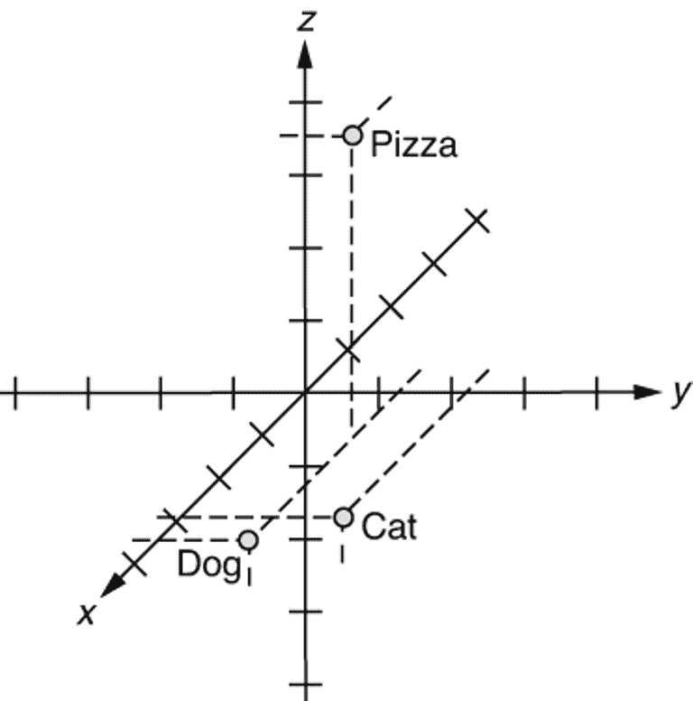
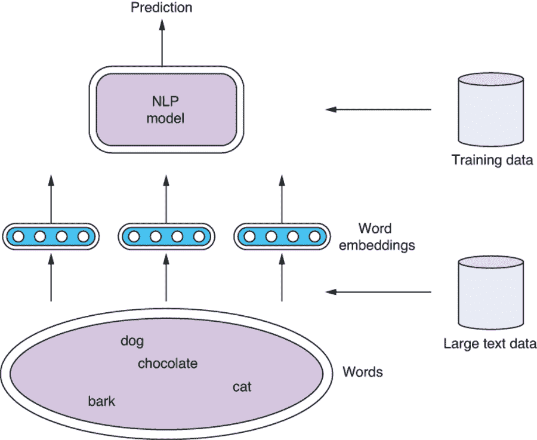
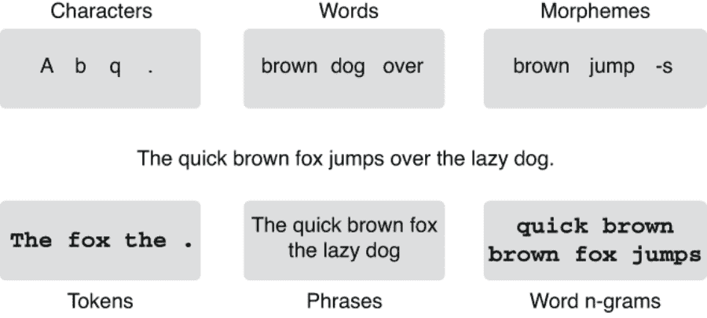
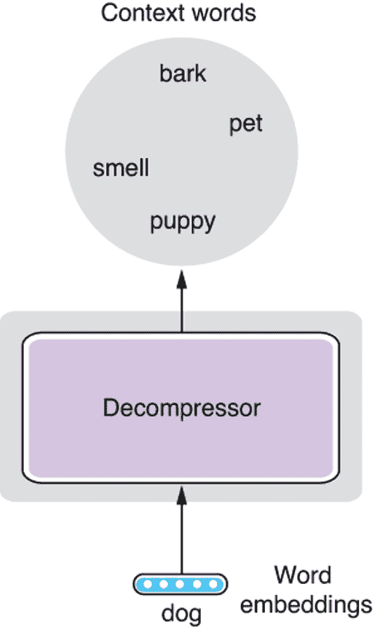
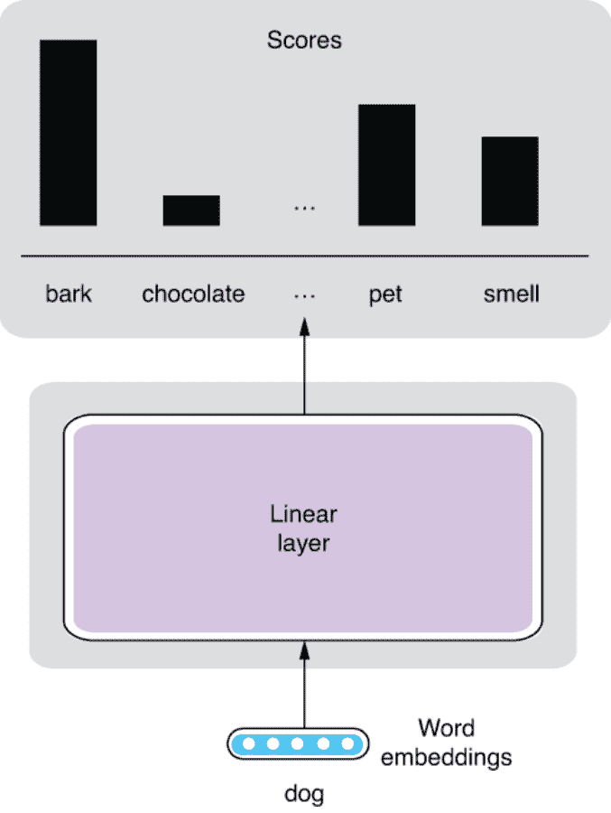
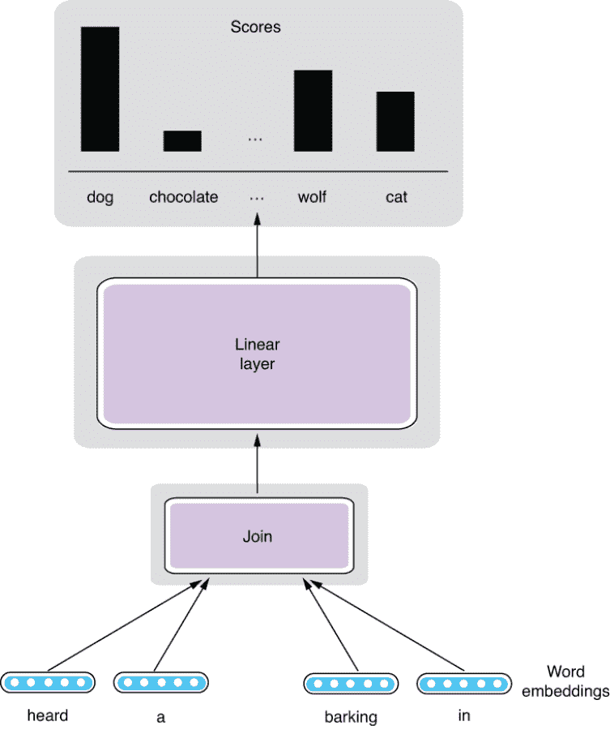
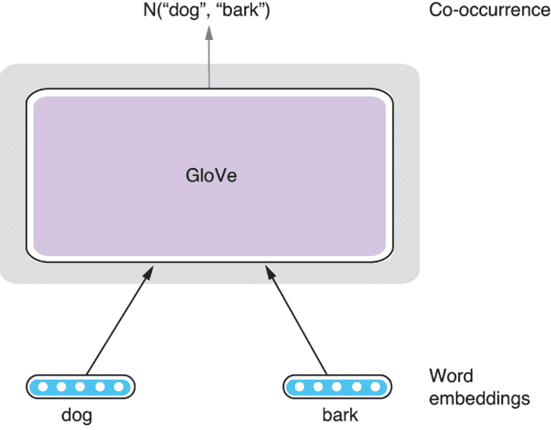
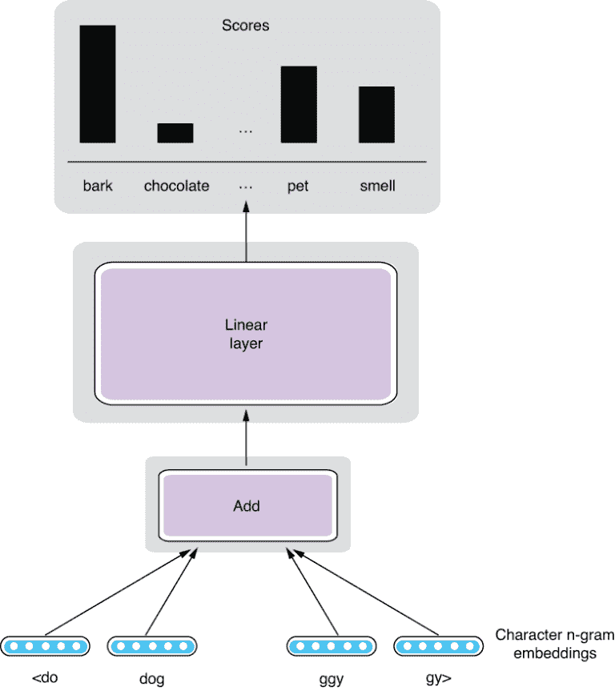
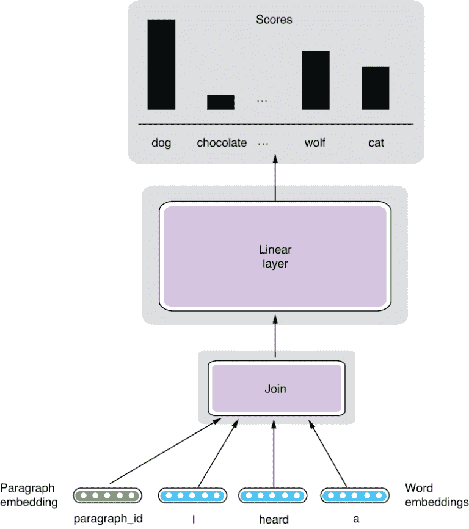
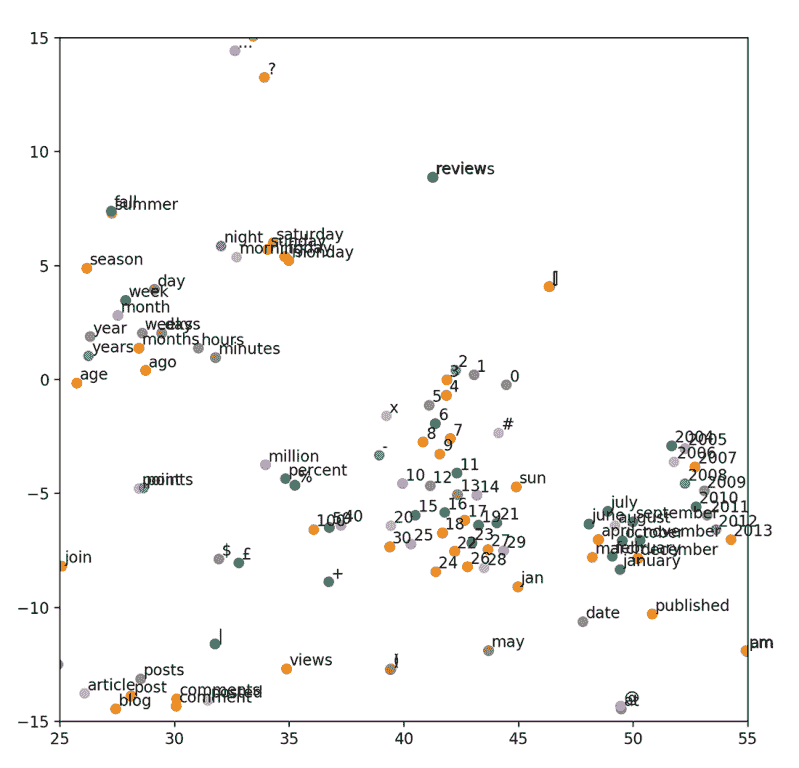

# 第四章：单词和文档嵌入

本章包括

+   单词嵌入是什么以及它们为什么重要

+   Skip-gram 模型如何学习单词嵌入以及如何实现它

+   GloVe 嵌入是什么以及如何使用预训练的向量

+   如何使用 Doc2Vec 和 fastText 训练更高级的嵌入

+   如何可视化单词嵌入

在第二章中，我指出神经网络只能处理数字，而自然语言中几乎所有内容都是离散的（即，分离的概念）。要在自然语言处理应用中使用神经网络，你需要将语言单位转换为数字，例如向量。例如，如果你希望构建一个情感分析器，你需要将输入句子（单词序列）转换为向量序列。在本章中，我们将讨论单词嵌入，这是实现这种桥接的关键。我们还将简要介绍几个在理解嵌入和神经网络的一般性质中重要的基本语言组件。

## 3.1 引入嵌入

正如我们在第二章中讨论的，嵌入是通常离散的事物的实值向量表示。在本节中，我们将重新讨论嵌入是什么，并详细讨论它们在自然语言处理应用中的作用。

### 3.1.1 什么是嵌入？

单词嵌入是一个单词的实值向量表示。如果你觉得向量的概念令人生畏，可以把它们想象成一维的浮点数数组，就像下面这样：

+   vec("cat") = [0.7, 0.5, 0.1]

+   vec("dog") = [0.8, 0.3, 0.1]

+   vec("pizza") = [0.1, 0.2, 0.8]

因为每个数组都包含三个元素，你可以将它们绘制为三维空间中的点，如图 3.1 所示。请注意，语义相关的单词（“猫”和“狗”）被放置在彼此附近。



图 3.1 单词嵌入在三维空间中

注意 实际上，你可以嵌入（即，用一系列数字表示）不仅仅是单词，还有几乎任何东西 —— 字符、字符序列、句子或类别。你可以使用相同的方法嵌入任何分类变量，尽管在本章中，我们将专注于自然语言处理中两个最重要的概念 —— 单词和句子。

### 3.1.2 嵌入为什么重要？

嵌入为什么重要？嗯，单词嵌入不仅重要，而且 *至关重要* 用于使用神经网络解决自然语言处理任务。神经网络是纯数学计算模型，只能处理数字。它们无法进行符号操作，例如连接两个字符串或使动词变为过去时，除非这些项目都用数字和算术操作表示。另一方面，自然语言处理中的几乎所有内容，如单词和标签，都是符号和离散的。这就是为什么你需要连接这两个世界，使用嵌入就是一种方法。请参阅图 3.2，了解如何在自然语言处理应用中使用单词嵌入的概述。



图 3.2 使用词嵌入与 NLP 模型

词嵌入，就像任何其他神经网络模型一样，可以进行训练，因为它们只是一组参数（或“魔法常数”，我们在上一章中谈到过）。词嵌入在以下三种情况下与您的 NLP 模型一起使用：

+   情况 1：同时使用任务的训练集训练词嵌入和您的模型。

+   情况 2：首先，独立训练词嵌入使用更大的文本数据集。或者，从其他地方获取预训练的词嵌入。然后使用预训练的词嵌入初始化您的模型，并同时使用任务的训练集对它们和您的模型进行训练。

+   情况 3：与情况 2 相同，除了您在训练模型时固定词嵌入。

在第一种情况下，词嵌入是随机初始化的，并且与您的 NLP 模型一起使用相同的数据集进行训练。这基本上就是我们在第二章中构建情感分析器的方式。用一个类比来说，这就像一个舞蹈老师同时教一个婴儿走路和跳舞。这并不是完全不可能的事情（事实上，有些婴儿可能通过跳过走路部分而成为更好、更有创意的舞者，但不要在家里尝试这样做），但很少是一个好主意。如果先教会婴儿正确站立和行走，然后再教会他们如何跳舞，他们可能会有更好的机会。

类似地，同时训练 NLP 模型和其子组件词嵌入并不罕见。但是，许多大规模、高性能的 NLP 模型通常依赖于使用更大数据集预训练的外部词嵌入（情况 2 和 3）。词嵌入可以从未标记的大型文本数据集中学习，即大量的纯文本数据（例如维基百科转储），这通常比用于任务的训练数据集（例如斯坦福情感树库）更容易获得。通过利用这样的大量文本数据，您可以在模型看到任务数据集中的任何实例之前就向其教授关于自然语言的许多知识。在一个任务上训练机器学习模型，然后为另一个任务重新利用它被称为*迁移学习*，这在许多机器学习领域中，包括 NLP 在内，变得越来越受欢迎。我们将在第九章进一步讨论迁移学习。

再次使用跳舞婴儿的类比，大多数健康的婴儿都会自己学会站立和行走。他们可能会得到一些成人的帮助，通常来自他们的亲近照顾者，比如父母。然而，这种“帮助”通常比从聘请的舞蹈老师那里得到的“训练信号”丰富得多，也更便宜，这就是为什么如果他们先学会走路，然后再学会跳舞，效果会更好的原因。许多用于行走的技能会转移到跳舞上。

方案 2 和方案 3 之间的区别在于，在训练 NLP 模型时是否调整了词嵌入，或者*精调*了词嵌入。这是否有效可能取决于你的任务和数据集。教你的幼儿芭蕾可能会对他们的步履有好处（例如通过改善他们的姿势），从而可能对他们的舞蹈有积极的影响，但是方案 3 不允许发生这种情况。

你可能会问的最后一个问题是：嵌入是怎么来的呢？之前我提到过，它们可以从大量的纯文本中进行训练。本章将解释这是如何实现的以及使用了哪些模型。

## 3.2 语言的基本单元：字符、词和短语

在解释词嵌入模型之前，我会简单介绍一些语言的基本概念，如字符、词和短语。当你设计你的 NLP 应用程序的结构时，了解这些概念将会有所帮助。图 3.3 展示了一些例子。

### 3.2.1 字符

*字符*（在语言学中也称为*字形*）是书写系统中的最小单位。在英语中，"a"、"b"和"z"都是字符。字符本身并不一定具有意义，也不一定在口语中代表任何固定的声音，尽管在某些语言中（例如中文）大多数字符都有这样的特点。许多语言中的典型字符可以用单个 Unicode 代码点（通过 Python 中的字符串文字，如"\uXXXX"）表示，但并非总是如此。许多语言使用多个 Unicode 代码点的组合（例如重音符号）来表示一个字符。标点符号，如"."（句号）、","（逗号）和"?"（问号），也是字符。



图 3.3 NLP 中使用的语言基本单元

### 3.2.2 词、标记、词素和短语

*词*是语言中可以独立发音并通常具有一定意义的最小单位。在英语中，"apple"、"banana"和"zebra"都是词。在大多数使用字母脚本的书面语言中，词通常由空格或标点符号分隔。然而，在一些语言（如中文、日文和泰文）中，词并没有明确由空格分隔，并且需要通过预处理步骤（称为*分词*）来识别句子中的词。

NLP 中与单词相关的一个概念是*标记*。标记是在书面语言中扮演特定角色的连续字符字符串。大多数单词（“苹果”，“香蕉”，“斑马”）在书写时也是标记。标点符号（如感叹号“!”）是标记，但不是单词，因为不能单独发音。在 NLP 中，“单词”和“标记”通常可以互换使用。实际上，在 NLP 文本（包括本书）中，当你看到“单词”时，通常指的是“标记”，因为大多数 NLP 任务只处理以自动方式处理的书面文本。标记是一个称为*标记化*的过程的输出，我将在下面进行详细解释。

另一个相关概念是形态素。*形态素*是语言中的最小意义单位。一个典型的单词由一个或多个形态素组成。例如，“苹果”既是一个单词，也是一个形态素。“苹果”是由两个形态素“苹果”和“-s”组成的单词，用来表示名词的复数形式。英语中还包含许多其他形态素，包括“-ing”，“-ly”，“-ness”和“un-”。在单词或句子中识别形态素的过程称为*形态分析*，它在 NLP/语言学应用中有广泛的应用，但超出了本书的范围。

*短语*是一组在语法角色上扮演特定角色的单词。例如，“the quick brown fox”是一个名词短语（像一个名词那样表现的一组词），而“jumps over the lazy dog”是一个动词短语。在 NLP 中，短语的概念可能被宽泛地用来表示任何一组单词。例如，在许多 NLP 文献和任务中，像“洛杉矶”这样的词被视为短语，虽然在语言学上，它们更接近一个词。

### 3.2.3 N-grams

最后，在 NLP 中，你可能会遇到*n-gram*的概念。n-gram 是一个或多个语言单位（如字符和单词）的连续序列。例如，一个单词 n-gram 是一个连续的单词序列，如“the”（一个单词），“quick brown”（两个单词），“brown fox jumps”（三个单词）。同样，字符 n-gram 由字符组成，例如“b”（一个字符），“br”（两个字符），“row”（三个字符）等，它们都是由“brown”组成的字符 n-gram。当 n = 1 时，大小为 1 的 n-gram 称为*unigram*。大小为 2 和 3 的 n-gram 分别被称为*bigram*和*trigram*。

在 NLP 中，单词 n-gram 通常被用作短语的代理，因为如果枚举一个句子的所有 n-gram，它们通常包含语言上有趣的单元，与短语（例如“洛杉矶”和“起飞”）对应。类似地，当我们想捕捉大致对应于形态素的子词单位时，我们使用字符 n-gram。在 NLP 中，当你看到“n-grams”（没有限定词）时，它们通常是*单词*n-gram。

注意：有趣的是，在搜索和信息检索中，n-grams 通常指用于索引文档的*字符* n-grams。当你阅读论文时，要注意上下文暗示的是哪种类型的 n-grams。

## 3.3 分词、词干提取和词形还原

我们介绍了在自然语言处理中经常遇到的一些基本语言单位。在本节中，我将介绍一些典型自然语言处理流水线中处理语言单位的步骤。

### 3.3.1 分词

*分词* 是将输入文本分割成较小单元的过程。有两种类型的分词：单词分词和句子分词。*单词分词* 将一个句子分割成标记（大致相当于单词和标点符号），我之前提到过。*句子分词* 则将可能包含多个句子的文本分割成单个句子。如果说分词，通常指的是 NLP 中的单词分词。

许多自然语言处理库和框架支持分词，因为它是自然语言处理中最基本且最常用的预处理步骤之一。接下来，我将向你展示如何使用两个流行的自然语言处理库——NLTK ([`www.nltk.org/`](https://www.nltk.org/)) 和 spaCy ([`spacy.io/`](https://spacy.io/)) 进行分词。

注意：在运行本节示例代码之前，请确保两个库都已安装。在典型的 Python 环境中，可以通过运行 pip install nltk 和 pip install spacy 进行安装。安装完成后，你需要通过命令行运行 python -c "import nltk; nltk.download('punkt')" 来下载 NLTK 所需的数据和模型，以及通过 python -m spacy download en 来下载 spaCy 所需的数据和模型。你还可以通过 Google Colab ([`realworldnlpbook.com/ch3.html#tokeni zation`](http://realworldnlpbook.com/ch3.html#tokenization)) 在不安装任何 Python 环境或依赖项的情况下运行本节中的所有示例。

要使用 NLTK 的默认单词和句子分词器，你可以从 nltk.tokenize 包中导入它们，如下所示：

```py
>>> import nltk
>>> from nltk.tokenize import word_tokenize, sent_tokenize
```

你可以用一个字符串调用这些方法，它们会返回一个单词或句子的列表，如下所示：

```py
>>> s = '''Good muffins cost $3.88\nin New York.  Please buy me two of them.\n\nThanks.'''

>>> word_tokenize(s)
['Good', 'muffins', 'cost', '$', '3.88', 'in', 'New', 'York', '.', 'Please',
 'buy', 'me', 'two', 'of', 'them', '.', 'Thanks', '.']

>>> sent_tokenize(s)
['Good muffins cost $3.88\nin New York.', 'Please buy me two of them.',
 'Thanks.']
```

NLTK 实现了除我们在此使用的默认方法之外的各种分词器。如果你有兴趣探索更多选项，可以参考其文档页面 ([`www.nltk.org/api/nltk.tokenize.html`](https://www.nltk.org/api/nltk.tokenize.html))。

你可以使用 spaCy 如下进行单词和句子的分词：

```py
>>> import spacy
>>> nlp = spacy.load('en_core_web_sm')

>>> doc = nlp(s)

>>> [token.text for token in doc]
['Good', 'muffins', 'cost', '$', '3.88', '\n', 'in', 'New', 'York', '.', ' ',
 'Please', 'buy', 'me', 'two', 'of', 'them', '.', '\n\n', 'Thanks', '.']

>>> [sent.string.strip() for sent in doc.sents]
['Good muffins cost $3.88\nin New York.', 'Please buy me two of them.', 'Thanks.']
```

请注意，NLTK 和 spaCy 的结果略有不同。例如，spaCy 的单词分词器保留换行符（'\n'）。标记器的行为因实现而异，并且没有每个自然语言处理从业者都同意的单一标准解决方案。尽管标准库（如 NLTK 和 spaCy）提供了一个良好的基线，但根据您的任务和数据，准备好进行实验。此外，如果您处理的是英语以外的语言，则您的选择可能会有所不同（并且可能会根据语言而有所限制）。如果您熟悉 Java 生态系统，Stanford CoreNLP（[`stanfordnlp.github.io/CoreNLP/`](https://stanfordnlp.github.io/CoreNLP/)）是另一个值得一试的良好自然语言处理框架。

最后，用于基于神经网络的自然语言处理模型的一个日益流行和重要的标记化方法是*字节对编码*（BPE）。字节对编码是一种纯统计技术，将文本分割成任何语言的字符序列，不依赖于启发式规则（如空格和标点符号），而只依赖于数据集中的字符统计信息。我们将在第十章更深入地学习字节对编码。

### 3.3.2 词干提取

*词干提取*是识别词干的过程。*词干*是在去除其词缀（前缀和后缀）后的单词的主要部分。例如，“apples”（复数）的词干是“apple”。具有第三人称单数 s 的“meets”的词干是“meet”。“unbelievable”的词干是“believe”。它通常是在屈折后保持不变的一部分。

词干提取——即将单词规范化为更接近其原始形式的东西——在许多自然语言处理应用中具有巨大的好处。例如，在搜索中，如果使用单词干而不是单词对文档进行索引，可以提高检索相关文档的机会。在许多基于特征的自然语言处理流水线中，您可以通过处理单词干来减轻 OOV（词汇外）问题。例如，即使您的字典中没有“apples”的条目，您也可以使用其词干“apple”作为代理。

用于提取英语单词词干的最流行算法称为*波特词干提取算法*，最初由马丁·波特编写。它由一系列用于重写词缀的规则组成（例如，如果一个词以“-ization”结尾，将其更改为“-ize”）。NLTK 实现了该算法的一个版本，称为 PorterStemmer 类，可以如下使用：

```py
>>> from nltk.stem.porter import PorterStemmer
>>> stemmer = PorterStemmer()

>>> words = ['caresses', 'flies', 'dies', 'mules', 'denied',
...          'died', 'agreed', 'owned', 'humbled', 'sized',
...          'meetings', 'stating', 'siezing', 'itemization',
...          'sensational', 'traditional', 'reference', 'colonizer',
...          'plotted']
>>> [stemmer.stem(word) for word in words]
['caress', 'fli', 'die', 'mule', 'deni',
 'die', 'agre', 'own', 'humbl', 'size',
 'meet', 'state', 'siez', 'item',
 'sensat', 'tradit', 'refer', 'colon',
 'plot']
```

词干提取并非没有局限性。在许多情况下，它可能过于激进。例如，你可以从上一个例子中看到，波特词干提取算法将“colonizer”和“colonize”都改为了“colon”。我无法想象有多少应用会愿意将这三个词视为相同的条目。此外，许多词干提取算法不考虑上下文甚至词性。在前面的例子中，“meetings” 被改为 “meet”，但你可以争辩说 “meetings” 作为复数名词应该被提取为 “meeting”，而不是 “meet”。因此，截至今天，很少有自然语言处理应用使用词干提取。

### 3.3.3 词形还原

词元是单词的原始形式，通常在字典中作为首字母出现。它也是词在屈折之前的基本形式。例如，“meetings”（作为复数名词）的词元是“meeting”。 “met”（动词过去式）的词元是“meet”。注意它与词干提取的区别，词干提取仅仅是从单词中剥离词缀，无法处理此类不规则的动词和名词。

使用 NLTK 运行词形还原很简单，如下所示：

```py
>>> from nltk.stem import WordNetLemmatizer
>>> lemmatizer = WordNetLemmatizer()

>>> [lemmatizer.lemmatize(word) for word in words]
['caress', 'fly', 'dy', 'mule', 'denied',
 'died', 'agreed', 'owned', 'humbled', 'sized',
 'meeting', 'stating', 'siezing', 'itemization',
 'sensational', 'traditional', 'reference', 'colonizer',
 'plotted']
```

spaCy 的代码看起来像这样：

```py
>>> doc = nlp(' '.join(words))
>>> [token.lemma_ for token in doc]
['caress', 'fly', 'die', 'mule', 'deny',
 'die', 'agree', 'own', 'humble', 'sized',
 'meeting', 'state', 'siezing', 'itemization',
 'sensational', 'traditional', 'reference', 'colonizer',
 'plot']
```

请注意，词形还原固有地要求您知道输入单词的词性，因为词形还原取决于它。例如，“meeting” 作为名词应该被还原为 “meeting”，而如果是动词，结果应该是 “meet”。NLTK 中的 WordNetLemmatizer 默认将所有内容视为名词，这就是为什么在结果中看到许多未还原的单词（“agreed”，“owned” 等）。另一方面，spaCy 可以从单词形式和上下文中自动推断词性，这就是为什么大多数还原的单词在其结果中是正确的。词形还原比词干提取更加耗费资源，因为它需要对输入进行统计分析和/或某种形式的语言资源（如字典），但由于其语言正确性，它在自然语言处理中有更广泛的应用。

## 3.4 Skip-gram 和 连续词袋（CBOW）

在之前的章节中，我解释了词嵌入是什么以及它们如何在自然语言处理应用中使用。在这一节中，我们将开始探索如何使用两种流行的算法——Skip-gram 和 CBOW——从大量文本数据中计算词嵌入。

### 3.4.1 词嵌入来自何处

在第 3.1 节中，我解释了词嵌入是如何用单个浮点数数组表示词汇表中的每个单词的：

+   vec("cat") = [0.7, 0.5, 0.1]

+   vec("dog") = [0.8, 0.3, 0.1]

+   vec("pizza") = [0.1, 0.2, 0.8]

现在，到目前为止的讨论中缺少一条重要信息。这些数字从哪里来？我们雇用一群专家让他们提出这些数字吗？这几乎是不可能的手动分配它们。在典型的大型语料库中存在数十万个唯一的词，而数组应该至少长达 100 维才能有效，这意味着你需要调整超过数千万个数字。

更重要的是，这些数字应该是什么样子的？你如何确定是否应该为“狗”向量的第一个元素分配 0.8，还是 0.7，或者其他任何数字？

答案是，这些数字也是使用训练数据集和像本书中的任何其他模型一样的机器学习模型进行训练的。接下来，我将介绍并实现训练词嵌入最流行的模型之一——Skip-gram 模型。

### 3.4.2 使用词语关联

首先，让我们退一步思考人类是如何学习“一只狗”等概念的。我不认为你们中的任何人曾经被明确告知过什么是狗。自从你还是一个蹒跚学步的孩童时，你就知道了这个叫做“狗”的东西，而没有任何其他人告诉你，“哦，顺便说一下，这个世界上有一种叫‘狗’的东西。它是一种四条腿的动物，会叫。”这是怎么可能的呢？你通过大量与外部世界的物理（触摸和闻到狗）、认知（看到和听到狗）和语言（阅读和听到有关狗的信息）的互动获得了这个概念。

现在让我们想一想教计算机“狗”这个概念需要什么条件。我们能让计算机“体验”与与“狗”概念相关的外部世界的互动吗？尽管典型的计算机不能四处移动并与实际狗有互动（截至目前为止，写作本文时还不能），但不教计算机“狗”是有可能的一种方法是使用与其他单词的*关联*。例如，如果你查看大型文本语料库中“狗”的出现，哪些词倾向于与之一起出现？“宠物”、“尾巴”、“气味”、“吠叫”、“小狗”——可能有无数个选项。那“猫”呢？也许是“宠物”、“尾巴”、“毛皮”、“喵喵叫”、“小猫”等等。因为“狗”和“猫”在概念上有很多共同之处（它们都是流行的宠物动物，有尾巴等），所以这两组上下文词也有很大的重叠。换句话说，你可以通过查看同一上下文中出现的其他单词来猜测两个单词彼此之间有多接近。这被称为*分布假设*，在自然语言处理中有着悠久的历史。

注意在人工智能中有一个相关术语——*分布式表示*。单词的分布式表示简单地是词嵌入的另一个名称。是的，这很令人困惑，但这两个术语在自然语言处理中都是常用的。

我们现在已经更近了一步。如果两个单词有很多上下文单词是共同的，我们可以给这两个单词分配相似的向量。你可以将一个单词向量看作是其上下文单词的“压缩”表示。那么问题就变成了：如何“解压缩”一个单词向量以获取其上下文单词？如何甚至在数学上表示一组上下文单词？从概念上讲，我们希望设计一个模型，类似于图 3.4 中的模型。



图 3.4 解压缩一个单词向量

表示一组单词的一种数学方法是为词汇表中的每个单词分配一个分数。我们可以将上下文单词表示为一个关联数组（在 Python 中为字典），从单词到它们与“dog”相关程度的“分数”，如下所示：

```py
{"bark": 1.4,
 "chocolate": 0.1,
 ...,
 "pet": 1.2,
 ...,
 "smell": 0.6,
 ...}
```

模型的唯一剩下的部分是如何生成这些“分数”。如果你按单词 ID（可能按字母顺序分配）对这个列表进行排序，那么这些分数可以方便地由一个 *N* 维向量表示，其中 *N* 是整个词汇表的大小（我们考虑的唯一上下文单词的数量），如下所示：

```py
[1.4, 0.1, ..., 1.2, ..., 0.6, ...]
```

“解压缩器”唯一需要做的就是将单词嵌入向量（具有三个维度）扩展到另一个 *N* 维向量。

这可能对你们中的一些人听起来非常熟悉 — 是的，这正是线性层（也称为全连接层）所做的。我在第 2.4.2 节简要讨论了线性层，但现在正是深入了解它们真正作用的好时机。

### 3.4.3 线性层

线性层以线性方式将一个向量转换为另一个向量，但它们究竟是如何做到这一点的呢？在讨论向量之前，让我们简化并从数字开始。你如何编写一个函数（比如说，在 Python 中的一个方法），以线性方式将一个数字转换为另一个数字？记住，线性意味着如果你将输入增加 1，输出总是以固定量（比如说，w）增加，无论输入的值是多少。例如，2.0 * x 是一个线性函数，因为如果你将 x 增加 1，值始终增加 2.0，无论 x 的值是多少。你可以写一个这样的函数的一般版本，如下所示：

```py
def linear(x):
    return w * x + b
```

现在假设参数 w 和 b 是固定的，并在其他地方定义。你可以确认输出（返回值）在增加或减少 x 1 时始终会变化 w。当 x = 0 时，b 是输出的值。这在机器学习中称为*偏差*。

现在，假设有两个输入变量，比如，x1 和 x2？你是否仍然可以编写一个函数，将两个输入变量线性转换为另一个数字？是的，这样做所需的改变非常少，如下所示：

```py
def linear2(x1, x2):
    return w1 * x1 + w2 * x2 + b
```

你可以通过检查输出变量的值来确认其线性性，如果你将 x1 增加 1，输出变量的值将增加 w1；如果你将 x2 增加 1，输出变量的值将增加 w2，而不管其他变量的值如何。偏差 b 仍然是当 x1 和 x2 都为 0 时的输出值。

例如，假设我们有 w1 = 2.0，w2 = -1.0，b = 1。对于输入（1,1），该函数返回 2。如果你增加 x1 1 并将（2,1）作为输入，你将得到 4，比 2 多 w1。如果你增加 x2 1 并将（1,2）作为输入，你将得到 1，比 2 少 1（或比 w2 多）。

在这一点上，我们可以开始思考将其推广到向量。如果有两个输出变量，比如 y1 和 y2，会怎么样？你能否仍然写出关于这两个输入的线性函数？是的，你可以简单地两次复制线性变换，使用不同的权重和偏差，如下所示：

```py
def linear3(x1, x2):
    y1 = w11 * x1 + w12 * x2 + b1
    y2 = w21 * x1 + w22 * x2 + b2
    return [y1, y2]
```

好的，情况有点复杂，但你实际上编写了一个将二维向量转换为另一个二维向量的线性层函数！如果你增加输入维度（输入变量的数量），这个方法将变得水平更长（即每行增加更多的加法），而如果你增加输出维度，这个方法将变得垂直更长（即更多的行）。

在实践中，深度学习库和框架以一种更高效、通用的方式实现线性层，并且通常大部分计算发生在 GPU 上。然而，从概念上了解线性层——神经网络最重要、最简单的形式，对理解更复杂的神经网络模型应该是至关重要的。

注意：在人工智能文献中，你可能会遇到*感知器*的概念。感知器是一个只有一个输出变量的线性层，应用于分类问题。如果你堆叠多个线性层（= 感知器），你就得到了*多层感知器*，这基本上是另一个称为具有一些特定结构的前馈神经网络。

最后，你可能想知道本节中看到的常数 w 和 b 是从哪里来的。这些正是我在第 2.4.1 节中谈到的“魔法常数”。你调整这些常数，使线性层（以及整个神经网络）的输出通过*优化*过程更接近你想要的结果。这些魔法常数也被称为机器学习模型的*参数*。

把所有这些放在一起，我们希望 Skip-gram 模型的结构如图 3.5 所示。这个网络非常简单。它以一个词嵌入作为输入，并通过一个线性层扩展到一组分数，每个上下文词一个。希望这不会像许多人想象的那样令人畏惧！



图 3.5 Skip-gram 模型结构

### 3.4.4 Softmax

现在让我们来讨论如何“训练”Skip-gram 模型并学习我们想要的单词嵌入。关键在于将这个过程转化为一个分类任务，在这个任务中，模型预测哪些单词出现在上下文中。这里的“上下文”指的只是一个固定大小的窗口（例如，上下各 5 个单词），窗口以目标单词（例如，“狗”）为中心。当窗口大小为 2 时，请参见图 3.6 以便了解。实际上，这是一个“假”的任务，因为我们对模型的预测本身并不感兴趣，而是对训练模型时产生的副产品（单词嵌入）感兴趣。在机器学习和自然语言处理中，我们经常虚构一个假任务来训练另一些东西作为副产品。


图 3.6 目标单词和上下文单词（窗口大小=2 时）

注意 这种机器学习设置，其中训练标签是从给定数据集自动生成的，也可以称为*自监督学习*。最近流行的技术，如单词嵌入和语言建模，都使用了自监督学习。

使神经网络解决分类任务相对容易。你需要做以下两件事情：

+   修改网络，以便产生概率分布。

+   使用交叉熵作为损失函数（我们马上会详细介绍这一点）。

你可以使用称为*softmax*的东西来进行第一个。Softmax 是一个函数，它将*K*个浮点数向量转化为概率分布，首先“压缩”这些数字，使其适合 0.0-1.0 的范围，然后将它们归一化，使其总和等于 1。如果你对概率的概念不熟悉，请将其替换为*置信度*。概率分布是网络对个别预测（在这种情况下，上下文单词）的置信度值的集合。Softmax 在保持输入浮点数的相对顺序的同时执行所有这些操作，因此大的输入数字仍然在输出分布中具有大的概率值。图 3.7 以概念上的方式说明了这一点。


图 3.7 软最大值

将神经网络转化为分类器所需的另一个组件是*交叉熵*。交叉熵是一种用于衡量两个概率分布之间距离的损失函数。如果两个分布完全匹配，则返回零，如果两个分布不同，则返回较高的值。对于分类任务，我们使用交叉熵来比较以下内容：

+   神经网络产生的预测概率分布（softmax 的输出）

+   目标概率分布，其中正确类别的概率为 1.0，其他的都是 0.0

Skip-gram 模型的预测逐渐接近实际的上下文词，同时学习单词嵌入。

### 在 AllenNLP 上实现 Skip-gram

使用 AllenNLP 将这个模型转化为可工作的代码相对直接。请注意，本节中列出的所有代码都可以在 Google Colab 笔记本上执行（[`realworldnlpbook.com/ch3.html#word2vec-nb`](http://realworldnlpbook.com/ch3.html#word2vec-nb)）。首先，你需要实现一个数据集读取器，该读取器将读取一个纯文本语料库，并将其转换为 Skip-gram 模型可以使用的一组实例。数据集读取器的详细信息对于本讨论并不关键，因此我将省略完整的代码清单。你可以克隆本书的代码仓库（[`github.com/mhagiwara/realworldnlp`](https://github.com/mhagiwara/realworldnlp)），并按照以下方式导入它：

```py
from examples.embeddings.word2vec import SkipGramReader
```

或者，如果你有兴趣，你可以从 [`realworldnlpbook.com/ch3.html#word2vec`](http://realworldnlpbook.com/ch3.html#word2vec) 查看完整的代码。你可以按照以下方式使用读取器：

```py
reader = SkipGramReader()
text8 = reader.read('https:/./realworldnlpbook.s3.amazonaws.com/data/text8/text8')
```

此外，在这个示例中，请确保导入所有必要的模块并定义一些常量，如下所示：

```py
from collections import Counter

import torch
import torch.optim as optim
from allennlp.data.data_loaders import SimpleDataLoader
from allennlp.data.vocabulary import Vocabulary
from allennlp.models import Model
from allennlp.modules.token_embedders import Embedding
from allennlp.training.trainer import GradientDescentTrainer
from torch.nn import CosineSimilarity
from torch.nn import functional

EMBEDDING_DIM = 256
BATCH_SIZE = 256
```

在这个示例中，我们将使用 text8（[`mattmahoney.net/dc/textdata`](http://mattmahoney.net/dc/textdata)）数据集。该数据集是维基百科的一部分，经常用于训练玩具词嵌入和语言模型。你可以迭代数据集中的实例。token_in 是模型的输入标记，token_out 是输出（上下文词）：

```py
>>> for inst in text8:
>>>     print(inst)
...
Instance with fields:
     token_in: LabelField with label: ideas in namespace: 'token_in'.'
     token_out: LabelField with label: us in namespace: 'token_out'.'

Instance with fields:
     token_in: LabelField with label: ideas in namespace: 'token_in'.'
     token_out: LabelField with label: published in namespace: 'token_out'.'

Instance with fields:
     token_in: LabelField with label: ideas in namespace: 'token_in'.'
     token_out: LabelField with label: journal in namespace: 'token_out'.'

Instance with fields:
     token_in: LabelField with label: in in namespace: 'token_in'.'
     token_out: LabelField with label: nature in namespace: 'token_out'.'

Instance with fields:
     token_in: LabelField with label: in in namespace: 'token_in'.'
     token_out: LabelField with label: he in namespace: 'token_out'.'

Instance with fields:
     token_in: LabelField with label: in in namespace: 'token_in'.'
     token_out: LabelField with label: announced in namespace: 'token_out'.'
...
```

然后，你可以构建词汇表，就像我们在第二章中所做的那样，如下所示：

```py
vocab = Vocabulary.from_instances(
    text8, min_count={'token_in': 5, 'token_out': 5})
```

注意，我们使用了 min_count 参数，该参数设置了每个 token 出现的最低限制。此外，让我们按照以下方式定义用于训练的数据加载器：

```py
data_loader = SimpleDataLoader(text8, batch_size=BATCH_SIZE)
data_loader.index_with(vocab)
```

然后，我们定义一个包含所有要学习的词嵌入的嵌入对象：

```py
embedding_in = Embedding(num_embeddings=vocab.get_vocab_size('token_in'),
                         embedding_dim=EMBEDDING_DIM)
```

这里，EMBEDDING_DIM 是每个单词向量的长度（浮点数的数量）。一个典型的 NLP 应用程序使用几百维的单词向量（在本例中为 256），但该值在任务和数据集上有很大的依赖性。通常建议随着训练数据的增长使用更长的单词向量。

最后，你需要实现 Skip-gram 模型的主体，如下所示。

清单 3.1 在 AllenNLP 中实现的 Skip-gram 模型。

```py
class SkipGramModel(Model):                                   ❶

    def __init__(self, vocab, embedding_in):
        super().__init__(vocab)

        self.embedding_in = embedding_in                      ❷

        self.linear = torch.nn.Linear(
            in_features=EMBEDDING_DIM,
            out_features=vocab.get_vocab_size('token_out'),
            bias=False)                                       ❸

    def forward(self, token_in, token_out):                   ❹

        embedded_in = self.embedding_in(token_in)             ❺

        logits = self.linear(embedded_in)                     ❻

        loss = functional.cross_entropy(logits, token_out)    ❼

        return {'loss': loss}
```

❶ AllenNLP 要求每个模型都必须继承自 Model。

❷ 嵌入对象从外部传入，而不是在内部定义。

❸ 这创建了一个线性层（请注意我们不需要偏置）。

❹ 神经网络计算的主体在 forward() 中实现。

❺ 将输入张量（单词 ID）转换为单词嵌入。

❻ 应用线性层。

❼ 计算损失。

注意以下几点：

+   AllenNLP 要求每个模型都必须继承自 allennlp.models.Model。

+   模型的初始化函数（__init__）接受一个 Vocabulary 实例和定义在外部的任何其他参数或子模型。它还定义任何内部的参数或模型。

+   模型的主要计算是在 forward()中定义的。它将实例中的所有字段（在这个例子中是 token_in 和 token_out）作为张量（多维数组），并返回一个包含'loss'键的字典，该键将被优化器用于训练模型。

你可以使用以下代码来训练这个模型。

列表 3.2 训练 Skip-gram 模型的代码

```py
reader = SkipGramReader()
text8 = reader.read(' https:/./realworldnlpbook.s3.amazonaws.com/data/text8/text8')

vocab = Vocabulary.from_instances(
    text8, min_count={'token_in': 5, 'token_out': 5})

data_loader = SimpleDataLoader(text8, batch_size=BATCH_SIZE)
data_loader.index_with(vocab)

embedding_in = Embedding(num_embeddings=vocab.get_vocab_size('token_in'),
                         embedding_dim=EMBEDDING_DIM)

model = SkipGramModel(vocab=vocab,
                      embedding_in=embedding_in)
optimizer = optim.Adam(model.parameters())

trainer = GradientDescentTrainer(
    model=model,
    optimizer=optimizer,
    data_loader=data_loader,
    num_epochs=5,
    cuda_device=CUDA_DEVICE)
trainer.train()
```

训练需要一段时间，所以我建议首先截取训练数据，比如只使用前一百万个标记。你可以在 reader.read()后插入 text8 = list(text8)[:1000000]。训练结束后，你可以使用列表 3.3 中展示的方法获取相关词（具有相同意义的词）。这个方法首先获取给定词（标记）的词向量，然后计算它与词汇表中的每个其他词向量的相似度。相似性是使用所谓的*余弦相似度*来计算的。简单来说，余弦相似度是两个向量之间角度的反义词。如果两个向量相同，那么它们之间的角度就是零，相似度就是 1，这是可能的最大值。如果两个向量是垂直的，角度是 90 度，余弦相似度就是 0。如果向量完全相反，余弦相似度就是-1。

列表 3.3 使用词嵌入获取相关词的方法

```py
def get_related(token: str, embedding: Model, vocab: Vocabulary, 
                num_synonyms: int = 10):
    token_id = vocab.get_token_index(token, 'token_in')
    token_vec = embedding.weight[token_id]
    cosine = CosineSimilarity(dim=0)
    sims = Counter()

    for index, token in vocab.get_index_to_token_vocabulary('token_in').items():
        sim = cosine(token_vec, embedding.weight[index]).item()
        sims[token] = sim

    return sims.most_common(num_synonyms)
```

如果你对“one”和“december”这两个词运行这个模型，你将得到表 3.1 中展示的相关词列表。虽然你可能会看到一些与查询词无关的词，但整体上，结果看起来很不错。

表 3.1 “one” 和 “december”的相关词

| “一” | “十二月” |
| --- | --- |
| 一 | 十二月 |
| 九 | 一月 |
| 八 | 尼克斯 |
| 六 | 伦敦 |
| 五 | 植物 |
| 七 | 六月 |
| 三 | 斯密森 |
| 四 | 二月 |
| d | 卡努尼 |
| 女演员 | 十月 |

最后一点说明：如果你想要在实践中使用 Skip-gram 来训练高质量的词向量，你需要实现一些技术，即负采样和高频词子采样。虽然它们是重要的概念，但如果你刚开始学习，并想了解自然语言处理的基础知识，它们可能会分散你的注意力。如果你对了解更多感兴趣，请查看我在这个主题上写的这篇博客文章：[`realworldnlpbook.com/ch3.html#word2vec-blog`](http://realworldnlpbook.com/ch3.html#word2vec-blog)。

### 3.4.6 连续词袋（CBOW）模型

通常与 Skip-gram 模型一起提到的另一个词嵌入模型是*连续词袋*（CBOW）*模型*。作为 Skip-gram 模型的近亲，同时提出（[`realworldnlpbook.com/ch3.html# mikolov13`](http://realworldnlpbook.com/ch3.html#mikolov13)），CBOW 模型的结构与 Skip-gram 模型相似，但上下颠倒。该模型试图解决的“假”任务是从一组上下文词预测目标词。这与填空题类型的问题类似。例如，如果你看到一个句子“I heard a ___ barking in the distance.”，大多数人可能会立即猜到答案“dog”。图 3.8 显示了该模型的结构。



图 3.8 连续词袋 (CBOW) 模型

我不打算在这里从头实现 CBOW 模型，有几个原因。如果你理解了 Skip-gram 模型，实现 CBOW 模型应该很简单。此外，CBOW 模型在词语语义任务上的准确性通常略低于 Skip-gram 模型，并且 CBOW 在 NLP 中使用的频率也较低。这两个模型都在原始的 Word2vec ([`code .google.com/archive/p/word2vec/`](https://code.google.com/archive/p/word2vec/)) 工具包中实现，如果你想自己尝试它们，尽管如此，由于更近期、更强大的词嵌入模型的出现（例如 GloVe 和 fastText），这些基本的 Skip-gram 和 CBOW 模型现在使用得越来越少，这些模型在本章的其余部分中介绍。

## 3.5 GloVe

在前一节中，我实现了 Skip-gram，并展示了如何利用大量文本数据训练词嵌入。但是如果你想构建自己的 NLP 应用程序，利用高质量的词嵌入，同时避开所有麻烦呢？如果你无法承担训练词嵌入所需的计算和数据呢？

与训练词嵌入相反，你总是可以下载其他人发布的预训练词嵌入，这是许多 NLP 从业者做的。在本节中，我将介绍另一种流行的词嵌入模型——*GloVe*，名为 *Global Vectors*。由 GloVe 生成的预训练词嵌入可能是当今 NLP 应用中最广泛使用的嵌入。

### 3.5.1 GloVe 如何学习词嵌入

之前描述的两个模型与 GloVe 的主要区别在于前者是*局部的*。简而言之，Skip-gram 使用预测任务，其中上下文词（“bark”）从目标词（“dog”）预测。CBOW 基本上做相反的事情。这个过程重复了数据集中的每个单词标记的次数。它基本上扫描整个数据集，并询问：“这个词可以从另一个词预测吗？”对于数据集中每个单词的每次出现都会问这个问题。

让我们思考一下这个算法的效率。如果数据集中有两个或更多相同的句子呢？或者非常相似的句子呢？在这种情况下，Skip-gram 将重复多次相同的一组更新。你可能会问，“‘bark’ 可以从 ‘dog’ 预测吗？” 但很有可能你在几百个句子前已经问过了完全相同的问题。如果你知道 “dog” 和 “bark” 这两个词在整个数据集中共同出现了 *N* 次，那为什么要重复这 *N* 次呢？这就好像你在把 “1” 加 *N* 次到另一个东西上（x + 1 + 1 + 1 + ... + 1），而你其实可以直接加 *N* 到它上面（x + N）。我们能否直接利用这个 *全局* 信息呢？

GloVe 的设计受到这一见解的启发。它不是使用局部单词共现，而是使用整个数据集中的聚合单词共现统计信息。假设 “dog” 和 “bark” 在数据集中共同出现了 *N* 次。我不会深入讨论模型的细节，但粗略地说，GloVe 模型试图从两个单词的嵌入中预测这个数字 *N*。图 3.9 描绘了这个预测任务。它仍然对单词关系进行了一些预测，但请注意，它对于每个单词 *类型* 的组合进行了一次预测，而 Skip-gram 则对每个单词 *标记* 的组合进行了预测！



图 3.9 GloVe

标记和类型 如第 3.3.1 节所述，*标记* 是文本中单词的出现。一个语料库中可能会有同一个单词的多次出现。另一方面，*类型* 是一个独特的、唯一的词。例如，在句子 “A rose is a rose is a rose.” 中，有八个标记但只有三种类型（“a”，“rose”，和 “is”）。如果你熟悉面向对象编程，它们大致相当于实例和类。一个类可以有多个实例，但一个概念只有一个类。

### 3.5.2 使用预训练的 GloVe 向量

实际上，并不是很多自然语言处理（NLP）从业者自己从头开始训练 GloVe 向量。更常见的是，我们下载并使用预训练的词向量，这些词向量是使用大型文本语料库预训练的。这不仅快捷，而且通常有助于使您的 NLP 应用程序更准确，因为这些预训练的词向量（通常由词向量算法的发明者公开）通常是使用比我们大多数人负担得起的更大的数据集和更多的计算资源进行训练的。通过使用预训练的词向量，您可以“站在巨人的肩膀上”，并快速利用从大型文本语料库中提炼出的高质量语言知识。

在本节的其余部分，让我们看看如何使用预先训练的 GloVe 嵌入下载并搜索相似单词。首先，您需要下载数据文件。官方的 GloVe 网站（[`nlp.stanford.edu/projects/glove/`](https://nlp.stanford.edu/projects/glove/)）提供了使用不同数据集和向量大小训练的多个词嵌入文件。您可以选择任何一个（尽管取决于您选择的文件大小可能很大）并解压缩它。在接下来的内容中，我们假设您将其保存在相对路径 data/glove/下。

大多数词嵌入文件都以相似的方式格式化。每一行都包含一个单词，后跟一系列与其单词向量对应的数字。数字的数量与维度一样多（在上述网站上分发的 GloVe 文件中，您可以从文件名后缀中以 xxx 维的形式了解维度）。每个字段由一个空格分隔。以下是 GloVe 词嵌入文件的摘录：

```py
...
if 0.15778 0.17928 -0.45811 -0.12817 0.367 0.18817 -4.5745 0.73647 ...
one 0.38661 0.33503 -0.25923 -0.19389 -0.037111 0.21012 -4.0948 0.68349 ...
has 0.08088 0.32472 0.12472 0.18509 0.49814 -0.27633 -3.6442 1.0011 ...
...
```

正如我们在第 3.4.5 节中所做的那样，我们想要做的是接受一个查询词（比如，“狗”）并在*N*维空间中找到它的邻居。一种方法是计算查询词与词汇表中的每个其他词之间的相似性，并按其相似性对单词进行排序，如清单 3.3 所示。根据词汇表的大小，这种方法可能非常缓慢。这就像线性扫描数组以找到元素而不是使用二进制搜索一样。

相反，我们将使用近似最近邻算法快速搜索相似单词。简而言之，这些算法使我们能够快速检索最近的邻居，而无需计算每个单词对之间的相似性。具体而言，我们将使用 Annoy（[`github.com/spotify/annoy`](https://github.com/spotify/annoy)）库，这是来自 Spotify 的用于近似最近邻搜索的库。您可以通过运行 pip install annoy 来安装它。它使用随机投影实现了一种流行的近似最近邻算法称为*局部敏感哈希*（LSH）。

要使用 Annoy 搜索相似的单词，您首先需要构建一个索引，可以按照清单 3.4 所示进行。请注意，我们还正在构建一个从单词索引到单词的字典，并将其保存到单独的文件中，以便以后方便进行单词查找（清单 3.5）。

清单 3.4 构建 Annoy 索引

```py
from annoy import AnnoyIndex
import pickle

EMBEDDING_DIM = 300
GLOVE_FILE_PREFIX = 'data/glove/glove.42B.300d{}'

def build_index():
    num_trees = 10

    idx = AnnoyIndex(EMBEDDING_DIM)

    index_to_word = {}
    with open(GLOVE_FILE_PREFIX.format('.txt')) as f:
        for i, line in enumerate(f):
            fields = line.rstrip().split(' ')
            vec = [float(x) for x in fields[1:]]
            idx.add_item(i, vec)
            index_to_word[i] = fields[0]

    idx.build(num_trees)
    idx.save(GLOVE_FILE_PREFIX.format('.idx'))
    pickle.dump(index_to_word,
                open(GLOVE_FILE_PREFIX.format('.i2w'), mode='wb'))
```

读取 GloVe 嵌入文件并构建 Annoy 索引可能会相当慢，但一旦构建完成，访问它并检索相似单词的速度可以非常快。这种配置类似于搜索引擎，其中构建索引以实现几乎实时检索文档。这适用于需要实时检索相似项但数据集更新频率较低的应用程序。示例包括搜索引擎和推荐引擎。

清单 3.5 使用 Annoy 索引检索相似单词

```py
def search(query, top_n=10):
    idx = AnnoyIndex(EMBEDDING_DIM)
    idx.load(GLOVE_FILE_PREFIX.format('.idx'))
    index_to_word = pickle.load(open(GLOVE_FILE_PREFIX.format('.i2w'),
                                     mode='rb'))
    word_to_index = {word: index for index, word in index_to_word.items()}

    query_id = word_to_index[query]
    word_ids = idx.get_nns_by_item(query_id, top_n)
    for word_id in word_ids:
        print(index_to_word[word_id])
```

如果你运行这个对于单词“狗”和“十二月”，你将得到表 3.2 中显示的与这两个单词最相关的 10 个单词列表。

表 3.2 “狗”和“十二月”的相关词

| “狗” | “十二月” |
| --- | --- |
| 狗 | 十二月 |
| 小狗 | 一月 |
| 猫 | 十月 |
| 猫 | 十一月 |
| 马 | 九月 |
| 婴儿 | 二月 |
| 公牛 | 八月 |
| 小孩 | 七月 |
| 孩子 | 四月 |
| 猴子 | 三月 |

你可以看到每个列表中包含与查询单词相关的许多单词。你会在每个列表的顶部看到相同的单词——这是因为两个相同向量的余弦相似度总是 1，它的最大可能值。

## 3.6 fastText

在前一节中，我们看到了如何下载预训练的单词嵌入并检索相关的单词。在本节中，我将解释如何使用自己的文本数据使用 fastText，一种流行的单词嵌入工具包，训练单词嵌入。当你的文本数据不是在普通领域（例如，医疗、金融、法律等）中，和/或者不是英文时，这将非常方便。

### 3.6.1 利用子词信息

到目前为止，在本章中我们看到的所有词嵌入方法都为每个单词分配了一个独特的单词向量。例如，“狗”和“猫”的单词向量被视为独立的，并且在训练时独立训练。乍一看，这似乎没有什么问题。毕竟，它们*确实*是不同的单词。但是，如果单词分别是“狗”和“小狗”呢？因为“-y”是一个表示亲近和喜爱的英语后缀（其他例子包括“奶奶”和“奶奶”、“小猫”和“小猫”），这些词对有一定的语义联系。然而，将单词视为独立的单词嵌入算法无法建立这种联系。在这些算法的眼中，“狗”和“小狗”只不过是 word_823 和 word_1719 而已。

这显然是局限性的。在大多数语言中，单词拼写（你如何书写）和单词语义（它们的意思）之间有着强烈的联系。例如，共享相同词根的单词（例如，“study”和“studied”、“repeat”和“repeatedly”以及“legal”和“illegal”）通常是相关的。通过将它们视为独立的单词，单词嵌入算法正在丢失很多信息。它们如何利用单词结构并反映所学单词嵌入中的相似性呢？

*fastText*，是 Facebook 开发的一种算法和词嵌入库，是这样一个模型。它使用*子词信息*，这意味着比单词更小的语言单位的信息，来训练更高质量的词嵌入。具体来说，fastText 将单词分解为字符 n-gram（第 3.2.3 节）并为它们学习嵌入。例如，如果目标单词是“doggy”，它首先在单词的开头和结尾添加特殊符号并为<do，dog，ogg，ggy，gy>学习嵌入，当 n=3。 “doggy”的向量只是所有这些向量的总和。其余的架构与 Skip-gram 的架构非常相似。图 3.10 显示了 fastText 模型的结构。



图 3.10 fastText 的架构

利用子词信息的另一个好处是可以减轻*词汇外*（OOV）问题。许多 NLP 应用和模型假设一个固定的词汇表。例如，典型的词嵌入算法如 Skip-gram 只学习在训练集中遇到的单词的词向量。但是，如果测试集包含在训练集中未出现的单词（称为 OOV 单词），模型将无法为它们分配任何向量。例如，如果您从上世纪 80 年代出版的书籍中训练 Skip-gram 词嵌入，并将其应用于现代社交媒体文本，它将如何知道要为“Instagram”分配什么向量？它不会。另一方面，由于 fastText 使用子词信息（字符 n-gram），它可以为任何 OOV 单词分配词向量，只要它们包含在训练数据中看到的字符 n-gram（这几乎总是如此）。它可能猜到它与一些快速相关（“Insta”）和图片（“gram”）有关。

### 3.6.2 使用 fastText 工具包

Facebook 提供了 fastText 工具包的开源代码，这是一个用于训练前面章节讨论的词嵌入模型的库。在本节的其余部分，让我们看看使用这个库来训练词嵌入是什么感觉。

首先，转到官方文档（[`realworldnlpbook.com/ch3.html #fasttext`](http://realworldnlpbook.com/ch3.html#fasttext)）并按照说明下载和编译该库。在大多数环境中，只需克隆 GitHub 存储库并从命令行运行 make 即可。编译完成后，您可以运行以下命令来训练基于 Skip-gram 的 fastText 模型：

```py
$ ./fasttext skipgram -input ../data/text8 -output model
```

我们假设在../data/text8 下有一个文本数据文件，您想要用作训练数据，但如果需要，请更改这个位置。这将创建一个 model.bin 文件，这是一个训练模型的二进制表示。训练完模型后，您可以获得任何单词的词向量，甚至是在训练数据中从未见过的单词，方法如下：

```py
$ echo "supercalifragilisticexpialidocious" \
| ./fasttext print-word-vectors model.bin
supercalifragilisticexpialidocious 0.032049 0.20626 -0.21628 -0.040391 -0.038995 0.088793 -0.0023854 0.41535 -0.17251 0.13115 ...
```

## 3.7 文档级嵌入

到目前为止，我描述的所有模型都是为单词学习嵌入。如果您只关注词级任务，比如推断词之间的关系，或者将它们与更强大的神经网络模型（如循环神经网络（RNN））结合使用，它们可以是非常有用的工具。然而，如果您希望使用词嵌入和传统机器学习工具（如逻辑回归和支持向量机（SVM））解决与更大语言结构（如句子和文档）相关的 NLP 任务，词级嵌入方法仍然是有限的。您如何用向量表示来表示更大的语言单元，比如句子？您如何使用词嵌入进行情感分析，例如？

一个实现这一目标的方法是简单地使用句子中所有词向量的平均值。您可以通过取第一个元素、第二个元素的平均值等等，然后通过组合这些平均数生成一个新的向量。您可以将这个新向量作为传统机器学习模型的输入。尽管这种方法简单且有效，但它也有很大的局限性。最大的问题是它不能考虑词序。例如，如果您仅仅对句子中的每个单词向量取平均值，那么句子“Mary loves John.”和“John loves Mary.”的向量将完全相同。

NLP 研究人员提出了可以专门解决这个问题的模型和算法。其中最流行的之一是*Doc2Vec*，最初由 Le 和 Mikolov 在 2014 年提出（[`cs.stanford.edu/~quocle/paragraph_vector.pdf`](https://cs.stanford.edu/~quocle/paragraph_vector.pdf)）。这个模型，正如其名称所示，学习文档的向量表示。事实上，“文档”在这里只是指任何包含多个单词的可变长度文本。类似的模型还被称为许多类似的名称，比如*句子 2Vec*、*段落 2Vec*、*段落向量*（这是原始论文的作者所用的），但本质上，它们都指的是相同模型的变体。

在本节的其余部分，我将讨论一种称为*段落向量分布记忆模型*（PV-DM）的 Doc2Vec 模型之一。该模型与我们在本章前面学习的 CBOW 非常相似，但有一个关键的区别——多了一个向量，称为*段落向量*，作为输入。该模型从一组上下文单词*和*段落向量预测目标词。每个段落都被分配一个不同的段落向量。图 3.11 展示了 PV-DM 模型的结构。另外，PV-DM 仅使用在目标词之前出现的上下文单词进行预测，但这只是一个微小的差异。



图 3.11 段落向量分布记忆模型

这段向量会对预测任务有什么影响？现在您从段落向量中获得了一些额外信息来预测目标单词。由于模型试图最大化预测准确性，您可以预期段落向量会更新，以便它提供一些在句子中有用的“上下文”信息，这些信息不能被上下文词向量共同捕获。作为副产品，模型学会了反映每个段落的整体含义，以及词向量。

几个开源库和包支持 Doc2Vec 模型，但其中一个最广泛使用的是 Gensim（[`radimrehurek.com/gensim/`](https://radimrehurek.com/gensim/)），可以通过运行 pip install gensim 来安装。Gensim 是一个流行的自然语言处理工具包，支持广泛的向量和主题模型，例如 TF-IDF（词频和逆文档频率）、LDA（潜在语义分析）和词嵌入。

要使用 Gensim 训练 Doc2Vec 模型，您首先需要读取数据集并将文档转换为 TaggedDocument。可以使用此处显示的 read_corpus() 方法来完成：

```py
from gensim.utils import simple_preprocess
from gensim.models.doc2vec import TaggedDocument

def read_corpus(file_path):
    with open(file_path) as f:
        for i, line in enumerate(f):
            yield TaggedDocument(simple_preprocess(line), [i])
```

我们将使用一个小数据集，其中包含来自 Tatoeba 项目（[`tatoeba.org/`](https://tatoeba.org/)）的前 200,000 个英文句子。您可以从 [`mng.bz/7l0y`](http://mng.bz/7l0y) 下载数据集。然后，您可以使用 Gensim 的 Doc2Vec 类来训练 Doc2Vec 模型，并根据训练的段落向量检索相似的文档，如下所示。

列表 3.6 训练 Doc2Vec 模型并检索相似文档

```py
    from gensim.models.doc2vec import Doc2Vec

    train_set = list(read_corpus('data/mt/sentences.eng.200k.txt'))
    model = Doc2Vec(vector_size=256, min_count=3, epochs=30)
    model.build_vocab(train_set)
    model.train(train_set,
                total_examples=model.corpus_count,
                epochs=model.epochs)

    query_vec = model.infer_vector(
        ['i', 'heard', 'a', 'dog', 'barking', 'in', 'the', 'distance'])
    sims = model.docvecs.most_similar([query_vec], topn=10)
    for doc_id, sim in sims:
        print('{:3.2f} {}'.format(sim, train_set[doc_id].words)) 
```

这将显示与输入文档“I heard a dog barking in the distance.”相似的文档列表，如下所示：

```py
0.67 ['she', 'was', 'heard', 'playing', 'the', 'violin']
0.65 ['heard', 'the', 'front', 'door', 'slam']
0.61 ['we', 'heard', 'tigers', 'roaring', 'in', 'the', 'distance']
0.61 ['heard', 'dog', 'barking', 'in', 'the', 'distance']
0.60 ['heard', 'the', 'door', 'open']
0.60 ['tom', 'heard', 'the', 'door', 'open']
0.60 ['she', 'heard', 'dog', 'barking', 'in', 'the', 'distance']
0.59 ['heard', 'the', 'door', 'close']
0.59 ['when', 'he', 'heard', 'the', 'whistle', 'he', 'crossed', 'the', 'street']
0.58 ['heard', 'the', 'telephone', 'ringing']
```

注意这里检索到的大多数句子与听到声音有关。事实上，列表中有一个相同的句子，因为我一开始就从 Tatoeba 中获取了查询句子！Gensim 的 Doc2Vec 类有许多超参数，您可以使用它们来调整模型。您可以在他们的参考页面上进一步了解该类（[`radimrehurek.com/gensim/models/doc2vec.html`](https://radimrehurek.com/gensim/models/doc2vec.html)）。

## 3.8 可视化嵌入

在本章的最后一节中，我们将把重点转移到可视化词嵌入上。正如我们之前所做的，给定一个查询词检索相似的词是一个快速检查词嵌入是否正确训练的好方法。但是，如果您需要检查多个词以查看词嵌入是否捕获了单词之间的语义关系，这将变得令人疲倦和耗时。

如前所述，词嵌入简单地是 *N* 维向量，也是 *N* 维空间中的“点”。我们之所以能够在图 3.1 中以 3-D 空间可视化这些点，是因为 *N* 是 3。但是在大多数词嵌入中，*N* 通常是一百多，我们不能简单地将它们绘制在 *N* 维空间中。

一个解决方案是将维度降低到我们可以看到的东西（二维或三维），同时保持点之间的相对距离。这种技术称为*降维*。我们有许多降低维度的方法，包括 PCA（主成分分析）和 ICA（独立成分分析），但迄今为止，用于单词嵌入的最广泛使用的可视化技术是称为*t-SNE*（t-分布随机近邻嵌入，发音为“tee-snee”）的方法。虽然 t-SNE 的细节超出了本书的范围，但该算法试图通过保持原始高维空间中点之间的相对邻近关系来将点映射到较低维度的空间。

使用 t-SNE 的最简单方法是使用 Scikit-Learn ([`scikit-learn.org/`](https://scikit-learn.org/))，这是一个流行的用于机器学习的 Python 库。安装后（通常只需运行 pip install scikit-learn），您可以像下面展示的那样使用它来可视化从文件中读取的 GloVe 向量（我们使用 Matplotlib 来绘制图表）。

清单 3.7 使用 t-SNE 来可视化 GloVe 嵌入

```py
from sklearn.manifold import TSNE
import matplotlib.pyplot as plt

def read_glove(file_path):
    with open(file_path) as f:
        for i, line in enumerate(f):
            fields = line.rstrip().split(' ')
            vec = [float(x) for x in fields[1:]]
            word = fields[0]
            yield (word, vec)

words = []
vectors = []
for word, vec in read_glove('data/glove/glove.42B.300d.txt'):
    words.append(word)
    vectors.append(vec)

model = TSNE(n_components=2, init='pca', random_state=0)
coordinates = model.fit_transform(vectors)

plt.figure(figsize=(8, 8))

for word, xy in zip(words, coordinates):
    plt.scatter(xy[0], xy[1])
    plt.annotate(word,
                 xy=(xy[0], xy[1]),
                 xytext=(2, 2),
                 textcoords='offset points')

plt.xlim(25, 55)
plt.ylim(-15, 15)
plt.show()
```

在清单 3.7 中，我使用 xlim() 和 ylim() 将绘制范围限制在我们感兴趣的一些区域，以放大一些区域。您可能想尝试不同的值来聚焦绘图中的其他区域。

清单 3.7 中的代码生成了图 3.12 中显示的图。这里有很多有趣的东西，但快速浏览时，您会注意到以下词语聚类，它们在语义上相关：

+   底部左侧：与网络相关的词语（*posts*，*article*，*blog*，*comments*，. . . ）。

+   上方左侧：与时间相关的词语（*day*，*week*，*month*，*year*，. . . ）。

+   中间：数字（0，1，2，. . . ）。令人惊讶的是，这些数字向底部递增排序。GloVe 仅从大量的文本数据中找出了哪些数字较大。

+   底部右侧：月份（january，february，. . . ）和年份（2004，2005，. . . ）。同样，年份似乎按照递增顺序排列，几乎与数字（0，1，2，. . . ）平行。



图 3.12 由 t-SNE 可视化的 GloVe 嵌入

如果您仔细思考一下，一个纯粹的数学模型能够从大量的文本数据中找出这些词语之间的关系，这实在是一项不可思议的成就。希望现在您知道，如果模型知道“july”和“june”之间的关系密切相连，与从 word_823 和 word_1719 开始逐一解释所有内容相比，这有多么有利。

## 总结

+   单词嵌入是单词的数字表示，它们有助于将离散单位（单词和句子）转换为连续的数学对象（向量）。

+   Skip-gram 模型使用具有线性层和 softmax 的神经网络来学习单词嵌入，作为“假”词语关联任务的副产品。

+   GloVe 利用单词共现的全局统计信息有效地训练单词嵌入。

+   Doc2Vec 和 fastText 分别用于学习文档级别的嵌入和带有子词信息的词嵌入。

+   你可以使用 t-SNE 来可视化词嵌入。
