# 第九章：注意力与 Transformer

本章内容包括

+   使用注意力机制生成输入摘要，提高 Seq2Seq 模型的质量

+   用自注意力替换 RNN 风格的循环，一种使输入摘要自身的机制

+   用 Transformer 模型改进机器翻译系统

+   使用 Transformer 模型和公开可用数据集构建高质量的拼写检查器

到目前为止，本书的重点一直是循环神经网络（RNNs），它是一种强大的模型，可应用于各种 NLP 任务，如情感分析、命名实体识别和机器翻译。在本章中，我们将介绍一个更加强大的模型——*Transformer*¹——一种基于自注意力概念的全新编码器-解码器神经网络架构。自 2017 年问世以来，它毫无疑问是最重要的 NLP 模型。它不仅是一个强大的模型（例如，用于机器翻译和各种 Seq2Seq 任务），而且还被用作许多现代 NLP 预训练模型的底层架构，包括 GPT-2（第 8.4.3 节）和 BERT（第 9.2 节）。自 2017 年以来的现代 NLP 发展最好的总结可以概括为“Transformer 时代”。

在本章中，我们首先介绍了注意力机制，这是机器翻译中取得突破的一种机制，然后介绍了自注意力，这是 Transformer 模型的基础概念。我们将构建两个 NLP 应用程序——西班牙语到英语的机器翻译器和一个高质量的拼写检查器，并学习如何将 Transformer 模型应用于您的日常应用程序。正如我们将在后面看到的那样，Transformer 模型可以在某些任务（如翻译和生成）中以接近人类水平的性能显著提高 NLP 系统的质量，而且几乎可以超越 RNNs。

## 8.1 什么是注意力？

在第六章中，我们介绍了 Seq2Seq 模型——一种使用编码器和解码器将一个序列转换为另一个的 NLP 模型。Seq2Seq 是一种多功能且强大的范式，尽管“简单” Seq2Seq 模型也不是没有局限性。在本节中，我们讨论了 Seq2Seq 模型的瓶颈，并激发了使用注意力机制的动机。

### 8.1.1 简单 Seq2Seq 模型的局限性

让我们先回顾一下 Seq2Seq 模型的工作原理。Seq2Seq 模型由编码器和解码器组成。解码器接收源语言中的一系列标记，并将其通过 RNN 运行，最终产生一个固定长度的向量。这个固定长度的向量是输入句子的表示。解码器，另一个 RNN，接收这个向量，并逐标记地产生目标语言中的一个序列。图 8.1 说明了如何使用简单的 Seq2Seq 模型将西班牙语句子翻译成英语。


图 8.1 简单 Seq2Seq 模型中的瓶颈

这个 Seq2Seq 架构非常简单而强大，但众所周知，它的基本版本（如图 8.1 所示）在翻译句子方面不如其他传统的机器翻译算法（如基于短语的统计机器翻译模型）。如果你仔细观察它的结构，可能就能猜出其中的原因——它的编码器试图将源句子中的所有信息“压缩”到句子表示中，这是一个固定长度的向量（例如，256 个浮点数），而解码器则试图仅从该向量中恢复整个目标句子。无论源句子有多长（或多短），向量的大小都是固定的。中间向量是一个巨大的瓶颈。如果你考虑一下人类实际上如何在语言之间进行翻译，这听起来相当困难且有些不寻常。专业的翻译人员不会一口气读完源句子然后把它的翻译写下来。他们会根据需要多次参考源句子，以翻译目标句子中的相关部分。

将所有信息压缩成一个向量可能（并且确实）对短句子有效，正如我们稍后在 8.2.2 节中将看到的那样，但随着句子变得越来越长，这种方法变得越来越困难。研究表明，基本 Seq2Seq 模型的翻译质量随着句子变得越来越长而变差。²

### 8.1.2 注意力机制

解码器如果能够在生成目标标记时参考编码器的某个特定部分，将会容易得多。这类似于人类翻译员（解码器）根据需要参考源句子（编码器）。

这可以通过使用 *注意力* 来实现，注意力是神经网络中的一种机制，它专注于输入的特定部分并计算其上下文相关的摘要。这就像拥有某种包含输入所有信息的键值存储，然后用查询（当前上下文）查找它一样。存储的值不仅仅是单个向量，而通常是一个向量列表，每个标记关联一个相应的键。这有效地增加了解码器在进行预测时可以参考的“内存”大小。

在讨论注意力机制如何在 Seq2Seq 模型中工作之前，让我们先看一下它以一般形式的运行情况。图 8.2 描绘了一个具有以下特征的通用注意力机制：

1.  注意力机制的输入是值及其相关的键。输入值可以采用许多不同的形式，但在自然语言处理中，它们几乎总是向量列表。对于 Seq2Seq 模型，这里的键和值是编码器的隐藏状态，它们代表了输入句子的标记编码。

1.  每个与值关联的键都使用注意力函数 f 与查询进行比较。通过将 f 应用于查询和每个键之一，您会得到一组分数，每个键值对一个，然后将其归一化以获得一组注意力权重。特定的函数 f 取决于体系结构（稍后会详细介绍）。对于 Seq2Seq 模型，这会给出一个输入令牌的分布。输入令牌越相关，其权重越大。

1.  输入值由第 2 步中获得的相应权重加权，并相加以计算最终摘要向量。对于 Seq2Seq 模型，此摘要向量附加到解码器隐藏状态以辅助翻译过程。

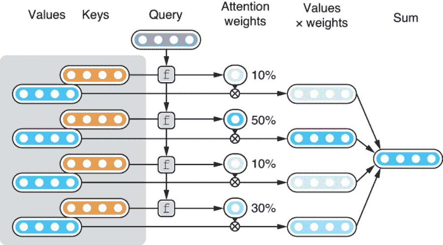

图 8.2 使用注意力机制对输入进行总结

由于第 3 步，注意力机制的输出始终是输入向量的加权和，但它们如何加权是由注意力权重确定的，而注意力权重又是从键和查询计算得出的。换句话说，注意力机制计算的是 *上下文（查询）相关的输入摘要*。神经网络的下游组件（例如基于 RNN 的 Seq2Seq 模型的解码器，或者 Transformer 模型的上层）使用此摘要进一步处理输入。

在接下来的几节中，我们将学习 NLP 中两种最常用的注意力机制类型 —— 编码器-解码器注意力（也称为 *交叉注意力*；在基于 RNN 的 Seq2Seq 模型和 Transformer 中都使用）和自注意力（在 Transformer 中使用）。

## 8.2 带有注意力的序列到序列

在本节中，我们将学习如何将注意力机制应用于 RNN 基础的 Seq2Seq 模型，注意力机制是首次发明的。我们将研究它如何与具体示例一起工作，然后我们将使用 fairseq 实验带有和不带有注意力机制的 Seq2Seq 模型，以观察它对翻译质量的影响。

### 8.2.1 编码器-解码器注意力

正如我们之前所看到的，注意力是在特定上下文下创建输入摘要的机制。我们使用了一个键值存储和一个查询作为它如何工作的类比。让我们看看注意力机制如何在基于 RNN 的 Seq2Seq 模型中使用，使用随后的具体示例。

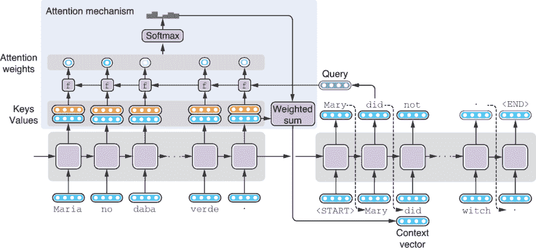

图 8.3 在基于 RNN 的 Seq2Seq 模型中添加注意力机制（浅色阴影框）

图 8.3 展示了一个带有注意力机制的 Seq2Seq 模型。一开始看起来很复杂，但实际上它只是一个基于 RNN 的 Seq2Seq 模型，在编码器顶部左上角的浅色阴影框中添加了一些额外的“东西”。如果你忽略里面的内容，将其视为黑匣子，它所做的就是简单地接受一个查询并从输入中返回某种摘要。它计算这个摘要的方式只是我们在 8.1.2 节中介绍的通用注意力形式的一个变体。它的执行步骤如下：

1.  注意力机制的输入是编码器计算的隐藏状态列表。这些隐藏状态既用作键也用作值（即，键和值是相同的）。某个令牌（例如，“no”令牌）的编码器隐藏状态反映了关于该令牌及其之前所有令牌的信息（如果 RNN 是单向的），或整个句子（如果 RNN 是双向的）。

1.  假设你已经解码到“Mary did.”。此时解码器的隐藏状态被用作查询，与每个键使用函数 f 进行比较。这会产生一个注意力分数列表，每个键值对应一个分数。这些分数确定了解码器在尝试生成跟在“Mary did.”后面的单词时应该关注输入的哪个部分。

1.  这些分数被转换为概率分布（一组正值，总和为 1），用于确定哪些向量应该得到最多的关注。这个注意力机制的返回值是所有值的加权和，加权值为注意力分数经过 softmax 归一化后的值。

你可能想知道注意力函数 f 是什么样的。f 的几个变体是可能的，这取决于它如何计算键和查询之间的注意力分数，但这些细节在这里并不重要。值得注意的一点是，在提出注意力机制的原始论文中，作者使用了一个“迷你”神经网络来计算键和查询之间的注意力分数。

这个基于“迷你”网络的注意力函数不是你只需事后将其插入到 RNN 模型中就能让其正常工作的东西。它是作为整个网络的一部分进行优化的—也就是说，当整个网络通过最小化损失函数进行优化时，注意力机制也会变得更好，因为这样做也有助于解码器生成更好的翻译并降低损失函数。换句话说，整个网络，包括注意力机制，都是端到端训练的。这通常意味着，随着网络的优化，注意力机制开始学习只关注输入的相关部分，这通常是目标标记与源标记对齐的地方。换句话说，注意力计算了源标记和目标标记之间某种“软”单词对齐。

### 8.2.2 使用注意力构建 Seq2Seq 机器翻译

在第 6.3 节中，我们使用由 Facebook 开发的 NMT 工具包 fairseq 构建了我们的第一个机器翻译（MT）系统。 使用来自 Tatoeba 的平行数据集，我们构建了一个基于 LSTM 的 Seq2Seq 模型，将西班牙语句子翻译成英语。

在本节中，我们将尝试使用 Seq2Seq 机器翻译系统，并看看注意力如何影响翻译质量。 我们假设您已经按照我们构建 MT 系统的步骤操作，通过下载数据集并运行 fairseq-preprocess 和 fairseq-train 命令（第 6.3 节）。 之后，您运行了 fairseq-interactive 命令以将西班牙语句子交互式地翻译成英语。 您可能已经注意到，从这个仅花了您 30 分钟构建的 MT 系统得到的翻译实际上相当不错。 实际上，我们使用的模型架构（—arch lstm）默认内置了注意力机制。 请注意，当您运行以下 fairseq-train 命令时

```py
fairseq-train \
    data/mt-bin \
    --arch lstm \
    --share-decoder-input-output-embed \
    --optimizer adam \
    --lr 1.0e-3 \
    --max-tokens 4096 \
    --save-dir data/mt-ckpt
```

您应该已经在终端中看到了您的模型的输出，如下所示：

```py
...
LSTMModel(
  (encoder): LSTMEncoder(
    (embed_tokens): Embedding(16832, 512, padding_idx=1)
    (lstm): LSTM(512, 512)
  )
  (decoder): LSTMDecoder(
    (embed_tokens): Embedding(11416, 512, padding_idx=1)
    (layers): ModuleList(
      (0): LSTMCell(1024, 512)
    )
 (attention): AttentionLayer(
 (input_proj): Linear(in_features=512, out_features=512, bias=False)
 (output_proj): Linear(in_features=1024, out_features=512, bias=False)
 )
  )
)
...
```

这告诉您，您的模型有一个编码器和一个解码器，但解码器还有一个称为注意力的组件（类型为 AttentionLayer），如代码片段中的粗体所示。 这正是我们在第 8.2.1 节中讨论过的“小型网络”。

现在让我们训练相同的模型，但是不使用注意力机制。您可以在 fairseq-train 中添加—decoder-attention 0 来禁用注意力机制，同时保持其他所有内容不变，如下所示：

```py
$ fairseq-train \
      data/mt-bin \
      --arch lstm \
      --decoder-attention 0 \
      --share-decoder-input-output-embed \
      --optimizer adam \
      --lr 1.0e-3 \
      --max-tokens 4096 \
      --save-dir data/mt-ckpt-no-attn
```

当您运行此命令时，您将看到类似的输出，接下来显示了模型的架构，但没有注意力机制：

```py
LSTMModel(
  (encoder): LSTMEncoder(
    (embed_tokens): Embedding(16832, 512, padding_idx=1)
    (lstm): LSTM(512, 512)
  )
  (decoder): LSTMDecoder(
    (embed_tokens): Embedding(11416, 512, padding_idx=1)
    (layers): ModuleList(
      (0): LSTMCell(1024, 512)
    )
  )
)
```

正如我们在第 6.3.2 节中看到的，训练过程在训练和验证之间交替进行。 在训练阶段，神经网络的参数通过优化器进行优化。 在验证阶段，这些参数被固定，并且模型在称为*验证集*的数据集的一个保留部分上运行。 除了确保训练损失下降外，您还应该在训练过程中查看验证损失，因为它更好地表示了模型在训练数据之外的泛化能力。

在这个实验中，您应该观察到由注意力模型实现的最低验证损失约为 1.727，而无注意力模型的最低验证损失约为 2.243。 较低的损失值意味着模型更好地适应了数据集，因此这表明注意力有助于改善翻译。 让我们看看这是否属实。 正如我们在第 6.3.2 节中所做的，您可以通过运行以下 fairseq-interactive 命令来交互地生成翻译：

```py
$ fairseq-interactive \
    data/mt-bin \
    --path data/mt-ckpt/checkpoint_best.pt \
    --beam 5 \
    --source-lang es \
    --target-lang en
```

在表 8.1 中，我们比较了带有和不带有注意力的模型生成的翻译。基于注意力的模型得到的翻译与我们在第 6.3.3 节中看到的一样。请注意，基于没有注意力的模型得到的翻译比具有注意力的模型要糟糕得多。如果您看一下“¿Hay habitaciones libres？”和“Maria no daba una bofetada a la bruja verde”的翻译，您会看到其中的陌生令牌“<unk>”（表示“未知”）。这里发生了什么？

表 8.1 模型带有和不带有注意力的翻译比较

| **西班牙语（输入）** | **带有注意力** | **没有注意力** |
| --- | --- | --- |
| ¡Buenos días! | 早上好！ | Good morning! |
| ¡Hola! | 你好！ | Hi! |
| ¿Dónde está el baño? | 厕所在哪里？ | Where’s the toilet? |
| ¿Hay habitaciones libres? | 有空房间吗？ | Are there <unk> rooms? |
| ¿Acepta tarjeta de crédito? | 你们接受信用卡吗？ | Do you accept credit card? |
| La cuenta, por favor. | 请结账。 | Check, please. |
| Maria no daba una bofetada a la bruja verde. | Maria 没有打绿色女巫。 | Mary wasn’t a <unk> of the pants. |

这些是分配给词汇表之外（OOV）词汇的特殊令牌。我们在第 3.6.1 节中提及了 OOV 词汇（当我们介绍用于 FastText 的子词概念时）。大多数自然语言处理应用都在一个固定的词汇表中操作，每当它们遇到或尝试生成超出预定义集合的词汇时，这些词汇都会被替换为一个特殊的令牌 `<unk>`。这类似于当方法不知道如何处理输入时返回的特殊值（例如 Python 中的 None）。因为这些句子包含某些词汇（我怀疑它们是“libres”和“bofetada”），没有注意力的 Seq2Seq 模型，其内存是有限的，不知道该如何处理它们，简单地回归到最安全的操作，即生成一个通用的、捕获所有的符号 `<unk>`。另一方面，您可以看到注意力防止系统生成这些符号，并有助于提高生成的翻译的整体质量。

## 8.3 Transformer 和自注意力

在这一节中，我们将学习 Transformer 模型的工作原理，具体来说，是它如何利用一种称为*自注意力*的新机制生成高质量的翻译。自注意力机制使用每个令牌作为上下文，为每个令牌创建了整个输入的摘要。

### 8.3.1 自注意力

正如我们之前看到的，注意力是一种创建输入的上下文相关摘要的机制。对于基于 RNN 的 Seq2Seq 模型，输入是编码器隐藏状态，而上下文是解码器隐藏状态。Transformer 的核心思想，自注意力，也创建了输入的摘要，除了一个关键的区别——创建摘要的上下文也是输入本身。请参见图 8.4，了解自注意力机制的简化示例。

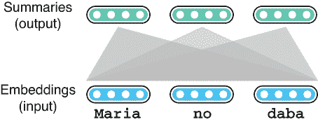

图 8.4 自注意力将输入转化为摘要。

为什么这很好？为什么它有效？正如我们在第四章中讨论的那样，RNN 也可以通过循环遍历输入标记并更新内部变量（隐藏状态）来创建输入的摘要。这是有效的-我们之前看到当 RNN 与注意力结合时可以生成良好的翻译，但是它们有一个关键问题：因为 RNN 按顺序处理输入，随着句子变得越来越长，处理标记之间的远程依赖关系变得越来越困难。

让我们看一个具体的例子。如果输入句子是“The Law will never be perfect, but its application should be just”，了解代词“its”指的是什么（“The Law”）对于理解句子的含义以及任何后续任务（如准确翻译句子）都很重要。然而，如果您使用 RNN 来编码这个句子，要学习这个代词的共指关系，RNN 需要先学习在隐藏状态中记住名词“The Law”，然后等待循环遇到目标代词（“its”），同时学会忽略之间的所有无关内容。对于神经网络来说，这听起来像是一种复杂的技巧。

但事情不应该那么复杂。像“its”这样的单数所有格代词通常指的是它们前面最近的单数名词，而与它们之间的词无关，因此简单的规则“用最近出现的名词替换它”就足够了。换句话说，在这种情况下，“随机访问”比“顺序访问”更适合。自注意力更擅长学习这种远程依赖关系，稍后我们将会看到。

让我们通过一个例子来了解自注意力是如何工作的。假设我们要将西班牙语翻译成英语，并且想要编码输入句子中的前几个单词“Maria no daba”。我们还将关注一个特定的标记“no”，以及如何从整个输入计算其嵌入。第一步是将目标标记与输入中的所有标记进行比较。自注意力通过使用投影 W[Q]将目标转换为查询，使用投影 W[K]将所有标记转换为键，并使用函数 f 计算注意力权重来完成这一步骤。由 f 计算得到的注意力权重通过 softmax 函数进行归一化和转换为概率分布。图 8.5 说明了这些步骤，注意力权重如何计算。与我们在 8.2.1 节中涵盖的编码器-解码器注意力机制一样，注意力权重决定了我们从输入标记中获得的值如何“混合”。对于像“its”这样的词，我们希望相关词的权重会更高，比如之前的例子中的“Law”。

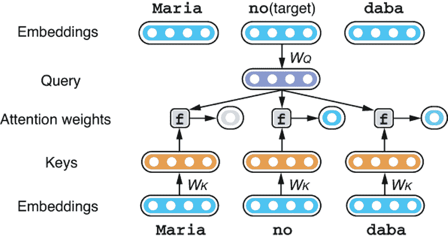

图 8.5 从键和查询计算注意力权重

在下一步中，将每个输入令牌对应的向量通过投影 W[V] 转换为值向量。每个投影值都由相应的注意权重加权，并加总以生成摘要向量。请参见图 8.6 进行说明。

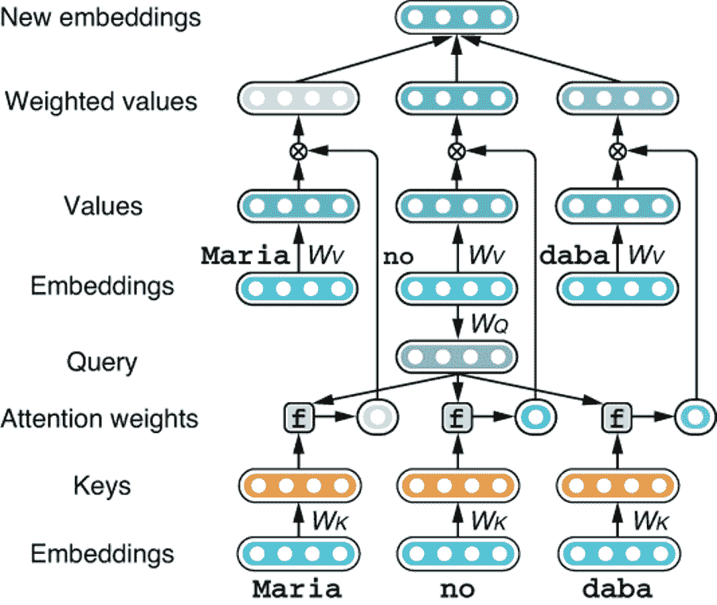

图 8.6 计算所有值的加权和

如果这是“常规”的编码器-解码器注意机制，那就是这样了。在解码期间，每个令牌只需要一个摘要向量。然而，编码器-解码器注意力和自注意力之间的一个关键区别是后者会针对输入中的每个令牌重复此过程。如图 8.7 所示，这会为输入产生一组新的嵌入，每个令牌一个。

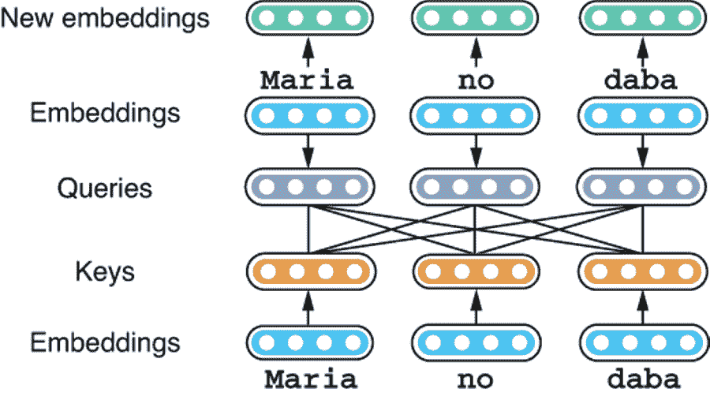

图 8.7 为整个输入序列生成摘要（细节被省略）

自注意力产生的每个摘要都考虑了输入序列中的所有令牌，但权重不同。因此，对于诸如“its”之类的词，它可以融入一些来自相关词语的信息，例如“法律”，无论这两个词有多远。使用类比，自注意力通过对输入进行随机访问产生摘要。这与 RNN 形成对比，后者只允许对输入进行顺序访问，并且这也是 Transformer 之所以是编码和解码自然语言文本的强大模型之一的关键原因之一。

我们需要解释自注意力的最后一个细节才能完全理解它。现在，前面介绍的自注意机制只能使用输入序列的一个方面来生成摘要。例如，如果您希望自注意力学习每个代词指代哪个单词，它可以做到这一点——但您也可能希望根据其他一些语言学方面“混合”其他单词的信息。例如，您可能希望参考代词修改的其他单词（在这种情况下是“应用”）。解决方案是为每个令牌计算多组密钥、值和查询，并计算多组注意权重以“混合”关注不同输入方面的值。最终的嵌入是以这种方式生成的摘要的组合。这种机制被称为*多头自注意力*（图 8.8）。

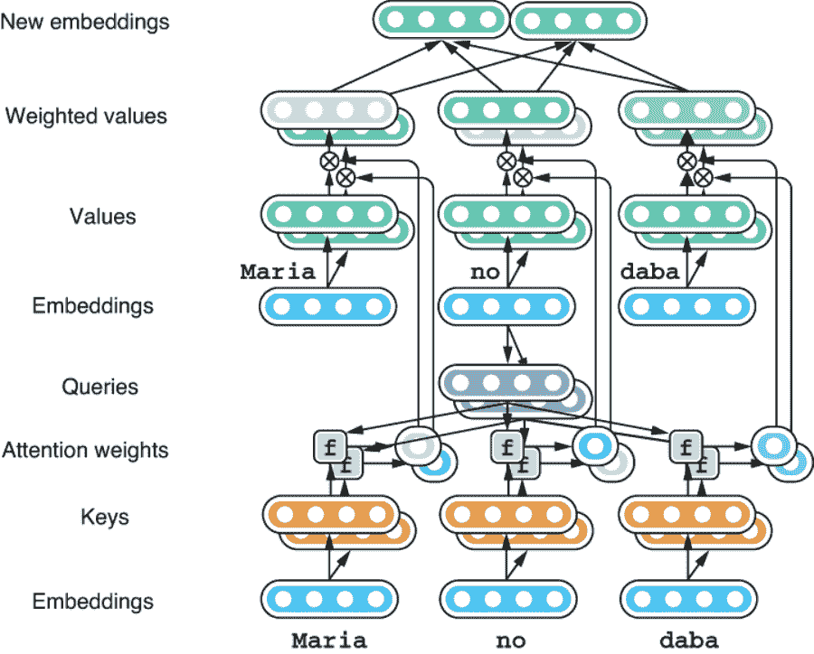

图 8.8 多头自注意力生成具有多个密钥、值和查询的摘要。

如果你想要完全理解 Transformer 层的工作原理，你需要学习一些额外的细节，但本节已经涵盖了最重要的概念。如果你对更多细节感兴趣，请查看*《图解 Transformer》*（[`jalammar.github.io/illustrated-transformer/`](http://jalammar.github.io/illustrated-transformer/)），这是一个写得很好的指南，用易于理解的插图解释了 Transformer 模型。此外，如果你有兴趣用 Python 从零开始实现 Transformer 模型，请查看*《注释版 Transformer》*（[`nlp.seas.harvard.edu/2018/04/03/attention.html`](http://nlp.seas.harvard.edu/2018/04/03/attention.html)）。

### 8.3.2 Transformer

Transformer 模型不仅仅使用单步自注意力来编码或解码自然语言文本。它重复应用自注意力到输入中，逐渐转换它们。与多层 RNN 一样，Transformer 还将一系列转换操作分组到一个层中，并重复应用它。图 8.9 显示了 Transformer 编码器的一个层。

每个层内都有很多操作，我们的目标不是解释每一个细节——你只需要理解多头自注意力是其核心，后跟通过前馈神经网络的转换（图 8.9 中的“FF”）。引入了残差连接和归一化层，以使模型更容易训练，尽管这些操作的细节超出了本书的范围。Transformer 模型反复应用这个层，将输入从文字的形式（原始词嵌入）转换为更抽象的东西（句子的“含义”）。在原始的 Transformer 论文中，Vaswani 等人用了六层进行机器翻译，尽管如今更大的模型通常使用 10-20 层。

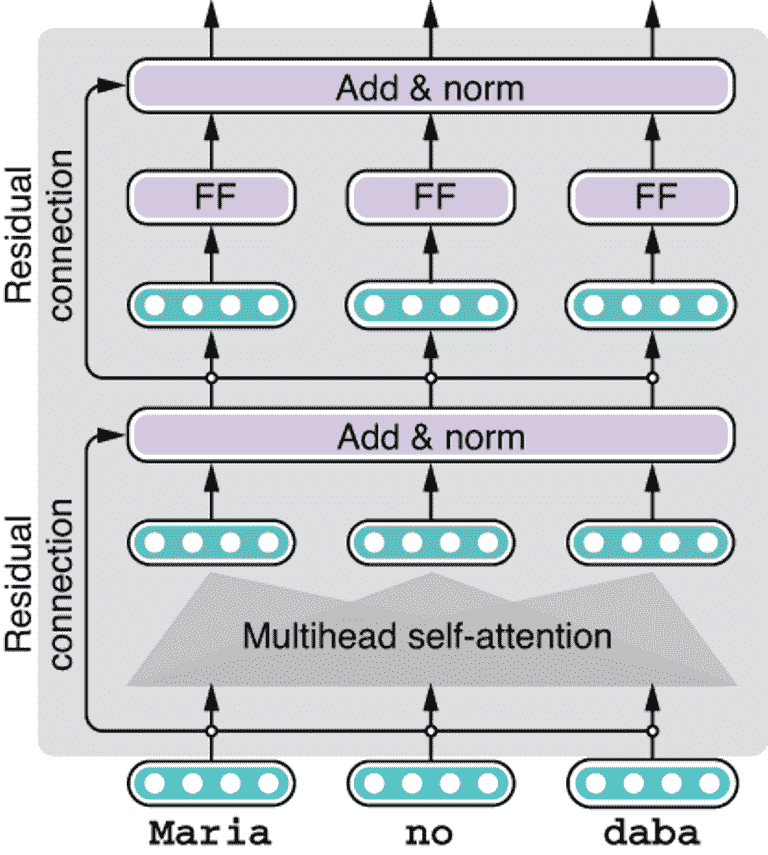

图 8.9 一个具有自注意力和前馈层的 Transformer 编码器层

到这一步，你可能已经注意到自注意力操作完全独立于位置。换句话说，即使我们颠倒“Maria”和“daba”之间的单词顺序，自注意力的嵌入结果也完全相同，因为该操作只关注单词本身和来自其他单词的聚合嵌入，而不考虑它们的位置。这显然非常限制——自然语言句子的意义很大程度上取决于单词的顺序。那么，Transformer 如何编码单词顺序呢？

Transformer 模型通过生成一些人工嵌入来解决这个问题，这些嵌入在位置之间不同，并在将它们馈送到层之前添加到词嵌入中。这些嵌入被称为*位置编码*，*如图 8.10 所示*，可以由某些数学函数（如正弦曲线）生成，或者在训练过程中根据位置学习。这样，Transformer 可以区分第一个位置的“Maria”和第三个位置的“Maria”，因为它们具有不同的位置编码。

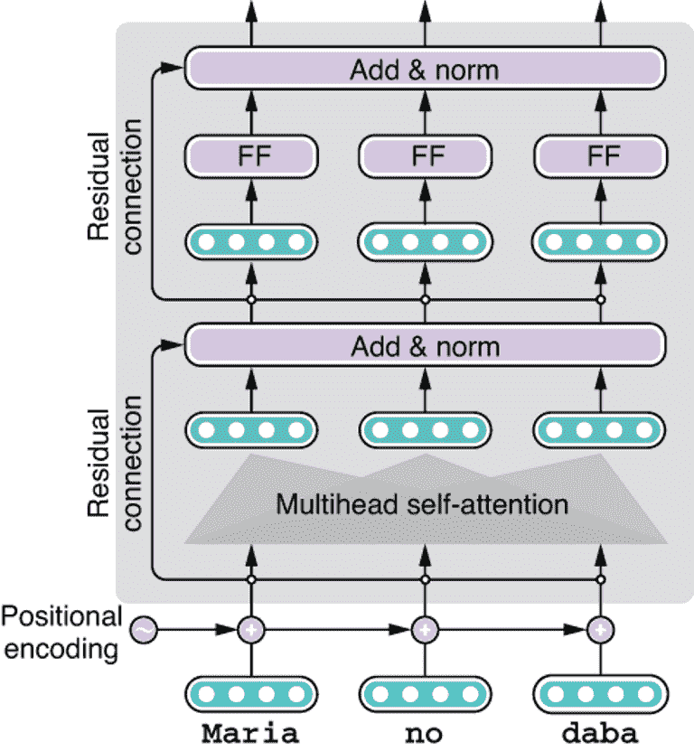

图 8.10 将位置编码添加到输入中以表示词序

图 8.11 显示了 Transformer 解码器。虽然很多事情正在进行，但一定要注意两个重要的事情。首先，你会注意到一个额外的机制，称为交叉注意力，插入在自注意力和前馈网络之间。这个交叉注意力机制类似于我们在第 8.2 节介绍的编码器-解码器注意力机制。它的工作方式与自注意力完全相同，唯一的区别是注意力的值来自编码器，而不是解码器，总结了从编码器提取的信息。

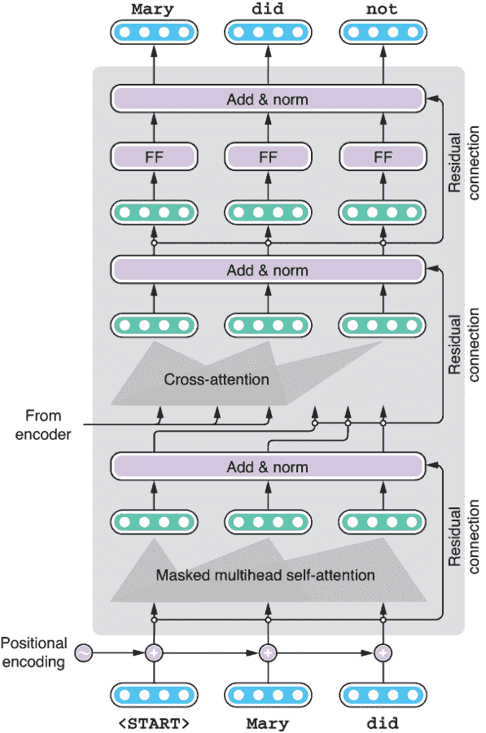

图 8.11 Transformer 解码器层，具有自注意力和交叉注意力

最后，Transformer 模型以与我们之前在第 6.4 节学习的基于 RNN 的 Seq2Seq 模型完全相同的方式生成目标句子。解码器由特殊标记<START>初始化，并生成可能的下一个标记的概率分布。从这里，你可以选择具有最大概率的标记（贪婪解码，如第 6.4.3 节所示），或者在寻找最大化总分数的路径时保留一些具有最高概率的标记（波束搜索，如第 6.4.4 节所示）。事实上，如果你把 Transformer 解码器看作一个黑匣子，它生成目标序列的方式与 RNN 完全相同，你可以使用相同的一组解码算法。换句话说，第 6.4 节介绍的解码算法是一种通用的算法，不受底层解码器架构的影响。

### 8.3.3 实验

现在我们知道了 Transformer 模型的工作原理，让我们用它构建一个机器翻译系统。好消息是，序列到序列工具包 Fairseq 已经支持基于 Transformer 的模型（以及其他强大的模型），可以在训练模型时通过`--arch transformer`选项指定。假设你已经预处理了我们用于构建西班牙语到英语机器翻译的数据集，你只需要调整给予`fairseq-train`的参数，如下所示：

```py
fairseq-train \
  data/mt-bin \
  --arch transformer \
  --share-decoder-input-output-embed \
  --optimizer adam --adam-betas '(0.9, 0.98)' --clip-norm 0.0 \
  --lr 5e-4 --lr-scheduler inverse_sqrt --warmup-updates 4000 \
  --dropout 0.3 --weight-decay 0.0 \
  --criterion label_smoothed_cross_entropy --label-smoothing 0.1 \
  --max-tokens 4096 \
  --save-dir data/mt-ckpt-transformer
```

注意，这甚至可能在你的笔记本电脑上都无法运行。你真的需要 GPU 来训练 Transformer 模型。还要注意，即使有 GPU，训练也可能需要几个小时。更多关于使用 GPU 的信息请参见第 11.5 节。

这里出现了一些神秘的参数，但您不需要担心。当您运行此命令时，您可以看到模型结构。整个模型转储相当长，因此我们在清单 8.1 中省略了一些中间层。仔细观察，您会发现层次结构与我们之前显示的图形相对应。

清单 8.1 Fairseq 的 Transformer 模型转储

```py
TransformerModel(
  (encoder): TransformerEncoder(
    (embed_tokens): Embedding(16832, 512, padding_idx=1)
    (embed_positions): SinusoidalPositionalEmbedding()
    (layers): ModuleList(
      (0): TransformerEncoderLayer(
        (self_attn): MultiheadAttention(                                   ❶
          (out_proj): Linear(in_features=512, out_features=512, bias=True)
        )
        (self_attn_layer_norm): LayerNorm((512,), eps=1e-05, elementwise_
         affine=True)
        (fc1): Linear(in_features=512, out_features=2048, bias=True)       ❷
        (fc2): Linear(in_features=2048, out_features=512, bias=True)
        (final_layer_norm): LayerNorm((512,), eps=1e-05, elementwise_affine=True)
      )
      ...
      (5): TransformerEncoderLayer(
        (self_attn): MultiheadAttention(
          (out_proj): Linear(in_features=512, out_features=512, bias=True)
        )
        (self_attn_layer_norm): LayerNorm((512,), eps=1e-05, elementwise_affine=True)
        (fc1): Linear(in_features=512, out_features=2048, bias=True)
        (fc2): Linear(in_features=2048, out_features=512, bias=True)
        (final_layer_norm): LayerNorm((512,), eps=1e-05, elementwise_affine=True)
      )
    )
  )
  (decoder): TransformerDecoder(
    (embed_tokens): Embedding(11416, 512, padding_idx=1)
    (embed_positions): SinusoidalPositionalEmbedding()
    (layers): ModuleList(
      (0): TransformerDecoderLayer(
        (self_attn): MultiheadAttention(                                   ❸
          (out_proj): Linear(in_features=512, out_features=512, bias=True)
        )
        (self_attn_layer_norm): LayerNorm((512,), eps=1e-05, elementwise_affine=True)
        (encoder_attn): MultiheadAttention(                                ❹
          (out_proj): Linear(in_features=512, out_features=512, bias=True)
        )
        (encoder_attn_layer_norm): LayerNorm((512,), eps=1e-05, elementwise_
         affine=True)
        (fc1): Linear(in_features=512, out_features=2048, bias=True)       ❺
        (fc2): Linear(in_features=2048, out_features=512, bias=True)
        (final_layer_norm): LayerNorm((512,), eps=1e-05, elementwise_affine=True)
      )
      ...
      (5): TransformerDecoderLayer(
        (self_attn): MultiheadAttention(
          (out_proj): Linear(in_features=512, out_features=512, bias=True)
        )
        (self_attn_layer_norm): LayerNorm((512,), eps=1e-05, elementwise_affine=True)
        (encoder_attn): MultiheadAttention(
          (out_proj): Linear(in_features=512, out_features=512, bias=True)
        )
        (encoder_attn_layer_norm): LayerNorm((512,), eps=1e-05, elementwise_
         affine=True)
        (fc1): Linear(in_features=512, out_features=2048, bias=True)
        (fc2): Linear(in_features=2048, out_features=512, bias=True)
        (final_layer_norm): LayerNorm((512,), eps=1e-05, elementwise_affine=True)
      )
    )
  )
)
```

❶ 编码器的自注意力

❷ 编码器的前馈网络

❸ 解码器的自注意力

❹ 解码器的编码器-解码器

❺ 解码器的前馈网络

当我运行时，验证损失在大约第 30 个时期后收敛，此时您可以停止训练。我将同一组西班牙语句子翻译成英文的结果如下：

```py
¡ Buenos días !
S-0     ¡ Buenos días !
H-0     -0.0753164291381836     Good morning !
P-0     -0.0532 -0.0063 -0.1782 -0.0635
¡ Hola !
S-1     ¡ Hola !
H-1     -0.17134985327720642    Hi !
P-1     -0.2101 -0.2405 -0.0635
¿ Dónde está el baño ?
S-2     ¿ Dónde está el baño ?
H-2     -0.2670585513114929     Where &apos;s the toilet ?
P-2     -0.0163 -0.4116 -0.0853 -0.9763 -0.0530 -0.0598
¿ Hay habitaciones libres ?
S-3     ¿ Hay habitaciones libres ?
H-3     -0.26301929354667664    Are there any rooms available ?
P-3     -0.1617 -0.0503 -0.2078 -1.2516 -0.0567 -0.0532 -0.0598
¿ Acepta tarjeta de crédito ?
S-4     ¿ Acepta tarjeta de crédito ?
H-4     -0.06886537373065948    Do you accept credit card ?
P-4     -0.0140 -0.0560 -0.0107 -0.0224 -0.2592 -0.0606 -0.0594
La cuenta , por favor .
S-5     La cuenta , por favor .
H-5     -0.08584468066692352    The bill , please .
P-5     -0.2542 -0.0057 -0.1013 -0.0335 -0.0617 -0.0587
Maria no daba una bofetada a la bruja verde .
S-6     Maria no daba una bofetada a la bruja verde .
H-6     -0.3688890039920807     Mary didn &apos;t slapped the green witch .
P-6     -0.2005 -0.5588 -0.0487 -2.0105 -0.2672 -0.0139 -0.0099 -0.1503 -0.0602
```

大多数英文翻译几乎完美。令人惊讶的是，模型几乎完美地翻译了最困难的句子（“Maria no daba . . .”）。这可能足以说服我们，Transformer 是一个强大的翻译模型。在它的出现之后，这个模型成为了研究和商业机器翻译的事实标准。

## 8.4 基于 Transformer 的语言模型

在第 5.5 节中，我们介绍了语言模型，这是一种给文本赋予概率的统计模型。通过将文本分解为令牌序列，语言模型可以估计给定文本的“概率”。在第 5.6 节中，我们演示了通过利用这一特性，语言模型也可以用于“凭空”生成新的文本！

Transformer 是一个强大的模型，在 Seq2Seq 任务（如机器翻译）中取得了令人印象深刻的结果，尽管它的架构也可以用于语言建模和生成。在本节中，我们将学习如何使用 Transformer 进行语言建模和生成真实文本。

### 8.4.1 Transformer 作为语言模型

在第 5.6 节中，我们建立了基于字符 LSTM-RNN 的语言生成模型。简而言之，给定一个前缀（到目前为止生成的部分句子），模型使用基于 LSTM 的 RNN（一个带有循环的神经网络）来生成可能的下一个令牌的概率分布，如图 8.12 所示。


图 8.12 使用 RNN 生成文本

我们早些时候指出，通过将 Transformer 解码器视为黑匣子，您可以使用与我们之前介绍的 RNN 相同的一组解码算法（贪婪、束搜索等）。对于语言生成也是如此——通过将神经网络视为在给定前缀的情况下产生某种分数的黑匣子，您可以使用相同的逻辑生成文本，而不管底层模型如何。图 8.13 显示了类似 Transformer 的架构如何用于语言生成。除了一些细微差别（如缺乏交叉注意力）之外，结构几乎与 Transformer 解码器相同。

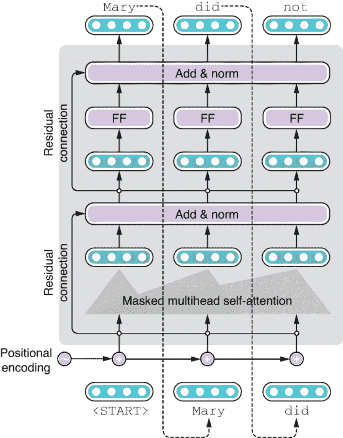

图 8.13 使用 Transformer 进行语言生成

以下片段显示了使用 Transformer 模型生成文本的类似 Python 的伪代码。在这里，model() 是主要的函数，模型计算发生在这里——它接受标记，将它们转换为嵌入，添加位置编码，并将它们传递到所有的 Transformer 层，将最终的隐藏状态返回给调用者。调用者然后将它们通过线性层传递，将它们转换为 logits，然后通过 softmax 转换为概率分布：

```py
def generate():
    token = <START>
    tokens = [<START>]
    while token != <END>:
        hidden = model(tokens)
        probs = softmax(linear(hidden))
        token = sample(probs)
        tokens.append(token)
    return tokens
```

实际上，Seq2Seq 模型的解码和语言模型的语言生成是非常相似的任务，输出序列是逐标记生成的，将自身反馈给网络，就像前面的代码片段所示。唯一的区别在于，前者有某种形式的输入（源句子），而后者没有（模型自我反馈）。这两个任务也分别称为*无条件生成*和*有条件生成*。图 8.14 描绘了这三个组件（网络、任务和解码）以及它们如何结合起来解决特定问题。

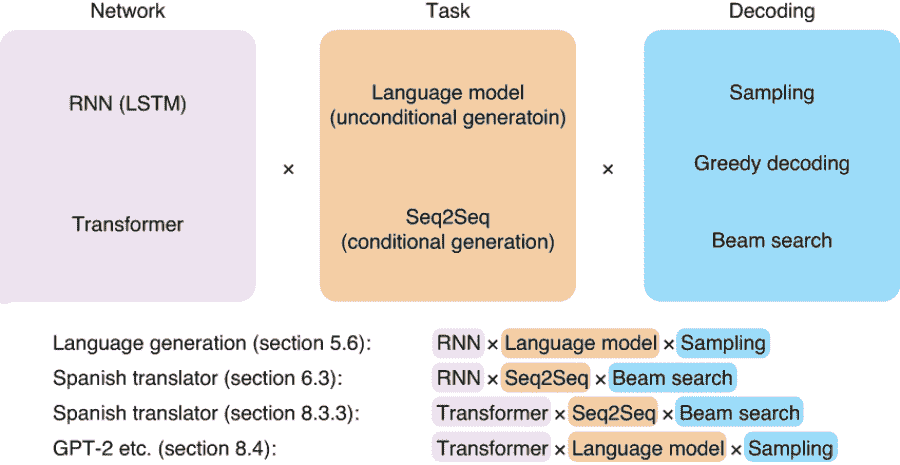

图 8.14 语言生成和 Seq2Seq 任务的三个组件

在本节的其余部分，我们将尝试使用一些基于 Transformer 的语言模型，并使用它们生成自然语言文本。我们将使用由 Hugging Face 开发的 transformers 库（[`huggingface.co/transformers/`](https://huggingface.co/transformers/)），这个库在过去几年已经成为了 NLP 研究人员和工程师使用 Transformer 模型的标准库。它提供了一些最先进的模型实现，包括 GPT-2（本节）和 BERT（下一章），以及预训练模型参数，您可以立即加载和使用。它还提供了一个简单、一致的接口，通过这个接口您可以与强大的 NLP 模型进行交互。

### 8.4.2 Transformer-XL

在许多情况下，您希望加载并使用由第三方提供的预训练模型（通常是模型的开发者），而不是从头开始训练它们。最近的 Transformer 模型相当复杂（通常具有数亿个参数），并且使用大量的数据集进行训练（数十吉字节的文本）。这将需要只有大型机构和科技巨头才能承受得起的 GPU 资源。甚至有些模型在训练时需要数天的时间，即使有十几个 GPU！好消息是，这些庞大的 Transformer 模型的实现和预训练模型参数通常由它们的创建者公开提供，以便任何人都可以将它们集成到他们的 NLP 应用程序中。

在这一部分中，我们首先将介绍 Transformer-XL，这是由 Google Brain 的研究人员开发的 Transformer 的一个变种。由于原始的 Transformer 模型中没有固有的“循环”，不像 RNNs，所以原始的 Transformer 不擅长处理超长的上下文。在用 Transformer 训练语言模型时，你首先将长文本分割成较短的块，比如 512 个单词，并将它们分别馈送到模型中。这意味着模型无法捕获超过 512 个单词的依赖关系。Transformer-XL⁴通过对原始 Transformer 模型进行一些改进来解决这个问题（“XL”表示额外长）。尽管这些改变的细节超出了本书的范围，在简单地说，该模型重复使用前一个段落的隐藏状态，有效地创建了一个在不同文本段之间传递信息的循环。它还改进了我们之前提到的位置编码方案，使得模型更容易处理更长的文本。

您只需在命令行中运行 pip install transformers 即可安装 transformers 库。您将与主要抽象进行交互的是分词器和模型。分词器将原始字符串拆分为一系列标记，而模型定义了架构并实现了主要逻辑。模型和预训练权重通常取决于特定的标记化方案，因此您需要确保您使用的分词器与模型兼容。

初始化一个分词器和一个模型，并使用一些指定的预训练权重的最简单方法是使用 AutoTokenizer 和 AutoModelWithLMHead 类，并调用它们的 from_pretrained()方法如下所示：

```py
import torch
from transformers import AutoModelWithLMHead, AutoTokenizer

tokenizer = AutoTokenizer.from_pretrained('transfo-xl-wt103')
model = AutoModelWithLMHead.from_pretrained('transfo-xl-wt103')
```

from_pre-trained()函数的参数是模型/预训练权重的名称。这是一个在名为 wt103（WikiText103）的数据集上训练的 Transformer-XL 模型。

您可能想知道 AutoModelWithLMHead 中的“LMHead”部分是什么意思。LM（语言模型）头是添加到神经网络中的特定层，它将其隐藏状态转换为一组分数，这些分数确定要生成的下一个标记。然后，这些分数（也称为 logits）被馈送到 softmax 层以获得可能的下一个标记的概率分布（图 8.15）。我们希望一个带有 LM 头的模型，因为我们有兴趣通过将 Transformer 作为语言模型来生成文本。但是，根据任务的不同，您可能还想要一个没有 LM 头的 Transformer 模型，并且只想使用其隐藏状态。这将是我们在下一章中要做的事情。

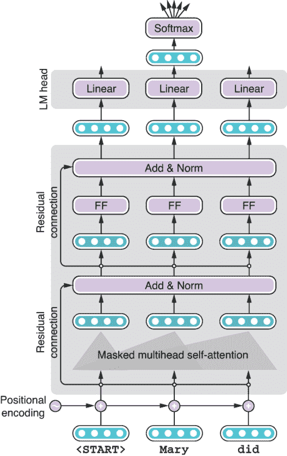

图 8.15 使用 Transformer 的语言模型头

下一步是初始化前缀，用于让语言模型生成故事的其余部分。可以使用 tokenizer.encode() 方法将字符串转换为标记 ID 列表，然后将其转换为张量。我们还将初始化变量 past，用于缓存内部状态并加速推理过程，如下所示：

```py
generated = tokenizer.encode("On our way to the beach")
context = torch.tensor([generated])
past = None
```

现在，您已准备好生成文本的其余部分了。请注意，下面的代码与我们之前显示的伪代码相似。思路很简单：从模型获取输出，使用输出随机采样一个标记，并将其输入模型。反复这个过程。

```py
for i in range(100):
    output = model(context, mems=past)
    token = sample_token(output.prediction_scores)

    generated.append(token.item())
    context = token.view(1, -1)
    past = output.mems
```

需要进行一些清理工作，以使张量的形状与模型兼容，我们暂时可以忽略此步骤。此处的 sample_token() 方法将模型的输出转换为概率分布，并从中随机采样一个标记。我没有显示该方法的完整代码，但您可以查看 Google Colab 笔记本（[`realworldnlpbook.com/ch8.html#xformer-nb`](http://realworldnlpbook.com/ch8.html#xformer-nb)）了解更多细节。此外，虽然我们在此处从零编写了生成算法，但如果您需要更全面的生成方式（如波束搜索），请查看该库开发者的官方示例脚本：[`mng.bz/wQ6q`](http://mng.bz/wQ6q)。

在生成完成后，您可以通过调用 tokenizer.decode() 将标记 ID 转换为原始字符串，如下所示：

```py
print(tokenizer.decode(generated))
```

运行后我得到了以下“故事”：

```py
On our way to the beach, she finds, she finds the men who are in the group to be " in the group ". This has led to the perception that the " group " in the group is " a group of people in the group with whom we share a deep friendship, and which is a common cause to the contrary. " <eos> <eos> = = Background = = <eos> <eos> The origins of the concept of " group " were in early colonial years with the English Civil War. The term was coined by English abolitionist John
```

这不是一个坏的开始。我喜欢这个故事试图通过坚持“群体”概念来保持一致性的方式。然而，由于该模型仅训练于维基百科文本，其生成的结果并不真实，看起来有点过于正式。

### 8.4.3 GPT-2

GPT-2（代表生成预训练）是由 OpenAI 开发的迄今为止最著名的语言模型。你可能听说过关于一种语言模型生成如此真实无缝的自然语言文本，以至于你无法分辨其与人类写作的文本。从技术上讲，GPT-2 只是一个庞大的 Transformer 模型，就像我们之前介绍的那个一样。主要区别在于其规模（最大模型有 48 层！）以及该模型是通过从网络上收集到的大量自然语言文本进行训练的。OpenAI 团队公开发布了实现和预训练权重，因此我们可以轻松尝试这个模型。

初始化标记器和 GPT-2 模型，方法与 Transformer-XL 相同，如下所示：

```py
tokenizer = AutoTokenizer.from_pretrained('gpt2-large')
model = AutoModelWithLMHead.from_pretrained('gpt2-large')
```

然后使用以下代码片段生成文本：

```py
generated = tokenizer.encode("On our way to the beach")
context = torch.tensor([generated])
past = None

for i in range(100):
    output = model(context, past_key_values=past)
    token = sample_token(output.logits)

    generated.append(token.item())
    context = token.unsqueeze(0)
    past = output.past_key_values

print(tokenizer.decode(generated))
```

你可能已经注意到这段代码与 Transformer-XL 的代码几乎没有变化。在许多情况下，当切换不同的模型时，您不需要进行任何修改。这就是为什么 transformers 库如此强大的原因 - 您可以尝试并集成各种最先进的基于 Transformer 的模型到您的应用程序中，只需使用一个简单且一致的界面。正如我们将在下一章中看到的那样，这个库还集成到 AllenNLP 中，这使得使用最先进的模型构建强大的自然语言处理应用程序变得容易。

当我尝试这个代码时，GPT-2 生成了以下精美的段落：

```py
On our way to the beach, there was a small island that we visited for the first time. The island was called 'A' and it is a place that was used by the French military during the Napoleonic wars and it is located in the south-central area of the island.

A is an island of only a few hundred meters wide and has no other features to distinguish its nature. On the island there were numerous small beaches on which we could walk. The beach of 'A' was located in the...
```

注意它和自然的阅读感。此外，GPT-2 模型擅长保持一致性-您可以看到“A”这个岛的名字在整个段落中始终使用。就我所知，世界上没有一个真正名为 A 的岛屿，这意味着这是模型简单地编造的。这是一个伟大的成就，模型记住了它刚刚创造的名字，并成功围绕它写了一个故事！

下面是 GPT-2 根据提示生成的另一段话：'Real World Natural Language Processing'是这本书的名字：

```py
'Real World Natural Language Processing' is the name of the book. It has all the tools you need to write and program natural language processing programs on your computer. It is an ideal introductory resource for anyone wanting to learn more about natural language processing. You can buy it as a paperback (US$12), as a PDF (US$15) or as an e-book (US$9.99).

The author's blog has more information and reviews.

The free 'Real World Natural Language Processing' ebook has all the necessary tools to get started with natural language processing. It includes a number of exercises to help you get your feet wet with writing and programming your own natural language processing programs, and it includes a few example programs. The book's author, Michael Karp has also written an online course about Natural Language Processing.

'Real World Natural Language Processing: Practical Applications' is a free e-book that explains how to use natural language processing to solve problems of everyday life (such as writing an email, creating and
```

到 2019 年 2 月，当 GPT-2 发布时，我几乎刚开始写这本书，所以我怀疑 GPT-2 对此一无所知。对于一个没有关于这本书的任何先验知识的语言模型来说，这是一项惊人的工作，尽管我必须指出它价格和作者的错误。

### 8.4.4 XLM

最后，作为一个有趣的例子，我们将尝试多语言语言生成。XLM（跨语言语言模型）是由 Facebook AI Research 的研究人员提出的基于 Transformer 的跨语言语言模型，可以生成和编码多种语言的文本。通过学习如何编码多语言文本，模型可以用于不同语言之间的迁移学习。我们将在第九章介绍迁移学习。

您可以通过以下方式初始化分词器和模型，并使用预训练权重进行初始化：

```py
tokenizer = AutoTokenizer.from_pretrained('xlm-clm-enfr-1024')
model = AutoModelWithLMHead.from_pretrained('xlm-clm-enfr-1024')
```

在这里，我们加载一个使用英语和法语（enfr）进行训练的 XLM 模型（xlm），使用*因果语言模型*（CLM）*目标*（clm）进行训练。CLM 只是以更高级的方式描述我们在本章中所做的内容-根据前缀预测下一个标记。XLM 通常用于对多语言文本进行编码，用于一些下游任务，如文本分类和机器翻译，但我们只是将其用作生成文本的语言模型。有关使用 XLM 生成多语言文本的代码片段，请参见清单 8.2。您可以再次重用大部分之前的代码片段，尽管您还需要指定您正在使用的语言（请注意 lang = 0 行）。此外，在这里，我们通过仅提供 BOS 标记（其索引为零）从头开始生成文本。

清单 8.2 生成多语言文本与 XLM

```py
generated = [0] # start with just <s>
context = torch.tensor([generated])
lang = 0 # English

for i in range(100):
    langs = torch.zeros_like(context).fill_(lang)
    output = model(context, langs=langs)
    token = sample_token(output)

    generated.append(token.item())
    context = torch.tensor([generated])

print(tokenizer.decode(generated))
```

运行这个代码后，我得到了以下结果：

```py
<s>and its ability to make decisions on the basis of its own. " </s>The government has taken no decisions on that matter, " Mr Hockey said. </s>A lot of the information is very sensitive. </s>The new research and information on the Australian economy, which is what we're going to get from people, and the information that we are going to be looking at, we're going to be able to provide and we 'll take it forward. </s>I'm not trying to make sure we're not
```

然后，让我们将语言更改为 1（表示法语），并再次运行相同的代码片段，这将给出下一段文本：

```py
<s></s>En revanche, les prix des maisons individuelles n' ont guère augmenté ( - 0,1 % ). </s>En mars dernier, le taux de la taxe foncière, en légère augmentation à la hausse par rapport à février 2008\. </s>" Je n' ai jamais eu une augmentation " précise ". </s>" Je me suis toujours dit que ce n' était pas parce que c' était une blague. </s>En effet, j' étais un gars de la rue " </s>Les jeunes sont des gens qui avaient beaucoup d' humour... "
```

尽管这种生成质量不如我们之前实验的 GPT-2 那么好，但是看到一种单一模型可以同时生成英语和法语的文本非常令人耳目一新。如今，构建基于 Transformer 的多语言 NLP 模型以解决多种语言的 NLP 问题和任务越来越普遍。这也得益于 Transformer 对语言复杂性建模的强大能力。

## 8.5 案例研究：拼写检查器

在本章的最后一节中，我们将使用 Transformer 构建一个实用的 NLP 应用——拼写检查器。在现代世界中，拼写检查器无处不在。你的 Web 浏览器可能装备有一个拼写检查器，它会在拼写错误的单词下划线提示你。许多字处理器和编辑器也默认运行拼写检查器。一些应用程序（包括 Google Docs 和 Microsoft Word）甚至指出简单的语法错误。你是否想知道它们是如何工作的？我们将学习如何将其作为 NLP 问题进行规划、准备数据集、训练和改进模型。

### 8.5.1 拼写纠正作为机器翻译

拼写检查器接收这样一个文本：“tisimptant too spll chck ths dcment”，检测任何拼写和语法错误，并修复所有错误：“It's important to spell-check this document.” 如何使用自然语言处理技术解决这个任务？这些系统如何实现？

最简单的方法是将输入文本分词为单词，并检查每个单词是否在字典中。如果不在，你可以查找距离最近的有效单词并替换它。可以使用一些度量（如编辑距离）来计算距离。重复这个过程，直到没有需要更正的单词。这种逐个单词修正的算法被许多拼写检查器广泛使用，因为它很简单。

然而，这种类型的拼写检查器有几个问题。首先，就像示例中的第一个单词“tisimptant”一样，您如何知道句子的哪一部分实际上是一个单词？我副本中默认的微软 Word 拼写检查器指出它是“disputant”的拼写错误，尽管对于任何英语使用者来说，它实际上是两个（或更多）单词的拼写错误是显而易见的。用户还可能拼写标点符号（包括空格），这使得一切都变得复杂。其次，仅仅因为某个单词在词典中存在，并不意味着它就没有错误。例如，示例中的第二个单词“too”是“to”的拼写错误，但两者都是任何英语词典中都有的有效单词。您如何判断前者在这种情况下是错误的呢？第三，所有这些决定都是在没有上下文的情况下做出的。我尝试过的一个拼写检查器在这个例子中显示“thus”是替换“ths”的候选词之一。然而，从这个上下文（名词之前）来看，“this”是一个更合适的候选词是显而易见的，尽管“this”和“thus”都与“ths”相隔一个编辑距离，这意味着根据编辑距离来看，它们都是同样有效的选项。

通过添加一些启发式规则，您可以解决其中一些问题。例如，“too”更有可能是动词之前“to”的拼写错误，“this”更有可能出现在名词之前而不是“thus”。但这种方法显然不具备可扩展性。还记得第 1.1.2 节中可怜的初级开发者吗？语言广阔而充满异常。您不能仅仅通过编写这些简单单词的规则来处理语言的全部复杂性。即使您能够为这些简单单词编写规则，您又如何知道“tisimptant”实际上是两个单词呢？您会尝试在每个可能的位置拆分这个单词，看拆分后的单词是否与现有单词相似吗？如果输入的是一种没有空格的语言，比如中文和日语，会怎么样呢？

此时，您可能意识到这种“拆分和修复”的方法行不通。一般来说，在设计自然语言处理应用程序时，您应该从以下三个方面考虑：

+   *任务*—正在解决什么任务？是分类、序列标注还是序列到序列问题？

+   *模型*—您将使用什么模型？是前馈网络、循环神经网络还是 Transformer？

+   *数据集*—您从哪里获取数据集来训练和验证您的模型？

根据我的经验，如今绝大多数自然语言处理应用程序都可以通过结合这些方面来解决。拼写检查器呢？因为它们以一段文本作为输入，并生成修复后的字符串，如果我们将其作为一个 Seq2Seq 任务使用 Transformer 模型来解决将会最直接。换句话说，我们将建立一个机器翻译系统，将带有拼写/语法错误的嘈杂输入转换为干净、无误的输出，如图 8.16 所示。您可以将这两个方面看作是两种不同的“语言”（或英语的“方言”）。

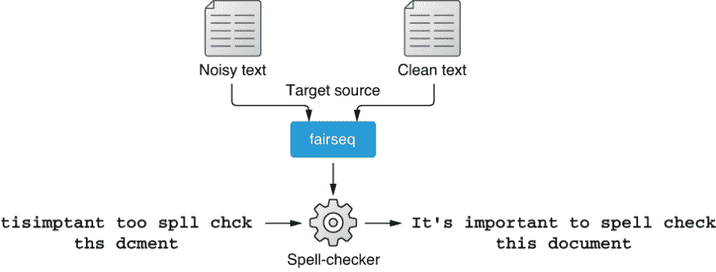

图 8.16 将拼写检查器训练为将“嘈杂”的句子翻译成“干净”的句子的 MT 系统

此时，您可能会想知道我们从哪里获取数据集。这通常是解决现实世界自然语言处理问题中最重要（也是最困难）的部分。幸运的是，我们可以使用公共数据集来完成这项任务。让我们深入研究并开始构建一个拼写检查器。

### 8.5.2 训练拼写检查器

我们将使用 GitHub Typo Corpus（[`github.com/mhagiwara/github-typo-corpus`](https://github.com/mhagiwara/github-typo-corpus)）作为训练拼写检查器的数据集。这个数据集是由我和我的合作者创建的，其中包含数十万个从 GitHub 自动收集的“打字错误”编辑。这是迄今为止最大的拼写错误及其校正数据集，这使得它成为训练拼写检查器的理想选择。

在准备数据集和训练模型之前，我们需要做出一个决定，那就是选择模型操作的原子语言单位。许多自然语言处理模型使用令牌作为最小单位（即，RNN/Transformer 被馈送一个令牌序列），但越来越多的自然语言处理模型使用*单词或句子片段*作为基本单位（第 10.4 节）。对于拼写校正，我们应该使用什么作为最小的单位？与许多其他自然语言处理模型一样，起初使用单词作为输入听起来像是一个很好的“默认”选择。然而，正如我们之前所看到的，令牌的概念并不适用于拼写校正——用户可能会弄乱标点符号，如果您正在处理令牌，这会使一切过于复杂。更重要的是，因为自然语言处理模型需要操作一个固定的词汇表，所以拼写校正器的词汇表需要包含训练期间遇到的每个单词的每个拼写错误。这将使得训练和维护这样一个自然语言处理模型变得不必要昂贵。

由于这些原因，我们将使用*字符*作为拼写检查器的基本单位，就像在第 5.6 节中一样。使用字符有几个优点——它可以保持词汇表的大小相当小（通常对于具有小字母表集的语言，如英语，不到一百个）。即使是充满打字错误的嘈杂数据集，您也不必担心膨胀您的词汇表，因为打字错误只是字符的不同排列。您还可以将标点符号（甚至空白符）视为词汇表中的字符之一。这使得预处理步骤非常简单，因为您不需要任何语言工具包（如标记器）来执行此操作。

注意：使用字符并非没有缺点。其中一个主要问题是使用它们会增加序列的长度，因为你需要将所有内容分解为字符。这使得模型变得庞大且训练速度变慢。

首先，让我们为训练拼写检查器准备数据集。构建拼写检查器所需的所有必要数据和代码都包含在此代码库中：[`github.com/mhagiwara/xfspell`](https://github.com/mhagiwara/xfspell)。经过分词和拆分的数据集位于 data/gtc 目录下（如 train.tok.fr、train.tok.en、dev.tok.fr、dev.tok.en）。后缀 en 和 fr 是机器翻译中常用的约定，其中“fr”表示“外语”，“en”表示英语，因为许多机器翻译研究项目最初是由希望将某种外语翻译为英语的人发起的。这里，我们将“fr”和“en”仅仅解释为“拼写纠错前的嘈杂文本”和“拼写纠错后的纠正文本”。

图 8.17 显示了根据 GitHub Typo Corpus 创建的拼写纠错数据集的摘录。请注意，文本被分割成单个字符，甚至包括空格（由“_”替换）。所有不在通用字母表（大写字母、小写字母、数字和一些常见标点符号）内的字符都被替换为“#”。您可以看到数据集包含各种纠正，包括简单的拼写错误（pubilc->public 在第 670 行，HYML->HTML 在第 672 行），更复杂的错误（mxnet 一词替换成 mxnet is not 在第 681 行，22th->22nd 在第 682 行），甚至不带任何更正的行（第 676 行）。这看起来是训练拼写检查器的一个好资源。

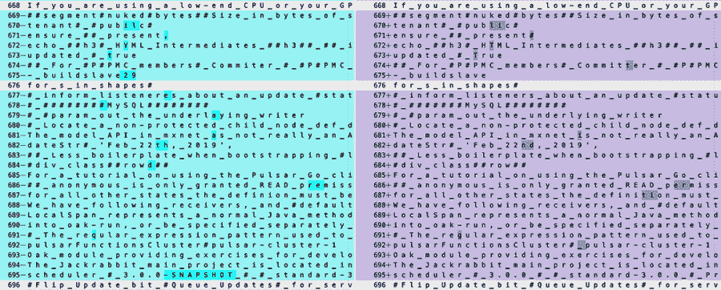

图 8.17 拼写纠错的训练数据

训练拼写检查器（或任何其他 Seq2Seq 模型）的第一步是对数据集进行预处理。因为数据集已经分割和格式化，你只需要运行 fairseq-preprocess 将数据集转换为二进制格式，操作如下：

```py
fairseq-preprocess --source-lang fr --target-lang en \
    --trainpref data/gtc/train.tok \
    --validpref data/gtc/dev.tok \
    --destdir bin/gtc
```

然后，您可以使用以下代码立即开始训练模型。

列表 8.3 训练拼写检查器

```py
fairseq-train \
    bin/gtc \
    --fp16 \
 --arch transformer \
 --encoder-layers 6 --decoder-layers 6 \
 --encoder-embed-dim 1024 --decoder-embed-dim 1024 \
 --encoder-ffn-embed-dim 4096 --decoder-ffn-embed-dim 4096 \
 --encoder-attention-heads 16 --decoder-attention-heads 16 \
    --share-decoder-input-output-embed \
    --optimizer adam --adam-betas '(0.9, 0.997)' --adam-eps 1e-09 --clip-norm 25.0 \
    --lr 1e-4 --lr-scheduler inverse_sqrt --warmup-updates 16000 \
    --dropout 0.1 --attention-dropout 0.1 --activation-dropout 0.1 \
    --weight-decay 0.00025 \
    --criterion label_smoothed_cross_entropy --label-smoothing 0.2 \
 --max-tokens 4096 \
    --save-dir models/gtc01 \
    --max-epoch 40
```

您不需要担心这里的大多数超参数——这组参数对我来说效果还不错，尽管可能还有其他参数组合效果更好。但是，您可能想注意一些与模型大小相关的参数，即：

+   层数（-[encoder|decoder]-layers）

+   自注意力的嵌入维度（-[encoder|decoder]-embed-dim）

+   前馈层的嵌入维度（-[encoder/decoder]-ffn-embed-dim）

+   注意力头数（-[encoder|decoder]-attention-heads）

这些参数决定了模型的容量。一般来说，这些参数越大，模型的容量就越大，尽管作为结果，模型也需要更多的数据、时间和 GPU 资源来进行训练。另一个重要的参数是—max-token，它指定加载到单个批次中的标记数。如果在 GPU 上遇到内存不足错误，请尝试调整此参数。

训练完成后，您可以运行以下命令使用训练好的模型进行预测：

```py
echo "tisimptant too spll chck ths dcment." \
    | python src/tokenize.py \
    | fairseq-interactive bin/gtc \
    --path models/gtc01/checkpoint_best.pt \
    --source-lang fr --target-lang en --beam 10 \
    | python src/format_fairseq_output.py
```

因为 fairseq-interactive 界面也可以从标准输入接收源文本，所以我们直接使用 echo 命令提供文本。Python 脚本 src/format_fairseq_output.py，顾名思义，格式化来自 fairseq-interactive 的输出，并显示预测的目标文本。当我运行这个脚本时，我得到了以下结果：

```py
tisimplement too spll chck ths dcment.
```

这相当令人失望。拼写检查器学会了如何将“imptant”修正为“implement”，尽管它未能纠正任何其他单词。我怀疑有几个原因。使用的训练数据，GitHub Typo Corpus，严重偏向于软件相关的语言和纠正，这可能导致了错误的更正（imptant -> implement）。此外，训练数据可能对于 Transformer 来说太小了。我们如何改进模型，使其能够更准确地纠正拼写错误呢？

### 8.5.3 改进拼写检查器

正如我们之前讨论的，拼写检查器不如预期工作的一个主要原因可能是因为模型在训练过程中没有暴露给更多种类、更大数量的拼写错误。但据我所知，没有这样的大型数据集公开可用于训练一个通用领域的拼写检查器。我们如何获取更多的数据来训练一个更好的拼写检查器呢？

这就是我们需要有创造性的地方。一个想法是从干净的文本中人工生成带有噪音的文本。如果你想一想，这是非常困难的（尤其对于一个机器学习模型）来纠正拼写错误，但很容易“破坏”干净的文本，以模拟人们如何打字错误，即使对于计算机也是如此。例如，我们可以从一些干净的文本（例如，几乎无限的从网页抓取的文本）中随机替换一些字母。如果你将以这种方式创建的人工生成的带噪音的文本与原始的干净文本配对，这将有效地创建一个新的、更大的数据集，你可以在其上训练一个更好的拼写检查器！

我们需要解决的剩下的问题是如何“破坏”干净的文本以生成看起来像人类所做的真实拼写错误。你可以编写一个 Python 脚本，例如，随机替换、删除和/或交换字母，虽然不能保证以这种方式生成的拼写错误与人类所做的拼写错误相似，也不能保证生成的人工数据集能为 Transformer 模型提供有用的见解。我们如何建模这样一个事实，例如，人们更有可能在“too”的地方输入“to”，而不是“two”呢？

这又开始听起来熟悉了。我们可以使用数据来模拟打字错误！但是如何做呢？这就是我们需要再次发挥创造力的地方——如果你“翻转”我们用来训练拼写检查器的原始数据集的方向，你可以观察到人们是如何打字错误的。如果你把干净的文本视为源语言，把嘈杂的文本视为目标语言，并为该方向训练一个 Seq2Seq 模型，那么你实际上是在训练一个“拼写损坏器”—一个将看起来很真实的拼写错误插入干净文本的 Seq2Seq 模型。请参见图 8.18 进行说明。

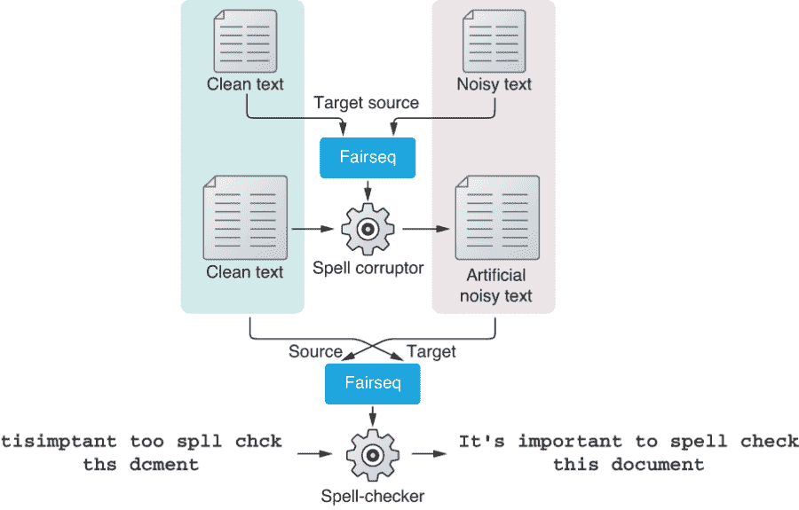

图 8.18 使用回译生成人工噪声数据

在机器学习文献中，使用原始训练数据的“反向”来从目标语言中的真实语料库中人工生成大量源语言数据的技术被称为 *回译*。这是一种提高机器翻译系统质量的流行技术。正如我们接下来将展示的，它也可以有效地提高拼写检查器的质量。

通过交换源语言和目标语言，您可以轻松训练一个拼写损坏器。您可以在运行 fairseq-preprocess 时将“en”（干净文本）作为源语言提供，将“fr”（嘈杂文本）作为目标语言，如下所示：

```py
fairseq-preprocess --source-lang en --target-lang fr \
    --trainpref data/gtc/train.tok \
    --validpref data/gtc/dev.tok \
    --destdir bin/gtc-en2fr
```

我们不再详细介绍训练过程——你可以使用几乎相同的 fairseq-train 命令启动训练。只是不要忘记为 —save-dir 指定一个不同的目录。在训练结束后，您可以检查拼写损坏器是否确实能按预期损坏输入文本：

```py
$ echo 'The quick brown fox jumps over the lazy dog.' | python src/tokenize.py \ 
    | fairseq-interactive \
    bin/gtc-en2fr \
    --path models/gtc-en2fr/checkpoint_best.pt \
    --source-lang en --target-lang fr \
 --beam 1 --sampling --sampling-topk 10 \
    | python src/format_fairseq_output.py
The quink brown fox jumps ove-rthe lazy dog.
```

注意我之前添加的额外选项，以粗体显示。这意味着 fairseq-interactive 命令使用采样（从概率最大的前 10 个标记中采样）而不是束搜索。当损坏干净文本时，通常最好使用采样而不是束搜索。简而言之，采样根据 softmax 层后的概率分布随机选择下一个标记，而束搜索则试图找到最大化输出序列分数的“最佳路径”。虽然束搜索在翻译某些文本时可以找到更好的解决方案，但在通过回译增加数据时，我们希望得到更嘈杂、更多样化的输出。过去的研究⁶也表明，采样（而不是束搜索）对通过回译增加数据效果更好。

从这里开始，一切皆有可能。你可以收集尽可能多的干净文本，使用刚刚训练的损坏程序生成嘈杂文本，并增加训练数据的大小。并不能保证人工错误看起来像人类所做的真实错误一样，但这并不重要，因为 1）源（嘈杂）侧仅用于编码，2）目标（干净）侧数据始终是由人类编写的“真实”数据，从中 Transformer 可以学习如何生成真实文本。你收集的文本数据越多，模型对无错误的真实文本的信心就越大。

我不会详细介绍我为增加数据量所采取的每一步，但这里是我所做的事情以及你也可以做的事情的总结。从公开可用的数据集（如 Tatoeba 和维基百科的转储）中收集尽可能多的干净和多样化的文本数据是一个方法。我最喜欢的方法是使用 OpenWebTextCorpus（[`skylion007.github.io/OpenWebTextCorpus/`](https://skylion007.github.io/OpenWebTextCorpus/)），这是一个开源项目，用于复制最初用于 GPT-2 训练的数据集。它由从 Reddit 的所有外部链接爬取的大量（40 GB）高质量网页文本组成。因为整个数据集的预处理和运行损坏程序可能需要几天甚至几周的时间，你可以取一个子集（比如说，1/1000），然后将其添加到数据集中。我取了数据集的 1/100 子集，对其进行了预处理，并运行了损坏程序，以获得嘈杂干净的平行数据集。这 1/100 子集单独就添加了五百多万对（相比之下，原始训练集仅包含约 240k 对）。你可以下载预训练权重并尝试存储库中的拼写检查器，而不是从头开始训练。

训练花了几天时间，甚至在多个 GPU 上，但当完成时，结果非常令人鼓舞。它不仅可以准确地修复拼写错误，如下所示

```py
$ echo "tisimptant too spll chck ths dcment." \
    | python src/tokenize.py \
    | fairseq-interactive \
    bin/gtc-bt512-owt1k-upper \
    --path models/bt05/checkpoint_best.pt \
    --source-lang fr --target-lang en --beam 10 \
    | python src/format_fairseq_output.py
    It's important to spell check this document.
```

而且拼写检查器似乎也在某种程度上理解英语的语法，如下所示：

```py
$ echo "The book wer about NLP." |
    | python src/tokenize.py \
    | fairseq-interactive \
   ...
The book was about NLP.

$ echo "The books wer about NLP." |
    | python src/tokenize.py \
    | fairseq-interactive \
   ...
The books were about NLP.
```

这个例子本身可能不能证明模型真正理解语法（即根据主语的数量使用正确的动词）。它可能只是学习了一些连续单词之间的关联，这可以通过任何统计 NLP 模型（如 n-gram 语言模型）实现。然而，即使在你让句子更加复杂之后，拼写检查器也显示出了惊人的弹性，如下一个代码片段所示：

```py
$ echo "The book Tom and Jerry put on the yellow desk yesterday wer about NLP." |
    | python src/tokenize.py \
    | fairseq-interactive \
   ...
The book Tom and Jerry put on the yellow desk yesterday was about NLP.

$ echo "The books Tom and Jerry put on the yellow desk yesterday wer about NLP." |
    | python src/tokenize.py \
    | fairseq-interactive \
   ...
The books Tom and Jerry put on the yellow desk yesterday were about NLP.
```

从这些例子中，可以清楚地看出模型学会了如何忽略不相关的名词短语（例如“Tom and Jerry”和“yellow desk”），并专注于决定动词形式（“was”与“were”）的名词（“book(s)”）。我们更有信心它理解了基本的句子结构。我们所做的一切只是收集了大量干净的文本，并在其上训练了 Transformer 模型，结合了原始的训练数据和损坏器。希望通过这些实验，你能感受到 Transformer 模型的强大之处！

## 摘要

+   注意力机制是神经网络中的一种机制，它专注于输入的特定部分，并计算其上下文相关的摘要。它类似于“软”版本的键-值存储。

+   可以将编码器-解码器注意力机制添加到 Seq2Seq 模型中，以提高其翻译质量。

+   自注意力是一种注意力机制，通过总结自身来产生输入的摘要。

+   Transformer 模型反复应用自注意力机制，逐渐转换输入。

+   可以使用 Transformer 和一种称为回译的技术来构建高质量的拼写检查器。

^(1.)Vaswani 等人，“注意力机制就是一切”，（2017）。[`arxiv.org/abs/1706.03762`](https://arxiv.org/abs/1706.03762)。

^(2.)Bahdanau 等人，“通过共同学习对齐和翻译进行神经机器翻译”，（2014）。[`arxiv.org/abs/1409.0473`](https://arxiv.org/abs/1409.0473)。

^(3.)Bahdanau 等人，“通过共同学习对齐和翻译进行神经机器翻译”，（2014）。[`arxiv.org/abs/1409.0473`](https://arxiv.org/abs/1409.0473)。

^(4.)Dai 等人，“Transformer-XL:超越固定长度上下文的注意力语言模型”，（2019）。[`arxiv.org/abs/1901.02860`](https://arxiv.org/abs/1901.02860)。

^(5.)Lample 和 Conneau，“跨语言语言模型预训练”，（2019）。[`arxiv.org/abs/1901 .07291`](https://arxiv.org/abs/1901.07291)。

^(6.)Edunov 等人，“大规模理解回译”，（2018）。[`arxiv.org/abs/1808.09381`](https://arxiv.org/abs/1808.09381)。
