# 第十一章：开发自然语言处理应用的十大最佳实践

本章内容包括

+   通过对令牌进行排序、填充和掩码使神经网络推断更有效率

+   应用基于字符和 BPE 的分词技术将文本分割成令牌

+   通过正则化避免过拟合

+   通过使用上采样、下采样和损失加权处理不平衡数据集

+   优化超参数

到目前为止，我们已经涵盖了很多内容，包括 RNN、CNN 和 Transformer 等深度神经网络模型，以及 AllenNLP 和 Hugging Face Transformers 等现代 NLP 框架。然而，我们对训练和推断的细节关注不多。例如，如何高效地训练和进行预测？如何避免模型过拟合？如何优化超参数？这些因素可能会对模型的最终性能和泛化能力产生巨大影响。本章涵盖了您需要考虑的这些重要主题，以构建在实际中表现良好的稳健准确的 NLP 应用程序。

## 10.1 实例批处理

在第二章中，我们简要提到了*批处理*，这是一种机器学习技术，其中实例被分组在一起形成批次，并发送到处理器（CPU 或更常见的 GPU）。在训练大型神经网络时，批处理几乎总是必要的——它对于高效稳定的训练至关重要。在本节中，我们将深入探讨与批处理相关的一些技术和考虑因素。

### 10.1.1 填充

训练大型神经网络需要进行许多线性代数运算，如矩阵加法和乘法，这涉及同时对许多许多数字执行基本数学运算。这就是为什么它需要专门的硬件，如 GPU，设计用于高度并行化执行此类操作的处理器。数据被发送到 GPU 作为张量，它们只是数字的高维数组，以及一些指示，说明它需要执行什么类型的数学运算。结果被发送回作为另一个张量。

在第二章中，我们将 GPU 比作海外高度专业化和优化的工厂，用于大量生产相同类型的产品。由于在通信和运输产品方面存在相当大的开销，因此如果您通过批量运输所有所需材料来进行小量订单以制造大量产品，而不是按需运输材料，则效率更高。

材料和产品通常在标准化的容器中来回运输。如果你曾经自己装过搬家货舱或观察别人装过，你可能知道有很多需要考虑的因素来确保安全可靠的运输。你需要紧紧地把家具和箱子放在一起，以免在过渡过程中移位。你需要用毯子裹着它们，并用绳子固定它们，以防止损坏。你需要把重的东西放在底部，以免把轻的东西压坏，等等。

机器学习中的批次类似于现实世界中用于运输物品的容器。就像运输集装箱都是相同的尺寸和矩形形状一样，机器学习中的批次只是装有相同类型数字的矩形张量。如果你想要将不同形状的多个实例在单个批次中“运送”到 GPU，你需要将它们打包，使打包的数字形成一个矩形张量。

在自然语言处理中，我们经常处理长度不同的文本序列。因为批次必须是矩形的，所以我们需要进行*填充*（即在每个序列末尾加上特殊标记< PAD >），以便张量的每一行具有相同的长度。你需要足够多的填充标记，以使序列的长度相同，这意味着你需要填充短的序列，直到它们与同一批次中最长的序列一样长。示例见图 10.1。

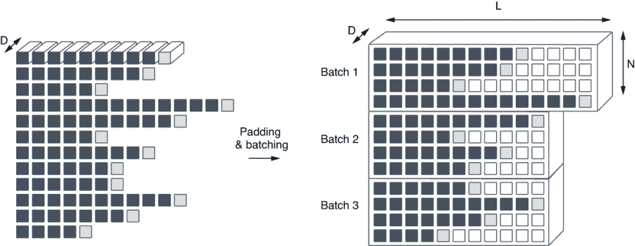

图 10.2 嵌入序列的填充和分批创建了三维的矩形张量。

看起来越来越像真正的容器了！

### 10.1.2 排序

因为每个批次必须是矩形的，如果一个批次同时包含短序列和长序列，你需要为短序列添加大量填充，使它们与同一批次中最长的序列一样长。这通常会导致批次中存在一些浪费空间——见图 10.3 中的“batch 1”示例。最短的序列（六个标记）需要填充八个标记才能与最长的序列（14 个标记）长度相等。张量中的浪费空间意味着存储和计算的浪费，所以最好避免这种情况发生，但是怎么做呢？

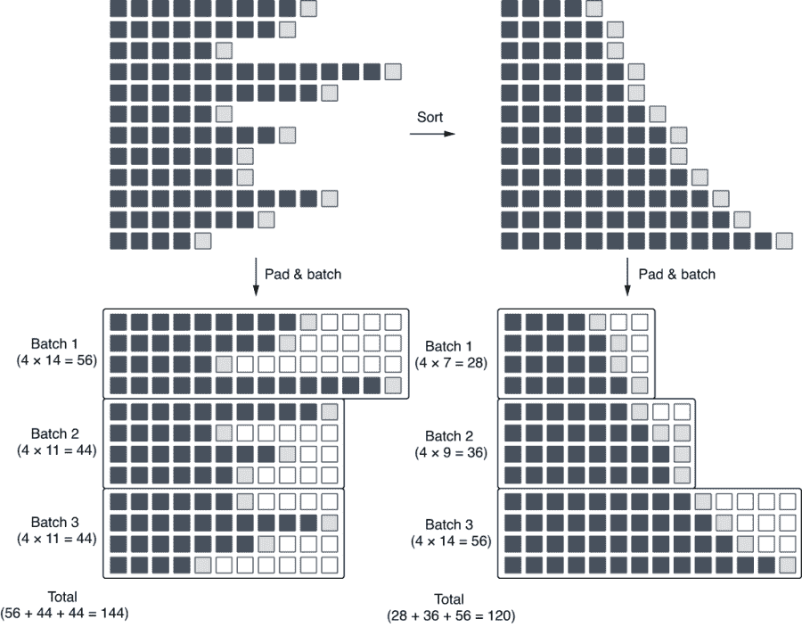

图 10.3 在批处理之前对实例进行排序（右侧）可以减少总张量数量。

通过将相似大小的实例放在同一个批次中，可以减少填充的量。如果较短的实例只与其他同样较短的实例一起批处理，则它们不需要用许多填充标记进行填充。同样，如果较长的实例只与其他较长的实例一起批处理，则它们也不需要很多填充，因为它们已经很长了。一个想法是按照它们的长度对实例进行排序，并相应地进行批处理。图 10.3 比较了两种情况——一种是实例按其原始顺序进行批处理，另一种是在批处理之前对实例进行排序。每个批次下方的数字表示表示批次所需的标记数，包括填充标记。注意，通过排序，总标记数从 144 降低到 120。因为原始句子中的标记数没有变化，所以这纯粹是因为排序减少了填充标记的数量。较小的批次需要更少的内存来存储和更少的计算来处理，因此在批处理之前对实例进行排序可以提高训练的效率。

所有这些技术听起来有点复杂，但好消息是，只要使用高级框架（如 AllenNLP），你很少需要自己编写排序、填充和批处理实例的代码。回想一下，在第二章中构建情感分析模型时，我们使用了 DataLoader 和 BucketBatchSampler 的组合，如下所示：

```py
train_data_loader = DataLoader(train_dataset,
                               batch_sampler=BucketBatchSampler(
                                   train_dataset,
                                   batch_size=32,
                                   sorting_keys=["tokens"]))
```

BucketBatchSampler 中给定的 sorting_keys 指定了要用于排序的字段。从名称可以猜出，通过指定“tokens”，你告诉数据加载器按照标记数对实例进行排序（在大多数情况下是你想要的）。流水线会自动处理填充和批处理，数据加载器会提供一系列批次供您的模型使用。

### 10.1.3 掩码

最后一个需要注意的细节是 *掩码*。掩码是一种操作，用于忽略与填充相对应的网络的某些部分。当你处理顺序标记或语言生成模型时，这变得特别重要。回顾一下，顺序标记是一种任务，其中系统为输入序列中的每个标记分配一个标签。我们在第五章中使用了顺序标记模型（RNN）构建了一个词性标注器。

如图 10.4 所示，顺序标记模型通过最小化给定句子中所有标记的每个标记损失来进行训练。我们这样做是因为我们希望最小化网络每个标记的“错误”数量。只要处理“真实”标记（图中的“time”，“flies”和“like”），这是可以接受的，尽管当输入批次包含填充标记时，这就成为一个问题。因为它们只是为了填充批次而存在，所以在计算总损失时应该忽略它们。

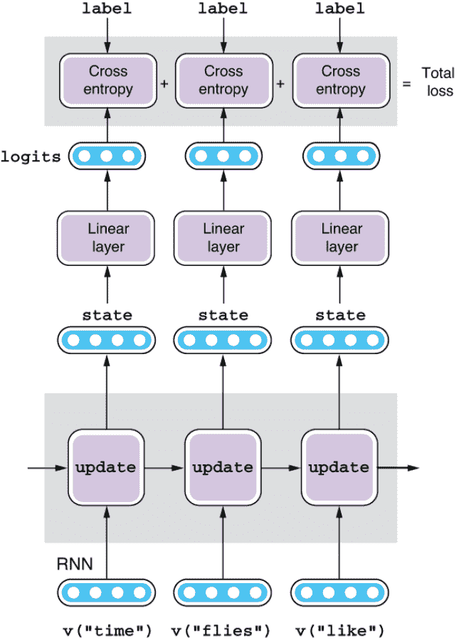

图 10.4 序列的损失是每个标记的交叉熵之和。

我们通常通过创建一个额外的用于掩码损失的向量来完成这个过程。用于掩码的向量的长度与输入相同，其元素为“真”标记和填充的“假”标记。在计算总损失时，你可以简单地对每个标记的损失和掩码进行逐元素乘积，然后对结果进行求和。

幸运的是，只要你正在使用 AllenNLP 构建标准的顺序标记模型，你很少需要自己实现掩码。记住，在第五章，我们按照列表 10.1 中所示编写了 POS 标签器模型的前向传播。在这里，我们从 get_text_field_mask() 辅助函数获取掩码向量，并使用 sequence_cross_entropy_with_logits() 计算最终损失。

列表 10.1 POS 标签器的前向传播

```py
    def forward(self,
                words: Dict[str, torch.Tensor],
                pos_tags: torch.Tensor = None,
                **args) -> Dict[str, torch.Tensor]:
        mask = get_text_field_mask(words)

        embeddings = self.embedder(words)
        encoder_out = self.encoder(embeddings, mask)
        tag_logits = self.linear(encoder_out)

        output = {"tag_logits": tag_logits}
        if pos_tags is not None:
            self.accuracy(tag_logits, pos_tags, mask)
            output["loss"] = sequence_cross_entropy_with_logits(
                tag_logits, pos_tags, mask)

        return output
```

如果你偷看一下掩码中的内容（比如，在这个前向方法中插入一个打印语句），你会看到以下由二进制（真或假）值组成的张量：

```py
tensor([[ True,  True,  True,  True,  True,  True,  True,  True, False],
        [ True,  True,  True,  True,  True,  True,  True,  True,  True],
        [ True,  True,  True,  True,  True,  True,  True,  True, False],
        [ True,  True,  True,  True,  True,  True,  True,  True,  True],
        [ True,  True,  True,  True,  True,  True,  True,  True, False],
        [ True,  True,  True,  True,  True,  True,  True,  True, False],
        [ True,  True,  True,  True,  True,  True,  True,  True, False],
        [ True,  True,  True,  True,  True,  True,  True,  True,  True],
        [ True,  True,  True,  True,  True,  True,  True,  True, False],
        [ True,  True,  True,  True,  True,  True,  True,  True,  True],
        [ True,  True,  True,  True,  True,  True,  True,  True,  True],
```

这个张量的每一行对应一个标记序列，False 的位置是填充发生的地方。损失函数（sequence_cross_entropy_with_logits）接收预测值、真实标签和掩码，并在忽略所有标记为 False 的元素时计算最终损失。

## 10.2 用于神经模型的标记化

在第三章，我们介绍了基本的语言单位（单词、字符和 n-gram）以及如何计算它们的嵌入。在本节中，我们将更深入地讨论如何分析文本并获取这些单位的过程——称为*标记化*。神经网络模型在处理标记时面临一系列独特的挑战，我们将介绍一些现代模型来解决这些挑战。

### 10.2.1 未知单词

词汇表是一个 NLP 模型处理的标记集合。许多神经网络自然语言处理模型在一组固定、有限的标记中运作。例如，在第二章构建情感分析器时，AllenNLP 管道首先对训练数据集进行标记化，并构造一个 Vocabulary 对象，该对象包含了所有出现次数超过，比如，三次以上的所有唯一标记。然后模型使用一个嵌入层将标记转换为单词嵌入，这是输入标记的一些抽象表示。

迄今为止，一切都很顺利，对吧？但是世界上的所有单词数量并不是有限的。我们不断创造以前不存在的新单词（我不认为一百年前人们谈论过“NLP”）。如果模型接收到在训练期间从未见过的单词怎么办？因为这个单词不是词汇表的一部分，所以模型甚至不能将其转换为索引，更不用说查找其嵌入了。这样的单词被称为*词汇外*（OOV）*单词*，它们是构建自然语言处理应用时最大的问题之一。

到目前为止，处理这个问题最常见（但不是最好）的方法是将所有的 OOV 标记表示为一个特殊的标记，通常称为 UNK（代表“未知”）。想法是每当模型看到一个不属于词汇表的标记时，它都会假装看到了一个特殊的标记 UNK，并像往常一样继续执行。这意味着词汇表和嵌入表都有一个专门的“插槽”用于 UNK，以便模型可以处理从未见过的词汇。UNK 的嵌入（以及任何其他参数）与其他常规标记一样进行训练。

你是否看到这种方法存在任何问题？将所有的 OOV 标记都用一个单一的 UNK 标记来对待意味着它们被折叠成一个单一的嵌入向量。无论是“NLP”还是“doggy”——只要是未见过的东西，总是被视为一个 UNK 标记并被分配相同的向量，这个向量成为各种词汇的通用、全能表示。因此，模型无法区分 OOv 词汇之间的差异，无论这些词汇的身份是什么。

如果你正在构建一个情感分析器，这可能是可以接受的。OOV 词汇从定义上来说非常少见，可能不会影响到大部分输入句子的预测。然而，如果你正在构建一个机器翻译系统或一个对话引擎，这将成为一个巨大的问题。如果每次看到新词汇时都产生“我不知道”，那么它就不会是一个可用的 MT 系统或聊天机器人！一般来说，与用于预测的 NLP 系统（情感分析、词性标注等）相比，对于语言生成系统（包括机器翻译和对话 AI），OOV 问题更为严重。

如何做得更好？在自然语言处理中，OOV 标记是一个如此严重的问题，以至于已经有很多研究工作在如何处理它们上面。在下面的小节中，我们将介绍基于字符和基于子词的模型，这是两种用于构建强大神经网络自然语言处理模型的常用技术。

### 10.2.2 字符模型

处理 OOV 问题最简单但最有效的解决方案是将字符视为标记。具体来说，我们将输入文本分解为单个字符，甚至包括标点符号和空白字符，并将它们视为常规标记。应用程序的其余部分保持不变——“单词”嵌入被分配给字符，然后由模型进一步处理。如果模型生成文本，它是逐字符地生成的。

实际上，当我们构建语言生成器时，我们在第五章使用了字符级模型。RNN 不是一次生成一个单词，而是一次生成一个字符，如图 10.5 所示。由于这种策略，模型能够生成看起来像英语但实际上不是的单词。请注意 10.2 列表中显示的输出中类似于英语的许多奇怪的单词（*despoit*，*studented*，*redusention*，*distaples*）.如果模型操作单词，它只会生成已知的单词（或者在不确定时生成 UNKs），这是不可能的。


图 10.5：生成文本字符级（包括空格）的语言生成模型

列 10.2：字符级语言模型生成的句子

```py
You can say that you don't know it, and why decided of yourself.
Pike of your value is to talk of hubies.
The meeting despoit from a police?
That's a problem, but us?
The sky as going to send nire into better.
We'll be look of the best ever studented.
There's you seen anything every's redusention day.
How a fail is to go there.
It sad not distaples with money.
What you see him go as famous to eat!
```

基于字符的模型是多功能的，并对语言的结构做出了少量的假设。对于拥有小字母表的语言（比如英语），它有效地消除了未知单词，因为几乎任何单词，无论其多么罕见，都可以被分解为字符。对于拥有大字母表的语言（如中文），将其标记为字符也是一种有效的策略，尽管你需要注意“未知字符”的问题。

然而，这种策略并非没有缺点。最大的问题是效率低下。为了编码一个句子，网络（无论是 RNN 还是 Transformer）都需要处理其中的所有字符。例如，基于字符的模型需要处理“t”，“h”，“e”，和“_”（空格）来处理一个单词“the”，而基于单词的模型可以在一个步骤中完成。这种低效在输入序列变长时对 Transformer 的影响最大，注意计算的增长是二次方的。

### 10.2.3：子词模型

到目前为止，我们学习了两个极端——基于单词的方法效率很高，但在处理未知词方面表现不佳。基于字符的方法在处理未知词方面表现出色，但效率低下。有没有一种介于两者之间的标记化方法？我们能不能使用一些标记化方法既高效又能很好地处理未知词？

子词模型是神经网络针对这个问题的最新发明。在子词模型中，输入文本被分割成一个被称为*子词*的单位，这只是意味着比单词小的东西。对于什么是子词，没有正式的语言学定义，但它们大致对应于频繁出现的单词的一部分。例如，“dishwasher”的一种分段方法是“dish + wash + er”，尽管也可能有其他的分割方法。

一些算法的变体（如 WordPiece¹ 和 SentencePiece²）将输入标记化为子词，但迄今为止最广泛使用的是*字节对编码*（BPE）。³ BPE 最初是作为一种压缩算法发明的，但自 2016 年以来，它已被广泛用作神经模型的标记化方法，特别是在机器翻译中。

BPE 的基本概念是保持频繁单词（如“the”和“you”）和 n 元组（如“-able”和“anti-”）不分段，同时将较少出现的单词（如“dishwasher”）分解为子词（“dish + wash + er”）。将频繁单词和 n 元组放在一起有助于模型高效处理这些标记，而分解稀有单词可以确保没有 UNK 标记，因为一切都最终可以分解为单个字符，如果需要的话。通过根据频率灵活选择标记位置，BPE 实现了两全其美——既高效又解决了未知词问题。

让我们看看 BPE 如何确定在真实示例中进行标记化。BPE 是一种纯统计算法（不使用任何语言相关信息），通过一次合并最频繁出现的一对连续标记来操作。首先，BPE 将所有输入文本标记化为单个字符。例如，如果您的输入是四个单词 low、lowest、newer 和 wider，则它们将被标记化为 l o w _、l o w e s t _、n e w e r _ 和 w i d e r _。在这里，“_”是一个特殊符号，表示每个单词的结尾。然后，算法识别出最频繁出现的任意两个连续元素。在这个例子中，对 l o 出现最频繁（两次），所以这两个字符被合并，得到 lo w _、lo w e s t _、n e w e r _、w i d e r _。然后，lo w 将被合并为 low，e r 将被合并为 er，er _ 将被合并为 er_，此时您有 low _、low e s t _、n e w er_、w i d er_。此过程在图 10.6 中有所说明。

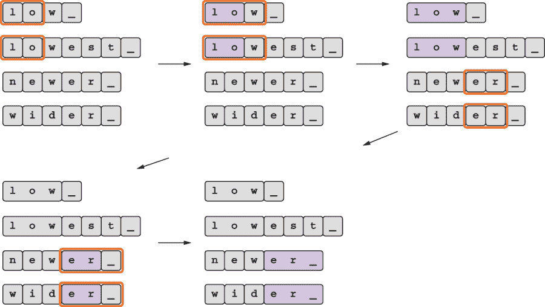

图 10.6 BPE 通过迭代地合并频繁出现的连续单元来学习子词单元。

注意，在四次合并操作之后，lowest 被分割为 low e s t，其中频繁出现的子字符串（如 low）被合并在一起，而不频繁出现的子字符串（如 est）被拆分开来。要对新输入（例如 lower）进行分割，将按顺序应用相同的合并操作序列，得到 low e r _。如果您从 52 个唯一字母（26 个大写字母和小写字母）开始，执行了 N 次合并操作，则您的词汇表中将有 52 + N 个唯一标记，其中 N 是执行的合并操作数。通过这种方式，您完全控制了词汇表的大小。

在实践中，你很少需要自己实现 BPE（或任何其他子词标记化算法）。这些算法在许多开源库和平台上都有实现。两个流行的选择是 Subword-NMT（[`github.com/rsennrich/subword-nmt`](https://github.com/rsennrich/subword-nmt)）和 SentencePiece（[`github.com/google/sentencepiece`](https://github.com/google/sentencepiece)）（它还支持使用 unigram 语言模型的子词标记化变体）。许多 NLP 框架中附带的默认标记器，比如 Hugging Face Transformers 中实现的标记器，都支持子词标记化。

## 10.3 避免过拟合

*过拟合*是构建任何机器学习应用时需要解决的最常见和最重要的问题之一。当一个机器学习模型拟合给定数据得非常好，以至于失去了对未见数据的泛化能力时，就说该模型过拟合了。换句话说，模型可能在训练数据上表现得非常好，并且在它上面表现良好，但是可能无法很好地捕捉其固有模式，并且在模型从未见过的数据上表现不佳。

因为过拟合在机器学习中非常普遍，研究人员和实践者过去已经提出了许多算法和技术来应对过拟合。在本节中，我们将学习两种这样的技术——正则化和提前停止。这些技术在任何机器学习应用中都很受欢迎（不仅仅是自然语言处理），值得掌握。

### 10.3.1 正则化

*正则化*在机器学习中指的是鼓励模型的简化和泛化的技术。你可以把它看作是一种惩罚形式之一，你

强加给你的机器学习模型以确保其尽可能通用。这是什么意思呢？假设你正在构建一个“动物分类器”，通过从语料库中训练词嵌入并在这个嵌入空间中为动物和其他东西之间划分一条线（即，你将每个单词表示为一个多维向量，并根据向量的坐标对单词是否描述动物进行分类）。让我们大大简化这个问题，假设每个单词都是一个二维向量，并且你得到了图 10.7 所示的图。现在你可以可视化一个机器学习模型如何通过在决策翻转不同类别之间的线来做出分类决策，这被称为*分类边界*。你会如何绘制一个分类边界，以便将动物（蓝色圆圈）与其他所有东西（三角形）分开？

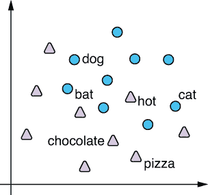

图 10.7 动物 vs. 非动物分类图

分离动物的一个简单方法是绘制一条直线，就像图 10.8 中的第一个图中所示。这个简单的分类器会犯一些错误（在分类诸如“hot”和“bat”之类的单词时），但是它正确分类了大多数数据点。这听起来是一个不错的开始。


图 10.8 随着复杂性增加的分类边界

如果告诉你决策边界不一定是一条直线呢？你可能想画出图 10.8 中间所示的那样的东西。这个看起来更好一些——它比第一个少犯一些错误，虽然仍然不完美。对于机器学习模型来说，这似乎是可行的，因为形状很简单。

但是这里没有什么可以阻止你。如果你想要尽可能少地犯错误，你也可以画出像第三个图中所示的那样扭曲的东西。那个决策边界甚至不会犯任何分类错误，这意味着我们实现了 100%的分类准确性！

不要那么快——记住，直到现在，我们只考虑了训练时间，但是机器学习模型的主要目的是在*测试时间*达到良好的分类性能（即，它们需要尽可能正确地分类未观察到的新实例）。现在让我们想一想前面描述的三个决策边界在测试时间表现如何。如果我们假设测试实例的分布与我们在图 10.8 中看到的训练实例类似，那么新的“动物”点最有可能落在图中的右上区域。前两个决策边界将通过正确分类大多数新实例而实现相当的准确度。但是第三个呢？像图中显示的“热”的训练实例最有可能是例外而不是规则，因此试图适应尽可能多的训练实例的决策边界的曲线部分可能会在测试时间通过无意中错误分类测试实例时带来更多的伤害。这正是过拟合的样子——模型对训练数据拟合得太好，牺牲了其泛化能力，这就是这里发生的事情。

然后，问题来了，我们如何避免你的模型看起来像第三个决策边界？毕竟，它在正确分类训练数据方面做得非常好。如果你只看训练准确度和/或损失，那么没有什么能阻止你选择它。避免过拟合的一种方法是使用一个单独的、保留的数据集（称为*验证集*；参见 2.2.3 节）来验证模型的性能。但是即使不使用单独的数据集，我们能做到吗？

第三个决策边界看起来不对劲——它过于复杂。在其他所有条件相同的情况下，我们应该更喜欢简单的模型，因为一般来说，简单的模型更容易泛化。这也符合奥卡姆剃刀原理，即更简单的解决方案优于更复杂的解决方案。我们如何在训练拟合和模型简单性之间取得平衡呢？

这就是正则化发挥作用的地方。将正则化视为对模型施加的额外限制，以便优选更简单和/或更一般化的模型。该模型被优化，使其能够在获得最佳训练拟合的同时尽可能一般化。

由于过拟合是如此重要的话题，因此机器学习中已经提出了许多正则化技术。我们只介绍其中几个最重要的——L2 正则化（权重衰减），dropout 和提前停止。

L2 正则化

L2 正则化，也称为*权重衰减*，是不仅用于 NLP 或深度学习，而且用于广泛的 ML 模型的最常见的正则化方法之一。我们不会深入探讨它的数学细节，但简单来说，L2 正则化为模型的复杂度增加了惩罚，这个复杂度是通过其参数的大小来测量的。为了表示复杂的分类边界，ML 模型需要调整大量参数（“魔术常数”）到极端值，这由 L2 loss 来衡量，其捕获了它们距离零有多远。这样的模型会承担更大的 L2 惩罚，这就是为什么 L2 鼓励更简单的模型。如果你想了解更多关于 L2 正则化（以及 NLP 一般的其他相关主题），请查阅类似 Jurafsky 和 Martin 的*Speech and Language Processing*([`web.stanford .edu/~jurafsky/slp3/5.pdf`](https://web.stanford.edu/~jurafsky/slp3/5.pdf))或 Goodfellow 等人的*Deep Learning*([`www.deep learningbook.org/contents/regularization.html`](https://www.deeplearningbook.org/contents/regularization.html))的教材。

Dropout

*Dropout*是另一种常用于神经网络的正则化技术。Dropout 通过在训练期间随机“放弃”神经元来工作，其中“神经元”基本上是中间层的一个维度，“放弃”意味着用零掩盖它。你可以将 dropout 视为对模型结构复杂性的惩罚以及对特定特征和值的依赖性。因此，网络试图通过剩余数量较少的值做出最佳猜测，这迫使它良好地泛化。Dropout 易于实现，在实践中非常有效，并且在许多深度学习模型中作为默认正则化方法使用。有关 dropout 的更多信息，请参考 Goodfellow 书中提到的正则化章节，其中详细介绍了正则化技术的数学细节。

### 10.3.2 提前停止

另一种在机器学习中应对过拟合的流行方法是*提前停止*。提前停止是一种相对简单的技术，当模型性能不再改善时（通常使用验证集损失来衡量），停止训练模型。在第六章中，我们绘制了学习曲线，当我们构建英西机器翻译模型（在图 10.9 中再次显示）时。请注意，验证损失曲线在第八个时期左右变平，在此之后开始上升，这是过拟合的迹象。提前停止会检测到这一点，停止训练，并使用损失最低的最佳时期的结果。一般来说，提前停止具有“耐心”参数，该参数是停止训练的非改善时期的数量。例如，当耐心是 10 个时期时，训练流程将在损失停止改善后等待 10 个时期才终止训练。

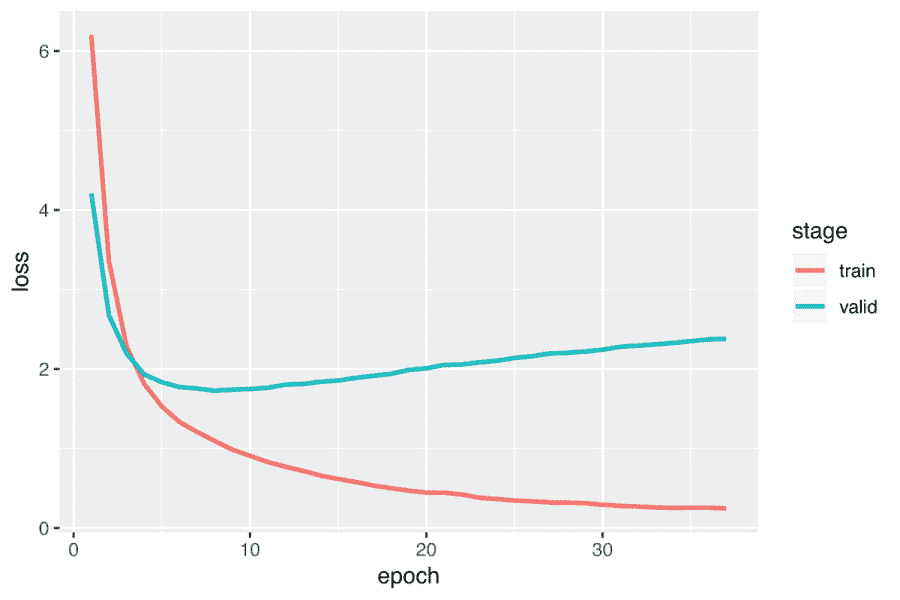

图 10.9 验证损失曲线在第 8 个时期左右变平，并逐渐上升。

为什么提前停止有助于减轻过拟合？它与模型复杂度有什么关系？不涉及数学细节，让模型学习复杂的、过拟合的决策边界需要一定的时间（训练时期）。大多数模型从一些简单的东西开始（例如直接的决策线）并逐渐在训练过程中增加其复杂性。通过提前停止训练，可以防止模型变得过于复杂。

许多机器学习框架都内置了提前停止的支持。例如，AllenNLP 的训练器默认支持提前停止。回忆一下，当我们训练基于 BERT 的自然语言推理模型时，在第 9.5.3 节使用了以下配置，其中我们使用了提前停止（耐心为 10）而没有过多关注。这使得训练器能够在验证指标在 10 个时期内没有改善时停止：

```py
    "trainer": {
        "optimizer": {
            "type": "huggingface_adamw",
            "lr": 1.0e-5
        },
        "num_epochs": 20,
        "patience": 10,
        "cuda_device": 0
    }
```

### 10.3.3 交叉验证

*交叉验证* 不完全是一种正则化方法，但它是机器学习中常用的技术之一。在构建和验证机器学习模型时，通常情况是只有数百个实例可供训练。正如本书迄今所见，仅依靠训练集是无法训练出可靠的机器学习模型的——您需要一个单独的集合用于验证，最好再有一个单独的集合用于测试。您在验证/测试中使用的比例取决于任务和数据大小，但通常建议将 5-20% 的训练实例留作验证和测试。这意味着，如果您的训练数据较少，那么您的模型将只有几十个实例用于验证和测试，这可能会使估算的指标不稳定。此外，您选择这些实例的方式对评估指标有很大的影响，这并不理想。

交叉验证的基本思想是多次迭代这个阶段（将数据集分成训练和验证部分），使用不同的划分方式来提高结果的稳定性。具体来说，在一个典型的称为*k 折交叉验证*的设置中，您首先将数据集分成*k*个不同的相等大小的部分，称为*折叠*。您使用折叠中的一个进行验证，同时在其余部分（*k* - 1 个折叠）上训练模型，并重复此过程*k*次，每次使用不同的折叠进行验证。详见图 10.10 的示意图。

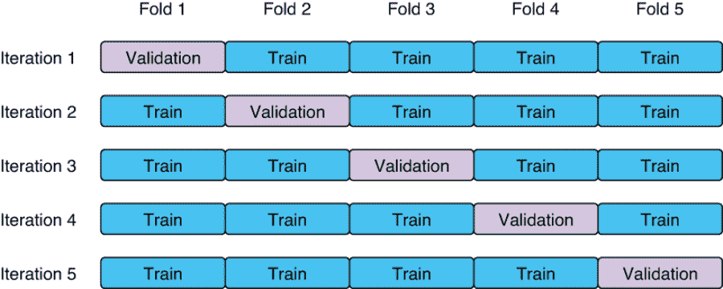

图 10.10：k 折交叉验证中，数据集被分为 k 个大小相等的折叠，其中一个用于验证。

每个折叠的验证指标都会计算，并且最终指标会在所有迭代中取平均。通过这种方式，您可以得到一个对评估指标的更稳定的估计，而不受数据集划分方式的影响。

在深度学习模型中，使用交叉验证并不常见，因为这些模型需要大量数据，如果您有大型数据集，则不需要交叉验证，尽管在传统和工业场景中，训练数据量有限时使用交叉验证更为常见。

## 10.4 处理不平衡数据集

在本节中，我们将重点讨论在构建自然语言处理（NLP）和机器学习（ML）模型时可能遇到的最常见问题之一——类别不平衡问题。分类任务的目标是将每个实例（例如电子邮件）分配给其中一个类别（例如垃圾邮件或非垃圾邮件），但这些类别很少均匀分布。例如，在垃圾邮件过滤中，非垃圾邮件的数量通常大于垃圾邮件的数量。在

文档分类中，某些主题（如政治或体育）通常要比其他主题更受欢迎。当某些类别的实例数量远远多于其他类别时，类别被称为不平衡（见图 10.11 中的示例）。

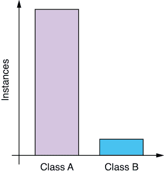

图 10.11：不平衡数据集

许多分类数据集存在不平衡的类别，这在训练分类器时会带来一些额外的挑战。小类别给模型带来的信号会被大类别压倒，导致模型在少数类别上表现不佳。在接下来的小节中，我将讨论一些在面对不平衡数据集时可以考虑的技术。

### 10.4.1 使用适当的评估指标

在您甚至开始调整数据集或模型之前，请确保您正在使用适当的指标验证您的模型。在第 4.3 节中，我们讨论了在数据集不平衡时使用准确性作为评估指标是一个坏主意的原因。在一个极端情况下，如果您的实例中有 90%属于类别 A，而其他 10%属于类别 B，即使一个愚蠢的分类器将类别 A 分配给一切，它也可以达到 90%的准确性。这被称为*多数类基线*。稍微聪明一点（但仍然愚蠢）的分类器，90%的时间随机分配标签 A，10%的时间随机分配标签 B，甚至不看实例，就可以达到 0.9 * 0.9 + 0.1 * 0.1 = 82%的准确性。这被称为*随机基线*，而数据集越不平衡，这些基线模型的准确性就会越高。

但是这种随机基线很少是少数类的良好模型。想象一下，如果您使用随机基线会发生什么事情。因为无论如何，它都会将类别 A 分配给 90%的时间，类别 B 会发生什么情况。换句话说，属于类别 B 的 90%实例将被分配给类别 A。换句话说，这种类别 B 的随机基线的准确性只有 10%。如果这是一个垃圾邮件过滤器，它将让 90%的垃圾邮件通过，无论内容是什么，只是因为您收到的邮件中有 90%不是垃圾邮件！这会造成一个糟糕的垃圾邮件过滤器。

如果您的数据集不平衡，并且您关心少数类别的分类性能，您应该考虑使用更适合这种情况的指标。例如，如果您的任务是“大海捞针”类型的设置，在这种情况下，目标是在其他实例中找到很少的实例，您可能希望使用 F1 度量而不是准确性。正如我们在第四章中看到的，F 度量是精确度（您的预测有多少是无草的）和召回率（您实际上找到了多少针）之间的某种平均值。因为 F1 度量是每个类别计算的，所以它不会低估少数类别。如果您想要测量模型的整体性能，包括多数类别，您可以计算宏平均的 F 度量，它只是每个类别计算的 F 度量的算术平均值。

### 10.4.2 上采样和下采样

现在让我们看看可以缓解类别不平衡问题的具体技术。首先，如果您可以收集更多的标记训练数据，您应该认真考虑首先这样做。与学术和机器学习竞赛设置不同，在这种设置中数据集是固定的，而您调整您的模型，而在现实世界中，您可以自由地做任何必要的事情来改进您的模型（当然，只要合法且实用）。通常，您可以做的最好的事情是让模型暴露于更多的数据。

如果您的数据集不平衡且模型正在做出偏向的预测，您可以对数据进行*上采样*或*下采样*，以便各类别具有大致相等的表示。

在上采样中（参见图 10.12 中的第二张图），你通过多次复制实例人工增加少数类的大小。例如，我们之前讨论的场景——如果你复制类 B 的实例并将每个实例的副本增加八个，它们就会有相等数量的实例。这可以缓解偏见预测的问题。尽管有更复杂的数据增强算法，如 SMOTE⁵，但它们在自然语言处理中并不常用，因为人为生成语言示例固有的困难。


图 10.12 上采样和下采样

如果你的模型存在偏见，不是因为少数类太小，而是因为多数类太大，你可以选择进行下采样（图 10.12 中的第三张图）。在下采样中，你通过选择属于该类的实例的子集人工减少多数类的大小。例如，如果你从类 A 中随机抽取了九个实例中的一个，你最终会得到类 A 和类 B 中相等数量的实例。你可以以多种方式进行下采样——最简单的是随机选择子集。如果你想确保下采样后的数据集仍保留了原始数据的多样性，你可以尝试*分层抽样*，其中你根据某些属性定义的组对实例进行抽样。例如，如果你有太多的非垃圾邮件并想要进行下采样，你可以首先按发件人的域分组，然后在每个域中抽样一定数量的电子邮件。这将确保你的抽样数据集将包含多种域的多样性。

请注意，无论是上采样还是下采样都不是灵丹妙药。如果你对类的分布进行了过于激进的“修正”，你会冒着对多数类做出不公平预测的风险，如果这是你关心的话。一定要确保用一个合适的评估指标的验证集检查你的模型。

### 10.4.3 权重损失

缓解类不平衡问题的另一种方法是在计算损失时使用加权，而不是对训练数据进行修改。请记住，损失函数用于衡量模型对实例的预测与真实情况的“偏离”程度。当你衡量模型的预测有多糟糕时，你可以调整损失，使其在真实情况属于少数类时惩罚更严厉。

让我们来看一个具体的例子。二元交叉熵损失是用于训练二元分类器的常见损失函数，当正确标签为 1 时，它看起来像图 10.13 中所示的曲线。 *x* 轴是目标类别的预测概率，*y* 轴是预测将施加的损失量。当预测完全正确（概率 = 1）时，没有惩罚，而随着预测变得越来越糟糕（概率 < 1），损失增加。

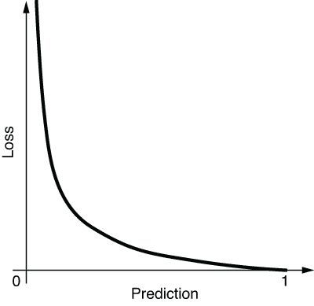

图 10.13 二元交叉熵损失（正确标签为 1）

如果您更关心模型在少数类上的表现，可以调整这个损失。具体而言，您可以更改这个损失的形状（通过简单地将其乘以一个常数），只针对那个类别，以便当模型在少数类上犯错时，它会产生更大的损失。图 10.14 中的一条调整后的损失曲线就是顶部的那条。这种加权与上采样少数类具有相同的效果，尽管修改损失的计算成本更低，因为您不需要实际增加训练数据量。

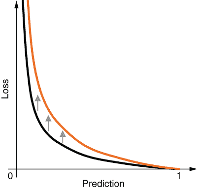

图 10.14 加权二元交叉熵损失

在 PyTorch 和 AllenNLP 中实现损失权重很容易。PyTorch 的二元交叉熵实现 BCEWithLogitsLoss 已经支持为不同类别使用不同的权重。您只需要将 pos_weight 参数作为权重传递，如下所示：

```py
>>> import torch
>>> import torch.nn as nn

>>> input = torch.randn(3)
>>> input
tensor([-0.5565,  1.5350, -1.3066])

>>> target = torch.empty(3).random_(2)
>>> target
tensor([0., 0., 1.])

>>> loss = nn.BCEWithLogitsLoss(reduction='none')
>>> loss(input, target)
tensor([0.4531, 1.7302, 1.5462])

>>> loss = nn.BCEWithLogitsLoss(reduction='none', pos_weight=torch.tensor(2.))
>>> loss(input, target)
tensor([0.4531, 1.7302, 3.0923])
```

在这段代码片段中，我们随机生成预测值（input）和真实值（target）。总共有三个实例，其中两个属于类别 0（多数类），一个属于类别 1（少数类）。我们先使用 BCEWithLogitsLoss 对象计算不加权的损失，这将返回三个损失值，每个实例一个。然后，我们通过传递权重 2 来计算加权损失——这意味着如果目标类别是正类（类别 1），则错误预测将被惩罚两倍。请注意，对应于类别 1 的第三个元素是非加权损失函数返回值的两倍。

## 10.5 超参数调整

在本章的最后一节，我们将讨论超参数调整。*超参数*是有关模型和训练算法的参数。这个术语与*参数*相对，参数是模型用于从输入中作出预测的数字。这就是我们在本书中一直称之为“魔术常数”的内容——它们类似于编程语言中的常数，尽管它们的确切值被优化自动调整，以使预测尽可能接近所需输出。

正确调整超参数对于许多机器学习模型正常工作并发挥其最高潜力至关重要，机器学习从业者花费大量时间来调整超参数。知道如何有效地调整超参数对于提高在构建自然语言处理和机器学习系统时的生产力有着巨大的影响。

### 10.5.1 超参数示例

超参数是“元”级别的参数——与模型参数不同，它们不用于进行预测，而是用于控制模型的结构以及模型的训练方式。例如，如果你正在处理词嵌入或者一个 RNN，那么用于表示单词的隐藏单元（维度）的数量就是一个重要的超参数。使用的 RNN 层数是另一个超参数。除了这两个超参数（隐藏单元和层数）之外，我们在第九章中介绍的 Transformer 模型还有一些其他参数，比如注意力头的数量和前馈网络的维度。甚至你使用的架构类型，例如 RNN 与 Transformer，也可以被视为一个超参数。

此外，您使用的优化算法也可能有超参数。例如，在许多机器学习设置中最重要的超参数之一——学习率（第 9.3.3 节），确定了每个优化步骤中调整模型参数的程度。迭代次数（通过训练数据集的次数）也是一个重要的超参数。

到目前为止，我们对这些超参数几乎没有给予任何关注，更不用说优化它们了。然而，超参数对机器学习模型的性能有着巨大的影响。事实上，许多机器学习模型都有一个“甜蜜点”超参数，使它们最有效，而使用超参数集在这个点之外可能会使模型表现不佳。

许多机器学习从业者通过手动调整超参数来调整超参数。这意味着你从一组看起来合理的超参数开始，并在验证集上测量模型的性能。然后，您稍微改变一个或多个超参数，并再次测量性能。您重复这个过程几次，直到达到“高原”，在这里任何超参数的更改都只提供了边际改进。

这种手动调整方法的一个问题是它是缓慢和随意的。假设你从一组超参数开始。你如何知道接下来应该调整哪些参数，以及多少？你如何知道何时停止？如果你有调整广泛的机器学习模型的经验，你可能对这些模型如何响应某些超参数更改有一些“直觉”，但如果没有，那就像在黑暗中射击一样。超参数调整是一个非常重要的主题，机器学习研究人员一直致力于寻找更好和更有组织的方法来优化它们。

### 10.5.2 网格搜索 vs. 随机搜索

我们明白手动优化超参数效率低下，但是我们应该如何进行优化呢？我们有两种更有组织的调整超参数的方式——网格搜索和随机搜索。

在*网格搜索*中，你只需尝试优化的超参数值的每种可能组合。例如，假设你的模型只有两个超参数——RNN 层数和嵌入维度。你首先为这两个超参数定义合理的范围，例如，层数为[1, 2, 3]，维度为[128, 256, 512]。然后，网格搜索会对每种组合进行模型验证性能的测量——(1, 128), (1, 256), (1, 512), (2, 128), . . . , (3, 512)——并简单选择表现最佳的组合。如果你将这些组合绘制在二维图上，它看起来像一个网格（见图 10.15 的示例），这就是为什么称之为*网格搜索*。

网格搜索是优化超参数的一种简单直观的方式。然而，如果你有很多超参数和/或它们的范围很大，这种方法就会失控。可能的组合数量是指数级的，这使得在合理的时间内探索所有组合变得不可能。

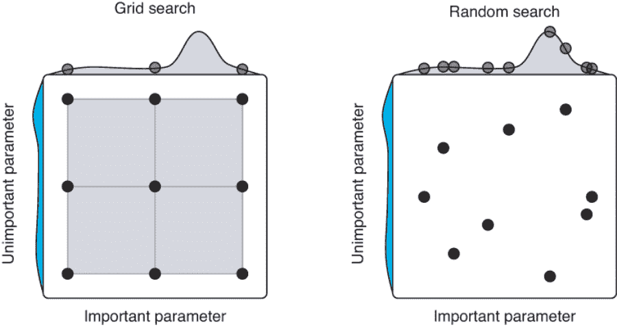

图 10.15 网格搜索与随机搜索的超参数调优比较。（摘自 Bergstra 和 Bengio，2012；[`www.jmlr.org/papers/volume13/bergstra12a/bergstra12a.pdf.`](https://www.jmlr.org/papers/volume13/bergstra12a/bergstra12a.pdf)）

比*网格搜索*更好的替代方案是*随机搜索*。在随机搜索中，你不是尝试每种可能的超参数值的组合，而是随机抽样这些值，并在指定数量的组合（称为*试验*）上测量模型的性能。例如，在上述示例中，随机搜索可以选择(2, 87), (1, 339), (2, 101), (3, 254)等，直到达到指定数量的试验为止。请参见图 10.15 的示例（右侧）。

除非你的超参数搜索空间非常小（就像第一个示例一样），如果你想要高效地优化超参数，通常建议使用随机搜索而不是网格搜索。为什么？在许多机器学习设置中，并非每个超参数都是相等的——通常只有少数几个超参数实际上对性能有影响，而其他许多超参数则不然。网格搜索会浪费大量计算资源来寻找并不真正重要的超参数组合，同时无法详细探索那些真正重要的少数超参数（图 10.15，左侧）。另一方面，随机搜索可以在性能重要的轴上探索许多可能的点（图 10.15，右侧）。请注意，随机搜索可以通过在相同的试验数量下在 x 轴上探索更多点来找到更好的模型（总共九个试验）。

### 10.5.3 使用 Optuna 进行超参数调优

好的，我们已经介绍了一些调整超参数的方法，包括手动、网格和随机搜索，但是在实践中应该如何实现呢？你可以随时编写自己的 for 循环（或者在网格搜索的情况下是“for-loops”），尽管如果你需要为每个模型和任务编写这种样板代码，这将很快变得令人厌倦。

超参数优化是一个普遍的主题，许多机器学习研究人员和工程师一直在致力于改进算法和软件库。例如，AllenNLP 有自己的库叫做*Allentune*（[`github.com/allenai/allentune`](https://github.com/allenai/allentune)），你可以很容易地将其与 AllenNLP 的训练流程集成起来。然而，在本节的剩余部分中，我将介绍另一个超参数调整库叫做*Optuna*（[`optuna.org/`](https://optuna.org/)），并展示如何将其与 AllenNLP 一起使用以优化你的超参数。Optuna 实现了最先进的算法，可以高效地搜索最优超参数，并与包括 TensorFlow、PyTorch 和 AllenNLP 在内的广泛的机器学习框架集成。

首先，我们假设你已经安装了 AllenNLP（1.0.0+）和 AllenNLP 的 Optuna 插件。你可以通过运行以下命令来安装它们：

```py
pip install allennlp
pip install allennlp_optuna
```

此外，根据官方文档的指示（[`github.com/himkt/allennlp -optuna`](https://github.com/himkt/allennlp-optuna)），你需要运行下面的代码来注册 AllenNLP 的插件：

```py
echo 'allennlp_optuna' >> .allennlp_plugins
```

我们将使用第二章中构建的基于 LSTM 的分类器对斯坦福情感树库数据集进行分类。你可以在书的代码库中找到 AllenNLP 的配置文件（[`www.realworldnlpbook.com/ch10.html#config`](http://www.realworldnlpbook.com/ch10.html#config)）。注意，你需要引用变量（std.extVar）以便 Optuna 可以控制参数。具体来说，你需要在配置文件的开头定义它们：

```py
local embedding_dim = std.parseJson(std.extVar('embedding_dim'));
local hidden_dim = std.parseJson(std.extVar('hidden_dim'));
local lr = std.parseJson(std.extVar('lr'));
```

然后，你需要告诉 Optuna 要优化哪些参数。你可以通过编写一个 JSON 文件（hparams.json ([`www.realworldnlpbook.com/ch10.html# hparams`](http://www.realworldnlpbook.com/ch10.html#hparams)）来实现这一点。你需要指定你希望 Optuna 优化的每个超参数及其类型和范围，如下所示：

```py
[
    {
        "type": "int",
        "attributes": {
            "name": "embedding_dim",
            "low": 64,
            "high": 256
        }
    },
    {
        "type": "int",
        "attributes": {
            "name": "hidden_dim",
            "low": 64,
            "high": 256
        }
    },
    {
        "type": "float",
        "attributes": {
            "name": "lr",
            "low": 1e-4,
            "high": 1e-1,
            "log": true
        }
    }
]
```

接下来，调用这个命令来开始优化：

```py
allennlp tune \
    examples/tuning/sst_classifier.jsonnet \
    examples/tuning/hparams.json \
    --include-package examples \
    --serialization-dir result \
    --study-name sst-lstm \
    --n-trials 20 \
    --metrics best_validation_accuracy \
    --direction maximize
```

注意我们正在运行 20 次试验（—n-trials），以最大化验证准确性（—metrics best_validation_accuracy）作为度量标准（—direction maximize）。如果你没有指定度量标准和方向，Optuna 默认尝试最小化验证损失。

这将需要一些时间，但是在所有试验完成后，你将看到以下优化的一行摘要：

```py
Trial 19 finished with value: 0.3469573115349682 and parameters: {'embedding_dim': 120, 'hidden_dim': 82, 'lr': 0.00011044322486693224}. Best is trial 14 with value: 0.3869209809264305.
```

最后，Optuna 支持广泛的优化结果可视化，包括非常好的等高线图（[`www.realworldnlpbook.com/ch10.html# contour)`](http://www.realworldnlpbook.com/ch10.html#contour)，但在这里我们将简单地使用其基于 Web 的仪表板快速检查优化过程。你只需要按照以下命令从命令行调用其仪表板：

```py
optuna dashboard --study-name sst-lstm --storage sqlite:///allennlp_optuna.db
```

现在，你可以访问 http:/./localhost:5006/dashboard 来查看仪表板，如图 10.16 所示。

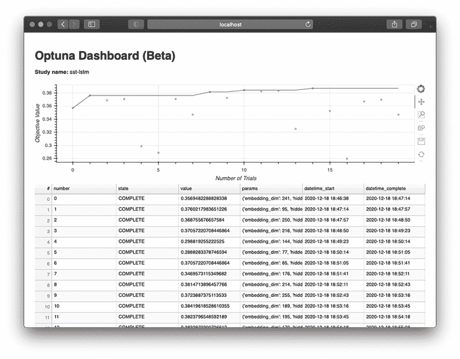

图 10.16 Optuna 仪表板显示了每个试验的参数评估指标。

从这个仪表板上，你不仅可以迅速看到最优试验是第 14 次试验，而且可以看到每次试验的最优超参数。

## 摘要

+   实例被排序、填充和批量化以进行更有效的计算。

+   子单词分词算法（如 BPE）将单词拆分成比单词更小的单元，以减轻神经网络模型中的词汇外问题。

+   正则化（如 L2 和 dropout）是一种用于鼓励机器学习中模型简单性和可泛化性的技术。

+   你可以使用数据上采样、下采样或损失权重来解决数据不平衡问题。

+   超参数是关于模型或训练算法的参数。可以通过手动、网格或随机搜索进行优化。更好的是，使用超参数优化库，如 Optuna，它与 AllenNLP 集成得很容易。

^(1.)Wu 等人，“谷歌神经机器翻译系统：填补人机翻译之间的差距”（2016）。[`arxiv.org/abs/1609.08144`](https://arxiv.org/abs/1609.08144)。

^(2.)Kudo，“Subword Regularization：使用多个子单词提高神经网络翻译模型”（2018）。[`arxiv.org/abs/1804.10959`](https://arxiv.org/abs/1804.10959)。

^(3.)Sennrich 等人，“使用子单词单元进行稀有词的神经机器翻译”（2016）。[`arxiv.org/abs/1508.07909`](https://arxiv.org/abs/1508.07909)。

^(4.)参见[`www.derczynski.com/papers/archive/BPE_Gage.pdf`](https://www.derczynski.com/papers/archive/BPE_Gage.pdf)。

^(5.)Chawla 等人，“SMOTE：合成少数类过采样技术”（2002）。[`arxiv.org/abs/1106.1813`](https://arxiv.org/abs/1106.1813)。
