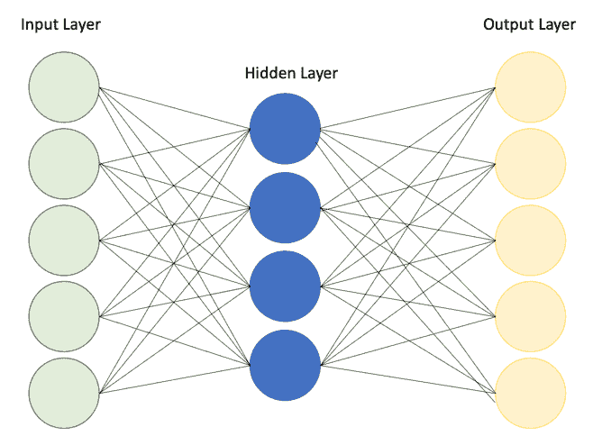
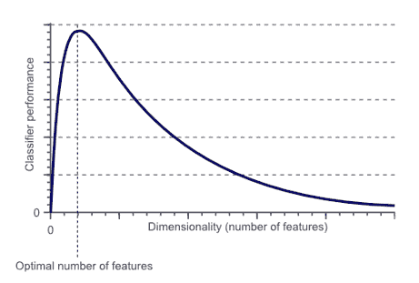
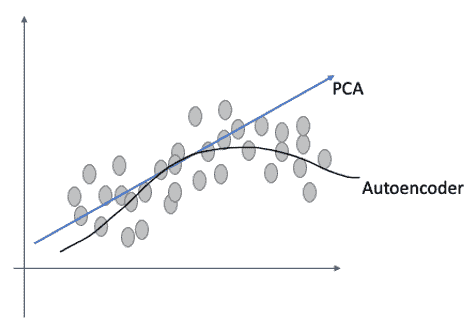
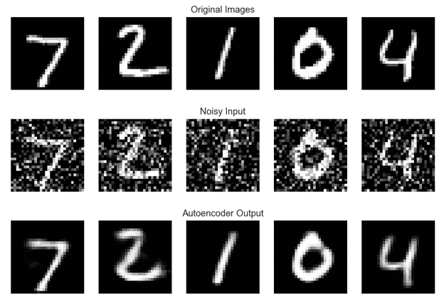
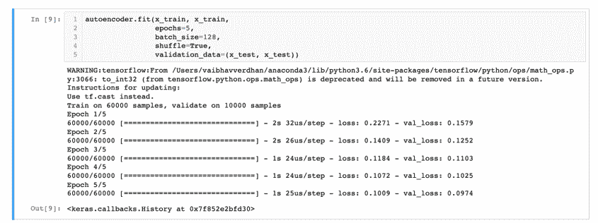

# 第九章：**9 自编码器**

“在强烈的复杂性中，简单的事物显现出来 - 温斯顿·丘吉尔”

### 本章内容包括：

+   自编码器

+   自编码器的训练

+   自编码器的类型

+   使用 tensorflow 和 keras 的 Python 代码

在书的最后一章，我们探讨了深度学习的概念。这些是使您能够掌握无监督深度学习的基础概念。因此，让我们开始无监督深度学习的第一个主题。我们从自编码器开始作为第一个主题。我们将首先介绍自编码器的基础知识，它们是什么以及我们如何训练自编码器。然后我们将进入不同类型的自编码器，然后是有关实现的 Python 代码。

欢迎来到第九章，祝你好运！

## **9.1 技术工具包**

我们将继续使用迄今为止使用的相同版本的 Python 和 Jupyter 笔记本。本章中使用的代码和数据集已经在此位置签入。

在本章中，您需要安装几个 Python 库 - tensorflow 和 keras。

让我们开始阅读书籍的第九章吧！

## **9.2 特征学习**

预测建模是一个非常有趣的话题。在各种领域和业务功能中，预测建模被用于各种目的，如预测明年业务销售额、预测预期降雨量、预测即将到来的信用卡交易是否为欺诈、预测客户是否会购买等。用例很多，上述所有用例都属于监督学习算法。

我们使用的数据集具有变量或属性。它们也被称为特征。

尽管我们希望创建这些预测模型，但我们也有兴趣了解对于进行预测有用的变量。让我们考虑一个银行想要预测即将到来的交易是否是欺诈的情况。在这种情况下，银行希望知道哪些因素是重要的，以便将即将到来的交易标识为欺诈。可能考虑的因素包括交易金额、交易时间、交易的来源/目的地等。用于进行预测的重要变量称为*显著变量*。

为了创建基于机器学习的预测模型，我们使用*特征工程*。特征工程，又称特征提取，是从原始数据中提取特征以提高模型整体质量并增强准确性的过程，与仅向机器学习模型提供原始数据的模型相比。

特征工程可以使用领域理解、各种手动方法以及一些自动化方法来完成。其中一种方法称为特征学习。特征学习是一组技术，它们帮助解决方案自动发现所需的特征检测表示。利用特征学习，不需要手动特征工程。特征学习对使用图像、文本、音频和视频的数据集的影响更加重要。

特征学习可以是有监督和无监督的。对于有监督的特征学习，神经网络是最好的例子。对于无监督的特征学习，我们有矩阵分解、聚类算法和自编码器等例子。在本书的上一章中已经详细介绍了聚类和矩阵分解。在本章中，我们将讨论自编码器。

接下来，我们将在下一节中介绍自编码器。

## 9.3 自编码器介绍

当我们开始处理任何数据科学问题时，数据起到最重要的作用。具有大量噪声的数据集是数据科学和机器学习中最大的挑战之一。现在有很多解决方案，自编码器就是其中之一。

简而言之，自编码器是一种人工神经网络，用于学习数据编码。它们通常用于降维方法。它们还可以用作生成模型，可以为我们创建类似于旧数据的合成数据。例如，如果我们没有足够的数据来训练机器学习模型，我们可以使用生成的合成数据来训练模型。

自编码器是前馈神经网络，它们将输入压缩成低维代码，然后尝试从这个表示中重建输出。自编码器的目标是学习高维数据集的低维表示（有时也称编码）。回顾一下前面章节中的主成分分析（PCA）。自编码器可以看作是 PCA 的一般化。PCA 是一种线性方法，而自编码器也可以学习非线性关系。因此，自编码器非常适合用于捕捉输入数据的最重要属性的降维解决方案。

接下来，我们将在下一节中研究自编码器的各个组成部分。

## 9.4 自编码器的组成部分

自动编码器的结构相当简单。自动编码器由三部分组成：编码器、瓶颈或代码以及解码器，如（图 9.1）所示。简单来说，编码器压缩输入数据，瓶颈或代码包含这些压缩信息，解码器解压知识，从而将数据重构回其原始形式。一旦解压完成并且数据被重构成其已编码形式，输入和输出可以进行比较。

让我们更详细地学习这些组件。

1.  **编码器**：输入数据通过编码器。编码器实际上是一个全连接的人工神经网络。它将输入数据压缩成编码表示，并且，在过程中生成的输出大大缩小。编码器将输入数据压缩成一个称为瓶颈的压缩模块。

1.  **瓶颈**：瓶颈可以称为编码器的大脑。它包含压缩的信息表示，瓶颈的工作是只允许最重要的信息通过。

1.  **解码器**：从瓶颈接收到的信息由解码器解压。它将数据重新创建为其原始或编码形式。一旦解码器完成其工作，实际值将与解码器创建的解压值进行比较。

##### 图 9.1 自动编码器的结构，包括输入层、隐藏层和输出层。



对于自动编码器，应该注意几个重要的点：

1.  在自动编码器中，当解压缩与原始输入相比时会出现信息丢失。因此，当压缩数据解压时，与原始数据相比会存在损失。

1.  自动编码器是特定于数据集的。这意味着在花朵图片上训练的算法不会在交通信号灯图片上起作用，反之亦然。这是因为自动编码器学到的特征只适用于花朵。因此，我们可以说自动编码器只能压缩与训练数据相似的数据。

1.  训练专门的算法实例以在特定类型的输入上良好执行相对较容易。我们只需要代表性的训练数据集来训练自动编码器。

我们现在已经涵盖了自动编码器的主要组件。接下来让我们进入训练自动编码器的过程。

## 9.5 自动编码器的训练

需要注意的是，如果在数据中变量之间没有相关性，那么很难对输入数据进行压缩和随后进行解压。为了创建一个有意义的解决方案，输入数据中的变量之间应该存在某种程度的关系或相关性。为了创建一个自动编码器，我们需要一个编码方法，一个解码方法和一个损失函数来比较实际值与解压值。

过程如下：

+   首先，输入数据通过编码器模块。

+   编码器将模型的输入压缩成紧凑的瓶颈。

+   瓶颈的任务是限制信息的流动，并只允许重要信息通过，因此有时将瓶颈称为*知识表示*。

+   紧随瓶颈之后的是解码器，它对信息进行解压缩，并将数据重新创建为其原始或编码形式。

+   这个编码器-解码器架构非常有效地从输入数据中获取最重要的属性。

+   解决方案的目标是生成与输入相同的输出。

通常观察到解码器架构是编码器架构的镜像。这不是强制性的，但通常会遵循。我们确保输入和输出的维度相同。

我们需要为训练自动编码器定义四个超参数：

1.  Code size: 这可能是最重要的超参数。它表示中间层中节点的数量。这决定了数据的压缩程度，也可以作为正则化项。代码大小的值越小，数据的压缩程度就越大。

1.  层数是指自动编码器的深度的参数。具有更深度的模型显然更复杂，处理时间也更长。

1.  每层的节点数是每层使用的权重。随着每个后续层的输入在层之间变小，每层的节点数通常会减少。然后在解码器中增加。

1.  最后一个超参数是所使用的损失函数。如果输入值在[0,1]范围内，首选二进制交叉熵，否则使用均方误差。

我们已经介绍了用于训练自动编码器的超参数。训练过程类似于我们在上一章中已经介绍过的反向传播。

我们现在将在下一节中介绍自动编码器的一些重要应用。

## 9.6 自动编码器的应用

自动编码器能够解决许多固有于无监督学习的问题。自动编码器的主要应用包括：

1.  降维是自动编码器的主要应用之一。有时观察到自动编码器可以学习比主成分分析和其他技术更复杂的数据投影。

1.  异常检测也是自动编码器的一种应用。错误或重建数据之间的误差（实际数据和重建数据之间的误差）可以用来检测异常。

1.  数据压缩也被认为是自动编码器的主要应用之一。但已经观察到，通过训练算法很难打败像 JPEG 这样的基本解决方案。此外，由于自动编码器是数据特定的，它们只能用于它们已经训练过的数据类型。如果我们希望增加容量以包含更多数据类型并使其更加通用，那么所需的训练数据量将会非常高，显然所需的时间也会很长。

1.  还有其他应用，比如药物发现，机器翻译，图像去噪等。但是在现实世界中，自动编码器的实际实现还不是很多。这是因为诸多原因，如数据集的不可用性，基础设施，各种系统的准备情况等。

我们现在将在下一节继续介绍自动编码器的类型。

## 9.7 自动编码器的类型

有五种主要类型的自动编码器。下面简要描述了不同类型编码器的情况。我们将本节的数学内容保持简单，并跳过幕后的数学原理，因为这些原理相当复杂难以理解。对于好奇的读者，本章的进一步阅读部分中分享了理解幕后数学原理的链接。

1.  **欠完备自动编码器**：欠完备自动编码器是自动编码器的最简单形式。它只是接受一个输入数据集，然后从压缩的瓶颈区域重新构建相同的数据集。通过根据重构误差惩罚神经网络，模型将学习数据的最重要属性。通过学习最重要的属性，模型将能够从压缩状态重构原始数据。由于在重构压缩数据时存在损失，这种损失被称为*重构*损失。

    欠完备自动编码器在本质上是无监督的，因为它们没有任何目标标签来训练。这种类型的自动编码器用于降维。回想一下第二章中我们讨论的降维（PCA），以及第六章中我们讨论的高级降维算法（t-SNE 和 MDS）。

##### 图 9.2 随着维度的增加，性能开始改善，但在一段时间后开始下降。维度灾难是一个真正的问题



使用欠完备自编码器可以进行降维，因为会创建一个压缩形式的输入数据瓶颈。可以利用网络将这种压缩数据解压缩。回想一下在第三章中我们讨论过 PCA 提供了输入变量的线性组合。要获取更多详细信息并刷新 PCA，请参阅第三章。我们知道 PCA 尝试获得一个低维超平面来描述原始数据集，而欠完备自编码器也可以学习非线性关系。我们在下图 9.3 中展示了它们之间的差异：

##### 图 9.3 PCA 是线性的，而自编码器是非线性的。这是两种算法之间的核心区别。



有趣的是，如果从欠完备自编码器中去除所有非线性激活函数，只使用线性层，那么它等价于只有 PCA。为了使自编码器能够泛化而不是记住训练数据，欠完备自编码器是受到限制的，并通过瓶颈的大小进行微调。它允许解决方案不记住训练数据并且泛化能力非常好。

如果一个机器学习模型在训练数据上表现非常好，但在未见过的测试数据上却不起作用，则称为过拟合。

1.  **稀疏自编码器**：稀疏自编码器与欠完备自编码器类似，只是它们使用了不同的方法来解决过拟合问题。在概念上，稀疏自编码器改变了每个隐藏层的节点数量并使其灵活。现在，由于不可能有一个具有这种灵活神经元数量能力的神经网络，因此为其定制了损失函数。在损失函数中，引入了一个项来捕捉激活的神经元数量。还有一个与激活的神经元数量成比例的惩罚项。激活的神经元数量越多，惩罚就越高。这个惩罚被称为*稀疏函数*。通过使用惩罚，可以减少激活的神经元数量，因此惩罚较低，网络能够解决过拟合问题。

1.  **收缩自编码器**：收缩自编码器与其他自编码器的工作原理类似。它们认为输入数据相似的部分应该被编码成相同的。因此，它们应该具有相同的潜在空间表示。这意味着输入数据和潜在空间之间不应该有太大的差异。

1.  **去噪自编码器**：去噪意味着去除噪音，这正是去噪自编码器的精确任务。它们不接受图像作为输入，而是接受图像的嘈杂版本作为输入，如下图 9.4 所示。

##### 图 9.4 原始图像，嘈杂输出和自编码器的输出



去噪自编码器中的过程如下所示。 通过向原始图像添加噪声来改变原始图像。 这个嘈杂图像被输入到编码器-解码器架构中，接收的输出与原始图像进行比较。 自编码器学习了图像的表示，该表示用于去除噪音，并且通过将输入图像映射到低维流形来实现。

##### 图 9.5：自编码器中的去噪过程。 它从原始图像开始，添加噪音产生一个嘈杂图像，然后将其输入到自编码器中。


我们可以使用去噪自编码器进行非线性降维。

1.  **变分自编码器**：在标准自编码器模型中，使用瓶颈以压缩形式表示输入。 它们是概率生成模型，只需要神经网络作为整体结构的一部分。 它们是使用期望最大化元算法进行训练的。 技术细节超出了本书的范围。

我们现在将在下一节中学习如何使用 Python 创建一个自编码器。

## 9.8 自编码器的 Python 实现

我们在这里创建了两个版本的自编码器。 代码来源于 Keras 网站的官方来源（`blog.keras.io/building-autoencoders-in-keras.html`），并已经修改以供我们使用。

步骤 1：首先，我们将导入必要的库：

```py
import keras
from keras import layers
```

步骤 2：我们在这里创建我们的网络架构

```py
# This is the size of our encoded representations
encoding_dim = 32  # 32 floats -> compression of factor 24.5, assuming the input is 784 floats

# This is our input image
input_img = keras.Input(shape=(784,))
# "encoded" is the encoded representation of the input
encoded = layers.Dense(encoding_dim, activation='relu')(input_img)
# "decoded" is the lossy reconstruction of the input
decoded = layers.Dense(784, activation='sigmoid')(encoded)

# This model maps an input to its reconstruction
autoencoder = keras.Model(input_img, decoded)
```

步骤 3：向模型添加更多细节

```py
# This model maps an input to its encoded representation
encoder = keras.Model(input_img, encoded) 

# This is our encoded (32-dimensional) input
encoded_input = keras.Input(shape=(encoding_dim,))
# Retrieve the last layer of the autoencoder model
decoder_layer = autoencoder.layers[-1]
# Create the decoder model
decoder = keras.Model(encoded_input, decoder_layer(encoded_input))

autoencoder.compile(optimizer='adam', loss='binary_crossentropy')
```

步骤 4：加载数据集

```py
(x_train, _), (x_test, _) = mnist.load_data()
```

步骤 5：创建训练和测试数据集

```py
x_train = x_train.astype('float32') / 255.
x_test = x_test.astype('float32') / 255.
x_train = x_train.reshape((len(x_train), np.prod(x_train.shape[1:])))
x_test = x_test.reshape((len(x_test), np.prod(x_test.shape[1:])))
print(x_train.shape)
print(x_test.shape)
```

步骤 6：现在适配模型

```py
autoencoder.fit(x_train, x_train,
                epochs=5,
                batch_size=128,
                shuffle=True,
                validation_data=(x_test, x_test))
```



步骤 7：在测试数据集上进行测试

```py
# Encode and decode some digits
# Note that we take them from the *test* set
encoded_imgs = encoder.predict(x_test)
decoded_imgs = decoder.predict(encoded_imgs)
```

步骤 8：并绘制结果。 您可以看到原始图像和最终输出。

```py
# Use Matplotlib (don't ask)
import matplotlib.pyplot as plt

n = 10  # How many digits we will display
plt.figure(figsize=(20, 4))
for i in range(n):
    # Display original
    ax = plt.subplot(2, n, i + 1)
    plt.imshow(x_test[i].reshape(28, 28))
    plt.gray()
    ax.get_xaxis().set_visible(False)
    ax.get_yaxis().set_visible(False)

    # Display reconstruction
    ax = plt.subplot(2, n, i + 1 + n)
    plt.imshow(decoded_imgs[i].reshape(28, 28))
    plt.gray()
    ax.get_xaxis().set_visible(False)
    ax.get_yaxis().set_visible(False)
plt.show()
```


## 9.9 思考收尾

深度学习是一个强大的工具。 有了合理的业务问题和高质量的数据集，我们可以创建许多创新解决方案。 自编码器只是这类解决方案中的一种。

在本章中，我们从特征工程开始，它允许我们从数据集中提取最重要的特征。 然后我们转向自编码器。 自编码器是一种仅用于学习未标记数据集的高效编码的神经网络类型。 自编码器可以应用于许多业务问题，如面部识别，异常检测，图像识别，药物发现，机器翻译等。

在本章中，我们涵盖了自编码器。 在下一章中，我们将讨论生成人工智能或 GenAI，这是一个热门话题。 这将是本书的第十章，也是倒数第二章。 

## 9.10 总结

+   我们在本章中学习了特征工程。 特征工程或特征提取是从原始数据中提取特征以改善模型的总体质量和增强与仅将原始数据馈送到机器学习模型相比的精度的过程。

    +   然后我们在接下来的章节中介绍了自编码器。我们在本章中学习了自编码器。自编码器是前馈神经网络，它们将输入压缩成低维代码，然后尝试从该表示重构输出。

    +   自编码器的典型架构包括编码器、瓶颈和解码器。异常检测、数据压缩和降维是自编码器的主要用途。

+   我们还涵盖了不同类型的自编码器，如欠完备、稀疏、去噪、收缩和变分自编码器。

#### 实际的下一步和建议阅读

1.  这里有一个很棒的博客 `blog.keras.io/building-autoencoders-in-keras.html`

1.  阅读 G.E.Hinton、A. Krizhevsky、S.D.Wang 撰写的关于自编码器的论文《转换自编码器》`www.cs.toronto.edu/~bonner/courses/2022s/csc2547/papers/capsules/transforming-autoencoders,-hinton,-icann-2011.pdf`

1.  阅读 Dor Bank、Naom Koenigstein、Raja Giryes 撰写的关于自编码器的论文《自编码器》`arxiv.org/abs/2003.05991`

1.  阅读 Umberto Michelucci 撰写的关于自编码器的论文《自编码器简介》`arxiv.org/abs/2201.03898`

1.  在 tensorflow 官方页面有很好的代码和数据集可用 `www.tensorflow.org/tutorials/generative/autoencoder`
